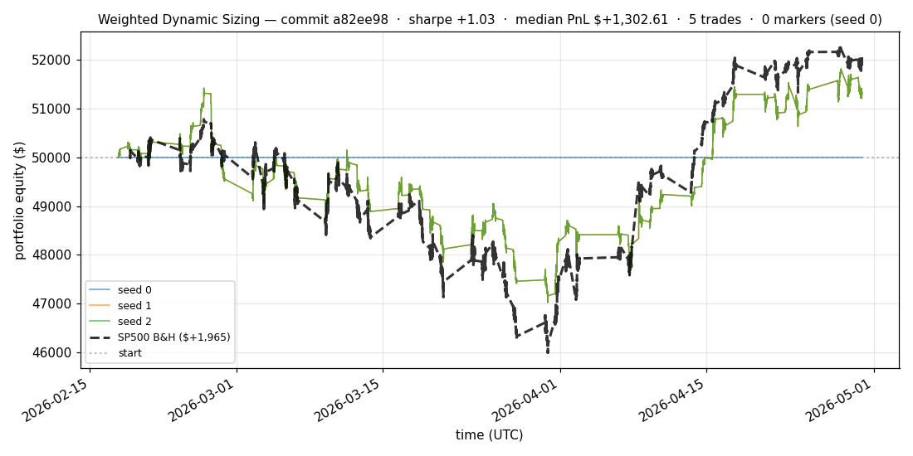
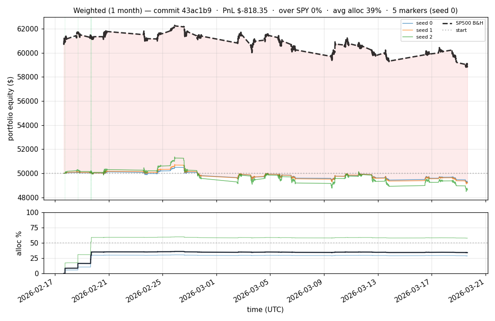
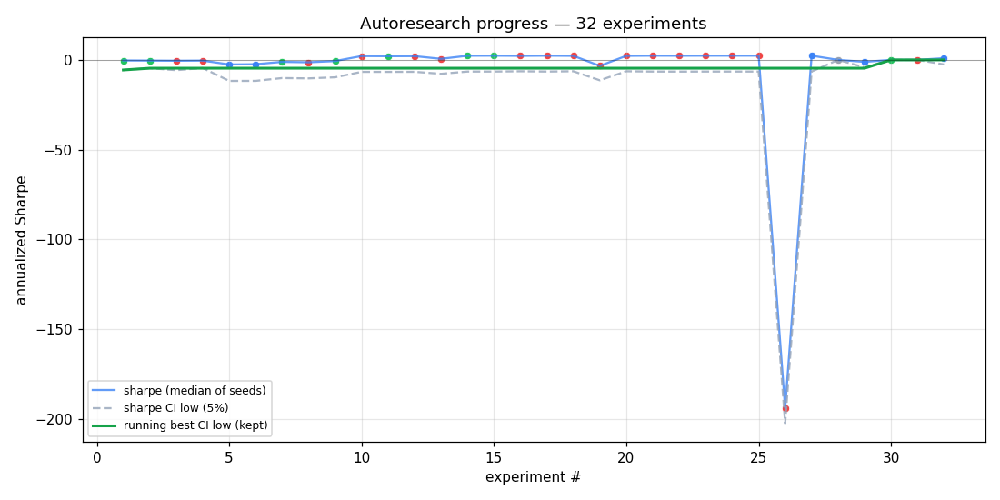

# trading-autoresearch

Karpathy-style [autoresearch](https://github.com/karpathy/autoresearch) harness, adapted for **portfolio management research**: an LLM agent autonomously iterates on a small intraday transformer + Kelly-sized policy overnight, keeping changes that robustly improve risk-adjusted returns.

## What it does

- Trains a PatchTST-style transformer on 1-minute OHLCV bars for 20 liquid US tickers.
- Predicts cumulative log-returns at 1m / 1h / 1d / 1w horizons.
- Judges a **single canonical strategy** (`top4_picker`): pick the four strongest cross-sectional names from the transformer's multi-horizon forecasts, then hold through the eval window.
- Evaluates over the most recent **90 calendar days** (held-out).
- An LLM agent (Claude in `program.md`) iterates on the model + policy overnight, gated by a Sharpe lower-CI metric and a hard -15% drawdown floor.

## Latest results

The autoresearch driver writes a fresh per-iteration report under [`iterations/`](iterations/) every run and pushes to GitHub. The block below shows the most recent iteration.

<!-- LATEST_ITER_START -->

### 🟡 LIVE — iter 162 — 528f9ec

_Started **2026-05-05 02:19 UTC** · `528f9ec` · status: **RUNNING**_

**exp162: top2 add 2d rank horizon**

Final metrics will appear here when the iteration completes (typical wall clock: 2–6 min cached pretrain, 2–3 h fresh pretrain).

### Current best (`82a4415`)

| metric | value |
|---|---|
| Sharpe (median) | **+3.214** |
| Sharpe CI low (5%) | +0.905 |
| % time above SPY | 60.220% |
| Net PnL | **$+3959.48** (+7.919%) |
| Max drawdown | -1.89% |
| Trades | 1 |
| Saved at | 2026-05-05 02:04:56 |





### Progress over all experiments



<!-- LATEST_ITER_END -->

## The canonical strategy: top4 picker

`train_and_eval()` still runs `simulate_weighted` and the full profile suite for diagnostics, but the canonical metric returned to `evaluator.py` is currently `top4_picker` when it succeeds. The top-N family became the judged strategy in exp69 because the passive variants beat SPY more reliably than the churn-heavy intraday profiles; exp89 moved the gate from top5 to top4.

For each eval run:

1. **Train** the PatchTST-style transformer on the train slice with supervised multi-horizon forecasting plus ranking loss and one RL encoder-warming pass.
2. **Precompute** all eval-slice multi-horizon predictions once per seed.
3. **Rank** symbols by predicted Sharpe over the 4-hour and 1-day horizons (`ranking_horizons=(3, 4)`).
4. **Buy** the top four names through the same `WeightedBroker` sizing and friction model used by the profile suite.
5. **Return** the top4 equity curve as the canonical result; fall back to `simulate_weighted` only if top4 simulation fails.

`simulate_weighted` remains useful as a diagnostic strategy: Kelly-sized longs, sell below zero 1-hour Sharpe, and optional swaps into stronger unheld candidates. It is not the current gate metric.

Current tuned defaults:

| Param | Value | Notes |
|---|---|---|
| `MAX_POS_FRACTION_OF_FREE_CASH` | `0.50` | exp47: smaller cap controls DD when SWAP pass is active |
| `WEIGHTED_SWAP_MARGIN` | `0.15` | exp50: slightly more rotation improved raw Sharpe but remains monitored by CI |
| `MIN_CASH_RESERVE_PCT` | `0.0` | exp72: full deployment is the current code path for top-N profiles |
| `KELLY_SCALE` | `0.5` | half-Kelly |
| `MAX_NEW_TRADES_PER_TIMESTEP` | `5` | diversify timing |
| `WEIGHTED_MIN_TRADE_USD` | `100` | below this, fee dominates |
| `ranking_horizons` | `(3, 4)` | exp71: 4-hour + 1-day combo beat either horizon alone |
| `TRAIN_LOOKBACK_DAYS` | `365` | exp41: subsetting train to recent year produced confident predictions; full 6 years made the model too uncertain to trade at all |
| `PRETRAIN_EPOCHS` | `1` | one epoch on 365 days suffices; 2 doubled wall-time without improvement |

## Reading the charts

`docs/weighted_latest.png`:

- **Each thin colored line** = one of `N_SEEDS = 3` random initializations of the same model. Cross-seed spread shows how robust the result is.
- **Thick black dashed line** = SP500 (SPY) buy-and-hold over the same window. Anything below it lost to passive.
- **Dotted gray horizontal line** at `$50,000` = starting capital.
- **Vertical green/red dotted lines** = BUY/SELL trades on seed 0 (showing all seeds is unreadable).
- **Title** shows: commit, median Sharpe + bootstrap CI low, max DD across seeds, median trade count, % time above SPY.

`docs/weighted_1m_latest.png`: same but zoomed to the first 30 days of the eval window — useful when total trades are sparse.

`docs/progress.png`:

- **Blue solid line** = median Sharpe per experiment (chronological).
- **Gray dashed line** = `sharpe_ci_low` (5% bootstrap quantile).
- **Green solid line** = running best of `sharpe_ci_low` across **kept** experiments.
- **Dot color**: green = kept, red = discarded, gray = crashed.

## What's different from Karpathy's original

| Original `autoresearch` | This repo |
|---|---|
| LLM training (`train.py` → val_bpb) | Trading model + Kelly policy (`experiment.py` → portfolio Sharpe) |
| Single deterministic metric | Multi-seed median Sharpe + bootstrap CI low |
| One file, one metric | One file, **one metric + one hard constraint** (max DD >= -15%) |
| H100 GPU expected | CPU only (M-series Macs); 3 seeds in parallel via multiprocessing |
| Data baked into prepare.py (FineWeb) | Free Alpaca IEX 1-min bars for 20 liquid US tickers, 6 years cached locally |

Three guardrails against agent overfitting to the eval window:

1. **Bootstrap CI on Sharpe** — improvements have to be statistically real.
2. **Multi-seed runs** — RL is stochastic; median of 3 seeds, not best of 3.
3. **Hard drawdown constraint** — Sharpe-only optimization can hide tail risk.

## File layout

```
prepare.py             # frozen — Alpaca data download, broker, metrics, train/eval split
experiment.py          # the file the agent edits — model + policy + train loop
evaluator.py           # frozen — runs experiment with N seeds, prints canonical metrics
autoresearch_driver.py # one iteration: run evaluator, parse, decide keep/discard, promote checkpoints
program.md             # the agent's instructions
results.tsv            # append-only public progress log (tracked)
checkpoints/           # per-seed weights from the most recent run + best/ promoted on improvement (gitignored)
docs/                  # auto-generated equity + progress charts (committed)
pyproject.toml         # uv / pip dependencies
```

## Quick start

```bash
# 1. Install (Python 3.10+; uv recommended)
pip install -e .

# 2. Set Alpaca credentials in .env (free IEX feed)
echo 'ALPACA_API_KEY=xxx'    >  .env
echo 'ALPACA_SECRET_KEY=xxx' >> .env

# 3. Cache the data (one-time, ~10 min for 20 symbols × 6 years × 1m bars)
python prepare.py

# 4. Single experiment with the current experiment.py (~30 min on M-series CPU)
.venv/bin/python evaluator.py
```

Expected output ends with:

```
--- canonical ---
sharpe:           +0.988
sharpe_ci_low:    -1.769
sharpe_ci_high:   +3.433
max_dd_pct:       -9.68
pnl_usd:          +2557.00
pnl_pct:          +5.114
trades:           4
fees_usd:         4.00
slippage_usd:     0.00
elapsed_seconds:  1848.1
seeds_completed:  3
---
```

## Running the agent loop

Per-iteration workflow (`autoresearch_driver.py`):

```bash
# 1. Edit experiment.py with your hypothesis
# 2. Commit
git commit -am "exp43: <description>"
# 3. Run one driver iteration (5h or so per iter at this scale)
.venv/bin/python autoresearch_driver.py "exp43: <description>" > /tmp/iter43.log 2>&1
```

The driver runs `evaluator.py`, parses the canonical metrics block, and:

- `max_dd_pct < -15` → **discard** (hard floor) + `git reset --hard HEAD~1`
- `sharpe_ci_low > prior best` → **keep** + promote checkpoints to `checkpoints/best/`
- otherwise → **discard** + `git reset --hard HEAD~1`

Open the repo in [Claude Code](https://claude.com/claude-code) and ask it to read `program.md` to drive the loop autonomously.

## What the agent CAN and CANNOT change

See `program.md`. Short version: the agent owns `experiment.py` (features + model + policy + training); it must NEVER touch `prepare.py` (the simulator) or `evaluator.py` (the contract). No new pip dependencies. No looking at the eval slice during training.

## The contract

`experiment.py` MUST export:

```python
def train_and_eval(seed: int) -> tuple[
    list[tuple[pd.Timestamp, float]],   # equity_curve from broker
    int,                                # n_trades
    float,                              # total_fees
    float,                              # total_slippage
    list[tuple[pd.Timestamp, str, str]],# trades [(ts, sym, "BUY"|"SELL"), ...]
    list[tuple[pd.Timestamp, float]],   # cash_curve
]: ...
```

If the signature breaks, the evaluator crashes and the experiment auto-discards.

## Memory & RAM

The 2026-04-30 OOM (single process > 140 GB on a 96 GB Mac) was fixed in commit `03f0c87`:

1. **`WindowDataset`** — lazy on-demand training-window batches. Old code pre-materialized all `(N, 128, 18)` float32 windows at once (~106 GB just for X at 6yr × 20-sym scale, then `np.concatenate` + `X[perm]` doubled it twice → ~300 GB peak). Now keeps only per-symbol `(N_bars, F)` arrays (~700 MB) and slices batches on demand.
2. **Bounded RL replay buffer** (`RL_BUFFER_MAX = 100_000` ≈ 900 MB) — `simulate(learn=True)` previously appended forever.
3. **Per-seed checkpoint save** in `train_and_eval` → `checkpoints/last_seed{seed}.pt`.

Validated: peak per-process RSS dropped from ~100 GB to **3.3 GB** at full scale; 3 parallel evaluator workers fit comfortably in ~12 GB total.

## Honest limitations

1. **CPU-only** at this scale — MPS launches add overhead that the small per-step batches (≤20 symbols) can't amortize. Each iteration ~30 min on an M-series Mac.
2. **No live trading** — paper broker only. Wiring to a real broker is left to the reader.
3. **1-minute bars are coarse** — extends to seconds with a paid feed.
4. **Eval window is 90 days** — statistical power is finite; treat any single overnight result as exploratory.
5. **The agent is biased toward what the LLM has seen in pretraining** — standard moves (LR sweeps, deeper nets, dropout) come first; novel architectures are rare.

## Inspiration

- [karpathy/autoresearch](https://github.com/karpathy/autoresearch) — the original. Read its README + `program.md` first.
- [vzeman/trading](https://github.com/vzeman/trading) — sister repo with the IBKR portfolio-management skills.

## License

MIT — copy, fork, modify, anything.

<!-- RESULTS_START -->

_Last updated: 2026-05-05 00:04 UTC_  
_Total experiments: **48**  ·  kept: **33**  ·  latest commit: `82a4415`_

### Weighted strategy — full eval window (~73 days)


### Weighted strategy — first month of eval


### Strategy vs SPY benchmark

| Strategy | Sharpe | Net PnL | PnL % | Max DD % | Trades | Fees | % time > SPY |
|---|---:|---:|---:|---:|---:|---:|---:|
| Weighted (Kelly-sized, max 20% free cash, ≤5/step) | **+3.214** 🏆 | **$+3,959.48** 🏆 | +7.919% | **-1.89%** 🏆 | 1 | **$1.00** 🏆 | **60%** 🏆 |
| **SP500 (SPY) buy-and-hold** — passive benchmark | +1.011 | $+2,017.61 | +4.035% | -9.73% | 1 | $1.00 | 0% |

**Best by Sharpe:** Weighted (Kelly-sized, max 20% free cash, ≤5/step)

### Detailed metrics — weighted strategy

| metric | value |
|---|---|
| Sharpe (median over seeds) | **+3.214** |
| Net PnL | $+3,959.48 (+7.919%) |
| Max drawdown | -1.89% |
| Trades | 1 |
| % time above SPY | 60% |
| Wall time | 363.8s |
| Seeds completed | 3 |

### Progress over all experiments


### Leaderboard (top 5 kept by Sharpe CI-low)

| # | commit | Sharpe | CI-low | DD% | PnL | Trades | Description |
|---|---|---:|---:|---:|---:|---:|---|
| 1 | `d412eeb` | +3.23 | +0.96 | -0.27 | $+573.98 | 1 | exp152: top2 with 97.5pct reserve |
| 2 | `ab6f02d` | +3.23 | +0.95 | -0.55 | $+1,147.57 | 1 | exp151: top2 with 95pct reserve |
| 3 | `b4df7c6` | +3.22 | +0.93 | -1.10 | $+2,290.62 | 1 | exp150: top2 with 90pct reserve |
| 4 | `514a197` | +3.22 | +0.91 | -1.64 | $+3,428.15 | 1 | exp149: top2 with 85pct reserve |
| 5 | `d5b40ef` | +3.21 | +0.90 | -1.91 | $+3,994.86 | 1 | exp153: SPY-alpha objective with top2 82.5pct reserve |

<!-- RESULTS_END -->
