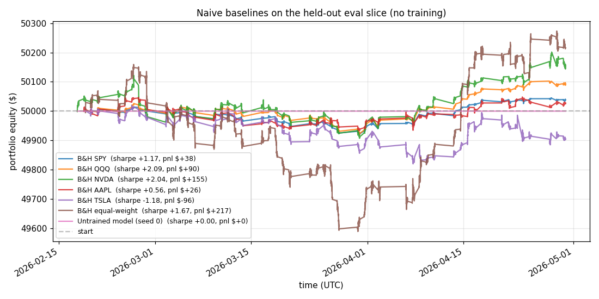
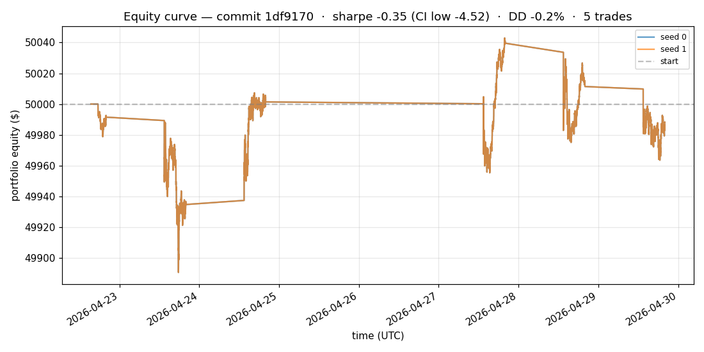
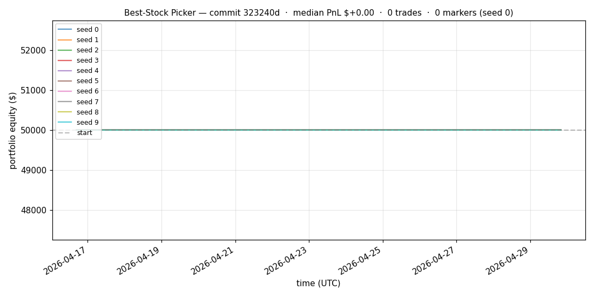

# trading-autoresearch

Karpathy-style [autoresearch](https://github.com/karpathy/autoresearch) harness, adapted for **portfolio management research**: an LLM agent autonomously iterates on a small intraday transformer + RL policy overnight, keeping changes that robustly improve risk-adjusted returns.

## Naive baselines (what to beat)

Before iterating on RL, here's what the **eval slice** looks like under naive non-model strategies. Any model worth shipping has to outperform these.



| Strategy | Sharpe | PnL | DD | Trades |
|---|---:|---:|---:|---:|
| Buy-and-hold SPY | +1.17 | +$38 | −0.2% | 1 |
| Buy-and-hold QQQ | **+2.09** | +$90 | −0.2% | 1 |
| Buy-and-hold NVDA | +2.04 | +$155 | −0.4% | 1 |
| Buy-and-hold AAPL | +0.56 | +$26 | −0.2% | 1 |
| Buy-and-hold TSLA | −1.18 | −$96 | −0.4% | 1 |
| **Buy-and-hold equal-weight all 5** | **+1.67** | **+$217** | **−1.1%** | 5 |
| **Untrained model (random init)** | 0 | $0 | 0% | **0 trades** (HOLD bias dominates) |

Key insights:
- **The bar is high**: equal-weight buy-and-hold made +$217 with sharpe +1.67. Most single names also did well (only TSLA lost).
- **The market was up** during the eval window — passive does fine. A model has to be *substantially better* than passive to justify the trading complexity + fees.
- **The untrained model trades nothing** because the action head's HOLD bias is intentionally strong (anti-churn prior). Any non-zero PnL from the trained model is genuinely from training, not from random init.

Regenerate any time: `python baselines.py`.

## Backtest strategies

The same trained model can be evaluated under different "trading strategies." Each strategy uses the model's predictions in a different way, producing a different equity curve and a different reward signal for RL. Comparing them tells us not just *whether the model is good*, but *what kind of trader it learned to be*.

### Strategy 1 (primary, used for RL training): full-portfolio every-bar

- At every 1-min bar, the policy outputs `{SELL, HOLD, BUY}` for **each of the 5 universe symbols simultaneously**.
- Position sizing: each symbol uses `notional_per_symbol_usd = $1000`. Up to $50k gross when fully deployed.
- Reward fed back to RL: `portfolio_weight × (position × log_return − cost − vol_penalty)`
- **Pros:** dense reward, easy gradient flow, all symbols active.
- **Cons:** spreads capital thin; small per-symbol edge competes with $1 fixed fees.
- **This is the strategy that drives RL learning.** The leaderboard `sharpe` metric refers to this one.

### Strategy 2 (secondary, evaluation only): **best-stock picker** ⭐ NEW

- At each bar, **rank** all 5 symbols by softmax `P(BUY)` from the model's action head.
- Buy logic: every `PICKER_BUY_COOLDOWN_S = 5min`, buy the **top-1 ranked** symbol's $1k position. Pure rank-based — works even when HOLD bias suppresses absolute BUY logits, because we only care which symbol the model likes MOST relative to others.
- Sell logic: each held position auto-exits after `PICKER_HOLD_BARS = 60` bars (1 hour). Deterministic timer — no model decision needed for exits, makes behavior independent of SELL-logit calibration.
- Concurrency cap: max `PICKER_MAX_CONCURRENT = 5` distinct positions held at once.
- **Pros:** concentration on strongest signal, lower per-trade fee drag, robust to HOLD bias, mimics a discretionary trader's workflow.
- **Cons:** tail-risk from concentration; unused capital while between buys.
- **Currently used for evaluation only.** Each experiment now produces a SECOND chart (`docs/picker_latest.png`) showing what would happen if we used the model's outputs this way.

### Strategy 3 (planned): top-K picker
At each bar pick the top **K** symbols by BUY confidence, equal-weight $X each. Smooth interpolation between strategies 1 and 2.

### Strategy 4 (planned): long/short market-neutral
Long top‑K by BUY conviction, short bottom‑K by SELL conviction, equal dollar legs. Hedges market beta — measures pure model alpha.

### Strategy 5 (planned): volatility-targeted
Size each position inversely proportional to its recent realized vol so dollar-risk per name is comparable. Dampens drawdowns from one volatile name.

### Strategy 6 (planned): pairs / spread trading
Find correlated pairs (e.g. SPY/QQQ, NVDA/AMD), trade the spread when stretched relative to model expectation. Mean-reversion alpha.

### Strategy 7 (planned): regime-switching
Different policy thresholds for different VIX regimes. Conservative when VIX > 25, aggressive when VIX < 15.

### Strategy 8 (planned): drawdown-aware sizing
Reduce position size after consecutive losses (anti-Martingale). Survives streaks; gives up some upside during winning streaks.

### Strategy 9 (planned): time-of-day filter
Trade only during specific intraday windows (avoid first/last 30 min where spreads are wide). Easy to add as a feature gate.

### Strategy 10 (planned): cross-validation across periods
Multi-window walk-forward: train on weeks 1–2, eval on week 3; train on weeks 1–3, eval on week 4; etc. Detects regime overfit.

**Why this matters for RL:** each strategy provides a different reward shape. A model that's only "okay" under strategy 1 might be excellent under strategy 2 (e.g., it correctly identifies the single best opportunity even if its average prediction is mediocre). Future RL iterations can use a **combined** reward across strategies — encouraging the model to be useful in multiple trading contexts. This is the "sweet stack" of training signals.

### Per-strategy "stickiness" parameters

Every strategy can specify a minimum time between portfolio moves to discourage over-trading and force commitment:

| Strategy | Knob | Default | What it does |
|---|---|---|---|
| Primary | `PRIMARY_MIN_HOLD_BARS` | `1` (no holding required) | After a position change, must hold ≥N bars before next change |
| Picker | `PICKER_BUY_COOLDOWN_S` | `300` (5 min) | Minimum seconds between consecutive buys |

These act as inductive priors: when a real edge exists, holding for longer is usually fine and saves fees. When there's no edge, stickiness prevents the model from churning through fees on noise. Each strategy can tune its own.

## Reading the charts

Two PNGs auto-regenerate on every experiment run:

### `docs/equity_latest.png` — equity curve

- **Each colored line is one of `N_SEEDS=10` random initializations of the same model.** Same architecture, same hyperparameters, same data — different starting weights and different RL action samples. Cross-seed variance shows how robust the result is.
- **Dashed gray horizontal line** at `$50,000` = starting capital. Anything above is profit; below is loss.
- **Vertical green dotted lines** = BUY trades on **seed 0** only (showing all 10 seeds' markers would be unreadable; seed 0 is representative).
- **Vertical red dotted lines** = SELL trades on **seed 0** only.
- **Title** shows: commit, median Sharpe + bootstrap CI low, max DD across seeds, median trade count.

A **healthy** result: lines clustered tight (low cross-seed variance), all rising above the start line, modest trade-marker density.
A **broken** result: lines fan out wildly, some up some down, dense forest of vertical markers (over-trading bleeds through fees).

### `docs/progress.png` — progress over experiments

- **Blue solid line** = median Sharpe per experiment (chronological order).
- **Gray dashed line** = `sharpe_ci_low` (5% bootstrap quantile) per experiment.
- **Green solid line** = running best of `sharpe_ci_low` across **kept** experiments — what the agent is actively ratcheting upward.
- **Dot color** per experiment: green = kept, red = discarded, gray = crashed.
- **Black horizontal line at 0** = breakeven Sharpe. Above the line = the model produces positive risk-adjusted returns on the held-out 2-week eval window.

## Latest results

<!-- RESULTS_START -->

_Last updated: 2026-04-30 10:07 UTC_  
_Total experiments: **27**  ·  kept: **7**  ·  latest commit: `323240d`_

### Latest experiment — primary strategy (full portfolio)



### Latest experiment — best-stock picker (secondary strategy)



### Strategy comparison @ this checkpoint

| Strategy | Sharpe | Net PnL | PnL % | Max DD % | Trades | Fees |
|---|---:|---:|---:|---:|---:|---:|
| Primary (full portfolio every-bar) | **+2.348** 🏆 | **$+75.39** 🏆 | +0.151% | -0.30% | 13 | $13.00 |
| Picker (best-stock, $1k cooldown 5min) | +0.000 | $+0.00 | +0.000% | **+0.00%** 🏆 | 0 | **$0.00** 🏆 |

**Best by Sharpe:** Primary (full portfolio every-bar)

### Detailed metrics — primary strategy

| metric | value |
|---|---|
| Sharpe (median over seeds) | **+2.348** |
| Sharpe — bootstrap CI low (5%) | **-6.483** |
| Sharpe — bootstrap CI high (95%) | +10.170 |
| Max drawdown | -0.30% |
| Net PnL | $+75.39 (+0.151%) |
| Trades | 13 |
| Fees / slippage | $13.00 / $2.61 |
| Wall time | 388.1s |
| Seeds completed | 10 |

### Progress over all experiments


### Leaderboard (top 5 kept by Sharpe CI-low)

| # | commit | Sharpe | CI-low | DD% | PnL | Trades | Description |
|---|---|---:|---:|---:|---:|---:|---|
| 1 | `aeff147` | -0.39 | -4.63 | -0.31 | $-13.06 | 7 | exp1: HOLD bias 3.0→1.0 — ci_low improved -5.61→-4.63, DD -9.18→-0.31% |
| 2 | `4a6dea7` | -0.32 | -5.61 | -9.18 | $-10.56 | 5 | baseline (v2 features, HOLD bias 3.0) |
| 3 | `3c5a1c7` | +2.35 | -6.48 | -0.30 | $+75.39 | 13 | exp11 KEEP 🌐 +4 context features (VIX, TLT, UUP, SPY-cross). Sharpe +2.31→+2.35. KEY: 8/10 seeds (was 5/10) converge to the better +2.348 equilibrium. Macro context steers optimization. |
| 4 | `dff38d6` | +2.31 | -6.49 | -0.30 | $+74.27 | 14 | exp10 KEEP 🎯 HOLD bias 1.0→1.5 — sharpe +2.06→+2.31, per-seed range collapsed to [+2.28,+2.35], all DDs -0.30%, trades 13-15. Two discrete equilibria. New best. |
| 5 | `8616861` | +2.06 | -6.66 | -0.32 | $+66.02 | 21 | exp7 KEEP 🚀 RL_LR 3e-5→2e-5 — ALL 10 SEEDS POSITIVE. Median sharpe +2.06, all DD ≤-0.32%, pnl +$56-$73, trades 15-27. First profitable AND stable config. |

<!-- RESULTS_END -->

```
You wake up. The agent ran 87 experiments while you slept.
The leaderboard is sorted by Sharpe lower-CI. The top three are reproducible.
```

## What's different from Karpathy's original

| Original `autoresearch` | This repo |
|---|---|
| LLM training (`train.py` → val_bpb) | Trading model + RL policy (`experiment.py` → portfolio Sharpe) |
| Single deterministic metric | Multi-seed median Sharpe + bootstrap CI lower bound |
| One file, one metric | One file, **one primary metric + one hard constraint** (max DD ≥ −10%) |
| H100 GPU expected | MPS / CUDA / CPU all fine; ~5 min per experiment on M-series MacBook |
| Data baked into prepare.py (FineWeb) | Free yfinance 1-min bars for 5 liquid US names, cached locally |

The **risk** of running an LLM agent against a backtest is overfitting to a single eval window. We push back with three guardrails:

1. **Bootstrap CI on Sharpe** — improvements have to be statistically real.
2. **Multi-seed runs** — RL is stochastic; median of 3 seeds, not best of 3.
3. **Hard drawdown constraint** — Sharpe-only optimization can hide tail risk.

## File layout

```
prepare.py     # frozen — data download, broker, metrics, train/eval split
experiment.py  # the file the agent edits — model + RL policy + train loop
evaluator.py   # frozen — runs experiment with N seeds, prints canonical metrics
program.md     # the agent's instructions (the "skill")
results.tsv    # append-only public log of every experiment (committed)
docs/          # auto-generated equity + progress charts (committed)
pyproject.toml # uv / pip dependencies
```

## Quick start

```bash
# 1. Install (Python 3.10+; uv recommended)
pip install -e .

# 2. Cache the data (one-time, ~30s for 5 symbols × 28d × 1m bars)
python prepare.py

# 3. Single experiment with the baseline experiment.py (~3-5 min on MPS)
python evaluator.py
```

Expected output ends with:

```
--- canonical ---
sharpe:           +0.123
sharpe_ci_low:    -0.456
sharpe_ci_high:   +0.789
max_dd_pct:       -1.23
pnl_usd:          +12.34
pnl_pct:          +0.025
trades:           42
fees_usd:         42.00
slippage_usd:     5.61
elapsed_seconds:  287.4
seeds_completed:  3
---
```

## Running the agent loop

Open this repo in [Claude Code](https://claude.com/claude-code) (or another agent harness with shell + edit access), then:

```
Hi, please read program.md and let's start a new autoresearch run.
```

The agent will:
- Create branch `autoresearch/<tag>`
- Initialize `results.tsv` with the header
- Run the baseline once
- Loop forever: hypothesize → edit `experiment.py` → run evaluator → keep/discard → log

It runs until you interrupt it (Ctrl-C). On wake-up, sort `results.tsv` by `sharpe_ci_low` to see what worked.

## What the agent CAN and CANNOT change

See `program.md` — short version: the agent owns `experiment.py` (features + model + policy + training); it must NEVER touch `prepare.py` (the simulator) or `evaluator.py` (the contract). Adding new pip dependencies is forbidden. There's no hard time budget per experiment, but the agent should aim for ~3 min per seed (~10 min total) so the loop iterates quickly.

## The contract

`experiment.py` MUST export:

```python
def train_and_eval(seed: int) -> tuple[
    list[tuple[pd.Timestamp, float]],   # equity curve from broker.equity_curve on EVAL slice
    int,                                  # n_trades
    float,                                # total_fees
    float,                                # total_slippage
]: ...
```

If this signature breaks, the evaluator will crash and the experiment will be auto-discarded.

## Honest limitations

1. **yfinance free tier exposes ~30d of 1-min bars** — the eval window is ~9 trading days. Statistical significance is genuinely limited; treat any single overnight result as exploratory.
2. **No live trading** — this is a research harness; the broker is a simulator. Wiring to a real broker is left to the reader.
3. **Per-tick HFT it isn't** — 1-min bars are coarse. The architecture would extend down to seconds with a paid data feed.
4. **The agent is biased toward what the LLM has seen in pretraining**; it'll suggest standard moves first (LR sweeps, deeper nets, dropout). Genuinely novel architectures are rare.

## Inspiration

- [karpathy/autoresearch](https://github.com/karpathy/autoresearch) — the original. Read his README + `program.md` first.
- [vzeman/trading](https://github.com/vzeman/trading) — sister repo with the IBKR portfolio-management skills (different focus, manual workflows).

## License

MIT — copy, fork, modify, anything.
