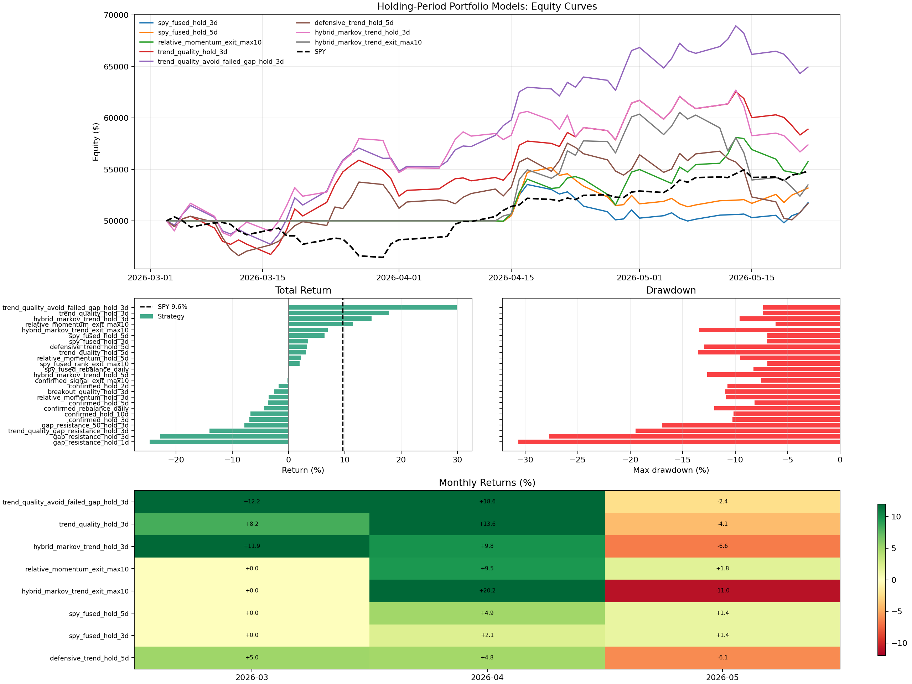

# Gap-Up Over Resistance Diagnostic

Status: research diagnostic, not live-trading approved.

This experiment keeps the existing holding-period strategy family and adds
gap-up identification. The specific pattern tested is:

```text
today_open / yesterday_close - 1 >= 1%
and
today_open > prior rolling resistance
```

Resistance is approximated as the prior rolling closing high. Two versions are
tested:

- 20-day resistance: `open > prior_20d_close_high`
- 50-day resistance: `open > prior_50d_close_high`

For same-day gap entries, returns are measured from today's open to today's
close for the entry day. This avoids counting the overnight gap as if the
strategy owned the stock before the gap happened.

## Result

Run command:

```bash
.venv/bin/python evaluate_markov_holding_periods.py \
  --dataset /Users/viktorzeman/.cache/trading-autoresearch \
  --output-dir checkpoints/transformer_15m/markov_holding_periods_gap_latest \
  --eval-start 2026-01-01 \
  --eval-end 2026-05-22
```

Chart:



Key results on the recent 2026 slice:

| strategy | return | SPY | alpha | max DD | Sharpe |
|---|---:|---:|---:|---:|---:|
| `trend_quality_avoid_failed_gap_hold_3d` | +29.90% | +9.65% | +20.25% | -7.34% | 4.14 |
| `trend_quality_hold_3d` | +17.83% | +9.65% | +8.18% | -7.36% | 2.63 |
| `gap_resistance_50_hold_3d` | -7.82% | +9.65% | -17.47% | -16.98% | -1.08 |
| `trend_quality_gap_resistance_hold_3d` | -14.05% | +9.65% | -23.70% | -19.50% | -1.83 |
| `gap_resistance_hold_3d` | -22.78% | +9.65% | -32.43% | -27.75% | -3.32 |
| `gap_resistance_hold_1d` | -24.65% | +9.65% | -34.30% | -30.65% | -3.79 |

## Interpretation

Plainly buying every gap-up over resistance did not work in this short test.
It likely chased exhausted moves after the overnight repricing already
happened.

The useful version was not "buy the gap." It was:

```text
keep the original trend-quality strategy,
but penalize/exclude stocks whose previous gap-up failed intraday
```

That variant improved the original `trend_quality_hold_3d` result from +17.83%
to +29.90% while keeping drawdown almost unchanged.

## Features Added

Daily OHLC aggregation now includes:

- `open`
- `high`
- `low`
- `prev_close`
- `gap_return = open / prev_close - 1`
- `open_to_close_return = close / open - 1`
- `intraday_range = high / low - 1`

Gap/resistance features:

- `gap_return_prev`
- `gap_followthrough_prev`
- `gap_failed_prev`
- `gap_up_count_20_prev`
- `gap_success_rate_20_prev`
- `gap_over_resistance_20`
- `gap_over_resistance_50`

New strategy variants:

- `gap_resistance_hold_1d`
- `gap_resistance_hold_3d`
- `gap_resistance_50_hold_3d`
- `trend_quality_gap_resistance_hold_3d`
- `trend_quality_avoid_failed_gap_hold_3d`

## Next Step

Do not promote the +29.90% result directly. It is one recent slice and could be
overfit. The next check should run walk-forward validation on:

1. Original `trend_quality_hold_3d`.
2. `trend_quality_avoid_failed_gap_hold_3d`.
3. Same rule with different failed-gap penalties.
4. Same rule with 0.5%, 1.0%, and 1.5% gap thresholds.

