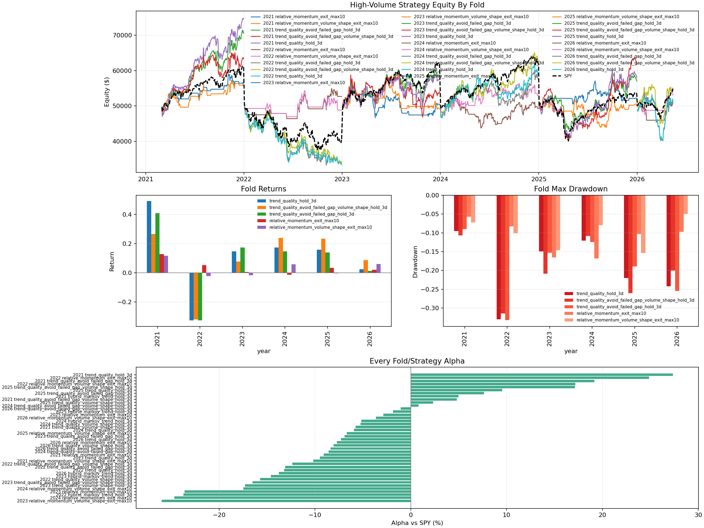
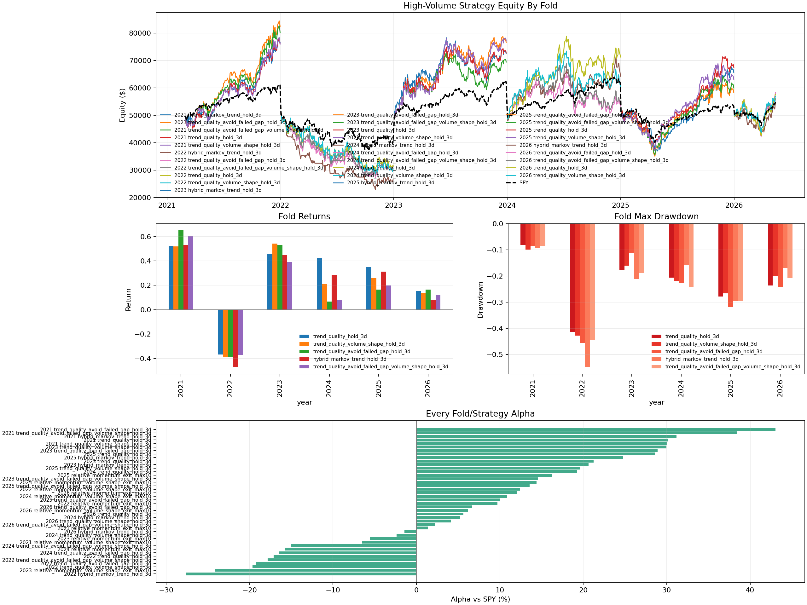

# Liquid Multi-Year Volume Strategy

Status: useful improvement, not live-trading approved.

This experiment keeps the original holding-period strategy family, but only
allows trades in stocks with higher recent transaction volume. The goal was to
test whether the earlier strategy failures were partly caused by trading lower
liquidity symbols.

Two liquid-universe definitions were tested across 2021 through 2026 YTD:

1. `liquid20m`: the 40-symbol shared 15-minute dataset, filtered each day to
   symbols with prior 20-day median daily dollar volume of at least
   `$20,000,000`.
2. `top10`: the prebuilt top-10 volume-and-valuation dataset.

The strict `top10` universe gave the better result. It improved consistency
versus the broader `$20M` liquidity threshold, but 2022 still failed for the
trend-heavy variants and drawdowns remain too large for live use.

Latest iteration: volume-shape features were added as an additional signal.
They help in some regimes, but should be treated as an ensemble feature rather
than a blanket replacement for the original trend-quality score.

## Winning Configuration So Far

Best average alpha in the strict liquid test:

| strategy | universe | avg return | avg alpha vs SPY | SPY-beating folds | worst alpha | worst DD |
|---|---|---:|---:|---:|---:|---:|
| `trend_quality_hold_3d` | top10 volume/value | +25.65% | +14.61% | 5 / 6 | -17.14% | -41.50% |
| `trend_quality_volume_shape_hold_3d` | top10 volume/value | +21.34% | +10.30% | 4 / 6 | -19.64% | -42.85% |
| `trend_quality_avoid_failed_gap_hold_3d` | top10 volume/value | +19.87% | +8.83% | 4 / 6 | -19.20% | -45.73% |
| `hybrid_markov_trend_hold_3d` | top10 volume/value | +19.81% | +8.77% | 4 / 6 | -27.67% | -54.78% |
| `trend_quality_avoid_failed_gap_volume_shape_hold_3d` | top10 volume/value | +17.03% | +5.99% | 4 / 6 | -17.83% | -44.57% |
| `relative_momentum_exit_max10` | top10 volume/value | +14.05% | +3.01% | 4 / 6 | -15.71% | -23.32% |
| `relative_momentum_volume_shape_exit_max10` | top10 volume/value | +13.24% | +2.20% | 4 / 6 | -24.20% | -18.68% |

The broader `$20M` daily-dollar-volume threshold was weaker:

| strategy | universe | avg return | avg alpha vs SPY | SPY-beating folds | worst alpha | worst DD |
|---|---|---:|---:|---:|---:|---:|
| `trend_quality_hold_3d` | 40-symbol `$20M` filter | +11.20% | +0.16% | 2 / 6 | -13.23% | -32.99% |
| `trend_quality_avoid_failed_gap_volume_shape_hold_3d` | 40-symbol `$20M` filter | +9.84% | -1.20% | 3 / 6 | -16.53% | -31.44% |
| `trend_quality_avoid_failed_gap_hold_3d` | 40-symbol `$20M` filter | +9.35% | -1.69% | 2 / 6 | -13.11% | -33.21% |
| `relative_momentum_exit_max10` | 40-symbol `$20M` filter | +3.86% | -7.18% | 1 / 6 | -24.66% | -16.82% |
| `relative_momentum_volume_shape_exit_max10` | 40-symbol `$20M` filter | +3.24% | -7.80% | 1 / 6 | -25.98% | -15.39% |
| `trend_quality_volume_shape_hold_3d` | 40-symbol `$20M` filter | +2.75% | -8.29% | 1 / 6 | -17.28% | -34.83% |
| `hybrid_markov_trend_hold_3d` | 40-symbol `$20M` filter | +2.02% | -9.02% | 1 / 6 | -23.71% | -43.55% |

## Year Results

Strict top-10 universe:

| year | best strategy | return | SPY | alpha | max DD |
|---:|---|---:|---:|---:|---:|
| 2021 | `trend_quality_avoid_failed_gap_hold_3d` | +64.96% | +21.93% | +43.03% | -8.44% |
| 2022 | `relative_momentum_volume_shape_exit_max10` | -7.03% | -19.46% | +12.43% | -14.84% |
| 2023 | `trend_quality_volume_shape_hold_3d` | +54.26% | +24.29% | +29.97% | -16.09% |
| 2024 | `trend_quality_hold_3d` | +42.51% | +23.29% | +19.22% | -20.66% |
| 2025 | `trend_quality_hold_3d` | +35.02% | +6.41% | +28.62% | -27.86% |
| 2026 YTD | `relative_momentum_exit_max10` | +21.86% | +9.78% | +12.07% | -2.82% |

Broader `$20M` liquidity-filter universe:

| year | best strategy | return | SPY | alpha | max DD |
|---:|---|---:|---:|---:|---:|
| 2021 | `trend_quality_hold_3d` | +49.28% | +21.93% | +27.35% | -9.53% |
| 2022 | `relative_momentum_exit_max10` | +5.38% | -19.46% | +24.85% | -8.24% |
| 2023 | `trend_quality_avoid_failed_gap_hold_3d` | +17.39% | +24.29% | -6.89% | -15.26% |
| 2024 | `trend_quality_avoid_failed_gap_volume_shape_hold_3d` | +24.11% | +23.29% | +0.82% | -10.86% |
| 2025 | `trend_quality_avoid_failed_gap_volume_shape_hold_3d` | +23.55% | +6.41% | +17.15% | -26.03% |
| 2026 YTD | `trend_quality_avoid_failed_gap_volume_shape_hold_3d` | +8.73% | +9.78% | -1.05% | -20.03% |

## Charts

Broad `$20M` liquidity filter:



Strict top-10 volume-and-valuation universe:



## Feature And Filter Changes

Added daily `dollar_volume = close * volume` to the daily frame.

Added leak-resistant liquidity feature:

```text
median_dollar_volume_20_prev =
  median(close * volume over the previous 20 trading days)
```

The liquidity filter is applied after feature generation and before portfolio
simulation, so the strategy only chooses symbols that were liquid before the
trade day.

Added a leak-resistant volume-shape score:

```text
volume_shape_score =
  0.30 * z(avg_volume_5_prev / avg_volume_20_prev)
+ 0.25 * z(avg_dollar_volume_5_prev / avg_dollar_volume_20_prev)
+ 0.25 * z(ret_5_prev * avg_volume_5_prev / avg_volume_20_prev)
+ 0.15 * z(previous_day_volume / avg_volume_20_prev)
- 0.20 * z(max(previous_day_volume / avg_volume_20_prev - 2.5, 0))
```

New strategy variants:

- `trend_quality_volume_shape_hold_3d`
- `trend_quality_avoid_failed_gap_volume_shape_hold_3d`
- `relative_momentum_volume_shape_exit_max10`

Interpretation: constructive volume build-up can help confirm trend, but a
single extreme volume spike is penalized because it often appears near crowded
short-term moves.

## Reproduce

Broad liquid universe:

```bash
.venv/bin/python evaluate_liquid_holding_multiyear.py \
  --dataset checkpoints/transformer_15m/shared_15m_40sym_algo.parquet \
  --output-dir checkpoints/transformer_15m/liquid_holding_multiyear \
  --years 2021,2022,2023,2024,2025,2026 \
  --final-eval-end 2026-05-14 \
  --min-median-dollar-volume 20000000
```

Strict top-10 universe:

```bash
.venv/bin/python evaluate_liquid_holding_multiyear.py \
  --dataset checkpoints/transformer_15m/shared_15m_top10_volume_valuation_algo.parquet \
  --output-dir checkpoints/transformer_15m/liquid_holding_multiyear_top10 \
  --years 2021,2022,2023,2024,2025,2026 \
  --final-eval-end 2026-05-14 \
  --min-median-dollar-volume 0
```

Artifacts:

- `checkpoints/transformer_15m/liquid_holding_multiyear/liquid_multiyear_results.csv`
- `checkpoints/transformer_15m/liquid_holding_multiyear/liquid_multiyear_equity_curves.csv`
- `checkpoints/transformer_15m/liquid_holding_multiyear/liquid_multiyear_trades.csv`
- `checkpoints/transformer_15m/liquid_holding_multiyear_top10/liquid_multiyear_results.csv`
- `checkpoints/transformer_15m/liquid_holding_multiyear_top10/liquid_multiyear_equity_curves.csv`
- `checkpoints/transformer_15m/liquid_holding_multiyear_top10/liquid_multiyear_trades.csv`

## Conclusion

Liquidity matters. The strict top-10 universe was much stronger than the broad
`$20M` filter and produced a candidate that beat SPY in five of six yearly
folds. Volume shape adds useful information, especially for selecting which
strategy should be trusted in specific regimes, but it did not beat the
original `trend_quality_hold_3d` on average in the strict top-10 universe.

The strategy is still not tradable-ready because the 2022 down-market fold
created large losses and trend-heavy variants had drawdowns above 40%.

The next necessary improvement is an adaptive market-risk gate: when the broad
market is falling, the strategy should either switch to the lower-turnover
relative-momentum exit model, reduce exposure, or hold cash.
