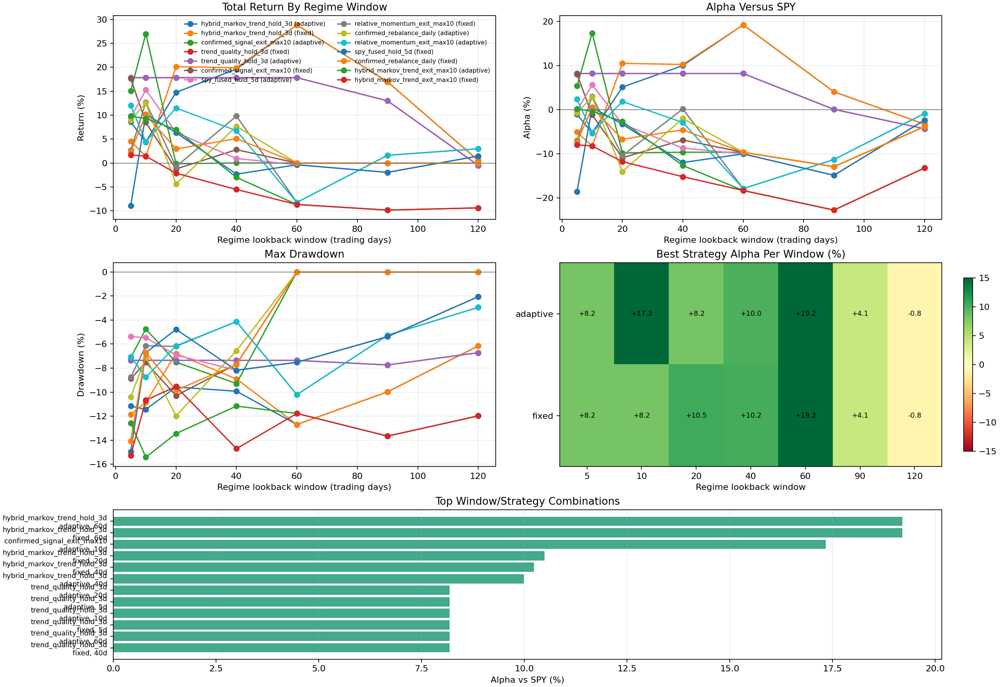

# Markov Regime Window Sweep

Status: research diagnostic, not live-trading approved.

This experiment compares different lookback windows used to segment each stock
into bull, sideways, or bear regimes before estimating the Markov transition
matrix. The goal is to see whether the portfolio behavior is stable or highly
sensitive to the regime-definition window.

## What Was Swept

Script:

```bash
.venv/bin/python sweep_markov_regime_windows.py \
  --dataset /Users/viktorzeman/.cache/trading-autoresearch \
  --output-dir checkpoints/transformer_15m/markov_regime_window_sweep \
  --eval-start 2026-01-01 \
  --eval-end 2026-05-22
```

Windows tested:

```text
5, 10, 20, 40, 60, 90, 120 trading days
```

Regime sources tested:

- `adaptive`: expanding quantile regime labels when enough history exists,
  falling back to manual labels where adaptive labels are not available.
- `fixed`: manual threshold labels using fixed bull/bear return thresholds.

Strategies compared:

- `confirmed_rebalance_daily`
- `confirmed_signal_exit_max10`
- `spy_fused_hold_5d`
- `relative_momentum_exit_max10`
- `trend_quality_hold_3d`
- `hybrid_markov_trend_hold_3d`
- `hybrid_markov_trend_exit_max10`

## Chart



Artifacts:

- `checkpoints/transformer_15m/markov_regime_window_sweep/window_sweep_results.csv`
- `checkpoints/transformer_15m/markov_regime_window_sweep/window_sweep_configs.json`
- `checkpoints/transformer_15m/markov_regime_window_sweep/summary.json`
- `docs/markov_regime_window_sweep.png`

## Top Results

SPY returned +9.65% on the comparable 2026 active window for the main folds.

| rank | regime source | window | strategy | return | alpha vs SPY | max DD | Sharpe |
|---:|---|---:|---|---:|---:|---:|---:|
| 1 | adaptive | 60d | `hybrid_markov_trend_hold_3d` | +28.85% | +19.20% | -12.70% | 3.53 |
| 2 | fixed | 60d | `hybrid_markov_trend_hold_3d` | +28.85% | +19.20% | -12.70% | 3.53 |
| 3 | adaptive | 10d | `confirmed_signal_exit_max10` | +26.99% | +17.34% | -4.75% | 4.55 |
| 4 | fixed | 20d | `hybrid_markov_trend_hold_3d` | +20.14% | +10.49% | -6.79% | 2.68 |
| 5 | fixed | 40d | `hybrid_markov_trend_hold_3d` | +19.89% | +10.24% | -8.91% | 2.76 |
| 6 | adaptive | 40d | `hybrid_markov_trend_hold_3d` | +19.64% | +9.99% | -9.93% | 2.70 |
| 7 | many | 5d-60d | `trend_quality_hold_3d` | +17.83% | +8.18% | -7.36% | 2.63 |

## Interpretation

The regime window matters. Markov-sensitive strategies changed from negative to
strongly positive depending on the segmentation window.

Best raw result:

- `hybrid_markov_trend_hold_3d`
- 60-day regime window
- +28.85% return, +19.20% alpha versus SPY
- max drawdown -12.70%

Best cleaner drawdown result among the top strategies:

- `confirmed_signal_exit_max10`
- adaptive 10-day regime window
- +26.99% return, +17.34% alpha versus SPY
- max drawdown -4.75%

Important caveat:

- The adaptive 60-day run had `raw_valid_regime_rows = 0`, which means the
  adaptive quantile label did not have enough history and the model effectively
  fell back to fixed/manual states. That is why adaptive 60d and fixed 60d are
  identical. Treat the 60-day result as a fixed/manual-window candidate, not as
  proof that adaptive labeling is better.

Control observation:

- `trend_quality_hold_3d` is mostly invariant to regime window because it is a
  pure cross-sectional trend-quality selector. It is included as a control and
  remains a robust baseline at +17.83% over the main active slice.

## Next Decision

Do not pick the highest single run blindly. The next validation branch should
test these three candidates in a walk-forward setting:

1. `confirmed_signal_exit_max10`, adaptive 10-day segmentation.
2. `hybrid_markov_trend_hold_3d`, fixed/manual 20-day segmentation.
3. `hybrid_markov_trend_hold_3d`, fixed/manual 60-day segmentation.

Selection should happen on past folds only, then evaluate on unseen later folds.
The 60-day candidate is attractive but has the larger drawdown; the adaptive
10-day candidate has the cleaner risk profile in this short 2026 slice.

