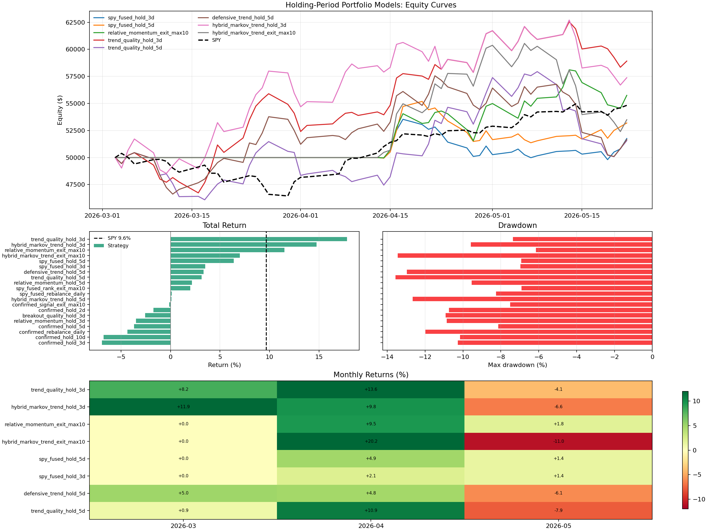

# Next Possible Strategy: Trend-Quality Holding Portfolio

Status: promising research candidate, not live-trading approved.

The latest holding-period experiment suggests the next practical branch should
be a simple cross-sectional trend-quality portfolio rather than another pure
Markov/Jepa forecasting run. On the recent 2026 slice, the strongest result was
`trend_quality_hold_3d`: +17.83% portfolio return versus +9.65% for SPY, with
-7.36% max drawdown.

This strategy is intentionally simple:

1. Build daily features from the latest intraday cache.
2. Rank stocks cross-sectionally using only information available before the
   target day.
3. Buy the top three candidates.
4. Hold each entry for three trading days.
5. Re-rank and rotate after the holding period.

## Current Result

Test window: effective active period from March 2026 through 2026-05-22. The
script starts at 2026-01-01, but the adaptive Markov family requires enough
history before it emits comparable signals.

| rank | model / strategy | return | alpha vs SPY | max DD | Sharpe | avg hold |
|---:|---|---:|---:|---:|---:|---:|
| 1 | `trend_quality_hold_3d` | +17.83% | +8.18% | -7.36% | 2.63 | 2.80d |
| 2 | `hybrid_markov_trend_hold_3d` | +14.76% | +5.11% | -9.58% | 2.00 | 2.80d |
| 3 | `relative_momentum_exit_max10` | +11.49% | +1.85% | -6.15% | 2.35 | 7.00d |
| benchmark | SPY buy-and-hold | +9.65% | baseline | | 2.83 | |

Chart:



Artifacts:

- `checkpoints/transformer_15m/markov_holding_periods_latest/summary.json`
- `checkpoints/transformer_15m/markov_holding_periods_latest/leaderboard.csv`
- `checkpoints/transformer_15m/markov_holding_periods_latest/equity_curves.csv`
- `checkpoints/transformer_15m/markov_holding_periods_latest/trades.csv`
- `checkpoints/transformer_15m/markov_holding_periods_latest/monthly_returns.csv`

## Feature Definition

All features are shifted so the score for day `t` uses only data known before
day `t`.

`trend_quality_score` combines:

- recent 5-day return,
- recent 20-day return,
- price position inside the recent 20-day range,
- a penalty for 20-day realized volatility.

The current implementation uses cross-sectional z-scores per date:

```text
trend_quality_score =
  0.40 * z(ret_5_prev)
+ 0.35 * z(ret_20_prev)
+ 0.25 * z(range_pos_20_prev)
- 0.35 * z(vol_20_prev)
```

The related variants are:

- `relative_momentum`: stock return minus SPY return, penalized for volatility.
- `breakout_quality`: proximity to a 20-day high plus volume confirmation.
- `defensive_trend`: relative strength with a stronger volatility penalty.
- `hybrid_markov_trend`: adaptive Markov signal blended with trend and relative
  momentum.

## Trading Rule Candidate

Candidate rule for the next branch:

1. Universe: current liquid cached S&P 500 symbols, excluding SPY as an entry.
2. Signal: `trend_quality_score > 0`.
3. Portfolio: top three ranked symbols.
4. Holding period: three trading days.
5. Weighting: equal weight, 100% gross exposure while active.
6. Cost model: 8 bps roundtrip cost in the current research script.
7. Benchmark: SPY buy-and-hold over the same active dates.

The lower-drawdown alternative to keep on the shortlist is
`relative_momentum_exit_max10`. It returned less than `trend_quality_hold_3d`
but had better max drawdown in the recent test.

## Reproduce

```bash
.venv/bin/python evaluate_markov_holding_periods.py \
  --dataset /Users/viktorzeman/.cache/trading-autoresearch \
  --output-dir checkpoints/transformer_15m/markov_holding_periods_latest \
  --eval-start 2026-01-01 \
  --eval-end 2026-05-22
```

The implementation lives in:

- `evaluate_markov_holding_periods.py`
- `evaluate_markov_regime_quant_strategy.py`

## Why This Is Next

The experiment changed the conclusion from "train longer" to "improve the
portfolio rule and feature family":

- Pure Markov rebalance was negative on the recent slice.
- Markov with SPY gating improved drawdown but still trailed SPY.
- Trend-quality and Markov+trend hybrids beat SPY on the recent slice.
- Holding period mattered: three days worked better than daily churn or longer
  five-day holds for the best trend-quality score.

This points to a practical next experiment: validate whether short holding
periods plus trend-quality ranking survive walk-forward testing.

## Required Validation Before Paper Trading

Do not promote this to a tradable model until it passes these gates:

1. Walk-forward folds across multiple years, not just 2026 YTD.
2. Frozen parameter selection: choose the scoring formula and holding period on
   past folds only, then test on later unseen folds.
3. Transaction-cost stress: 8 bps, 15 bps, and 25 bps roundtrip.
4. Concentration stress: max trades per symbol, symbol cooldown, and sector
   concentration limits.
5. Down-market stress: verify behavior when SPY is falling and when volatility
   is high.
6. Live paper trading: compare realized fills and slippage against the backtest.

## Next Implementation Steps

1. Add walk-forward evaluation for `trend_quality_hold_3d`,
   `hybrid_markov_trend_hold_3d`, and `relative_momentum_exit_max10`.
2. Add SPY/cash as an explicit idle allocation instead of treating no-position
   days as flat cash only.
3. Add volatility targeting so the strategy can reduce exposure when recent
   portfolio volatility rises.
4. Add a drawdown cooldown: reduce or stop exposure after portfolio drawdown
   breaches a calibrated threshold.
5. Compare equal-weight top three against volatility-weighted top three.

