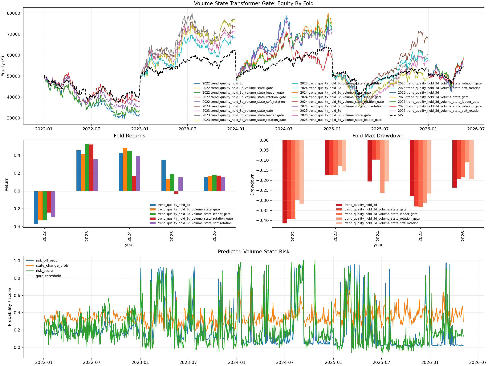
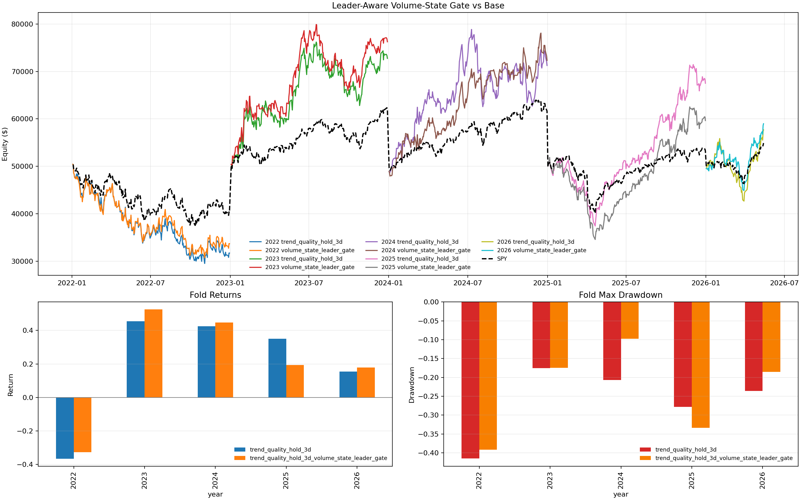

# Volume-State Transformer Gate

Status: useful risk-control experiment, not live-trading approved.

This experiment trains a separate iTransformer-style market-state model from
recent market-wide volume-shape sequences. The model does not pick stocks
directly. It predicts whether the market is likely entering a risky or changing
state, then shifts that prediction forward one trading session and uses it as a
risk gate for `trend_quality_hold_3d`.

## Model

Implementation: `train_volume_state_transformer.py`

Dataset: `checkpoints/transformer_15m/shared_15m_top10_volume_valuation_algo.parquet`

Walk-forward folds: 2022, 2023, 2024, 2025, and 2026 YTD. Each fold trains only
on samples before that year and tests the unseen year.

Architecture:

- iTransformer-style encoder.
- Variables are tokens.
- Each token embeds a 40-trading-day history.
- Transformer encoder: 2 layers, 4 heads, 64 hidden units.
- Multi-task heads:
  - `risk_off_prob`
  - `state_change_prob`
  - predicted 5-day SPY return

Final gate used for the chart:

```text
volume_state_risk_score =
  0.70 * risk_off_prob
+ 0.30 * state_change_prob
- 0.20 * tanh(predicted_5d_spy_return * 20)
```

The selected threshold was `0.80`, chosen after a post-training threshold sweep
over the saved fold predictions.

Latest iteration: added a leader-aware action layer. It distinguishes:

- broad liquidation risk: reduce/block risk,
- leader-rotation risk: stay with the original top-leader strategy when the
  current top candidates still have strong relative momentum.

The final leader-aware rule gates only when:

```text
volume_state_risk_score >= 0.80
and top_3_trend_quality_relative_momentum_mean < 0.24
```

## Input Features

The model uses market-wide daily aggregates, mostly derived from volume shape:

- equal-weight market return,
- positive-return breadth,
- return dispersion,
- average 5-day / 20-day volume ratio,
- cross-sectional volume-ratio dispersion,
- 90th percentile volume-ratio expansion,
- average 5-day / 20-day dollar-volume ratio,
- dollar-volume-ratio dispersion,
- 90th percentile dollar-volume-ratio expansion,
- mean and 90th percentile blowoff-volume spike,
- up-dollar-volume share,
- down-dollar-volume share,
- correlation between stock returns and volume expansion,
- average gap,
- average intraday range,
- SPY 1-day, 5-day, and 20-day returns,
- SPY 10-day realized volatility.

## Results

| year | base return | hard-gated return | leader-gated return | SPY | base alpha | leader alpha | base DD | leader DD |
|---:|---:|---:|---:|---:|---:|---:|---:|---:|
| 2022 | -36.60% | -32.64% | -32.64% | -19.46% | -17.14% | -13.18% | -41.50% | -39.14% |
| 2023 | +45.51% | +41.32% | +52.52% | +24.29% | +21.22% | +28.23% | -17.57% | -17.43% |
| 2024 | +42.51% | +48.35% | +44.65% | +23.29% | +19.22% | +21.36% | -20.66% | -9.74% |
| 2025 | +35.02% | +13.36% | +19.29% | +6.41% | +28.62% | +12.89% | -27.86% | -33.39% |
| 2026 YTD | +15.41% | +16.82% | +17.95% | +9.78% | +5.62% | +8.17% | -23.63% | -18.51% |

Aggregate:

| strategy | avg return | avg alpha | SPY-beating folds | worst alpha | avg DD | worst DD |
|---|---:|---:|---:|---:|---:|---:|
| `trend_quality_hold_3d` | +20.37% | +11.51% | 4 / 5 | -17.14% | -26.24% | -41.50% |
| `trend_quality_hold_3d_volume_state_gate` | +17.44% | +8.58% | 4 / 5 | -13.18% | -23.76% | -39.14% |
| `trend_quality_hold_3d_volume_state_leader_gate` | +20.35% | +11.49% | 4 / 5 | -13.18% | -23.64% | -39.14% |

Chart:



Focused leader-aware comparison:



## Interpretation

The transformer learned a useful risk signal, but a hard cash gate was too
blunt. It reduced average drawdown and improved 2022, 2024, and 2026, but it
over-protected in 2025 and missed a large part of the trend-quality gain.

The leader-aware gate is better balanced. It preserved almost the same average
return and alpha as the base strategy while improving worst alpha and worst
drawdown:

```text
base:        avg alpha +11.51%, worst alpha -17.14%, worst DD -41.50%
leader gate: avg alpha +11.49%, worst alpha -13.18%, worst DD -39.14%
```

The signal should not replace the strategy yet. It is better treated as a
portfolio-management feature:

- use it to reduce exposure instead of fully blocking entries,
- keep leader-rotation trades when top candidates still show strong relative
  momentum,
- calibrate the gate threshold and leader-strength threshold using only prior
  folds,
- add intraday volume-curve features before using it for 15-minute trading.

## Reproduce

```bash
.venv/bin/python train_volume_state_transformer.py \
  --dataset checkpoints/transformer_15m/shared_15m_top10_volume_valuation_algo.parquet \
  --output-dir checkpoints/transformer_15m/volume_state_transformer_gate \
  --years 2022,2023,2024,2025,2026 \
  --epochs 24 \
  --gate-threshold 0.80 \
  --risk-threshold 0.80 \
  --leader-min-relative-strength 0.24 \
  --device auto
```

Artifacts:

- `checkpoints/transformer_15m/volume_state_transformer_gate/volume_state_transformer_results.csv`
- `checkpoints/transformer_15m/volume_state_transformer_gate/volume_state_transformer_curves.csv`
- `checkpoints/transformer_15m/volume_state_transformer_gate/volume_state_transformer_predictions.csv`
- `checkpoints/transformer_15m/volume_state_transformer_gate/threshold_sweep.csv`
- `checkpoints/transformer_15m/volume_state_transformer_gate/threshold_sweep_summary.csv`
