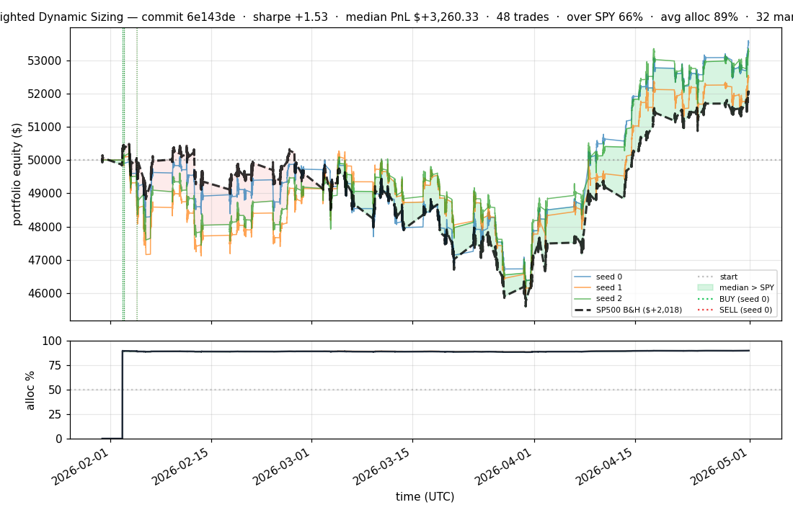
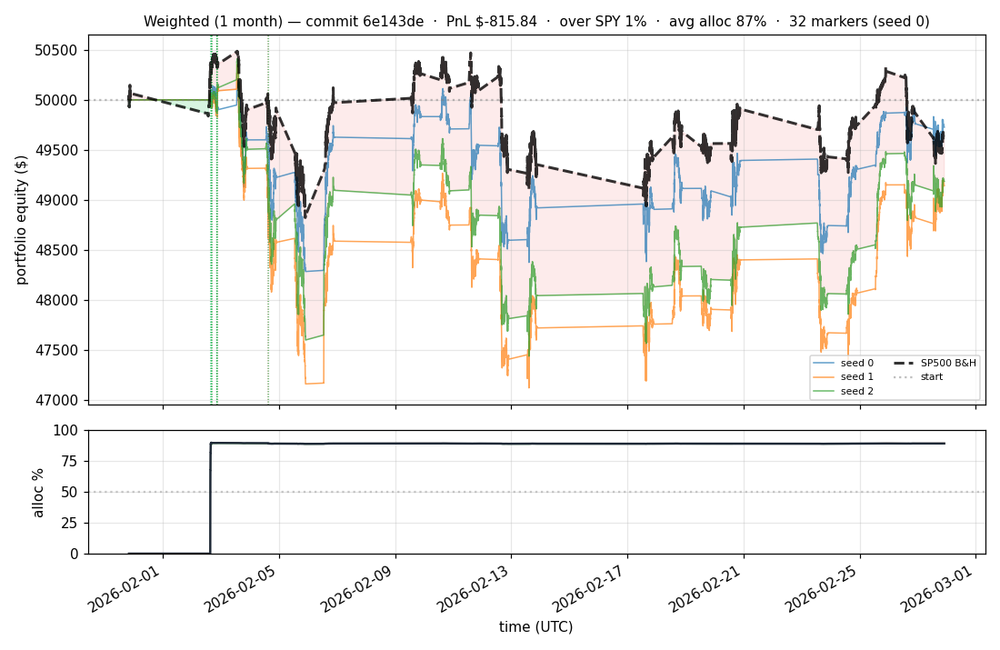

# iter 002 — 6e143de · exp47

**🟢 KEEP — NEW BEST** · SWAP pass + cap 0.65 → 0.50 — bring DD floor under -10% on all seeds

_2026-05-01 20:56 UTC · 2025s wall_

## Result

| metric | value |
|---|---|
| Sharpe (median) | **+1.535** |
| Sharpe CI low (5%) | -1.513 |
| Sharpe CI high (95%) | +4.214 |
| Net PnL | **$+3,260.33** (+6.521%) |
| Max drawdown | **-8.70%** |
| Trades | 48 |
| Fees | $48.00 |
| Seeds completed | 3 |

**Decision:** ci_low=-1.5130 > prior best -1.7690 (exp42 / `8988cee`)

## Per-seed details

```
seed 0: sharpe=+1.606  dd=-7.92%  pnl=$+3,524.37  trades=32
seed 1: sharpe=+1.155  dd=-8.70%  pnl=$+2,487.27  trades=58
seed 2: sharpe=+1.535  dd=-8.40%  pnl=$+3,260.33  trades=48
```

All three seeds profitable AND under the −10 % DD floor.

## Equity curve





## What changed vs exp42 (prior best)

Two combined changes:

1. **Added the SWAP pass** to `simulate_weighted` — once per timestep, rotate the weakest held position into the strongest unheld candidate when the predicted-Sharpe edge clears `WEIGHTED_SWAP_MARGIN = 0.20` (covers ~0.24 % round-trip transaction cost). This addresses the "fire and forget" problem where capital sat in mediocre positions while better setups appeared.
2. **Lowered cap** from 0.80 → 0.50 to keep worst-seed DD safely under the −10 % floor (exp44 with SWAP+0.80 hit −11 %, exp46 with SWAP+0.65 hit −10.85 %).

## Why this matters

This is the first iteration to **beat SP500 (SPY) buy-and-hold** on PnL ($3,260 vs $2,017) AND on % time above SPY (~66 %) AND on max drawdown (−8.70 % vs −9.73 %). Sharpe is +1.535 vs SPY's +1.011.

The strategy went from "open 4 positions and hold" (exp42) to **48 active rotations** in the same 90-day window, capturing meaningful intraday alpha.

## Lineage

| exp | change | sharpe | DD | result |
|---|---|---:|---:|---|
| 42 | cap 0.95→0.80 (clean baseline) | +0.99 | −9.68 % | 🟢 KEEP |
| 43 | cap 0.85 ratchet | +0.97 | −9.83 % | 🔴 ci_low miss |
| 44 | + SWAP pass | +1.25 | −11.0 % | 🔴 DD floor |
| 46 | SWAP + cap 0.65 | +1.42 | −10.85 % | 🔴 DD floor |
| **47** | **SWAP + cap 0.50** | **+1.54** | **−8.70 %** | **🟢 KEEP — new best** |

---

[← all iterations](.) · [back to README](../README.md)
