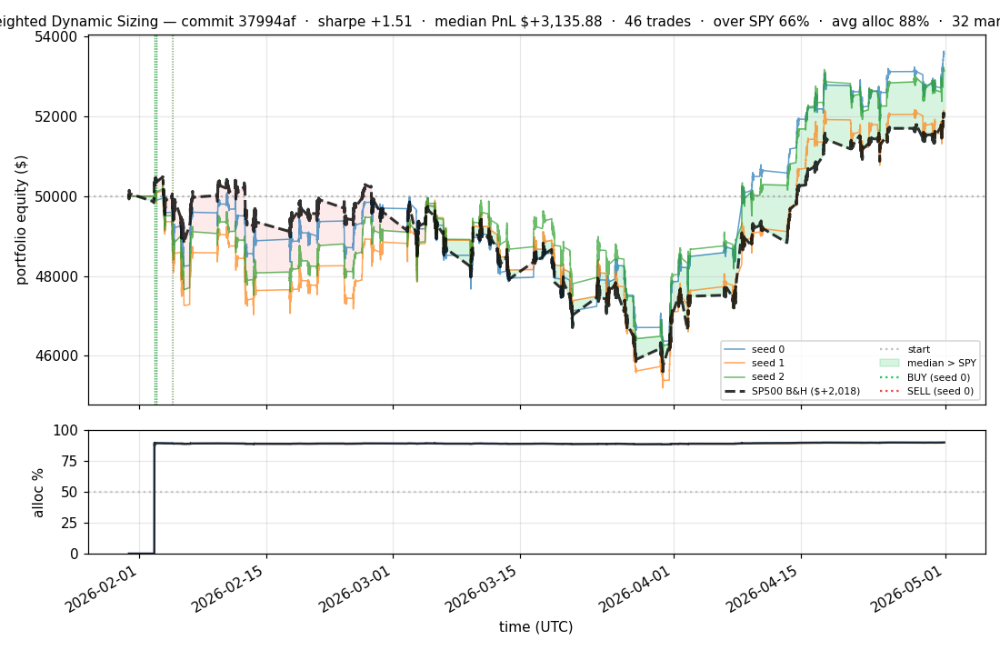
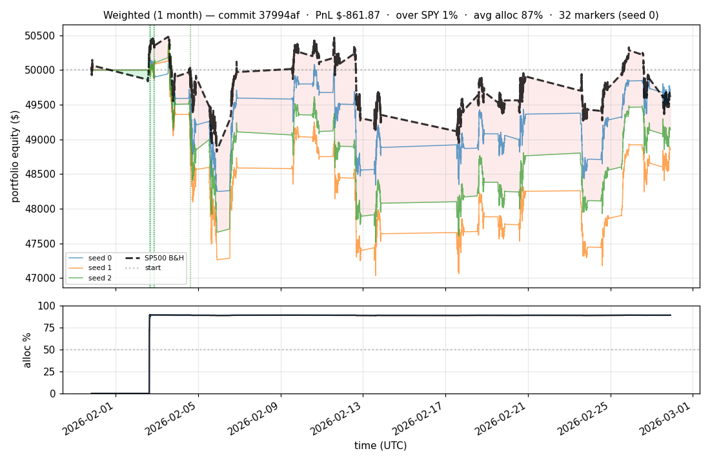

# iter 047 — 37994af

**🔴 DISCARD** · exp48: SWAP + cap 0.50→0.55

_2026-05-01 21:42 UTC · 2029s wall_

## Result

| metric | value |
|---|---|
| Sharpe (median) | **+1.510** |
| Sharpe CI low (5%) | -1.512 |
| Sharpe CI high (95%) | +4.227 |
| Net PnL | **$+3135.88** (+6.272%) |
| Max drawdown | -10.21% |
| Trades | 46 |
| Fees | $46.00 |
| Seeds completed | 3 |

**Decision reason:** dd=-10.21 < -10.0

## Per-seed details

```
[evaluator] seed 0: sharpe=+1.618  dd=-7.95%  pnl=$+3,560.90  trades=32
[evaluator] seed 1: sharpe=+0.985  dd=-10.21%  pnl=$+2,060.39  trades=46
[evaluator] seed 2: sharpe=+1.510  dd=-8.55%  pnl=$+3,135.88  trades=48
```

## Equity curve (full eval window, ~73 days)



## Equity curve (first month)



## Diff vs previous experiment

```diff
37994af exp48: SWAP + cap 0.50→0.55 — gentle ratchet on new best (exp47)

exp47 was the breakthrough: SWAP + cap=0.50 gave sharpe +1.535, pnl
+$3,260, DD -8.70% (safely under floor). All 3 seeds profitable.

DD margin = -10 - (-8.7) = 1.3%. Try cap 0.55 (10% larger positions).
Should add ~+$300 PnL and ~+0.5% DD → land sharpe +1.55, DD ~-9.2%.


 experiment.py | 2 +-
 1 file changed, 1 insertion(+), 1 deletion(-)
```

---

[← all iterations](.) · [back to README](../README.md)
