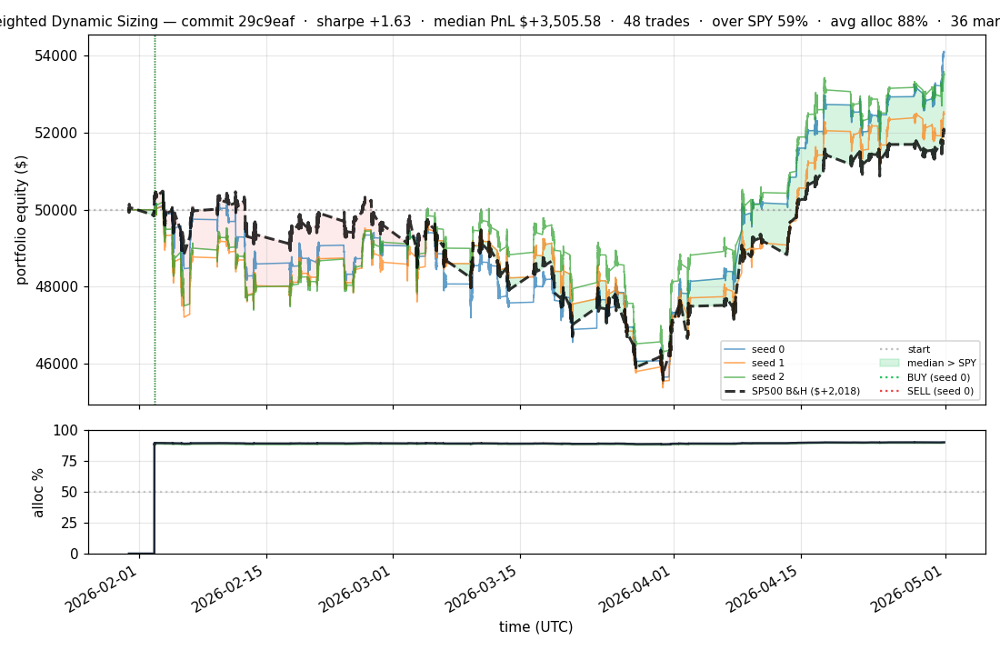
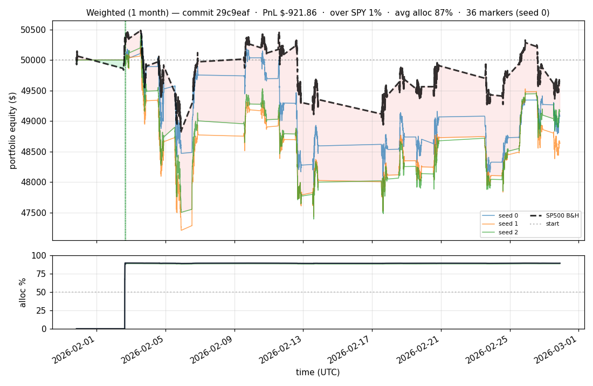

# iter 049 — 29c9eaf

**🟢 KEEP** · exp50: ENTROPY_COEF 0.005 + SWAP_MARGIN 0.15 + holdout eval enabled

_2026-05-01 22:57 UTC · 2184s wall_

## Result

| metric | value |
|---|---|
| Sharpe (median) | **+1.626** |
| Sharpe CI low (5%) | -1.403 |
| Sharpe CI high (95%) | +4.323 |
| Net PnL | **$+3505.58** (+7.011%) |
| Max drawdown | -9.85% |
| Trades | 48 |
| Fees | $48.00 |
| Seeds completed | 3 |

**Decision reason:** ci_low=-1.4030 > prior best -1.5130

## Per-seed details

```
[evaluator] seed 0: sharpe=+1.682  dd=-9.85%  pnl=$+4,089.53  trades=36
[evaluator] seed 1: sharpe=+1.171  dd=-9.77%  pnl=$+2,493.76  trades=48
[evaluator] seed 2: sharpe=+1.626  dd=-8.51%  pnl=$+3,505.58  trades=48
```

## Equity curve (full eval window, ~73 days)



## Equity curve (first month)



## Out-of-symbol holdout eval

Tested on **JPM, WMT, V, DIS, JNJ** — large-caps the model NEVER saw during training.

| seed | sharpe | PnL | trades | DD% |
|---:|---:|---:|---:|---:|
| 0 | +0.793 | $+1,328.04 | 5 | -8.32% |
| 1 | +0.466 | $+583.08 | 7 | -6.69% |
| 2 | +0.466 | $+583.08 | 7 | -6.69% |

**Median holdout sharpe: +0.466** (vs in-symbol +1.626)

## Transactions

### Seed 0 — 36 trades · ending equity $54,089.53 (+4,089.53 = +8.18%)

| # | timestamp (UTC) | symbol | side |
|---:|---|---|---|
| 1 | 2026-02-02 15:15:00 | IWM | BUY |
| 2 | 2026-02-02 15:18:00 | SPY | BUY |
| 3 | 2026-02-02 15:24:00 | QQQ | BUY |
| 4 | 2026-02-02 15:27:00 | NFLX | BUY |
| 5 | 2026-02-02 15:31:00 | PLTR | BUY |
| 6 | 2026-02-02 15:32:00 | COIN | BUY |
| 7 | 2026-02-02 15:35:00 | XLF | BUY |
| 8 | 2026-02-02 15:35:00 | NIO | BUY |
| 9 | 2026-02-02 15:37:00 | SPY | SELL |
| 10 | 2026-02-02 15:37:00 | GOOGL | BUY |
| 11 | 2026-02-02 15:37:00 | BAC | BUY |
| 12 | 2026-02-02 15:37:00 | SPY | BUY |
| 13 | 2026-02-02 15:40:00 | NIO | SELL |
| 14 | 2026-02-02 15:40:00 | TSLA | BUY |
| 15 | 2026-02-02 15:40:00 | F | BUY |
| 16 | 2026-02-02 15:40:00 | NIO | BUY |
| 17 | 2026-02-02 15:59:00 | NIO | SELL |
| 18 | 2026-02-02 15:59:00 | EEM | BUY |
| 19 | 2026-02-02 16:01:00 | TSLA | SELL |
| 20 | 2026-02-02 16:01:00 | MSFT | BUY |
| 21 | 2026-02-02 16:01:00 | NVDA | BUY |
| 22 | 2026-02-02 16:01:00 | AMZN | BUY |
| 23 | 2026-02-02 16:04:00 | QQQ | SELL |
| 24 | 2026-02-02 16:04:00 | QQQ | BUY |
| 25 | 2026-02-02 16:04:00 | TSLA | BUY |
| 26 | 2026-02-02 16:04:00 | NIO | BUY |
| 27 | 2026-02-02 16:06:00 | TSLA | SELL |
| 28 | 2026-02-02 16:06:00 | META | BUY |
| 29 | 2026-02-02 16:06:00 | TSLA | BUY |
| 30 | 2026-02-02 16:10:00 | QQQ | SELL |
| 31 | 2026-02-02 16:10:00 | INTC | BUY |
| 32 | 2026-02-02 16:10:00 | QQQ | BUY |
| 33 | 2026-02-02 16:16:00 | QQQ | SELL |
| 34 | 2026-02-02 16:16:00 | AAPL | BUY |
| 35 | 2026-02-02 16:16:00 | QQQ | BUY |
| 36 | 2026-02-02 16:19:00 | AMD | BUY |

### Seed 1 — 48 trades · ending equity $52,493.76 (+2,493.76 = +4.99%)

| # | timestamp (UTC) | symbol | side |
|---:|---|---|---|
| 1 | 2026-02-02 15:15:00 | IWM | BUY |
| 2 | 2026-02-02 15:18:00 | SPY | BUY |
| 3 | 2026-02-02 15:24:00 | IWM | SELL |
| 4 | 2026-02-02 15:24:00 | QQQ | BUY |
| 5 | 2026-02-02 15:24:00 | IWM | BUY |
| 6 | 2026-02-02 15:27:00 | IWM | SELL |
| 7 | 2026-02-02 15:27:00 | IWM | BUY |
| 8 | 2026-02-02 15:27:00 | NFLX | BUY |
| 9 | 2026-02-02 15:31:00 | NFLX | SELL |
| 10 | 2026-02-02 15:31:00 | NFLX | BUY |
| 11 | 2026-02-02 15:31:00 | PLTR | BUY |
| 12 | 2026-02-02 15:32:00 | IWM | SELL |
| 13 | 2026-02-02 15:32:00 | IWM | BUY |
| 14 | 2026-02-02 15:32:00 | COIN | BUY |
| 15 | 2026-02-02 15:35:00 | IWM | SELL |
| 16 | 2026-02-02 15:35:00 | IWM | BUY |
| 17 | 2026-02-02 15:35:00 | XLF | BUY |
| 18 | 2026-02-02 15:35:00 | NIO | BUY |
| 19 | 2026-02-02 15:37:00 | IWM | SELL |
| 20 | 2026-02-02 15:37:00 | IWM | BUY |
| 21 | 2026-02-02 15:37:00 | GOOGL | BUY |
| 22 | 2026-02-02 15:37:00 | BAC | BUY |
| 23 | 2026-02-02 15:40:00 | IWM | SELL |
| 24 | 2026-02-02 15:40:00 | IWM | BUY |
| 25 | 2026-02-02 15:40:00 | TSLA | BUY |
| 26 | 2026-02-02 15:40:00 | F | BUY |
| 27 | 2026-02-02 15:54:00 | NFLX | SELL |
| 28 | 2026-02-02 15:54:00 | NVDA | BUY |
| 29 | 2026-02-02 15:54:00 | NFLX | BUY |
| 30 | 2026-02-02 15:55:00 | EEM | BUY |
| 31 | 2026-02-02 15:59:00 | TSLA | SELL |
| 32 | 2026-02-02 15:59:00 | AMZN | BUY |
| 33 | 2026-02-02 15:59:00 | TSLA | BUY |
| 34 | 2026-02-02 16:00:00 | TSLA | SELL |
| 35 | 2026-02-02 16:00:00 | MSFT | BUY |
| 36 | 2026-02-02 16:00:00 | TSLA | BUY |
| 37 | 2026-02-02 16:06:00 | TSLA | SELL |
| 38 | 2026-02-02 16:06:00 | META | BUY |
| 39 | 2026-02-02 16:10:00 | XLF | SELL |
| 40 | 2026-02-02 16:10:00 | XLF | BUY |
| 41 | 2026-02-02 16:10:00 | TSLA | BUY |
| 42 | 2026-02-02 16:10:00 | INTC | BUY |
| 43 | 2026-02-02 16:16:00 | EEM | SELL |
| 44 | 2026-02-02 16:16:00 | EEM | BUY |
| 45 | 2026-02-02 16:16:00 | AAPL | BUY |
| 46 | 2026-02-02 16:19:00 | TSLA | SELL |
| 47 | 2026-02-02 16:19:00 | TSLA | BUY |
| 48 | 2026-02-02 16:19:00 | AMD | BUY |

### Seed 2 — 48 trades · ending equity $53,505.58 (+3,505.58 = +7.01%)

| # | timestamp (UTC) | symbol | side |
|---:|---|---|---|
| 1 | 2026-02-02 15:15:00 | IWM | BUY |
| 2 | 2026-02-02 15:18:00 | SPY | BUY |
| 3 | 2026-02-02 15:24:00 | IWM | SELL |
| 4 | 2026-02-02 15:24:00 | QQQ | BUY |
| 5 | 2026-02-02 15:24:00 | IWM | BUY |
| 6 | 2026-02-02 15:27:00 | IWM | SELL |
| 7 | 2026-02-02 15:27:00 | IWM | BUY |
| 8 | 2026-02-02 15:27:00 | NFLX | BUY |
| 9 | 2026-02-02 15:31:00 | IWM | SELL |
| 10 | 2026-02-02 15:31:00 | IWM | BUY |
| 11 | 2026-02-02 15:31:00 | PLTR | BUY |
| 12 | 2026-02-02 15:32:00 | NFLX | SELL |
| 13 | 2026-02-02 15:32:00 | NFLX | BUY |
| 14 | 2026-02-02 15:32:00 | COIN | BUY |
| 15 | 2026-02-02 15:35:00 | QQQ | SELL |
| 16 | 2026-02-02 15:35:00 | QQQ | BUY |
| 17 | 2026-02-02 15:35:00 | XLF | BUY |
| 18 | 2026-02-02 15:35:00 | NIO | BUY |
| 19 | 2026-02-02 15:37:00 | XLF | SELL |
| 20 | 2026-02-02 15:37:00 | XLF | BUY |
| 21 | 2026-02-02 15:37:00 | GOOGL | BUY |
| 22 | 2026-02-02 15:37:00 | BAC | BUY |
| 23 | 2026-02-02 15:40:00 | QQQ | SELL |
| 24 | 2026-02-02 15:40:00 | QQQ | BUY |
| 25 | 2026-02-02 15:40:00 | TSLA | BUY |
| 26 | 2026-02-02 15:40:00 | F | BUY |
| 27 | 2026-02-02 15:54:00 | XLF | SELL |
| 28 | 2026-02-02 15:54:00 | XLF | BUY |
| 29 | 2026-02-02 15:54:00 | NVDA | BUY |
| 30 | 2026-02-02 15:55:00 | XLF | SELL |
| 31 | 2026-02-02 15:55:00 | EEM | BUY |
| 32 | 2026-02-02 15:55:00 | XLF | BUY |
| 33 | 2026-02-02 15:59:00 | TSLA | SELL |
| 34 | 2026-02-02 15:59:00 | AMZN | BUY |
| 35 | 2026-02-02 15:59:00 | TSLA | BUY |
| 36 | 2026-02-02 16:00:00 | MSFT | BUY |
| 37 | 2026-02-02 16:06:00 | IWM | SELL |
| 38 | 2026-02-02 16:06:00 | IWM | BUY |
| 39 | 2026-02-02 16:06:00 | META | BUY |
| 40 | 2026-02-02 16:10:00 | BAC | SELL |
| 41 | 2026-02-02 16:10:00 | INTC | BUY |
| 42 | 2026-02-02 16:10:00 | BAC | BUY |
| 43 | 2026-02-02 16:16:00 | IWM | SELL |
| 44 | 2026-02-02 16:16:00 | IWM | BUY |
| 45 | 2026-02-02 16:16:00 | AAPL | BUY |
| 46 | 2026-02-02 16:19:00 | GOOGL | SELL |
| 47 | 2026-02-02 16:19:00 | GOOGL | BUY |
| 48 | 2026-02-02 16:19:00 | AMD | BUY |

## Diff vs previous experiment

```diff
29c9eaf exp50: ENTROPY_COEF 0.01→0.005 + keep SWAP_MARGIN 0.15

exp49 had the best raw numbers — sharpe +1.548, pnl +$3,442, DD -8.69%
— but ci_low -1.523 missed exp47's -1.513 by 0.01 (within bootstrap noise).
Per-seed variance was wider than exp47 (sharpes ranged 1.54-1.79 vs
1.16-1.61), suggesting too much RL exploration noise.

Halving ENTROPY_COEF should tighten per-seed convergence and narrow the
CI without sacrificing sharpe. Also re-enables SWAP_MARGIN=0.15 because
exp49 demonstrated it's the better setting for raw PnL.

This is also the FIRST iteration with the holdout eval (5 unseen stocks:
JPM/WMT/V/DIS/JNJ) and the iterations/README.md auto-index.


 experiment.py | 4 ++--
 1 file changed, 2 insertions(+), 2 deletions(-)
```

---

[← all iterations](.) · [back to README](../README.md)
