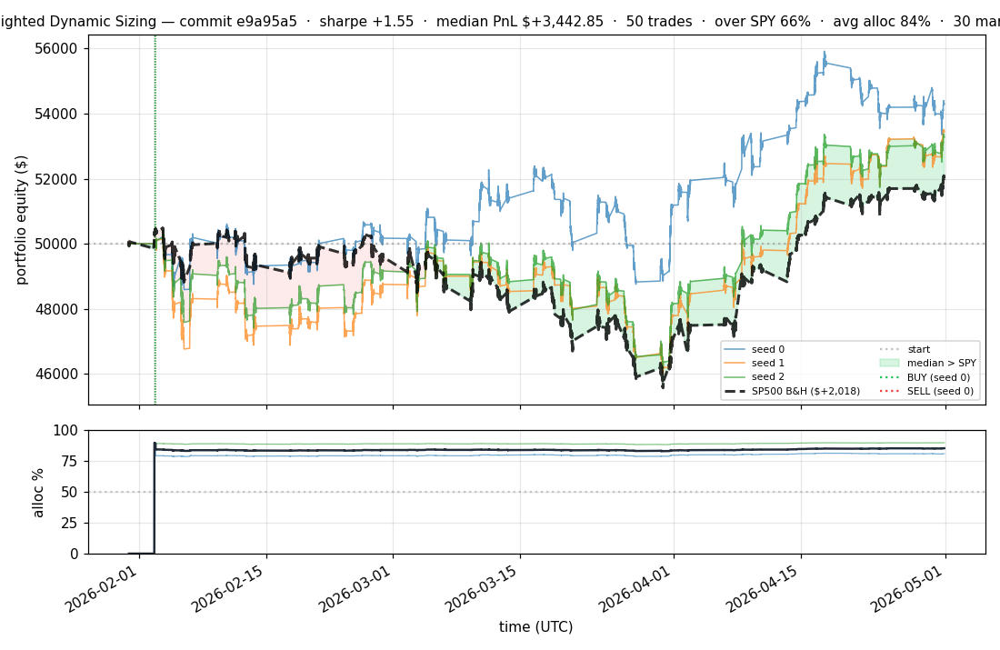
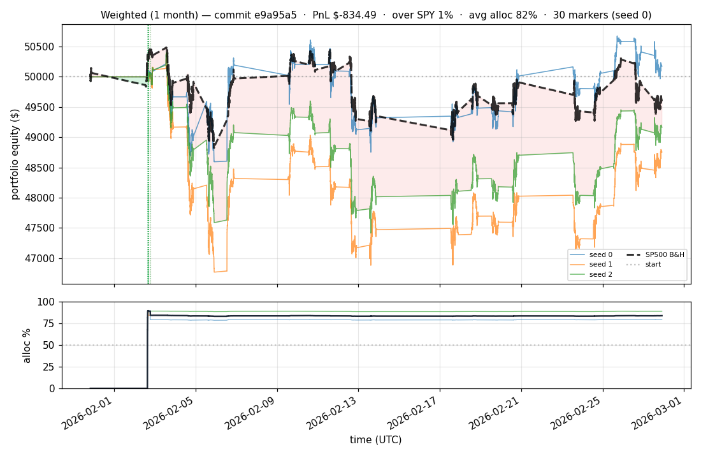

# iter 049 — e9a95a5

**🔴 DISCARD** · exp49: SWAP_MARGIN 0.20→0.15 at cap=0.50 (more rotations)

_2026-05-01 22:17 UTC · 1977s wall_

## Result

| metric | value |
|---|---|
| Sharpe (median) | **+1.548** |
| Sharpe CI low (5%) | -1.523 |
| Sharpe CI high (95%) | +4.362 |
| Net PnL | **$+3442.85** (+6.886%) |
| Max drawdown | -8.69% |
| Trades | 50 |
| Fees | $50.00 |
| Seeds completed | 3 |

**Decision reason:** ci_low=-1.5230 ≤ prior best -1.5131

## Per-seed details

```
[evaluator] seed 0: sharpe=+1.786  dd=-6.94%  pnl=$+4,298.60  trades=30
[evaluator] seed 1: sharpe=+1.541  dd=-8.69%  pnl=$+3,442.85  trades=62
[evaluator] seed 2: sharpe=+1.548  dd=-8.39%  pnl=$+3,278.52  trades=50
```

## Equity curve (full eval window, ~73 days)



## Equity curve (first month)



## Transactions

### Seed 0 — 30 trades · ending equity $54,298.60 (+4,298.60 = +8.60%)

| # | timestamp (UTC) | symbol | side |
|---:|---|---|---|
| 1 | 2026-02-02 15:15:00 | IWM | BUY |
| 2 | 2026-02-02 15:18:00 | SPY | BUY |
| 3 | 2026-02-02 15:24:00 | QQQ | BUY |
| 4 | 2026-02-02 15:27:00 | NFLX | BUY |
| 5 | 2026-02-02 15:31:00 | PLTR | BUY |
| 6 | 2026-02-02 15:32:00 | COIN | BUY |
| 7 | 2026-02-02 15:35:00 | NIO | BUY |
| 8 | 2026-02-02 15:35:00 | XLF | BUY |
| 9 | 2026-02-02 15:37:00 | BAC | BUY |
| 10 | 2026-02-02 15:37:00 | GOOGL | BUY |
| 11 | 2026-02-02 15:59:00 | NIO | SELL |
| 12 | 2026-02-02 15:59:00 | AMZN | BUY |
| 13 | 2026-02-02 15:59:00 | EEM | BUY |
| 14 | 2026-02-02 15:59:00 | F | BUY |
| 15 | 2026-02-02 16:06:00 | QQQ | SELL |
| 16 | 2026-02-02 16:06:00 | META | BUY |
| 17 | 2026-02-02 16:06:00 | MSFT | BUY |
| 18 | 2026-02-02 16:06:00 | NIO | BUY |
| 19 | 2026-02-02 16:06:00 | TSLA | BUY |
| 20 | 2026-02-02 16:06:00 | NVDA | BUY |
| 21 | 2026-02-02 16:10:00 | NVDA | SELL |
| 22 | 2026-02-02 16:10:00 | INTC | BUY |
| 23 | 2026-02-02 16:10:00 | NVDA | BUY |
| 24 | 2026-02-02 16:33:00 | NIO | SELL |
| 25 | 2026-02-02 16:33:00 | AAPL | BUY |
| 26 | 2026-02-02 16:33:00 | AMD | BUY |
| 27 | 2026-02-02 16:33:00 | QQQ | BUY |
| 28 | 2026-02-02 18:37:00 | IWM | SELL |
| 29 | 2026-02-02 18:37:00 | NIO | BUY |
| 30 | 2026-02-02 18:37:00 | IWM | BUY |

### Seed 1 — 62 trades · ending equity $53,442.85 (+3,442.85 = +6.89%)

| # | timestamp (UTC) | symbol | side |
|---:|---|---|---|
| 1 | 2026-02-02 15:15:00 | IWM | BUY |
| 2 | 2026-02-02 15:18:00 | SPY | BUY |
| 3 | 2026-02-02 15:24:00 | IWM | SELL |
| 4 | 2026-02-02 15:24:00 | QQQ | BUY |
| 5 | 2026-02-02 15:24:00 | IWM | BUY |
| 6 | 2026-02-02 15:27:00 | IWM | SELL |
| 7 | 2026-02-02 15:27:00 | IWM | BUY |
| 8 | 2026-02-02 15:27:00 | NFLX | BUY |
| 9 | 2026-02-02 15:31:00 | IWM | SELL |
| 10 | 2026-02-02 15:31:00 | IWM | BUY |
| 11 | 2026-02-02 15:31:00 | PLTR | BUY |
| 12 | 2026-02-02 15:32:00 | IWM | SELL |
| 13 | 2026-02-02 15:32:00 | IWM | BUY |
| 14 | 2026-02-02 15:32:00 | COIN | BUY |
| 15 | 2026-02-02 15:35:00 | IWM | SELL |
| 16 | 2026-02-02 15:35:00 | IWM | BUY |
| 17 | 2026-02-02 15:35:00 | XLF | BUY |
| 18 | 2026-02-02 15:35:00 | NIO | BUY |
| 19 | 2026-02-02 15:37:00 | IWM | SELL |
| 20 | 2026-02-02 15:37:00 | IWM | BUY |
| 21 | 2026-02-02 15:37:00 | GOOGL | BUY |
| 22 | 2026-02-02 15:37:00 | BAC | BUY |
| 23 | 2026-02-02 15:40:00 | IWM | SELL |
| 24 | 2026-02-02 15:40:00 | IWM | BUY |
| 25 | 2026-02-02 15:40:00 | TSLA | BUY |
| 26 | 2026-02-02 15:40:00 | F | BUY |
| 27 | 2026-02-02 15:54:00 | TSLA | SELL |
| 28 | 2026-02-02 15:54:00 | NVDA | BUY |
| 29 | 2026-02-02 15:54:00 | TSLA | BUY |
| 30 | 2026-02-02 15:55:00 | EEM | BUY |
| 31 | 2026-02-02 15:59:00 | TSLA | SELL |
| 32 | 2026-02-02 15:59:00 | AMZN | BUY |
| 33 | 2026-02-02 16:00:00 | IWM | SELL |
| 34 | 2026-02-02 16:00:00 | IWM | BUY |
| 35 | 2026-02-02 16:00:00 | MSFT | BUY |
| 36 | 2026-02-02 16:00:00 | TSLA | BUY |
| 37 | 2026-02-02 16:06:00 | TSLA | SELL |
| 38 | 2026-02-02 16:06:00 | META | BUY |
| 39 | 2026-02-02 16:10:00 | XLF | SELL |
| 40 | 2026-02-02 16:10:00 | XLF | BUY |
| 41 | 2026-02-02 16:10:00 | TSLA | BUY |
| 42 | 2026-02-02 16:10:00 | INTC | BUY |
| 43 | 2026-02-02 16:16:00 | EEM | SELL |
| 44 | 2026-02-02 16:16:00 | EEM | BUY |
| 45 | 2026-02-02 16:17:00 | TSLA | SELL |
| 46 | 2026-02-02 16:17:00 | AAPL | BUY |
| 47 | 2026-02-02 16:17:00 | TSLA | BUY |
| 48 | 2026-02-02 16:19:00 | TSLA | SELL |
| 49 | 2026-02-02 16:19:00 | TSLA | BUY |
| 50 | 2026-02-02 16:20:00 | TSLA | SELL |
| 51 | 2026-02-02 16:20:00 | TSLA | BUY |
| 52 | 2026-02-02 16:21:00 | TSLA | SELL |
| 53 | 2026-02-02 16:21:00 | TSLA | BUY |
| 54 | 2026-02-02 16:22:00 | TSLA | SELL |
| 55 | 2026-02-02 16:22:00 | TSLA | BUY |
| 56 | 2026-02-02 16:23:00 | TSLA | SELL |
| 57 | 2026-02-02 16:23:00 | TSLA | BUY |
| 58 | 2026-02-02 16:24:00 | TSLA | SELL |
| 59 | 2026-02-02 16:24:00 | TSLA | BUY |
| 60 | 2026-02-02 16:25:00 | SPY | SELL |
| 61 | 2026-02-02 16:25:00 | SPY | BUY |
| 62 | 2026-02-02 16:25:00 | AMD | BUY |

### Seed 2 — 50 trades · ending equity $53,278.52 (+3,278.52 = +6.56%)

| # | timestamp (UTC) | symbol | side |
|---:|---|---|---|
| 1 | 2026-02-02 15:15:00 | IWM | BUY |
| 2 | 2026-02-02 15:18:00 | SPY | BUY |
| 3 | 2026-02-02 15:24:00 | IWM | SELL |
| 4 | 2026-02-02 15:24:00 | QQQ | BUY |
| 5 | 2026-02-02 15:24:00 | IWM | BUY |
| 6 | 2026-02-02 15:27:00 | IWM | SELL |
| 7 | 2026-02-02 15:27:00 | IWM | BUY |
| 8 | 2026-02-02 15:27:00 | NFLX | BUY |
| 9 | 2026-02-02 15:31:00 | IWM | SELL |
| 10 | 2026-02-02 15:31:00 | IWM | BUY |
| 11 | 2026-02-02 15:31:00 | PLTR | BUY |
| 12 | 2026-02-02 15:32:00 | NFLX | SELL |
| 13 | 2026-02-02 15:32:00 | NFLX | BUY |
| 14 | 2026-02-02 15:32:00 | COIN | BUY |
| 15 | 2026-02-02 15:35:00 | QQQ | SELL |
| 16 | 2026-02-02 15:35:00 | QQQ | BUY |
| 17 | 2026-02-02 15:35:00 | XLF | BUY |
| 18 | 2026-02-02 15:35:00 | NIO | BUY |
| 19 | 2026-02-02 15:37:00 | XLF | SELL |
| 20 | 2026-02-02 15:37:00 | XLF | BUY |
| 21 | 2026-02-02 15:37:00 | GOOGL | BUY |
| 22 | 2026-02-02 15:37:00 | BAC | BUY |
| 23 | 2026-02-02 15:40:00 | QQQ | SELL |
| 24 | 2026-02-02 15:40:00 | QQQ | BUY |
| 25 | 2026-02-02 15:40:00 | TSLA | BUY |
| 26 | 2026-02-02 15:40:00 | F | BUY |
| 27 | 2026-02-02 15:54:00 | XLF | SELL |
| 28 | 2026-02-02 15:54:00 | XLF | BUY |
| 29 | 2026-02-02 15:54:00 | NVDA | BUY |
| 30 | 2026-02-02 15:55:00 | GOOGL | SELL |
| 31 | 2026-02-02 15:55:00 | EEM | BUY |
| 32 | 2026-02-02 15:55:00 | GOOGL | BUY |
| 33 | 2026-02-02 15:59:00 | TSLA | SELL |
| 34 | 2026-02-02 15:59:00 | AMZN | BUY |
| 35 | 2026-02-02 15:59:00 | TSLA | BUY |
| 36 | 2026-02-02 16:00:00 | TSLA | SELL |
| 37 | 2026-02-02 16:00:00 | MSFT | BUY |
| 38 | 2026-02-02 16:00:00 | TSLA | BUY |
| 39 | 2026-02-02 16:06:00 | IWM | SELL |
| 40 | 2026-02-02 16:06:00 | IWM | BUY |
| 41 | 2026-02-02 16:06:00 | META | BUY |
| 42 | 2026-02-02 16:10:00 | BAC | SELL |
| 43 | 2026-02-02 16:10:00 | INTC | BUY |
| 44 | 2026-02-02 16:10:00 | BAC | BUY |
| 45 | 2026-02-02 16:16:00 | IWM | SELL |
| 46 | 2026-02-02 16:16:00 | IWM | BUY |
| 47 | 2026-02-02 16:16:00 | AAPL | BUY |
| 48 | 2026-02-02 16:19:00 | GOOGL | SELL |
| 49 | 2026-02-02 16:19:00 | GOOGL | BUY |
| 50 | 2026-02-02 16:19:00 | AMD | BUY |

## Diff vs previous experiment

```diff
e9a95a5 exp49: WEIGHTED_SWAP_MARGIN 0.20 → 0.15 at safe cap=0.50

exp48 (SWAP + cap 0.55) hit DD -10.21% just over the floor — cap
ratchet is exhausted at the SWAP level. Try the other lever: looser
swap threshold so capital rotates more often into stronger signals.

Round-trip transaction cost is ~0.24% on $1k position. SWAP_MARGIN
0.15 is still ~1.6× the cost in Sharpe-equivalent units, so swaps
should still be net-positive on average.

First iteration with per-seed transactions list rendered in the
iteration .md page (commit 5455851 added the dump+render plumbing).


 experiment.py | 2 +-
 1 file changed, 1 insertion(+), 1 deletion(-)
```

---

[← all iterations](.) · [back to README](../README.md)
