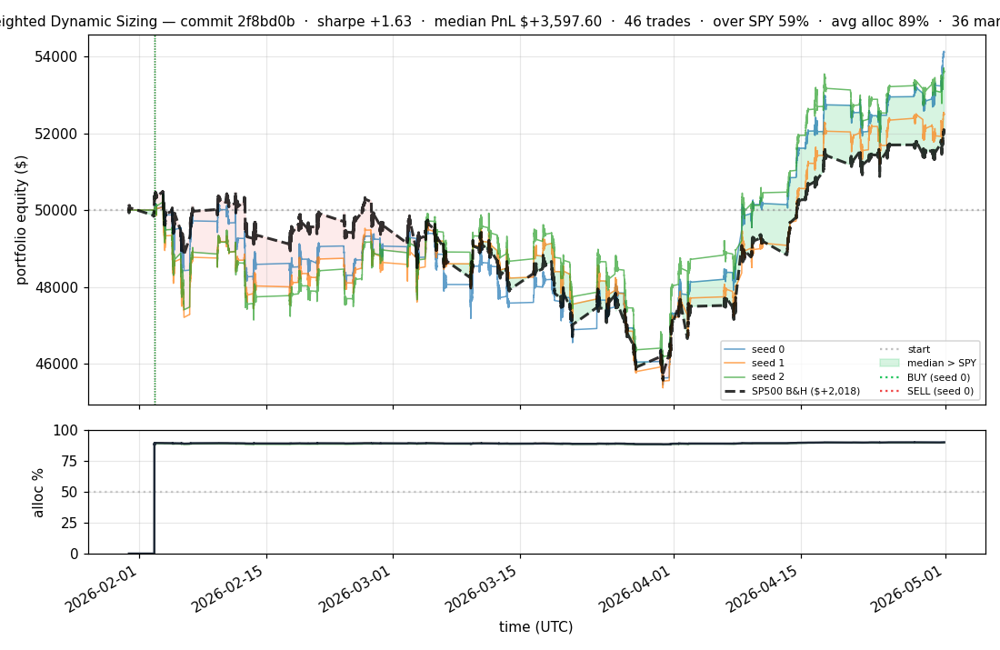
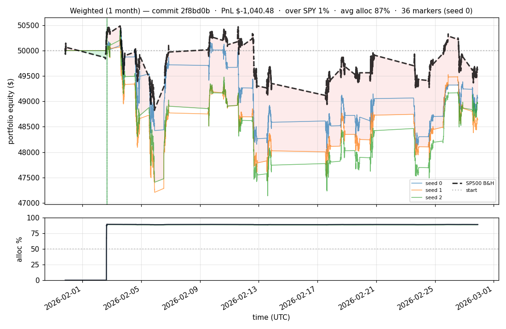

# iter 050 — 2f8bd0b

**🟢 KEEP** · exp51: SPY-alpha reward (coef=0.5)

_2026-05-01 23:33 UTC · 2048s wall_

## Result

| metric | value |
|---|---|
| Sharpe (median) | **+1.629** |
| Sharpe CI low (5%) | -1.351 |
| Sharpe CI high (95%) | +4.315 |
| Net PnL | **$+3597.60** (+7.195%) |
| Max drawdown | -9.87% |
| Trades | 46 |
| Fees | $46.00 |
| Seeds completed | 3 |

**Decision reason:** ci_low=-1.3510 > prior best -1.4025

## Per-seed details

```
[evaluator] seed 0: sharpe=+1.686  dd=-9.87%  pnl=$+4,109.83  trades=36
[evaluator] seed 1: sharpe=+1.171  dd=-9.77%  pnl=$+2,493.76  trades=48
[evaluator] seed 2: sharpe=+1.629  dd=-8.76%  pnl=$+3,597.60  trades=46
```

## Equity curve (full eval window, ~73 days)



## Equity curve (first month)



## Out-of-symbol holdout eval

Tested on **JPM, WMT, V, DIS, JNJ** — large-caps the model NEVER saw during training.

| seed | sharpe | PnL | trades | DD% |
|---:|---:|---:|---:|---:|
| 0 | +0.793 | $+1,328.04 | 5 | -8.32% |
| 1 | +0.466 | $+583.08 | 7 | -6.69% |
| 2 | +0.466 | $+583.08 | 7 | -6.69% |

**Median holdout sharpe: +0.466** (vs in-symbol +1.629)

## Transactions

### Seed 0 — 36 trades · ending equity $54,109.83 (+4,109.83 = +8.22%)

| # | timestamp (UTC) | symbol | side |
|---:|---|---|---|
| 1 | 2026-02-02 15:15:00 | IWM | BUY |
| 2 | 2026-02-02 15:18:00 | SPY | BUY |
| 3 | 2026-02-02 15:24:00 | QQQ | BUY |
| 4 | 2026-02-02 15:27:00 | NFLX | BUY |
| 5 | 2026-02-02 15:31:00 | PLTR | BUY |
| 6 | 2026-02-02 15:32:00 | COIN | BUY |
| 7 | 2026-02-02 15:35:00 | XLF | BUY |
| 8 | 2026-02-02 15:35:00 | NIO | BUY |
| 9 | 2026-02-02 15:37:00 | SPY | SELL |
| 10 | 2026-02-02 15:37:00 | GOOGL | BUY |
| 11 | 2026-02-02 15:37:00 | BAC | BUY |
| 12 | 2026-02-02 15:37:00 | SPY | BUY |
| 13 | 2026-02-02 15:40:00 | NIO | SELL |
| 14 | 2026-02-02 15:40:00 | TSLA | BUY |
| 15 | 2026-02-02 15:40:00 | F | BUY |
| 16 | 2026-02-02 15:40:00 | NIO | BUY |
| 17 | 2026-02-02 15:59:00 | NIO | SELL |
| 18 | 2026-02-02 15:59:00 | EEM | BUY |
| 19 | 2026-02-02 16:01:00 | TSLA | SELL |
| 20 | 2026-02-02 16:01:00 | MSFT | BUY |
| 21 | 2026-02-02 16:01:00 | NVDA | BUY |
| 22 | 2026-02-02 16:01:00 | AMZN | BUY |
| 23 | 2026-02-02 16:04:00 | QQQ | SELL |
| 24 | 2026-02-02 16:04:00 | QQQ | BUY |
| 25 | 2026-02-02 16:04:00 | TSLA | BUY |
| 26 | 2026-02-02 16:04:00 | NIO | BUY |
| 27 | 2026-02-02 16:06:00 | TSLA | SELL |
| 28 | 2026-02-02 16:06:00 | META | BUY |
| 29 | 2026-02-02 16:06:00 | TSLA | BUY |
| 30 | 2026-02-02 16:10:00 | QQQ | SELL |
| 31 | 2026-02-02 16:10:00 | INTC | BUY |
| 32 | 2026-02-02 16:10:00 | QQQ | BUY |
| 33 | 2026-02-02 16:16:00 | QQQ | SELL |
| 34 | 2026-02-02 16:16:00 | QQQ | BUY |
| 35 | 2026-02-02 16:16:00 | AAPL | BUY |
| 36 | 2026-02-02 16:19:00 | AMD | BUY |

### Seed 1 — 48 trades · ending equity $52,493.76 (+2,493.76 = +4.99%)

| # | timestamp (UTC) | symbol | side |
|---:|---|---|---|
| 1 | 2026-02-02 15:15:00 | IWM | BUY |
| 2 | 2026-02-02 15:18:00 | SPY | BUY |
| 3 | 2026-02-02 15:24:00 | IWM | SELL |
| 4 | 2026-02-02 15:24:00 | QQQ | BUY |
| 5 | 2026-02-02 15:24:00 | IWM | BUY |
| 6 | 2026-02-02 15:27:00 | IWM | SELL |
| 7 | 2026-02-02 15:27:00 | IWM | BUY |
| 8 | 2026-02-02 15:27:00 | NFLX | BUY |
| 9 | 2026-02-02 15:31:00 | NFLX | SELL |
| 10 | 2026-02-02 15:31:00 | NFLX | BUY |
| 11 | 2026-02-02 15:31:00 | PLTR | BUY |
| 12 | 2026-02-02 15:32:00 | IWM | SELL |
| 13 | 2026-02-02 15:32:00 | IWM | BUY |
| 14 | 2026-02-02 15:32:00 | COIN | BUY |
| 15 | 2026-02-02 15:35:00 | IWM | SELL |
| 16 | 2026-02-02 15:35:00 | IWM | BUY |
| 17 | 2026-02-02 15:35:00 | XLF | BUY |
| 18 | 2026-02-02 15:35:00 | NIO | BUY |
| 19 | 2026-02-02 15:37:00 | IWM | SELL |
| 20 | 2026-02-02 15:37:00 | IWM | BUY |
| 21 | 2026-02-02 15:37:00 | GOOGL | BUY |
| 22 | 2026-02-02 15:37:00 | BAC | BUY |
| 23 | 2026-02-02 15:40:00 | IWM | SELL |
| 24 | 2026-02-02 15:40:00 | IWM | BUY |
| 25 | 2026-02-02 15:40:00 | TSLA | BUY |
| 26 | 2026-02-02 15:40:00 | F | BUY |
| 27 | 2026-02-02 15:54:00 | NFLX | SELL |
| 28 | 2026-02-02 15:54:00 | NVDA | BUY |
| 29 | 2026-02-02 15:54:00 | NFLX | BUY |
| 30 | 2026-02-02 15:55:00 | EEM | BUY |
| 31 | 2026-02-02 15:59:00 | TSLA | SELL |
| 32 | 2026-02-02 15:59:00 | AMZN | BUY |
| 33 | 2026-02-02 15:59:00 | TSLA | BUY |
| 34 | 2026-02-02 16:00:00 | TSLA | SELL |
| 35 | 2026-02-02 16:00:00 | MSFT | BUY |
| 36 | 2026-02-02 16:00:00 | TSLA | BUY |
| 37 | 2026-02-02 16:06:00 | TSLA | SELL |
| 38 | 2026-02-02 16:06:00 | META | BUY |
| 39 | 2026-02-02 16:10:00 | XLF | SELL |
| 40 | 2026-02-02 16:10:00 | XLF | BUY |
| 41 | 2026-02-02 16:10:00 | TSLA | BUY |
| 42 | 2026-02-02 16:10:00 | INTC | BUY |
| 43 | 2026-02-02 16:16:00 | EEM | SELL |
| 44 | 2026-02-02 16:16:00 | EEM | BUY |
| 45 | 2026-02-02 16:16:00 | AAPL | BUY |
| 46 | 2026-02-02 16:19:00 | TSLA | SELL |
| 47 | 2026-02-02 16:19:00 | TSLA | BUY |
| 48 | 2026-02-02 16:19:00 | AMD | BUY |

### Seed 2 — 46 trades · ending equity $53,597.60 (+3,597.60 = +7.20%)

| # | timestamp (UTC) | symbol | side |
|---:|---|---|---|
| 1 | 2026-02-02 15:15:00 | IWM | BUY |
| 2 | 2026-02-02 15:18:00 | SPY | BUY |
| 3 | 2026-02-02 15:24:00 | IWM | SELL |
| 4 | 2026-02-02 15:24:00 | QQQ | BUY |
| 5 | 2026-02-02 15:24:00 | IWM | BUY |
| 6 | 2026-02-02 15:27:00 | IWM | SELL |
| 7 | 2026-02-02 15:27:00 | IWM | BUY |
| 8 | 2026-02-02 15:27:00 | NFLX | BUY |
| 9 | 2026-02-02 15:31:00 | IWM | SELL |
| 10 | 2026-02-02 15:31:00 | IWM | BUY |
| 11 | 2026-02-02 15:31:00 | PLTR | BUY |
| 12 | 2026-02-02 15:32:00 | COIN | BUY |
| 13 | 2026-02-02 15:35:00 | QQQ | SELL |
| 14 | 2026-02-02 15:35:00 | QQQ | BUY |
| 15 | 2026-02-02 15:35:00 | XLF | BUY |
| 16 | 2026-02-02 15:35:00 | NIO | BUY |
| 17 | 2026-02-02 15:37:00 | QQQ | SELL |
| 18 | 2026-02-02 15:37:00 | QQQ | BUY |
| 19 | 2026-02-02 15:37:00 | GOOGL | BUY |
| 20 | 2026-02-02 15:37:00 | BAC | BUY |
| 21 | 2026-02-02 15:40:00 | QQQ | SELL |
| 22 | 2026-02-02 15:40:00 | QQQ | BUY |
| 23 | 2026-02-02 15:40:00 | TSLA | BUY |
| 24 | 2026-02-02 15:40:00 | F | BUY |
| 25 | 2026-02-02 15:54:00 | XLF | SELL |
| 26 | 2026-02-02 15:54:00 | XLF | BUY |
| 27 | 2026-02-02 15:54:00 | NVDA | BUY |
| 28 | 2026-02-02 15:55:00 | GOOGL | SELL |
| 29 | 2026-02-02 15:55:00 | EEM | BUY |
| 30 | 2026-02-02 15:55:00 | GOOGL | BUY |
| 31 | 2026-02-02 15:59:00 | SPY | SELL |
| 32 | 2026-02-02 15:59:00 | SPY | BUY |
| 33 | 2026-02-02 15:59:00 | AMZN | BUY |
| 34 | 2026-02-02 16:00:00 | MSFT | BUY |
| 35 | 2026-02-02 16:06:00 | IWM | SELL |
| 36 | 2026-02-02 16:06:00 | IWM | BUY |
| 37 | 2026-02-02 16:06:00 | META | BUY |
| 38 | 2026-02-02 16:10:00 | BAC | SELL |
| 39 | 2026-02-02 16:10:00 | INTC | BUY |
| 40 | 2026-02-02 16:10:00 | BAC | BUY |
| 41 | 2026-02-02 16:16:00 | IWM | SELL |
| 42 | 2026-02-02 16:16:00 | IWM | BUY |
| 43 | 2026-02-02 16:16:00 | AAPL | BUY |
| 44 | 2026-02-02 16:19:00 | GOOGL | SELL |
| 45 | 2026-02-02 16:19:00 | GOOGL | BUY |
| 46 | 2026-02-02 16:19:00 | AMD | BUY |

## Diff vs previous experiment

```diff
2f8bd0b exp51: SPY-alpha reward bonus (SPY_ALPHA_COEF=0.5)

Currently the RL reward is absolute return only — the model can earn
reward by riding SPY beta. This change adds an explicit alpha-vs-SPY
bonus: SPY_ALPHA_COEF × (pos_ret - target × spy_h_ret).

When LONG (target=+1):
- Stock beats SPY → bonus added
- Stock lags SPY → penalty subtracted
When HOLD (target=0): no alpha contribution.

Hypothesis: should especially improve out-of-symbol holdout (exp50 showed
+0.466 holdout sharpe vs +1.626 in-symbol — model knows in-sample names
better; alpha training should narrow that gap).


 experiment.py | 18 +++++++++++++++++-
 1 file changed, 17 insertions(+), 1 deletion(-)
```

---

[← all iterations](.) · [back to README](../README.md)
