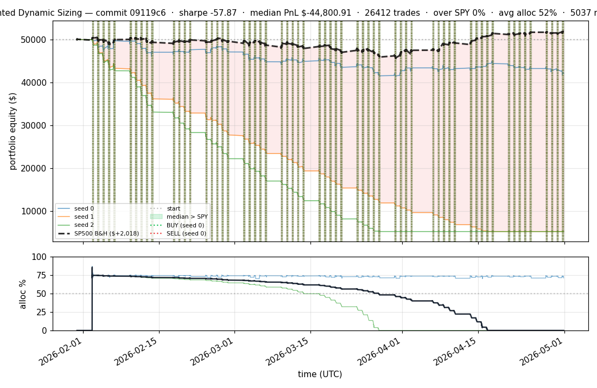
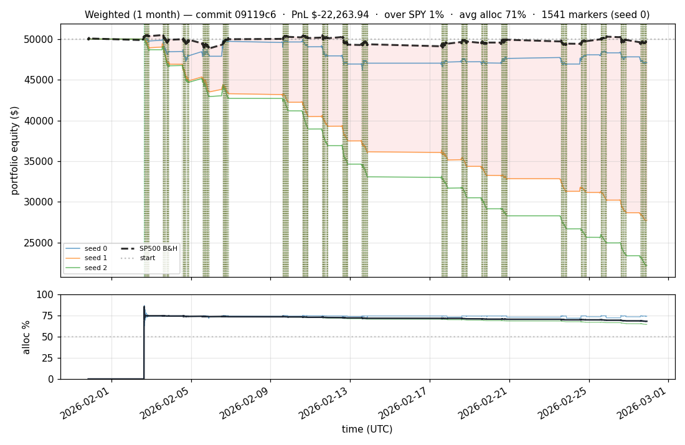

# iter 051 — 09119c6

**🔴 DISCARD** · exp52: WEIGHTED_MAX_CONCURRENT=5 — force selectivity, fix buy-and-hold bug

_2026-05-02 00:09 UTC · 2115s wall_

## Result

| metric | value |
|---|---|
| Sharpe (median) | **-57.870** |
| Sharpe CI low (5%) | -61.706 |
| Sharpe CI high (95%) | -53.868 |
| Net PnL | **$-44800.91** (-89.602%) |
| Max drawdown | -89.62% |
| Trades | 26412 |
| Fees | $26412.00 |
| Seeds completed | 3 |

**Decision reason:** dd=-89.62 < -10.0

## Per-seed details

```
[evaluator] seed 0: sharpe=-3.414  dd=-17.40%  pnl=$-7,961.14  trades=5037
[evaluator] seed 1: sharpe=-57.870  dd=-89.61%  pnl=$-44,800.91  trades=26864
[evaluator] seed 2: sharpe=-64.349  dd=-89.62%  pnl=$-44,801.63  trades=26412
```

## Equity curve (full eval window, ~73 days)



## Equity curve (first month)



## Out-of-symbol holdout eval

Tested on **JPM, WMT, V, DIS, JNJ** — large-caps the model NEVER saw during training.

| seed | sharpe | PnL | trades | DD% |
|---:|---:|---:|---:|---:|
| 0 | -0.099 | $-344.67 | 5 | -9.97% |
| 1 | -0.249 | $-620.23 | 7 | -9.50% |
| 2 | -0.249 | $-620.23 | 7 | -9.50% |

**Median holdout sharpe: -0.249** (vs in-symbol -57.870)

## Transactions

### Seed 0 — 5037 trades · ending equity $42,038.86 (-7,961.14 = -15.92%)

| # | timestamp (UTC) | symbol | side |
|---:|---|---|---|
| 1 | 2026-02-02 15:15:00 | IWM | BUY |
| 2 | 2026-02-02 15:18:00 | SPY | BUY |
| 3 | 2026-02-02 15:24:00 | QQQ | BUY |
| 4 | 2026-02-02 15:27:00 | NFLX | BUY |
| 5 | 2026-02-02 15:31:00 | PLTR | BUY |
| 6 | 2026-02-02 15:37:00 | SPY | SELL |
| 7 | 2026-02-02 15:37:00 | BAC | BUY |
| 8 | 2026-02-02 15:41:00 | NFLX | SELL |
| 9 | 2026-02-02 15:41:00 | XLF | BUY |
| 10 | 2026-02-02 15:51:00 | IWM | SELL |
| 11 | 2026-02-02 15:51:00 | GOOGL | BUY |
| 12 | 2026-02-02 15:59:00 | QQQ | SELL |
| 13 | 2026-02-02 15:59:00 | AMZN | BUY |
| 14 | 2026-02-02 16:12:00 | XLF | SELL |
| 15 | 2026-02-02 16:12:00 | F | BUY |
| 16 | 2026-02-02 16:17:00 | F | SELL |
| 17 | 2026-02-02 16:17:00 | META | BUY |
| 18 | 2026-02-02 16:33:00 | BAC | SELL |
| 19 | 2026-02-02 16:33:00 | AAPL | BUY |
| 20 | 2026-02-02 16:43:00 | PLTR | SELL |
| 21 | 2026-02-02 16:43:00 | NFLX | BUY |
| 22 | 2026-02-02 16:44:00 | AMZN | SELL |
| 23 | 2026-02-02 16:44:00 | SPY | BUY |
| 24 | 2026-02-02 16:46:00 | GOOGL | SELL |
| 25 | 2026-02-02 16:46:00 | NVDA | BUY |
| 26 | 2026-02-02 17:05:00 | SPY | SELL |
| 27 | 2026-02-02 17:05:00 | AMZN | BUY |
| 28 | 2026-02-02 17:16:00 | AMZN | SELL |
| 29 | 2026-02-02 17:16:00 | INTC | BUY |
| 30 | 2026-02-02 17:54:00 | META | SELL |
| 31 | 2026-02-02 17:54:00 | AMD | BUY |
| 32 | 2026-02-02 18:04:00 | NFLX | SELL |
| 33 | 2026-02-02 18:04:00 | COIN | BUY |
| 34 | 2026-02-02 18:06:00 | AAPL | SELL |
| 35 | 2026-02-02 18:06:00 | TSLA | BUY |
| 36 | 2026-02-02 18:17:00 | TSLA | SELL |
| 37 | 2026-02-02 18:17:00 | NFLX | BUY |
| 38 | 2026-02-02 18:32:00 | INTC | SELL |
| 39 | 2026-02-02 18:32:00 | NIO | BUY |
| 40 | 2026-02-02 18:40:00 | NFLX | SELL |
| 41 | 2026-02-02 18:40:00 | XLF | BUY |
| 42 | 2026-02-02 18:50:00 | NVDA | SELL |
| 43 | 2026-02-02 18:50:00 | F | BUY |
| 44 | 2026-02-02 19:01:00 | AMD | SELL |
| 45 | 2026-02-02 19:01:00 | SPY | BUY |
| 46 | 2026-02-02 19:16:00 | XLF | SELL |
| 47 | 2026-02-02 19:16:00 | PLTR | BUY |
| 48 | 2026-02-02 19:29:00 | SPY | SELL |
| 49 | 2026-02-02 19:29:00 | INTC | BUY |
| 50 | 2026-02-02 19:46:00 | F | SELL |
| 51 | 2026-02-02 19:46:00 | AMD | BUY |
| 52 | 2026-02-02 19:55:00 | PLTR | SELL |
| 53 | 2026-02-02 19:55:00 | GOOGL | BUY |
| 54 | 2026-02-02 20:00:00 | COIN | SELL |
| 55 | 2026-02-02 20:00:00 | F | BUY |
| 56 | 2026-02-02 20:01:00 | INTC | SELL |
| 57 | 2026-02-02 20:01:00 | NFLX | BUY |
| 58 | 2026-02-02 20:22:00 | NFLX | SELL |
| 59 | 2026-02-02 20:22:00 | IWM | BUY |
| 60 | 2026-02-02 20:33:00 | AMD | SELL |
| 61 | 2026-02-02 20:33:00 | EEM | BUY |
| 62 | 2026-02-02 20:50:00 | GOOGL | SELL |
| 63 | 2026-02-02 20:50:00 | INTC | BUY |
| 64 | 2026-02-02 20:56:00 | INTC | SELL |
| 65 | 2026-02-02 20:56:00 | NVDA | BUY |
| 66 | 2026-02-02 21:06:00 | NVDA | SELL |
| 67 | 2026-02-02 21:06:00 | QQQ | BUY |
| 68 | 2026-02-03 13:20:00 | NIO | SELL |
| 69 | 2026-02-03 13:20:00 | SPY | BUY |
| 70 | 2026-02-03 14:17:00 | SPY | SELL |
| 71 | 2026-02-03 14:17:00 | AAPL | BUY |
| 72 | 2026-02-03 14:30:00 | EEM | SELL |
| 73 | 2026-02-03 14:30:00 | PLTR | BUY |
| 74 | 2026-02-03 14:32:00 | AAPL | SELL |
| 75 | 2026-02-03 14:32:00 | AMD | BUY |
| 76 | 2026-02-03 14:36:00 | F | SELL |
| 77 | 2026-02-03 14:36:00 | NVDA | BUY |
| 78 | 2026-02-03 14:39:00 | IWM | SELL |
| 79 | 2026-02-03 14:39:00 | SPY | BUY |
| 80 | 2026-02-03 14:53:00 | SPY | SELL |
| 81 | 2026-02-03 14:53:00 | INTC | BUY |
| 82 | 2026-02-03 15:00:00 | AMD | SELL |
| 83 | 2026-02-03 15:00:00 | SPY | BUY |
| 84 | 2026-02-03 15:21:00 | QQQ | SELL |
| 85 | 2026-02-03 15:21:00 | XLF | BUY |
| 86 | 2026-02-03 15:23:00 | INTC | SELL |
| 87 | 2026-02-03 15:23:00 | BAC | BUY |
| 88 | 2026-02-03 15:24:00 | SPY | SELL |
| 89 | 2026-02-03 15:24:00 | TSLA | BUY |
| 90 | 2026-02-03 15:29:00 | NVDA | SELL |
| 91 | 2026-02-03 15:29:00 | COIN | BUY |
| 92 | 2026-02-03 15:48:00 | TSLA | SELL |
| 93 | 2026-02-03 15:48:00 | AMZN | BUY |
| 94 | 2026-02-03 15:59:00 | PLTR | SELL |
| 95 | 2026-02-03 15:59:00 | NFLX | BUY |
| 96 | 2026-02-03 16:32:00 | NFLX | SELL |
| 97 | 2026-02-03 16:32:00 | PLTR | BUY |
| 98 | 2026-02-03 16:37:00 | XLF | SELL |
| 99 | 2026-02-03 16:37:00 | NVDA | BUY |
| 100 | 2026-02-03 16:42:00 | BAC | SELL |
| 101 | 2026-02-03 16:42:00 | INTC | BUY |
| 102 | 2026-02-03 16:50:00 | COIN | SELL |
| 103 | 2026-02-03 16:50:00 | GOOGL | BUY |
| 104 | 2026-02-03 17:06:00 | PLTR | SELL |
| 105 | 2026-02-03 17:06:00 | TSLA | BUY |
| 106 | 2026-02-03 18:02:00 | AMZN | SELL |
| 107 | 2026-02-03 18:02:00 | NIO | BUY |
| 108 | 2026-02-03 18:33:00 | INTC | SELL |
| 109 | 2026-02-03 18:33:00 | MSFT | BUY |
| 110 | 2026-02-03 18:40:00 | NVDA | SELL |
| 111 | 2026-02-03 18:40:00 | EEM | BUY |
| 112 | 2026-02-03 18:59:00 | GOOGL | SELL |
| 113 | 2026-02-03 18:59:00 | BAC | BUY |
| 114 | 2026-02-03 19:03:00 | TSLA | SELL |
| 115 | 2026-02-03 19:03:00 | PLTR | BUY |
| 116 | 2026-02-03 19:24:00 | EEM | SELL |
| 117 | 2026-02-03 19:24:00 | F | BUY |
| 118 | 2026-02-03 19:25:00 | MSFT | SELL |
| 119 | 2026-02-03 19:25:00 | META | BUY |
| 120 | 2026-02-03 19:33:00 | F | SELL |
| 121 | 2026-02-03 19:33:00 | COIN | BUY |
| 122 | 2026-02-03 19:44:00 | COIN | SELL |
| 123 | 2026-02-03 19:44:00 | MSFT | BUY |
| 124 | 2026-02-03 19:46:00 | PLTR | SELL |
| 125 | 2026-02-03 19:46:00 | AMZN | BUY |
| 126 | 2026-02-03 19:52:00 | AMZN | SELL |
| 127 | 2026-02-03 19:52:00 | QQQ | BUY |
| 128 | 2026-02-03 19:56:00 | NIO | SELL |
| 129 | 2026-02-03 19:56:00 | TSLA | BUY |
| 130 | 2026-02-03 20:01:00 | META | SELL |
| 131 | 2026-02-03 20:01:00 | IWM | BUY |
| 132 | 2026-02-03 20:07:00 | IWM | SELL |
| 133 | 2026-02-03 20:07:00 | NIO | BUY |
| 134 | 2026-02-03 20:12:00 | MSFT | SELL |
| 135 | 2026-02-03 20:12:00 | XLF | BUY |
| 136 | 2026-02-03 20:16:00 | BAC | SELL |
| 137 | 2026-02-03 20:16:00 | COIN | BUY |
| 138 | 2026-02-03 20:38:00 | COIN | SELL |
| 139 | 2026-02-03 20:38:00 | AMZN | BUY |
| 140 | 2026-02-03 20:39:00 | AMZN | SELL |
| 141 | 2026-02-03 20:39:00 | EEM | BUY |
| 142 | 2026-02-03 20:44:00 | NIO | SELL |
| 143 | 2026-02-03 20:44:00 | AAPL | BUY |
| 144 | 2026-02-03 20:50:00 | EEM | SELL |
| 145 | 2026-02-03 20:50:00 | NVDA | BUY |
| 146 | 2026-02-04 13:11:00 | NVDA | SELL |
| 147 | 2026-02-04 13:11:00 | SPY | BUY |
| 148 | 2026-02-04 14:30:00 | SPY | SELL |
| 149 | 2026-02-04 14:30:00 | NIO | BUY |
| 150 | 2026-02-04 14:31:00 | TSLA | SELL |
| 151 | 2026-02-04 14:31:00 | AMD | BUY |
| 152 | 2026-02-04 14:32:00 | XLF | SELL |
| 153 | 2026-02-04 14:32:00 | NVDA | BUY |
| 154 | 2026-02-04 14:35:00 | AAPL | SELL |
| 155 | 2026-02-04 14:35:00 | NFLX | BUY |
| 156 | 2026-02-04 14:45:00 | NIO | SELL |
| 157 | 2026-02-04 14:45:00 | META | BUY |
| 158 | 2026-02-04 14:47:00 | META | SELL |
| 159 | 2026-02-04 14:47:00 | SPY | BUY |
| 160 | 2026-02-04 14:53:00 | SPY | SELL |
| 161 | 2026-02-04 14:53:00 | PLTR | BUY |
| 162 | 2026-02-04 15:02:00 | QQQ | SELL |
| 163 | 2026-02-04 15:02:00 | AAPL | BUY |
| 164 | 2026-02-04 15:14:00 | AAPL | SELL |
| 165 | 2026-02-04 15:14:00 | EEM | BUY |
| 166 | 2026-02-04 15:19:00 | PLTR | SELL |
| 167 | 2026-02-04 15:19:00 | F | BUY |
| 168 | 2026-02-04 15:27:00 | NVDA | SELL |
| 169 | 2026-02-04 15:27:00 | BAC | BUY |
| 170 | 2026-02-04 15:38:00 | NFLX | SELL |
| 171 | 2026-02-04 15:38:00 | AMZN | BUY |
| 172 | 2026-02-04 15:41:00 | F | SELL |
| 173 | 2026-02-04 15:41:00 | XLF | BUY |
| 174 | 2026-02-04 16:04:00 | AMD | SELL |
| 175 | 2026-02-04 16:04:00 | COIN | BUY |
| 176 | 2026-02-04 16:18:00 | EEM | SELL |
| 177 | 2026-02-04 16:18:00 | AAPL | BUY |
| 178 | 2026-02-04 16:32:00 | AAPL | SELL |
| 179 | 2026-02-04 16:32:00 | NVDA | BUY |
| 180 | 2026-02-04 16:48:00 | AMZN | SELL |
| 181 | 2026-02-04 16:48:00 | PLTR | BUY |
| 182 | 2026-02-04 16:50:00 | NVDA | SELL |
| 183 | 2026-02-04 16:50:00 | AMD | BUY |
| 184 | 2026-02-04 16:55:00 | XLF | SELL |
| 185 | 2026-02-04 16:55:00 | INTC | BUY |
| 186 | 2026-02-04 17:12:00 | BAC | SELL |
| 187 | 2026-02-04 17:12:00 | MSFT | BUY |
| 188 | 2026-02-04 17:43:00 | COIN | SELL |
| 189 | 2026-02-04 17:43:00 | TSLA | BUY |
| 190 | 2026-02-04 18:36:00 | AMD | SELL |
| 191 | 2026-02-04 18:36:00 | AAPL | BUY |
| 192 | 2026-02-04 18:53:00 | MSFT | SELL |
| 193 | 2026-02-04 18:53:00 | XLF | BUY |
| 194 | 2026-02-04 19:07:00 | XLF | SELL |
| 195 | 2026-02-04 19:07:00 | NIO | BUY |
| 196 | 2026-02-04 19:25:00 | TSLA | SELL |
| 197 | 2026-02-04 19:25:00 | F | BUY |
| 198 | 2026-02-04 19:46:00 | PLTR | SELL |
| 199 | 2026-02-04 19:46:00 | AMZN | BUY |
| 200 | 2026-02-04 20:17:00 | AMZN | SELL |
| … | _4837 more truncated_ | | |

### Seed 1 — 26864 trades · ending equity $5,199.09 (-44,800.91 = -89.60%)

| # | timestamp (UTC) | symbol | side |
|---:|---|---|---|
| 1 | 2026-02-02 15:15:00 | IWM | BUY |
| 2 | 2026-02-02 15:18:00 | SPY | BUY |
| 3 | 2026-02-02 15:24:00 | IWM | SELL |
| 4 | 2026-02-02 15:24:00 | QQQ | BUY |
| 5 | 2026-02-02 15:24:00 | IWM | BUY |
| 6 | 2026-02-02 15:27:00 | IWM | SELL |
| 7 | 2026-02-02 15:27:00 | NFLX | BUY |
| 8 | 2026-02-02 15:27:00 | IWM | BUY |
| 9 | 2026-02-02 15:31:00 | NFLX | SELL |
| 10 | 2026-02-02 15:31:00 | PLTR | BUY |
| 11 | 2026-02-02 15:31:00 | NFLX | BUY |
| 12 | 2026-02-02 15:32:00 | IWM | SELL |
| 13 | 2026-02-02 15:32:00 | COIN | BUY |
| 14 | 2026-02-02 15:36:00 | QQQ | SELL |
| 15 | 2026-02-02 15:36:00 | XLF | BUY |
| 16 | 2026-02-02 15:37:00 | COIN | SELL |
| 17 | 2026-02-02 15:37:00 | BAC | BUY |
| 18 | 2026-02-02 15:40:00 | SPY | SELL |
| 19 | 2026-02-02 15:40:00 | F | BUY |
| 20 | 2026-02-02 15:42:00 | NFLX | SELL |
| 21 | 2026-02-02 15:42:00 | QQQ | BUY |
| 22 | 2026-02-02 15:44:00 | QQQ | SELL |
| 23 | 2026-02-02 15:44:00 | GOOGL | BUY |
| 24 | 2026-02-02 15:48:00 | F | SELL |
| 25 | 2026-02-02 15:48:00 | NFLX | BUY |
| 26 | 2026-02-02 15:52:00 | NFLX | SELL |
| 27 | 2026-02-02 15:52:00 | F | BUY |
| 28 | 2026-02-02 15:56:00 | F | SELL |
| 29 | 2026-02-02 15:56:00 | COIN | BUY |
| 30 | 2026-02-02 15:57:00 | COIN | SELL |
| 31 | 2026-02-02 15:57:00 | NFLX | BUY |
| 32 | 2026-02-02 15:58:00 | BAC | SELL |
| 33 | 2026-02-02 15:58:00 | F | BUY |
| 34 | 2026-02-02 15:59:00 | F | SELL |
| 35 | 2026-02-02 15:59:00 | BAC | BUY |
| 36 | 2026-02-02 16:00:00 | PLTR | SELL |
| 37 | 2026-02-02 16:00:00 | F | BUY |
| 38 | 2026-02-02 16:01:00 | F | SELL |
| 39 | 2026-02-02 16:01:00 | MSFT | BUY |
| 40 | 2026-02-02 16:02:00 | NFLX | SELL |
| 41 | 2026-02-02 16:02:00 | F | BUY |
| 42 | 2026-02-02 16:04:00 | F | SELL |
| 43 | 2026-02-02 16:04:00 | COIN | BUY |
| 44 | 2026-02-02 16:05:00 | COIN | SELL |
| 45 | 2026-02-02 16:05:00 | F | BUY |
| 46 | 2026-02-02 16:06:00 | XLF | SELL |
| 47 | 2026-02-02 16:06:00 | NFLX | BUY |
| 48 | 2026-02-02 16:07:00 | GOOGL | SELL |
| 49 | 2026-02-02 16:07:00 | META | BUY |
| 50 | 2026-02-02 16:09:00 | F | SELL |
| 51 | 2026-02-02 16:09:00 | PLTR | BUY |
| 52 | 2026-02-02 16:11:00 | META | SELL |
| 53 | 2026-02-02 16:11:00 | INTC | BUY |
| 54 | 2026-02-02 16:12:00 | MSFT | SELL |
| 55 | 2026-02-02 16:12:00 | AMZN | BUY |
| 56 | 2026-02-02 16:13:00 | INTC | SELL |
| 57 | 2026-02-02 16:13:00 | GOOGL | BUY |
| 58 | 2026-02-02 16:14:00 | PLTR | SELL |
| 59 | 2026-02-02 16:14:00 | INTC | BUY |
| 60 | 2026-02-02 16:15:00 | BAC | SELL |
| 61 | 2026-02-02 16:15:00 | F | BUY |
| 62 | 2026-02-02 16:16:00 | INTC | SELL |
| 63 | 2026-02-02 16:16:00 | BAC | BUY |
| 64 | 2026-02-02 16:17:00 | BAC | SELL |
| 65 | 2026-02-02 16:17:00 | META | BUY |
| 66 | 2026-02-02 16:18:00 | F | SELL |
| 67 | 2026-02-02 16:18:00 | PLTR | BUY |
| 68 | 2026-02-02 16:20:00 | PLTR | SELL |
| 69 | 2026-02-02 16:20:00 | NVDA | BUY |
| 70 | 2026-02-02 16:22:00 | META | SELL |
| 71 | 2026-02-02 16:22:00 | PLTR | BUY |
| 72 | 2026-02-02 16:23:00 | NFLX | SELL |
| 73 | 2026-02-02 16:23:00 | F | BUY |
| 74 | 2026-02-02 16:25:00 | F | SELL |
| 75 | 2026-02-02 16:25:00 | MSFT | BUY |
| 76 | 2026-02-02 16:30:00 | PLTR | SELL |
| 77 | 2026-02-02 16:30:00 | META | BUY |
| 78 | 2026-02-02 16:31:00 | NVDA | SELL |
| 79 | 2026-02-02 16:31:00 | BAC | BUY |
| 80 | 2026-02-02 16:32:00 | BAC | SELL |
| 81 | 2026-02-02 16:32:00 | AAPL | BUY |
| 82 | 2026-02-02 16:34:00 | MSFT | SELL |
| 83 | 2026-02-02 16:34:00 | AMD | BUY |
| 84 | 2026-02-02 16:39:00 | AAPL | SELL |
| 85 | 2026-02-02 16:39:00 | TSLA | BUY |
| 86 | 2026-02-02 16:40:00 | META | SELL |
| 87 | 2026-02-02 16:40:00 | QQQ | BUY |
| 88 | 2026-02-02 16:41:00 | AMZN | SELL |
| 89 | 2026-02-02 16:41:00 | BAC | BUY |
| 90 | 2026-02-02 16:45:00 | TSLA | SELL |
| 91 | 2026-02-02 16:45:00 | NFLX | BUY |
| 92 | 2026-02-02 16:46:00 | GOOGL | SELL |
| 93 | 2026-02-02 16:46:00 | EEM | BUY |
| 94 | 2026-02-02 16:47:00 | EEM | SELL |
| 95 | 2026-02-02 16:47:00 | AAPL | BUY |
| 96 | 2026-02-02 16:48:00 | NFLX | SELL |
| 97 | 2026-02-02 16:48:00 | NVDA | BUY |
| 98 | 2026-02-02 16:49:00 | QQQ | SELL |
| 99 | 2026-02-02 16:49:00 | NFLX | BUY |
| 100 | 2026-02-02 16:50:00 | NFLX | SELL |
| 101 | 2026-02-02 16:50:00 | QQQ | BUY |
| 102 | 2026-02-02 16:51:00 | AAPL | SELL |
| 103 | 2026-02-02 16:51:00 | GOOGL | BUY |
| 104 | 2026-02-02 16:52:00 | QQQ | SELL |
| 105 | 2026-02-02 16:52:00 | NFLX | BUY |
| 106 | 2026-02-02 16:56:00 | NVDA | SELL |
| 107 | 2026-02-02 16:56:00 | QQQ | BUY |
| 108 | 2026-02-02 16:57:00 | GOOGL | SELL |
| 109 | 2026-02-02 16:57:00 | NVDA | BUY |
| 110 | 2026-02-02 16:58:00 | BAC | SELL |
| 111 | 2026-02-02 16:58:00 | META | BUY |
| 112 | 2026-02-02 16:59:00 | QQQ | SELL |
| 113 | 2026-02-02 16:59:00 | BAC | BUY |
| 114 | 2026-02-02 17:00:00 | BAC | SELL |
| 115 | 2026-02-02 17:00:00 | AMZN | BUY |
| 116 | 2026-02-02 17:01:00 | NVDA | SELL |
| 117 | 2026-02-02 17:01:00 | F | BUY |
| 118 | 2026-02-02 17:02:00 | F | SELL |
| 119 | 2026-02-02 17:02:00 | SPY | BUY |
| 120 | 2026-02-02 17:05:00 | AMD | SELL |
| 121 | 2026-02-02 17:05:00 | F | BUY |
| 122 | 2026-02-02 17:06:00 | F | SELL |
| 123 | 2026-02-02 17:06:00 | AMD | BUY |
| 124 | 2026-02-02 17:07:00 | NFLX | SELL |
| 125 | 2026-02-02 17:07:00 | NIO | BUY |
| 126 | 2026-02-02 17:08:00 | SPY | SELL |
| 127 | 2026-02-02 17:08:00 | NFLX | BUY |
| 128 | 2026-02-02 17:09:00 | AMD | SELL |
| 129 | 2026-02-02 17:09:00 | GOOGL | BUY |
| 130 | 2026-02-02 17:12:00 | GOOGL | SELL |
| 131 | 2026-02-02 17:12:00 | F | BUY |
| 132 | 2026-02-02 17:13:00 | NIO | SELL |
| 133 | 2026-02-02 17:13:00 | MSFT | BUY |
| 134 | 2026-02-02 17:14:00 | F | SELL |
| 135 | 2026-02-02 17:14:00 | NIO | BUY |
| 136 | 2026-02-02 17:15:00 | NFLX | SELL |
| 137 | 2026-02-02 17:15:00 | QQQ | BUY |
| 138 | 2026-02-02 17:16:00 | AMZN | SELL |
| 139 | 2026-02-02 17:16:00 | F | BUY |
| 140 | 2026-02-02 17:17:00 | NIO | SELL |
| 141 | 2026-02-02 17:17:00 | XLF | BUY |
| 142 | 2026-02-02 17:19:00 | F | SELL |
| 143 | 2026-02-02 17:19:00 | AMZN | BUY |
| 144 | 2026-02-02 17:20:00 | META | SELL |
| 145 | 2026-02-02 17:20:00 | F | BUY |
| 146 | 2026-02-02 17:21:00 | F | SELL |
| 147 | 2026-02-02 17:21:00 | NIO | BUY |
| 148 | 2026-02-02 17:23:00 | NIO | SELL |
| 149 | 2026-02-02 17:23:00 | META | BUY |
| 150 | 2026-02-02 17:24:00 | MSFT | SELL |
| 151 | 2026-02-02 17:24:00 | SPY | BUY |
| 152 | 2026-02-02 17:25:00 | QQQ | SELL |
| 153 | 2026-02-02 17:25:00 | NVDA | BUY |
| 154 | 2026-02-02 17:27:00 | XLF | SELL |
| 155 | 2026-02-02 17:27:00 | BAC | BUY |
| 156 | 2026-02-02 17:28:00 | META | SELL |
| 157 | 2026-02-02 17:28:00 | QQQ | BUY |
| 158 | 2026-02-02 17:29:00 | BAC | SELL |
| 159 | 2026-02-02 17:29:00 | IWM | BUY |
| 160 | 2026-02-02 17:30:00 | IWM | SELL |
| 161 | 2026-02-02 17:30:00 | MSFT | BUY |
| 162 | 2026-02-02 17:31:00 | NVDA | SELL |
| 163 | 2026-02-02 17:31:00 | COIN | BUY |
| 164 | 2026-02-02 17:32:00 | MSFT | SELL |
| 165 | 2026-02-02 17:32:00 | NFLX | BUY |
| 166 | 2026-02-02 17:33:00 | QQQ | SELL |
| 167 | 2026-02-02 17:33:00 | AAPL | BUY |
| 168 | 2026-02-02 17:34:00 | AMZN | SELL |
| 169 | 2026-02-02 17:34:00 | META | BUY |
| 170 | 2026-02-02 17:35:00 | SPY | SELL |
| 171 | 2026-02-02 17:35:00 | MSFT | BUY |
| 172 | 2026-02-02 17:36:00 | AAPL | SELL |
| 173 | 2026-02-02 17:36:00 | AMZN | BUY |
| 174 | 2026-02-02 17:38:00 | NFLX | SELL |
| 175 | 2026-02-02 17:38:00 | GOOGL | BUY |
| 176 | 2026-02-02 17:39:00 | GOOGL | SELL |
| 177 | 2026-02-02 17:39:00 | NFLX | BUY |
| 178 | 2026-02-02 17:40:00 | COIN | SELL |
| 179 | 2026-02-02 17:40:00 | SPY | BUY |
| 180 | 2026-02-02 17:41:00 | MSFT | SELL |
| 181 | 2026-02-02 17:41:00 | AAPL | BUY |
| 182 | 2026-02-02 17:43:00 | META | SELL |
| 183 | 2026-02-02 17:43:00 | INTC | BUY |
| 184 | 2026-02-02 17:45:00 | SPY | SELL |
| 185 | 2026-02-02 17:45:00 | META | BUY |
| 186 | 2026-02-02 17:48:00 | AMZN | SELL |
| 187 | 2026-02-02 17:48:00 | GOOGL | BUY |
| 188 | 2026-02-02 17:49:00 | GOOGL | SELL |
| 189 | 2026-02-02 17:49:00 | F | BUY |
| 190 | 2026-02-02 17:50:00 | NFLX | SELL |
| 191 | 2026-02-02 17:50:00 | COIN | BUY |
| 192 | 2026-02-02 17:51:00 | F | SELL |
| 193 | 2026-02-02 17:51:00 | NFLX | BUY |
| 194 | 2026-02-02 17:53:00 | META | SELL |
| 195 | 2026-02-02 17:53:00 | GOOGL | BUY |
| 196 | 2026-02-02 17:55:00 | GOOGL | SELL |
| 197 | 2026-02-02 17:55:00 | NVDA | BUY |
| 198 | 2026-02-02 17:56:00 | COIN | SELL |
| 199 | 2026-02-02 17:56:00 | GOOGL | BUY |
| 200 | 2026-02-02 17:57:00 | GOOGL | SELL |
| … | _26664 more truncated_ | | |

### Seed 2 — 26412 trades · ending equity $5,198.37 (-44,801.63 = -89.60%)

| # | timestamp (UTC) | symbol | side |
|---:|---|---|---|
| 1 | 2026-02-02 15:15:00 | IWM | BUY |
| 2 | 2026-02-02 15:18:00 | SPY | BUY |
| 3 | 2026-02-02 15:24:00 | IWM | SELL |
| 4 | 2026-02-02 15:24:00 | QQQ | BUY |
| 5 | 2026-02-02 15:24:00 | IWM | BUY |
| 6 | 2026-02-02 15:27:00 | IWM | SELL |
| 7 | 2026-02-02 15:27:00 | NFLX | BUY |
| 8 | 2026-02-02 15:27:00 | IWM | BUY |
| 9 | 2026-02-02 15:31:00 | IWM | SELL |
| 10 | 2026-02-02 15:31:00 | PLTR | BUY |
| 11 | 2026-02-02 15:31:00 | IWM | BUY |
| 12 | 2026-02-02 15:35:00 | QQQ | SELL |
| 13 | 2026-02-02 15:35:00 | NIO | BUY |
| 14 | 2026-02-02 15:37:00 | IWM | SELL |
| 15 | 2026-02-02 15:37:00 | GOOGL | BUY |
| 16 | 2026-02-02 15:38:00 | NIO | SELL |
| 17 | 2026-02-02 15:38:00 | BAC | BUY |
| 18 | 2026-02-02 15:39:00 | NFLX | SELL |
| 19 | 2026-02-02 15:39:00 | NIO | BUY |
| 20 | 2026-02-02 15:40:00 | SPY | SELL |
| 21 | 2026-02-02 15:40:00 | F | BUY |
| 22 | 2026-02-02 15:41:00 | PLTR | SELL |
| 23 | 2026-02-02 15:41:00 | TSLA | BUY |
| 24 | 2026-02-02 15:42:00 | TSLA | SELL |
| 25 | 2026-02-02 15:42:00 | XLF | BUY |
| 26 | 2026-02-02 15:43:00 | BAC | SELL |
| 27 | 2026-02-02 15:43:00 | TSLA | BUY |
| 28 | 2026-02-02 15:45:00 | XLF | SELL |
| 29 | 2026-02-02 15:45:00 | BAC | BUY |
| 30 | 2026-02-02 15:48:00 | NIO | SELL |
| 31 | 2026-02-02 15:48:00 | QQQ | BUY |
| 32 | 2026-02-02 15:51:00 | GOOGL | SELL |
| 33 | 2026-02-02 15:51:00 | NFLX | BUY |
| 34 | 2026-02-02 15:52:00 | F | SELL |
| 35 | 2026-02-02 15:52:00 | IWM | BUY |
| 36 | 2026-02-02 15:54:00 | NFLX | SELL |
| 37 | 2026-02-02 15:54:00 | NVDA | BUY |
| 38 | 2026-02-02 15:55:00 | IWM | SELL |
| 39 | 2026-02-02 15:55:00 | EEM | BUY |
| 40 | 2026-02-02 15:58:00 | TSLA | SELL |
| 41 | 2026-02-02 15:58:00 | XLF | BUY |
| 42 | 2026-02-02 15:59:00 | QQQ | SELL |
| 43 | 2026-02-02 15:59:00 | F | BUY |
| 44 | 2026-02-02 16:00:00 | NVDA | SELL |
| 45 | 2026-02-02 16:00:00 | PLTR | BUY |
| 46 | 2026-02-02 16:01:00 | BAC | SELL |
| 47 | 2026-02-02 16:01:00 | NVDA | BUY |
| 48 | 2026-02-02 16:02:00 | EEM | SELL |
| 49 | 2026-02-02 16:02:00 | NIO | BUY |
| 50 | 2026-02-02 16:03:00 | NVDA | SELL |
| 51 | 2026-02-02 16:03:00 | COIN | BUY |
| 52 | 2026-02-02 16:04:00 | NIO | SELL |
| 53 | 2026-02-02 16:04:00 | EEM | BUY |
| 54 | 2026-02-02 16:05:00 | COIN | SELL |
| 55 | 2026-02-02 16:05:00 | NIO | BUY |
| 56 | 2026-02-02 16:06:00 | PLTR | SELL |
| 57 | 2026-02-02 16:06:00 | NVDA | BUY |
| 58 | 2026-02-02 16:07:00 | XLF | SELL |
| 59 | 2026-02-02 16:07:00 | AMZN | BUY |
| 60 | 2026-02-02 16:08:00 | NIO | SELL |
| 61 | 2026-02-02 16:08:00 | QQQ | BUY |
| 62 | 2026-02-02 16:09:00 | AMZN | SELL |
| 63 | 2026-02-02 16:09:00 | MSFT | BUY |
| 64 | 2026-02-02 16:10:00 | EEM | SELL |
| 65 | 2026-02-02 16:10:00 | TSLA | BUY |
| 66 | 2026-02-02 16:11:00 | MSFT | SELL |
| 67 | 2026-02-02 16:11:00 | XLF | BUY |
| 68 | 2026-02-02 16:12:00 | XLF | SELL |
| 69 | 2026-02-02 16:12:00 | META | BUY |
| 70 | 2026-02-02 16:13:00 | NVDA | SELL |
| 71 | 2026-02-02 16:13:00 | MSFT | BUY |
| 72 | 2026-02-02 16:14:00 | META | SELL |
| 73 | 2026-02-02 16:14:00 | NIO | BUY |
| 74 | 2026-02-02 16:15:00 | NIO | SELL |
| 75 | 2026-02-02 16:15:00 | BAC | BUY |
| 76 | 2026-02-02 16:16:00 | F | SELL |
| 77 | 2026-02-02 16:16:00 | EEM | BUY |
| 78 | 2026-02-02 16:17:00 | TSLA | SELL |
| 79 | 2026-02-02 16:17:00 | F | BUY |
| 80 | 2026-02-02 16:18:00 | BAC | SELL |
| 81 | 2026-02-02 16:18:00 | PLTR | BUY |
| 82 | 2026-02-02 16:20:00 | F | SELL |
| 83 | 2026-02-02 16:20:00 | AMZN | BUY |
| 84 | 2026-02-02 16:21:00 | PLTR | SELL |
| 85 | 2026-02-02 16:21:00 | SPY | BUY |
| 86 | 2026-02-02 16:22:00 | EEM | SELL |
| 87 | 2026-02-02 16:22:00 | COIN | BUY |
| 88 | 2026-02-02 16:23:00 | QQQ | SELL |
| 89 | 2026-02-02 16:23:00 | META | BUY |
| 90 | 2026-02-02 16:24:00 | COIN | SELL |
| 91 | 2026-02-02 16:24:00 | EEM | BUY |
| 92 | 2026-02-02 16:26:00 | AMZN | SELL |
| 93 | 2026-02-02 16:26:00 | NIO | BUY |
| 94 | 2026-02-02 16:27:00 | META | SELL |
| 95 | 2026-02-02 16:27:00 | F | BUY |
| 96 | 2026-02-02 16:28:00 | F | SELL |
| 97 | 2026-02-02 16:28:00 | QQQ | BUY |
| 98 | 2026-02-02 16:29:00 | EEM | SELL |
| 99 | 2026-02-02 16:29:00 | COIN | BUY |
| 100 | 2026-02-02 16:30:00 | NIO | SELL |
| 101 | 2026-02-02 16:30:00 | EEM | BUY |
| 102 | 2026-02-02 16:31:00 | COIN | SELL |
| 103 | 2026-02-02 16:31:00 | F | BUY |
| 104 | 2026-02-02 16:33:00 | F | SELL |
| 105 | 2026-02-02 16:33:00 | PLTR | BUY |
| 106 | 2026-02-02 16:34:00 | QQQ | SELL |
| 107 | 2026-02-02 16:34:00 | NVDA | BUY |
| 108 | 2026-02-02 16:35:00 | SPY | SELL |
| 109 | 2026-02-02 16:35:00 | AMZN | BUY |
| 110 | 2026-02-02 16:36:00 | MSFT | SELL |
| 111 | 2026-02-02 16:36:00 | NIO | BUY |
| 112 | 2026-02-02 16:37:00 | AMZN | SELL |
| 113 | 2026-02-02 16:37:00 | XLF | BUY |
| 114 | 2026-02-02 16:38:00 | XLF | SELL |
| 115 | 2026-02-02 16:38:00 | GOOGL | BUY |
| 116 | 2026-02-02 16:39:00 | NIO | SELL |
| 117 | 2026-02-02 16:39:00 | BAC | BUY |
| 118 | 2026-02-02 16:40:00 | PLTR | SELL |
| 119 | 2026-02-02 16:40:00 | MSFT | BUY |
| 120 | 2026-02-02 16:41:00 | NVDA | SELL |
| 121 | 2026-02-02 16:41:00 | XLF | BUY |
| 122 | 2026-02-02 16:42:00 | MSFT | SELL |
| 123 | 2026-02-02 16:42:00 | AMZN | BUY |
| 124 | 2026-02-02 16:43:00 | EEM | SELL |
| 125 | 2026-02-02 16:43:00 | META | BUY |
| 126 | 2026-02-02 16:44:00 | GOOGL | SELL |
| 127 | 2026-02-02 16:44:00 | EEM | BUY |
| 128 | 2026-02-02 16:46:00 | EEM | SELL |
| 129 | 2026-02-02 16:46:00 | GOOGL | BUY |
| 130 | 2026-02-02 16:48:00 | XLF | SELL |
| 131 | 2026-02-02 16:48:00 | EEM | BUY |
| 132 | 2026-02-02 16:49:00 | EEM | SELL |
| 133 | 2026-02-02 16:49:00 | XLF | BUY |
| 134 | 2026-02-02 16:50:00 | AMZN | SELL |
| 135 | 2026-02-02 16:50:00 | INTC | BUY |
| 136 | 2026-02-02 16:51:00 | GOOGL | SELL |
| 137 | 2026-02-02 16:51:00 | QQQ | BUY |
| 138 | 2026-02-02 16:52:00 | META | SELL |
| 139 | 2026-02-02 16:52:00 | AMD | BUY |
| 140 | 2026-02-02 16:53:00 | QQQ | SELL |
| 141 | 2026-02-02 16:53:00 | AMZN | BUY |
| 142 | 2026-02-02 16:54:00 | AMZN | SELL |
| 143 | 2026-02-02 16:54:00 | GOOGL | BUY |
| 144 | 2026-02-02 16:55:00 | AMD | SELL |
| 145 | 2026-02-02 16:55:00 | EEM | BUY |
| 146 | 2026-02-02 16:56:00 | GOOGL | SELL |
| 147 | 2026-02-02 16:56:00 | MSFT | BUY |
| 148 | 2026-02-02 16:57:00 | MSFT | SELL |
| 149 | 2026-02-02 16:57:00 | PLTR | BUY |
| 150 | 2026-02-02 16:58:00 | XLF | SELL |
| 151 | 2026-02-02 16:58:00 | GOOGL | BUY |
| 152 | 2026-02-02 16:59:00 | INTC | SELL |
| 153 | 2026-02-02 16:59:00 | F | BUY |
| 154 | 2026-02-02 17:00:00 | EEM | SELL |
| 155 | 2026-02-02 17:00:00 | QQQ | BUY |
| 156 | 2026-02-02 17:01:00 | F | SELL |
| 157 | 2026-02-02 17:01:00 | SPY | BUY |
| 158 | 2026-02-02 17:02:00 | BAC | SELL |
| 159 | 2026-02-02 17:02:00 | NVDA | BUY |
| 160 | 2026-02-02 17:03:00 | SPY | SELL |
| 161 | 2026-02-02 17:03:00 | XLF | BUY |
| 162 | 2026-02-02 17:04:00 | QQQ | SELL |
| 163 | 2026-02-02 17:04:00 | IWM | BUY |
| 164 | 2026-02-02 17:05:00 | GOOGL | SELL |
| 165 | 2026-02-02 17:05:00 | F | BUY |
| 166 | 2026-02-02 17:06:00 | PLTR | SELL |
| 167 | 2026-02-02 17:06:00 | GOOGL | BUY |
| 168 | 2026-02-02 17:07:00 | GOOGL | SELL |
| 169 | 2026-02-02 17:07:00 | MSFT | BUY |
| 170 | 2026-02-02 17:08:00 | MSFT | SELL |
| 171 | 2026-02-02 17:08:00 | SPY | BUY |
| 172 | 2026-02-02 17:09:00 | XLF | SELL |
| 173 | 2026-02-02 17:09:00 | GOOGL | BUY |
| 174 | 2026-02-02 17:10:00 | F | SELL |
| 175 | 2026-02-02 17:10:00 | QQQ | BUY |
| 176 | 2026-02-02 17:11:00 | GOOGL | SELL |
| 177 | 2026-02-02 17:11:00 | PLTR | BUY |
| 178 | 2026-02-02 17:12:00 | QQQ | SELL |
| 179 | 2026-02-02 17:12:00 | MSFT | BUY |
| 180 | 2026-02-02 17:13:00 | NVDA | SELL |
| 181 | 2026-02-02 17:13:00 | AAPL | BUY |
| 182 | 2026-02-02 17:14:00 | PLTR | SELL |
| 183 | 2026-02-02 17:14:00 | NIO | BUY |
| 184 | 2026-02-02 17:15:00 | SPY | SELL |
| 185 | 2026-02-02 17:15:00 | XLF | BUY |
| 186 | 2026-02-02 17:16:00 | AAPL | SELL |
| 187 | 2026-02-02 17:16:00 | EEM | BUY |
| 188 | 2026-02-02 17:17:00 | NIO | SELL |
| 189 | 2026-02-02 17:17:00 | AAPL | BUY |
| 190 | 2026-02-02 17:18:00 | EEM | SELL |
| 191 | 2026-02-02 17:18:00 | F | BUY |
| 192 | 2026-02-02 17:19:00 | IWM | SELL |
| 193 | 2026-02-02 17:19:00 | SPY | BUY |
| 194 | 2026-02-02 17:20:00 | F | SELL |
| 195 | 2026-02-02 17:20:00 | EEM | BUY |
| 196 | 2026-02-02 17:21:00 | SPY | SELL |
| 197 | 2026-02-02 17:21:00 | META | BUY |
| 198 | 2026-02-02 17:22:00 | AAPL | SELL |
| 199 | 2026-02-02 17:22:00 | IWM | BUY |
| 200 | 2026-02-02 17:23:00 | META | SELL |
| … | _26212 more truncated_ | | |

## Diff vs previous experiment

```diff
09119c6 exp52: WEIGHTED_MAX_CONCURRENT=5 — fix buy-and-hold degeneration

User found that all 48 trades happened in a single 64-minute window on
day 2 of the 90-day eval, then nothing — the strategy was holding all 20
universe symbols throughout (degenerate equal-weight buy-and-hold).

Without a slot cap, simulate_weighted's BUY pass keeps adding non-held
names every timestep until the universe is full, after which the SWAP
pass can't fire (no unheld candidates) and SELL only triggers on
negative pred_sharpe (rare).

Fix: cap at WEIGHTED_MAX_CONCURRENT=5. Forces the strategy to choose
its top-5 conviction picks, makes SWAP rotation meaningful, and produces
real intraday active trading.

Also: BUY pass now ranks candidates by predicted Sharpe (signal strength)
instead of $ size — cleaner selection criterion.

Headline metrics may DROP (we lose the lazy buy-and-hold base — most of
exp50/51's PnL was passive equal-weight appreciation, not active alpha).
This will be the first iteration with REAL signal-driven trading.


 experiment.py | 53 ++++++++++++++++++++++++++++++-----------------------
 1 file changed, 30 insertions(+), 23 deletions(-)
```

---

[← all iterations](.) · [back to README](../README.md)
