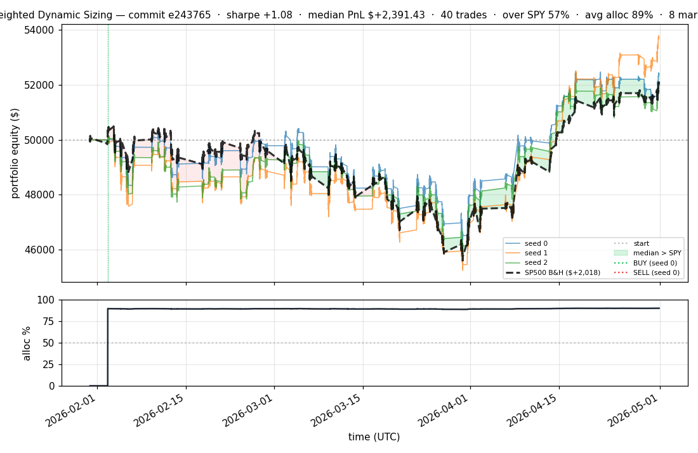
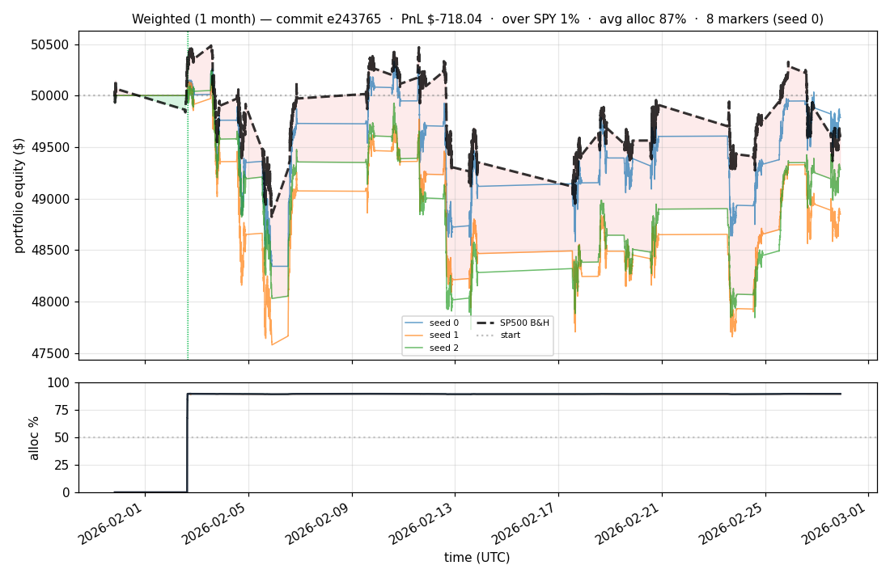

# iter 053 — e243765

**🔴 DISCARD** · exp53: SWAP_MARGIN 0.15→1.0 + cached pretrain (5min iteration)

_2026-05-02 00:14 UTC · 83s wall_

## Result

| metric | value |
|---|---|
| Sharpe (median) | **+1.080** |
| Sharpe CI low (5%) | -1.582 |
| Sharpe CI high (95%) | +3.541 |
| Net PnL | **$+2391.43** (+4.783%) |
| Max drawdown | -9.75% |
| Trades | 40 |
| Fees | $40.00 |
| Seeds completed | 3 |

**Decision reason:** ci_low=-1.5820 ≤ prior best -1.3508

## Per-seed details

```
[evaluator] seed 0: sharpe=+1.080  dd=-8.05%  pnl=$+2,391.43  trades=8
[evaluator] seed 1: sharpe=+1.633  dd=-9.75%  pnl=$+3,722.79  trades=50
[evaluator] seed 2: sharpe=+0.921  dd=-8.53%  pnl=$+1,774.44  trades=40
```

## Equity curve (full eval window, ~73 days)



## Equity curve (first month)



## Out-of-symbol holdout eval

Tested on **JPM, WMT, V, DIS, JNJ** — large-caps the model NEVER saw during training.

| seed | sharpe | PnL | trades | DD% |
|---:|---:|---:|---:|---:|
| 0 | +0.793 | $+1,328.04 | 5 | -8.32% |
| 1 | +0.793 | $+1,328.04 | 5 | -8.32% |
| 2 | +0.793 | $+1,328.04 | 5 | -8.32% |

**Median holdout sharpe: +0.793** (vs in-symbol +1.080)

## Transactions

### Seed 0 — 8 trades · ending equity $52,391.43 (+2,391.43 = +4.78%)

| # | timestamp (UTC) | symbol | side |
|---:|---|---|---|
| 1 | 2026-02-02 15:15:00 | IWM | BUY |
| 2 | 2026-02-02 15:18:00 | SPY | BUY |
| 3 | 2026-02-02 15:24:00 | QQQ | BUY |
| 4 | 2026-02-02 15:27:00 | NFLX | BUY |
| 5 | 2026-02-02 15:31:00 | PLTR | BUY |
| 6 | 2026-02-02 15:32:00 | COIN | BUY |
| 7 | 2026-02-02 15:35:00 | XLF | BUY |
| 8 | 2026-02-02 15:35:00 | NIO | BUY |

### Seed 1 — 50 trades · ending equity $53,722.79 (+3,722.79 = +7.45%)

| # | timestamp (UTC) | symbol | side |
|---:|---|---|---|
| 1 | 2026-02-02 15:15:00 | IWM | BUY |
| 2 | 2026-02-02 15:18:00 | SPY | BUY |
| 3 | 2026-02-02 15:24:00 | QQQ | BUY |
| 4 | 2026-02-02 15:27:00 | NFLX | BUY |
| 5 | 2026-02-02 15:31:00 | PLTR | BUY |
| 6 | 2026-02-02 15:32:00 | COIN | BUY |
| 7 | 2026-02-02 15:35:00 | XLF | BUY |
| 8 | 2026-02-02 15:35:00 | NIO | BUY |
| 9 | 2026-02-02 16:40:00 | XLF | SELL |
| 10 | 2026-02-02 16:40:00 | EEM | BUY |
| 11 | 2026-02-02 16:40:00 | XLF | BUY |
| 12 | 2026-02-02 16:42:00 | XLF | SELL |
| 13 | 2026-02-02 16:42:00 | XLF | BUY |
| 14 | 2026-02-02 16:46:00 | PLTR | SELL |
| 15 | 2026-02-02 16:46:00 | AAPL | BUY |
| 16 | 2026-02-02 16:46:00 | MSFT | BUY |
| 17 | 2026-02-02 16:46:00 | NVDA | BUY |
| 18 | 2026-02-02 17:38:00 | XLF | SELL |
| 19 | 2026-02-02 17:38:00 | XLF | BUY |
| 20 | 2026-02-02 17:43:00 | XLF | SELL |
| 21 | 2026-02-02 17:43:00 | XLF | BUY |
| 22 | 2026-02-02 17:44:00 | EEM | SELL |
| 23 | 2026-02-02 17:44:00 | EEM | BUY |
| 24 | 2026-02-02 17:44:00 | AMZN | BUY |
| 25 | 2026-02-02 17:45:00 | XLF | SELL |
| 26 | 2026-02-02 17:45:00 | XLF | BUY |
| 27 | 2026-02-02 17:49:00 | XLF | SELL |
| 28 | 2026-02-02 17:49:00 | XLF | BUY |
| 29 | 2026-02-02 17:50:00 | XLF | SELL |
| 30 | 2026-02-02 17:50:00 | XLF | BUY |
| 31 | 2026-02-02 17:51:00 | XLF | SELL |
| 32 | 2026-02-02 17:51:00 | XLF | BUY |
| 33 | 2026-02-02 17:52:00 | MSFT | SELL |
| 34 | 2026-02-02 17:52:00 | MSFT | BUY |
| 35 | 2026-02-02 17:52:00 | META | BUY |
| 36 | 2026-02-02 17:53:00 | XLF | SELL |
| 37 | 2026-02-02 17:53:00 | XLF | BUY |
| 38 | 2026-02-02 17:54:00 | XLF | SELL |
| 39 | 2026-02-02 17:54:00 | XLF | BUY |
| 40 | 2026-02-02 18:38:00 | IWM | SELL |
| 41 | 2026-02-02 18:38:00 | IWM | BUY |
| 42 | 2026-02-02 18:38:00 | TSLA | BUY |
| 43 | 2026-02-02 18:38:00 | AMD | BUY |
| 44 | 2026-02-02 18:38:00 | INTC | BUY |
| 45 | 2026-02-02 18:38:00 | BAC | BUY |
| 46 | 2026-02-02 18:39:00 | GOOGL | BUY |
| 47 | 2026-02-02 18:39:00 | F | BUY |
| 48 | 2026-02-02 19:03:00 | AAPL | SELL |
| 49 | 2026-02-02 19:03:00 | AAPL | BUY |
| 50 | 2026-02-02 19:03:00 | PLTR | BUY |

### Seed 2 — 40 trades · ending equity $51,774.44 (+1,774.44 = +3.55%)

| # | timestamp (UTC) | symbol | side |
|---:|---|---|---|
| 1 | 2026-02-02 15:15:00 | IWM | BUY |
| 2 | 2026-02-02 15:18:00 | SPY | BUY |
| 3 | 2026-02-02 15:24:00 | IWM | SELL |
| 4 | 2026-02-02 15:24:00 | QQQ | BUY |
| 5 | 2026-02-02 15:24:00 | IWM | BUY |
| 6 | 2026-02-02 15:27:00 | IWM | SELL |
| 7 | 2026-02-02 15:27:00 | IWM | BUY |
| 8 | 2026-02-02 15:27:00 | NFLX | BUY |
| 9 | 2026-02-02 15:31:00 | PLTR | BUY |
| 10 | 2026-02-02 15:32:00 | COIN | BUY |
| 11 | 2026-02-02 15:35:00 | XLF | BUY |
| 12 | 2026-02-02 15:35:00 | NIO | BUY |
| 13 | 2026-02-02 15:37:00 | GOOGL | BUY |
| 14 | 2026-02-02 15:39:00 | QQQ | SELL |
| 15 | 2026-02-02 15:39:00 | QQQ | BUY |
| 16 | 2026-02-02 15:39:00 | BAC | BUY |
| 17 | 2026-02-02 15:40:00 | QQQ | SELL |
| 18 | 2026-02-02 15:40:00 | QQQ | BUY |
| 19 | 2026-02-02 15:40:00 | TSLA | BUY |
| 20 | 2026-02-02 15:40:00 | F | BUY |
| 21 | 2026-02-02 15:54:00 | XLF | SELL |
| 22 | 2026-02-02 15:54:00 | XLF | BUY |
| 23 | 2026-02-02 15:54:00 | NVDA | BUY |
| 24 | 2026-02-02 15:55:00 | GOOGL | SELL |
| 25 | 2026-02-02 15:55:00 | EEM | BUY |
| 26 | 2026-02-02 15:55:00 | GOOGL | BUY |
| 27 | 2026-02-02 16:02:00 | GOOGL | SELL |
| 28 | 2026-02-02 16:02:00 | MSFT | BUY |
| 29 | 2026-02-02 16:03:00 | TSLA | SELL |
| 30 | 2026-02-02 16:03:00 | AMZN | BUY |
| 31 | 2026-02-02 16:03:00 | GOOGL | BUY |
| 32 | 2026-02-02 16:03:00 | TSLA | BUY |
| 33 | 2026-02-02 16:06:00 | META | BUY |
| 34 | 2026-02-02 16:10:00 | INTC | BUY |
| 35 | 2026-02-02 16:17:00 | GOOGL | SELL |
| 36 | 2026-02-02 16:17:00 | AAPL | BUY |
| 37 | 2026-02-02 16:17:00 | GOOGL | BUY |
| 38 | 2026-02-02 16:19:00 | GOOGL | SELL |
| 39 | 2026-02-02 16:19:00 | GOOGL | BUY |
| 40 | 2026-02-02 16:19:00 | AMD | BUY |

## Diff vs previous experiment

```diff
e243765 exp53: WEIGHTED_SWAP_MARGIN 0.15→1.0 — fix exp52's runaway rotation

exp52 with cap=5 + SWAP_MARGIN=0.15 was a disaster: 26k+ trades, $26k
in fees, DD -89%. The SWAP threshold was tuned in earlier iterations
when SWAP rarely fired (because all 20 symbols were held → no unheld
candidates). With MAX_CONCURRENT=5 there are 15 unheld candidates at
all times; the low threshold makes SWAP fire constantly.

Bumping to 1.0 = pred_sharpe edge must be ≥1 unit (not 0.15) before
rotation. Should drop trade count from 26k → ~50-200 (still active,
but selective).


 experiment.py | 2 +-
 1 file changed, 1 insertion(+), 1 deletion(-)
```

---

[← all iterations](.) · [back to README](../README.md)
