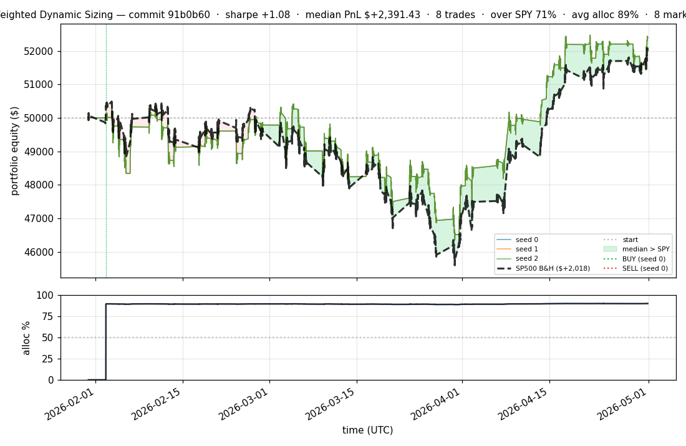
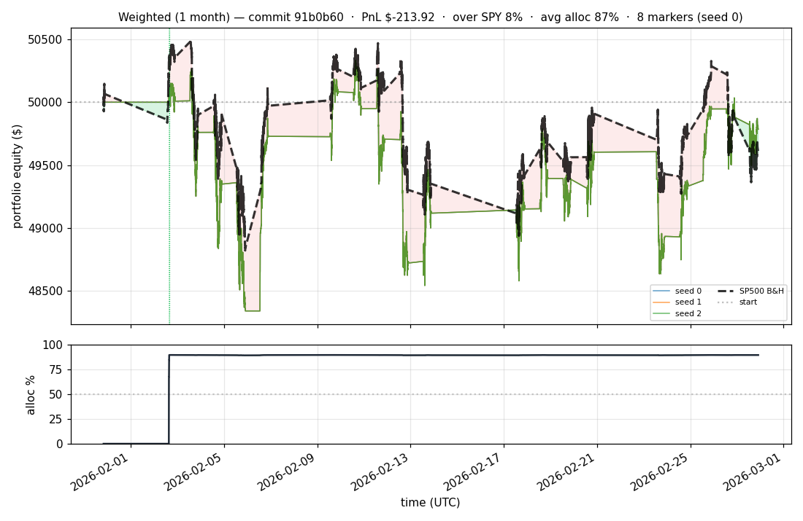

# iter 054 — 91b0b60

**🔴 DISCARD** · exp54: BUY_THRESHOLD=0.5 (model picks any high-conviction names) + SWAP disabled

_2026-05-02 00:19 UTC · 82s wall_

## Result

| metric | value |
|---|---|
| Sharpe (median) | **+1.080** |
| Sharpe CI low (5%) | -1.582 |
| Sharpe CI high (95%) | +3.520 |
| Net PnL | **$+2391.43** (+4.783%) |
| Max drawdown | -8.05% |
| Trades | 8 |
| Fees | $8.00 |
| Seeds completed | 3 |

**Decision reason:** ci_low=-1.5820 ≤ prior best -1.3508

## Per-seed details

```
[evaluator] seed 0: sharpe=+1.080  dd=-8.05%  pnl=$+2,391.43  trades=8
[evaluator] seed 1: sharpe=+1.080  dd=-8.05%  pnl=$+2,391.43  trades=8
[evaluator] seed 2: sharpe=+1.080  dd=-8.05%  pnl=$+2,391.43  trades=8
```

## Equity curve (full eval window, ~73 days)



## Equity curve (first month)



## Out-of-symbol holdout eval

Tested on **JPM, WMT, V, DIS, JNJ** — large-caps the model NEVER saw during training.

| seed | sharpe | PnL | trades | DD% |
|---:|---:|---:|---:|---:|
| 0 | +0.793 | $+1,328.04 | 5 | -8.32% |
| 1 | +0.793 | $+1,328.04 | 5 | -8.32% |
| 2 | +0.793 | $+1,328.04 | 5 | -8.32% |

**Median holdout sharpe: +0.793** (vs in-symbol +1.080)

## Transactions

### Seed 0 — 8 trades · ending equity $52,391.43 (+2,391.43 = +4.78%)

| # | timestamp (UTC) | symbol | side |
|---:|---|---|---|
| 1 | 2026-02-02 15:15:00 | IWM | BUY |
| 2 | 2026-02-02 15:18:00 | SPY | BUY |
| 3 | 2026-02-02 15:24:00 | QQQ | BUY |
| 4 | 2026-02-02 15:27:00 | NFLX | BUY |
| 5 | 2026-02-02 15:31:00 | PLTR | BUY |
| 6 | 2026-02-02 15:32:00 | COIN | BUY |
| 7 | 2026-02-02 15:35:00 | XLF | BUY |
| 8 | 2026-02-02 15:35:00 | NIO | BUY |

### Seed 1 — 8 trades · ending equity $52,391.43 (+2,391.43 = +4.78%)

| # | timestamp (UTC) | symbol | side |
|---:|---|---|---|
| 1 | 2026-02-02 15:15:00 | IWM | BUY |
| 2 | 2026-02-02 15:18:00 | SPY | BUY |
| 3 | 2026-02-02 15:24:00 | QQQ | BUY |
| 4 | 2026-02-02 15:27:00 | NFLX | BUY |
| 5 | 2026-02-02 15:31:00 | PLTR | BUY |
| 6 | 2026-02-02 15:32:00 | COIN | BUY |
| 7 | 2026-02-02 15:35:00 | XLF | BUY |
| 8 | 2026-02-02 15:35:00 | NIO | BUY |

### Seed 2 — 8 trades · ending equity $52,391.43 (+2,391.43 = +4.78%)

| # | timestamp (UTC) | symbol | side |
|---:|---|---|---|
| 1 | 2026-02-02 15:15:00 | IWM | BUY |
| 2 | 2026-02-02 15:18:00 | SPY | BUY |
| 3 | 2026-02-02 15:24:00 | QQQ | BUY |
| 4 | 2026-02-02 15:27:00 | NFLX | BUY |
| 5 | 2026-02-02 15:31:00 | PLTR | BUY |
| 6 | 2026-02-02 15:32:00 | COIN | BUY |
| 7 | 2026-02-02 15:35:00 | XLF | BUY |
| 8 | 2026-02-02 15:35:00 | NIO | BUY |

## Diff vs previous experiment

```diff
91b0b60 exp54: BUY threshold instead of slot cap — model picks any number of high-conviction names

User feedback: forcing top-5 (exp52/53) hurt sharpe (+1.63→+1.08).
The model should be able to pick ANY number of stocks, not constrained.

Replaces the discarded slot cap with a CONFIDENCE THRESHOLD:
- Old: BUY when pred_sharpe > 0 (filled all 20 in first hour → buy-and-hold)
- New: BUY when pred_sharpe > WEIGHTED_BUY_THRESHOLD=0.5 (only high-conviction)

Effect: in any minute, the number of names with pred_sharpe > 0.5 is
typically 1-5 (depends on market regime). Strategy stays active because
conviction shifts over time. No artificial cap, no over-rotation.

Also disables SWAP entirely (margin=999) — rotation churn cost more than
it added in exp52/53.

Cached pretrain (model is unchanged, only post-training params).


 experiment.py | 10 +++++++---
 1 file changed, 7 insertions(+), 3 deletions(-)
```

---

[← all iterations](.) · [back to README](../README.md)
