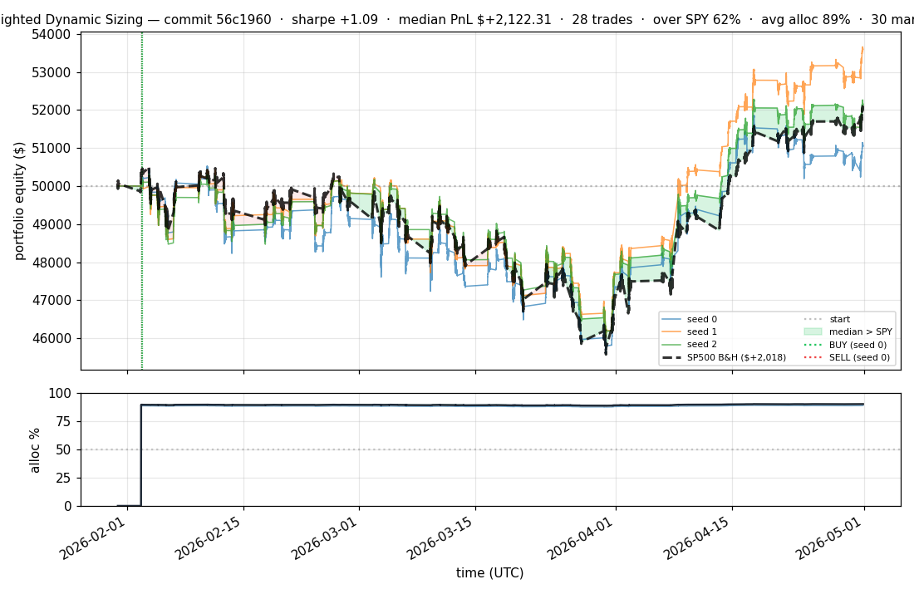
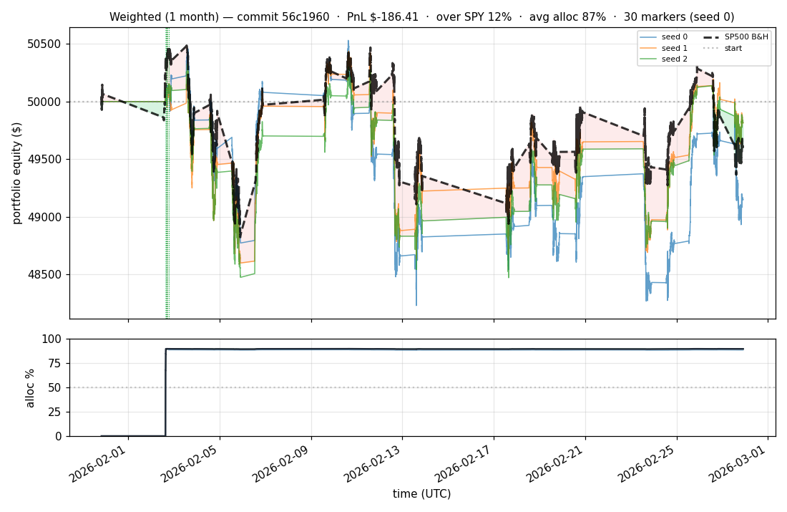

# iter 055 — 56c1960

**🔴 DISCARD** · exp55: 1-hour min hold per position (no slot cap, BUY > 0, SWAP > 0.20)

_2026-05-02 00:23 UTC · 79s wall_

## Result

| metric | value |
|---|---|
| Sharpe (median) | **+1.092** |
| Sharpe CI low (5%) | -1.734 |
| Sharpe CI high (95%) | +3.848 |
| Net PnL | **$+2122.31** (+4.245%) |
| Max drawdown | -9.76% |
| Trades | 28 |
| Fees | $28.00 |
| Seeds completed | 3 |

**Decision reason:** ci_low=-1.7340 ≤ prior best -1.3508

## Per-seed details

```
[evaluator] seed 0: sharpe=+0.569  dd=-9.76%  pnl=$+1,039.95  trades=30
[evaluator] seed 1: sharpe=+1.559  dd=-8.74%  pnl=$+3,584.82  trades=28
[evaluator] seed 2: sharpe=+1.092  dd=-8.56%  pnl=$+2,122.31  trades=26
```

## Equity curve (full eval window, ~73 days)



## Equity curve (first month)



## Out-of-symbol holdout eval

Tested on **JPM, WMT, V, DIS, JNJ** — large-caps the model NEVER saw during training.

| seed | sharpe | PnL | trades | DD% |
|---:|---:|---:|---:|---:|
| 0 | +0.793 | $+1,328.04 | 5 | -8.32% |
| 1 | +0.793 | $+1,328.04 | 5 | -8.32% |
| 2 | +0.793 | $+1,328.04 | 5 | -8.32% |

**Median holdout sharpe: +0.793** (vs in-symbol +1.092)

## Transactions

### Seed 0 — 30 trades · ending equity $51,039.95 (+1,039.95 = +2.08%)

| # | timestamp (UTC) | symbol | side |
|---:|---|---|---|
| 1 | 2026-02-02 15:15:00 | IWM | BUY |
| 2 | 2026-02-02 15:18:00 | SPY | BUY |
| 3 | 2026-02-02 15:24:00 | QQQ | BUY |
| 4 | 2026-02-02 15:27:00 | NFLX | BUY |
| 5 | 2026-02-02 15:31:00 | PLTR | BUY |
| 6 | 2026-02-02 15:32:00 | COIN | BUY |
| 7 | 2026-02-02 15:35:00 | XLF | BUY |
| 8 | 2026-02-02 15:35:00 | NIO | BUY |
| 9 | 2026-02-02 16:18:00 | SPY | SELL |
| 10 | 2026-02-02 16:18:00 | SPY | BUY |
| 11 | 2026-02-02 16:18:00 | EEM | BUY |
| 12 | 2026-02-02 16:18:00 | AAPL | BUY |
| 13 | 2026-02-02 16:18:00 | MSFT | BUY |
| 14 | 2026-02-02 16:18:00 | NVDA | BUY |
| 15 | 2026-02-02 16:19:00 | AMZN | BUY |
| 16 | 2026-02-02 16:46:00 | XLF | SELL |
| 17 | 2026-02-02 16:46:00 | XLF | BUY |
| 18 | 2026-02-02 16:46:00 | GOOGL | BUY |
| 19 | 2026-02-02 16:51:00 | NIO | SELL |
| 20 | 2026-02-02 16:51:00 | META | BUY |
| 21 | 2026-02-02 17:15:00 | PLTR | SELL |
| 22 | 2026-02-02 17:15:00 | TSLA | BUY |
| 23 | 2026-02-02 17:15:00 | AMD | BUY |
| 24 | 2026-02-02 17:15:00 | INTC | BUY |
| 25 | 2026-02-02 18:24:00 | IWM | SELL |
| 26 | 2026-02-02 18:24:00 | BAC | BUY |
| 27 | 2026-02-02 18:24:00 | F | BUY |
| 28 | 2026-02-02 18:24:00 | PLTR | BUY |
| 29 | 2026-02-02 18:24:00 | NIO | BUY |
| 30 | 2026-02-02 18:24:00 | IWM | BUY |

### Seed 1 — 28 trades · ending equity $53,584.82 (+3,584.82 = +7.17%)

| # | timestamp (UTC) | symbol | side |
|---:|---|---|---|
| 1 | 2026-02-02 15:15:00 | IWM | BUY |
| 2 | 2026-02-02 15:18:00 | SPY | BUY |
| 3 | 2026-02-02 15:24:00 | QQQ | BUY |
| 4 | 2026-02-02 15:27:00 | NFLX | BUY |
| 5 | 2026-02-02 15:31:00 | PLTR | BUY |
| 6 | 2026-02-02 15:32:00 | COIN | BUY |
| 7 | 2026-02-02 15:35:00 | XLF | BUY |
| 8 | 2026-02-02 15:35:00 | NIO | BUY |
| 9 | 2026-02-02 16:25:00 | SPY | SELL |
| 10 | 2026-02-02 16:25:00 | SPY | BUY |
| 11 | 2026-02-02 16:25:00 | EEM | BUY |
| 12 | 2026-02-02 16:25:00 | AAPL | BUY |
| 13 | 2026-02-02 16:25:00 | MSFT | BUY |
| 14 | 2026-02-02 16:25:00 | NVDA | BUY |
| 15 | 2026-02-02 16:26:00 | AMZN | BUY |
| 16 | 2026-02-02 16:35:00 | XLF | SELL |
| 17 | 2026-02-02 16:35:00 | XLF | BUY |
| 18 | 2026-02-02 16:35:00 | GOOGL | BUY |
| 19 | 2026-02-02 16:46:00 | PLTR | SELL |
| 20 | 2026-02-02 16:46:00 | META | BUY |
| 21 | 2026-02-02 16:46:00 | TSLA | BUY |
| 22 | 2026-02-02 16:46:00 | AMD | BUY |
| 23 | 2026-02-02 17:08:00 | QQQ | SELL |
| 24 | 2026-02-02 17:08:00 | QQQ | BUY |
| 25 | 2026-02-02 17:08:00 | INTC | BUY |
| 26 | 2026-02-02 17:08:00 | BAC | BUY |
| 27 | 2026-02-02 17:08:00 | F | BUY |
| 28 | 2026-02-02 17:08:00 | PLTR | BUY |

### Seed 2 — 26 trades · ending equity $52,122.31 (+2,122.31 = +4.24%)

| # | timestamp (UTC) | symbol | side |
|---:|---|---|---|
| 1 | 2026-02-02 15:15:00 | IWM | BUY |
| 2 | 2026-02-02 15:18:00 | SPY | BUY |
| 3 | 2026-02-02 15:24:00 | QQQ | BUY |
| 4 | 2026-02-02 15:27:00 | NFLX | BUY |
| 5 | 2026-02-02 15:31:00 | PLTR | BUY |
| 6 | 2026-02-02 15:32:00 | COIN | BUY |
| 7 | 2026-02-02 15:35:00 | XLF | BUY |
| 8 | 2026-02-02 15:35:00 | NIO | BUY |
| 9 | 2026-02-02 16:16:00 | IWM | SELL |
| 10 | 2026-02-02 16:16:00 | IWM | BUY |
| 11 | 2026-02-02 16:16:00 | EEM | BUY |
| 12 | 2026-02-02 16:16:00 | AAPL | BUY |
| 13 | 2026-02-02 16:16:00 | MSFT | BUY |
| 14 | 2026-02-02 16:16:00 | NVDA | BUY |
| 15 | 2026-02-02 16:17:00 | AMZN | BUY |
| 16 | 2026-02-02 16:17:00 | GOOGL | BUY |
| 17 | 2026-02-02 16:36:00 | QQQ | SELL |
| 18 | 2026-02-02 16:36:00 | QQQ | BUY |
| 19 | 2026-02-02 16:36:00 | META | BUY |
| 20 | 2026-02-02 16:36:00 | TSLA | BUY |
| 21 | 2026-02-02 16:36:00 | AMD | BUY |
| 22 | 2026-02-02 16:36:00 | INTC | BUY |
| 23 | 2026-02-02 16:46:00 | COIN | SELL |
| 24 | 2026-02-02 16:46:00 | BAC | BUY |
| 25 | 2026-02-02 16:46:00 | COIN | BUY |
| 26 | 2026-02-02 16:47:00 | F | BUY |

## Diff vs previous experiment

```diff
56c1960 exp55: WEIGHTED_MIN_HOLD_S=3600 — minimum 1-hour hold per position

User constraint: 'hold stock at least 1 hour, don't sell within e.g. 15
minutes — in this way we will not earn on costs for transaction'.

Adds bought_ts tracking + can_sell() to WeightedBroker.
SELL pass + SWAP pass both check (ts - bought_ts) >= 3600s before exiting.

Combined with:
- No artificial slot cap (model picks any number of stocks)
- Original BUY when pred_sharpe > 0 (no high threshold)
- SWAP_MARGIN restored to 0.20 (min-hold provides the rotation throttling
  that prevented exp52's 26k-trade disaster)

Cached pretrain (model unchanged, only post-training params + broker logic).
Hypothesis: model can pick many names freely; min-hold prevents fee burn;
each position gets time to develop. Should land sharpe ≥ +1.5 with sane
trade count (~30-100 in 90 days).


 experiment.py | 31 +++++++++++++++++++++++++------
 1 file changed, 25 insertions(+), 6 deletions(-)
```

---

[← all iterations](.) · [back to README](../README.md)
