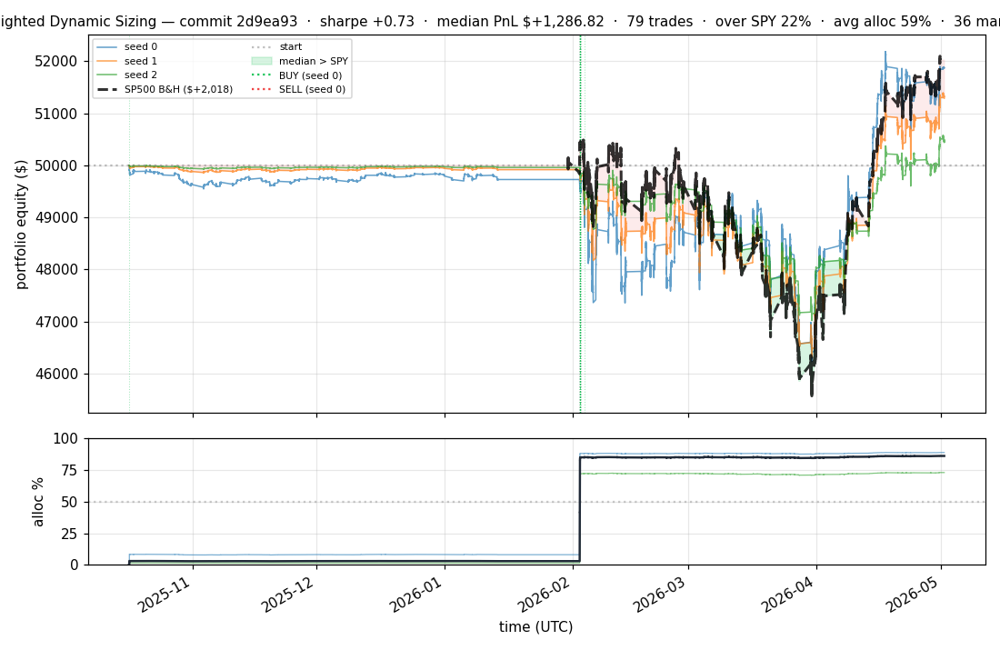
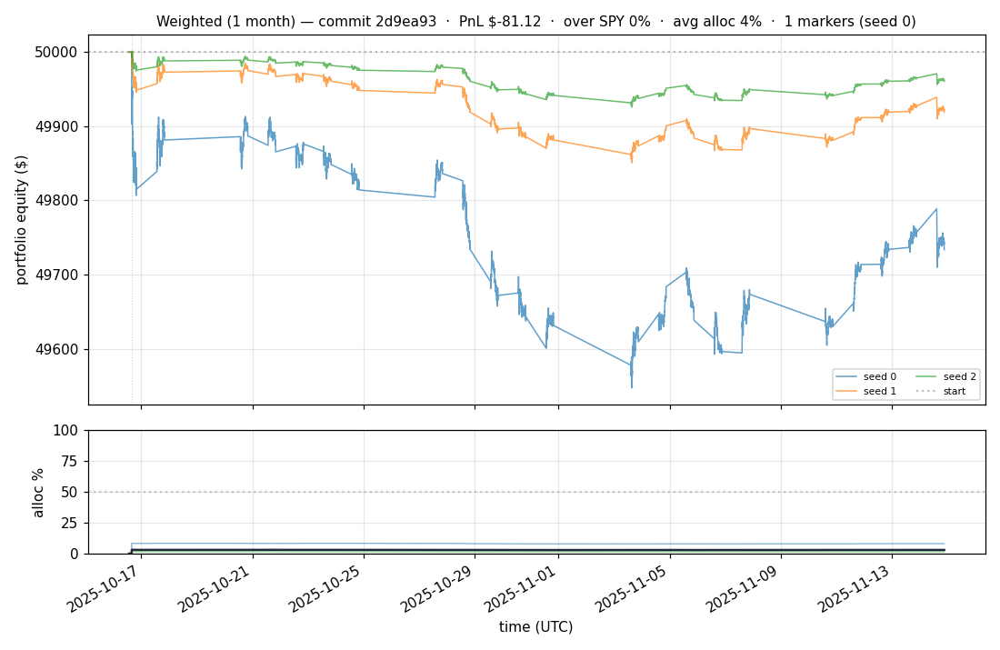

# iter 057 — 2d9ea93

**🔴 DISCARD** · exp57: volume-aware slippage + liquidity gate

_2026-05-02 02:40 UTC · 187s wall_

## Result

| metric | value |
|---|---|
| Sharpe (median) | **+0.734** |
| Sharpe CI low (5%) | -1.795 |
| Sharpe CI high (95%) | +2.972 |
| Net PnL | **$+1286.82** (+2.574%) |
| Max drawdown | -7.54% |
| Trades | 79 |
| Fees | $79.00 |
| Seeds completed | 3 |

**Decision reason:** ci_low=-1.7950 ≤ prior best -1.3508

## Per-seed details

```
[evaluator] seed 0: sharpe=+0.845  dd=-7.54%  pnl=$+1,866.30  trades=36
[evaluator] seed 1: sharpe=+0.734  dd=-7.36%  pnl=$+1,286.82  trades=79
[evaluator] seed 2: sharpe=+0.346  dd=-5.96%  pnl=$+442.24  trades=97
```

## Equity curve (full eval window, ~73 days)



## Equity curve (first month)



## Out-of-symbol holdout eval

Tested on **JPM, WMT, V, DIS, JNJ** — large-caps the model NEVER saw during training.

| seed | sharpe | PnL | trades | DD% |
|---:|---:|---:|---:|---:|
| 0 | -0.207 | $-153.19 | 5 | -3.49% |
| 1 | -0.136 | $-41.71 | 5 | -1.48% |
| 2 | +0.027 | $+2.71 | 5 | -0.66% |

**Median holdout sharpe: -0.136** (vs in-symbol +0.734)

## Transactions

### Seed 0 — 36 trades · ending equity $51,866.30 (+1,866.30 = +3.73%)

| # | timestamp (UTC) | symbol | side |
|---:|---|---|---|
| 1 | 2025-10-16 15:48:00 | MMC | BUY |
| 2 | 2026-02-02 15:15:00 | IWM | BUY |
| 3 | 2026-02-02 15:18:00 | SPY | BUY |
| 4 | 2026-02-02 15:24:00 | QQQ | BUY |
| 5 | 2026-02-02 15:27:00 | NFLX | BUY |
| 6 | 2026-02-02 15:31:00 | PLTR | BUY |
| 7 | 2026-02-02 15:32:00 | COIN | BUY |
| 8 | 2026-02-02 15:35:00 | XLF | BUY |
| 9 | 2026-02-02 15:35:00 | NIO | BUY |
| 10 | 2026-02-02 15:37:00 | BAC | BUY |
| 11 | 2026-02-02 15:37:00 | GOOGL | BUY |
| 12 | 2026-02-02 15:40:00 | F | BUY |
| 13 | 2026-02-02 15:40:00 | TSLA | BUY |
| 14 | 2026-02-02 15:54:00 | NVDA | BUY |
| 15 | 2026-02-02 15:55:00 | EEM | BUY |
| 16 | 2026-02-02 15:59:00 | AMZN | BUY |
| 17 | 2026-02-02 16:00:00 | MSFT | BUY |
| 18 | 2026-02-02 16:06:00 | META | BUY |
| 19 | 2026-02-02 16:10:00 | INTC | BUY |
| 20 | 2026-02-02 16:16:00 | AAPL | BUY |
| 21 | 2026-02-02 16:19:00 | AMD | BUY |
| 22 | 2026-02-02 16:19:00 | ORCL | BUY |
| 23 | 2026-02-02 16:25:00 | PFE | BUY |
| 24 | 2026-02-02 16:35:00 | AVGO | BUY |
| 25 | 2026-02-02 16:36:00 | NOW | BUY |
| 26 | 2026-02-02 16:37:00 | CVX | BUY |
| 27 | 2026-02-02 16:37:00 | BSX | BUY |
| 28 | 2026-02-02 16:37:00 | XOM | BUY |
| 29 | 2026-02-02 16:37:00 | C | BUY |
| 30 | 2026-02-02 16:37:00 | T | BUY |
| 31 | 2026-02-02 16:38:00 | CMCSA | BUY |
| 32 | 2026-02-02 16:38:00 | SCHW | BUY |
| 33 | 2026-02-02 16:38:00 | NKE | BUY |
| 34 | 2026-02-02 16:38:00 | KO | BUY |
| 35 | 2026-02-02 16:38:00 | VZ | BUY |
| 36 | 2026-02-03 17:23:00 | MO | BUY |

### Seed 1 — 79 trades · ending equity $51,286.82 (+1,286.82 = +2.57%)

| # | timestamp (UTC) | symbol | side |
|---:|---|---|---|
| 1 | 2025-10-16 15:48:00 | MMC | BUY |
| 2 | 2026-02-02 15:15:00 | IWM | BUY |
| 3 | 2026-02-02 15:18:00 | SPY | BUY |
| 4 | 2026-02-02 15:24:00 | QQQ | BUY |
| 5 | 2026-02-02 15:27:00 | NFLX | BUY |
| 6 | 2026-02-02 15:31:00 | PLTR | BUY |
| 7 | 2026-02-02 15:32:00 | COIN | BUY |
| 8 | 2026-02-02 15:35:00 | XLF | BUY |
| 9 | 2026-02-02 15:35:00 | NIO | BUY |
| 10 | 2026-02-02 15:37:00 | BAC | BUY |
| 11 | 2026-02-02 15:37:00 | GOOGL | BUY |
| 12 | 2026-02-02 15:40:00 | F | BUY |
| 13 | 2026-02-02 15:40:00 | TSLA | BUY |
| 14 | 2026-02-02 15:54:00 | NVDA | BUY |
| 15 | 2026-02-02 15:55:00 | EEM | BUY |
| 16 | 2026-02-02 15:59:00 | AMZN | BUY |
| 17 | 2026-02-02 16:00:00 | MSFT | BUY |
| 18 | 2026-02-02 16:06:00 | META | BUY |
| 19 | 2026-02-02 16:10:00 | INTC | BUY |
| 20 | 2026-02-02 16:16:00 | AAPL | BUY |
| 21 | 2026-02-02 16:19:00 | AMD | BUY |
| 22 | 2026-02-02 16:19:00 | ORCL | BUY |
| 23 | 2026-02-02 16:25:00 | PFE | BUY |
| 24 | 2026-02-02 16:35:00 | AVGO | BUY |
| 25 | 2026-02-02 16:36:00 | NOW | BUY |
| 26 | 2026-02-02 16:37:00 | SCHW | BUY |
| 27 | 2026-02-02 16:37:00 | C | BUY |
| 28 | 2026-02-02 16:37:00 | BSX | BUY |
| 29 | 2026-02-02 16:37:00 | XOM | BUY |
| 30 | 2026-02-02 16:37:00 | KO | BUY |
| 31 | 2026-02-02 16:38:00 | CVX | BUY |
| 32 | 2026-02-02 16:38:00 | NKE | BUY |
| 33 | 2026-02-02 16:38:00 | VZ | BUY |
| 34 | 2026-02-02 16:38:00 | CMCSA | BUY |
| 35 | 2026-02-02 16:38:00 | T | BUY |
| 36 | 2026-02-02 16:39:00 | IBM | BUY |
| 37 | 2026-02-02 16:39:00 | ABT | BUY |
| 38 | 2026-02-02 16:39:00 | MRK | BUY |
| 39 | 2026-02-02 16:39:00 | NEE | BUY |
| 40 | 2026-02-02 16:39:00 | MDLZ | BUY |
| 41 | 2026-02-02 16:40:00 | SBUX | BUY |
| 42 | 2026-02-02 16:40:00 | ETN | BUY |
| 43 | 2026-02-02 16:40:00 | USB | BUY |
| 44 | 2026-02-02 16:40:00 | BMY | BUY |
| 45 | 2026-02-02 16:42:00 | UNH | BUY |
| 46 | 2026-02-02 16:42:00 | HD | BUY |
| 47 | 2026-02-02 16:43:00 | INTU | BUY |
| 48 | 2026-02-02 16:44:00 | MO | BUY |
| 49 | 2026-02-02 16:44:00 | TXN | BUY |
| 50 | 2026-02-02 16:44:00 | MA | BUY |
| 51 | 2026-02-02 16:45:00 | GE | BUY |
| 52 | 2026-02-02 16:46:00 | ADBE | BUY |
| 53 | 2026-02-02 16:46:00 | PEP | BUY |
| 54 | 2026-02-02 16:49:00 | PG | BUY |
| 55 | 2026-02-02 16:50:00 | AXP | BUY |
| 56 | 2026-02-02 16:54:00 | COF | BUY |
| 57 | 2026-02-02 16:54:00 | QCOM | BUY |
| 58 | 2026-02-02 16:54:00 | CRM | BUY |
| 59 | 2026-02-02 16:55:00 | AMAT | BUY |
| 60 | 2026-02-02 16:57:00 | LLY | BUY |
| 61 | 2026-02-02 16:59:00 | ADI | BUY |
| 62 | 2026-02-02 17:00:00 | BLK | BUY |
| 63 | 2026-02-02 17:01:00 | UPS | BUY |
| 64 | 2026-02-02 17:01:00 | RTX | BUY |
| 65 | 2026-02-02 17:02:00 | BA | BUY |
| 66 | 2026-02-02 17:04:00 | CAT | BUY |
| 67 | 2026-02-02 17:09:00 | MCD | BUY |
| 68 | 2026-02-02 17:10:00 | GILD | BUY |
| 69 | 2026-02-02 17:12:00 | ABBV | BUY |
| 70 | 2026-02-02 17:13:00 | ZTS | BUY |
| 71 | 2026-02-02 17:17:00 | MS | BUY |
| 72 | 2026-02-02 17:18:00 | LIN | BUY |
| 73 | 2026-02-02 17:24:00 | AMGN | BUY |
| 74 | 2026-02-02 17:26:00 | DUK | BUY |
| 75 | 2026-02-02 19:03:00 | LOW | BUY |
| 76 | 2026-02-02 19:19:00 | SYK | BUY |
| 77 | 2026-02-03 16:34:00 | PM | BUY |
| 78 | 2026-03-04 16:34:00 | DHR | BUY |
| 79 | 2026-04-06 13:30:00 | BKNG | BUY |

### Seed 2 — 97 trades · ending equity $50,442.24 (+442.24 = +0.88%)

| # | timestamp (UTC) | symbol | side |
|---:|---|---|---|
| 1 | 2025-10-16 15:48:00 | MMC | BUY |
| 2 | 2026-02-02 15:15:00 | IWM | BUY |
| 3 | 2026-02-02 15:18:00 | SPY | BUY |
| 4 | 2026-02-02 15:24:00 | QQQ | BUY |
| 5 | 2026-02-02 15:27:00 | NFLX | BUY |
| 6 | 2026-02-02 15:31:00 | PLTR | BUY |
| 7 | 2026-02-02 15:32:00 | COIN | BUY |
| 8 | 2026-02-02 15:35:00 | NIO | BUY |
| 9 | 2026-02-02 15:35:00 | XLF | BUY |
| 10 | 2026-02-02 15:37:00 | GOOGL | BUY |
| 11 | 2026-02-02 15:37:00 | BAC | BUY |
| 12 | 2026-02-02 15:40:00 | TSLA | BUY |
| 13 | 2026-02-02 15:40:00 | F | BUY |
| 14 | 2026-02-02 15:54:00 | NVDA | BUY |
| 15 | 2026-02-02 15:55:00 | EEM | BUY |
| 16 | 2026-02-02 15:59:00 | AMZN | BUY |
| 17 | 2026-02-02 16:00:00 | MSFT | BUY |
| 18 | 2026-02-02 16:06:00 | META | BUY |
| 19 | 2026-02-02 16:10:00 | INTC | BUY |
| 20 | 2026-02-02 16:16:00 | AAPL | BUY |
| 21 | 2026-02-02 16:19:00 | AMD | BUY |
| 22 | 2026-02-02 16:19:00 | ORCL | BUY |
| 23 | 2026-02-02 16:25:00 | PFE | BUY |
| 24 | 2026-02-02 16:35:00 | AVGO | BUY |
| 25 | 2026-02-02 16:36:00 | NOW | BUY |
| 26 | 2026-02-02 16:37:00 | XOM | BUY |
| 27 | 2026-02-02 16:37:00 | C | BUY |
| 28 | 2026-02-02 16:37:00 | SCHW | BUY |
| 29 | 2026-02-02 16:37:00 | T | BUY |
| 30 | 2026-02-02 16:37:00 | CMCSA | BUY |
| 31 | 2026-02-02 16:38:00 | KO | BUY |
| 32 | 2026-02-02 16:38:00 | NKE | BUY |
| 33 | 2026-02-02 16:38:00 | CVX | BUY |
| 34 | 2026-02-02 16:38:00 | BSX | BUY |
| 35 | 2026-02-02 16:38:00 | VZ | BUY |
| 36 | 2026-02-02 16:39:00 | ABT | BUY |
| 37 | 2026-02-02 16:39:00 | MRK | BUY |
| 38 | 2026-02-02 16:39:00 | IBM | BUY |
| 39 | 2026-02-02 16:39:00 | MDLZ | BUY |
| 40 | 2026-02-02 16:39:00 | NEE | BUY |
| 41 | 2026-02-02 16:40:00 | SBUX | BUY |
| 42 | 2026-02-02 16:40:00 | USB | BUY |
| 43 | 2026-02-02 16:40:00 | BMY | BUY |
| 44 | 2026-02-02 16:40:00 | ETN | BUY |
| 45 | 2026-02-02 16:42:00 | HD | BUY |
| 46 | 2026-02-02 16:42:00 | UNH | BUY |
| 47 | 2026-02-02 16:43:00 | INTU | BUY |
| 48 | 2026-02-02 16:44:00 | MO | BUY |
| 49 | 2026-02-02 16:44:00 | MA | BUY |
| 50 | 2026-02-02 16:44:00 | TXN | BUY |
| 51 | 2026-02-02 16:45:00 | GE | BUY |
| 52 | 2026-02-02 16:46:00 | PEP | BUY |
| 53 | 2026-02-02 16:46:00 | ADBE | BUY |
| 54 | 2026-02-02 16:49:00 | PG | BUY |
| 55 | 2026-02-02 16:50:00 | AXP | BUY |
| 56 | 2026-02-02 16:54:00 | COF | BUY |
| 57 | 2026-02-02 16:54:00 | CRM | BUY |
| 58 | 2026-02-02 16:54:00 | QCOM | BUY |
| 59 | 2026-02-02 16:55:00 | AMAT | BUY |
| 60 | 2026-02-02 16:57:00 | LLY | BUY |
| 61 | 2026-02-02 16:59:00 | ADI | BUY |
| 62 | 2026-02-02 17:00:00 | BLK | BUY |
| 63 | 2026-02-02 17:01:00 | RTX | BUY |
| 64 | 2026-02-02 17:01:00 | UPS | BUY |
| 65 | 2026-02-02 17:02:00 | BA | BUY |
| 66 | 2026-02-02 17:04:00 | CAT | BUY |
| 67 | 2026-02-02 17:09:00 | MCD | BUY |
| 68 | 2026-02-02 17:10:00 | GILD | BUY |
| 69 | 2026-02-02 17:12:00 | ABBV | BUY |
| 70 | 2026-02-02 17:13:00 | ZTS | BUY |
| 71 | 2026-02-02 17:17:00 | MS | BUY |
| 72 | 2026-02-02 17:18:00 | LIN | BUY |
| 73 | 2026-02-02 17:19:00 | LOW | BUY |
| 74 | 2026-02-02 17:24:00 | AMGN | BUY |
| 75 | 2026-02-02 17:26:00 | DUK | BUY |
| 76 | 2026-02-02 17:26:00 | COST | BUY |
| 77 | 2026-02-02 17:31:00 | PM | BUY |
| 78 | 2026-02-02 17:34:00 | CB | BUY |
| 79 | 2026-02-02 17:42:00 | SPGI | BUY |
| 80 | 2026-02-02 17:48:00 | TMO | BUY |
| 81 | 2026-02-02 17:50:00 | ELV | BUY |
| 82 | 2026-02-02 17:50:00 | HON | BUY |
| 83 | 2026-02-02 17:50:00 | SYK | BUY |
| 84 | 2026-02-02 17:52:00 | DHR | BUY |
| 85 | 2026-02-02 17:59:00 | ISRG | BUY |
| 86 | 2026-02-02 18:04:00 | BKNG | BUY |
| 87 | 2026-02-02 18:07:00 | LMT | BUY |
| 88 | 2026-02-02 18:28:00 | GS | BUY |
| 89 | 2026-02-02 18:37:00 | DE | BUY |
| 90 | 2026-02-02 18:42:00 | ACN | BUY |
| 91 | 2026-02-02 19:02:00 | AMT | BUY |
| 92 | 2026-02-02 19:12:00 | CI | BUY |
| 93 | 2026-02-02 19:40:00 | PLD | BUY |
| 94 | 2026-02-02 20:28:00 | REGN | BUY |
| 95 | 2026-02-03 15:08:00 | VRTX | BUY |
| 96 | 2026-04-06 13:31:00 | BKNG | SELL |
| 97 | 2026-04-06 14:35:00 | BKNG | BUY |

## Diff vs previous experiment

```diff
2d9ea93 exp57: volume-aware slippage + liquidity gate (realistic friction) + re-drop VIX

User: 'volume of sales is also important factor, otherwise could happen
that sale transactions will not be possible to do, we need to calculate
small loss as well (spread between real price and what we will be able to
sell it in reality)'.

Three changes:
1. WeightedBroker.buy_usd / sell_all now take bar_dollar_volume:
   - LIQUIDITY GATE: refuse trade if order > MAX_BAR_VOLUME_PARTICIPATION (10%)
   - LINEAR IMPACT: extra slippage = participation_pct × VOLUME_IMPACT_BPS_PER_PCT
     capped at VOLUME_IMPACT_MAX_BPS (200bps = 2%).
2. featurize() output gains a raw 'volume' column (not in ALL_FEATURES,
   just data the simulator can use).
3. simulate_weighted passes bar_dollar_volume to every buy_usd / sell_all.

Also re-removes VIX (the exp56 discard reset reverted that fix).

For mostly-liquid mega-caps (our universe), participation is typically
0.01-1% → 0.5-50bps extra slippage, barely changing behavior. For any
illiquid name our trade would either be blocked or pay realistic impact.

Headline metrics likely DROP slightly (we now pay realistic friction)
but result is more trustworthy as a paper-trading proxy.

Cached pretrain (exp56's 95-symbol model checkpoints — only fill mechanics changed).


 experiment.py | 71 +++++++++++++++++++++++++++++++++++++++++++++++++----------
 1 file changed, 59 insertions(+), 12 deletions(-)
```

---

[← all iterations](.) · [back to README](../README.md)
