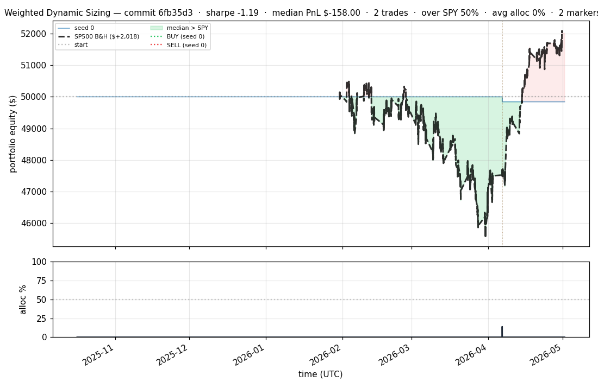
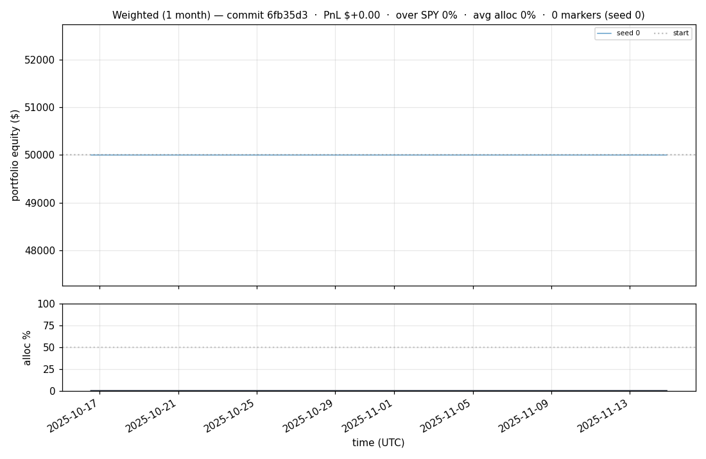

# iter 062 — 6fb35d3

**🔴 DISCARD** · exp62: rank-percentile=0.90 on active profiles (top-decile)

_2026-05-02 15:31 UTC · 2791s wall_

## Result

| metric | value |
|---|---|
| Sharpe (median) | **-1.189** |
| Sharpe CI low (5%) | -2.897 |
| Sharpe CI high (95%) | +1.195 |
| Net PnL | **$-158.00** (-0.316%) |
| Max drawdown | -0.33% |
| Trades | 2 |
| Fees | $2.00 |
| Seeds completed | 1 |

**Decision reason:** ci_low=-2.8970 ≤ prior best -1.3508

## Per-seed details

```
[evaluator] seed 0: sharpe=-1.189  dd=-0.33%  pnl=$-158.00  trades=2
```

## Equity curve (full eval window, ~73 days)



## Equity curve (first month)



## Trader profile comparison

Same trained model, different time-horizon strategies + SPY benchmark + passive top-N pickers.

| profile | sharpe | PnL ($) | PnL % | trades | DD % | horizon |
|---|---:|---:|---:|---:|---:|---:|
| **intraday** | -1.398 | $-218.82 | -0.44% | 12 | -0.46% | 2h |
| **intramonth** | -0.419 | $-1.47 | -0.00% | 2 | -0.01% | 30d |
| **intraweek** | -77.381 | $-43,997.95 | -88.00% | 17741 | -88.00% | 5d |
| **longterm** | -0.419 | $-1.47 | -0.00% | 2 | -0.01% | 30d |
| **spy_buyhold** | +1.007 | $+1,804.56 | +3.63% | 1 | -8.76% | - |
| **top10_picker** | -1.084 | $-2,323.09 | -4.65% | 7 | -10.07% | - |
| **top20_picker** | -1.333 | $-2,454.82 | -4.91% | 17 | -8.43% | - |
| **top5_picker** | +0.080 | $+46.54 | +0.09% | 3 | -6.85% | - |

**Best active strategy: `top5_picker` (sharpe +0.080) — LOSES TO SPY**

## Out-of-symbol holdout eval

Tested on **JPM, WMT, V, DIS, JNJ** — large-caps the model NEVER saw during training.

| seed | sharpe | PnL | trades | DD% |
|---:|---:|---:|---:|---:|
| 0 | +0.000 | $+0.00 | 0 | +0.00% |
| 1 | +0.000 | $+0.00 | 0 | +0.00% |
| 2 | -1.181 | $-1,962.33 | 9 | -8.79% |

**Median holdout sharpe: +0.000** (vs in-symbol -1.189)

## Transactions

### Seed 0 — 2 trades · ending equity $49,842.00 (-158.00 = -0.32%)

| # | timestamp (UTC) | symbol | side |
|---:|---|---|---|
| 1 | 2026-04-06 13:33:00 | BKNG | BUY |
| 2 | 2026-04-06 14:23:00 | BKNG | SELL |

### Seed 1 — 0 trades · ending equity $50,000.00 (+0.00 = +0.00%)

_(no trades executed)_

### Seed 2 — 1085 trades · ending equity $46,760.41 (-3,239.59 = -6.48%)

| # | timestamp (UTC) | symbol | side |
|---:|---|---|---|
| 1 | 2025-10-16 15:53:00 | MMC | BUY |
| 2 | 2026-02-02 15:15:00 | IWM | BUY |
| 3 | 2026-02-02 15:18:00 | IWM | SELL |
| 4 | 2026-02-02 15:18:00 | SPY | BUY |
| 5 | 2026-02-02 15:18:00 | IWM | BUY |
| 6 | 2026-02-02 15:24:00 | SPY | SELL |
| 7 | 2026-02-02 15:24:00 | SPY | BUY |
| 8 | 2026-02-02 15:24:00 | QQQ | BUY |
| 9 | 2026-02-02 15:27:00 | NFLX | BUY |
| 10 | 2026-02-02 15:31:00 | SPY | SELL |
| 11 | 2026-02-02 15:31:00 | SPY | BUY |
| 12 | 2026-02-02 15:31:00 | PLTR | BUY |
| 13 | 2026-02-02 15:32:00 | SPY | SELL |
| 14 | 2026-02-02 15:32:00 | SPY | BUY |
| 15 | 2026-02-02 15:32:00 | COIN | BUY |
| 16 | 2026-02-02 15:35:00 | NFLX | SELL |
| 17 | 2026-02-02 15:35:00 | XLF | BUY |
| 18 | 2026-02-02 15:35:00 | NFLX | BUY |
| 19 | 2026-02-02 15:35:00 | NIO | BUY |
| 20 | 2026-02-02 15:37:00 | NIO | SELL |
| 21 | 2026-02-02 15:37:00 | GOOGL | BUY |
| 22 | 2026-02-02 15:37:00 | BAC | BUY |
| 23 | 2026-02-02 15:37:00 | NIO | BUY |
| 24 | 2026-02-02 15:40:00 | BAC | SELL |
| 25 | 2026-02-02 15:40:00 | TSLA | BUY |
| 26 | 2026-02-02 15:41:00 | SPY | SELL |
| 27 | 2026-02-02 15:41:00 | SPY | BUY |
| 28 | 2026-02-02 15:41:00 | BAC | BUY |
| 29 | 2026-02-02 15:41:00 | F | BUY |
| 30 | 2026-02-02 15:54:00 | XLF | SELL |
| 31 | 2026-02-02 15:54:00 | XLF | BUY |
| 32 | 2026-02-02 15:54:00 | NVDA | BUY |
| 33 | 2026-02-02 15:55:00 | F | SELL |
| 34 | 2026-02-02 15:55:00 | EEM | BUY |
| 35 | 2026-02-02 15:55:00 | F | BUY |
| 36 | 2026-02-02 15:59:00 | NIO | SELL |
| 37 | 2026-02-02 15:59:00 | AMZN | BUY |
| 38 | 2026-02-02 15:59:00 | NIO | BUY |
| 39 | 2026-02-02 16:00:00 | XLF | SELL |
| 40 | 2026-02-02 16:00:00 | XLF | BUY |
| 41 | 2026-02-02 16:00:00 | MSFT | BUY |
| 42 | 2026-02-02 16:06:00 | XLF | SELL |
| 43 | 2026-02-02 16:06:00 | XLF | BUY |
| 44 | 2026-02-02 16:06:00 | META | BUY |
| 45 | 2026-02-02 16:10:00 | XLF | SELL |
| 46 | 2026-02-02 16:10:00 | XLF | BUY |
| 47 | 2026-02-02 16:10:00 | INTC | BUY |
| 48 | 2026-02-02 16:16:00 | BAC | SELL |
| 49 | 2026-02-02 16:16:00 | AAPL | BUY |
| 50 | 2026-02-02 16:16:00 | BAC | BUY |
| 51 | 2026-02-02 16:19:00 | BAC | SELL |
| 52 | 2026-02-02 16:19:00 | AMD | BUY |
| 53 | 2026-02-02 16:19:00 | BAC | BUY |
| 54 | 2026-02-02 16:20:00 | F | SELL |
| 55 | 2026-02-02 16:20:00 | F | BUY |
| 56 | 2026-02-02 16:20:00 | ORCL | BUY |
| 57 | 2026-02-02 16:25:00 | XLF | SELL |
| 58 | 2026-02-02 16:25:00 | XLF | BUY |
| 59 | 2026-02-02 16:25:00 | PFE | BUY |
| 60 | 2026-02-02 16:35:00 | XLF | SELL |
| 61 | 2026-02-02 16:35:00 | XLF | BUY |
| 62 | 2026-02-02 16:36:00 | PFE | SELL |
| 63 | 2026-02-02 16:36:00 | AVGO | BUY |
| 64 | 2026-02-02 16:37:00 | EEM | SELL |
| 65 | 2026-02-02 16:37:00 | EEM | BUY |
| 66 | 2026-02-02 16:37:00 | XOM | BUY |
| 67 | 2026-02-02 16:38:00 | EEM | SELL |
| 68 | 2026-02-02 16:38:00 | EEM | BUY |
| 69 | 2026-02-02 16:38:00 | CVX | BUY |
| 70 | 2026-02-02 16:39:00 | F | SELL |
| 71 | 2026-02-02 16:39:00 | F | BUY |
| 72 | 2026-02-02 16:40:00 | F | SELL |
| 73 | 2026-02-02 16:40:00 | F | BUY |
| 74 | 2026-02-02 16:41:00 | NIO | SELL |
| 75 | 2026-02-02 16:41:00 | NIO | BUY |
| 76 | 2026-02-02 16:42:00 | F | SELL |
| 77 | 2026-02-02 16:42:00 | F | BUY |
| 78 | 2026-02-02 16:43:00 | F | SELL |
| 79 | 2026-02-02 16:43:00 | F | BUY |
| 80 | 2026-02-02 16:44:00 | EEM | SELL |
| 81 | 2026-02-02 16:44:00 | EEM | BUY |
| 82 | 2026-02-02 16:44:00 | UNH | BUY |
| 83 | 2026-02-02 16:45:00 | EEM | SELL |
| 84 | 2026-02-02 16:45:00 | EEM | BUY |
| 85 | 2026-02-02 16:46:00 | EEM | SELL |
| 86 | 2026-02-02 16:46:00 | EEM | BUY |
| 87 | 2026-02-02 16:47:00 | CVX | SELL |
| 88 | 2026-02-02 16:47:00 | MA | BUY |
| 89 | 2026-02-02 16:48:00 | NIO | SELL |
| 90 | 2026-02-02 16:48:00 | NIO | BUY |
| 91 | 2026-02-02 16:49:00 | NIO | SELL |
| 92 | 2026-02-02 16:49:00 | NIO | BUY |
| 93 | 2026-02-02 16:50:00 | NIO | SELL |
| 94 | 2026-02-02 16:50:00 | NIO | BUY |
| 95 | 2026-02-02 16:51:00 | NIO | SELL |
| 96 | 2026-02-02 16:51:00 | NIO | BUY |
| 97 | 2026-02-02 16:52:00 | XOM | SELL |
| 98 | 2026-02-02 16:52:00 | XOM | BUY |
| 99 | 2026-02-02 16:53:00 | XOM | SELL |
| 100 | 2026-02-02 16:53:00 | XOM | BUY |
| 101 | 2026-02-02 16:54:00 | XOM | SELL |
| 102 | 2026-02-02 16:54:00 | XOM | BUY |
| 103 | 2026-02-02 16:55:00 | XOM | SELL |
| 104 | 2026-02-02 16:55:00 | XOM | BUY |
| 105 | 2026-02-02 16:56:00 | NVDA | SELL |
| 106 | 2026-02-02 16:56:00 | NVDA | BUY |
| 107 | 2026-02-02 16:56:00 | CVX | BUY |
| 108 | 2026-02-02 16:57:00 | NIO | SELL |
| 109 | 2026-02-02 16:57:00 | PG | BUY |
| 110 | 2026-02-02 16:58:00 | XOM | SELL |
| 111 | 2026-02-02 16:58:00 | NIO | BUY |
| 112 | 2026-02-02 16:59:00 | NIO | SELL |
| 113 | 2026-02-02 16:59:00 | NIO | BUY |
| 114 | 2026-02-02 17:00:00 | BAC | SELL |
| 115 | 2026-02-02 17:00:00 | BAC | BUY |
| 116 | 2026-02-02 17:01:00 | NIO | SELL |
| 117 | 2026-02-02 17:01:00 | NIO | BUY |
| 118 | 2026-02-02 17:02:00 | PLTR | SELL |
| 119 | 2026-02-02 17:02:00 | PLTR | BUY |
| 120 | 2026-02-02 17:02:00 | XOM | BUY |
| 121 | 2026-02-02 17:02:00 | HD | BUY |
| 122 | 2026-02-02 17:02:00 | LLY | BUY |
| 123 | 2026-02-02 17:03:00 | CVX | SELL |
| 124 | 2026-02-02 17:03:00 | CVX | BUY |
| 125 | 2026-02-02 17:04:00 | XOM | SELL |
| 126 | 2026-02-02 17:04:00 | XOM | BUY |
| 127 | 2026-02-02 17:04:00 | KO | BUY |
| 128 | 2026-02-02 17:04:00 | PEP | BUY |
| 129 | 2026-02-02 17:05:00 | HD | SELL |
| 130 | 2026-02-02 17:05:00 | HD | BUY |
| 131 | 2026-02-02 17:05:00 | MRK | BUY |
| 132 | 2026-02-02 17:06:00 | CVX | SELL |
| 133 | 2026-02-02 17:06:00 | CVX | BUY |
| 134 | 2026-02-02 17:07:00 | SPY | SELL |
| 135 | 2026-02-02 17:07:00 | SPY | BUY |
| 136 | 2026-02-02 17:07:00 | ABT | BUY |
| 137 | 2026-02-02 17:07:00 | NKE | BUY |
| 138 | 2026-02-02 17:07:00 | BA | BUY |
| 139 | 2026-02-02 17:08:00 | CVX | SELL |
| 140 | 2026-02-02 17:08:00 | CVX | BUY |
| 141 | 2026-02-02 17:09:00 | EEM | SELL |
| 142 | 2026-02-02 17:09:00 | EEM | BUY |
| 143 | 2026-02-02 17:10:00 | NIO | SELL |
| 144 | 2026-02-02 17:10:00 | NIO | BUY |
| 145 | 2026-02-02 17:11:00 | NIO | SELL |
| 146 | 2026-02-02 17:11:00 | NIO | BUY |
| 147 | 2026-02-02 17:12:00 | NIO | SELL |
| 148 | 2026-02-02 17:12:00 | NIO | BUY |
| 149 | 2026-02-02 17:13:00 | CVX | SELL |
| 150 | 2026-02-02 17:13:00 | CVX | BUY |
| 151 | 2026-02-02 17:14:00 | CVX | SELL |
| 152 | 2026-02-02 17:14:00 | CVX | BUY |
| 153 | 2026-02-02 17:15:00 | CVX | SELL |
| 154 | 2026-02-02 17:15:00 | CVX | BUY |
| 155 | 2026-02-02 17:16:00 | MSFT | SELL |
| 156 | 2026-02-02 17:16:00 | MSFT | BUY |
| 157 | 2026-02-02 17:16:00 | PFE | BUY |
| 158 | 2026-02-02 17:17:00 | CVX | SELL |
| 159 | 2026-02-02 17:17:00 | CVX | BUY |
| 160 | 2026-02-02 17:18:00 | PFE | SELL |
| 161 | 2026-02-02 17:18:00 | ABBV | BUY |
| 162 | 2026-02-02 17:20:00 | CVX | SELL |
| 163 | 2026-02-02 17:20:00 | CVX | BUY |
| 164 | 2026-02-02 17:22:00 | NIO | SELL |
| 165 | 2026-02-02 17:22:00 | NIO | BUY |
| 166 | 2026-02-02 17:25:00 | MSFT | SELL |
| 167 | 2026-02-02 17:25:00 | MSFT | BUY |
| 168 | 2026-02-02 17:26:00 | NIO | SELL |
| 169 | 2026-02-02 17:26:00 | NIO | BUY |
| 170 | 2026-02-02 17:27:00 | NIO | SELL |
| 171 | 2026-02-02 17:27:00 | NIO | BUY |
| 172 | 2026-02-02 17:28:00 | NIO | SELL |
| 173 | 2026-02-02 17:28:00 | NIO | BUY |
| 174 | 2026-02-02 17:29:00 | NIO | SELL |
| 175 | 2026-02-02 17:29:00 | NIO | BUY |
| 176 | 2026-02-02 17:30:00 | PLTR | SELL |
| 177 | 2026-02-02 17:30:00 | PLTR | BUY |
| 178 | 2026-02-02 17:30:00 | COST | BUY |
| 179 | 2026-02-02 17:30:00 | MCD | BUY |
| 180 | 2026-02-02 17:31:00 | HD | SELL |
| 181 | 2026-02-02 17:31:00 | HD | BUY |
| 182 | 2026-02-02 17:32:00 | KO | SELL |
| 183 | 2026-02-02 17:32:00 | KO | BUY |
| 184 | 2026-02-02 17:32:00 | PFE | BUY |
| 185 | 2026-02-02 17:33:00 | HD | SELL |
| 186 | 2026-02-02 17:33:00 | HD | BUY |
| 187 | 2026-02-02 17:34:00 | QQQ | SELL |
| 188 | 2026-02-02 17:34:00 | QQQ | BUY |
| 189 | 2026-02-02 17:34:00 | CRM | BUY |
| 190 | 2026-02-02 17:34:00 | NEE | BUY |
| 191 | 2026-02-02 17:34:00 | TXN | BUY |
| 192 | 2026-02-02 17:34:00 | VZ | BUY |
| 193 | 2026-02-02 17:35:00 | PLTR | SELL |
| 194 | 2026-02-02 17:35:00 | PLTR | BUY |
| 195 | 2026-02-02 17:35:00 | ADBE | BUY |
| 196 | 2026-02-02 17:35:00 | CMCSA | BUY |
| 197 | 2026-02-02 17:36:00 | PLTR | SELL |
| 198 | 2026-02-02 17:36:00 | PLTR | BUY |
| 199 | 2026-02-02 17:36:00 | BMY | BUY |
| 200 | 2026-02-02 17:37:00 | PLTR | SELL |
| … | _885 more truncated_ | | |

## Diff vs previous experiment

```diff
6fb35d3 exp62: rank-percentile gating on active profiles (top-decile selection)

Tiny diff on top of infra commit — enables rank_percentile=0.90 in all 4
PROFILE_PRESETS. Now active strategies only enter when pred_sharpe is in
the top 10% of the timestep's symbols, instead of just > 0.

Hypothesis: exp61's intraweek disaster (26k trades, -88%) came from too-loose
absolute threshold firing on most stocks every minute. Top-decile selection
naturally caps to ~10 trades per timestep regardless of universe size, and
forces the model to PICK relative winners rather than just predict positive.

If this discards: only this commit reset, infra survives.


 experiment.py | 12 ++++++++----
 1 file changed, 8 insertions(+), 4 deletions(-)
```

---

[← all iterations](.) · [back to README](../README.md)
