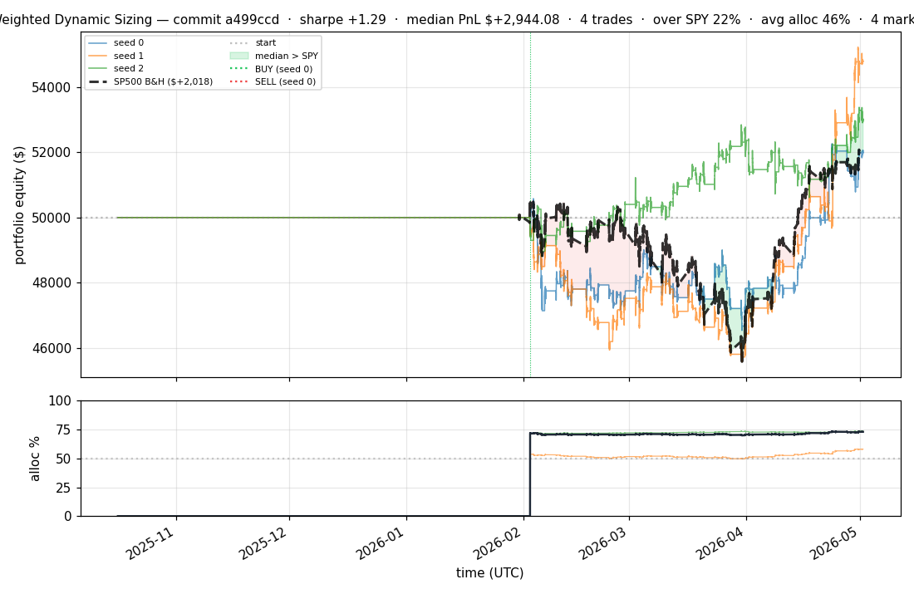
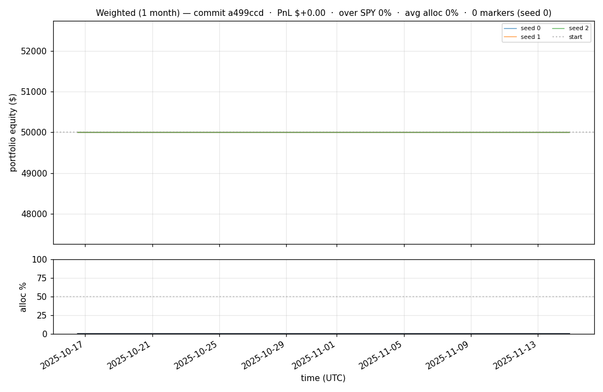

# iter 070 — fa4ab20

**🟢 KEEP** · exp70: concentration sweep — add top1/top3 to profile suite

_2026-05-02 21:28 UTC · 361s wall_

## Result

| metric | value |
|---|---|
| Sharpe (median) | **+1.295** |
| Sharpe CI low (5%) | -1.171 |
| Sharpe CI high (95%) | +3.736 |
| Net PnL | **$+2944.08** (+5.888%) |
| Max drawdown | -8.86% |
| Trades | 4 |
| Fees | $4.00 |
| Seeds completed | 3 |

**Decision reason:** ci_low=-1.1710 > prior best -1.1713

## Per-seed details

```
[evaluator] seed 0: sharpe=+0.806  dd=-8.00%  pnl=$+1,983.29  trades=4
[evaluator] seed 1: sharpe=+1.549  dd=-8.86%  pnl=$+4,797.33  trades=3
[evaluator] seed 2: sharpe=+1.295  dd=-4.24%  pnl=$+2,944.08  trades=4
```

## Equity curve (full eval window, ~73 days)



## Equity curve (first month)



## Trader profile comparison

Same trained model, different time-horizon strategies + SPY benchmark + passive top-N pickers.

| profile | sharpe | PnL ($) | PnL % | trades | DD % | horizon |
|---|---:|---:|---:|---:|---:|---:|
| **intraday** | -1.868 | $-678.29 | -1.36% | 4 | -1.36% | 2h |
| **intramonth** | +0.000 | $+0.00 | +0.00% | 0 | +0.00% | 30d |
| **intraweek** | -4.554 | $-9,318.82 | -18.64% | 1011 | -20.09% | 5d |
| **longterm** | +0.000 | $+0.00 | +0.00% | 0 | +0.00% | 30d |
| **spy_buyhold** | +1.007 | $+1,804.56 | +3.63% | 1 | -8.76% | - |
| **top10_picker** | +0.603 | $+1,228.22 | +2.46% | 9 | -7.17% | - |
| **top1_picker** | +0.000 | $+0.00 | +0.00% | 0 | +0.00% | - |
| **top20_picker** | +1.037 | $+2,275.95 | +4.55% | 18 | -6.40% | - |
| **top3_picker** | +0.797 | $+2,152.71 | +4.31% | 2 | -11.83% | - |
| **top5_picker** | +1.295 | $+2,944.08 | +5.89% | 4 | -8.00% | - |

**Best active strategy: `top5_picker` (sharpe +1.295) — BEATS SPY ✓**

## Out-of-symbol holdout eval

Tested on **JPM, WMT, V, DIS, JNJ** — large-caps the model NEVER saw during training.

| seed | sharpe | PnL | trades | DD% |
|---:|---:|---:|---:|---:|
| 0 | +0.322 | $+458.71 | 5 | -8.29% |
| 1 | -0.340 | $-790.21 | 13 | -8.55% |
| 2 | +0.322 | $+458.71 | 5 | -8.29% |

**Median holdout sharpe: +0.322** (vs in-symbol +1.295)

## Transactions

### Seed 0 — 1397 trades · ending equity $46,413.16 (-3,586.84 = -7.17%)

| # | timestamp (UTC) | symbol | side |
|---:|---|---|---|
| 1 | 2025-10-16 15:53:00 | MMC | BUY |
| 2 | 2026-02-02 15:15:00 | IWM | BUY |
| 3 | 2026-02-02 15:18:00 | IWM | SELL |
| 4 | 2026-02-02 15:18:00 | SPY | BUY |
| 5 | 2026-02-02 15:18:00 | IWM | BUY |
| 6 | 2026-02-02 15:24:00 | QQQ | BUY |
| 7 | 2026-02-02 15:27:00 | QQQ | SELL |
| 8 | 2026-02-02 15:27:00 | QQQ | BUY |
| 9 | 2026-02-02 15:27:00 | NFLX | BUY |
| 10 | 2026-02-02 15:31:00 | PLTR | BUY |
| 11 | 2026-02-02 15:32:00 | COIN | BUY |
| 12 | 2026-02-02 15:35:00 | XLF | BUY |
| 13 | 2026-02-02 15:37:00 | COIN | SELL |
| 14 | 2026-02-02 15:37:00 | GOOGL | BUY |
| 15 | 2026-02-02 15:37:00 | BAC | BUY |
| 16 | 2026-02-02 15:46:00 | GOOGL | SELL |
| 17 | 2026-02-02 15:46:00 | GOOGL | BUY |
| 18 | 2026-02-02 16:00:00 | PLTR | SELL |
| 19 | 2026-02-02 16:00:00 | EEM | BUY |
| 20 | 2026-02-02 16:00:00 | MSFT | BUY |
| 21 | 2026-02-02 16:00:00 | NVDA | BUY |
| 22 | 2026-02-02 16:01:00 | NVDA | SELL |
| 23 | 2026-02-02 16:01:00 | NVDA | BUY |
| 24 | 2026-02-02 16:03:00 | GOOGL | SELL |
| 25 | 2026-02-02 16:03:00 | AMZN | BUY |
| 26 | 2026-02-02 16:05:00 | SPY | SELL |
| 27 | 2026-02-02 16:05:00 | SPY | BUY |
| 28 | 2026-02-02 16:05:00 | GOOGL | BUY |
| 29 | 2026-02-02 16:05:00 | TSLA | BUY |
| 30 | 2026-02-02 16:05:00 | F | BUY |
| 31 | 2026-02-02 16:05:00 | COIN | BUY |
| 32 | 2026-02-02 16:06:00 | COIN | SELL |
| 33 | 2026-02-02 16:06:00 | META | BUY |
| 34 | 2026-02-02 16:06:00 | COIN | BUY |
| 35 | 2026-02-02 16:11:00 | COIN | SELL |
| 36 | 2026-02-02 16:11:00 | INTC | BUY |
| 37 | 2026-02-02 16:12:00 | INTC | SELL |
| 38 | 2026-02-02 16:12:00 | INTC | BUY |
| 39 | 2026-02-02 16:13:00 | INTC | SELL |
| 40 | 2026-02-02 16:13:00 | INTC | BUY |
| 41 | 2026-02-02 16:14:00 | INTC | SELL |
| 42 | 2026-02-02 16:14:00 | INTC | BUY |
| 43 | 2026-02-02 16:15:00 | INTC | SELL |
| 44 | 2026-02-02 16:15:00 | INTC | BUY |
| 45 | 2026-02-02 16:16:00 | INTC | SELL |
| 46 | 2026-02-02 16:16:00 | AAPL | BUY |
| 47 | 2026-02-02 16:17:00 | IWM | SELL |
| 48 | 2026-02-02 16:17:00 | IWM | BUY |
| 49 | 2026-02-02 16:17:00 | INTC | BUY |
| 50 | 2026-02-02 16:17:00 | COIN | BUY |
| 51 | 2026-02-02 16:17:00 | PLTR | BUY |
| 52 | 2026-02-02 16:18:00 | INTC | SELL |
| 53 | 2026-02-02 16:18:00 | INTC | BUY |
| 54 | 2026-02-02 16:19:00 | INTC | SELL |
| 55 | 2026-02-02 16:19:00 | AMD | BUY |
| 56 | 2026-02-02 16:19:00 | INTC | BUY |
| 57 | 2026-02-02 16:19:00 | NIO | BUY |
| 58 | 2026-02-02 16:19:00 | ORCL | BUY |
| 59 | 2026-02-02 16:25:00 | INTC | SELL |
| 60 | 2026-02-02 16:25:00 | INTC | BUY |
| 61 | 2026-02-02 16:25:00 | PFE | BUY |
| 62 | 2026-02-02 16:36:00 | INTC | SELL |
| 63 | 2026-02-02 16:36:00 | INTC | BUY |
| 64 | 2026-02-02 16:36:00 | AVGO | BUY |
| 65 | 2026-02-02 16:37:00 | INTC | SELL |
| 66 | 2026-02-02 16:37:00 | INTC | BUY |
| 67 | 2026-02-02 16:38:00 | INTC | SELL |
| 68 | 2026-02-02 16:38:00 | INTC | BUY |
| 69 | 2026-02-02 16:39:00 | INTC | SELL |
| 70 | 2026-02-02 16:39:00 | INTC | BUY |
| 71 | 2026-02-02 16:40:00 | INTC | SELL |
| 72 | 2026-02-02 16:40:00 | INTC | BUY |
| 73 | 2026-02-02 16:41:00 | NIO | SELL |
| 74 | 2026-02-02 16:41:00 | NIO | BUY |
| 75 | 2026-02-02 16:43:00 | INTC | SELL |
| 76 | 2026-02-02 16:43:00 | INTC | BUY |
| 77 | 2026-02-02 16:45:00 | INTC | SELL |
| 78 | 2026-02-02 16:45:00 | INTC | BUY |
| 79 | 2026-02-02 16:46:00 | NIO | SELL |
| 80 | 2026-02-02 16:46:00 | NIO | BUY |
| 81 | 2026-02-02 16:47:00 | NIO | SELL |
| 82 | 2026-02-02 16:47:00 | NIO | BUY |
| 83 | 2026-02-02 16:48:00 | NIO | SELL |
| 84 | 2026-02-02 16:48:00 | NIO | BUY |
| 85 | 2026-02-02 16:49:00 | COIN | SELL |
| 86 | 2026-02-02 16:49:00 | COIN | BUY |
| 87 | 2026-02-02 16:49:00 | UNH | BUY |
| 88 | 2026-02-02 16:49:00 | XOM | BUY |
| 89 | 2026-02-02 16:50:00 | NIO | SELL |
| 90 | 2026-02-02 16:50:00 | NIO | BUY |
| 91 | 2026-02-02 16:51:00 | NIO | SELL |
| 92 | 2026-02-02 16:51:00 | NIO | BUY |
| 93 | 2026-02-02 16:52:00 | COIN | SELL |
| 94 | 2026-02-02 16:52:00 | COIN | BUY |
| 95 | 2026-02-02 16:52:00 | MA | BUY |
| 96 | 2026-02-02 16:53:00 | NIO | SELL |
| 97 | 2026-02-02 16:53:00 | NIO | BUY |
| 98 | 2026-02-02 16:54:00 | EEM | SELL |
| 99 | 2026-02-02 16:54:00 | EEM | BUY |
| 100 | 2026-02-02 16:54:00 | PG | BUY |
| 101 | 2026-02-02 16:55:00 | NIO | SELL |
| 102 | 2026-02-02 16:55:00 | NIO | BUY |
| 103 | 2026-02-02 16:56:00 | NIO | SELL |
| 104 | 2026-02-02 16:56:00 | NIO | BUY |
| 105 | 2026-02-02 16:57:00 | COIN | SELL |
| 106 | 2026-02-02 16:57:00 | COIN | BUY |
| 107 | 2026-02-02 16:57:00 | HD | BUY |
| 108 | 2026-02-02 16:58:00 | NIO | SELL |
| 109 | 2026-02-02 16:58:00 | NIO | BUY |
| 110 | 2026-02-02 16:59:00 | NIO | SELL |
| 111 | 2026-02-02 16:59:00 | NIO | BUY |
| 112 | 2026-02-02 17:00:00 | COIN | SELL |
| 113 | 2026-02-02 17:00:00 | COIN | BUY |
| 114 | 2026-02-02 17:01:00 | NIO | SELL |
| 115 | 2026-02-02 17:01:00 | NIO | BUY |
| 116 | 2026-02-02 17:02:00 | COIN | SELL |
| 117 | 2026-02-02 17:02:00 | COIN | BUY |
| 118 | 2026-02-02 17:03:00 | AMD | SELL |
| 119 | 2026-02-02 17:03:00 | AMD | BUY |
| 120 | 2026-02-02 17:03:00 | CVX | BUY |
| 121 | 2026-02-02 17:03:00 | LLY | BUY |
| 122 | 2026-02-02 17:04:00 | LLY | SELL |
| 123 | 2026-02-02 17:04:00 | LLY | BUY |
| 124 | 2026-02-02 17:05:00 | NIO | SELL |
| 125 | 2026-02-02 17:05:00 | NIO | BUY |
| 126 | 2026-02-02 17:06:00 | NIO | SELL |
| 127 | 2026-02-02 17:06:00 | NIO | BUY |
| 128 | 2026-02-02 17:07:00 | COIN | SELL |
| 129 | 2026-02-02 17:07:00 | COIN | BUY |
| 130 | 2026-02-02 17:08:00 | COIN | SELL |
| 131 | 2026-02-02 17:08:00 | COIN | BUY |
| 132 | 2026-02-02 17:09:00 | COIN | SELL |
| 133 | 2026-02-02 17:09:00 | COIN | BUY |
| 134 | 2026-02-02 17:10:00 | COIN | SELL |
| 135 | 2026-02-02 17:10:00 | COIN | BUY |
| 136 | 2026-02-02 17:11:00 | NIO | SELL |
| 137 | 2026-02-02 17:11:00 | NIO | BUY |
| 138 | 2026-02-02 17:12:00 | NIO | SELL |
| 139 | 2026-02-02 17:12:00 | NIO | BUY |
| 140 | 2026-02-02 17:13:00 | NIO | SELL |
| 141 | 2026-02-02 17:13:00 | NIO | BUY |
| 142 | 2026-02-02 17:14:00 | COIN | SELL |
| 143 | 2026-02-02 17:14:00 | COIN | BUY |
| 144 | 2026-02-02 17:15:00 | COIN | SELL |
| 145 | 2026-02-02 17:15:00 | COIN | BUY |
| 146 | 2026-02-02 17:16:00 | F | SELL |
| 147 | 2026-02-02 17:16:00 | F | BUY |
| 148 | 2026-02-02 17:16:00 | KO | BUY |
| 149 | 2026-02-02 17:17:00 | NIO | SELL |
| 150 | 2026-02-02 17:17:00 | NIO | BUY |
| 151 | 2026-02-02 17:18:00 | NIO | SELL |
| 152 | 2026-02-02 17:18:00 | NIO | BUY |
| 153 | 2026-02-02 17:20:00 | COIN | SELL |
| 154 | 2026-02-02 17:20:00 | COIN | BUY |
| 155 | 2026-02-02 17:22:00 | NIO | SELL |
| 156 | 2026-02-02 17:22:00 | NIO | BUY |
| 157 | 2026-02-02 17:25:00 | NIO | SELL |
| 158 | 2026-02-02 17:25:00 | NIO | BUY |
| 159 | 2026-02-02 17:26:00 | NIO | SELL |
| 160 | 2026-02-02 17:26:00 | NIO | BUY |
| 161 | 2026-02-02 17:27:00 | NIO | SELL |
| 162 | 2026-02-02 17:27:00 | NIO | BUY |
| 163 | 2026-02-02 17:28:00 | NIO | SELL |
| 164 | 2026-02-02 17:28:00 | NIO | BUY |
| 165 | 2026-02-02 17:29:00 | NIO | SELL |
| 166 | 2026-02-02 17:29:00 | NIO | BUY |
| 167 | 2026-02-02 17:31:00 | GOOGL | SELL |
| 168 | 2026-02-02 17:31:00 | GOOGL | BUY |
| 169 | 2026-02-02 17:31:00 | ABBV | BUY |
| 170 | 2026-02-02 17:31:00 | PEP | BUY |
| 171 | 2026-02-02 17:31:00 | COST | BUY |
| 172 | 2026-02-02 17:32:00 | NIO | SELL |
| 173 | 2026-02-02 17:32:00 | NIO | BUY |
| 174 | 2026-02-02 17:33:00 | NIO | SELL |
| 175 | 2026-02-02 17:33:00 | NIO | BUY |
| 176 | 2026-02-02 17:34:00 | NIO | SELL |
| 177 | 2026-02-02 17:34:00 | NIO | BUY |
| 178 | 2026-02-02 17:35:00 | GOOGL | SELL |
| 179 | 2026-02-02 17:35:00 | GOOGL | BUY |
| 180 | 2026-02-02 17:35:00 | MRK | BUY |
| 181 | 2026-02-02 17:35:00 | ABT | BUY |
| 182 | 2026-02-02 17:35:00 | NKE | BUY |
| 183 | 2026-02-02 17:36:00 | NIO | SELL |
| 184 | 2026-02-02 17:36:00 | NIO | BUY |
| 185 | 2026-02-02 17:37:00 | NIO | SELL |
| 186 | 2026-02-02 17:37:00 | NIO | BUY |
| 187 | 2026-02-02 17:38:00 | NIO | SELL |
| 188 | 2026-02-02 17:38:00 | NIO | BUY |
| 189 | 2026-02-02 17:39:00 | PEP | SELL |
| 190 | 2026-02-02 17:39:00 | PEP | BUY |
| 191 | 2026-02-02 17:39:00 | MCD | BUY |
| 192 | 2026-02-02 17:40:00 | NIO | SELL |
| 193 | 2026-02-02 17:40:00 | NIO | BUY |
| 194 | 2026-02-02 17:41:00 | NIO | SELL |
| 195 | 2026-02-02 17:41:00 | NIO | BUY |
| 196 | 2026-02-02 17:42:00 | NIO | SELL |
| 197 | 2026-02-02 17:42:00 | NIO | BUY |
| 198 | 2026-02-02 17:43:00 | NIO | SELL |
| 199 | 2026-02-02 17:43:00 | NIO | BUY |
| 200 | 2026-02-02 17:44:00 | NIO | SELL |
| … | _1197 more truncated_ | | |

### Seed 1 — 625 trades · ending equity $47,170.58 (-2,829.42 = -5.66%)

| # | timestamp (UTC) | symbol | side |
|---:|---|---|---|
| 1 | 2025-10-16 15:53:00 | MMC | BUY |
| 2 | 2026-02-02 15:15:00 | IWM | BUY |
| 3 | 2026-02-02 15:18:00 | IWM | SELL |
| 4 | 2026-02-02 15:18:00 | SPY | BUY |
| 5 | 2026-02-02 15:18:00 | IWM | BUY |
| 6 | 2026-02-02 15:24:00 | QQQ | BUY |
| 7 | 2026-02-02 15:27:00 | SPY | SELL |
| 8 | 2026-02-02 15:27:00 | SPY | BUY |
| 9 | 2026-02-02 15:27:00 | NFLX | BUY |
| 10 | 2026-02-02 15:31:00 | PLTR | BUY |
| 11 | 2026-02-02 15:32:00 | COIN | BUY |
| 12 | 2026-02-02 15:35:00 | PLTR | SELL |
| 13 | 2026-02-02 15:35:00 | XLF | BUY |
| 14 | 2026-02-02 15:35:00 | PLTR | BUY |
| 15 | 2026-02-02 15:35:00 | NIO | BUY |
| 16 | 2026-02-02 15:37:00 | PLTR | SELL |
| 17 | 2026-02-02 15:37:00 | GOOGL | BUY |
| 18 | 2026-02-02 15:37:00 | BAC | BUY |
| 19 | 2026-02-02 15:37:00 | PLTR | BUY |
| 20 | 2026-02-02 15:40:00 | BAC | SELL |
| 21 | 2026-02-02 15:40:00 | TSLA | BUY |
| 22 | 2026-02-02 15:41:00 | PLTR | SELL |
| 23 | 2026-02-02 15:41:00 | BAC | BUY |
| 24 | 2026-02-02 15:43:00 | XLF | SELL |
| 25 | 2026-02-02 15:43:00 | XLF | BUY |
| 26 | 2026-02-02 15:43:00 | F | BUY |
| 27 | 2026-02-02 15:43:00 | PLTR | BUY |
| 28 | 2026-02-02 15:54:00 | PLTR | SELL |
| 29 | 2026-02-02 15:54:00 | NVDA | BUY |
| 30 | 2026-02-02 15:56:00 | BAC | SELL |
| 31 | 2026-02-02 15:56:00 | EEM | BUY |
| 32 | 2026-02-02 15:57:00 | COIN | SELL |
| 33 | 2026-02-02 15:57:00 | BAC | BUY |
| 34 | 2026-02-02 15:57:00 | COIN | BUY |
| 35 | 2026-02-02 15:57:00 | PLTR | BUY |
| 36 | 2026-02-02 16:00:00 | PLTR | SELL |
| 37 | 2026-02-02 16:00:00 | MSFT | BUY |
| 38 | 2026-02-02 16:03:00 | GOOGL | SELL |
| 39 | 2026-02-02 16:03:00 | AMZN | BUY |
| 40 | 2026-02-02 16:03:00 | GOOGL | BUY |
| 41 | 2026-02-02 16:04:00 | AMZN | SELL |
| 42 | 2026-02-02 16:04:00 | AMZN | BUY |
| 43 | 2026-02-02 16:04:00 | PLTR | BUY |
| 44 | 2026-02-02 16:06:00 | PLTR | SELL |
| 45 | 2026-02-02 16:06:00 | META | BUY |
| 46 | 2026-02-02 16:07:00 | AMZN | SELL |
| 47 | 2026-02-02 16:07:00 | AMZN | BUY |
| 48 | 2026-02-02 16:11:00 | COIN | SELL |
| 49 | 2026-02-02 16:11:00 | INTC | BUY |
| 50 | 2026-02-02 16:11:00 | COIN | BUY |
| 51 | 2026-02-02 16:12:00 | INTC | SELL |
| 52 | 2026-02-02 16:12:00 | INTC | BUY |
| 53 | 2026-02-02 16:15:00 | COIN | SELL |
| 54 | 2026-02-02 16:15:00 | COIN | BUY |
| 55 | 2026-02-02 16:16:00 | IWM | SELL |
| 56 | 2026-02-02 16:16:00 | IWM | BUY |
| 57 | 2026-02-02 16:16:00 | AAPL | BUY |
| 58 | 2026-02-02 16:16:00 | PLTR | BUY |
| 59 | 2026-02-02 16:19:00 | COIN | SELL |
| 60 | 2026-02-02 16:19:00 | AMD | BUY |
| 61 | 2026-02-02 16:19:00 | COIN | BUY |
| 62 | 2026-02-02 16:19:00 | ORCL | BUY |
| 63 | 2026-02-02 16:25:00 | AAPL | SELL |
| 64 | 2026-02-02 16:25:00 | AAPL | BUY |
| 65 | 2026-02-02 16:25:00 | PFE | BUY |
| 66 | 2026-02-02 16:35:00 | COIN | SELL |
| 67 | 2026-02-02 16:35:00 | COIN | BUY |
| 68 | 2026-02-02 16:35:00 | AVGO | BUY |
| 69 | 2026-02-02 16:36:00 | COIN | SELL |
| 70 | 2026-02-02 16:36:00 | COIN | BUY |
| 71 | 2026-02-02 16:36:00 | NOW | BUY |
| 72 | 2026-02-02 16:37:00 | GOOGL | SELL |
| 73 | 2026-02-02 16:37:00 | GOOGL | BUY |
| 74 | 2026-02-02 16:38:00 | COIN | SELL |
| 75 | 2026-02-02 16:38:00 | COIN | BUY |
| 76 | 2026-02-02 16:39:00 | INTC | SELL |
| 77 | 2026-02-02 16:39:00 | INTC | BUY |
| 78 | 2026-02-02 16:40:00 | META | SELL |
| 79 | 2026-02-02 16:40:00 | META | BUY |
| 80 | 2026-02-02 16:41:00 | META | SELL |
| 81 | 2026-02-02 16:41:00 | META | BUY |
| 82 | 2026-02-02 16:42:00 | COIN | SELL |
| 83 | 2026-02-02 16:42:00 | COIN | BUY |
| 84 | 2026-02-02 16:44:00 | META | SELL |
| 85 | 2026-02-02 16:44:00 | META | BUY |
| 86 | 2026-02-02 16:45:00 | COIN | SELL |
| 87 | 2026-02-02 16:45:00 | COIN | BUY |
| 88 | 2026-02-02 16:46:00 | NIO | SELL |
| 89 | 2026-02-02 16:46:00 | NIO | BUY |
| 90 | 2026-02-02 16:46:00 | UNH | BUY |
| 91 | 2026-02-02 16:47:00 | UNH | SELL |
| 92 | 2026-02-02 16:47:00 | UNH | BUY |
| 93 | 2026-02-02 16:48:00 | META | SELL |
| 94 | 2026-02-02 16:48:00 | META | BUY |
| 95 | 2026-02-02 16:49:00 | META | SELL |
| 96 | 2026-02-02 16:49:00 | META | BUY |
| 97 | 2026-02-02 16:50:00 | NIO | SELL |
| 98 | 2026-02-02 16:50:00 | NIO | BUY |
| 99 | 2026-02-02 16:51:00 | META | SELL |
| 100 | 2026-02-02 16:51:00 | META | BUY |
| 101 | 2026-02-02 16:52:00 | NIO | SELL |
| 102 | 2026-02-02 16:52:00 | NIO | BUY |
| 103 | 2026-02-02 16:53:00 | META | SELL |
| 104 | 2026-02-02 16:53:00 | META | BUY |
| 105 | 2026-02-02 16:54:00 | BAC | SELL |
| 106 | 2026-02-02 16:54:00 | BAC | BUY |
| 107 | 2026-02-02 16:54:00 | XOM | BUY |
| 108 | 2026-02-02 16:55:00 | EEM | SELL |
| 109 | 2026-02-02 16:55:00 | EEM | BUY |
| 110 | 2026-02-02 16:56:00 | BAC | SELL |
| 111 | 2026-02-02 16:56:00 | BAC | BUY |
| 112 | 2026-02-02 16:56:00 | MA | BUY |
| 113 | 2026-02-02 16:57:00 | META | SELL |
| 114 | 2026-02-02 16:57:00 | META | BUY |
| 115 | 2026-02-02 16:58:00 | BAC | SELL |
| 116 | 2026-02-02 16:58:00 | BAC | BUY |
| 117 | 2026-02-02 16:59:00 | BAC | SELL |
| 118 | 2026-02-02 16:59:00 | BAC | BUY |
| 119 | 2026-02-02 17:00:00 | BAC | SELL |
| 120 | 2026-02-02 17:00:00 | BAC | BUY |
| 121 | 2026-02-02 17:01:00 | NIO | SELL |
| 122 | 2026-02-02 17:01:00 | NIO | BUY |
| 123 | 2026-02-02 17:02:00 | BAC | SELL |
| 124 | 2026-02-02 17:02:00 | BAC | BUY |
| 125 | 2026-02-02 17:03:00 | BAC | SELL |
| 126 | 2026-02-02 17:03:00 | BAC | BUY |
| 127 | 2026-02-02 17:04:00 | MA | SELL |
| 128 | 2026-02-02 17:04:00 | MA | BUY |
| 129 | 2026-02-02 17:06:00 | F | SELL |
| 130 | 2026-02-02 17:06:00 | F | BUY |
| 131 | 2026-02-02 17:06:00 | HD | BUY |
| 132 | 2026-02-02 17:07:00 | MA | SELL |
| 133 | 2026-02-02 17:07:00 | MA | BUY |
| 134 | 2026-02-02 17:08:00 | MA | SELL |
| 135 | 2026-02-02 17:08:00 | MA | BUY |
| 136 | 2026-02-02 17:09:00 | BAC | SELL |
| 137 | 2026-02-02 17:09:00 | BAC | BUY |
| 138 | 2026-02-02 17:10:00 | AMD | SELL |
| 139 | 2026-02-02 17:10:00 | AMD | BUY |
| 140 | 2026-02-02 17:10:00 | PG | BUY |
| 141 | 2026-02-02 17:11:00 | MA | SELL |
| 142 | 2026-02-02 17:11:00 | MA | BUY |
| 143 | 2026-02-02 17:12:00 | MA | SELL |
| 144 | 2026-02-02 17:12:00 | MA | BUY |
| 145 | 2026-02-02 17:13:00 | PFE | SELL |
| 146 | 2026-02-02 17:13:00 | CVX | BUY |
| 147 | 2026-02-02 17:13:00 | LLY | BUY |
| 148 | 2026-02-02 17:14:00 | AMD | SELL |
| 149 | 2026-02-02 17:14:00 | AMD | BUY |
| 150 | 2026-02-02 17:14:00 | ABBV | BUY |
| 151 | 2026-02-02 17:15:00 | F | SELL |
| 152 | 2026-02-02 17:15:00 | F | BUY |
| 153 | 2026-02-02 17:16:00 | F | SELL |
| 154 | 2026-02-02 17:16:00 | F | BUY |
| 155 | 2026-02-02 17:17:00 | F | SELL |
| 156 | 2026-02-02 17:17:00 | F | BUY |
| 157 | 2026-02-02 17:18:00 | F | SELL |
| 158 | 2026-02-02 17:18:00 | F | BUY |
| 159 | 2026-02-02 17:19:00 | F | SELL |
| 160 | 2026-02-02 17:19:00 | F | BUY |
| 161 | 2026-02-02 17:20:00 | COIN | SELL |
| 162 | 2026-02-02 17:20:00 | COIN | BUY |
| 163 | 2026-02-02 17:21:00 | F | SELL |
| 164 | 2026-02-02 17:21:00 | F | BUY |
| 165 | 2026-02-02 17:22:00 | COIN | SELL |
| 166 | 2026-02-02 17:22:00 | COIN | BUY |
| 167 | 2026-02-02 17:24:00 | F | SELL |
| 168 | 2026-02-02 17:24:00 | F | BUY |
| 169 | 2026-02-02 17:25:00 | COIN | SELL |
| 170 | 2026-02-02 17:25:00 | COIN | BUY |
| 171 | 2026-02-02 17:26:00 | COIN | SELL |
| 172 | 2026-02-02 17:26:00 | COIN | BUY |
| 173 | 2026-02-02 17:27:00 | COIN | SELL |
| 174 | 2026-02-02 17:27:00 | COIN | BUY |
| 175 | 2026-02-02 17:28:00 | COIN | SELL |
| 176 | 2026-02-02 17:28:00 | COIN | BUY |
| 177 | 2026-02-02 17:29:00 | LLY | SELL |
| 178 | 2026-02-02 17:29:00 | LLY | BUY |
| 179 | 2026-02-02 17:30:00 | COIN | SELL |
| 180 | 2026-02-02 17:30:00 | COIN | BUY |
| 181 | 2026-02-02 17:31:00 | COIN | SELL |
| 182 | 2026-02-02 17:31:00 | COIN | BUY |
| 183 | 2026-02-02 17:32:00 | COIN | SELL |
| 184 | 2026-02-02 17:32:00 | COIN | BUY |
| 185 | 2026-02-02 17:33:00 | COIN | SELL |
| 186 | 2026-02-02 17:33:00 | COIN | BUY |
| 187 | 2026-02-02 17:34:00 | COIN | SELL |
| 188 | 2026-02-02 17:34:00 | COIN | BUY |
| 189 | 2026-02-02 17:35:00 | COIN | SELL |
| 190 | 2026-02-02 17:35:00 | COIN | BUY |
| 191 | 2026-02-02 17:36:00 | COIN | SELL |
| 192 | 2026-02-02 17:36:00 | COIN | BUY |
| 193 | 2026-02-02 17:37:00 | AMZN | SELL |
| 194 | 2026-02-02 17:37:00 | AMZN | BUY |
| 195 | 2026-02-02 17:38:00 | HD | SELL |
| 196 | 2026-02-02 17:38:00 | HD | BUY |
| 197 | 2026-02-02 17:39:00 | AMZN | SELL |
| 198 | 2026-02-02 17:39:00 | AMZN | BUY |
| 199 | 2026-02-02 17:40:00 | COIN | SELL |
| 200 | 2026-02-02 17:40:00 | COIN | BUY |
| … | _425 more truncated_ | | |

### Seed 2 — 1331 trades · ending equity $46,548.38 (-3,451.62 = -6.90%)

| # | timestamp (UTC) | symbol | side |
|---:|---|---|---|
| 1 | 2025-10-16 15:53:00 | MMC | BUY |
| 2 | 2026-02-02 15:15:00 | IWM | BUY |
| 3 | 2026-02-02 15:18:00 | SPY | BUY |
| 4 | 2026-02-02 15:24:00 | QQQ | BUY |
| 5 | 2026-02-02 15:27:00 | NFLX | BUY |
| 6 | 2026-02-02 15:31:00 | PLTR | BUY |
| 7 | 2026-02-02 15:32:00 | COIN | BUY |
| 8 | 2026-02-02 15:35:00 | PLTR | SELL |
| 9 | 2026-02-02 15:35:00 | XLF | BUY |
| 10 | 2026-02-02 15:35:00 | PLTR | BUY |
| 11 | 2026-02-02 15:35:00 | NIO | BUY |
| 12 | 2026-02-02 15:48:00 | COIN | SELL |
| 13 | 2026-02-02 15:48:00 | GOOGL | BUY |
| 14 | 2026-02-02 15:48:00 | TSLA | BUY |
| 15 | 2026-02-02 15:52:00 | TSLA | SELL |
| 16 | 2026-02-02 15:52:00 | TSLA | BUY |
| 17 | 2026-02-02 15:53:00 | TSLA | SELL |
| 18 | 2026-02-02 15:53:00 | TSLA | BUY |
| 19 | 2026-02-02 15:54:00 | TSLA | SELL |
| 20 | 2026-02-02 15:54:00 | NVDA | BUY |
| 21 | 2026-02-02 15:55:00 | SPY | SELL |
| 22 | 2026-02-02 15:55:00 | SPY | BUY |
| 23 | 2026-02-02 15:55:00 | EEM | BUY |
| 24 | 2026-02-02 15:55:00 | TSLA | BUY |
| 25 | 2026-02-02 15:55:00 | F | BUY |
| 26 | 2026-02-02 15:55:00 | COIN | BUY |
| 27 | 2026-02-02 15:56:00 | TSLA | SELL |
| 28 | 2026-02-02 15:56:00 | TSLA | BUY |
| 29 | 2026-02-02 15:56:00 | BAC | BUY |
| 30 | 2026-02-02 15:59:00 | COIN | SELL |
| 31 | 2026-02-02 15:59:00 | AMZN | BUY |
| 32 | 2026-02-02 16:13:00 | NIO | SELL |
| 33 | 2026-02-02 16:13:00 | MSFT | BUY |
| 34 | 2026-02-02 16:14:00 | TSLA | SELL |
| 35 | 2026-02-02 16:14:00 | META | BUY |
| 36 | 2026-02-02 16:14:00 | TSLA | BUY |
| 37 | 2026-02-02 16:20:00 | TSLA | SELL |
| 38 | 2026-02-02 16:20:00 | AAPL | BUY |
| 39 | 2026-02-02 16:21:00 | SPY | SELL |
| 40 | 2026-02-02 16:21:00 | SPY | BUY |
| 41 | 2026-02-02 16:21:00 | TSLA | BUY |
| 42 | 2026-02-02 16:21:00 | AMD | BUY |
| 43 | 2026-02-02 16:21:00 | INTC | BUY |
| 44 | 2026-02-02 16:22:00 | TSLA | SELL |
| 45 | 2026-02-02 16:22:00 | TSLA | BUY |
| 46 | 2026-02-02 16:22:00 | COIN | BUY |
| 47 | 2026-02-02 16:22:00 | NIO | BUY |
| 48 | 2026-02-02 16:23:00 | COIN | SELL |
| 49 | 2026-02-02 16:23:00 | COIN | BUY |
| 50 | 2026-02-02 16:24:00 | COIN | SELL |
| 51 | 2026-02-02 16:24:00 | COIN | BUY |
| 52 | 2026-02-02 16:25:00 | COIN | SELL |
| 53 | 2026-02-02 16:25:00 | COIN | BUY |
| 54 | 2026-02-02 16:26:00 | COIN | SELL |
| 55 | 2026-02-02 16:26:00 | COIN | BUY |
| 56 | 2026-02-02 16:27:00 | TSLA | SELL |
| 57 | 2026-02-02 16:27:00 | TSLA | BUY |
| 58 | 2026-02-02 16:27:00 | ORCL | BUY |
| 59 | 2026-02-02 16:28:00 | TSLA | SELL |
| 60 | 2026-02-02 16:28:00 | TSLA | BUY |
| 61 | 2026-02-02 16:28:00 | PFE | BUY |
| 62 | 2026-02-02 16:36:00 | SPY | SELL |
| 63 | 2026-02-02 16:36:00 | SPY | BUY |
| 64 | 2026-02-02 16:36:00 | AVGO | BUY |
| 65 | 2026-02-02 16:36:00 | NOW | BUY |
| 66 | 2026-02-02 16:37:00 | NIO | SELL |
| 67 | 2026-02-02 16:37:00 | NIO | BUY |
| 68 | 2026-02-02 16:38:00 | COIN | SELL |
| 69 | 2026-02-02 16:38:00 | COIN | BUY |
| 70 | 2026-02-02 16:39:00 | NIO | SELL |
| 71 | 2026-02-02 16:39:00 | NIO | BUY |
| 72 | 2026-02-02 16:40:00 | NIO | SELL |
| 73 | 2026-02-02 16:40:00 | NIO | BUY |
| 74 | 2026-02-02 16:41:00 | COIN | SELL |
| 75 | 2026-02-02 16:41:00 | COIN | BUY |
| 76 | 2026-02-02 16:42:00 | COIN | SELL |
| 77 | 2026-02-02 16:42:00 | COIN | BUY |
| 78 | 2026-02-02 16:44:00 | COIN | SELL |
| 79 | 2026-02-02 16:44:00 | COIN | BUY |
| 80 | 2026-02-02 16:45:00 | SPY | SELL |
| 81 | 2026-02-02 16:45:00 | SPY | BUY |
| 82 | 2026-02-02 16:45:00 | UNH | BUY |
| 83 | 2026-02-02 16:45:00 | XOM | BUY |
| 84 | 2026-02-02 16:47:00 | ORCL | SELL |
| 85 | 2026-02-02 16:47:00 | MA | BUY |
| 86 | 2026-02-02 16:48:00 | COIN | SELL |
| 87 | 2026-02-02 16:48:00 | COIN | BUY |
| 88 | 2026-02-02 16:49:00 | COIN | SELL |
| 89 | 2026-02-02 16:49:00 | COIN | BUY |
| 90 | 2026-02-02 16:50:00 | NIO | SELL |
| 91 | 2026-02-02 16:50:00 | NIO | BUY |
| 92 | 2026-02-02 16:51:00 | NIO | SELL |
| 93 | 2026-02-02 16:51:00 | NIO | BUY |
| 94 | 2026-02-02 16:52:00 | COIN | SELL |
| 95 | 2026-02-02 16:52:00 | COIN | BUY |
| 96 | 2026-02-02 16:53:00 | COIN | SELL |
| 97 | 2026-02-02 16:53:00 | COIN | BUY |
| 98 | 2026-02-02 16:55:00 | NIO | SELL |
| 99 | 2026-02-02 16:55:00 | NIO | BUY |
| 100 | 2026-02-02 16:56:00 | COIN | SELL |
| 101 | 2026-02-02 16:56:00 | COIN | BUY |
| 102 | 2026-02-02 16:58:00 | NIO | SELL |
| 103 | 2026-02-02 16:58:00 | NIO | BUY |
| 104 | 2026-02-02 16:59:00 | COIN | SELL |
| 105 | 2026-02-02 16:59:00 | COIN | BUY |
| 106 | 2026-02-02 17:00:00 | BAC | SELL |
| 107 | 2026-02-02 17:00:00 | BAC | BUY |
| 108 | 2026-02-02 17:02:00 | COIN | SELL |
| 109 | 2026-02-02 17:02:00 | COIN | BUY |
| 110 | 2026-02-02 17:06:00 | NIO | SELL |
| 111 | 2026-02-02 17:06:00 | NIO | BUY |
| 112 | 2026-02-02 17:08:00 | NIO | SELL |
| 113 | 2026-02-02 17:08:00 | NIO | BUY |
| 114 | 2026-02-02 17:10:00 | NIO | SELL |
| 115 | 2026-02-02 17:10:00 | NIO | BUY |
| 116 | 2026-02-02 17:11:00 | NIO | SELL |
| 117 | 2026-02-02 17:11:00 | NIO | BUY |
| 118 | 2026-02-02 17:14:00 | COIN | SELL |
| 119 | 2026-02-02 17:14:00 | COIN | BUY |
| 120 | 2026-02-02 17:20:00 | F | SELL |
| 121 | 2026-02-02 17:20:00 | F | BUY |
| 122 | 2026-02-02 17:20:00 | PG | BUY |
| 123 | 2026-02-02 17:24:00 | F | SELL |
| 124 | 2026-02-02 17:24:00 | F | BUY |
| 125 | 2026-02-02 17:25:00 | NIO | SELL |
| 126 | 2026-02-02 17:25:00 | NIO | BUY |
| 127 | 2026-02-02 17:26:00 | NIO | SELL |
| 128 | 2026-02-02 17:26:00 | NIO | BUY |
| 129 | 2026-02-02 17:27:00 | NIO | SELL |
| 130 | 2026-02-02 17:27:00 | NIO | BUY |
| 131 | 2026-02-02 17:28:00 | NIO | SELL |
| 132 | 2026-02-02 17:28:00 | NIO | BUY |
| 133 | 2026-02-02 17:29:00 | NIO | SELL |
| 134 | 2026-02-02 17:29:00 | NIO | BUY |
| 135 | 2026-02-02 17:30:00 | F | SELL |
| 136 | 2026-02-02 17:30:00 | F | BUY |
| 137 | 2026-02-02 17:34:00 | COIN | SELL |
| 138 | 2026-02-02 17:34:00 | COIN | BUY |
| 139 | 2026-02-02 17:36:00 | COIN | SELL |
| 140 | 2026-02-02 17:36:00 | COIN | BUY |
| 141 | 2026-02-02 17:37:00 | NIO | SELL |
| 142 | 2026-02-02 17:37:00 | NIO | BUY |
| 143 | 2026-02-02 17:38:00 | NIO | SELL |
| 144 | 2026-02-02 17:38:00 | NIO | BUY |
| 145 | 2026-02-02 17:39:00 | MA | SELL |
| 146 | 2026-02-02 17:39:00 | MA | BUY |
| 147 | 2026-02-02 17:40:00 | GOOGL | SELL |
| 148 | 2026-02-02 17:40:00 | GOOGL | BUY |
| 149 | 2026-02-02 17:41:00 | MA | SELL |
| 150 | 2026-02-02 17:41:00 | MA | BUY |
| 151 | 2026-02-02 17:42:00 | COIN | SELL |
| 152 | 2026-02-02 17:42:00 | COIN | BUY |
| 153 | 2026-02-02 17:43:00 | TSLA | SELL |
| 154 | 2026-02-02 17:43:00 | TSLA | BUY |
| 155 | 2026-02-02 17:44:00 | MSFT | SELL |
| 156 | 2026-02-02 17:44:00 | MSFT | BUY |
| 157 | 2026-02-02 17:45:00 | TSLA | SELL |
| 158 | 2026-02-02 17:45:00 | TSLA | BUY |
| 159 | 2026-02-02 17:46:00 | TSLA | SELL |
| 160 | 2026-02-02 17:46:00 | TSLA | BUY |
| 161 | 2026-02-02 17:47:00 | IWM | SELL |
| 162 | 2026-02-02 17:47:00 | IWM | BUY |
| 163 | 2026-02-02 17:47:00 | HD | BUY |
| 164 | 2026-02-02 17:47:00 | CVX | BUY |
| 165 | 2026-02-02 17:47:00 | LLY | BUY |
| 166 | 2026-02-02 17:47:00 | ABBV | BUY |
| 167 | 2026-02-02 17:48:00 | XLF | SELL |
| 168 | 2026-02-02 17:48:00 | XLF | BUY |
| 169 | 2026-02-02 17:48:00 | KO | BUY |
| 170 | 2026-02-02 17:48:00 | PEP | BUY |
| 171 | 2026-02-02 17:49:00 | MA | SELL |
| 172 | 2026-02-02 17:49:00 | MA | BUY |
| 173 | 2026-02-02 17:50:00 | LLY | SELL |
| 174 | 2026-02-02 17:50:00 | LLY | BUY |
| 175 | 2026-02-02 17:50:00 | MCD | BUY |
| 176 | 2026-02-02 17:50:00 | TMO | BUY |
| 177 | 2026-02-02 17:51:00 | NIO | SELL |
| 178 | 2026-02-02 17:51:00 | NIO | BUY |
| 179 | 2026-02-02 17:52:00 | LLY | SELL |
| 180 | 2026-02-02 17:52:00 | LLY | BUY |
| 181 | 2026-02-02 17:52:00 | ABT | BUY |
| 182 | 2026-02-02 17:53:00 | NIO | SELL |
| 183 | 2026-02-02 17:53:00 | NIO | BUY |
| 184 | 2026-02-02 17:54:00 | NIO | SELL |
| 185 | 2026-02-02 17:54:00 | NIO | BUY |
| 186 | 2026-02-02 17:55:00 | LLY | SELL |
| 187 | 2026-02-02 17:55:00 | LLY | BUY |
| 188 | 2026-02-02 17:58:00 | TMO | SELL |
| 189 | 2026-02-02 17:58:00 | TMO | BUY |
| 190 | 2026-02-02 17:59:00 | AMD | SELL |
| 191 | 2026-02-02 17:59:00 | AMD | BUY |
| 192 | 2026-02-02 17:59:00 | MRK | BUY |
| 193 | 2026-02-02 18:00:00 | NIO | SELL |
| 194 | 2026-02-02 18:00:00 | NIO | BUY |
| 195 | 2026-02-02 18:05:00 | IWM | SELL |
| 196 | 2026-02-02 18:05:00 | IWM | BUY |
| 197 | 2026-02-02 18:05:00 | BA | BUY |
| 198 | 2026-02-02 18:05:00 | ORCL | BUY |
| 199 | 2026-02-02 18:05:00 | CRM | BUY |
| 200 | 2026-02-02 18:05:00 | NEE | BUY |
| … | _1131 more truncated_ | | |

## Diff vs previous experiment

```diff
fa4ab20 exp70: expand PASSIVE_TOPN_VARIANTS — add top1, top3 (concentration sweep)

exp69 KEPT with top5 picker. The signal showed monotonic concentration
benefit on the suite (top5 +1.295 > top10 +0.603 > top20 +1.037 — top10
weirdly dipped, top5 was best). Adding top1 and top3 reveals whether
even tighter concentration is better.

Same model, same data, same fresh weights from exp68 — just more profiles
in the suite. Canonical stays top5 so iteration likely DISCARDs (no
improvement gate), but the iter MD will show top1/top3 sharpe.

If top3 or top1 beats top5: exp71 switches canonical accordingly.


 experiment.py | 2 +-
 1 file changed, 1 insertion(+), 1 deletion(-)
```

---

[← all iterations](.) · [back to README](../README.md)
