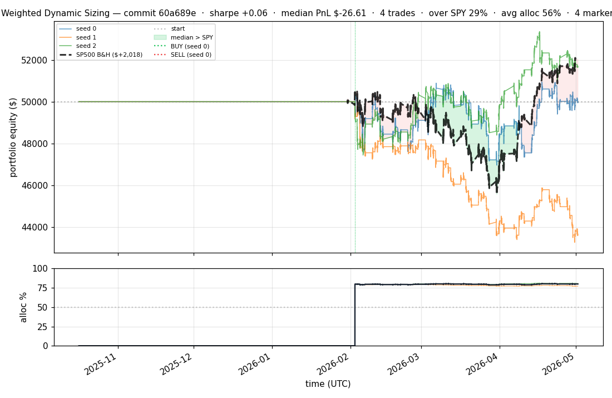
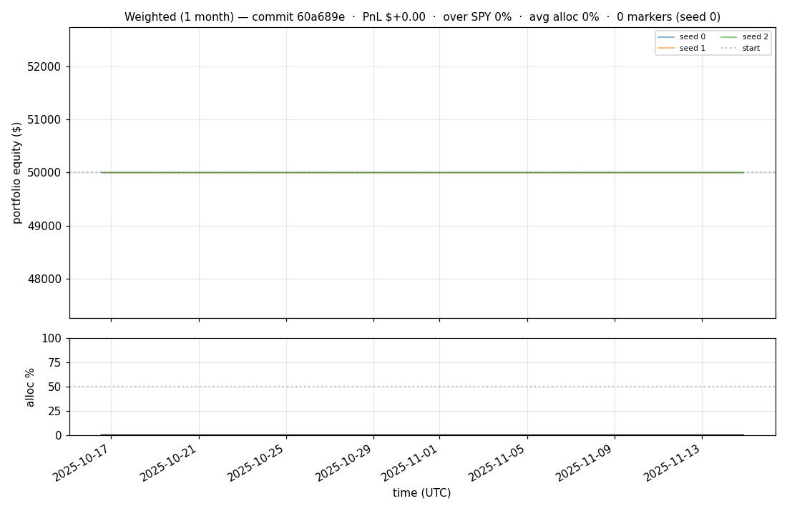

# iter 079 — 60a689e

**🔴 DISCARD** · exp79: universe-context features (cross-sectional aggregates) — fresh pretrain

_2026-05-03 07:10 UTC · 10020s wall_

## Result

| metric | value |
|---|---|
| Sharpe (median) | **+0.055** |
| Sharpe CI low (5%) | -2.553 |
| Sharpe CI high (95%) | +2.370 |
| Net PnL | **$-26.61** (-0.053%) |
| Max drawdown | -13.47% |
| Trades | 4 |
| Fees | $4.00 |
| Seeds completed | 3 |

**Decision reason:** ci_low=-2.5530 ≤ prior best -1.0118

## Per-seed details

```
[evaluator] seed 0: sharpe=+0.055  dd=-7.71%  pnl=$-26.61  trades=4
[evaluator] seed 1: sharpe=-2.915  dd=-13.47%  pnl=$-6,403.41  trades=4
[evaluator] seed 2: sharpe=+0.697  dd=-5.12%  pnl=$+1,646.52  trades=4
```

## Equity curve (full eval window, ~73 days)



## Equity curve (first month)



## Trader profile comparison

Same trained model, different time-horizon strategies + SPY benchmark + passive top-N pickers.

| profile | sharpe | PnL ($) | PnL % | trades | DD % | horizon |
|---|---:|---:|---:|---:|---:|---:|
| **intraday** | -24.300 | $-31,858.78 | -63.72% | 12054 | -63.73% | 2h |
| **intramonth** | -1.667 | $-282.74 | -0.57% | 2 | -0.57% | 30d |
| **intraweek** | -4.723 | $-11,145.23 | -22.29% | 981 | -22.75% | 5d |
| **longterm** | +0.000 | $-101.60 | -0.20% | 2 | -0.57% | 30d |
| **spy_buyhold** | +1.011 | $+2,017.12 | +4.04% | 1 | -9.73% | - |
| **top10_picker** | -0.164 | $-685.77 | -1.37% | 9 | -11.46% | - |
| **top1_picker** | +0.000 | $+0.00 | +0.00% | 0 | +0.00% | - |
| **top20_picker** | -0.345 | $-720.95 | -1.44% | 18 | -10.54% | - |
| **top3_picker** | +0.350 | $+1,072.95 | +2.15% | 2 | -12.78% | - |
| **top5_picker** | +0.727 | $+2,246.74 | +4.49% | 4 | -11.96% | - |

**Best active strategy: `top5_picker` (sharpe +0.727) — LOSES TO SPY**

## Out-of-symbol holdout eval

Tested on **JPM, WMT, V, DIS, JNJ** — large-caps the model NEVER saw during training.

| seed | sharpe | PnL | trades | DD% |
|---:|---:|---:|---:|---:|
| 0 | +0.000 | $+0.00 | 0 | +0.00% |
| 1 | +0.000 | $+0.00 | 0 | +0.00% |
| 2 | -0.198 | $-289.46 | 5 | -6.35% |
| 3 | +0.327 | $+504.54 | 5 | -9.19% |
| 4 | +0.000 | $+0.00 | 0 | +0.00% |

**Median holdout sharpe: +0.000** (vs in-symbol +0.055)

## Transactions

### Seed 0 — 4 trades · ending equity $48,934.68 (-1,065.32 = -2.13%)

| # | timestamp (UTC) | symbol | side |
|---:|---|---|---|
| 1 | 2026-04-06 13:30:00 | BKNG | BUY |
| 2 | 2026-04-06 15:02:00 | BKNG | SELL |
| 3 | 2026-04-06 15:30:00 | BKNG | BUY |
| 4 | 2026-04-06 15:48:00 | BKNG | SELL |

### Seed 1 — 2 trades · ending equity $49,996.84 (-3.16 = -0.01%)

| # | timestamp (UTC) | symbol | side |
|---:|---|---|---|
| 1 | 2026-04-06 13:34:00 | BKNG | BUY |
| 2 | 2026-04-06 13:55:00 | BKNG | SELL |

### Seed 2 — 73 trades · ending equity $49,620.69 (-379.31 = -0.76%)

| # | timestamp (UTC) | symbol | side |
|---:|---|---|---|
| 1 | 2025-10-16 15:48:00 | MMC | BUY |
| 2 | 2026-02-02 15:15:00 | IWM | BUY |
| 3 | 2026-02-02 15:18:00 | SPY | BUY |
| 4 | 2026-02-02 15:24:00 | QQQ | BUY |
| 5 | 2026-02-02 15:27:00 | NFLX | BUY |
| 6 | 2026-02-02 15:31:00 | PLTR | BUY |
| 7 | 2026-02-02 15:32:00 | COIN | BUY |
| 8 | 2026-02-02 15:35:00 | NIO | BUY |
| 9 | 2026-02-02 15:35:00 | XLF | BUY |
| 10 | 2026-02-02 15:37:00 | BAC | BUY |
| 11 | 2026-02-02 15:37:00 | GOOGL | BUY |
| 12 | 2026-02-02 15:40:00 | TSLA | BUY |
| 13 | 2026-02-02 15:40:00 | F | BUY |
| 14 | 2026-02-02 15:54:00 | NVDA | BUY |
| 15 | 2026-02-02 15:55:00 | EEM | BUY |
| 16 | 2026-02-02 15:59:00 | AMZN | BUY |
| 17 | 2026-02-02 16:00:00 | MSFT | BUY |
| 18 | 2026-02-02 16:06:00 | META | BUY |
| 19 | 2026-02-02 16:10:00 | INTC | BUY |
| 20 | 2026-02-02 16:16:00 | AAPL | BUY |
| 21 | 2026-02-02 16:19:00 | AMD | BUY |
| 22 | 2026-02-02 16:19:00 | ORCL | BUY |
| 23 | 2026-02-04 16:39:00 | LLY | BUY |
| 24 | 2026-03-03 20:55:00 | NIO | SELL |
| 25 | 2026-03-03 20:55:00 | T | BUY |
| 26 | 2026-03-03 20:55:00 | BMY | BUY |
| 27 | 2026-03-03 20:55:00 | BLK | BUY |
| 28 | 2026-03-03 20:55:00 | SPGI | BUY |
| 29 | 2026-03-03 20:55:00 | NEE | BUY |
| 30 | 2026-03-10 15:25:00 | EEM | SELL |
| 31 | 2026-03-10 15:25:00 | VRTX | BUY |
| 32 | 2026-03-10 15:25:00 | NIO | BUY |
| 33 | 2026-03-10 15:25:00 | DE | BUY |
| 34 | 2026-03-10 15:25:00 | CAT | BUY |
| 35 | 2026-04-06 14:31:00 | AAPL | SELL |
| 36 | 2026-04-06 14:32:00 | COIN | SELL |
| 37 | 2026-04-06 14:32:00 | BKNG | BUY |
| 38 | 2026-04-06 14:32:00 | PEP | BUY |
| 39 | 2026-04-06 14:32:00 | ETN | BUY |
| 40 | 2026-04-06 14:32:00 | SYK | BUY |
| 41 | 2026-04-06 14:32:00 | AMT | BUY |
| 42 | 2026-04-07 13:32:00 | AMT | SELL |
| 43 | 2026-04-07 13:32:00 | UNH | BUY |
| 44 | 2026-04-07 13:32:00 | AVGO | BUY |
| 45 | 2026-04-07 13:32:00 | MRK | BUY |
| 46 | 2026-04-14 14:12:00 | QQQ | SELL |
| 47 | 2026-04-14 14:12:00 | CB | BUY |
| 48 | 2026-04-14 14:12:00 | UPS | BUY |
| 49 | 2026-04-14 14:12:00 | HD | BUY |
| 50 | 2026-04-14 14:12:00 | ZTS | BUY |
| 51 | 2026-04-14 14:12:00 | COIN | BUY |
| 52 | 2026-04-14 15:05:00 | C | BUY |
| 53 | 2026-04-16 13:33:00 | CB | SELL |
| 54 | 2026-04-16 13:33:00 | NOW | BUY |
| 55 | 2026-04-16 13:33:00 | SCHW | BUY |
| 56 | 2026-04-16 13:33:00 | PLD | BUY |
| 57 | 2026-04-16 13:33:00 | CRM | BUY |
| 58 | 2026-04-16 13:33:00 | USB | BUY |
| 59 | 2026-04-23 14:27:00 | ETN | SELL |
| 60 | 2026-04-23 14:27:00 | TXN | BUY |
| 61 | 2026-04-23 14:27:00 | CMCSA | BUY |
| 62 | 2026-04-23 14:27:00 | MS | BUY |
| 63 | 2026-04-23 14:27:00 | COF | BUY |
| 64 | 2026-04-30 15:16:00 | SPY | SELL |
| 65 | 2026-04-30 15:16:00 | QCOM | BUY |
| 66 | 2026-04-30 15:16:00 | MO | BUY |
| 67 | 2026-04-30 15:16:00 | ABBV | BUY |
| 68 | 2026-04-30 15:16:00 | PFE | BUY |
| 69 | 2026-04-30 15:16:00 | CB | BUY |
| 70 | 2026-04-30 15:17:00 | VZ | BUY |
| 71 | 2026-04-30 15:17:00 | AAPL | BUY |
| 72 | 2026-04-30 15:17:00 | MCD | BUY |
| 73 | 2026-04-30 15:17:00 | AXP | BUY |

### Seed 3 — 565 trades · ending equity $47,414.99 (-2,585.01 = -5.17%)

| # | timestamp (UTC) | symbol | side |
|---:|---|---|---|
| 1 | 2025-10-16 15:53:00 | MMC | BUY |
| 2 | 2026-02-02 15:15:00 | IWM | BUY |
| 3 | 2026-02-02 15:18:00 | SPY | BUY |
| 4 | 2026-02-02 15:24:00 | QQQ | BUY |
| 5 | 2026-02-02 15:27:00 | NFLX | BUY |
| 6 | 2026-02-02 15:31:00 | SPY | SELL |
| 7 | 2026-02-02 15:31:00 | SPY | BUY |
| 8 | 2026-02-02 15:31:00 | PLTR | BUY |
| 9 | 2026-02-02 15:32:00 | SPY | SELL |
| 10 | 2026-02-02 15:32:00 | SPY | BUY |
| 11 | 2026-02-02 15:32:00 | COIN | BUY |
| 12 | 2026-02-02 15:35:00 | SPY | SELL |
| 13 | 2026-02-02 15:35:00 | SPY | BUY |
| 14 | 2026-02-02 15:35:00 | XLF | BUY |
| 15 | 2026-02-02 15:35:00 | NIO | BUY |
| 16 | 2026-02-02 15:37:00 | SPY | SELL |
| 17 | 2026-02-02 15:37:00 | SPY | BUY |
| 18 | 2026-02-02 15:37:00 | GOOGL | BUY |
| 19 | 2026-02-02 15:37:00 | BAC | BUY |
| 20 | 2026-02-02 15:40:00 | SPY | SELL |
| 21 | 2026-02-02 15:40:00 | SPY | BUY |
| 22 | 2026-02-02 15:40:00 | TSLA | BUY |
| 23 | 2026-02-02 15:40:00 | F | BUY |
| 24 | 2026-02-02 15:54:00 | NVDA | BUY |
| 25 | 2026-02-02 16:00:00 | F | SELL |
| 26 | 2026-02-02 16:00:00 | EEM | BUY |
| 27 | 2026-02-02 16:05:00 | XLF | SELL |
| 28 | 2026-02-02 16:05:00 | XLF | BUY |
| 29 | 2026-02-02 16:05:00 | MSFT | BUY |
| 30 | 2026-02-02 16:05:00 | AMZN | BUY |
| 31 | 2026-02-02 16:06:00 | XLF | SELL |
| 32 | 2026-02-02 16:06:00 | XLF | BUY |
| 33 | 2026-02-02 16:06:00 | META | BUY |
| 34 | 2026-02-02 16:10:00 | XLF | SELL |
| 35 | 2026-02-02 16:10:00 | XLF | BUY |
| 36 | 2026-02-02 16:10:00 | INTC | BUY |
| 37 | 2026-02-02 16:16:00 | XLF | SELL |
| 38 | 2026-02-02 16:16:00 | XLF | BUY |
| 39 | 2026-02-02 16:16:00 | AAPL | BUY |
| 40 | 2026-02-02 16:19:00 | BAC | SELL |
| 41 | 2026-02-02 16:19:00 | AMD | BUY |
| 42 | 2026-02-02 16:19:00 | BAC | BUY |
| 43 | 2026-02-02 16:20:00 | EEM | SELL |
| 44 | 2026-02-02 16:20:00 | EEM | BUY |
| 45 | 2026-02-02 16:21:00 | XLF | SELL |
| 46 | 2026-02-02 16:21:00 | XLF | BUY |
| 47 | 2026-02-02 16:22:00 | BAC | SELL |
| 48 | 2026-02-02 16:22:00 | BAC | BUY |
| 49 | 2026-02-02 16:23:00 | XLF | SELL |
| 50 | 2026-02-02 16:23:00 | XLF | BUY |
| 51 | 2026-02-02 16:24:00 | BAC | SELL |
| 52 | 2026-02-02 16:24:00 | BAC | BUY |
| 53 | 2026-02-02 16:25:00 | XLF | SELL |
| 54 | 2026-02-02 16:25:00 | XLF | BUY |
| 55 | 2026-02-02 16:26:00 | XLF | SELL |
| 56 | 2026-02-02 16:26:00 | XLF | BUY |
| 57 | 2026-02-02 16:27:00 | XLF | SELL |
| 58 | 2026-02-02 16:27:00 | XLF | BUY |
| 59 | 2026-02-02 16:28:00 | BAC | SELL |
| 60 | 2026-02-02 16:28:00 | BAC | BUY |
| 61 | 2026-02-02 16:29:00 | EEM | SELL |
| 62 | 2026-02-02 16:29:00 | EEM | BUY |
| 63 | 2026-02-02 16:34:00 | PLTR | SELL |
| 64 | 2026-02-02 16:34:00 | F | BUY |
| 65 | 2026-02-02 16:34:00 | PLTR | BUY |
| 66 | 2026-02-02 16:34:00 | ORCL | BUY |
| 67 | 2026-02-02 16:34:00 | PFE | BUY |
| 68 | 2026-02-02 16:36:00 | EEM | SELL |
| 69 | 2026-02-02 16:36:00 | EEM | BUY |
| 70 | 2026-02-02 16:37:00 | NVDA | SELL |
| 71 | 2026-02-02 16:37:00 | NVDA | BUY |
| 72 | 2026-02-02 16:38:00 | XLF | SELL |
| 73 | 2026-02-02 16:38:00 | XLF | BUY |
| 74 | 2026-02-02 16:39:00 | F | SELL |
| 75 | 2026-02-02 16:39:00 | F | BUY |
| 76 | 2026-02-02 16:39:00 | XOM | BUY |
| 77 | 2026-02-02 16:39:00 | CVX | BUY |
| 78 | 2026-02-02 16:40:00 | XLF | SELL |
| 79 | 2026-02-02 16:40:00 | XLF | BUY |
| 80 | 2026-02-02 16:41:00 | F | SELL |
| 81 | 2026-02-02 16:41:00 | F | BUY |
| 82 | 2026-02-02 16:41:00 | KO | BUY |
| 83 | 2026-02-02 16:42:00 | XLF | SELL |
| 84 | 2026-02-02 16:42:00 | XLF | BUY |
| 85 | 2026-02-02 16:43:00 | MSFT | SELL |
| 86 | 2026-02-02 16:43:00 | MSFT | BUY |
| 87 | 2026-02-02 16:43:00 | HD | BUY |
| 88 | 2026-02-02 16:44:00 | PLTR | SELL |
| 89 | 2026-02-02 16:44:00 | PLTR | BUY |
| 90 | 2026-02-02 16:44:00 | UNH | BUY |
| 91 | 2026-02-02 16:45:00 | MSFT | SELL |
| 92 | 2026-02-02 16:45:00 | MSFT | BUY |
| 93 | 2026-02-02 16:46:00 | PLTR | SELL |
| 94 | 2026-02-02 16:46:00 | PLTR | BUY |
| 95 | 2026-02-02 16:46:00 | MA | BUY |
| 96 | 2026-02-02 16:47:00 | MSFT | SELL |
| 97 | 2026-02-02 16:47:00 | MSFT | BUY |
| 98 | 2026-02-02 16:48:00 | PLTR | SELL |
| 99 | 2026-02-02 16:48:00 | PLTR | BUY |
| 100 | 2026-02-02 16:48:00 | PEP | BUY |
| 101 | 2026-02-02 16:49:00 | XLF | SELL |
| 102 | 2026-02-02 16:49:00 | XLF | BUY |
| 103 | 2026-02-02 16:50:00 | XLF | SELL |
| 104 | 2026-02-02 16:50:00 | XLF | BUY |
| 105 | 2026-02-02 16:51:00 | EEM | SELL |
| 106 | 2026-02-02 16:51:00 | EEM | BUY |
| 107 | 2026-02-02 16:52:00 | EEM | SELL |
| 108 | 2026-02-02 16:52:00 | EEM | BUY |
| 109 | 2026-02-02 16:53:00 | UNH | SELL |
| 110 | 2026-02-02 16:53:00 | UNH | BUY |
| 111 | 2026-02-02 16:54:00 | CVX | SELL |
| 112 | 2026-02-02 16:54:00 | PG | BUY |
| 113 | 2026-02-02 16:55:00 | PG | SELL |
| 114 | 2026-02-02 16:55:00 | PG | BUY |
| 115 | 2026-02-02 16:56:00 | XLF | SELL |
| 116 | 2026-02-02 16:56:00 | XLF | BUY |
| 117 | 2026-02-02 16:57:00 | F | SELL |
| 118 | 2026-02-02 16:57:00 | F | BUY |
| 119 | 2026-02-02 16:57:00 | CVX | BUY |
| 120 | 2026-02-02 16:58:00 | EEM | SELL |
| 121 | 2026-02-02 16:58:00 | EEM | BUY |
| 122 | 2026-02-02 16:59:00 | MSFT | SELL |
| 123 | 2026-02-02 16:59:00 | MSFT | BUY |
| 124 | 2026-02-02 17:00:00 | BAC | SELL |
| 125 | 2026-02-02 17:00:00 | BAC | BUY |
| 126 | 2026-02-02 17:01:00 | GOOGL | SELL |
| 127 | 2026-02-02 17:01:00 | GOOGL | BUY |
| 128 | 2026-02-02 17:01:00 | LLY | BUY |
| 129 | 2026-02-02 17:01:00 | AVGO | BUY |
| 130 | 2026-02-02 17:02:00 | F | SELL |
| 131 | 2026-02-02 17:02:00 | F | BUY |
| 132 | 2026-02-02 17:03:00 | SPY | SELL |
| 133 | 2026-02-02 17:03:00 | SPY | BUY |
| 134 | 2026-02-02 17:03:00 | MRK | BUY |
| 135 | 2026-02-02 17:03:00 | ABT | BUY |
| 136 | 2026-02-02 17:04:00 | QQQ | SELL |
| 137 | 2026-02-02 17:04:00 | QQQ | BUY |
| 138 | 2026-02-02 17:04:00 | NKE | BUY |
| 139 | 2026-02-02 17:04:00 | BA | BUY |
| 140 | 2026-02-02 17:04:00 | CRM | BUY |
| 141 | 2026-02-02 17:04:00 | NEE | BUY |
| 142 | 2026-02-02 17:05:00 | SPY | SELL |
| 143 | 2026-02-02 17:05:00 | SPY | BUY |
| 144 | 2026-02-02 17:05:00 | VZ | BUY |
| 145 | 2026-02-02 17:06:00 | QQQ | SELL |
| 146 | 2026-02-02 17:06:00 | QQQ | BUY |
| 147 | 2026-02-02 17:06:00 | ADBE | BUY |
| 148 | 2026-02-02 17:06:00 | CMCSA | BUY |
| 149 | 2026-02-02 17:06:00 | BMY | BUY |
| 150 | 2026-02-02 17:07:00 | SPY | SELL |
| 151 | 2026-02-02 17:07:00 | SPY | BUY |
| 152 | 2026-02-02 17:07:00 | TXN | BUY |
| 153 | 2026-02-02 17:08:00 | LLY | SELL |
| 154 | 2026-02-02 17:08:00 | LLY | BUY |
| 155 | 2026-02-02 17:09:00 | XOM | SELL |
| 156 | 2026-02-02 17:09:00 | XOM | BUY |
| 157 | 2026-02-02 17:09:00 | MCD | BUY |
| 158 | 2026-02-02 17:10:00 | LLY | SELL |
| 159 | 2026-02-02 17:10:00 | LLY | BUY |
| 160 | 2026-02-02 17:11:00 | LLY | SELL |
| 161 | 2026-02-02 17:11:00 | LLY | BUY |
| 162 | 2026-02-02 17:12:00 | F | SELL |
| 163 | 2026-02-02 17:12:00 | F | BUY |
| 164 | 2026-02-02 17:13:00 | PLTR | SELL |
| 165 | 2026-02-02 17:13:00 | PLTR | BUY |
| 166 | 2026-02-02 17:14:00 | AAPL | SELL |
| 167 | 2026-02-02 17:14:00 | AAPL | BUY |
| 168 | 2026-02-02 17:15:00 | PEP | SELL |
| 169 | 2026-02-02 17:15:00 | ABBV | BUY |
| 170 | 2026-02-02 17:16:00 | PLTR | SELL |
| 171 | 2026-02-02 17:16:00 | PLTR | BUY |
| 172 | 2026-02-02 17:17:00 | PLTR | SELL |
| 173 | 2026-02-02 17:17:00 | PLTR | BUY |
| 174 | 2026-02-02 17:18:00 | AAPL | SELL |
| 175 | 2026-02-02 17:18:00 | AAPL | BUY |
| 176 | 2026-02-02 17:19:00 | PLTR | SELL |
| 177 | 2026-02-02 17:19:00 | PLTR | BUY |
| 178 | 2026-02-02 17:20:00 | CRM | SELL |
| 179 | 2026-02-02 17:20:00 | PEP | BUY |
| 180 | 2026-02-02 17:21:00 | AVGO | SELL |
| 181 | 2026-02-02 17:21:00 | AVGO | BUY |
| 182 | 2026-02-02 17:22:00 | EEM | SELL |
| 183 | 2026-02-02 17:22:00 | EEM | BUY |
| 184 | 2026-02-02 17:23:00 | XOM | SELL |
| 185 | 2026-02-02 17:23:00 | XOM | BUY |
| 186 | 2026-02-02 17:24:00 | IWM | SELL |
| 187 | 2026-02-02 17:24:00 | IWM | BUY |
| 188 | 2026-02-02 17:24:00 | CRM | BUY |
| 189 | 2026-02-02 17:24:00 | T | BUY |
| 190 | 2026-02-02 17:24:00 | RTX | BUY |
| 191 | 2026-02-02 17:24:00 | QCOM | BUY |
| 192 | 2026-02-02 17:25:00 | F | SELL |
| 193 | 2026-02-02 17:25:00 | F | BUY |
| 194 | 2026-02-02 17:25:00 | UPS | BUY |
| 195 | 2026-02-02 17:26:00 | F | SELL |
| 196 | 2026-02-02 17:26:00 | F | BUY |
| 197 | 2026-02-02 17:27:00 | PEP | SELL |
| 198 | 2026-02-02 17:27:00 | PEP | BUY |
| 199 | 2026-02-02 17:28:00 | PEP | SELL |
| 200 | 2026-02-02 17:28:00 | PEP | BUY |
| … | _365 more truncated_ | | |

### Seed 4 — 2 trades · ending equity $49,990.57 (-9.43 = -0.02%)

| # | timestamp (UTC) | symbol | side |
|---:|---|---|---|
| 1 | 2026-04-06 13:30:00 | BKNG | BUY |
| 2 | 2026-04-06 14:06:00 | BKNG | SELL |

## Diff vs previous experiment

```diff
60a689e exp79: universe-context features (cross-sectional aggregates per timestep)

Adds 3 new features computed AFTER per-symbol featurize, then merged
back into each symbol's frame:
  univ_mean_logret_1   — cross-sectional mean log_return_1 across universe
  univ_disp_logret_1   — cross-sectional std log_return_1 (dispersion)
  univ_pct_above_ma60  — fraction of symbols with close > 60-bar EMA (breadth)

These give the model what it currently lacks: market regime + cross-sectional
context. Each symbol's window now sees not just its own pattern but how the
whole universe is moving at the same time. Strictly causal — only same-ts
data is aggregated.

Input dim 17 → 20. Requires fresh full pretrain (~3-5h). N_SEEDS=3 for
manageable wall clock at v7 scale.


 experiment.py | 67 +++++++++++++++++++++++++++++++++++++++++++++++++++++++++++
 1 file changed, 67 insertions(+)
```

---

[← all iterations](.) · [back to README](../README.md)
