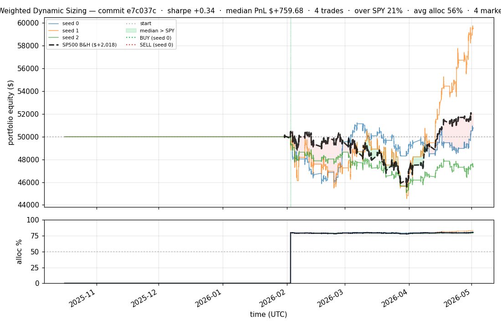
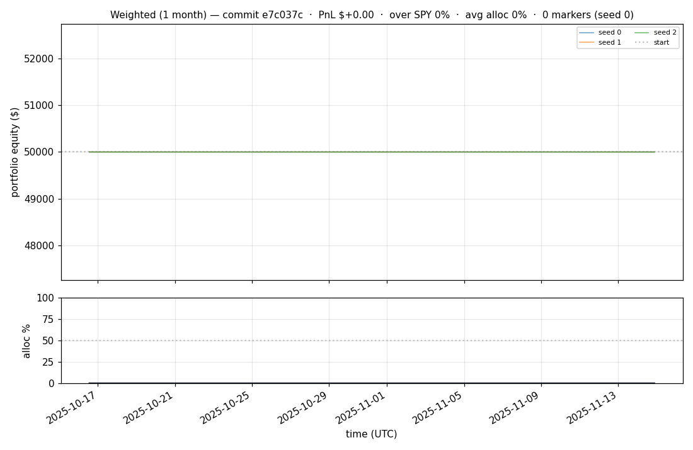
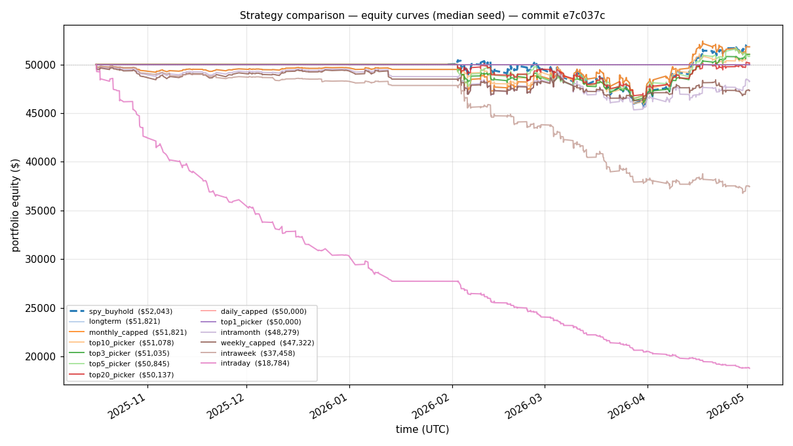

# iter 087 — e7c037c

**🔴 DISCARD** · exp87: PRETRAIN_EPOCHS=2 + ranking (3,4) — break +1.55 ceiling

_2026-05-03 18:24 UTC · 17557s wall_

## Result

| metric | value |
|---|---|
| Sharpe (median) | **+0.337** |
| Sharpe CI low (5%) | -2.383 |
| Sharpe CI high (95%) | +2.671 |
| Net PnL | **$+759.68** (+1.519%) |
| Max drawdown | -11.81% |
| Trades | 4 |
| Fees | $4.00 |
| Seeds completed | 3 |

**Decision reason:** ci_low=-2.3830 ≤ prior best -1.0118

## Per-seed details

```
[evaluator] seed 0: sharpe=+0.337  dd=-8.27%  pnl=$+759.68  trades=4
[evaluator] seed 1: sharpe=+2.055  dd=-11.81%  pnl=$+9,516.69  trades=4
[evaluator] seed 2: sharpe=-1.141  dd=-9.83%  pnl=$-2,669.21  trades=4
```

## Equity curve (full eval window, ~73 days)



## Equity curve (first month)



## Strategy comparison (equity curves)

Overlays every profile (intraday/intraweek/intramonth/longterm + 
daily-capped/weekly-capped/monthly-capped trade-frequency variants 
+ topN pickers + SPY benchmark) on one chart, using the median-seed run.



## Trader profile comparison

Same trained model, different time-horizon strategies + SPY benchmark + passive top-N pickers.

| profile | sharpe | PnL ($) | PnL % | trades | DD % | horizon |
|---|---:|---:|---:|---:|---:|---:|
| **daily_capped** | +0.000 | $+0.00 | +0.00% | 0 | +0.00% | 1d |
| **intraday** | -12.965 | $-31,606.77 | -63.21% | 5210 | -63.21% | 2h |
| **intramonth** | -0.971 | $-1,777.46 | -3.55% | 281 | -8.99% | 30d |
| **intraweek** | -6.624 | $-12,592.01 | -25.18% | 2538 | -26.54% | 5d |
| **longterm** | +0.599 | $+1,393.85 | +2.79% | 21 | -7.34% | 30d |
| **monthly_capped** | +0.737 | $+1,817.42 | +3.63% | 27 | -7.82% | 30d |
| **spy_buyhold** | +1.011 | $+2,017.12 | +4.04% | 1 | -9.73% | - |
| **top10_picker** | +1.244 | $+3,337.96 | +6.68% | 9 | -11.37% | - |
| **top1_picker** | +0.000 | $+0.00 | +0.00% | 0 | +0.00% | - |
| **top20_picker** | +0.416 | $+783.55 | +1.57% | 18 | -10.38% | - |
| **top3_picker** | +0.597 | $+1,034.92 | +2.07% | 2 | -7.98% | - |
| **top5_picker** | +1.455 | $+5,320.34 | +10.64% | 4 | -11.51% | - |
| **weekly_capped** | -1.320 | $-2,734.78 | -5.47% | 336 | -9.44% | 5d |

**Best active strategy: `top5_picker` (sharpe +1.455) — BEATS SPY ✓**

## Out-of-symbol holdout eval

Tested on **JPM, WMT, V, DIS, JNJ** — large-caps the model NEVER saw during training.

| seed | sharpe | PnL | trades | DD% |
|---:|---:|---:|---:|---:|
| 0 | +0.327 | $+502.63 | 5 | -9.17% |
| 1 | -3.869 | $-12.66 | 6 | -0.03% |
| 2 | +0.000 | $+0.00 | 0 | +0.00% |
| 3 | +0.327 | $+504.54 | 5 | -9.19% |
| 4 | +0.000 | $+0.00 | 0 | +0.00% |

**Median holdout sharpe: +0.000** (vs in-symbol +0.337)

## Per-symbol summary (aggregated across all seeds)

| symbol | total trades | buys | sells | avg hold (days) | held-to-end |
|---|---:|---:|---:|---:|---:|
| **COIN** | 94 | 48 | 46 | 0.3 | 2 |
| **PLTR** | 70 | 36 | 34 | 0.1 | 2 |
| **INTC** | 50 | 26 | 24 | 0.1 | 2 |
| **SPY** | 48 | 25 | 23 | 0.7 | 2 |
| **F** | 48 | 25 | 23 | 0.3 | 2 |
| **AMZN** | 44 | 23 | 21 | 0.1 | 2 |
| **NOW** | 44 | 23 | 21 | 0.1 | 2 |
| **AVGO** | 42 | 22 | 20 | 0.2 | 2 |
| **CRM** | 42 | 22 | 20 | 0.1 | 2 |
| **AMAT** | 42 | 22 | 20 | 0.1 | 2 |
| **NIO** | 38 | 20 | 18 | 0.7 | 2 |
| **ORCL** | 38 | 20 | 18 | 0.2 | 2 |
| **AMD** | 36 | 19 | 17 | 0.1 | 2 |
| **LLY** | 36 | 19 | 17 | 0.1 | 2 |
| **ABT** | 34 | 18 | 16 | 0.4 | 2 |
| **XLF** | 32 | 17 | 15 | 0.0 | 2 |
| **MSFT** | 30 | 16 | 14 | 0.3 | 2 |
| **INTU** | 30 | 16 | 14 | 0.1 | 2 |
| **NFLX** | 28 | 15 | 13 | 0.6 | 2 |
| **IWM** | 26 | 14 | 12 | 0.0 | 2 |
| **UNH** | 26 | 14 | 12 | 0.0 | 2 |
| **ETN** | 26 | 14 | 12 | 0.0 | 2 |
| **EEM** | 24 | 13 | 11 | 0.0 | 2 |
| **LOW** | 24 | 13 | 11 | 0.0 | 2 |
| **GOOGL** | 22 | 12 | 10 | 0.3 | 2 |
| **TSLA** | 22 | 12 | 10 | 0.6 | 2 |
| **XOM** | 22 | 12 | 10 | 0.1 | 2 |
| **QCOM** | 22 | 12 | 10 | 0.1 | 2 |
| **BKNG** | 22 | 12 | 10 | 0.0 | 2 |
| **GE** | 20 | 11 | 9 | 0.1 | 2 |
| **SPGI** | 20 | 11 | 9 | 0.3 | 2 |
| **QQQ** | 18 | 10 | 8 | 1.0 | 2 |
| **NVDA** | 18 | 10 | 8 | 0.2 | 2 |
| **META** | 18 | 10 | 8 | 0.0 | 2 |
| **PFE** | 18 | 10 | 8 | 1.1 | 2 |
| **TXN** | 18 | 10 | 8 | 0.1 | 2 |
| **BSX** | 18 | 10 | 8 | 0.0 | 2 |
| **PEP** | 16 | 9 | 7 | 0.1 | 2 |
| **NKE** | 16 | 9 | 7 | 0.3 | 2 |
| **UPS** | 16 | 9 | 7 | 0.0 | 2 |
| **ABBV** | 16 | 9 | 7 | 0.1 | 2 |
| **AAPL** | 14 | 8 | 6 | 0.1 | 2 |
| **LMT** | 14 | 8 | 6 | 0.0 | 2 |
| **HON** | 14 | 8 | 6 | 0.2 | 2 |
| **CAT** | 14 | 8 | 6 | 1.3 | 2 |
| **BAC** | 12 | 7 | 5 | 0.0 | 2 |
| **CVX** | 12 | 7 | 5 | 0.2 | 2 |
| **HD** | 12 | 7 | 5 | 0.0 | 2 |
| **CMCSA** | 12 | 7 | 5 | 0.0 | 2 |
| **ACN** | 12 | 7 | 5 | 0.2 | 2 |
| **LIN** | 10 | 6 | 4 | 0.0 | 2 |
| **IBM** | 10 | 6 | 4 | 0.3 | 2 |
| **AMGN** | 10 | 6 | 4 | 0.0 | 2 |
| **ELV** | 10 | 6 | 4 | 1.5 | 2 |
| **BA** | 8 | 5 | 3 | 2.3 | 2 |
| **MCD** | 8 | 5 | 3 | 0.0 | 2 |
| **COST** | 8 | 5 | 3 | 0.0 | 2 |
| **AMT** | 8 | 5 | 3 | 0.3 | 2 |
| **MS** | 8 | 5 | 3 | 0.0 | 2 |
| **MO** | 8 | 5 | 3 | 1.0 | 2 |
| **DE** | 8 | 5 | 3 | 0.0 | 2 |
| **C** | 8 | 5 | 3 | 2.1 | 2 |
| **VRTX** | 8 | 5 | 3 | 0.0 | 2 |
| **MRK** | 6 | 4 | 2 | 1.1 | 2 |
| **PG** | 6 | 4 | 2 | 0.0 | 2 |
| **NEE** | 6 | 4 | 2 | 0.1 | 2 |
| **ADBE** | 6 | 4 | 2 | 0.1 | 2 |
| **T** | 6 | 4 | 2 | 0.4 | 2 |
| **TMO** | 6 | 4 | 2 | 0.0 | 2 |
| **AXP** | 6 | 4 | 2 | 0.0 | 2 |
| **ADI** | 6 | 4 | 2 | 0.0 | 2 |
| **REGN** | 6 | 4 | 2 | 0.0 | 2 |
| **GILD** | 6 | 4 | 2 | 0.0 | 2 |
| **COF** | 6 | 4 | 2 | 0.0 | 2 |
| **SCHW** | 6 | 4 | 2 | 1.1 | 2 |
| **KO** | 4 | 3 | 1 | 0.0 | 2 |
| **MA** | 4 | 3 | 1 | 0.0 | 2 |
| **BMY** | 4 | 3 | 1 | 7.9 | 2 |
| **RTX** | 4 | 3 | 1 | 1.0 | 2 |
| **GS** | 4 | 3 | 1 | 0.9 | 2 |
| **BLK** | 4 | 3 | 1 | 0.0 | 2 |
| **ISRG** | 4 | 3 | 1 | 0.0 | 2 |
| **SBUX** | 4 | 3 | 1 | 0.0 | 2 |
| **ZTS** | 4 | 3 | 1 | 0.0 | 2 |
| **MMC** | 2 | 2 | 0 | — | 2 |
| **VZ** | 2 | 2 | 0 | — | 2 |
| **PM** | 2 | 2 | 0 | — | 2 |
| **DHR** | 2 | 2 | 0 | — | 2 |
| **MDLZ** | 2 | 2 | 0 | — | 2 |
| **PLD** | 2 | 2 | 0 | — | 2 |
| **USB** | 2 | 2 | 0 | — | 2 |
| **CI** | 2 | 2 | 0 | — | 2 |
| **CB** | 2 | 2 | 0 | — | 2 |
| **SYK** | 2 | 2 | 0 | — | 2 |
| **DUK** | 2 | 2 | 0 | — | 2 |

## Transactions

### Seed 0 — 443 trades · ending equity $46,901.91 (-3,098.09 = -6.20%)

| # | timestamp (UTC) | symbol | side |
|---:|---|---|---|
| 1 | 2025-10-16 15:53:00 | MMC | BUY |
| 2 | 2026-02-02 15:15:00 | IWM | BUY |
| 3 | 2026-02-02 15:18:00 | SPY | BUY |
| 4 | 2026-02-02 15:24:00 | QQQ | BUY |
| 5 | 2026-02-02 15:27:00 | NFLX | BUY |
| 6 | 2026-02-02 15:31:00 | PLTR | BUY |
| 7 | 2026-02-02 15:32:00 | COIN | BUY |
| 8 | 2026-02-02 15:35:00 | COIN | SELL |
| 9 | 2026-02-02 15:35:00 | XLF | BUY |
| 10 | 2026-02-02 15:35:00 | NIO | BUY |
| 11 | 2026-02-02 15:35:00 | COIN | BUY |
| 12 | 2026-02-02 15:37:00 | NIO | SELL |
| 13 | 2026-02-02 15:37:00 | GOOGL | BUY |
| 14 | 2026-02-02 15:56:00 | COIN | SELL |
| 15 | 2026-02-02 15:56:00 | EEM | BUY |
| 16 | 2026-02-02 16:14:00 | QQQ | SELL |
| 17 | 2026-02-02 16:14:00 | MSFT | BUY |
| 18 | 2026-02-02 16:14:00 | NVDA | BUY |
| 19 | 2026-02-02 16:14:00 | AMZN | BUY |
| 20 | 2026-02-02 16:14:00 | META | BUY |
| 21 | 2026-02-02 16:14:00 | TSLA | BUY |
| 22 | 2026-02-02 16:25:00 | GOOGL | SELL |
| 23 | 2026-02-02 16:25:00 | QQQ | BUY |
| 24 | 2026-02-02 16:30:00 | META | SELL |
| 25 | 2026-02-02 16:30:00 | AAPL | BUY |
| 26 | 2026-02-02 16:31:00 | MSFT | SELL |
| 27 | 2026-02-02 16:31:00 | AMD | BUY |
| 28 | 2026-02-02 16:31:00 | BAC | BUY |
| 29 | 2026-02-02 16:31:00 | F | BUY |
| 30 | 2026-02-02 16:31:00 | COIN | BUY |
| 31 | 2026-02-02 16:32:00 | AMD | SELL |
| 32 | 2026-02-02 16:32:00 | NIO | BUY |
| 33 | 2026-02-02 16:32:00 | ORCL | BUY |
| 34 | 2026-02-02 16:32:00 | PFE | BUY |
| 35 | 2026-02-02 16:38:00 | TSLA | SELL |
| 36 | 2026-02-02 16:38:00 | MSFT | BUY |
| 37 | 2026-02-02 16:39:00 | F | SELL |
| 38 | 2026-02-02 16:39:00 | GOOGL | BUY |
| 39 | 2026-02-02 16:40:00 | NIO | SELL |
| 40 | 2026-02-02 16:40:00 | META | BUY |
| 41 | 2026-02-02 16:40:00 | F | BUY |
| 42 | 2026-02-02 16:41:00 | F | SELL |
| 43 | 2026-02-02 16:41:00 | XOM | BUY |
| 44 | 2026-02-02 16:47:00 | COIN | SELL |
| 45 | 2026-02-02 16:47:00 | F | BUY |
| 46 | 2026-02-02 16:48:00 | PLTR | SELL |
| 47 | 2026-02-02 16:48:00 | CVX | BUY |
| 48 | 2026-02-02 16:48:00 | KO | BUY |
| 49 | 2026-02-02 16:48:00 | PEP | BUY |
| 50 | 2026-02-02 16:51:00 | F | SELL |
| 51 | 2026-02-02 16:51:00 | COIN | BUY |
| 52 | 2026-02-02 16:55:00 | XOM | SELL |
| 53 | 2026-02-02 16:55:00 | INTC | BUY |
| 54 | 2026-02-02 16:56:00 | INTC | SELL |
| 55 | 2026-02-02 16:56:00 | F | BUY |
| 56 | 2026-02-02 16:57:00 | COIN | SELL |
| 57 | 2026-02-02 16:57:00 | UNH | BUY |
| 58 | 2026-02-02 16:58:00 | IWM | SELL |
| 59 | 2026-02-02 16:58:00 | XOM | BUY |
| 60 | 2026-02-02 16:58:00 | LLY | BUY |
| 61 | 2026-02-02 16:58:00 | MRK | BUY |
| 62 | 2026-02-02 16:58:00 | ABT | BUY |
| 63 | 2026-02-02 16:59:00 | PEP | SELL |
| 64 | 2026-02-02 16:59:00 | IWM | BUY |
| 65 | 2026-02-02 16:59:00 | NIO | BUY |
| 66 | 2026-02-02 16:59:00 | PG | BUY |
| 67 | 2026-02-02 17:00:00 | MSFT | SELL |
| 68 | 2026-02-02 17:00:00 | MA | BUY |
| 69 | 2026-02-02 17:01:00 | F | SELL |
| 70 | 2026-02-02 17:01:00 | MSFT | BUY |
| 71 | 2026-02-02 17:03:00 | ABT | SELL |
| 72 | 2026-02-02 17:03:00 | TSLA | BUY |
| 73 | 2026-02-02 17:03:00 | PLTR | BUY |
| 74 | 2026-02-02 17:03:00 | PEP | BUY |
| 75 | 2026-02-02 17:05:00 | MA | SELL |
| 76 | 2026-02-02 17:05:00 | HD | BUY |
| 77 | 2026-02-02 17:06:00 | NIO | SELL |
| 78 | 2026-02-02 17:06:00 | F | BUY |
| 79 | 2026-02-02 17:08:00 | MSFT | SELL |
| 80 | 2026-02-02 17:08:00 | INTC | BUY |
| 81 | 2026-02-02 17:09:00 | GOOGL | SELL |
| 82 | 2026-02-02 17:09:00 | MSFT | BUY |
| 83 | 2026-02-02 17:18:00 | LLY | SELL |
| 84 | 2026-02-02 17:18:00 | GOOGL | BUY |
| 85 | 2026-02-02 17:18:00 | MA | BUY |
| 86 | 2026-02-02 17:18:00 | AVGO | BUY |
| 87 | 2026-02-02 17:18:00 | NKE | BUY |
| 88 | 2026-02-02 17:19:00 | NEE | BUY |
| 89 | 2026-02-02 17:20:00 | TSLA | SELL |
| 90 | 2026-02-02 17:20:00 | TSLA | BUY |
| 91 | 2026-02-02 17:20:00 | ABT | BUY |
| 92 | 2026-02-02 17:22:00 | TSLA | SELL |
| 93 | 2026-02-02 17:22:00 | BA | BUY |
| 94 | 2026-02-02 17:22:00 | CRM | BUY |
| 95 | 2026-02-02 17:24:00 | NVDA | SELL |
| 96 | 2026-02-02 17:24:00 | LLY | BUY |
| 97 | 2026-02-02 17:24:00 | MCD | BUY |
| 98 | 2026-02-02 17:24:00 | VZ | BUY |
| 99 | 2026-02-02 17:27:00 | ABT | SELL |
| 100 | 2026-02-02 17:27:00 | NVDA | BUY |
| 101 | 2026-02-02 17:28:00 | MCD | SELL |
| 102 | 2026-02-02 17:28:00 | ABT | BUY |
| 103 | 2026-02-02 17:29:00 | LLY | SELL |
| 104 | 2026-02-02 17:29:00 | ADBE | BUY |
| 105 | 2026-02-02 17:29:00 | CMCSA | BUY |
| 106 | 2026-02-02 17:36:00 | INTC | SELL |
| 107 | 2026-02-02 17:36:00 | BMY | BUY |
| 108 | 2026-02-02 18:10:00 | ADBE | SELL |
| 109 | 2026-02-02 18:10:00 | TSLA | BUY |
| 110 | 2026-02-02 18:10:00 | LLY | BUY |
| 111 | 2026-02-02 20:19:00 | EEM | SELL |
| 112 | 2026-02-02 20:19:00 | AMD | BUY |
| 113 | 2026-02-02 20:20:00 | BA | SELL |
| 114 | 2026-02-02 20:20:00 | INTC | BUY |
| 115 | 2026-02-02 20:22:00 | HD | SELL |
| 116 | 2026-02-02 20:22:00 | COIN | BUY |
| 117 | 2026-02-02 20:23:00 | CVX | SELL |
| 118 | 2026-02-02 20:23:00 | EEM | BUY |
| 119 | 2026-02-02 20:23:00 | ADBE | BUY |
| 120 | 2026-02-02 20:24:00 | SPY | SELL |
| 121 | 2026-02-02 20:24:00 | TXN | BUY |
| 122 | 2026-02-02 20:24:00 | T | BUY |
| 123 | 2026-02-02 20:24:00 | UPS | BUY |
| 124 | 2026-02-02 20:24:00 | LIN | BUY |
| 125 | 2026-02-02 20:24:00 | INTU | BUY |
| 126 | 2026-02-02 20:25:00 | SPY | BUY |
| 127 | 2026-02-02 20:26:00 | AAPL | SELL |
| 128 | 2026-02-02 20:26:00 | HD | BUY |
| 129 | 2026-02-02 20:28:00 | ORCL | SELL |
| 130 | 2026-02-02 20:28:00 | AAPL | BUY |
| 131 | 2026-02-02 20:29:00 | QQQ | SELL |
| 132 | 2026-02-02 20:29:00 | CVX | BUY |
| 133 | 2026-02-02 20:30:00 | PLTR | SELL |
| 134 | 2026-02-02 20:30:00 | QQQ | BUY |
| 135 | 2026-02-02 20:32:00 | INTC | SELL |
| 136 | 2026-02-02 20:32:00 | MCD | BUY |
| 137 | 2026-02-02 20:33:00 | AMZN | SELL |
| 138 | 2026-02-02 20:33:00 | PLTR | BUY |
| 139 | 2026-02-02 20:33:00 | BA | BUY |
| 140 | 2026-02-02 20:34:00 | AMD | SELL |
| 141 | 2026-02-02 20:34:00 | RTX | BUY |
| 142 | 2026-02-02 20:35:00 | MSFT | SELL |
| 143 | 2026-02-02 20:35:00 | AMZN | BUY |
| 144 | 2026-02-02 20:37:00 | PLTR | SELL |
| 145 | 2026-02-02 20:37:00 | AMD | BUY |
| 146 | 2026-02-02 20:37:00 | INTC | BUY |
| 147 | 2026-02-02 20:38:00 | PEP | SELL |
| 148 | 2026-02-02 20:38:00 | TMO | BUY |
| 149 | 2026-02-02 20:39:00 | F | SELL |
| 150 | 2026-02-02 20:39:00 | MSFT | BUY |
| 151 | 2026-02-02 20:40:00 | AMZN | SELL |
| 152 | 2026-02-02 20:40:00 | PEP | BUY |
| 153 | 2026-02-02 20:41:00 | NVDA | SELL |
| 154 | 2026-02-02 20:41:00 | COST | BUY |
| 155 | 2026-02-02 20:42:00 | NFLX | SELL |
| 156 | 2026-02-02 20:42:00 | ACN | BUY |
| 157 | 2026-02-02 20:42:00 | PM | BUY |
| 158 | 2026-02-02 20:42:00 | QCOM | BUY |
| 159 | 2026-02-02 20:42:00 | IBM | BUY |
| 160 | 2026-02-02 20:43:00 | ABT | SELL |
| 161 | 2026-02-02 20:43:00 | PLTR | BUY |
| 162 | 2026-02-02 20:45:00 | LIN | SELL |
| 163 | 2026-02-02 20:45:00 | NFLX | BUY |
| 164 | 2026-02-02 20:45:00 | F | BUY |
| 165 | 2026-02-02 20:47:00 | PLTR | SELL |
| 166 | 2026-02-02 20:47:00 | NIO | BUY |
| 167 | 2026-02-02 20:48:00 | AAPL | SELL |
| 168 | 2026-02-02 20:48:00 | ABBV | BUY |
| 169 | 2026-02-02 20:49:00 | F | SELL |
| 170 | 2026-02-02 20:49:00 | ABT | BUY |
| 171 | 2026-02-02 20:51:00 | META | SELL |
| 172 | 2026-02-02 20:51:00 | AMAT | BUY |
| 173 | 2026-02-02 20:51:00 | LMT | BUY |
| 174 | 2026-02-02 20:53:00 | INTC | SELL |
| 175 | 2026-02-02 20:53:00 | F | BUY |
| 176 | 2026-02-02 20:54:00 | TSLA | SELL |
| 177 | 2026-02-02 20:54:00 | HON | BUY |
| 178 | 2026-02-02 20:55:00 | SPY | SELL |
| 179 | 2026-02-02 20:55:00 | LOW | BUY |
| 180 | 2026-02-02 20:56:00 | XOM | SELL |
| 181 | 2026-02-02 20:56:00 | AMT | BUY |
| 182 | 2026-02-02 20:56:00 | AMGN | BUY |
| 183 | 2026-02-02 20:56:00 | CAT | BUY |
| 184 | 2026-02-02 20:56:00 | NOW | BUY |
| 185 | 2026-02-02 20:56:00 | GE | BUY |
| 186 | 2026-02-02 20:57:00 | AMZN | BUY |
| 187 | 2026-02-02 20:59:00 | NEE | SELL |
| 188 | 2026-02-02 20:59:00 | GS | BUY |
| 189 | 2026-02-03 14:30:00 | NIO | SELL |
| 190 | 2026-02-03 14:30:00 | TSLA | BUY |
| 191 | 2026-02-03 14:31:00 | PFE | SELL |
| 192 | 2026-02-03 14:31:00 | XOM | BUY |
| 193 | 2026-02-03 14:32:00 | MSFT | SELL |
| 194 | 2026-02-03 14:32:00 | LIN | BUY |
| 195 | 2026-02-03 14:36:00 | AMD | SELL |
| 196 | 2026-02-03 14:36:00 | AAPL | BUY |
| 197 | 2026-02-03 14:37:00 | TXN | SELL |
| 198 | 2026-02-03 14:37:00 | SPY | BUY |
| 199 | 2026-02-03 14:37:00 | MSFT | BUY |
| 200 | 2026-02-03 14:37:00 | NVDA | BUY |
| … | _243 more truncated_ | | |

### Seed 1 — 622 trades · ending equity $43,362.71 (-6,637.29 = -13.27%)

| # | timestamp (UTC) | symbol | side |
|---:|---|---|---|
| 1 | 2026-02-02 21:07:00 | PLTR | BUY |
| 2 | 2026-02-02 21:18:00 | PLTR | SELL |
| 3 | 2026-02-02 21:20:00 | PLTR | BUY |
| 4 | 2026-02-02 21:30:00 | PLTR | SELL |
| 5 | 2026-02-02 21:41:00 | PLTR | BUY |
| 6 | 2026-02-03 13:55:00 | PLTR | SELL |
| 7 | 2026-02-03 14:31:00 | PLTR | BUY |
| 8 | 2026-02-03 14:32:00 | INTC | BUY |
| 9 | 2026-02-03 14:34:00 | INTC | SELL |
| 10 | 2026-02-03 14:36:00 | PLTR | SELL |
| 11 | 2026-02-03 14:36:00 | ACN | BUY |
| 12 | 2026-02-03 14:36:00 | NOW | BUY |
| 13 | 2026-02-03 14:37:00 | INTU | BUY |
| 14 | 2026-02-03 14:38:00 | INTU | SELL |
| 15 | 2026-02-03 14:38:00 | SPGI | BUY |
| 16 | 2026-02-03 14:39:00 | SPGI | SELL |
| 17 | 2026-02-03 14:39:00 | NOW | SELL |
| 18 | 2026-02-03 14:40:00 | PLTR | BUY |
| 19 | 2026-02-03 14:40:00 | SPGI | BUY |
| 20 | 2026-02-03 14:43:00 | PLTR | SELL |
| 21 | 2026-02-03 14:43:00 | SPGI | SELL |
| 22 | 2026-02-03 14:43:00 | INTU | BUY |
| 23 | 2026-02-03 14:44:00 | INTU | SELL |
| 24 | 2026-02-03 14:45:00 | ACN | SELL |
| 25 | 2026-02-03 14:46:00 | ACN | BUY |
| 26 | 2026-02-03 14:47:00 | ACN | SELL |
| 27 | 2026-02-03 16:03:00 | PLTR | BUY |
| 28 | 2026-02-03 16:04:00 | PLTR | SELL |
| 29 | 2026-02-04 14:34:00 | LLY | BUY |
| 30 | 2026-02-04 14:35:00 | BSX | BUY |
| 31 | 2026-02-04 14:37:00 | ABBV | BUY |
| 32 | 2026-02-04 14:38:00 | AMD | BUY |
| 33 | 2026-02-04 14:39:00 | AMD | SELL |
| 34 | 2026-02-04 14:40:00 | AMD | BUY |
| 35 | 2026-02-04 14:41:00 | AMD | SELL |
| 36 | 2026-02-04 14:43:00 | AMD | BUY |
| 37 | 2026-02-04 14:44:00 | AMD | SELL |
| 38 | 2026-02-04 14:48:00 | LLY | SELL |
| 39 | 2026-02-04 14:48:00 | BSX | SELL |
| 40 | 2026-02-04 14:49:00 | LLY | BUY |
| 41 | 2026-02-04 14:50:00 | ABBV | SELL |
| 42 | 2026-02-04 14:55:00 | LLY | SELL |
| 43 | 2026-02-04 14:57:00 | LLY | BUY |
| 44 | 2026-02-04 14:58:00 | LLY | SELL |
| 45 | 2026-02-04 15:44:00 | LLY | BUY |
| 46 | 2026-02-04 15:45:00 | LLY | SELL |
| 47 | 2026-02-04 15:50:00 | LLY | BUY |
| 48 | 2026-02-04 15:51:00 | LLY | SELL |
| 49 | 2026-02-04 21:11:00 | GOOGL | BUY |
| 50 | 2026-02-04 21:13:00 | AVGO | BUY |
| 51 | 2026-02-04 21:39:00 | GOOGL | SELL |
| 52 | 2026-02-04 21:40:00 | GOOGL | BUY |
| 53 | 2026-02-05 13:03:00 | AVGO | SELL |
| 54 | 2026-02-05 14:30:00 | GOOGL | SELL |
| 55 | 2026-02-05 14:30:00 | AVGO | BUY |
| 56 | 2026-02-05 14:31:00 | AVGO | SELL |
| 57 | 2026-02-05 14:32:00 | GOOGL | BUY |
| 58 | 2026-02-05 14:34:00 | COIN | BUY |
| 59 | 2026-02-05 14:35:00 | NOW | BUY |
| 60 | 2026-02-05 14:36:00 | QCOM | BUY |
| 61 | 2026-02-05 14:36:00 | BSX | BUY |
| 62 | 2026-02-05 14:36:00 | PLTR | BUY |
| 63 | 2026-02-05 14:37:00 | INTC | BUY |
| 64 | 2026-02-05 14:38:00 | BSX | SELL |
| 65 | 2026-02-05 14:38:00 | AMT | BUY |
| 66 | 2026-02-05 14:38:00 | LLY | BUY |
| 67 | 2026-02-05 14:39:00 | LLY | SELL |
| 68 | 2026-02-05 14:39:00 | AMT | SELL |
| 69 | 2026-02-05 14:43:00 | PLTR | SELL |
| 70 | 2026-02-05 14:43:00 | BSX | BUY |
| 71 | 2026-02-05 14:44:00 | INTC | SELL |
| 72 | 2026-02-05 14:45:00 | PLTR | BUY |
| 73 | 2026-02-05 14:46:00 | PLTR | SELL |
| 74 | 2026-02-05 14:46:00 | BSX | SELL |
| 75 | 2026-02-05 14:48:00 | NOW | SELL |
| 76 | 2026-02-05 14:50:00 | GOOGL | SELL |
| 77 | 2026-02-05 14:50:00 | COIN | SELL |
| 78 | 2026-02-05 14:50:00 | QCOM | SELL |
| 79 | 2026-02-05 14:52:00 | COIN | BUY |
| 80 | 2026-02-05 14:52:00 | BSX | BUY |
| 81 | 2026-02-05 14:53:00 | BSX | SELL |
| 82 | 2026-02-05 14:55:00 | QCOM | BUY |
| 83 | 2026-02-05 14:56:00 | COIN | SELL |
| 84 | 2026-02-05 14:57:00 | GOOGL | BUY |
| 85 | 2026-02-05 14:58:00 | GOOGL | SELL |
| 86 | 2026-02-05 14:58:00 | QCOM | SELL |
| 87 | 2026-02-05 15:02:00 | QCOM | BUY |
| 88 | 2026-02-05 15:06:00 | QCOM | SELL |
| 89 | 2026-02-05 15:11:00 | QCOM | BUY |
| 90 | 2026-02-05 15:14:00 | QCOM | SELL |
| 91 | 2026-02-05 18:04:00 | SPGI | BUY |
| 92 | 2026-02-05 18:05:00 | SPGI | SELL |
| 93 | 2026-02-06 13:22:00 | COIN | BUY |
| 94 | 2026-02-06 13:41:00 | ORCL | BUY |
| 95 | 2026-02-06 13:45:00 | COIN | SELL |
| 96 | 2026-02-06 14:01:00 | COIN | BUY |
| 97 | 2026-02-06 14:14:00 | COIN | SELL |
| 98 | 2026-02-06 14:30:00 | ORCL | SELL |
| 99 | 2026-02-06 14:30:00 | PLTR | BUY |
| 100 | 2026-02-06 14:30:00 | ORCL | BUY |
| 101 | 2026-02-06 14:30:00 | NVDA | BUY |
| 102 | 2026-02-06 14:32:00 | AVGO | BUY |
| 103 | 2026-02-06 14:32:00 | AMD | BUY |
| 104 | 2026-02-06 14:33:00 | MSFT | BUY |
| 105 | 2026-02-06 14:34:00 | MSFT | SELL |
| 106 | 2026-02-06 14:34:00 | INTC | BUY |
| 107 | 2026-02-06 14:35:00 | NVDA | SELL |
| 108 | 2026-02-06 14:35:00 | INTC | SELL |
| 109 | 2026-02-06 14:35:00 | AMZN | BUY |
| 110 | 2026-02-06 14:37:00 | ORCL | SELL |
| 111 | 2026-02-06 14:44:00 | AVGO | SELL |
| 112 | 2026-02-06 14:45:00 | AMD | SELL |
| 113 | 2026-02-06 14:47:00 | AMZN | SELL |
| 114 | 2026-02-06 14:49:00 | PLTR | SELL |
| 115 | 2026-02-06 15:34:00 | PLTR | BUY |
| 116 | 2026-02-06 15:35:00 | PLTR | SELL |
| 117 | 2026-02-09 14:32:00 | ORCL | BUY |
| 118 | 2026-02-09 14:35:00 | ORCL | SELL |
| 119 | 2026-02-09 14:37:00 | NOW | BUY |
| 120 | 2026-02-09 14:39:00 | NOW | SELL |
| 121 | 2026-02-10 14:36:00 | SPGI | BUY |
| 122 | 2026-02-10 14:50:00 | SPGI | SELL |
| 123 | 2026-02-12 21:37:00 | COIN | BUY |
| 124 | 2026-02-13 14:06:00 | NIO | BUY |
| 125 | 2026-02-13 14:30:00 | NIO | SELL |
| 126 | 2026-02-13 14:31:00 | AMAT | BUY |
| 127 | 2026-02-13 14:32:00 | COIN | SELL |
| 128 | 2026-02-13 14:32:00 | AMAT | SELL |
| 129 | 2026-02-13 14:33:00 | AMAT | BUY |
| 130 | 2026-02-13 14:33:00 | VRTX | BUY |
| 131 | 2026-02-13 14:35:00 | PLTR | BUY |
| 132 | 2026-02-13 14:39:00 | PLTR | SELL |
| 133 | 2026-02-13 14:39:00 | VRTX | SELL |
| 134 | 2026-02-13 14:41:00 | VRTX | BUY |
| 135 | 2026-02-13 14:43:00 | PLTR | BUY |
| 136 | 2026-02-13 14:45:00 | PLTR | SELL |
| 137 | 2026-02-13 14:48:00 | AMAT | SELL |
| 138 | 2026-02-13 14:48:00 | VRTX | SELL |
| 139 | 2026-02-13 14:49:00 | AMAT | BUY |
| 140 | 2026-02-13 14:51:00 | AMAT | SELL |
| 141 | 2026-02-13 14:55:00 | AMAT | BUY |
| 142 | 2026-02-13 14:56:00 | AMAT | SELL |
| 143 | 2026-02-13 14:59:00 | AMAT | BUY |
| 144 | 2026-02-13 15:01:00 | AMAT | SELL |
| 145 | 2026-02-13 15:07:00 | AMAT | BUY |
| 146 | 2026-02-13 15:08:00 | AMAT | SELL |
| 147 | 2026-02-13 15:28:00 | AMAT | BUY |
| 148 | 2026-02-13 15:29:00 | AMAT | SELL |
| 149 | 2026-02-13 15:41:00 | AMAT | BUY |
| 150 | 2026-02-13 15:45:00 | AMAT | SELL |
| 151 | 2026-02-13 15:49:00 | AMAT | BUY |
| 152 | 2026-02-13 15:56:00 | AMAT | SELL |
| 153 | 2026-02-13 16:08:00 | AMAT | BUY |
| 154 | 2026-02-13 16:10:00 | AMAT | SELL |
| 155 | 2026-02-13 16:23:00 | AMAT | BUY |
| 156 | 2026-02-13 16:28:00 | AMAT | SELL |
| 157 | 2026-02-17 14:30:00 | NOW | BUY |
| 158 | 2026-02-17 14:31:00 | NOW | SELL |
| 159 | 2026-02-17 14:33:00 | NOW | BUY |
| 160 | 2026-02-17 14:33:00 | INTC | BUY |
| 161 | 2026-02-17 14:33:00 | COIN | BUY |
| 162 | 2026-02-17 14:34:00 | INTC | SELL |
| 163 | 2026-02-17 14:34:00 | COIN | SELL |
| 164 | 2026-02-17 14:35:00 | NOW | SELL |
| 165 | 2026-02-17 14:36:00 | COIN | BUY |
| 166 | 2026-02-17 14:36:00 | NOW | BUY |
| 167 | 2026-02-17 14:37:00 | NOW | SELL |
| 168 | 2026-02-17 14:37:00 | INTU | BUY |
| 169 | 2026-02-17 14:42:00 | INTU | SELL |
| 170 | 2026-02-17 14:44:00 | INTU | BUY |
| 171 | 2026-02-17 14:47:00 | INTU | SELL |
| 172 | 2026-02-17 14:48:00 | COIN | SELL |
| 173 | 2026-02-17 14:52:00 | COIN | BUY |
| 174 | 2026-02-17 14:55:00 | COIN | SELL |
| 175 | 2026-02-18 14:40:00 | COIN | BUY |
| 176 | 2026-02-18 14:41:00 | COIN | SELL |
| 177 | 2026-02-18 14:42:00 | COIN | BUY |
| 178 | 2026-02-18 14:43:00 | COIN | SELL |
| 179 | 2026-02-19 14:34:00 | DE | BUY |
| 180 | 2026-02-19 14:37:00 | ACN | BUY |
| 181 | 2026-02-19 14:37:00 | BKNG | BUY |
| 182 | 2026-02-19 14:38:00 | BKNG | SELL |
| 183 | 2026-02-19 14:39:00 | BKNG | BUY |
| 184 | 2026-02-19 14:40:00 | BKNG | SELL |
| 185 | 2026-02-19 14:40:00 | DE | SELL |
| 186 | 2026-02-19 14:41:00 | ACN | SELL |
| 187 | 2026-02-19 14:42:00 | DE | BUY |
| 188 | 2026-02-19 14:47:00 | DE | SELL |
| 189 | 2026-02-23 14:37:00 | LLY | BUY |
| 190 | 2026-02-23 14:38:00 | LLY | SELL |
| 191 | 2026-02-24 14:01:00 | AMD | BUY |
| 192 | 2026-02-24 14:43:00 | AMD | SELL |
| 193 | 2026-02-24 14:44:00 | AMD | BUY |
| 194 | 2026-02-24 14:46:00 | AMT | BUY |
| 195 | 2026-02-24 14:49:00 | AMD | SELL |
| 196 | 2026-02-24 14:49:00 | AMT | SELL |
| 197 | 2026-02-24 14:54:00 | AMD | BUY |
| 198 | 2026-02-24 14:55:00 | AMD | SELL |
| 199 | 2026-02-25 14:34:00 | NOW | BUY |
| 200 | 2026-02-25 14:37:00 | NOW | SELL |
| … | _422 more truncated_ | | |

### Seed 2 — 0 trades · ending equity $50,000.00 (+0.00 = +0.00%)

_(no trades executed)_

### Seed 3 — 565 trades · ending equity $47,414.99 (-2,585.01 = -5.17%)

| # | timestamp (UTC) | symbol | side |
|---:|---|---|---|
| 1 | 2025-10-16 15:53:00 | MMC | BUY |
| 2 | 2026-02-02 15:15:00 | IWM | BUY |
| 3 | 2026-02-02 15:18:00 | SPY | BUY |
| 4 | 2026-02-02 15:24:00 | QQQ | BUY |
| 5 | 2026-02-02 15:27:00 | NFLX | BUY |
| 6 | 2026-02-02 15:31:00 | SPY | SELL |
| 7 | 2026-02-02 15:31:00 | SPY | BUY |
| 8 | 2026-02-02 15:31:00 | PLTR | BUY |
| 9 | 2026-02-02 15:32:00 | SPY | SELL |
| 10 | 2026-02-02 15:32:00 | SPY | BUY |
| 11 | 2026-02-02 15:32:00 | COIN | BUY |
| 12 | 2026-02-02 15:35:00 | SPY | SELL |
| 13 | 2026-02-02 15:35:00 | SPY | BUY |
| 14 | 2026-02-02 15:35:00 | XLF | BUY |
| 15 | 2026-02-02 15:35:00 | NIO | BUY |
| 16 | 2026-02-02 15:37:00 | SPY | SELL |
| 17 | 2026-02-02 15:37:00 | SPY | BUY |
| 18 | 2026-02-02 15:37:00 | GOOGL | BUY |
| 19 | 2026-02-02 15:37:00 | BAC | BUY |
| 20 | 2026-02-02 15:40:00 | SPY | SELL |
| 21 | 2026-02-02 15:40:00 | SPY | BUY |
| 22 | 2026-02-02 15:40:00 | TSLA | BUY |
| 23 | 2026-02-02 15:40:00 | F | BUY |
| 24 | 2026-02-02 15:54:00 | NVDA | BUY |
| 25 | 2026-02-02 16:00:00 | F | SELL |
| 26 | 2026-02-02 16:00:00 | EEM | BUY |
| 27 | 2026-02-02 16:05:00 | XLF | SELL |
| 28 | 2026-02-02 16:05:00 | XLF | BUY |
| 29 | 2026-02-02 16:05:00 | MSFT | BUY |
| 30 | 2026-02-02 16:05:00 | AMZN | BUY |
| 31 | 2026-02-02 16:06:00 | XLF | SELL |
| 32 | 2026-02-02 16:06:00 | XLF | BUY |
| 33 | 2026-02-02 16:06:00 | META | BUY |
| 34 | 2026-02-02 16:10:00 | XLF | SELL |
| 35 | 2026-02-02 16:10:00 | XLF | BUY |
| 36 | 2026-02-02 16:10:00 | INTC | BUY |
| 37 | 2026-02-02 16:16:00 | XLF | SELL |
| 38 | 2026-02-02 16:16:00 | XLF | BUY |
| 39 | 2026-02-02 16:16:00 | AAPL | BUY |
| 40 | 2026-02-02 16:19:00 | BAC | SELL |
| 41 | 2026-02-02 16:19:00 | AMD | BUY |
| 42 | 2026-02-02 16:19:00 | BAC | BUY |
| 43 | 2026-02-02 16:20:00 | EEM | SELL |
| 44 | 2026-02-02 16:20:00 | EEM | BUY |
| 45 | 2026-02-02 16:21:00 | XLF | SELL |
| 46 | 2026-02-02 16:21:00 | XLF | BUY |
| 47 | 2026-02-02 16:22:00 | BAC | SELL |
| 48 | 2026-02-02 16:22:00 | BAC | BUY |
| 49 | 2026-02-02 16:23:00 | XLF | SELL |
| 50 | 2026-02-02 16:23:00 | XLF | BUY |
| 51 | 2026-02-02 16:24:00 | BAC | SELL |
| 52 | 2026-02-02 16:24:00 | BAC | BUY |
| 53 | 2026-02-02 16:25:00 | XLF | SELL |
| 54 | 2026-02-02 16:25:00 | XLF | BUY |
| 55 | 2026-02-02 16:26:00 | XLF | SELL |
| 56 | 2026-02-02 16:26:00 | XLF | BUY |
| 57 | 2026-02-02 16:27:00 | XLF | SELL |
| 58 | 2026-02-02 16:27:00 | XLF | BUY |
| 59 | 2026-02-02 16:28:00 | BAC | SELL |
| 60 | 2026-02-02 16:28:00 | BAC | BUY |
| 61 | 2026-02-02 16:29:00 | EEM | SELL |
| 62 | 2026-02-02 16:29:00 | EEM | BUY |
| 63 | 2026-02-02 16:34:00 | PLTR | SELL |
| 64 | 2026-02-02 16:34:00 | F | BUY |
| 65 | 2026-02-02 16:34:00 | PLTR | BUY |
| 66 | 2026-02-02 16:34:00 | ORCL | BUY |
| 67 | 2026-02-02 16:34:00 | PFE | BUY |
| 68 | 2026-02-02 16:36:00 | EEM | SELL |
| 69 | 2026-02-02 16:36:00 | EEM | BUY |
| 70 | 2026-02-02 16:37:00 | NVDA | SELL |
| 71 | 2026-02-02 16:37:00 | NVDA | BUY |
| 72 | 2026-02-02 16:38:00 | XLF | SELL |
| 73 | 2026-02-02 16:38:00 | XLF | BUY |
| 74 | 2026-02-02 16:39:00 | F | SELL |
| 75 | 2026-02-02 16:39:00 | F | BUY |
| 76 | 2026-02-02 16:39:00 | XOM | BUY |
| 77 | 2026-02-02 16:39:00 | CVX | BUY |
| 78 | 2026-02-02 16:40:00 | XLF | SELL |
| 79 | 2026-02-02 16:40:00 | XLF | BUY |
| 80 | 2026-02-02 16:41:00 | F | SELL |
| 81 | 2026-02-02 16:41:00 | F | BUY |
| 82 | 2026-02-02 16:41:00 | KO | BUY |
| 83 | 2026-02-02 16:42:00 | XLF | SELL |
| 84 | 2026-02-02 16:42:00 | XLF | BUY |
| 85 | 2026-02-02 16:43:00 | MSFT | SELL |
| 86 | 2026-02-02 16:43:00 | MSFT | BUY |
| 87 | 2026-02-02 16:43:00 | HD | BUY |
| 88 | 2026-02-02 16:44:00 | PLTR | SELL |
| 89 | 2026-02-02 16:44:00 | PLTR | BUY |
| 90 | 2026-02-02 16:44:00 | UNH | BUY |
| 91 | 2026-02-02 16:45:00 | MSFT | SELL |
| 92 | 2026-02-02 16:45:00 | MSFT | BUY |
| 93 | 2026-02-02 16:46:00 | PLTR | SELL |
| 94 | 2026-02-02 16:46:00 | PLTR | BUY |
| 95 | 2026-02-02 16:46:00 | MA | BUY |
| 96 | 2026-02-02 16:47:00 | MSFT | SELL |
| 97 | 2026-02-02 16:47:00 | MSFT | BUY |
| 98 | 2026-02-02 16:48:00 | PLTR | SELL |
| 99 | 2026-02-02 16:48:00 | PLTR | BUY |
| 100 | 2026-02-02 16:48:00 | PEP | BUY |
| 101 | 2026-02-02 16:49:00 | XLF | SELL |
| 102 | 2026-02-02 16:49:00 | XLF | BUY |
| 103 | 2026-02-02 16:50:00 | XLF | SELL |
| 104 | 2026-02-02 16:50:00 | XLF | BUY |
| 105 | 2026-02-02 16:51:00 | EEM | SELL |
| 106 | 2026-02-02 16:51:00 | EEM | BUY |
| 107 | 2026-02-02 16:52:00 | EEM | SELL |
| 108 | 2026-02-02 16:52:00 | EEM | BUY |
| 109 | 2026-02-02 16:53:00 | UNH | SELL |
| 110 | 2026-02-02 16:53:00 | UNH | BUY |
| 111 | 2026-02-02 16:54:00 | CVX | SELL |
| 112 | 2026-02-02 16:54:00 | PG | BUY |
| 113 | 2026-02-02 16:55:00 | PG | SELL |
| 114 | 2026-02-02 16:55:00 | PG | BUY |
| 115 | 2026-02-02 16:56:00 | XLF | SELL |
| 116 | 2026-02-02 16:56:00 | XLF | BUY |
| 117 | 2026-02-02 16:57:00 | F | SELL |
| 118 | 2026-02-02 16:57:00 | F | BUY |
| 119 | 2026-02-02 16:57:00 | CVX | BUY |
| 120 | 2026-02-02 16:58:00 | EEM | SELL |
| 121 | 2026-02-02 16:58:00 | EEM | BUY |
| 122 | 2026-02-02 16:59:00 | MSFT | SELL |
| 123 | 2026-02-02 16:59:00 | MSFT | BUY |
| 124 | 2026-02-02 17:00:00 | BAC | SELL |
| 125 | 2026-02-02 17:00:00 | BAC | BUY |
| 126 | 2026-02-02 17:01:00 | GOOGL | SELL |
| 127 | 2026-02-02 17:01:00 | GOOGL | BUY |
| 128 | 2026-02-02 17:01:00 | LLY | BUY |
| 129 | 2026-02-02 17:01:00 | AVGO | BUY |
| 130 | 2026-02-02 17:02:00 | F | SELL |
| 131 | 2026-02-02 17:02:00 | F | BUY |
| 132 | 2026-02-02 17:03:00 | SPY | SELL |
| 133 | 2026-02-02 17:03:00 | SPY | BUY |
| 134 | 2026-02-02 17:03:00 | MRK | BUY |
| 135 | 2026-02-02 17:03:00 | ABT | BUY |
| 136 | 2026-02-02 17:04:00 | QQQ | SELL |
| 137 | 2026-02-02 17:04:00 | QQQ | BUY |
| 138 | 2026-02-02 17:04:00 | NKE | BUY |
| 139 | 2026-02-02 17:04:00 | BA | BUY |
| 140 | 2026-02-02 17:04:00 | CRM | BUY |
| 141 | 2026-02-02 17:04:00 | NEE | BUY |
| 142 | 2026-02-02 17:05:00 | SPY | SELL |
| 143 | 2026-02-02 17:05:00 | SPY | BUY |
| 144 | 2026-02-02 17:05:00 | VZ | BUY |
| 145 | 2026-02-02 17:06:00 | QQQ | SELL |
| 146 | 2026-02-02 17:06:00 | QQQ | BUY |
| 147 | 2026-02-02 17:06:00 | ADBE | BUY |
| 148 | 2026-02-02 17:06:00 | CMCSA | BUY |
| 149 | 2026-02-02 17:06:00 | BMY | BUY |
| 150 | 2026-02-02 17:07:00 | SPY | SELL |
| 151 | 2026-02-02 17:07:00 | SPY | BUY |
| 152 | 2026-02-02 17:07:00 | TXN | BUY |
| 153 | 2026-02-02 17:08:00 | LLY | SELL |
| 154 | 2026-02-02 17:08:00 | LLY | BUY |
| 155 | 2026-02-02 17:09:00 | XOM | SELL |
| 156 | 2026-02-02 17:09:00 | XOM | BUY |
| 157 | 2026-02-02 17:09:00 | MCD | BUY |
| 158 | 2026-02-02 17:10:00 | LLY | SELL |
| 159 | 2026-02-02 17:10:00 | LLY | BUY |
| 160 | 2026-02-02 17:11:00 | LLY | SELL |
| 161 | 2026-02-02 17:11:00 | LLY | BUY |
| 162 | 2026-02-02 17:12:00 | F | SELL |
| 163 | 2026-02-02 17:12:00 | F | BUY |
| 164 | 2026-02-02 17:13:00 | PLTR | SELL |
| 165 | 2026-02-02 17:13:00 | PLTR | BUY |
| 166 | 2026-02-02 17:14:00 | AAPL | SELL |
| 167 | 2026-02-02 17:14:00 | AAPL | BUY |
| 168 | 2026-02-02 17:15:00 | PEP | SELL |
| 169 | 2026-02-02 17:15:00 | ABBV | BUY |
| 170 | 2026-02-02 17:16:00 | PLTR | SELL |
| 171 | 2026-02-02 17:16:00 | PLTR | BUY |
| 172 | 2026-02-02 17:17:00 | PLTR | SELL |
| 173 | 2026-02-02 17:17:00 | PLTR | BUY |
| 174 | 2026-02-02 17:18:00 | AAPL | SELL |
| 175 | 2026-02-02 17:18:00 | AAPL | BUY |
| 176 | 2026-02-02 17:19:00 | PLTR | SELL |
| 177 | 2026-02-02 17:19:00 | PLTR | BUY |
| 178 | 2026-02-02 17:20:00 | CRM | SELL |
| 179 | 2026-02-02 17:20:00 | PEP | BUY |
| 180 | 2026-02-02 17:21:00 | AVGO | SELL |
| 181 | 2026-02-02 17:21:00 | AVGO | BUY |
| 182 | 2026-02-02 17:22:00 | EEM | SELL |
| 183 | 2026-02-02 17:22:00 | EEM | BUY |
| 184 | 2026-02-02 17:23:00 | XOM | SELL |
| 185 | 2026-02-02 17:23:00 | XOM | BUY |
| 186 | 2026-02-02 17:24:00 | IWM | SELL |
| 187 | 2026-02-02 17:24:00 | IWM | BUY |
| 188 | 2026-02-02 17:24:00 | CRM | BUY |
| 189 | 2026-02-02 17:24:00 | T | BUY |
| 190 | 2026-02-02 17:24:00 | RTX | BUY |
| 191 | 2026-02-02 17:24:00 | QCOM | BUY |
| 192 | 2026-02-02 17:25:00 | F | SELL |
| 193 | 2026-02-02 17:25:00 | F | BUY |
| 194 | 2026-02-02 17:25:00 | UPS | BUY |
| 195 | 2026-02-02 17:26:00 | F | SELL |
| 196 | 2026-02-02 17:26:00 | F | BUY |
| 197 | 2026-02-02 17:27:00 | PEP | SELL |
| 198 | 2026-02-02 17:27:00 | PEP | BUY |
| 199 | 2026-02-02 17:28:00 | PEP | SELL |
| 200 | 2026-02-02 17:28:00 | PEP | BUY |
| … | _365 more truncated_ | | |

### Seed 4 — 2 trades · ending equity $49,990.57 (-9.43 = -0.02%)

| # | timestamp (UTC) | symbol | side |
|---:|---|---|---|
| 1 | 2026-04-06 13:30:00 | BKNG | BUY |
| 2 | 2026-04-06 14:06:00 | BKNG | SELL |

## Diff vs previous experiment

```diff
e7c037c exp87: PRETRAIN_EPOCHS=1→2 + restore (3,4) ranking — break +1.55 ceiling

Two changes bundled:
1. ranking_horizons reverted to (3,4) = 4h+1d combo. exp85 (4,) and exp86 (3,)
   both regressed; the combo is the local optimum.
2. PRETRAIN_EPOCHS 1→2. We've been at +1.55 sharpe ceiling for many iterations.
   More training might break it.

Fresh pretrain required (cached weights from exp71 only saw 1 epoch). ETA
~3-5h at v7 scale (2x exp79's 167min if scaling holds). N_SEEDS=3.


 experiment.py | 10 +++++-----
 1 file changed, 5 insertions(+), 5 deletions(-)
```

---

[← all iterations](.) · [back to README](../README.md)
