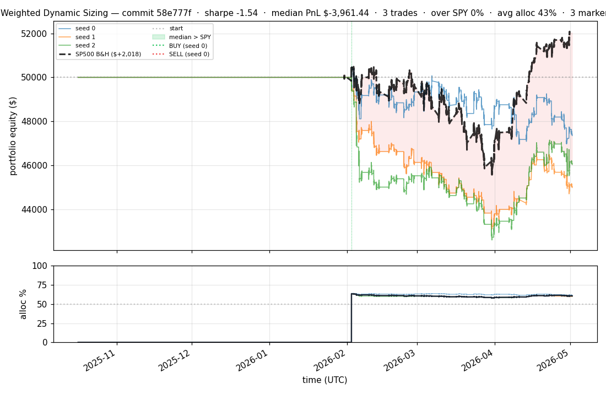
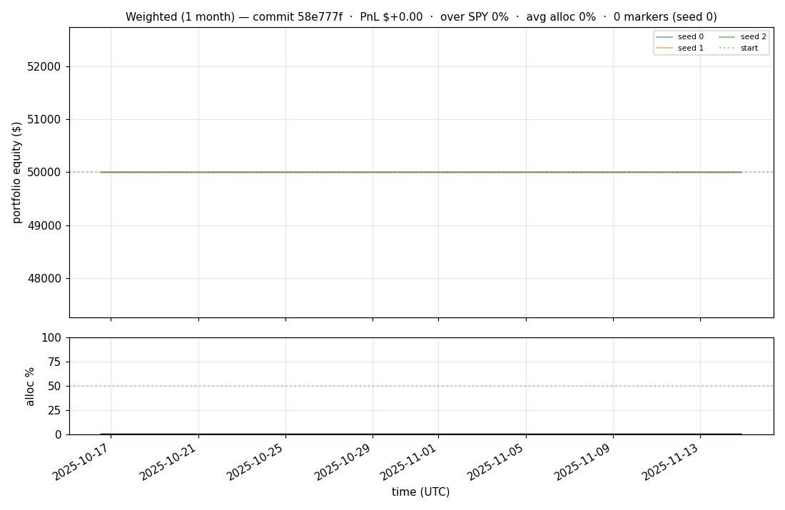
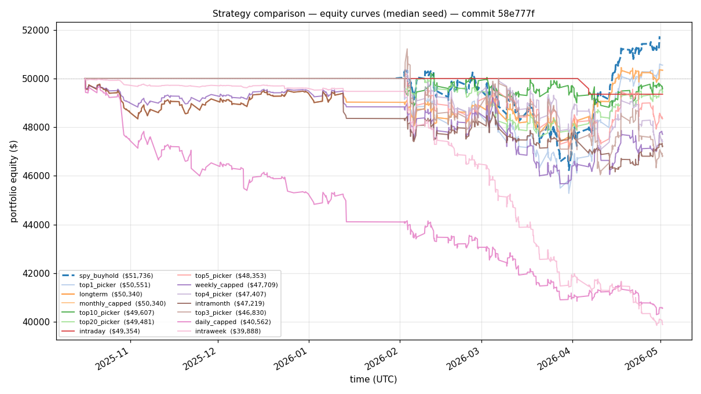

# iter 095 — 58e777f

**🔴 DISCARD** · exp95: add causal session structure features

_2026-05-04 00:13 UTC · 9959s wall_

## Result

| metric | value |
|---|---|
| Sharpe (median) | **-1.535** |
| Sharpe CI low (5%) | -3.735 |
| Sharpe CI high (95%) | +0.835 |
| Net PnL | **$-3961.44** (-7.923%) |
| Max drawdown | -14.77% |
| Trades | 3 |
| Fees | $3.00 |
| Seeds completed | 3 |

**Decision reason:** ci_low=-3.7350 ≤ prior best -0.4230

## Per-seed details

```
[evaluator] seed 0: sharpe=-1.049  dd=-6.98%  pnl=$-2,646.46  trades=3
[evaluator] seed 1: sharpe=-2.377  dd=-13.77%  pnl=$-5,005.93  trades=3
[evaluator] seed 2: sharpe=-1.535  dd=-14.77%  pnl=$-3,961.44  trades=3
```

## Equity curve (full eval window, ~73 days)



## Equity curve (first month)



## Strategy comparison (equity curves)

Overlays every profile (intraday/intraweek/intramonth/longterm + 
daily-capped/weekly-capped/monthly-capped trade-frequency variants 
+ topN pickers + SPY benchmark) on one chart, using the median-seed run.



## Trader profile comparison

Same trained model, different time-horizon strategies + SPY benchmark + passive top-N pickers.

| profile | sharpe | PnL ($) | PnL % | trades | DD % | horizon |
|---|---:|---:|---:|---:|---:|---:|
| **daily_capped** | -4.875 | $-9,450.11 | -18.90% | 969 | -19.72% | 1d |
| **intraday** | -12.965 | $-31,606.77 | -63.21% | 5210 | -63.21% | 2h |
| **intramonth** | -1.639 | $-2,550.51 | -5.10% | 109 | -7.68% | 30d |
| **intraweek** | -7.155 | $-11,145.23 | -22.29% | 1566 | -22.75% | 5d |
| **longterm** | +0.226 | $+340.00 | +0.68% | 10 | -6.01% | 30d |
| **monthly_capped** | +0.226 | $+340.00 | +0.68% | 10 | -6.01% | 30d |
| **spy_buyhold** | +1.005 | $+1,714.54 | +3.43% | 1 | -8.28% | - |
| **top10_picker** | -0.099 | $-235.56 | -0.47% | 9 | -7.84% | - |
| **top1_picker** | +0.000 | $+0.00 | +0.00% | 0 | +0.00% | - |
| **top20_picker** | +0.416 | $+717.15 | +1.43% | 19 | -7.99% | - |
| **top3_picker** | +0.617 | $+913.15 | +1.83% | 2 | -11.04% | - |
| **top4_picker** | -1.049 | $-2,646.46 | -5.29% | 3 | -8.32% | - |
| **top5_picker** | +0.425 | $+728.89 | +1.46% | 4 | -7.37% | - |
| **weekly_capped** | -1.929 | $-2,338.61 | -4.68% | 191 | -8.77% | 5d |

**Best active strategy: `top3_picker` (sharpe +0.617) — LOSES TO SPY**

## Out-of-symbol holdout eval

Tested on **JPM, WMT, V, DIS, JNJ** — large-caps the model NEVER saw during training.

| seed | sharpe | PnL | trades | DD% |
|---:|---:|---:|---:|---:|
| 0 | +0.000 | $+0.00 | 0 | +0.00% |
| 1 | -123.008 | $-31,193.00 | 9926 | -62.39% |
| 2 | +0.325 | $+444.43 | 5 | -7.84% |
| 3 | +0.327 | $+504.54 | 5 | -9.19% |
| 4 | +0.000 | $+0.00 | 0 | +0.00% |

**Median holdout sharpe: +0.000** (vs in-symbol -1.535)

## Per-symbol summary (aggregated across all seeds)

| symbol | total trades | buys | sells | avg hold (days) | held-to-end |
|---|---:|---:|---:|---:|---:|
| **COIN** | 3137 | 1569 | 1568 | 0.0 | 1 |
| **INTC** | 2585 | 1293 | 1292 | 0.0 | 1 |
| **AMD** | 1879 | 940 | 939 | 0.0 | 1 |
| **PLTR** | 1629 | 815 | 814 | 0.0 | 1 |
| **NIO** | 979 | 490 | 489 | 0.1 | 1 |
| **ACN** | 857 | 429 | 428 | 0.1 | 1 |
| **ORCL** | 735 | 368 | 367 | 0.1 | 1 |
| **EEM** | 725 | 363 | 362 | 0.1 | 1 |
| **NFLX** | 711 | 356 | 355 | 0.1 | 1 |
| **GOOGL** | 709 | 355 | 354 | 0.1 | 1 |
| **SPY** | 703 | 352 | 351 | 0.1 | 1 |
| **CRM** | 659 | 330 | 329 | 0.1 | 1 |
| **XLF** | 611 | 306 | 305 | 0.1 | 1 |
| **NVDA** | 597 | 299 | 298 | 0.1 | 1 |
| **F** | 595 | 298 | 297 | 0.1 | 1 |
| **MMC** | 574 | 288 | 286 | 0.0 | 2 |
| **IWM** | 571 | 286 | 285 | 0.1 | 1 |
| **AAPL** | 543 | 272 | 271 | 0.1 | 1 |
| **AMZN** | 543 | 272 | 271 | 0.1 | 1 |
| **MSFT** | 541 | 271 | 270 | 0.1 | 1 |
| **QQQ** | 511 | 256 | 255 | 0.1 | 1 |
| **T** | 463 | 232 | 231 | 0.1 | 1 |
| **PFE** | 449 | 225 | 224 | 0.1 | 1 |
| **CMCSA** | 447 | 224 | 223 | 0.1 | 1 |
| **ABBV** | 429 | 215 | 214 | 0.1 | 1 |
| **MRK** | 425 | 213 | 212 | 0.1 | 1 |
| **PEP** | 419 | 210 | 209 | 0.1 | 1 |
| **TMO** | 415 | 208 | 207 | 0.1 | 1 |
| **BA** | 413 | 207 | 206 | 0.1 | 1 |
| **AVGO** | 411 | 206 | 205 | 0.1 | 1 |
| **MA** | 405 | 203 | 202 | 0.1 | 1 |
| **ABT** | 403 | 202 | 201 | 0.1 | 1 |
| **UNH** | 401 | 201 | 200 | 0.1 | 1 |
| **MO** | 393 | 197 | 196 | 0.0 | 1 |
| **MCD** | 393 | 197 | 196 | 0.1 | 1 |
| **NEE** | 389 | 195 | 194 | 0.1 | 1 |
| **KO** | 385 | 193 | 192 | 0.2 | 1 |
| **META** | 383 | 192 | 191 | 0.2 | 1 |
| **CVX** | 377 | 189 | 188 | 0.2 | 1 |
| **XOM** | 373 | 187 | 186 | 0.2 | 1 |
| **BAC** | 371 | 186 | 185 | 0.2 | 1 |
| **PG** | 369 | 185 | 184 | 0.2 | 1 |
| **LLY** | 361 | 181 | 180 | 0.2 | 1 |
| **COST** | 361 | 181 | 180 | 0.1 | 1 |
| **SPGI** | 359 | 180 | 179 | 0.1 | 1 |
| **HD** | 357 | 179 | 178 | 0.2 | 1 |
| **TSLA** | 355 | 178 | 177 | 0.2 | 1 |
| **NKE** | 353 | 177 | 176 | 0.1 | 1 |
| **VZ** | 329 | 165 | 164 | 0.1 | 1 |
| **GE** | 327 | 164 | 163 | 0.0 | 1 |
| **INTU** | 321 | 161 | 160 | 0.0 | 1 |
| **ADBE** | 317 | 159 | 158 | 0.1 | 1 |
| **PM** | 315 | 158 | 157 | 0.1 | 1 |
| **LIN** | 311 | 156 | 155 | 0.1 | 1 |
| **MDLZ** | 305 | 153 | 152 | 0.0 | 1 |
| **USB** | 303 | 152 | 151 | 0.0 | 1 |
| **GILD** | 301 | 151 | 150 | 0.0 | 1 |
| **BMY** | 299 | 150 | 149 | 0.1 | 1 |
| **AMT** | 297 | 149 | 148 | 0.0 | 1 |
| **TXN** | 293 | 147 | 146 | 0.1 | 1 |
| **LOW** | 293 | 147 | 146 | 0.1 | 1 |
| **BLK** | 291 | 146 | 145 | 0.0 | 1 |
| **IBM** | 289 | 145 | 144 | 0.1 | 1 |
| **QCOM** | 287 | 144 | 143 | 0.1 | 1 |
| **SBUX** | 285 | 143 | 142 | 0.0 | 1 |
| **AXP** | 271 | 136 | 135 | 0.0 | 1 |
| **UPS** | 267 | 134 | 133 | 0.1 | 1 |
| **C** | 263 | 132 | 131 | 0.0 | 1 |
| **RTX** | 257 | 129 | 128 | 0.1 | 1 |
| **AMGN** | 255 | 128 | 127 | 0.1 | 1 |
| **DHR** | 253 | 127 | 126 | 0.1 | 1 |
| **BSX** | 247 | 124 | 123 | 0.0 | 1 |
| **SYK** | 239 | 120 | 119 | 0.0 | 1 |
| **CAT** | 237 | 119 | 118 | 0.1 | 1 |
| **SCHW** | 229 | 115 | 114 | 0.0 | 1 |
| **ETN** | 223 | 112 | 111 | 0.0 | 1 |
| **LMT** | 221 | 111 | 110 | 0.1 | 1 |
| **HON** | 213 | 107 | 106 | 0.2 | 1 |
| **ISRG** | 211 | 106 | 105 | 0.0 | 1 |
| **GS** | 211 | 106 | 105 | 0.1 | 1 |
| **CB** | 209 | 105 | 104 | 0.0 | 1 |
| **MS** | 207 | 104 | 103 | 0.0 | 1 |
| **COF** | 195 | 98 | 97 | 0.0 | 1 |
| **DUK** | 185 | 93 | 92 | 0.0 | 1 |
| **ADI** | 185 | 93 | 92 | 0.0 | 1 |
| **BKNG** | 175 | 88 | 87 | 0.0 | 1 |
| **CI** | 173 | 87 | 86 | 0.0 | 1 |
| **AMAT** | 169 | 85 | 84 | 0.1 | 1 |
| **ZTS** | 163 | 82 | 81 | 0.0 | 1 |
| **PLD** | 163 | 82 | 81 | 0.0 | 1 |
| **NOW** | 161 | 81 | 80 | 0.0 | 1 |
| **DE** | 157 | 79 | 78 | 0.0 | 1 |
| **VRTX** | 149 | 75 | 74 | 0.0 | 1 |
| **ELV** | 119 | 60 | 59 | 0.0 | 1 |
| **REGN** | 105 | 53 | 52 | 0.0 | 1 |

## Transactions

### Seed 0 — 320 trades · ending equity $49,133.21 (-866.79 = -1.73%)

| # | timestamp (UTC) | symbol | side |
|---:|---|---|---|
| 1 | 2026-02-02 17:33:00 | ORCL | BUY |
| 2 | 2026-02-02 17:34:00 | ORCL | SELL |
| 3 | 2026-02-02 18:14:00 | ORCL | BUY |
| 4 | 2026-02-02 18:16:00 | ORCL | SELL |
| 5 | 2026-02-02 18:22:00 | ORCL | BUY |
| 6 | 2026-02-02 18:23:00 | ORCL | SELL |
| 7 | 2026-02-03 17:25:00 | PLTR | BUY |
| 8 | 2026-02-03 17:26:00 | PLTR | SELL |
| 9 | 2026-02-03 17:55:00 | BKNG | BUY |
| 10 | 2026-02-03 17:56:00 | BKNG | SELL |
| 11 | 2026-02-03 18:04:00 | IBM | BUY |
| 12 | 2026-02-03 18:05:00 | IBM | SELL |
| 13 | 2026-02-03 18:46:00 | SPGI | BUY |
| 14 | 2026-02-03 18:47:00 | SPGI | SELL |
| 15 | 2026-02-03 19:00:00 | MRK | BUY |
| 16 | 2026-02-03 19:01:00 | MRK | SELL |
| 17 | 2026-02-04 17:03:00 | PLTR | BUY |
| 18 | 2026-02-04 17:09:00 | BSX | BUY |
| 19 | 2026-02-04 17:11:00 | BSX | SELL |
| 20 | 2026-02-04 17:20:00 | BSX | BUY |
| 21 | 2026-02-04 17:22:00 | BSX | SELL |
| 22 | 2026-02-04 17:23:00 | BSX | BUY |
| 23 | 2026-02-04 17:25:00 | BSX | SELL |
| 24 | 2026-02-04 17:30:00 | BSX | BUY |
| 25 | 2026-02-04 17:32:00 | BSX | SELL |
| 26 | 2026-02-04 17:34:00 | BSX | BUY |
| 27 | 2026-02-04 17:42:00 | BSX | SELL |
| 28 | 2026-02-04 17:44:00 | PLTR | SELL |
| 29 | 2026-02-04 17:44:00 | BSX | BUY |
| 30 | 2026-02-04 17:46:00 | AMD | BUY |
| 31 | 2026-02-04 17:46:00 | PLTR | BUY |
| 32 | 2026-02-04 17:50:00 | AMD | SELL |
| 33 | 2026-02-04 18:07:00 | BSX | SELL |
| 34 | 2026-02-04 18:09:00 | BSX | BUY |
| 35 | 2026-02-04 18:10:00 | AMD | BUY |
| 36 | 2026-02-04 18:12:00 | AMD | SELL |
| 37 | 2026-02-04 18:12:00 | BSX | SELL |
| 38 | 2026-02-04 18:13:00 | BSX | BUY |
| 39 | 2026-02-04 18:14:00 | BSX | SELL |
| 40 | 2026-02-04 18:15:00 | BSX | BUY |
| 41 | 2026-02-04 18:19:00 | BSX | SELL |
| 42 | 2026-02-04 18:33:00 | PLTR | SELL |
| 43 | 2026-02-04 18:37:00 | PLTR | BUY |
| 44 | 2026-02-04 18:40:00 | PLTR | SELL |
| 45 | 2026-02-04 18:46:00 | BSX | BUY |
| 46 | 2026-02-04 18:48:00 | BSX | SELL |
| 47 | 2026-02-04 18:51:00 | BSX | BUY |
| 48 | 2026-02-04 18:54:00 | PLTR | BUY |
| 49 | 2026-02-04 18:55:00 | BSX | SELL |
| 50 | 2026-02-04 18:56:00 | PLTR | SELL |
| 51 | 2026-02-04 18:59:00 | BSX | BUY |
| 52 | 2026-02-04 19:04:00 | BSX | SELL |
| 53 | 2026-02-04 19:05:00 | BSX | BUY |
| 54 | 2026-02-04 19:09:00 | BSX | SELL |
| 55 | 2026-02-04 19:10:00 | BSX | BUY |
| 56 | 2026-02-04 19:14:00 | PLTR | BUY |
| 57 | 2026-02-04 19:15:00 | PLTR | SELL |
| 58 | 2026-02-04 19:19:00 | BSX | SELL |
| 59 | 2026-02-04 19:19:00 | PLTR | BUY |
| 60 | 2026-02-04 19:20:00 | PLTR | SELL |
| 61 | 2026-02-04 19:22:00 | BSX | BUY |
| 62 | 2026-02-04 19:22:00 | PLTR | BUY |
| 63 | 2026-02-04 19:24:00 | PLTR | SELL |
| 64 | 2026-02-04 19:25:00 | BSX | SELL |
| 65 | 2026-02-04 19:39:00 | AMD | BUY |
| 66 | 2026-02-04 19:40:00 | AMD | SELL |
| 67 | 2026-02-05 17:15:00 | INTC | BUY |
| 68 | 2026-02-05 17:17:00 | INTC | SELL |
| 69 | 2026-02-05 17:22:00 | INTC | BUY |
| 70 | 2026-02-05 17:25:00 | INTC | SELL |
| 71 | 2026-02-05 17:27:00 | INTC | BUY |
| 72 | 2026-02-05 17:42:00 | INTC | SELL |
| 73 | 2026-02-05 17:44:00 | INTC | BUY |
| 74 | 2026-02-05 17:48:00 | INTC | SELL |
| 75 | 2026-02-05 17:53:00 | INTC | BUY |
| 76 | 2026-02-05 17:56:00 | INTC | SELL |
| 77 | 2026-02-05 18:01:00 | INTC | BUY |
| 78 | 2026-02-05 18:07:00 | INTC | SELL |
| 79 | 2026-02-05 18:08:00 | INTC | BUY |
| 80 | 2026-02-05 18:09:00 | GOOGL | BUY |
| 81 | 2026-02-05 18:13:00 | GOOGL | SELL |
| 82 | 2026-02-05 18:17:00 | GOOGL | BUY |
| 83 | 2026-02-05 18:19:00 | INTC | SELL |
| 84 | 2026-02-05 18:20:00 | LLY | BUY |
| 85 | 2026-02-05 18:21:00 | LLY | SELL |
| 86 | 2026-02-05 18:22:00 | INTC | BUY |
| 87 | 2026-02-05 18:23:00 | GOOGL | SELL |
| 88 | 2026-02-05 18:25:00 | INTC | SELL |
| 89 | 2026-02-06 17:43:00 | NIO | BUY |
| 90 | 2026-02-06 17:44:00 | NIO | SELL |
| 91 | 2026-02-09 19:20:00 | NIO | BUY |
| 92 | 2026-02-09 19:21:00 | NIO | SELL |
| 93 | 2026-02-09 19:24:00 | NIO | BUY |
| 94 | 2026-02-09 19:26:00 | NIO | SELL |
| 95 | 2026-02-10 17:37:00 | SPGI | BUY |
| 96 | 2026-02-10 17:38:00 | SPGI | SELL |
| 97 | 2026-02-10 17:40:00 | SPGI | BUY |
| 98 | 2026-02-10 17:41:00 | SPGI | SELL |
| 99 | 2026-02-10 17:43:00 | SPGI | BUY |
| 100 | 2026-02-10 17:48:00 | SPGI | SELL |
| 101 | 2026-02-10 17:49:00 | SPGI | BUY |
| 102 | 2026-02-10 17:50:00 | SPGI | SELL |
| 103 | 2026-02-10 17:54:00 | SPGI | BUY |
| 104 | 2026-02-10 17:55:00 | SPGI | SELL |
| 105 | 2026-02-10 17:58:00 | SPGI | BUY |
| 106 | 2026-02-10 17:59:00 | SPGI | SELL |
| 107 | 2026-02-10 18:02:00 | SPGI | BUY |
| 108 | 2026-02-10 18:04:00 | SPGI | SELL |
| 109 | 2026-02-10 18:13:00 | SPGI | BUY |
| 110 | 2026-02-10 18:13:00 | INTC | BUY |
| 111 | 2026-02-10 18:14:00 | INTC | SELL |
| 112 | 2026-02-10 18:15:00 | SPGI | SELL |
| 113 | 2026-02-10 18:18:00 | SPGI | BUY |
| 114 | 2026-02-10 18:19:00 | SPGI | SELL |
| 115 | 2026-02-10 18:19:00 | INTC | BUY |
| 116 | 2026-02-10 18:21:00 | INTC | SELL |
| 117 | 2026-02-10 18:25:00 | INTC | BUY |
| 118 | 2026-02-10 18:26:00 | INTC | SELL |
| 119 | 2026-02-10 18:26:00 | SPGI | BUY |
| 120 | 2026-02-10 18:27:00 | SPGI | SELL |
| 121 | 2026-02-10 18:32:00 | SPGI | BUY |
| 122 | 2026-02-10 18:35:00 | SPGI | SELL |
| 123 | 2026-02-10 18:37:00 | SPGI | BUY |
| 124 | 2026-02-10 18:38:00 | SPGI | SELL |
| 125 | 2026-02-12 17:19:00 | ZTS | BUY |
| 126 | 2026-02-12 17:36:00 | ZTS | SELL |
| 127 | 2026-02-12 17:38:00 | ZTS | BUY |
| 128 | 2026-02-12 17:44:00 | ZTS | SELL |
| 129 | 2026-02-12 17:47:00 | ZTS | BUY |
| 130 | 2026-02-12 17:50:00 | ZTS | SELL |
| 131 | 2026-02-12 17:55:00 | ZTS | BUY |
| 132 | 2026-02-12 18:01:00 | ZTS | SELL |
| 133 | 2026-02-12 18:02:00 | ZTS | BUY |
| 134 | 2026-02-12 18:10:00 | INTC | BUY |
| 135 | 2026-02-12 18:11:00 | INTC | SELL |
| 136 | 2026-02-12 18:27:00 | ZTS | SELL |
| 137 | 2026-02-12 18:28:00 | ZTS | BUY |
| 138 | 2026-02-12 18:36:00 | ZTS | SELL |
| 139 | 2026-02-12 18:37:00 | ZTS | BUY |
| 140 | 2026-02-12 18:38:00 | ZTS | SELL |
| 141 | 2026-02-12 18:41:00 | ZTS | BUY |
| 142 | 2026-02-12 18:42:00 | ZTS | SELL |
| 143 | 2026-02-17 17:39:00 | COIN | BUY |
| 144 | 2026-02-17 17:40:00 | COIN | SELL |
| 145 | 2026-02-17 17:42:00 | COIN | BUY |
| 146 | 2026-02-17 17:43:00 | COIN | SELL |
| 147 | 2026-02-17 17:46:00 | COIN | BUY |
| 148 | 2026-02-17 18:01:00 | COIN | SELL |
| 149 | 2026-02-19 17:43:00 | BKNG | BUY |
| 150 | 2026-02-19 17:45:00 | BKNG | SELL |
| 151 | 2026-02-19 18:10:00 | BKNG | BUY |
| 152 | 2026-02-19 18:11:00 | BKNG | SELL |
| 153 | 2026-02-19 18:15:00 | BKNG | BUY |
| 154 | 2026-02-19 18:17:00 | BKNG | SELL |
| 155 | 2026-02-23 17:34:00 | AXP | BUY |
| 156 | 2026-02-23 17:40:00 | AXP | SELL |
| 157 | 2026-02-23 17:40:00 | BKNG | BUY |
| 158 | 2026-02-23 17:43:00 | BKNG | SELL |
| 159 | 2026-02-23 17:44:00 | BKNG | BUY |
| 160 | 2026-02-23 17:45:00 | BKNG | SELL |
| 161 | 2026-02-23 17:47:00 | BKNG | BUY |
| 162 | 2026-02-23 17:48:00 | BKNG | SELL |
| 163 | 2026-02-23 17:56:00 | BKNG | BUY |
| 164 | 2026-02-23 17:58:00 | BKNG | SELL |
| 165 | 2026-02-23 18:05:00 | BKNG | BUY |
| 166 | 2026-02-23 18:07:00 | BKNG | SELL |
| 167 | 2026-02-23 18:15:00 | BKNG | BUY |
| 168 | 2026-02-23 18:18:00 | BKNG | SELL |
| 169 | 2026-02-23 18:21:00 | AXP | BUY |
| 170 | 2026-02-23 18:22:00 | AXP | SELL |
| 171 | 2026-02-23 18:27:00 | AXP | BUY |
| 172 | 2026-02-23 18:28:00 | AXP | SELL |
| 173 | 2026-02-23 18:42:00 | BKNG | BUY |
| 174 | 2026-02-23 18:45:00 | BKNG | SELL |
| 175 | 2026-03-02 18:26:00 | COIN | BUY |
| 176 | 2026-03-02 18:27:00 | COIN | SELL |
| 177 | 2026-03-10 12:02:00 | NIO | BUY |
| 178 | 2026-03-10 12:14:00 | NIO | SELL |
| 179 | 2026-03-10 16:20:00 | NIO | BUY |
| 180 | 2026-03-10 16:21:00 | NIO | SELL |
| 181 | 2026-03-10 16:22:00 | NIO | BUY |
| 182 | 2026-03-10 16:24:00 | NIO | SELL |
| 183 | 2026-03-10 16:58:00 | NOW | BUY |
| 184 | 2026-03-10 16:59:00 | NOW | SELL |
| 185 | 2026-03-10 17:01:00 | NOW | BUY |
| 186 | 2026-03-10 17:02:00 | NOW | SELL |
| 187 | 2026-03-10 17:02:00 | NIO | BUY |
| 188 | 2026-03-10 17:04:00 | NIO | SELL |
| 189 | 2026-03-10 17:06:00 | NOW | BUY |
| 190 | 2026-03-10 17:08:00 | NOW | SELL |
| 191 | 2026-03-11 17:21:00 | NIO | BUY |
| 192 | 2026-03-11 17:24:00 | NIO | SELL |
| 193 | 2026-03-11 17:30:00 | NIO | BUY |
| 194 | 2026-03-11 17:32:00 | NIO | SELL |
| 195 | 2026-03-11 17:44:00 | NIO | BUY |
| 196 | 2026-03-11 17:46:00 | NIO | SELL |
| 197 | 2026-03-11 17:47:00 | NIO | BUY |
| 198 | 2026-03-11 17:49:00 | NIO | SELL |
| 199 | 2026-03-19 17:10:00 | ACN | BUY |
| 200 | 2026-03-19 17:11:00 | ACN | SELL |
| … | _120 more truncated_ | | |

### Seed 1 — 22930 trades · ending equity $8,174.06 (-41,825.94 = -83.65%)

| # | timestamp (UTC) | symbol | side |
|---:|---|---|---|
| 1 | 2025-10-17 16:25:00 | MMC | BUY |
| 2 | 2025-10-17 16:30:00 | MMC | SELL |
| 3 | 2025-10-17 16:32:00 | MMC | BUY |
| 4 | 2025-10-17 16:33:00 | MMC | SELL |
| 5 | 2025-10-17 16:34:00 | MMC | BUY |
| 6 | 2025-10-17 16:41:00 | MMC | SELL |
| 7 | 2025-10-17 16:42:00 | MMC | BUY |
| 8 | 2025-10-17 17:29:00 | MMC | SELL |
| 9 | 2025-10-17 17:31:00 | MMC | BUY |
| 10 | 2025-10-17 18:53:00 | MMC | SELL |
| 11 | 2025-10-17 18:54:00 | MMC | BUY |
| 12 | 2025-10-17 18:57:00 | MMC | SELL |
| 13 | 2025-10-17 19:02:00 | MMC | BUY |
| 14 | 2025-10-17 19:05:00 | MMC | SELL |
| 15 | 2025-10-17 19:13:00 | MMC | BUY |
| 16 | 2025-10-17 19:15:00 | MMC | SELL |
| 17 | 2025-10-17 19:20:00 | MMC | BUY |
| 18 | 2025-10-17 19:25:00 | MMC | SELL |
| 19 | 2025-10-17 19:28:00 | MMC | BUY |
| 20 | 2025-10-17 19:35:00 | MMC | SELL |
| 21 | 2025-10-20 17:09:00 | MMC | BUY |
| 22 | 2025-10-20 17:16:00 | MMC | SELL |
| 23 | 2025-10-20 17:18:00 | MMC | BUY |
| 24 | 2025-10-20 17:40:00 | MMC | SELL |
| 25 | 2025-10-20 17:42:00 | MMC | BUY |
| 26 | 2025-10-20 17:45:00 | MMC | SELL |
| 27 | 2025-10-20 17:46:00 | MMC | BUY |
| 28 | 2025-10-20 17:54:00 | MMC | SELL |
| 29 | 2025-10-20 17:57:00 | MMC | BUY |
| 30 | 2025-10-20 19:31:00 | MMC | SELL |
| 31 | 2025-10-21 16:54:00 | MMC | BUY |
| 32 | 2025-10-21 16:58:00 | MMC | SELL |
| 33 | 2025-10-21 17:36:00 | MMC | BUY |
| 34 | 2025-10-21 17:39:00 | MMC | SELL |
| 35 | 2025-10-21 18:31:00 | MMC | BUY |
| 36 | 2025-10-21 18:33:00 | MMC | SELL |
| 37 | 2025-10-21 18:34:00 | MMC | BUY |
| 38 | 2025-10-21 18:52:00 | MMC | SELL |
| 39 | 2025-10-21 18:54:00 | MMC | BUY |
| 40 | 2025-10-21 19:42:00 | MMC | SELL |
| 41 | 2025-10-22 18:06:00 | MMC | BUY |
| 42 | 2025-10-22 18:13:00 | MMC | SELL |
| 43 | 2025-10-22 18:27:00 | MMC | BUY |
| 44 | 2025-10-22 18:31:00 | MMC | SELL |
| 45 | 2025-10-22 18:32:00 | MMC | BUY |
| 46 | 2025-10-22 18:35:00 | MMC | SELL |
| 47 | 2025-10-22 18:38:00 | MMC | BUY |
| 48 | 2025-10-22 19:35:00 | MMC | SELL |
| 49 | 2025-10-23 16:30:00 | MMC | BUY |
| 50 | 2025-10-23 16:31:00 | MMC | SELL |
| 51 | 2025-10-23 16:36:00 | MMC | BUY |
| 52 | 2025-10-23 16:40:00 | MMC | SELL |
| 53 | 2025-10-23 16:49:00 | MMC | BUY |
| 54 | 2025-10-23 16:50:00 | MMC | SELL |
| 55 | 2025-10-23 16:52:00 | MMC | BUY |
| 56 | 2025-10-23 17:07:00 | MMC | SELL |
| 57 | 2025-10-23 17:08:00 | MMC | BUY |
| 58 | 2025-10-23 19:30:00 | MMC | SELL |
| 59 | 2025-10-24 17:33:00 | MMC | BUY |
| 60 | 2025-10-24 17:38:00 | MMC | SELL |
| 61 | 2025-10-24 17:40:00 | MMC | BUY |
| 62 | 2025-10-24 17:48:00 | MMC | SELL |
| 63 | 2025-10-24 17:51:00 | MMC | BUY |
| 64 | 2025-10-24 18:11:00 | MMC | SELL |
| 65 | 2025-10-24 18:19:00 | MMC | BUY |
| 66 | 2025-10-24 19:38:00 | MMC | SELL |
| 67 | 2025-10-27 17:33:00 | MMC | BUY |
| 68 | 2025-10-27 17:41:00 | MMC | SELL |
| 69 | 2025-10-27 17:43:00 | MMC | BUY |
| 70 | 2025-10-27 19:32:00 | MMC | SELL |
| 71 | 2025-10-27 19:33:00 | MMC | BUY |
| 72 | 2025-10-27 19:38:00 | MMC | SELL |
| 73 | 2025-10-28 17:01:00 | MMC | BUY |
| 74 | 2025-10-28 17:05:00 | MMC | SELL |
| 75 | 2025-10-28 18:19:00 | MMC | BUY |
| 76 | 2025-10-28 19:34:00 | MMC | SELL |
| 77 | 2025-10-29 14:39:00 | MMC | BUY |
| 78 | 2025-10-29 14:47:00 | MMC | SELL |
| 79 | 2025-10-29 16:48:00 | MMC | BUY |
| 80 | 2025-10-29 16:49:00 | MMC | SELL |
| 81 | 2025-10-29 16:50:00 | MMC | BUY |
| 82 | 2025-10-29 19:14:00 | MMC | SELL |
| 83 | 2025-10-29 19:15:00 | MMC | BUY |
| 84 | 2025-10-29 19:20:00 | MMC | SELL |
| 85 | 2025-10-29 19:26:00 | MMC | BUY |
| 86 | 2025-10-29 19:28:00 | MMC | SELL |
| 87 | 2025-10-30 16:44:00 | MMC | BUY |
| 88 | 2025-10-30 16:57:00 | MMC | SELL |
| 89 | 2025-10-30 16:58:00 | MMC | BUY |
| 90 | 2025-10-30 19:12:00 | MMC | SELL |
| 91 | 2025-10-30 19:13:00 | MMC | BUY |
| 92 | 2025-10-30 19:17:00 | MMC | SELL |
| 93 | 2025-10-30 19:18:00 | MMC | BUY |
| 94 | 2025-10-30 19:21:00 | MMC | SELL |
| 95 | 2025-10-30 19:22:00 | MMC | BUY |
| 96 | 2025-10-30 19:23:00 | MMC | SELL |
| 97 | 2025-10-30 19:24:00 | MMC | BUY |
| 98 | 2025-10-30 19:25:00 | MMC | SELL |
| 99 | 2025-10-30 19:26:00 | MMC | BUY |
| 100 | 2025-10-30 19:27:00 | MMC | SELL |
| 101 | 2025-10-31 16:18:00 | MMC | BUY |
| 102 | 2025-10-31 16:20:00 | MMC | SELL |
| 103 | 2025-10-31 16:32:00 | MMC | BUY |
| 104 | 2025-10-31 16:33:00 | MMC | SELL |
| 105 | 2025-10-31 16:44:00 | MMC | BUY |
| 106 | 2025-10-31 19:26:00 | MMC | SELL |
| 107 | 2025-11-03 15:47:00 | MMC | BUY |
| 108 | 2025-11-03 15:51:00 | MMC | SELL |
| 109 | 2025-11-03 17:33:00 | MMC | BUY |
| 110 | 2025-11-03 17:34:00 | MMC | SELL |
| 111 | 2025-11-03 17:37:00 | MMC | BUY |
| 112 | 2025-11-03 17:43:00 | MMC | SELL |
| 113 | 2025-11-03 17:45:00 | MMC | BUY |
| 114 | 2025-11-03 17:47:00 | MMC | SELL |
| 115 | 2025-11-03 17:51:00 | MMC | BUY |
| 116 | 2025-11-03 17:53:00 | MMC | SELL |
| 117 | 2025-11-03 17:54:00 | MMC | BUY |
| 118 | 2025-11-03 17:55:00 | MMC | SELL |
| 119 | 2025-11-03 17:58:00 | MMC | BUY |
| 120 | 2025-11-03 18:00:00 | MMC | SELL |
| 121 | 2025-11-03 18:04:00 | MMC | BUY |
| 122 | 2025-11-03 18:09:00 | MMC | SELL |
| 123 | 2025-11-03 18:10:00 | MMC | BUY |
| 124 | 2025-11-03 18:18:00 | MMC | SELL |
| 125 | 2025-11-03 18:20:00 | MMC | BUY |
| 126 | 2025-11-03 18:23:00 | MMC | SELL |
| 127 | 2025-11-03 18:25:00 | MMC | BUY |
| 128 | 2025-11-03 20:26:00 | MMC | SELL |
| 129 | 2025-11-04 15:44:00 | MMC | BUY |
| 130 | 2025-11-04 15:48:00 | MMC | SELL |
| 131 | 2025-11-04 17:42:00 | MMC | BUY |
| 132 | 2025-11-04 17:46:00 | MMC | SELL |
| 133 | 2025-11-04 17:48:00 | MMC | BUY |
| 134 | 2025-11-04 17:53:00 | MMC | SELL |
| 135 | 2025-11-04 17:56:00 | MMC | BUY |
| 136 | 2025-11-04 20:33:00 | MMC | SELL |
| 137 | 2025-11-05 18:07:00 | MMC | BUY |
| 138 | 2025-11-05 18:12:00 | MMC | SELL |
| 139 | 2025-11-05 18:15:00 | MMC | BUY |
| 140 | 2025-11-05 20:37:00 | MMC | SELL |
| 141 | 2025-11-06 18:44:00 | MMC | BUY |
| 142 | 2025-11-06 18:45:00 | MMC | SELL |
| 143 | 2025-11-06 19:00:00 | MMC | BUY |
| 144 | 2025-11-06 20:44:00 | MMC | SELL |
| 145 | 2025-11-06 20:46:00 | MMC | BUY |
| 146 | 2025-11-06 20:48:00 | MMC | SELL |
| 147 | 2025-11-07 17:50:00 | MMC | BUY |
| 148 | 2025-11-07 17:51:00 | MMC | SELL |
| 149 | 2025-11-07 17:54:00 | MMC | BUY |
| 150 | 2025-11-07 17:56:00 | MMC | SELL |
| 151 | 2025-11-07 17:57:00 | MMC | BUY |
| 152 | 2025-11-07 20:25:00 | MMC | SELL |
| 153 | 2025-11-07 20:31:00 | MMC | BUY |
| 154 | 2025-11-07 20:32:00 | MMC | SELL |
| 155 | 2025-11-10 17:54:00 | MMC | BUY |
| 156 | 2025-11-10 18:06:00 | MMC | SELL |
| 157 | 2025-11-10 18:19:00 | MMC | BUY |
| 158 | 2025-11-10 18:23:00 | MMC | SELL |
| 159 | 2025-11-10 18:26:00 | MMC | BUY |
| 160 | 2025-11-10 18:38:00 | MMC | SELL |
| 161 | 2025-11-10 18:54:00 | MMC | BUY |
| 162 | 2025-11-10 18:58:00 | MMC | SELL |
| 163 | 2025-11-10 19:03:00 | MMC | BUY |
| 164 | 2025-11-10 19:11:00 | MMC | SELL |
| 165 | 2025-11-10 19:18:00 | MMC | BUY |
| 166 | 2025-11-10 19:29:00 | MMC | SELL |
| 167 | 2025-11-10 19:39:00 | MMC | BUY |
| 168 | 2025-11-10 19:45:00 | MMC | SELL |
| 169 | 2025-11-10 19:52:00 | MMC | BUY |
| 170 | 2025-11-10 20:53:00 | MMC | SELL |
| 171 | 2025-11-11 17:53:00 | MMC | BUY |
| 172 | 2025-11-11 17:54:00 | MMC | SELL |
| 173 | 2025-11-11 17:56:00 | MMC | BUY |
| 174 | 2025-11-11 18:00:00 | MMC | SELL |
| 175 | 2025-11-11 18:01:00 | MMC | BUY |
| 176 | 2025-11-11 18:21:00 | MMC | SELL |
| 177 | 2025-11-11 18:23:00 | MMC | BUY |
| 178 | 2025-11-11 20:39:00 | MMC | SELL |
| 179 | 2025-11-12 18:23:00 | MMC | BUY |
| 180 | 2025-11-12 18:31:00 | MMC | SELL |
| 181 | 2025-11-12 18:36:00 | MMC | BUY |
| 182 | 2025-11-12 18:37:00 | MMC | SELL |
| 183 | 2025-11-12 18:38:00 | MMC | BUY |
| 184 | 2025-11-12 18:46:00 | MMC | SELL |
| 185 | 2025-11-12 18:50:00 | MMC | BUY |
| 186 | 2025-11-12 20:43:00 | MMC | SELL |
| 187 | 2025-11-13 18:14:00 | MMC | BUY |
| 188 | 2025-11-13 18:18:00 | MMC | SELL |
| 189 | 2025-11-13 18:25:00 | MMC | BUY |
| 190 | 2025-11-13 18:29:00 | MMC | SELL |
| 191 | 2025-11-13 19:16:00 | MMC | BUY |
| 192 | 2025-11-13 20:34:00 | MMC | SELL |
| 193 | 2025-11-14 18:17:00 | MMC | BUY |
| 194 | 2025-11-14 18:18:00 | MMC | SELL |
| 195 | 2025-11-14 18:39:00 | MMC | BUY |
| 196 | 2025-11-14 18:41:00 | MMC | SELL |
| 197 | 2025-11-14 18:58:00 | MMC | BUY |
| 198 | 2025-11-14 19:01:00 | MMC | SELL |
| 199 | 2025-11-14 19:35:00 | MMC | BUY |
| 200 | 2025-11-14 19:36:00 | MMC | SELL |
| … | _22730 more truncated_ | | |

### Seed 2 — 18511 trades · ending equity $27,720.53 (-22,279.47 = -44.56%)

| # | timestamp (UTC) | symbol | side |
|---:|---|---|---|
| 1 | 2025-10-16 15:53:00 | MMC | BUY |
| 2 | 2026-02-02 15:15:00 | IWM | BUY |
| 3 | 2026-02-02 15:18:00 | SPY | BUY |
| 4 | 2026-02-02 15:24:00 | QQQ | BUY |
| 5 | 2026-02-02 15:27:00 | NFLX | BUY |
| 6 | 2026-02-02 15:31:00 | PLTR | BUY |
| 7 | 2026-02-02 15:32:00 | COIN | BUY |
| 8 | 2026-02-02 15:35:00 | COIN | SELL |
| 9 | 2026-02-02 15:35:00 | XLF | BUY |
| 10 | 2026-02-02 15:35:00 | COIN | BUY |
| 11 | 2026-02-02 15:36:00 | COIN | SELL |
| 12 | 2026-02-02 15:36:00 | COIN | BUY |
| 13 | 2026-02-02 15:37:00 | COIN | SELL |
| 14 | 2026-02-02 15:37:00 | GOOGL | BUY |
| 15 | 2026-02-02 15:38:00 | PLTR | SELL |
| 16 | 2026-02-02 15:38:00 | BAC | BUY |
| 17 | 2026-02-02 15:38:00 | COIN | BUY |
| 18 | 2026-02-02 15:38:00 | PLTR | BUY |
| 19 | 2026-02-02 15:39:00 | COIN | SELL |
| 20 | 2026-02-02 15:39:00 | COIN | BUY |
| 21 | 2026-02-02 15:40:00 | COIN | SELL |
| 22 | 2026-02-02 15:40:00 | TSLA | BUY |
| 23 | 2026-02-02 15:41:00 | PLTR | SELL |
| 24 | 2026-02-02 15:41:00 | F | BUY |
| 25 | 2026-02-02 15:42:00 | TSLA | SELL |
| 26 | 2026-02-02 15:42:00 | TSLA | BUY |
| 27 | 2026-02-02 15:43:00 | TSLA | SELL |
| 28 | 2026-02-02 15:43:00 | TSLA | BUY |
| 29 | 2026-02-02 15:44:00 | TSLA | SELL |
| 30 | 2026-02-02 15:44:00 | TSLA | BUY |
| 31 | 2026-02-02 15:46:00 | TSLA | SELL |
| 32 | 2026-02-02 15:46:00 | TSLA | BUY |
| 33 | 2026-02-02 15:47:00 | TSLA | SELL |
| 34 | 2026-02-02 15:47:00 | TSLA | BUY |
| 35 | 2026-02-02 15:48:00 | TSLA | SELL |
| 36 | 2026-02-02 15:48:00 | TSLA | BUY |
| 37 | 2026-02-02 15:49:00 | TSLA | SELL |
| 38 | 2026-02-02 15:49:00 | TSLA | BUY |
| 39 | 2026-02-02 15:50:00 | TSLA | SELL |
| 40 | 2026-02-02 15:50:00 | TSLA | BUY |
| 41 | 2026-02-02 15:51:00 | TSLA | SELL |
| 42 | 2026-02-02 15:51:00 | TSLA | BUY |
| 43 | 2026-02-02 15:52:00 | TSLA | SELL |
| 44 | 2026-02-02 15:52:00 | TSLA | BUY |
| 45 | 2026-02-02 15:54:00 | TSLA | SELL |
| 46 | 2026-02-02 15:54:00 | NVDA | BUY |
| 47 | 2026-02-02 16:13:00 | BAC | SELL |
| 48 | 2026-02-02 16:13:00 | EEM | BUY |
| 49 | 2026-02-02 16:13:00 | MSFT | BUY |
| 50 | 2026-02-02 16:25:00 | MSFT | SELL |
| 51 | 2026-02-02 16:25:00 | AAPL | BUY |
| 52 | 2026-02-02 16:26:00 | AAPL | SELL |
| 53 | 2026-02-02 16:26:00 | AAPL | BUY |
| 54 | 2026-02-02 16:27:00 | AAPL | SELL |
| 55 | 2026-02-02 16:27:00 | AAPL | BUY |
| 56 | 2026-02-02 16:28:00 | AAPL | SELL |
| 57 | 2026-02-02 16:28:00 | AAPL | BUY |
| 58 | 2026-02-02 16:29:00 | AAPL | SELL |
| 59 | 2026-02-02 16:29:00 | AAPL | BUY |
| 60 | 2026-02-02 16:30:00 | AAPL | SELL |
| 61 | 2026-02-02 16:30:00 | AAPL | BUY |
| 62 | 2026-02-02 16:31:00 | AAPL | SELL |
| 63 | 2026-02-02 16:31:00 | AAPL | BUY |
| 64 | 2026-02-02 16:32:00 | AAPL | SELL |
| 65 | 2026-02-02 16:32:00 | AAPL | BUY |
| 66 | 2026-02-02 16:33:00 | AAPL | SELL |
| 67 | 2026-02-02 16:33:00 | AAPL | BUY |
| 68 | 2026-02-02 16:34:00 | AAPL | SELL |
| 69 | 2026-02-02 16:34:00 | AAPL | BUY |
| 70 | 2026-02-02 16:35:00 | AAPL | SELL |
| 71 | 2026-02-02 16:35:00 | AAPL | BUY |
| 72 | 2026-02-02 16:36:00 | AAPL | SELL |
| 73 | 2026-02-02 16:36:00 | AAPL | BUY |
| 74 | 2026-02-02 16:37:00 | AAPL | SELL |
| 75 | 2026-02-02 16:37:00 | AAPL | BUY |
| 76 | 2026-02-02 16:38:00 | AAPL | SELL |
| 77 | 2026-02-02 16:38:00 | AAPL | BUY |
| 78 | 2026-02-02 16:39:00 | AAPL | SELL |
| 79 | 2026-02-02 16:39:00 | AAPL | BUY |
| 80 | 2026-02-02 16:40:00 | AAPL | SELL |
| 81 | 2026-02-02 16:40:00 | AAPL | BUY |
| 82 | 2026-02-02 16:41:00 | AAPL | SELL |
| 83 | 2026-02-02 16:41:00 | AAPL | BUY |
| 84 | 2026-02-02 16:42:00 | AAPL | SELL |
| 85 | 2026-02-02 16:42:00 | AAPL | BUY |
| 86 | 2026-02-02 16:43:00 | AAPL | SELL |
| 87 | 2026-02-02 16:43:00 | AAPL | BUY |
| 88 | 2026-02-02 16:44:00 | AAPL | SELL |
| 89 | 2026-02-02 16:44:00 | AAPL | BUY |
| 90 | 2026-02-02 16:45:00 | AAPL | SELL |
| 91 | 2026-02-02 16:45:00 | AAPL | BUY |
| 92 | 2026-02-02 16:46:00 | AAPL | SELL |
| 93 | 2026-02-02 16:46:00 | AAPL | BUY |
| 94 | 2026-02-02 16:47:00 | AAPL | SELL |
| 95 | 2026-02-02 16:47:00 | AAPL | BUY |
| 96 | 2026-02-02 16:48:00 | AAPL | SELL |
| 97 | 2026-02-02 16:48:00 | AAPL | BUY |
| 98 | 2026-02-02 16:49:00 | AAPL | SELL |
| 99 | 2026-02-02 16:49:00 | AAPL | BUY |
| 100 | 2026-02-02 16:50:00 | AAPL | SELL |
| 101 | 2026-02-02 16:50:00 | AAPL | BUY |
| 102 | 2026-02-02 16:51:00 | AAPL | SELL |
| 103 | 2026-02-02 16:51:00 | AAPL | BUY |
| 104 | 2026-02-02 16:52:00 | AAPL | SELL |
| 105 | 2026-02-02 16:52:00 | AAPL | BUY |
| 106 | 2026-02-02 16:53:00 | AAPL | SELL |
| 107 | 2026-02-02 16:53:00 | AAPL | BUY |
| 108 | 2026-02-02 16:54:00 | AAPL | SELL |
| 109 | 2026-02-02 16:54:00 | AAPL | BUY |
| 110 | 2026-02-02 16:55:00 | AAPL | SELL |
| 111 | 2026-02-02 16:55:00 | AAPL | BUY |
| 112 | 2026-02-02 16:56:00 | AAPL | SELL |
| 113 | 2026-02-02 16:56:00 | AAPL | BUY |
| 114 | 2026-02-02 16:57:00 | GOOGL | SELL |
| 115 | 2026-02-02 16:57:00 | MSFT | BUY |
| 116 | 2026-02-02 16:58:00 | XLF | SELL |
| 117 | 2026-02-02 16:58:00 | XLF | BUY |
| 118 | 2026-02-02 16:58:00 | AMZN | BUY |
| 119 | 2026-02-02 16:59:00 | AAPL | SELL |
| 120 | 2026-02-02 16:59:00 | AAPL | BUY |
| 121 | 2026-02-02 17:00:00 | AAPL | SELL |
| 122 | 2026-02-02 17:00:00 | AAPL | BUY |
| 123 | 2026-02-02 17:01:00 | AAPL | SELL |
| 124 | 2026-02-02 17:01:00 | AAPL | BUY |
| 125 | 2026-02-02 17:02:00 | AAPL | SELL |
| 126 | 2026-02-02 17:02:00 | AAPL | BUY |
| 127 | 2026-02-02 17:03:00 | MSFT | SELL |
| 128 | 2026-02-02 17:03:00 | MSFT | BUY |
| 129 | 2026-02-02 17:04:00 | MSFT | SELL |
| 130 | 2026-02-02 17:04:00 | MSFT | BUY |
| 131 | 2026-02-02 17:05:00 | MSFT | SELL |
| 132 | 2026-02-02 17:05:00 | MSFT | BUY |
| 133 | 2026-02-02 17:06:00 | AMZN | SELL |
| 134 | 2026-02-02 17:06:00 | AMZN | BUY |
| 135 | 2026-02-02 17:07:00 | AMZN | SELL |
| 136 | 2026-02-02 17:07:00 | AMZN | BUY |
| 137 | 2026-02-02 17:08:00 | NFLX | SELL |
| 138 | 2026-02-02 17:08:00 | GOOGL | BUY |
| 139 | 2026-02-02 17:08:00 | META | BUY |
| 140 | 2026-02-02 17:08:00 | TSLA | BUY |
| 141 | 2026-02-02 17:09:00 | TSLA | SELL |
| 142 | 2026-02-02 17:09:00 | TSLA | BUY |
| 143 | 2026-02-02 17:10:00 | TSLA | SELL |
| 144 | 2026-02-02 17:10:00 | TSLA | BUY |
| 145 | 2026-02-02 17:11:00 | TSLA | SELL |
| 146 | 2026-02-02 17:11:00 | TSLA | BUY |
| 147 | 2026-02-02 17:12:00 | TSLA | SELL |
| 148 | 2026-02-02 17:12:00 | TSLA | BUY |
| 149 | 2026-02-02 17:13:00 | TSLA | SELL |
| 150 | 2026-02-02 17:13:00 | TSLA | BUY |
| 151 | 2026-02-02 17:14:00 | TSLA | SELL |
| 152 | 2026-02-02 17:14:00 | TSLA | BUY |
| 153 | 2026-02-02 17:15:00 | TSLA | SELL |
| 154 | 2026-02-02 17:15:00 | TSLA | BUY |
| 155 | 2026-02-02 17:16:00 | TSLA | SELL |
| 156 | 2026-02-02 17:16:00 | TSLA | BUY |
| 157 | 2026-02-02 17:17:00 | TSLA | SELL |
| 158 | 2026-02-02 17:17:00 | TSLA | BUY |
| 159 | 2026-02-02 17:18:00 | TSLA | SELL |
| 160 | 2026-02-02 17:18:00 | TSLA | BUY |
| 161 | 2026-02-02 17:19:00 | TSLA | SELL |
| 162 | 2026-02-02 17:19:00 | TSLA | BUY |
| 163 | 2026-02-02 17:20:00 | F | SELL |
| 164 | 2026-02-02 17:20:00 | AMD | BUY |
| 165 | 2026-02-02 17:21:00 | AMD | SELL |
| 166 | 2026-02-02 17:21:00 | AMD | BUY |
| 167 | 2026-02-02 17:22:00 | AMD | SELL |
| 168 | 2026-02-02 17:22:00 | AMD | BUY |
| 169 | 2026-02-02 17:23:00 | AMD | SELL |
| 170 | 2026-02-02 17:23:00 | AMD | BUY |
| 171 | 2026-02-02 17:24:00 | AMD | SELL |
| 172 | 2026-02-02 17:24:00 | AMD | BUY |
| 173 | 2026-02-02 17:25:00 | TSLA | SELL |
| 174 | 2026-02-02 17:25:00 | TSLA | BUY |
| 175 | 2026-02-02 17:26:00 | AMD | SELL |
| 176 | 2026-02-02 17:26:00 | AMD | BUY |
| 177 | 2026-02-02 17:27:00 | AMD | SELL |
| 178 | 2026-02-02 17:27:00 | AMD | BUY |
| 179 | 2026-02-02 17:28:00 | AMD | SELL |
| 180 | 2026-02-02 17:28:00 | AMD | BUY |
| 181 | 2026-02-02 17:29:00 | AMD | SELL |
| 182 | 2026-02-02 17:29:00 | AMD | BUY |
| 183 | 2026-02-02 17:30:00 | AMD | SELL |
| 184 | 2026-02-02 17:30:00 | AMD | BUY |
| 185 | 2026-02-02 17:31:00 | AMD | SELL |
| 186 | 2026-02-02 17:31:00 | AMD | BUY |
| 187 | 2026-02-02 17:32:00 | AMD | SELL |
| 188 | 2026-02-02 17:32:00 | AMD | BUY |
| 189 | 2026-02-02 17:33:00 | AMD | SELL |
| 190 | 2026-02-02 17:33:00 | AMD | BUY |
| 191 | 2026-02-02 17:34:00 | AMD | SELL |
| 192 | 2026-02-02 17:34:00 | AMD | BUY |
| 193 | 2026-02-02 17:35:00 | AMD | SELL |
| 194 | 2026-02-02 17:35:00 | AMD | BUY |
| 195 | 2026-02-02 17:36:00 | AMD | SELL |
| 196 | 2026-02-02 17:36:00 | AMD | BUY |
| 197 | 2026-02-02 17:37:00 | AMD | SELL |
| 198 | 2026-02-02 17:37:00 | AMD | BUY |
| 199 | 2026-02-02 17:38:00 | AMD | SELL |
| 200 | 2026-02-02 17:38:00 | AMD | BUY |
| … | _18311 more truncated_ | | |

### Seed 3 — 565 trades · ending equity $47,414.99 (-2,585.01 = -5.17%)

| # | timestamp (UTC) | symbol | side |
|---:|---|---|---|
| 1 | 2025-10-16 15:53:00 | MMC | BUY |
| 2 | 2026-02-02 15:15:00 | IWM | BUY |
| 3 | 2026-02-02 15:18:00 | SPY | BUY |
| 4 | 2026-02-02 15:24:00 | QQQ | BUY |
| 5 | 2026-02-02 15:27:00 | NFLX | BUY |
| 6 | 2026-02-02 15:31:00 | SPY | SELL |
| 7 | 2026-02-02 15:31:00 | SPY | BUY |
| 8 | 2026-02-02 15:31:00 | PLTR | BUY |
| 9 | 2026-02-02 15:32:00 | SPY | SELL |
| 10 | 2026-02-02 15:32:00 | SPY | BUY |
| 11 | 2026-02-02 15:32:00 | COIN | BUY |
| 12 | 2026-02-02 15:35:00 | SPY | SELL |
| 13 | 2026-02-02 15:35:00 | SPY | BUY |
| 14 | 2026-02-02 15:35:00 | XLF | BUY |
| 15 | 2026-02-02 15:35:00 | NIO | BUY |
| 16 | 2026-02-02 15:37:00 | SPY | SELL |
| 17 | 2026-02-02 15:37:00 | SPY | BUY |
| 18 | 2026-02-02 15:37:00 | GOOGL | BUY |
| 19 | 2026-02-02 15:37:00 | BAC | BUY |
| 20 | 2026-02-02 15:40:00 | SPY | SELL |
| 21 | 2026-02-02 15:40:00 | SPY | BUY |
| 22 | 2026-02-02 15:40:00 | TSLA | BUY |
| 23 | 2026-02-02 15:40:00 | F | BUY |
| 24 | 2026-02-02 15:54:00 | NVDA | BUY |
| 25 | 2026-02-02 16:00:00 | F | SELL |
| 26 | 2026-02-02 16:00:00 | EEM | BUY |
| 27 | 2026-02-02 16:05:00 | XLF | SELL |
| 28 | 2026-02-02 16:05:00 | XLF | BUY |
| 29 | 2026-02-02 16:05:00 | MSFT | BUY |
| 30 | 2026-02-02 16:05:00 | AMZN | BUY |
| 31 | 2026-02-02 16:06:00 | XLF | SELL |
| 32 | 2026-02-02 16:06:00 | XLF | BUY |
| 33 | 2026-02-02 16:06:00 | META | BUY |
| 34 | 2026-02-02 16:10:00 | XLF | SELL |
| 35 | 2026-02-02 16:10:00 | XLF | BUY |
| 36 | 2026-02-02 16:10:00 | INTC | BUY |
| 37 | 2026-02-02 16:16:00 | XLF | SELL |
| 38 | 2026-02-02 16:16:00 | XLF | BUY |
| 39 | 2026-02-02 16:16:00 | AAPL | BUY |
| 40 | 2026-02-02 16:19:00 | BAC | SELL |
| 41 | 2026-02-02 16:19:00 | AMD | BUY |
| 42 | 2026-02-02 16:19:00 | BAC | BUY |
| 43 | 2026-02-02 16:20:00 | EEM | SELL |
| 44 | 2026-02-02 16:20:00 | EEM | BUY |
| 45 | 2026-02-02 16:21:00 | XLF | SELL |
| 46 | 2026-02-02 16:21:00 | XLF | BUY |
| 47 | 2026-02-02 16:22:00 | BAC | SELL |
| 48 | 2026-02-02 16:22:00 | BAC | BUY |
| 49 | 2026-02-02 16:23:00 | XLF | SELL |
| 50 | 2026-02-02 16:23:00 | XLF | BUY |
| 51 | 2026-02-02 16:24:00 | BAC | SELL |
| 52 | 2026-02-02 16:24:00 | BAC | BUY |
| 53 | 2026-02-02 16:25:00 | XLF | SELL |
| 54 | 2026-02-02 16:25:00 | XLF | BUY |
| 55 | 2026-02-02 16:26:00 | XLF | SELL |
| 56 | 2026-02-02 16:26:00 | XLF | BUY |
| 57 | 2026-02-02 16:27:00 | XLF | SELL |
| 58 | 2026-02-02 16:27:00 | XLF | BUY |
| 59 | 2026-02-02 16:28:00 | BAC | SELL |
| 60 | 2026-02-02 16:28:00 | BAC | BUY |
| 61 | 2026-02-02 16:29:00 | EEM | SELL |
| 62 | 2026-02-02 16:29:00 | EEM | BUY |
| 63 | 2026-02-02 16:34:00 | PLTR | SELL |
| 64 | 2026-02-02 16:34:00 | F | BUY |
| 65 | 2026-02-02 16:34:00 | PLTR | BUY |
| 66 | 2026-02-02 16:34:00 | ORCL | BUY |
| 67 | 2026-02-02 16:34:00 | PFE | BUY |
| 68 | 2026-02-02 16:36:00 | EEM | SELL |
| 69 | 2026-02-02 16:36:00 | EEM | BUY |
| 70 | 2026-02-02 16:37:00 | NVDA | SELL |
| 71 | 2026-02-02 16:37:00 | NVDA | BUY |
| 72 | 2026-02-02 16:38:00 | XLF | SELL |
| 73 | 2026-02-02 16:38:00 | XLF | BUY |
| 74 | 2026-02-02 16:39:00 | F | SELL |
| 75 | 2026-02-02 16:39:00 | F | BUY |
| 76 | 2026-02-02 16:39:00 | XOM | BUY |
| 77 | 2026-02-02 16:39:00 | CVX | BUY |
| 78 | 2026-02-02 16:40:00 | XLF | SELL |
| 79 | 2026-02-02 16:40:00 | XLF | BUY |
| 80 | 2026-02-02 16:41:00 | F | SELL |
| 81 | 2026-02-02 16:41:00 | F | BUY |
| 82 | 2026-02-02 16:41:00 | KO | BUY |
| 83 | 2026-02-02 16:42:00 | XLF | SELL |
| 84 | 2026-02-02 16:42:00 | XLF | BUY |
| 85 | 2026-02-02 16:43:00 | MSFT | SELL |
| 86 | 2026-02-02 16:43:00 | MSFT | BUY |
| 87 | 2026-02-02 16:43:00 | HD | BUY |
| 88 | 2026-02-02 16:44:00 | PLTR | SELL |
| 89 | 2026-02-02 16:44:00 | PLTR | BUY |
| 90 | 2026-02-02 16:44:00 | UNH | BUY |
| 91 | 2026-02-02 16:45:00 | MSFT | SELL |
| 92 | 2026-02-02 16:45:00 | MSFT | BUY |
| 93 | 2026-02-02 16:46:00 | PLTR | SELL |
| 94 | 2026-02-02 16:46:00 | PLTR | BUY |
| 95 | 2026-02-02 16:46:00 | MA | BUY |
| 96 | 2026-02-02 16:47:00 | MSFT | SELL |
| 97 | 2026-02-02 16:47:00 | MSFT | BUY |
| 98 | 2026-02-02 16:48:00 | PLTR | SELL |
| 99 | 2026-02-02 16:48:00 | PLTR | BUY |
| 100 | 2026-02-02 16:48:00 | PEP | BUY |
| 101 | 2026-02-02 16:49:00 | XLF | SELL |
| 102 | 2026-02-02 16:49:00 | XLF | BUY |
| 103 | 2026-02-02 16:50:00 | XLF | SELL |
| 104 | 2026-02-02 16:50:00 | XLF | BUY |
| 105 | 2026-02-02 16:51:00 | EEM | SELL |
| 106 | 2026-02-02 16:51:00 | EEM | BUY |
| 107 | 2026-02-02 16:52:00 | EEM | SELL |
| 108 | 2026-02-02 16:52:00 | EEM | BUY |
| 109 | 2026-02-02 16:53:00 | UNH | SELL |
| 110 | 2026-02-02 16:53:00 | UNH | BUY |
| 111 | 2026-02-02 16:54:00 | CVX | SELL |
| 112 | 2026-02-02 16:54:00 | PG | BUY |
| 113 | 2026-02-02 16:55:00 | PG | SELL |
| 114 | 2026-02-02 16:55:00 | PG | BUY |
| 115 | 2026-02-02 16:56:00 | XLF | SELL |
| 116 | 2026-02-02 16:56:00 | XLF | BUY |
| 117 | 2026-02-02 16:57:00 | F | SELL |
| 118 | 2026-02-02 16:57:00 | F | BUY |
| 119 | 2026-02-02 16:57:00 | CVX | BUY |
| 120 | 2026-02-02 16:58:00 | EEM | SELL |
| 121 | 2026-02-02 16:58:00 | EEM | BUY |
| 122 | 2026-02-02 16:59:00 | MSFT | SELL |
| 123 | 2026-02-02 16:59:00 | MSFT | BUY |
| 124 | 2026-02-02 17:00:00 | BAC | SELL |
| 125 | 2026-02-02 17:00:00 | BAC | BUY |
| 126 | 2026-02-02 17:01:00 | GOOGL | SELL |
| 127 | 2026-02-02 17:01:00 | GOOGL | BUY |
| 128 | 2026-02-02 17:01:00 | LLY | BUY |
| 129 | 2026-02-02 17:01:00 | AVGO | BUY |
| 130 | 2026-02-02 17:02:00 | F | SELL |
| 131 | 2026-02-02 17:02:00 | F | BUY |
| 132 | 2026-02-02 17:03:00 | SPY | SELL |
| 133 | 2026-02-02 17:03:00 | SPY | BUY |
| 134 | 2026-02-02 17:03:00 | MRK | BUY |
| 135 | 2026-02-02 17:03:00 | ABT | BUY |
| 136 | 2026-02-02 17:04:00 | QQQ | SELL |
| 137 | 2026-02-02 17:04:00 | QQQ | BUY |
| 138 | 2026-02-02 17:04:00 | NKE | BUY |
| 139 | 2026-02-02 17:04:00 | BA | BUY |
| 140 | 2026-02-02 17:04:00 | CRM | BUY |
| 141 | 2026-02-02 17:04:00 | NEE | BUY |
| 142 | 2026-02-02 17:05:00 | SPY | SELL |
| 143 | 2026-02-02 17:05:00 | SPY | BUY |
| 144 | 2026-02-02 17:05:00 | VZ | BUY |
| 145 | 2026-02-02 17:06:00 | QQQ | SELL |
| 146 | 2026-02-02 17:06:00 | QQQ | BUY |
| 147 | 2026-02-02 17:06:00 | ADBE | BUY |
| 148 | 2026-02-02 17:06:00 | CMCSA | BUY |
| 149 | 2026-02-02 17:06:00 | BMY | BUY |
| 150 | 2026-02-02 17:07:00 | SPY | SELL |
| 151 | 2026-02-02 17:07:00 | SPY | BUY |
| 152 | 2026-02-02 17:07:00 | TXN | BUY |
| 153 | 2026-02-02 17:08:00 | LLY | SELL |
| 154 | 2026-02-02 17:08:00 | LLY | BUY |
| 155 | 2026-02-02 17:09:00 | XOM | SELL |
| 156 | 2026-02-02 17:09:00 | XOM | BUY |
| 157 | 2026-02-02 17:09:00 | MCD | BUY |
| 158 | 2026-02-02 17:10:00 | LLY | SELL |
| 159 | 2026-02-02 17:10:00 | LLY | BUY |
| 160 | 2026-02-02 17:11:00 | LLY | SELL |
| 161 | 2026-02-02 17:11:00 | LLY | BUY |
| 162 | 2026-02-02 17:12:00 | F | SELL |
| 163 | 2026-02-02 17:12:00 | F | BUY |
| 164 | 2026-02-02 17:13:00 | PLTR | SELL |
| 165 | 2026-02-02 17:13:00 | PLTR | BUY |
| 166 | 2026-02-02 17:14:00 | AAPL | SELL |
| 167 | 2026-02-02 17:14:00 | AAPL | BUY |
| 168 | 2026-02-02 17:15:00 | PEP | SELL |
| 169 | 2026-02-02 17:15:00 | ABBV | BUY |
| 170 | 2026-02-02 17:16:00 | PLTR | SELL |
| 171 | 2026-02-02 17:16:00 | PLTR | BUY |
| 172 | 2026-02-02 17:17:00 | PLTR | SELL |
| 173 | 2026-02-02 17:17:00 | PLTR | BUY |
| 174 | 2026-02-02 17:18:00 | AAPL | SELL |
| 175 | 2026-02-02 17:18:00 | AAPL | BUY |
| 176 | 2026-02-02 17:19:00 | PLTR | SELL |
| 177 | 2026-02-02 17:19:00 | PLTR | BUY |
| 178 | 2026-02-02 17:20:00 | CRM | SELL |
| 179 | 2026-02-02 17:20:00 | PEP | BUY |
| 180 | 2026-02-02 17:21:00 | AVGO | SELL |
| 181 | 2026-02-02 17:21:00 | AVGO | BUY |
| 182 | 2026-02-02 17:22:00 | EEM | SELL |
| 183 | 2026-02-02 17:22:00 | EEM | BUY |
| 184 | 2026-02-02 17:23:00 | XOM | SELL |
| 185 | 2026-02-02 17:23:00 | XOM | BUY |
| 186 | 2026-02-02 17:24:00 | IWM | SELL |
| 187 | 2026-02-02 17:24:00 | IWM | BUY |
| 188 | 2026-02-02 17:24:00 | CRM | BUY |
| 189 | 2026-02-02 17:24:00 | T | BUY |
| 190 | 2026-02-02 17:24:00 | RTX | BUY |
| 191 | 2026-02-02 17:24:00 | QCOM | BUY |
| 192 | 2026-02-02 17:25:00 | F | SELL |
| 193 | 2026-02-02 17:25:00 | F | BUY |
| 194 | 2026-02-02 17:25:00 | UPS | BUY |
| 195 | 2026-02-02 17:26:00 | F | SELL |
| 196 | 2026-02-02 17:26:00 | F | BUY |
| 197 | 2026-02-02 17:27:00 | PEP | SELL |
| 198 | 2026-02-02 17:27:00 | PEP | BUY |
| 199 | 2026-02-02 17:28:00 | PEP | SELL |
| 200 | 2026-02-02 17:28:00 | PEP | BUY |
| … | _365 more truncated_ | | |

### Seed 4 — 2 trades · ending equity $49,990.57 (-9.43 = -0.02%)

| # | timestamp (UTC) | symbol | side |
|---:|---|---|---|
| 1 | 2026-04-06 13:30:00 | BKNG | BUY |
| 2 | 2026-04-06 14:06:00 | BKNG | SELL |

## Diff vs previous experiment

```diff
58e777f exp95: add causal session structure features


 experiment.py | 32 +++++++++++++++++++++++++-------
 1 file changed, 25 insertions(+), 7 deletions(-)
```

---

[← all iterations](.) · [back to README](../README.md)
