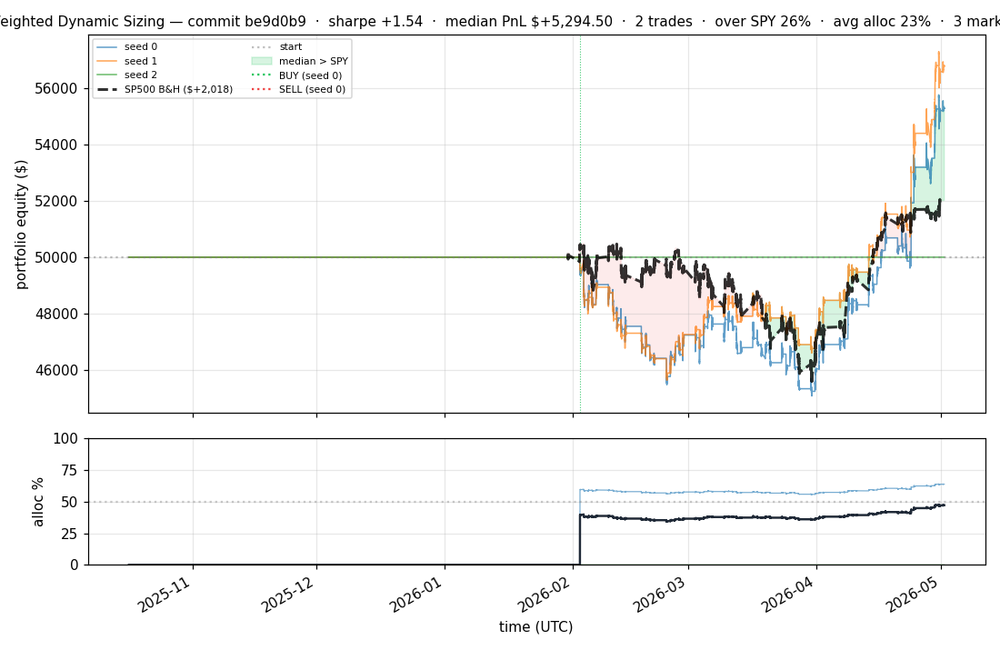
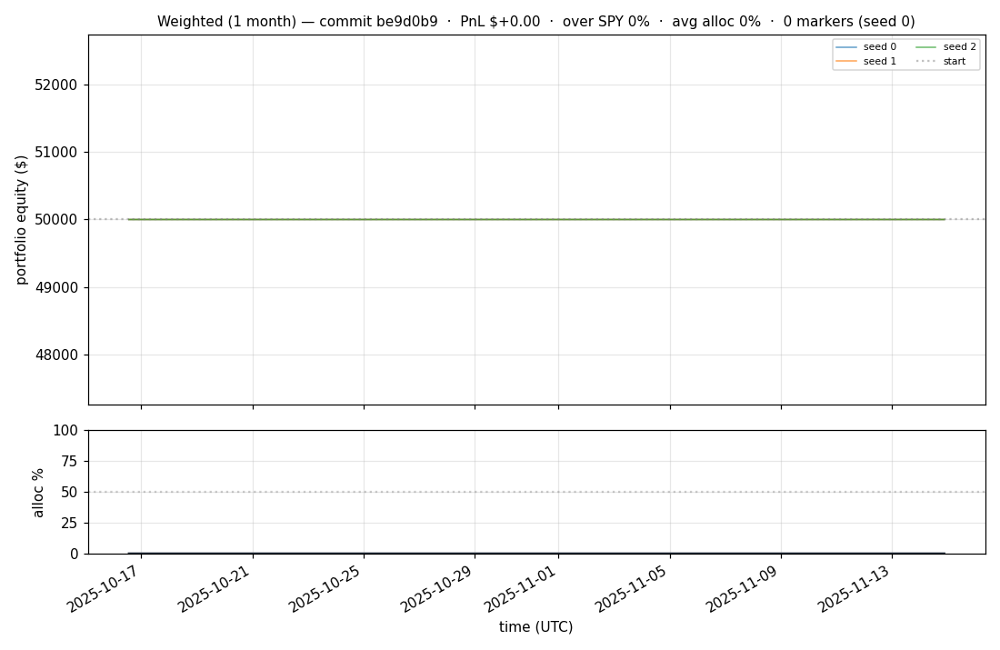
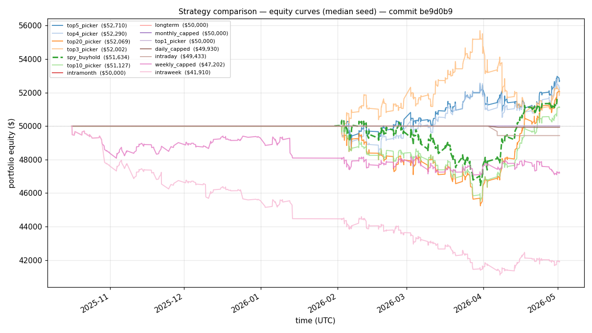

# iter 096 — be9d0b9

**🟢 KEEP** · exp96: top4 with 20pct cash reserve

_2026-05-04 00:21 UTC · 375s wall_

## Result

| metric | value |
|---|---|
| Sharpe (median) | **+1.538** |
| Sharpe CI low (5%) | -0.416 |
| Sharpe CI high (95%) | +4.326 |
| Net PnL | **$+5294.50** (+10.589%) |
| Max drawdown | -9.88% |
| Trades | 2 |
| Fees | $2.00 |
| Seeds completed | 3 |

**Decision reason:** ci_low=-0.4160 > prior best -0.4230

## Per-seed details

```
[evaluator] seed 0: sharpe=+1.538  dd=-9.88%  pnl=$+5,294.50  trades=3
[evaluator] seed 1: sharpe=+2.099  dd=-8.76%  pnl=$+6,807.62  trades=2
[evaluator] seed 2: sharpe=+0.000  dd=+0.00%  pnl=$+0.00  trades=0
```

## Equity curve (full eval window, ~73 days)



## Equity curve (first month)



## Strategy comparison (equity curves)

Overlays every profile (intraday/intraweek/intramonth/longterm + 
daily-capped/weekly-capped/monthly-capped trade-frequency variants 
+ topN pickers + SPY benchmark) on one chart, using the median-seed run.



## Trader profile comparison

Same trained model, different time-horizon strategies + SPY benchmark + passive top-N pickers.

| profile | sharpe | PnL ($) | PnL % | trades | DD % | horizon |
|---|---:|---:|---:|---:|---:|---:|
| **daily_capped** | -2.006 | $-69.98 | -0.14% | 2 | -0.14% | 1d |
| **intraday** | -12.965 | $-27,087.01 | -54.17% | 5210 | -54.17% | 2h |
| **intramonth** | -0.985 | $-122.48 | -0.24% | 2 | -0.27% | 30d |
| **intraweek** | -4.723 | $-9,829.45 | -19.66% | 981 | -20.94% | 5d |
| **longterm** | +0.000 | $+0.00 | +0.00% | 2 | -0.27% | 30d |
| **monthly_capped** | +0.000 | $+0.00 | +0.00% | 0 | +0.00% | 30d |
| **spy_buyhold** | +1.003 | $+1,613.68 | +3.23% | 1 | -7.80% | - |
| **top10_picker** | +1.244 | $+3,337.96 | +6.68% | 9 | -9.28% | - |
| **top1_picker** | +0.000 | $+0.00 | +0.00% | 0 | +0.00% | - |
| **top20_picker** | +1.050 | $+2,046.66 | +4.09% | 18 | -9.88% | - |
| **top3_picker** | +2.081 | $+9,064.36 | +18.13% | 2 | -11.04% | - |
| **top4_picker** | +0.994 | $+2,244.27 | +4.49% | 3 | -7.46% | - |
| **top5_picker** | +1.455 | $+4,293.02 | +8.59% | 4 | -7.85% | - |
| **weekly_capped** | -1.660 | $-2,846.23 | -5.69% | 91 | -6.90% | 5d |

**Best active strategy: `top3_picker` (sharpe +2.081) — BEATS SPY ✓**

## Out-of-symbol holdout eval

Tested on **JPM, WMT, V, DIS, JNJ** — large-caps the model NEVER saw during training.

| seed | sharpe | PnL | trades | DD% |
|---:|---:|---:|---:|---:|
| 0 | +0.327 | $+428.83 | 5 | -7.39% |
| 1 | -0.315 | $-641.51 | 13 | -7.48% |
| 2 | +0.327 | $+428.83 | 5 | -7.39% |
| 3 | +0.327 | $+504.54 | 5 | -9.19% |
| 4 | +0.000 | $+0.00 | 0 | +0.00% |

**Median holdout sharpe: +0.327** (vs in-symbol +1.538)

## Per-symbol summary (aggregated across all seeds)

| symbol | total trades | buys | sells | avg hold (days) | held-to-end |
|---|---:|---:|---:|---:|---:|
| **NIO** | 1879 | 941 | 938 | 0.0 | 3 |
| **COIN** | 1329 | 666 | 663 | 0.0 | 3 |
| **PLTR** | 751 | 377 | 374 | 0.1 | 3 |
| **INTC** | 561 | 282 | 279 | 0.1 | 3 |
| **AMD** | 537 | 270 | 267 | 0.1 | 3 |
| **F** | 523 | 263 | 260 | 0.1 | 3 |
| **ACN** | 523 | 263 | 260 | 0.1 | 3 |
| **NFLX** | 515 | 259 | 256 | 0.4 | 3 |
| **ABBV** | 491 | 247 | 244 | 0.1 | 3 |
| **SPY** | 483 | 243 | 240 | 0.1 | 3 |
| **EEM** | 455 | 229 | 226 | 0.1 | 3 |
| **ELV** | 421 | 212 | 209 | 0.1 | 3 |
| **NVDA** | 407 | 205 | 202 | 0.2 | 3 |
| **SPGI** | 367 | 185 | 182 | 0.1 | 3 |
| **GOOGL** | 359 | 181 | 178 | 0.2 | 3 |
| **QQQ** | 357 | 180 | 177 | 0.2 | 3 |
| **COST** | 349 | 176 | 173 | 0.2 | 3 |
| **LLY** | 335 | 169 | 166 | 0.2 | 3 |
| **HON** | 323 | 163 | 160 | 0.1 | 3 |
| **PM** | 299 | 151 | 148 | 0.1 | 3 |
| **AVGO** | 275 | 139 | 136 | 0.2 | 3 |
| **AAPL** | 269 | 136 | 133 | 0.2 | 3 |
| **AMT** | 249 | 126 | 123 | 0.2 | 3 |
| **LOW** | 245 | 124 | 121 | 0.2 | 3 |
| **AMAT** | 241 | 122 | 119 | 0.2 | 3 |
| **ORCL** | 239 | 121 | 118 | 0.2 | 3 |
| **REGN** | 231 | 117 | 114 | 0.1 | 3 |
| **BA** | 219 | 111 | 108 | 0.2 | 3 |
| **DHR** | 219 | 111 | 108 | 0.2 | 3 |
| **XLF** | 217 | 110 | 107 | 0.3 | 3 |
| **NOW** | 217 | 110 | 107 | 0.2 | 3 |
| **AMZN** | 211 | 107 | 104 | 0.3 | 3 |
| **PEP** | 203 | 103 | 100 | 0.3 | 3 |
| **MSFT** | 201 | 102 | 99 | 0.9 | 3 |
| **ABT** | 197 | 100 | 97 | 0.3 | 3 |
| **TSLA** | 193 | 98 | 95 | 0.3 | 3 |
| **TXN** | 189 | 96 | 93 | 0.3 | 3 |
| **TMO** | 187 | 95 | 92 | 0.3 | 3 |
| **PFE** | 185 | 94 | 91 | 1.0 | 3 |
| **IWM** | 183 | 93 | 90 | 0.4 | 3 |
| **LMT** | 171 | 87 | 84 | 0.2 | 3 |
| **UNH** | 161 | 82 | 79 | 0.4 | 3 |
| **GS** | 161 | 82 | 79 | 0.2 | 3 |
| **DE** | 145 | 74 | 71 | 0.2 | 3 |
| **VRTX** | 137 | 70 | 67 | 0.1 | 3 |
| **ETN** | 135 | 69 | 66 | 0.2 | 3 |
| **PLD** | 133 | 68 | 65 | 0.2 | 3 |
| **BKNG** | 127 | 65 | 62 | 1.3 | 3 |
| **AMGN** | 123 | 63 | 60 | 0.3 | 3 |
| **HD** | 115 | 59 | 56 | 0.5 | 3 |
| **RTX** | 115 | 59 | 56 | 0.4 | 3 |
| **IBM** | 113 | 58 | 55 | 0.4 | 3 |
| **MA** | 101 | 52 | 49 | 0.6 | 3 |
| **MCD** | 101 | 52 | 49 | 0.5 | 3 |
| **BAC** | 99 | 51 | 48 | 0.6 | 3 |
| **NKE** | 91 | 47 | 44 | 2.0 | 3 |
| **AXP** | 89 | 46 | 43 | 0.4 | 3 |
| **ADI** | 85 | 44 | 41 | 0.4 | 3 |
| **ZTS** | 85 | 44 | 41 | 0.2 | 3 |
| **LIN** | 83 | 43 | 40 | 0.5 | 3 |
| **INTU** | 83 | 43 | 40 | 2.1 | 3 |
| **META** | 81 | 42 | 39 | 0.8 | 3 |
| **CRM** | 79 | 41 | 38 | 0.7 | 3 |
| **ADBE** | 75 | 39 | 36 | 0.7 | 3 |
| **MS** | 75 | 39 | 36 | 0.4 | 3 |
| **BSX** | 75 | 39 | 36 | 0.1 | 3 |
| **PG** | 71 | 37 | 34 | 0.9 | 3 |
| **KO** | 69 | 36 | 33 | 2.6 | 3 |
| **CAT** | 69 | 36 | 33 | 0.5 | 3 |
| **MRK** | 67 | 35 | 32 | 0.8 | 3 |
| **T** | 67 | 35 | 32 | 0.8 | 3 |
| **GILD** | 63 | 33 | 30 | 0.5 | 3 |
| **BLK** | 59 | 31 | 28 | 0.6 | 3 |
| **COF** | 45 | 24 | 21 | 0.3 | 3 |
| **NEE** | 39 | 21 | 18 | 1.4 | 3 |
| **CMCSA** | 39 | 21 | 18 | 1.2 | 3 |
| **BMY** | 39 | 21 | 18 | 4.7 | 3 |
| **UPS** | 39 | 21 | 18 | 1.2 | 3 |
| **XOM** | 33 | 18 | 15 | 1.9 | 3 |
| **CVX** | 31 | 17 | 14 | 1.9 | 3 |
| **ISRG** | 27 | 15 | 12 | 1.2 | 3 |
| **CI** | 27 | 15 | 12 | 0.4 | 3 |
| **GE** | 25 | 14 | 11 | 1.6 | 3 |
| **MDLZ** | 23 | 13 | 10 | 1.5 | 3 |
| **VZ** | 21 | 12 | 9 | 2.7 | 3 |
| **QCOM** | 19 | 11 | 8 | 3.3 | 3 |
| **SBUX** | 17 | 10 | 7 | 2.0 | 3 |
| **C** | 17 | 10 | 7 | 1.2 | 3 |
| **SCHW** | 17 | 10 | 7 | 1.6 | 3 |
| **MO** | 13 | 8 | 5 | 3.3 | 3 |
| **DUK** | 13 | 8 | 5 | 1.3 | 3 |
| **USB** | 9 | 6 | 3 | 5.0 | 3 |
| **SYK** | 5 | 4 | 1 | 1.0 | 3 |
| **MMC** | 4 | 4 | 0 | — | 4 |
| **CB** | 3 | 3 | 0 | — | 3 |

## Transactions

### Seed 0 — 16135 trades · ending equity $29,056.88 (-20,943.12 = -41.89%)

| # | timestamp (UTC) | symbol | side |
|---:|---|---|---|
| 1 | 2025-10-16 15:53:00 | MMC | BUY |
| 2 | 2026-02-02 15:15:00 | IWM | BUY |
| 3 | 2026-02-02 15:18:00 | IWM | SELL |
| 4 | 2026-02-02 15:18:00 | SPY | BUY |
| 5 | 2026-02-02 15:18:00 | IWM | BUY |
| 6 | 2026-02-02 15:24:00 | QQQ | BUY |
| 7 | 2026-02-02 15:27:00 | QQQ | SELL |
| 8 | 2026-02-02 15:27:00 | QQQ | BUY |
| 9 | 2026-02-02 15:27:00 | NFLX | BUY |
| 10 | 2026-02-02 15:31:00 | PLTR | BUY |
| 11 | 2026-02-02 15:32:00 | COIN | BUY |
| 12 | 2026-02-02 15:35:00 | XLF | BUY |
| 13 | 2026-02-02 15:37:00 | COIN | SELL |
| 14 | 2026-02-02 15:37:00 | GOOGL | BUY |
| 15 | 2026-02-02 15:37:00 | BAC | BUY |
| 16 | 2026-02-02 15:46:00 | GOOGL | SELL |
| 17 | 2026-02-02 15:46:00 | GOOGL | BUY |
| 18 | 2026-02-02 16:00:00 | PLTR | SELL |
| 19 | 2026-02-02 16:00:00 | EEM | BUY |
| 20 | 2026-02-02 16:00:00 | MSFT | BUY |
| 21 | 2026-02-02 16:01:00 | GOOGL | SELL |
| 22 | 2026-02-02 16:01:00 | NVDA | BUY |
| 23 | 2026-02-02 16:03:00 | EEM | SELL |
| 24 | 2026-02-02 16:03:00 | EEM | BUY |
| 25 | 2026-02-02 16:03:00 | AMZN | BUY |
| 26 | 2026-02-02 16:05:00 | SPY | SELL |
| 27 | 2026-02-02 16:05:00 | SPY | BUY |
| 28 | 2026-02-02 16:05:00 | GOOGL | BUY |
| 29 | 2026-02-02 16:05:00 | TSLA | BUY |
| 30 | 2026-02-02 16:05:00 | F | BUY |
| 31 | 2026-02-02 16:05:00 | COIN | BUY |
| 32 | 2026-02-02 16:06:00 | COIN | SELL |
| 33 | 2026-02-02 16:06:00 | META | BUY |
| 34 | 2026-02-02 16:06:00 | COIN | BUY |
| 35 | 2026-02-02 16:11:00 | COIN | SELL |
| 36 | 2026-02-02 16:11:00 | INTC | BUY |
| 37 | 2026-02-02 16:12:00 | INTC | SELL |
| 38 | 2026-02-02 16:12:00 | INTC | BUY |
| 39 | 2026-02-02 16:13:00 | INTC | SELL |
| 40 | 2026-02-02 16:13:00 | INTC | BUY |
| 41 | 2026-02-02 16:14:00 | INTC | SELL |
| 42 | 2026-02-02 16:14:00 | INTC | BUY |
| 43 | 2026-02-02 16:15:00 | INTC | SELL |
| 44 | 2026-02-02 16:15:00 | INTC | BUY |
| 45 | 2026-02-02 16:16:00 | INTC | SELL |
| 46 | 2026-02-02 16:16:00 | AAPL | BUY |
| 47 | 2026-02-02 16:17:00 | IWM | SELL |
| 48 | 2026-02-02 16:17:00 | IWM | BUY |
| 49 | 2026-02-02 16:17:00 | INTC | BUY |
| 50 | 2026-02-02 16:17:00 | COIN | BUY |
| 51 | 2026-02-02 16:17:00 | PLTR | BUY |
| 52 | 2026-02-02 16:18:00 | INTC | SELL |
| 53 | 2026-02-02 16:18:00 | INTC | BUY |
| 54 | 2026-02-02 16:19:00 | INTC | SELL |
| 55 | 2026-02-02 16:19:00 | AMD | BUY |
| 56 | 2026-02-02 16:19:00 | INTC | BUY |
| 57 | 2026-02-02 16:19:00 | NIO | BUY |
| 58 | 2026-02-02 16:20:00 | INTC | SELL |
| 59 | 2026-02-02 16:20:00 | INTC | BUY |
| 60 | 2026-02-02 16:20:00 | ORCL | BUY |
| 61 | 2026-02-02 16:25:00 | INTC | SELL |
| 62 | 2026-02-02 16:25:00 | INTC | BUY |
| 63 | 2026-02-02 16:25:00 | PFE | BUY |
| 64 | 2026-02-02 16:36:00 | INTC | SELL |
| 65 | 2026-02-02 16:36:00 | INTC | BUY |
| 66 | 2026-02-02 16:37:00 | INTC | SELL |
| 67 | 2026-02-02 16:37:00 | INTC | BUY |
| 68 | 2026-02-02 16:38:00 | INTC | SELL |
| 69 | 2026-02-02 16:38:00 | INTC | BUY |
| 70 | 2026-02-02 16:39:00 | INTC | SELL |
| 71 | 2026-02-02 16:39:00 | INTC | BUY |
| 72 | 2026-02-02 16:40:00 | INTC | SELL |
| 73 | 2026-02-02 16:40:00 | INTC | BUY |
| 74 | 2026-02-02 16:41:00 | NIO | SELL |
| 75 | 2026-02-02 16:41:00 | NIO | BUY |
| 76 | 2026-02-02 16:43:00 | INTC | SELL |
| 77 | 2026-02-02 16:43:00 | INTC | BUY |
| 78 | 2026-02-02 16:45:00 | INTC | SELL |
| 79 | 2026-02-02 16:45:00 | INTC | BUY |
| 80 | 2026-02-02 16:46:00 | NIO | SELL |
| 81 | 2026-02-02 16:46:00 | NIO | BUY |
| 82 | 2026-02-02 16:47:00 | NIO | SELL |
| 83 | 2026-02-02 16:47:00 | NIO | BUY |
| 84 | 2026-02-02 16:48:00 | NIO | SELL |
| 85 | 2026-02-02 16:48:00 | NIO | BUY |
| 86 | 2026-02-02 16:49:00 | COIN | SELL |
| 87 | 2026-02-02 16:49:00 | COIN | BUY |
| 88 | 2026-02-02 16:49:00 | UNH | BUY |
| 89 | 2026-02-02 16:50:00 | NIO | SELL |
| 90 | 2026-02-02 16:50:00 | NIO | BUY |
| 91 | 2026-02-02 16:51:00 | NIO | SELL |
| 92 | 2026-02-02 16:51:00 | NIO | BUY |
| 93 | 2026-02-02 16:52:00 | COIN | SELL |
| 94 | 2026-02-02 16:52:00 | COIN | BUY |
| 95 | 2026-02-02 16:52:00 | XOM | BUY |
| 96 | 2026-02-02 16:53:00 | NIO | SELL |
| 97 | 2026-02-02 16:53:00 | NIO | BUY |
| 98 | 2026-02-02 16:54:00 | EEM | SELL |
| 99 | 2026-02-02 16:54:00 | EEM | BUY |
| 100 | 2026-02-02 16:54:00 | MA | BUY |
| 101 | 2026-02-02 16:55:00 | NIO | SELL |
| 102 | 2026-02-02 16:55:00 | NIO | BUY |
| 103 | 2026-02-02 16:56:00 | NIO | SELL |
| 104 | 2026-02-02 16:56:00 | NIO | BUY |
| 105 | 2026-02-02 16:57:00 | COIN | SELL |
| 106 | 2026-02-02 16:57:00 | COIN | BUY |
| 107 | 2026-02-02 16:58:00 | NIO | SELL |
| 108 | 2026-02-02 16:58:00 | NIO | BUY |
| 109 | 2026-02-02 16:59:00 | NIO | SELL |
| 110 | 2026-02-02 16:59:00 | NIO | BUY |
| 111 | 2026-02-02 17:00:00 | COIN | SELL |
| 112 | 2026-02-02 17:00:00 | COIN | BUY |
| 113 | 2026-02-02 17:01:00 | NIO | SELL |
| 114 | 2026-02-02 17:01:00 | NIO | BUY |
| 115 | 2026-02-02 17:02:00 | COIN | SELL |
| 116 | 2026-02-02 17:02:00 | COIN | BUY |
| 117 | 2026-02-02 17:03:00 | AMD | SELL |
| 118 | 2026-02-02 17:03:00 | AMD | BUY |
| 119 | 2026-02-02 17:03:00 | PG | BUY |
| 120 | 2026-02-02 17:03:00 | CVX | BUY |
| 121 | 2026-02-02 17:04:00 | COIN | SELL |
| 122 | 2026-02-02 17:04:00 | COIN | BUY |
| 123 | 2026-02-02 17:06:00 | NIO | SELL |
| 124 | 2026-02-02 17:06:00 | NIO | BUY |
| 125 | 2026-02-02 17:07:00 | COIN | SELL |
| 126 | 2026-02-02 17:07:00 | COIN | BUY |
| 127 | 2026-02-02 17:08:00 | COIN | SELL |
| 128 | 2026-02-02 17:08:00 | COIN | BUY |
| 129 | 2026-02-02 17:09:00 | COIN | SELL |
| 130 | 2026-02-02 17:09:00 | COIN | BUY |
| 131 | 2026-02-02 17:10:00 | COIN | SELL |
| 132 | 2026-02-02 17:10:00 | COIN | BUY |
| 133 | 2026-02-02 17:11:00 | NIO | SELL |
| 134 | 2026-02-02 17:11:00 | NIO | BUY |
| 135 | 2026-02-02 17:12:00 | NIO | SELL |
| 136 | 2026-02-02 17:12:00 | NIO | BUY |
| 137 | 2026-02-02 17:13:00 | NIO | SELL |
| 138 | 2026-02-02 17:13:00 | NIO | BUY |
| 139 | 2026-02-02 17:14:00 | COIN | SELL |
| 140 | 2026-02-02 17:14:00 | COIN | BUY |
| 141 | 2026-02-02 17:15:00 | COIN | SELL |
| 142 | 2026-02-02 17:15:00 | COIN | BUY |
| 143 | 2026-02-02 17:16:00 | F | SELL |
| 144 | 2026-02-02 17:16:00 | F | BUY |
| 145 | 2026-02-02 17:16:00 | LLY | BUY |
| 146 | 2026-02-02 17:17:00 | NIO | SELL |
| 147 | 2026-02-02 17:17:00 | NIO | BUY |
| 148 | 2026-02-02 17:18:00 | NIO | SELL |
| 149 | 2026-02-02 17:18:00 | NIO | BUY |
| 150 | 2026-02-02 17:20:00 | COIN | SELL |
| 151 | 2026-02-02 17:20:00 | COIN | BUY |
| 152 | 2026-02-02 17:22:00 | NIO | SELL |
| 153 | 2026-02-02 17:22:00 | NIO | BUY |
| 154 | 2026-02-02 17:25:00 | NIO | SELL |
| 155 | 2026-02-02 17:25:00 | NIO | BUY |
| 156 | 2026-02-02 17:26:00 | NIO | SELL |
| 157 | 2026-02-02 17:26:00 | NIO | BUY |
| 158 | 2026-02-02 17:27:00 | NIO | SELL |
| 159 | 2026-02-02 17:27:00 | NIO | BUY |
| 160 | 2026-02-02 17:28:00 | NIO | SELL |
| 161 | 2026-02-02 17:28:00 | NIO | BUY |
| 162 | 2026-02-02 17:29:00 | NIO | SELL |
| 163 | 2026-02-02 17:29:00 | NIO | BUY |
| 164 | 2026-02-02 17:31:00 | GOOGL | SELL |
| 165 | 2026-02-02 17:31:00 | GOOGL | BUY |
| 166 | 2026-02-02 17:31:00 | HD | BUY |
| 167 | 2026-02-02 17:31:00 | ABBV | BUY |
| 168 | 2026-02-02 17:31:00 | KO | BUY |
| 169 | 2026-02-02 17:32:00 | NIO | SELL |
| 170 | 2026-02-02 17:32:00 | NIO | BUY |
| 171 | 2026-02-02 17:33:00 | NIO | SELL |
| 172 | 2026-02-02 17:33:00 | NIO | BUY |
| 173 | 2026-02-02 17:34:00 | NIO | SELL |
| 174 | 2026-02-02 17:34:00 | NIO | BUY |
| 175 | 2026-02-02 17:35:00 | GOOGL | SELL |
| 176 | 2026-02-02 17:35:00 | GOOGL | BUY |
| 177 | 2026-02-02 17:35:00 | PEP | BUY |
| 178 | 2026-02-02 17:35:00 | AVGO | BUY |
| 179 | 2026-02-02 17:36:00 | NIO | SELL |
| 180 | 2026-02-02 17:36:00 | NIO | BUY |
| 181 | 2026-02-02 17:37:00 | NIO | SELL |
| 182 | 2026-02-02 17:37:00 | NIO | BUY |
| 183 | 2026-02-02 17:38:00 | NIO | SELL |
| 184 | 2026-02-02 17:38:00 | NIO | BUY |
| 185 | 2026-02-02 17:39:00 | PEP | SELL |
| 186 | 2026-02-02 17:39:00 | PEP | BUY |
| 187 | 2026-02-02 17:39:00 | MCD | BUY |
| 188 | 2026-02-02 17:40:00 | NIO | SELL |
| 189 | 2026-02-02 17:40:00 | NIO | BUY |
| 190 | 2026-02-02 17:41:00 | NIO | SELL |
| 191 | 2026-02-02 17:41:00 | NIO | BUY |
| 192 | 2026-02-02 17:42:00 | NIO | SELL |
| 193 | 2026-02-02 17:42:00 | NIO | BUY |
| 194 | 2026-02-02 17:43:00 | NIO | SELL |
| 195 | 2026-02-02 17:43:00 | NIO | BUY |
| 196 | 2026-02-02 17:44:00 | NIO | SELL |
| 197 | 2026-02-02 17:44:00 | NIO | BUY |
| 198 | 2026-02-02 17:45:00 | AMD | SELL |
| 199 | 2026-02-02 17:45:00 | AMD | BUY |
| 200 | 2026-02-02 17:45:00 | COST | BUY |
| … | _15935 more truncated_ | | |

### Seed 1 — 1065 trades · ending equity $46,834.47 (-3,165.53 = -6.33%)

| # | timestamp (UTC) | symbol | side |
|---:|---|---|---|
| 1 | 2025-10-16 15:53:00 | MMC | BUY |
| 2 | 2026-02-02 15:15:00 | IWM | BUY |
| 3 | 2026-02-02 15:18:00 | IWM | SELL |
| 4 | 2026-02-02 15:18:00 | SPY | BUY |
| 5 | 2026-02-02 15:18:00 | IWM | BUY |
| 6 | 2026-02-02 15:24:00 | QQQ | BUY |
| 7 | 2026-02-02 15:27:00 | SPY | SELL |
| 8 | 2026-02-02 15:27:00 | SPY | BUY |
| 9 | 2026-02-02 15:27:00 | NFLX | BUY |
| 10 | 2026-02-02 15:31:00 | PLTR | BUY |
| 11 | 2026-02-02 15:32:00 | COIN | BUY |
| 12 | 2026-02-02 15:35:00 | PLTR | SELL |
| 13 | 2026-02-02 15:35:00 | XLF | BUY |
| 14 | 2026-02-02 15:35:00 | PLTR | BUY |
| 15 | 2026-02-02 15:35:00 | NIO | BUY |
| 16 | 2026-02-02 15:37:00 | PLTR | SELL |
| 17 | 2026-02-02 15:37:00 | GOOGL | BUY |
| 18 | 2026-02-02 15:37:00 | BAC | BUY |
| 19 | 2026-02-02 15:37:00 | PLTR | BUY |
| 20 | 2026-02-02 15:40:00 | BAC | SELL |
| 21 | 2026-02-02 15:40:00 | TSLA | BUY |
| 22 | 2026-02-02 15:41:00 | PLTR | SELL |
| 23 | 2026-02-02 15:41:00 | BAC | BUY |
| 24 | 2026-02-02 15:43:00 | XLF | SELL |
| 25 | 2026-02-02 15:43:00 | XLF | BUY |
| 26 | 2026-02-02 15:43:00 | F | BUY |
| 27 | 2026-02-02 15:43:00 | PLTR | BUY |
| 28 | 2026-02-02 15:54:00 | PLTR | SELL |
| 29 | 2026-02-02 15:54:00 | NVDA | BUY |
| 30 | 2026-02-02 15:55:00 | COIN | SELL |
| 31 | 2026-02-02 15:55:00 | EEM | BUY |
| 32 | 2026-02-02 15:55:00 | COIN | BUY |
| 33 | 2026-02-02 15:55:00 | PLTR | BUY |
| 34 | 2026-02-02 16:00:00 | PLTR | SELL |
| 35 | 2026-02-02 16:00:00 | MSFT | BUY |
| 36 | 2026-02-02 16:03:00 | GOOGL | SELL |
| 37 | 2026-02-02 16:03:00 | AMZN | BUY |
| 38 | 2026-02-02 16:03:00 | GOOGL | BUY |
| 39 | 2026-02-02 16:04:00 | AMZN | SELL |
| 40 | 2026-02-02 16:04:00 | AMZN | BUY |
| 41 | 2026-02-02 16:04:00 | PLTR | BUY |
| 42 | 2026-02-02 16:06:00 | PLTR | SELL |
| 43 | 2026-02-02 16:07:00 | AMZN | SELL |
| 44 | 2026-02-02 16:07:00 | AMZN | BUY |
| 45 | 2026-02-02 16:08:00 | AMZN | SELL |
| 46 | 2026-02-02 16:08:00 | AMZN | BUY |
| 47 | 2026-02-02 16:09:00 | AMZN | SELL |
| 48 | 2026-02-02 16:09:00 | AMZN | BUY |
| 49 | 2026-02-02 16:10:00 | AMZN | SELL |
| 50 | 2026-02-02 16:10:00 | AMZN | BUY |
| 51 | 2026-02-02 16:11:00 | COIN | SELL |
| 52 | 2026-02-02 16:11:00 | META | BUY |
| 53 | 2026-02-02 16:11:00 | INTC | BUY |
| 54 | 2026-02-02 16:12:00 | INTC | SELL |
| 55 | 2026-02-02 16:12:00 | INTC | BUY |
| 56 | 2026-02-02 16:13:00 | INTC | SELL |
| 57 | 2026-02-02 16:13:00 | INTC | BUY |
| 58 | 2026-02-02 16:15:00 | AMZN | SELL |
| 59 | 2026-02-02 16:15:00 | AMZN | BUY |
| 60 | 2026-02-02 16:16:00 | IWM | SELL |
| 61 | 2026-02-02 16:16:00 | IWM | BUY |
| 62 | 2026-02-02 16:16:00 | AAPL | BUY |
| 63 | 2026-02-02 16:16:00 | COIN | BUY |
| 64 | 2026-02-02 16:16:00 | PLTR | BUY |
| 65 | 2026-02-02 16:19:00 | COIN | SELL |
| 66 | 2026-02-02 16:19:00 | AMD | BUY |
| 67 | 2026-02-02 16:19:00 | COIN | BUY |
| 68 | 2026-02-02 16:19:00 | ORCL | BUY |
| 69 | 2026-02-02 16:25:00 | AAPL | SELL |
| 70 | 2026-02-02 16:25:00 | AAPL | BUY |
| 71 | 2026-02-02 16:25:00 | PFE | BUY |
| 72 | 2026-02-02 16:35:00 | COIN | SELL |
| 73 | 2026-02-02 16:35:00 | COIN | BUY |
| 74 | 2026-02-02 16:35:00 | AVGO | BUY |
| 75 | 2026-02-02 16:36:00 | COIN | SELL |
| 76 | 2026-02-02 16:36:00 | COIN | BUY |
| 77 | 2026-02-02 16:36:00 | NOW | BUY |
| 78 | 2026-02-02 16:37:00 | GOOGL | SELL |
| 79 | 2026-02-02 16:37:00 | GOOGL | BUY |
| 80 | 2026-02-02 16:38:00 | COIN | SELL |
| 81 | 2026-02-02 16:38:00 | COIN | BUY |
| 82 | 2026-02-02 16:39:00 | INTC | SELL |
| 83 | 2026-02-02 16:39:00 | INTC | BUY |
| 84 | 2026-02-02 16:40:00 | META | SELL |
| 85 | 2026-02-02 16:40:00 | META | BUY |
| 86 | 2026-02-02 16:41:00 | META | SELL |
| 87 | 2026-02-02 16:41:00 | META | BUY |
| 88 | 2026-02-02 16:42:00 | COIN | SELL |
| 89 | 2026-02-02 16:42:00 | COIN | BUY |
| 90 | 2026-02-02 16:44:00 | META | SELL |
| 91 | 2026-02-02 16:44:00 | META | BUY |
| 92 | 2026-02-02 16:45:00 | COIN | SELL |
| 93 | 2026-02-02 16:45:00 | COIN | BUY |
| 94 | 2026-02-02 16:46:00 | NIO | SELL |
| 95 | 2026-02-02 16:46:00 | NIO | BUY |
| 96 | 2026-02-02 16:46:00 | UNH | BUY |
| 97 | 2026-02-02 16:47:00 | UNH | SELL |
| 98 | 2026-02-02 16:47:00 | UNH | BUY |
| 99 | 2026-02-02 16:48:00 | META | SELL |
| 100 | 2026-02-02 16:48:00 | META | BUY |
| 101 | 2026-02-02 16:49:00 | META | SELL |
| 102 | 2026-02-02 16:49:00 | META | BUY |
| 103 | 2026-02-02 16:50:00 | NIO | SELL |
| 104 | 2026-02-02 16:50:00 | NIO | BUY |
| 105 | 2026-02-02 16:51:00 | META | SELL |
| 106 | 2026-02-02 16:51:00 | META | BUY |
| 107 | 2026-02-02 16:52:00 | NIO | SELL |
| 108 | 2026-02-02 16:52:00 | NIO | BUY |
| 109 | 2026-02-02 16:53:00 | META | SELL |
| 110 | 2026-02-02 16:53:00 | META | BUY |
| 111 | 2026-02-02 16:54:00 | BAC | SELL |
| 112 | 2026-02-02 16:54:00 | BAC | BUY |
| 113 | 2026-02-02 16:55:00 | EEM | SELL |
| 114 | 2026-02-02 16:55:00 | EEM | BUY |
| 115 | 2026-02-02 16:55:00 | XOM | BUY |
| 116 | 2026-02-02 16:56:00 | BAC | SELL |
| 117 | 2026-02-02 16:56:00 | BAC | BUY |
| 118 | 2026-02-02 16:57:00 | META | SELL |
| 119 | 2026-02-02 16:57:00 | META | BUY |
| 120 | 2026-02-02 16:58:00 | BAC | SELL |
| 121 | 2026-02-02 16:58:00 | BAC | BUY |
| 122 | 2026-02-02 16:59:00 | BAC | SELL |
| 123 | 2026-02-02 16:59:00 | BAC | BUY |
| 124 | 2026-02-02 17:00:00 | BAC | SELL |
| 125 | 2026-02-02 17:00:00 | BAC | BUY |
| 126 | 2026-02-02 17:01:00 | NIO | SELL |
| 127 | 2026-02-02 17:01:00 | NIO | BUY |
| 128 | 2026-02-02 17:02:00 | BAC | SELL |
| 129 | 2026-02-02 17:02:00 | BAC | BUY |
| 130 | 2026-02-02 17:03:00 | BAC | SELL |
| 131 | 2026-02-02 17:03:00 | BAC | BUY |
| 132 | 2026-02-02 17:04:00 | PLTR | SELL |
| 133 | 2026-02-02 17:04:00 | PLTR | BUY |
| 134 | 2026-02-02 17:04:00 | MA | BUY |
| 135 | 2026-02-02 17:06:00 | F | SELL |
| 136 | 2026-02-02 17:06:00 | F | BUY |
| 137 | 2026-02-02 17:06:00 | HD | BUY |
| 138 | 2026-02-02 17:07:00 | MA | SELL |
| 139 | 2026-02-02 17:07:00 | MA | BUY |
| 140 | 2026-02-02 17:08:00 | MA | SELL |
| 141 | 2026-02-02 17:08:00 | MA | BUY |
| 142 | 2026-02-02 17:09:00 | BAC | SELL |
| 143 | 2026-02-02 17:09:00 | BAC | BUY |
| 144 | 2026-02-02 17:10:00 | AMD | SELL |
| 145 | 2026-02-02 17:10:00 | AMD | BUY |
| 146 | 2026-02-02 17:10:00 | PG | BUY |
| 147 | 2026-02-02 17:11:00 | MA | SELL |
| 148 | 2026-02-02 17:11:00 | MA | BUY |
| 149 | 2026-02-02 17:12:00 | MA | SELL |
| 150 | 2026-02-02 17:12:00 | MA | BUY |
| 151 | 2026-02-02 17:13:00 | PFE | SELL |
| 152 | 2026-02-02 17:13:00 | CVX | BUY |
| 153 | 2026-02-02 17:13:00 | LLY | BUY |
| 154 | 2026-02-02 17:14:00 | AMD | SELL |
| 155 | 2026-02-02 17:14:00 | AMD | BUY |
| 156 | 2026-02-02 17:14:00 | ABBV | BUY |
| 157 | 2026-02-02 17:15:00 | F | SELL |
| 158 | 2026-02-02 17:15:00 | F | BUY |
| 159 | 2026-02-02 17:16:00 | F | SELL |
| 160 | 2026-02-02 17:16:00 | F | BUY |
| 161 | 2026-02-02 17:17:00 | F | SELL |
| 162 | 2026-02-02 17:17:00 | F | BUY |
| 163 | 2026-02-02 17:18:00 | F | SELL |
| 164 | 2026-02-02 17:18:00 | F | BUY |
| 165 | 2026-02-02 17:19:00 | F | SELL |
| 166 | 2026-02-02 17:19:00 | F | BUY |
| 167 | 2026-02-02 17:20:00 | COIN | SELL |
| 168 | 2026-02-02 17:20:00 | COIN | BUY |
| 169 | 2026-02-02 17:21:00 | F | SELL |
| 170 | 2026-02-02 17:21:00 | F | BUY |
| 171 | 2026-02-02 17:22:00 | COIN | SELL |
| 172 | 2026-02-02 17:22:00 | COIN | BUY |
| 173 | 2026-02-02 17:24:00 | F | SELL |
| 174 | 2026-02-02 17:24:00 | F | BUY |
| 175 | 2026-02-02 17:25:00 | COIN | SELL |
| 176 | 2026-02-02 17:25:00 | COIN | BUY |
| 177 | 2026-02-02 17:26:00 | COIN | SELL |
| 178 | 2026-02-02 17:26:00 | COIN | BUY |
| 179 | 2026-02-02 17:27:00 | COIN | SELL |
| 180 | 2026-02-02 17:27:00 | COIN | BUY |
| 181 | 2026-02-02 17:28:00 | COIN | SELL |
| 182 | 2026-02-02 17:28:00 | COIN | BUY |
| 183 | 2026-02-02 17:29:00 | LLY | SELL |
| 184 | 2026-02-02 17:29:00 | LLY | BUY |
| 185 | 2026-02-02 17:30:00 | COIN | SELL |
| 186 | 2026-02-02 17:30:00 | COIN | BUY |
| 187 | 2026-02-02 17:31:00 | COIN | SELL |
| 188 | 2026-02-02 17:31:00 | COIN | BUY |
| 189 | 2026-02-02 17:32:00 | COIN | SELL |
| 190 | 2026-02-02 17:32:00 | COIN | BUY |
| 191 | 2026-02-02 17:33:00 | COIN | SELL |
| 192 | 2026-02-02 17:33:00 | COIN | BUY |
| 193 | 2026-02-02 17:34:00 | COIN | SELL |
| 194 | 2026-02-02 17:34:00 | COIN | BUY |
| 195 | 2026-02-02 17:35:00 | COIN | SELL |
| 196 | 2026-02-02 17:35:00 | COIN | BUY |
| 197 | 2026-02-02 17:36:00 | COIN | SELL |
| 198 | 2026-02-02 17:36:00 | COIN | BUY |
| 199 | 2026-02-02 17:37:00 | AMZN | SELL |
| 200 | 2026-02-02 17:37:00 | AMZN | BUY |
| … | _865 more truncated_ | | |

### Seed 2 — 1675 trades · ending equity $46,644.75 (-3,355.25 = -6.71%)

| # | timestamp (UTC) | symbol | side |
|---:|---|---|---|
| 1 | 2025-10-16 15:53:00 | MMC | BUY |
| 2 | 2026-02-02 15:15:00 | IWM | BUY |
| 3 | 2026-02-02 15:18:00 | SPY | BUY |
| 4 | 2026-02-02 15:24:00 | QQQ | BUY |
| 5 | 2026-02-02 15:27:00 | NFLX | BUY |
| 6 | 2026-02-02 15:31:00 | PLTR | BUY |
| 7 | 2026-02-02 15:32:00 | COIN | BUY |
| 8 | 2026-02-02 15:35:00 | PLTR | SELL |
| 9 | 2026-02-02 15:35:00 | XLF | BUY |
| 10 | 2026-02-02 15:35:00 | PLTR | BUY |
| 11 | 2026-02-02 15:35:00 | NIO | BUY |
| 12 | 2026-02-02 15:48:00 | COIN | SELL |
| 13 | 2026-02-02 15:48:00 | GOOGL | BUY |
| 14 | 2026-02-02 15:48:00 | TSLA | BUY |
| 15 | 2026-02-02 15:52:00 | TSLA | SELL |
| 16 | 2026-02-02 15:52:00 | TSLA | BUY |
| 17 | 2026-02-02 15:53:00 | TSLA | SELL |
| 18 | 2026-02-02 15:53:00 | TSLA | BUY |
| 19 | 2026-02-02 15:54:00 | TSLA | SELL |
| 20 | 2026-02-02 15:54:00 | NVDA | BUY |
| 21 | 2026-02-02 15:55:00 | SPY | SELL |
| 22 | 2026-02-02 15:55:00 | SPY | BUY |
| 23 | 2026-02-02 15:55:00 | EEM | BUY |
| 24 | 2026-02-02 15:55:00 | TSLA | BUY |
| 25 | 2026-02-02 15:55:00 | F | BUY |
| 26 | 2026-02-02 15:55:00 | COIN | BUY |
| 27 | 2026-02-02 15:56:00 | TSLA | SELL |
| 28 | 2026-02-02 15:56:00 | TSLA | BUY |
| 29 | 2026-02-02 15:56:00 | BAC | BUY |
| 30 | 2026-02-02 15:59:00 | COIN | SELL |
| 31 | 2026-02-02 15:59:00 | AMZN | BUY |
| 32 | 2026-02-02 16:13:00 | NIO | SELL |
| 33 | 2026-02-02 16:13:00 | MSFT | BUY |
| 34 | 2026-02-02 16:14:00 | TSLA | SELL |
| 35 | 2026-02-02 16:14:00 | META | BUY |
| 36 | 2026-02-02 16:14:00 | TSLA | BUY |
| 37 | 2026-02-02 16:20:00 | TSLA | SELL |
| 38 | 2026-02-02 16:20:00 | AAPL | BUY |
| 39 | 2026-02-02 16:21:00 | SPY | SELL |
| 40 | 2026-02-02 16:21:00 | SPY | BUY |
| 41 | 2026-02-02 16:21:00 | TSLA | BUY |
| 42 | 2026-02-02 16:21:00 | AMD | BUY |
| 43 | 2026-02-02 16:21:00 | INTC | BUY |
| 44 | 2026-02-02 16:22:00 | TSLA | SELL |
| 45 | 2026-02-02 16:22:00 | TSLA | BUY |
| 46 | 2026-02-02 16:22:00 | COIN | BUY |
| 47 | 2026-02-02 16:22:00 | NIO | BUY |
| 48 | 2026-02-02 16:23:00 | COIN | SELL |
| 49 | 2026-02-02 16:23:00 | COIN | BUY |
| 50 | 2026-02-02 16:24:00 | COIN | SELL |
| 51 | 2026-02-02 16:24:00 | COIN | BUY |
| 52 | 2026-02-02 16:25:00 | COIN | SELL |
| 53 | 2026-02-02 16:25:00 | COIN | BUY |
| 54 | 2026-02-02 16:26:00 | COIN | SELL |
| 55 | 2026-02-02 16:26:00 | COIN | BUY |
| 56 | 2026-02-02 16:27:00 | TSLA | SELL |
| 57 | 2026-02-02 16:27:00 | TSLA | BUY |
| 58 | 2026-02-02 16:27:00 | ORCL | BUY |
| 59 | 2026-02-02 16:28:00 | TSLA | SELL |
| 60 | 2026-02-02 16:28:00 | TSLA | BUY |
| 61 | 2026-02-02 16:28:00 | PFE | BUY |
| 62 | 2026-02-02 16:36:00 | SPY | SELL |
| 63 | 2026-02-02 16:36:00 | SPY | BUY |
| 64 | 2026-02-02 16:36:00 | AVGO | BUY |
| 65 | 2026-02-02 16:36:00 | NOW | BUY |
| 66 | 2026-02-02 16:37:00 | NIO | SELL |
| 67 | 2026-02-02 16:37:00 | NIO | BUY |
| 68 | 2026-02-02 16:38:00 | COIN | SELL |
| 69 | 2026-02-02 16:38:00 | COIN | BUY |
| 70 | 2026-02-02 16:39:00 | NIO | SELL |
| 71 | 2026-02-02 16:39:00 | NIO | BUY |
| 72 | 2026-02-02 16:40:00 | NIO | SELL |
| 73 | 2026-02-02 16:40:00 | NIO | BUY |
| 74 | 2026-02-02 16:41:00 | COIN | SELL |
| 75 | 2026-02-02 16:41:00 | COIN | BUY |
| 76 | 2026-02-02 16:42:00 | COIN | SELL |
| 77 | 2026-02-02 16:42:00 | COIN | BUY |
| 78 | 2026-02-02 16:44:00 | COIN | SELL |
| 79 | 2026-02-02 16:44:00 | COIN | BUY |
| 80 | 2026-02-02 16:45:00 | SPY | SELL |
| 81 | 2026-02-02 16:45:00 | SPY | BUY |
| 82 | 2026-02-02 16:45:00 | UNH | BUY |
| 83 | 2026-02-02 16:45:00 | XOM | BUY |
| 84 | 2026-02-02 16:47:00 | ORCL | SELL |
| 85 | 2026-02-02 16:47:00 | MA | BUY |
| 86 | 2026-02-02 16:48:00 | COIN | SELL |
| 87 | 2026-02-02 16:48:00 | COIN | BUY |
| 88 | 2026-02-02 16:49:00 | COIN | SELL |
| 89 | 2026-02-02 16:49:00 | COIN | BUY |
| 90 | 2026-02-02 16:50:00 | NIO | SELL |
| 91 | 2026-02-02 16:50:00 | NIO | BUY |
| 92 | 2026-02-02 16:51:00 | NIO | SELL |
| 93 | 2026-02-02 16:51:00 | NIO | BUY |
| 94 | 2026-02-02 16:52:00 | COIN | SELL |
| 95 | 2026-02-02 16:52:00 | COIN | BUY |
| 96 | 2026-02-02 16:53:00 | COIN | SELL |
| 97 | 2026-02-02 16:53:00 | COIN | BUY |
| 98 | 2026-02-02 16:55:00 | NIO | SELL |
| 99 | 2026-02-02 16:55:00 | NIO | BUY |
| 100 | 2026-02-02 16:56:00 | COIN | SELL |
| 101 | 2026-02-02 16:56:00 | COIN | BUY |
| 102 | 2026-02-02 16:57:00 | NIO | SELL |
| 103 | 2026-02-02 16:57:00 | NIO | BUY |
| 104 | 2026-02-02 16:58:00 | NIO | SELL |
| 105 | 2026-02-02 16:58:00 | NIO | BUY |
| 106 | 2026-02-02 16:59:00 | COIN | SELL |
| 107 | 2026-02-02 16:59:00 | COIN | BUY |
| 108 | 2026-02-02 17:00:00 | BAC | SELL |
| 109 | 2026-02-02 17:00:00 | BAC | BUY |
| 110 | 2026-02-02 17:02:00 | COIN | SELL |
| 111 | 2026-02-02 17:02:00 | COIN | BUY |
| 112 | 2026-02-02 17:05:00 | NIO | SELL |
| 113 | 2026-02-02 17:05:00 | NIO | BUY |
| 114 | 2026-02-02 17:06:00 | NIO | SELL |
| 115 | 2026-02-02 17:06:00 | NIO | BUY |
| 116 | 2026-02-02 17:08:00 | NIO | SELL |
| 117 | 2026-02-02 17:08:00 | NIO | BUY |
| 118 | 2026-02-02 17:10:00 | NIO | SELL |
| 119 | 2026-02-02 17:10:00 | NIO | BUY |
| 120 | 2026-02-02 17:11:00 | NIO | SELL |
| 121 | 2026-02-02 17:11:00 | NIO | BUY |
| 122 | 2026-02-02 17:14:00 | COIN | SELL |
| 123 | 2026-02-02 17:14:00 | COIN | BUY |
| 124 | 2026-02-02 17:20:00 | F | SELL |
| 125 | 2026-02-02 17:20:00 | F | BUY |
| 126 | 2026-02-02 17:20:00 | PG | BUY |
| 127 | 2026-02-02 17:24:00 | F | SELL |
| 128 | 2026-02-02 17:24:00 | F | BUY |
| 129 | 2026-02-02 17:25:00 | NIO | SELL |
| 130 | 2026-02-02 17:25:00 | NIO | BUY |
| 131 | 2026-02-02 17:26:00 | NIO | SELL |
| 132 | 2026-02-02 17:26:00 | NIO | BUY |
| 133 | 2026-02-02 17:27:00 | NIO | SELL |
| 134 | 2026-02-02 17:27:00 | NIO | BUY |
| 135 | 2026-02-02 17:28:00 | NIO | SELL |
| 136 | 2026-02-02 17:28:00 | NIO | BUY |
| 137 | 2026-02-02 17:29:00 | NIO | SELL |
| 138 | 2026-02-02 17:29:00 | NIO | BUY |
| 139 | 2026-02-02 17:30:00 | F | SELL |
| 140 | 2026-02-02 17:30:00 | F | BUY |
| 141 | 2026-02-02 17:34:00 | COIN | SELL |
| 142 | 2026-02-02 17:34:00 | COIN | BUY |
| 143 | 2026-02-02 17:36:00 | COIN | SELL |
| 144 | 2026-02-02 17:36:00 | COIN | BUY |
| 145 | 2026-02-02 17:37:00 | NIO | SELL |
| 146 | 2026-02-02 17:37:00 | NIO | BUY |
| 147 | 2026-02-02 17:38:00 | NIO | SELL |
| 148 | 2026-02-02 17:38:00 | NIO | BUY |
| 149 | 2026-02-02 17:39:00 | MA | SELL |
| 150 | 2026-02-02 17:39:00 | MA | BUY |
| 151 | 2026-02-02 17:40:00 | GOOGL | SELL |
| 152 | 2026-02-02 17:40:00 | GOOGL | BUY |
| 153 | 2026-02-02 17:41:00 | MA | SELL |
| 154 | 2026-02-02 17:41:00 | MA | BUY |
| 155 | 2026-02-02 17:42:00 | COIN | SELL |
| 156 | 2026-02-02 17:42:00 | COIN | BUY |
| 157 | 2026-02-02 17:43:00 | TSLA | SELL |
| 158 | 2026-02-02 17:43:00 | TSLA | BUY |
| 159 | 2026-02-02 17:44:00 | MSFT | SELL |
| 160 | 2026-02-02 17:44:00 | MSFT | BUY |
| 161 | 2026-02-02 17:45:00 | TSLA | SELL |
| 162 | 2026-02-02 17:45:00 | TSLA | BUY |
| 163 | 2026-02-02 17:46:00 | TSLA | SELL |
| 164 | 2026-02-02 17:46:00 | TSLA | BUY |
| 165 | 2026-02-02 17:47:00 | IWM | SELL |
| 166 | 2026-02-02 17:47:00 | IWM | BUY |
| 167 | 2026-02-02 17:47:00 | HD | BUY |
| 168 | 2026-02-02 17:47:00 | CVX | BUY |
| 169 | 2026-02-02 17:47:00 | LLY | BUY |
| 170 | 2026-02-02 17:47:00 | ABBV | BUY |
| 171 | 2026-02-02 17:48:00 | XLF | SELL |
| 172 | 2026-02-02 17:48:00 | XLF | BUY |
| 173 | 2026-02-02 17:48:00 | KO | BUY |
| 174 | 2026-02-02 17:49:00 | MA | SELL |
| 175 | 2026-02-02 17:49:00 | MA | BUY |
| 176 | 2026-02-02 17:50:00 | LLY | SELL |
| 177 | 2026-02-02 17:50:00 | LLY | BUY |
| 178 | 2026-02-02 17:50:00 | PEP | BUY |
| 179 | 2026-02-02 17:51:00 | NIO | SELL |
| 180 | 2026-02-02 17:51:00 | NIO | BUY |
| 181 | 2026-02-02 17:52:00 | LLY | SELL |
| 182 | 2026-02-02 17:52:00 | LLY | BUY |
| 183 | 2026-02-02 17:52:00 | MCD | BUY |
| 184 | 2026-02-02 17:53:00 | NIO | SELL |
| 185 | 2026-02-02 17:53:00 | NIO | BUY |
| 186 | 2026-02-02 17:54:00 | NIO | SELL |
| 187 | 2026-02-02 17:54:00 | NIO | BUY |
| 188 | 2026-02-02 17:55:00 | LLY | SELL |
| 189 | 2026-02-02 17:55:00 | LLY | BUY |
| 190 | 2026-02-02 17:55:00 | COST | BUY |
| 191 | 2026-02-02 17:59:00 | AMD | SELL |
| 192 | 2026-02-02 17:59:00 | AMD | BUY |
| 193 | 2026-02-02 17:59:00 | TMO | BUY |
| 194 | 2026-02-02 18:00:00 | NIO | SELL |
| 195 | 2026-02-02 18:00:00 | NIO | BUY |
| 196 | 2026-02-02 18:05:00 | IWM | SELL |
| 197 | 2026-02-02 18:05:00 | IWM | BUY |
| 198 | 2026-02-02 18:05:00 | MRK | BUY |
| 199 | 2026-02-02 18:05:00 | ABT | BUY |
| 200 | 2026-02-02 18:05:00 | BA | BUY |
| … | _1475 more truncated_ | | |

### Seed 3 — 565 trades · ending equity $47,414.99 (-2,585.01 = -5.17%)

| # | timestamp (UTC) | symbol | side |
|---:|---|---|---|
| 1 | 2025-10-16 15:53:00 | MMC | BUY |
| 2 | 2026-02-02 15:15:00 | IWM | BUY |
| 3 | 2026-02-02 15:18:00 | SPY | BUY |
| 4 | 2026-02-02 15:24:00 | QQQ | BUY |
| 5 | 2026-02-02 15:27:00 | NFLX | BUY |
| 6 | 2026-02-02 15:31:00 | SPY | SELL |
| 7 | 2026-02-02 15:31:00 | SPY | BUY |
| 8 | 2026-02-02 15:31:00 | PLTR | BUY |
| 9 | 2026-02-02 15:32:00 | SPY | SELL |
| 10 | 2026-02-02 15:32:00 | SPY | BUY |
| 11 | 2026-02-02 15:32:00 | COIN | BUY |
| 12 | 2026-02-02 15:35:00 | SPY | SELL |
| 13 | 2026-02-02 15:35:00 | SPY | BUY |
| 14 | 2026-02-02 15:35:00 | XLF | BUY |
| 15 | 2026-02-02 15:35:00 | NIO | BUY |
| 16 | 2026-02-02 15:37:00 | SPY | SELL |
| 17 | 2026-02-02 15:37:00 | SPY | BUY |
| 18 | 2026-02-02 15:37:00 | GOOGL | BUY |
| 19 | 2026-02-02 15:37:00 | BAC | BUY |
| 20 | 2026-02-02 15:40:00 | SPY | SELL |
| 21 | 2026-02-02 15:40:00 | SPY | BUY |
| 22 | 2026-02-02 15:40:00 | TSLA | BUY |
| 23 | 2026-02-02 15:40:00 | F | BUY |
| 24 | 2026-02-02 15:54:00 | NVDA | BUY |
| 25 | 2026-02-02 16:00:00 | F | SELL |
| 26 | 2026-02-02 16:00:00 | EEM | BUY |
| 27 | 2026-02-02 16:05:00 | XLF | SELL |
| 28 | 2026-02-02 16:05:00 | XLF | BUY |
| 29 | 2026-02-02 16:05:00 | MSFT | BUY |
| 30 | 2026-02-02 16:05:00 | AMZN | BUY |
| 31 | 2026-02-02 16:06:00 | XLF | SELL |
| 32 | 2026-02-02 16:06:00 | XLF | BUY |
| 33 | 2026-02-02 16:06:00 | META | BUY |
| 34 | 2026-02-02 16:10:00 | XLF | SELL |
| 35 | 2026-02-02 16:10:00 | XLF | BUY |
| 36 | 2026-02-02 16:10:00 | INTC | BUY |
| 37 | 2026-02-02 16:16:00 | XLF | SELL |
| 38 | 2026-02-02 16:16:00 | XLF | BUY |
| 39 | 2026-02-02 16:16:00 | AAPL | BUY |
| 40 | 2026-02-02 16:19:00 | BAC | SELL |
| 41 | 2026-02-02 16:19:00 | AMD | BUY |
| 42 | 2026-02-02 16:19:00 | BAC | BUY |
| 43 | 2026-02-02 16:20:00 | EEM | SELL |
| 44 | 2026-02-02 16:20:00 | EEM | BUY |
| 45 | 2026-02-02 16:21:00 | XLF | SELL |
| 46 | 2026-02-02 16:21:00 | XLF | BUY |
| 47 | 2026-02-02 16:22:00 | BAC | SELL |
| 48 | 2026-02-02 16:22:00 | BAC | BUY |
| 49 | 2026-02-02 16:23:00 | XLF | SELL |
| 50 | 2026-02-02 16:23:00 | XLF | BUY |
| 51 | 2026-02-02 16:24:00 | BAC | SELL |
| 52 | 2026-02-02 16:24:00 | BAC | BUY |
| 53 | 2026-02-02 16:25:00 | XLF | SELL |
| 54 | 2026-02-02 16:25:00 | XLF | BUY |
| 55 | 2026-02-02 16:26:00 | XLF | SELL |
| 56 | 2026-02-02 16:26:00 | XLF | BUY |
| 57 | 2026-02-02 16:27:00 | XLF | SELL |
| 58 | 2026-02-02 16:27:00 | XLF | BUY |
| 59 | 2026-02-02 16:28:00 | BAC | SELL |
| 60 | 2026-02-02 16:28:00 | BAC | BUY |
| 61 | 2026-02-02 16:29:00 | EEM | SELL |
| 62 | 2026-02-02 16:29:00 | EEM | BUY |
| 63 | 2026-02-02 16:34:00 | PLTR | SELL |
| 64 | 2026-02-02 16:34:00 | F | BUY |
| 65 | 2026-02-02 16:34:00 | PLTR | BUY |
| 66 | 2026-02-02 16:34:00 | ORCL | BUY |
| 67 | 2026-02-02 16:34:00 | PFE | BUY |
| 68 | 2026-02-02 16:36:00 | EEM | SELL |
| 69 | 2026-02-02 16:36:00 | EEM | BUY |
| 70 | 2026-02-02 16:37:00 | NVDA | SELL |
| 71 | 2026-02-02 16:37:00 | NVDA | BUY |
| 72 | 2026-02-02 16:38:00 | XLF | SELL |
| 73 | 2026-02-02 16:38:00 | XLF | BUY |
| 74 | 2026-02-02 16:39:00 | F | SELL |
| 75 | 2026-02-02 16:39:00 | F | BUY |
| 76 | 2026-02-02 16:39:00 | XOM | BUY |
| 77 | 2026-02-02 16:39:00 | CVX | BUY |
| 78 | 2026-02-02 16:40:00 | XLF | SELL |
| 79 | 2026-02-02 16:40:00 | XLF | BUY |
| 80 | 2026-02-02 16:41:00 | F | SELL |
| 81 | 2026-02-02 16:41:00 | F | BUY |
| 82 | 2026-02-02 16:41:00 | KO | BUY |
| 83 | 2026-02-02 16:42:00 | XLF | SELL |
| 84 | 2026-02-02 16:42:00 | XLF | BUY |
| 85 | 2026-02-02 16:43:00 | MSFT | SELL |
| 86 | 2026-02-02 16:43:00 | MSFT | BUY |
| 87 | 2026-02-02 16:43:00 | HD | BUY |
| 88 | 2026-02-02 16:44:00 | PLTR | SELL |
| 89 | 2026-02-02 16:44:00 | PLTR | BUY |
| 90 | 2026-02-02 16:44:00 | UNH | BUY |
| 91 | 2026-02-02 16:45:00 | MSFT | SELL |
| 92 | 2026-02-02 16:45:00 | MSFT | BUY |
| 93 | 2026-02-02 16:46:00 | PLTR | SELL |
| 94 | 2026-02-02 16:46:00 | PLTR | BUY |
| 95 | 2026-02-02 16:46:00 | MA | BUY |
| 96 | 2026-02-02 16:47:00 | MSFT | SELL |
| 97 | 2026-02-02 16:47:00 | MSFT | BUY |
| 98 | 2026-02-02 16:48:00 | PLTR | SELL |
| 99 | 2026-02-02 16:48:00 | PLTR | BUY |
| 100 | 2026-02-02 16:48:00 | PEP | BUY |
| 101 | 2026-02-02 16:49:00 | XLF | SELL |
| 102 | 2026-02-02 16:49:00 | XLF | BUY |
| 103 | 2026-02-02 16:50:00 | XLF | SELL |
| 104 | 2026-02-02 16:50:00 | XLF | BUY |
| 105 | 2026-02-02 16:51:00 | EEM | SELL |
| 106 | 2026-02-02 16:51:00 | EEM | BUY |
| 107 | 2026-02-02 16:52:00 | EEM | SELL |
| 108 | 2026-02-02 16:52:00 | EEM | BUY |
| 109 | 2026-02-02 16:53:00 | UNH | SELL |
| 110 | 2026-02-02 16:53:00 | UNH | BUY |
| 111 | 2026-02-02 16:54:00 | CVX | SELL |
| 112 | 2026-02-02 16:54:00 | PG | BUY |
| 113 | 2026-02-02 16:55:00 | PG | SELL |
| 114 | 2026-02-02 16:55:00 | PG | BUY |
| 115 | 2026-02-02 16:56:00 | XLF | SELL |
| 116 | 2026-02-02 16:56:00 | XLF | BUY |
| 117 | 2026-02-02 16:57:00 | F | SELL |
| 118 | 2026-02-02 16:57:00 | F | BUY |
| 119 | 2026-02-02 16:57:00 | CVX | BUY |
| 120 | 2026-02-02 16:58:00 | EEM | SELL |
| 121 | 2026-02-02 16:58:00 | EEM | BUY |
| 122 | 2026-02-02 16:59:00 | MSFT | SELL |
| 123 | 2026-02-02 16:59:00 | MSFT | BUY |
| 124 | 2026-02-02 17:00:00 | BAC | SELL |
| 125 | 2026-02-02 17:00:00 | BAC | BUY |
| 126 | 2026-02-02 17:01:00 | GOOGL | SELL |
| 127 | 2026-02-02 17:01:00 | GOOGL | BUY |
| 128 | 2026-02-02 17:01:00 | LLY | BUY |
| 129 | 2026-02-02 17:01:00 | AVGO | BUY |
| 130 | 2026-02-02 17:02:00 | F | SELL |
| 131 | 2026-02-02 17:02:00 | F | BUY |
| 132 | 2026-02-02 17:03:00 | SPY | SELL |
| 133 | 2026-02-02 17:03:00 | SPY | BUY |
| 134 | 2026-02-02 17:03:00 | MRK | BUY |
| 135 | 2026-02-02 17:03:00 | ABT | BUY |
| 136 | 2026-02-02 17:04:00 | QQQ | SELL |
| 137 | 2026-02-02 17:04:00 | QQQ | BUY |
| 138 | 2026-02-02 17:04:00 | NKE | BUY |
| 139 | 2026-02-02 17:04:00 | BA | BUY |
| 140 | 2026-02-02 17:04:00 | CRM | BUY |
| 141 | 2026-02-02 17:04:00 | NEE | BUY |
| 142 | 2026-02-02 17:05:00 | SPY | SELL |
| 143 | 2026-02-02 17:05:00 | SPY | BUY |
| 144 | 2026-02-02 17:05:00 | VZ | BUY |
| 145 | 2026-02-02 17:06:00 | QQQ | SELL |
| 146 | 2026-02-02 17:06:00 | QQQ | BUY |
| 147 | 2026-02-02 17:06:00 | ADBE | BUY |
| 148 | 2026-02-02 17:06:00 | CMCSA | BUY |
| 149 | 2026-02-02 17:06:00 | BMY | BUY |
| 150 | 2026-02-02 17:07:00 | SPY | SELL |
| 151 | 2026-02-02 17:07:00 | SPY | BUY |
| 152 | 2026-02-02 17:07:00 | TXN | BUY |
| 153 | 2026-02-02 17:08:00 | LLY | SELL |
| 154 | 2026-02-02 17:08:00 | LLY | BUY |
| 155 | 2026-02-02 17:09:00 | XOM | SELL |
| 156 | 2026-02-02 17:09:00 | XOM | BUY |
| 157 | 2026-02-02 17:09:00 | MCD | BUY |
| 158 | 2026-02-02 17:10:00 | LLY | SELL |
| 159 | 2026-02-02 17:10:00 | LLY | BUY |
| 160 | 2026-02-02 17:11:00 | LLY | SELL |
| 161 | 2026-02-02 17:11:00 | LLY | BUY |
| 162 | 2026-02-02 17:12:00 | F | SELL |
| 163 | 2026-02-02 17:12:00 | F | BUY |
| 164 | 2026-02-02 17:13:00 | PLTR | SELL |
| 165 | 2026-02-02 17:13:00 | PLTR | BUY |
| 166 | 2026-02-02 17:14:00 | AAPL | SELL |
| 167 | 2026-02-02 17:14:00 | AAPL | BUY |
| 168 | 2026-02-02 17:15:00 | PEP | SELL |
| 169 | 2026-02-02 17:15:00 | ABBV | BUY |
| 170 | 2026-02-02 17:16:00 | PLTR | SELL |
| 171 | 2026-02-02 17:16:00 | PLTR | BUY |
| 172 | 2026-02-02 17:17:00 | PLTR | SELL |
| 173 | 2026-02-02 17:17:00 | PLTR | BUY |
| 174 | 2026-02-02 17:18:00 | AAPL | SELL |
| 175 | 2026-02-02 17:18:00 | AAPL | BUY |
| 176 | 2026-02-02 17:19:00 | PLTR | SELL |
| 177 | 2026-02-02 17:19:00 | PLTR | BUY |
| 178 | 2026-02-02 17:20:00 | CRM | SELL |
| 179 | 2026-02-02 17:20:00 | PEP | BUY |
| 180 | 2026-02-02 17:21:00 | AVGO | SELL |
| 181 | 2026-02-02 17:21:00 | AVGO | BUY |
| 182 | 2026-02-02 17:22:00 | EEM | SELL |
| 183 | 2026-02-02 17:22:00 | EEM | BUY |
| 184 | 2026-02-02 17:23:00 | XOM | SELL |
| 185 | 2026-02-02 17:23:00 | XOM | BUY |
| 186 | 2026-02-02 17:24:00 | IWM | SELL |
| 187 | 2026-02-02 17:24:00 | IWM | BUY |
| 188 | 2026-02-02 17:24:00 | CRM | BUY |
| 189 | 2026-02-02 17:24:00 | T | BUY |
| 190 | 2026-02-02 17:24:00 | RTX | BUY |
| 191 | 2026-02-02 17:24:00 | QCOM | BUY |
| 192 | 2026-02-02 17:25:00 | F | SELL |
| 193 | 2026-02-02 17:25:00 | F | BUY |
| 194 | 2026-02-02 17:25:00 | UPS | BUY |
| 195 | 2026-02-02 17:26:00 | F | SELL |
| 196 | 2026-02-02 17:26:00 | F | BUY |
| 197 | 2026-02-02 17:27:00 | PEP | SELL |
| 198 | 2026-02-02 17:27:00 | PEP | BUY |
| 199 | 2026-02-02 17:28:00 | PEP | SELL |
| 200 | 2026-02-02 17:28:00 | PEP | BUY |
| … | _365 more truncated_ | | |

### Seed 4 — 2 trades · ending equity $49,990.57 (-9.43 = -0.02%)

| # | timestamp (UTC) | symbol | side |
|---:|---|---|---|
| 1 | 2026-04-06 13:30:00 | BKNG | BUY |
| 2 | 2026-04-06 14:06:00 | BKNG | SELL |

## Diff vs previous experiment

```diff
be9d0b9 exp96: top4 with 20pct cash reserve


 experiment.py | 27 +--------------------------
 1 file changed, 1 insertion(+), 26 deletions(-)
```

---

[← all iterations](.) · [back to README](../README.md)
