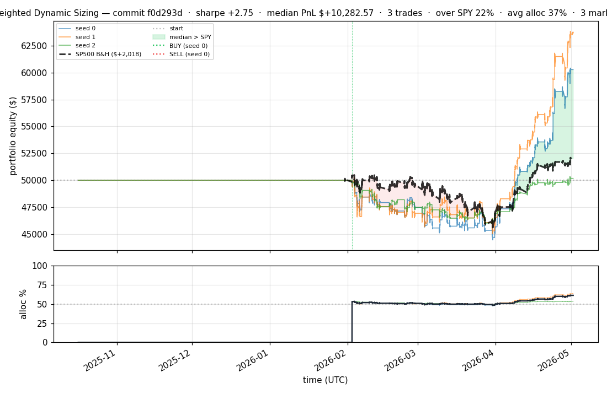
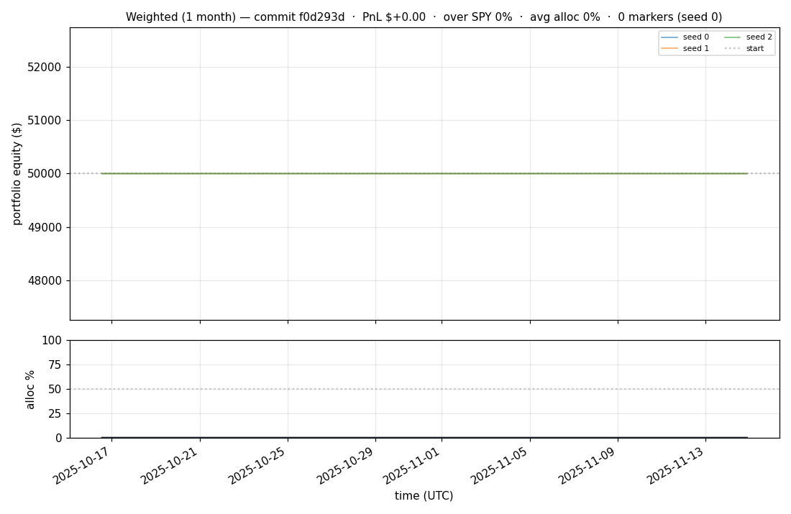
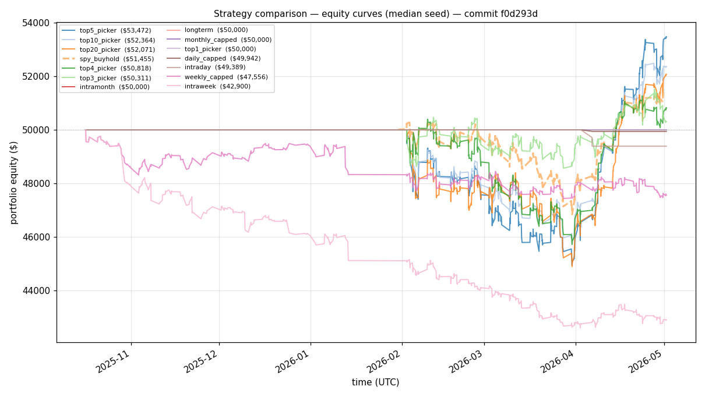

# iter 115 — f0d293d

**🟢 KEEP** · exp115: quarter universe top4 readiness

_2026-05-04 06:02 UTC · 381s wall_

## Result

| metric | value |
|---|---|
| Sharpe (median) | **+2.747** |
| Sharpe CI low (5%) | +0.505 |
| Sharpe CI high (95%) | +5.601 |
| % time above SPY | 22.106% |
| Net PnL | **$+10282.57** (+20.565%) |
| Max drawdown | -11.30% |
| Trades | 3 |
| Fees | $3.00 |
| Seeds completed | 3 |

**Decision reason:** objective=+0.5271 > prior best -0.3043 (ci_low=+0.5050, over_spy=22.1%)

## Per-seed details

```
[evaluator] seed 0: sharpe=+2.747  dd=-11.30%  pnl=$+10,282.57  trades=3
[evaluator] seed 1: sharpe=+3.218  dd=-10.35%  pnl=$+13,686.68  trades=3
[evaluator] seed 2: sharpe=+0.133  dd=-8.09%  pnl=$+172.53  trades=3
```

## Equity curve (full eval window, ~73 days)



## Equity curve (first month)



## Strategy comparison (equity curves)

Overlays every profile (intraday/intraweek/intramonth/longterm + 
daily-capped/weekly-capped/monthly-capped trade-frequency variants 
+ topN pickers + SPY benchmark) on one chart, using the median-seed run.



## Trader profile comparison

Same trained model, different time-horizon strategies + SPY benchmark + passive top-N pickers.

| profile | sharpe | PnL ($) | PnL % | trades | DD % | horizon |
|---|---:|---:|---:|---:|---:|---:|
| **daily_capped** | -2.005 | $-58.28 | -0.12% | 2 | -0.12% | 1d |
| **intraday** | -12.965 | $-24,204.37 | -48.41% | 5210 | -48.41% | 2h |
| **intramonth** | -0.920 | $-99.24 | -0.20% | 2 | -0.23% | 30d |
| **intraweek** | -4.723 | $-8,460.17 | -16.92% | 981 | -17.64% | 5d |
| **longterm** | +0.000 | $+0.00 | +0.00% | 2 | -0.23% | 30d |
| **monthly_capped** | +0.000 | $+0.00 | +0.00% | 0 | +0.00% | 30d |
| **spy_buyhold** | +0.999 | $+1,437.18 | +2.87% | 1 | -6.95% | - |
| **top10_picker** | +1.244 | $+3,337.96 | +6.68% | 9 | -10.75% | - |
| **top1_picker** | +0.000 | $+0.00 | +0.00% | 0 | +0.00% | - |
| **top20_picker** | +0.939 | $+2,052.26 | +4.10% | 19 | -10.30% | - |
| **top3_picker** | +2.288 | $+13,589.53 | +27.18% | 2 | -10.49% | - |
| **top4_picker** | +0.392 | $+760.58 | +1.52% | 3 | -9.49% | - |
| **top5_picker** | +1.455 | $+5,320.34 | +10.64% | 4 | -10.26% | - |
| **weekly_capped** | -1.634 | $-2,486.75 | -4.97% | 88 | -6.16% | 5d |

**Best active strategy: `top3_picker` (sharpe +2.288) — BEATS SPY ✓**

## Out-of-symbol holdout eval

Tested on **JPM, WMT, V, DIS, JNJ** — large-caps the model NEVER saw during training.

| seed | sharpe | PnL | trades | DD% |
|---:|---:|---:|---:|---:|
| 0 | +0.212 | $+223.49 | 5 | -6.67% |
| 1 | -0.143 | $-279.59 | 11 | -6.18% |
| 2 | +0.212 | $+223.49 | 5 | -6.67% |
| 3 | +0.327 | $+504.54 | 5 | -9.19% |
| 4 | +0.000 | $+0.00 | 0 | +0.00% |

**Median holdout sharpe: +0.212** (vs in-symbol +2.747)

## Transactions

_(no profitable per-seed transaction table; losing/flat seeds omitted)_

## Diff vs previous experiment

```diff
f0d293d exp115: quarter universe top4 readiness


 experiment.py | 6 +++---
 1 file changed, 3 insertions(+), 3 deletions(-)
```

---

[← all iterations](.) · [back to README](../README.md)
