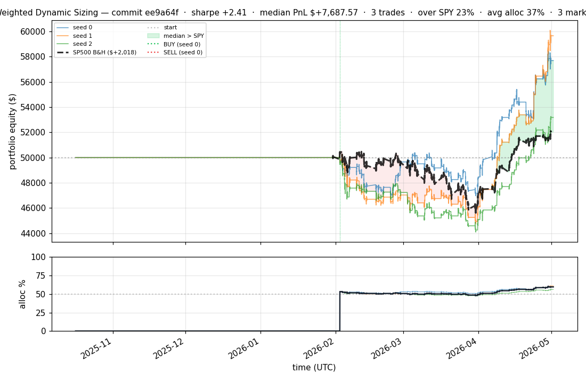
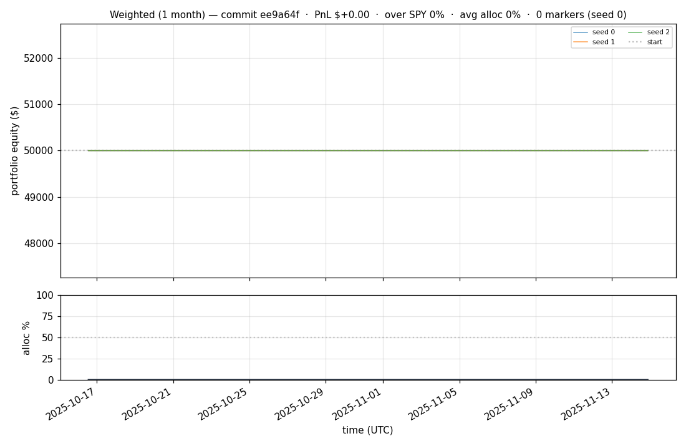
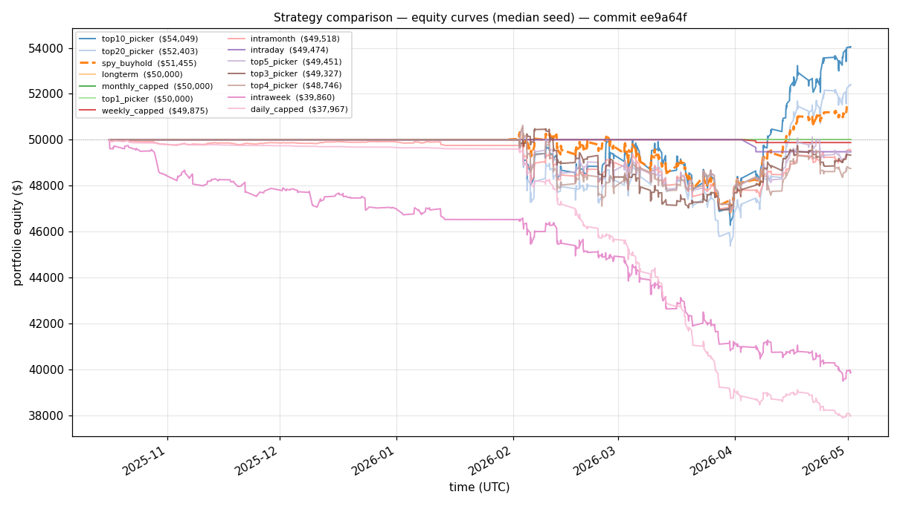
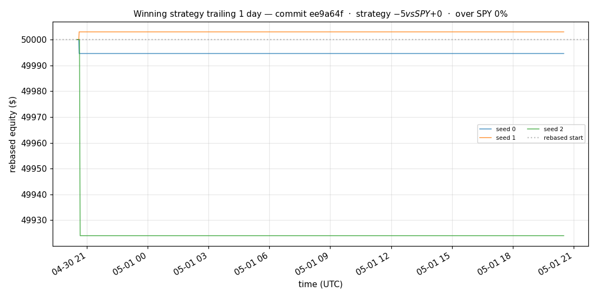
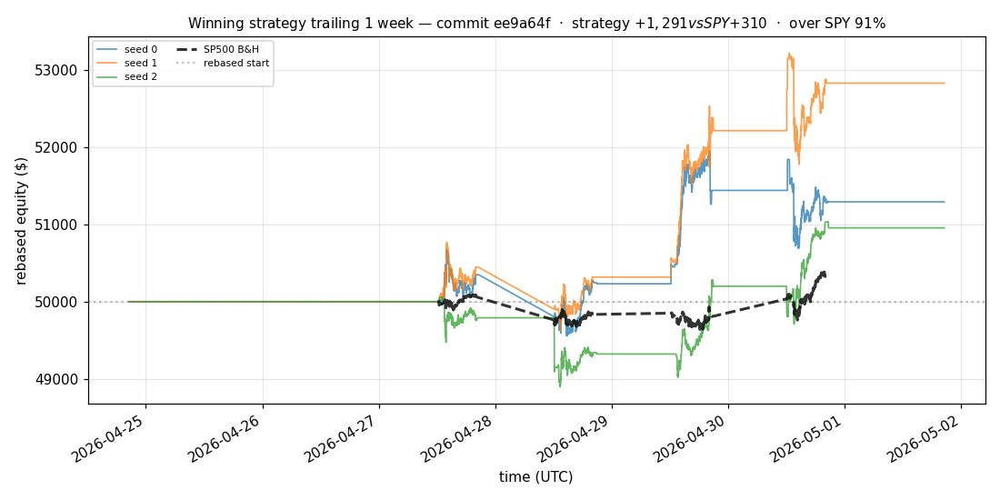
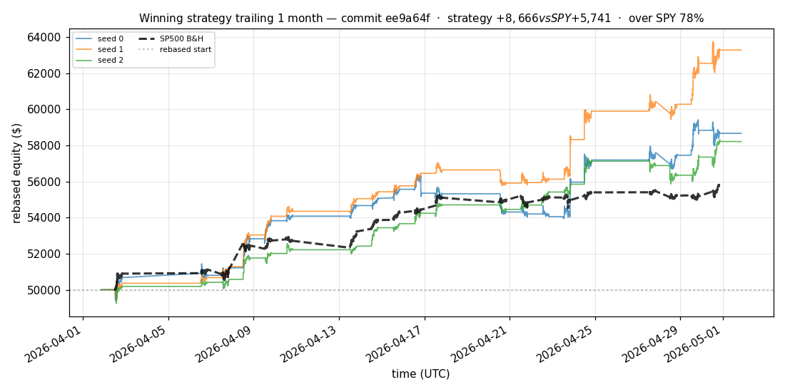
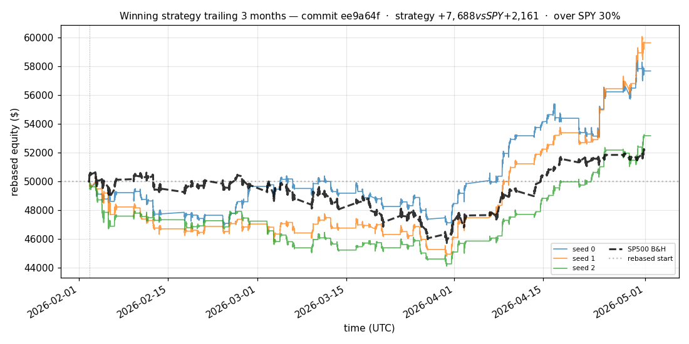
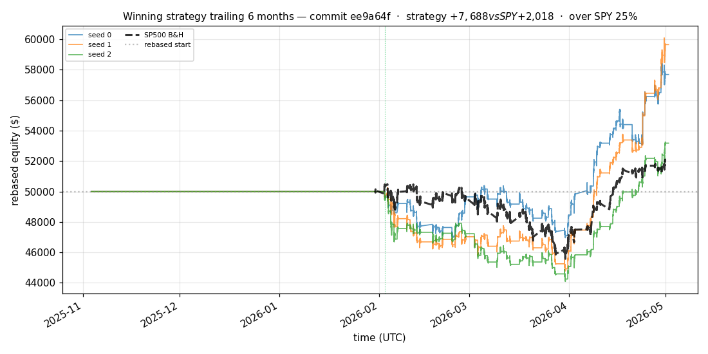

# iter 117 — ee9a64f

**🔴 DISCARD** · exp117: add SPY regime features and live windows

_2026-05-04 09:06 UTC · 10409s wall_

## Result

| metric | value |
|---|---|
| Sharpe (median) | **+2.413** |
| Sharpe CI low (5%) | +0.001 |
| Sharpe CI high (95%) | +4.872 |
| % time above SPY | 22.910% |
| Net PnL | **$+7687.57** (+15.375%) |
| Max drawdown | -11.82% |
| Trades | 3 |
| Fees | $3.00 |
| Seeds completed | 3 |

**Decision reason:** objective=+0.0239 ≤ prior best +0.5271 (ci_low=+0.0010, over_spy=22.9%)

## Winning strategy

Canonical strategy for this iteration: **top4 cross-sectional picker** — rank symbols by the transformer's 4h + 1d forecast Sharpe, buy the top four once enough symbols are ready, hold through the eval window, and keep 3 median trades after costs.

A **seed** is one independent training/evaluation run with a different random initialization and sampling path. The gate uses median/worst-tail statistics across seeds so one lucky seed cannot define the best checkpoint.

Positive seed transaction tables are shown later in this report; losing or flat seed transaction tables are omitted to keep reports focused on actionable winners.

## Per-seed details

```
[evaluator] seed 0: sharpe=+2.413  dd=-6.81%  pnl=$+7,687.57  trades=3
[evaluator] seed 1: sharpe=+2.793  dd=-10.91%  pnl=$+9,649.23  trades=3
[evaluator] seed 2: sharpe=+1.261  dd=-11.82%  pnl=$+3,176.68  trades=3
```

## Equity curve (full eval window, ~73 days)



## Equity curve (first month)



## Strategy comparison (equity curves)

Overlays every profile (intraday/intraweek/intramonth/longterm + 
daily-capped/weekly-capped/monthly-capped trade-frequency variants 
+ topN pickers + SPY benchmark) on one chart, using the median-seed run.



## Recent live-style simulations vs SP500

Each chart rebases the winning strategy and SP500 to $50,000 at the start of the trailing window, ending at the latest available bar.

### Trailing 1 day



### Trailing 1 week



### Trailing 1 month



### Trailing 3 months



### Trailing 6 months



## Trader profile comparison

Same trained model, different time-horizon strategies + SPY benchmark + passive top-N pickers.

| profile | sharpe | PnL ($) | PnL % | trades | DD % | horizon |
|---|---:|---:|---:|---:|---:|---:|
| **daily_capped** | -11.989 | $-12,064.44 | -24.13% | 6493 | -24.37% | 1d |
| **intraday** | -12.965 | $-29,665.61 | -59.33% | 5210 | -59.33% | 2h |
| **intramonth** | -1.022 | $-529.32 | -1.06% | 6 | -1.10% | 30d |
| **intraweek** | -5.616 | $-11,145.23 | -22.29% | 1595 | -22.75% | 5d |
| **longterm** | +0.000 | $+0.00 | +0.00% | 6 | -1.10% | 30d |
| **monthly_capped** | +0.000 | $+0.00 | +0.00% | 6 | -1.10% | 30d |
| **spy_buyhold** | +0.999 | $+1,437.18 | +2.87% | 1 | -6.95% | - |
| **top10_picker** | +1.591 | $+4,025.84 | +8.05% | 9 | -11.27% | - |
| **top1_picker** | +0.000 | $+0.00 | +0.00% | 0 | +0.00% | - |
| **top20_picker** | +1.058 | $+2,384.10 | +4.77% | 19 | -9.35% | - |
| **top3_picker** | +0.875 | $+2,041.58 | +4.08% | 2 | -10.02% | - |
| **top4_picker** | -0.517 | $-1,253.51 | -2.51% | 3 | -9.15% | - |
| **top5_picker** | +0.849 | $+2,236.90 | +4.47% | 4 | -11.45% | - |
| **weekly_capped** | -1.785 | $-125.06 | -0.25% | 130 | -8.36% | 5d |

**Best active strategy: `top10_picker` (sharpe +1.591) — BEATS SPY ✓**

## Out-of-symbol holdout eval

Tested on **JPM, WMT, V, DIS, JNJ** — large-caps the model NEVER saw during training.

| seed | sharpe | PnL | trades | DD% |
|---:|---:|---:|---:|---:|
| 0 | +0.000 | $+0.00 | 0 | +0.00% |
| 1 | -64.643 | $-23,913.24 | 5030 | -47.83% |
| 2 | +0.174 | $+168.75 | 9 | -6.68% |
| 3 | +0.327 | $+504.54 | 5 | -9.19% |
| 4 | +0.000 | $+0.00 | 0 | +0.00% |

**Median holdout sharpe: +0.000** (vs in-symbol +2.413)

## Transactions

_(no profitable per-seed transaction table; losing/flat seeds omitted)_

## Diff vs previous experiment

```diff
ee9a64f exp117: add SPY regime features and live windows


 autoresearch_driver.py | 38 +++++++++++++++++++
 evaluator.py           | 99 ++++++++++++++++++++++++++++++++++++++++++++++++++
 experiment.py          | 65 ++++++++++++++++++++++++++++-----
 3 files changed, 192 insertions(+), 10 deletions(-)
```

---

[← all iterations](.) · [back to README](../README.md)
