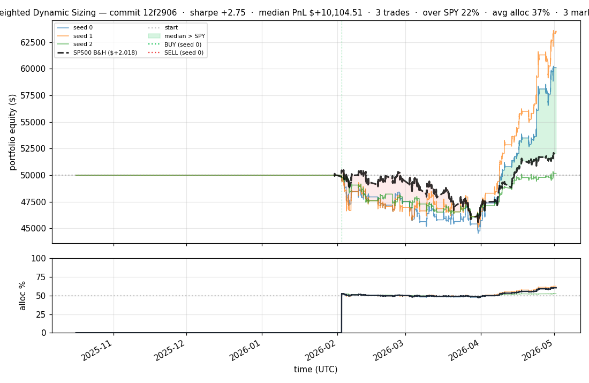
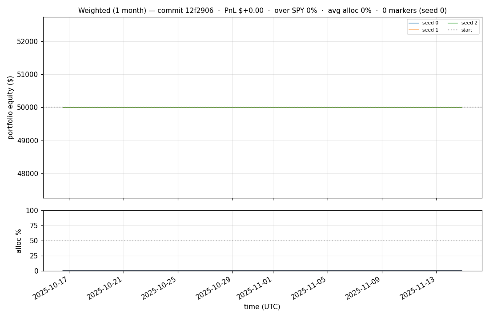
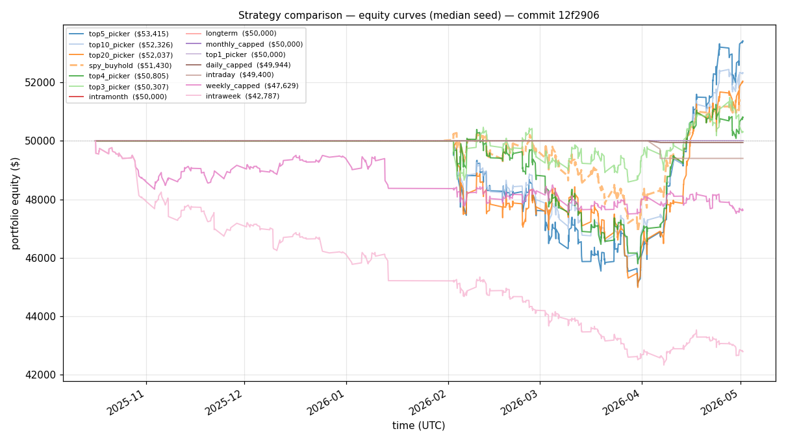
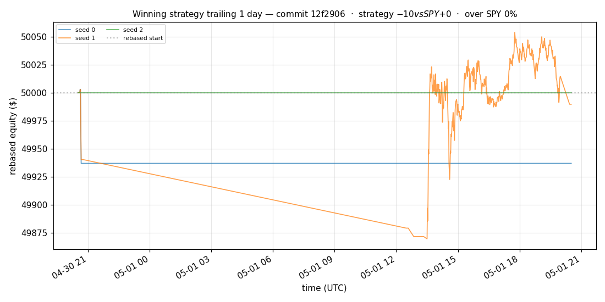
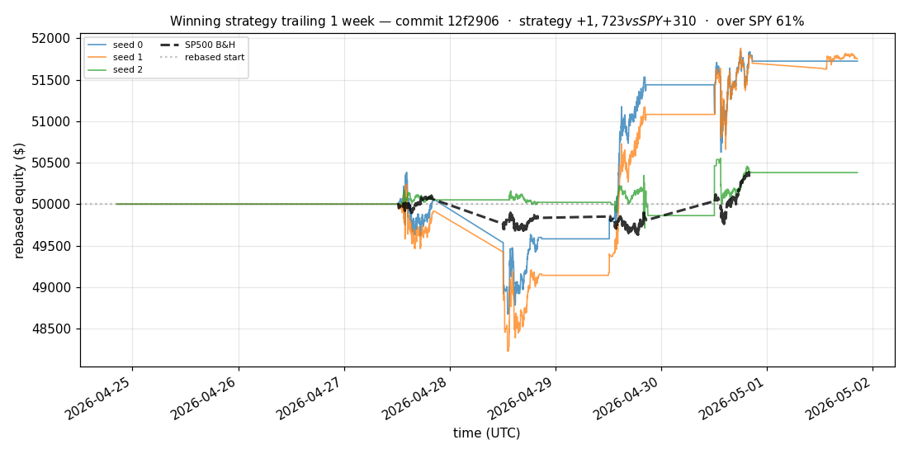
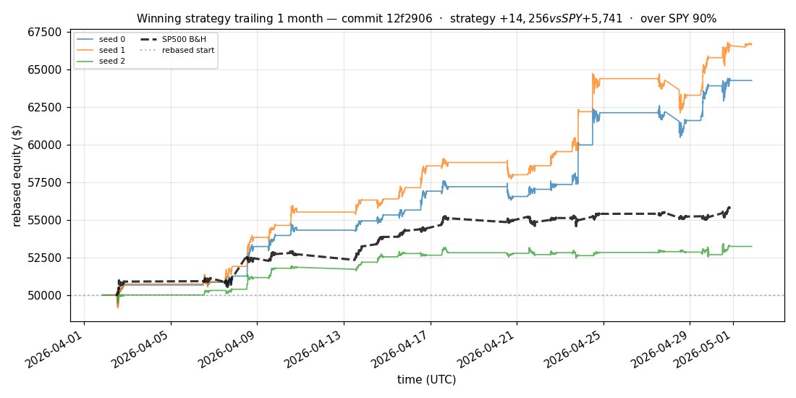
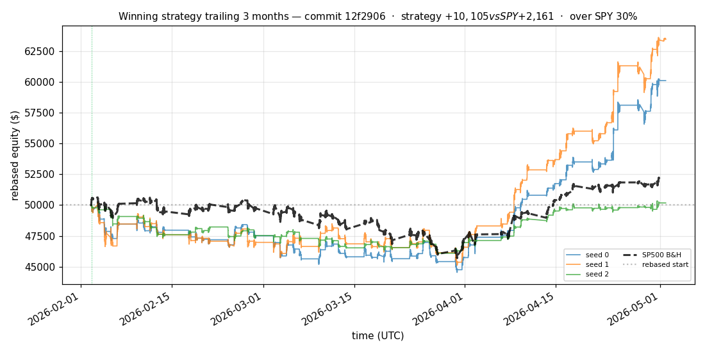
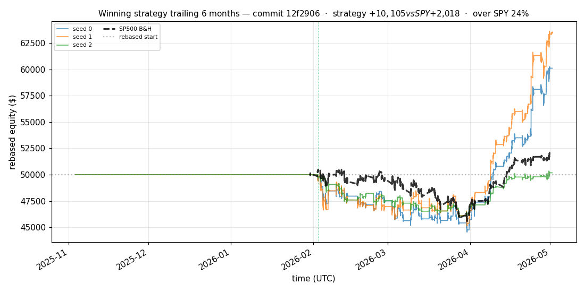

# iter 118 — 12f2906

**🟢 KEEP** · exp118: quarter readiness with 30pct reserve

_2026-05-04 12:35 UTC · 376s wall_

## Result

| metric | value |
|---|---|
| Sharpe (median) | **+2.750** |
| Sharpe CI low (5%) | +0.506 |
| Sharpe CI high (95%) | +5.605 |
| % time above SPY | 22.312% |
| Net PnL | **$+10104.51** (+20.209%) |
| Max drawdown | -11.11% |
| Trades | 3 |
| Fees | $3.00 |
| Seeds completed | 3 |

**Decision reason:** objective=+0.5283 > prior best +0.5271 (ci_low=+0.5060, over_spy=22.3%)

## Winning strategy

Canonical strategy for this iteration: **top4 cross-sectional picker** — rank symbols by the transformer's 4h + 1d forecast Sharpe, buy the top four once enough symbols are ready, hold through the eval window, and keep 3 median trades after costs.

A **seed** is one independent training/evaluation run with a different random initialization and sampling path. The gate uses median/worst-tail statistics across seeds so one lucky seed cannot define the best checkpoint.

Positive seed transaction tables are shown later in this report; losing or flat seed transaction tables are omitted to keep reports focused on actionable winners.

## Per-seed details

```
[evaluator] seed 0: sharpe=+2.750  dd=-11.11%  pnl=$+10,104.51  trades=3
[evaluator] seed 1: sharpe=+3.222  dd=-10.17%  pnl=$+13,448.90  trades=3
[evaluator] seed 2: sharpe=+0.134  dd=-7.95%  pnl=$+173.67  trades=3
```

## Equity curve (full eval window, ~73 days)



## Equity curve (first month)



## Strategy comparison (equity curves)

Overlays every profile (intraday/intraweek/intramonth/longterm + 
daily-capped/weekly-capped/monthly-capped trade-frequency variants 
+ topN pickers + SPY benchmark) on one chart, using the median-seed run.



## Recent live-style simulations vs SP500

Each chart rebases the winning strategy and SP500 to $50,000 at the start of the trailing window, ending at the latest available bar.

### Trailing 1 day



### Trailing 1 week



### Trailing 1 month



### Trailing 3 months



### Trailing 6 months



## Trader profile comparison

Same trained model, different time-horizon strategies + SPY benchmark + passive top-N pickers.

| profile | sharpe | PnL ($) | PnL % | trades | DD % | horizon |
|---|---:|---:|---:|---:|---:|---:|
| **daily_capped** | -2.004 | $-56.48 | -0.11% | 2 | -0.11% | 1d |
| **intraday** | -12.965 | $-23,984.98 | -47.97% | 5210 | -47.97% | 2h |
| **intramonth** | -0.903 | $-94.66 | -0.19% | 2 | -0.22% | 30d |
| **intraweek** | -4.723 | $-8,181.74 | -16.36% | 981 | -17.18% | 5d |
| **longterm** | +0.000 | $+0.00 | +0.00% | 2 | -0.22% | 30d |
| **monthly_capped** | +0.000 | $+0.00 | +0.00% | 0 | +0.00% | 30d |
| **spy_buyhold** | +0.999 | $+1,411.96 | +2.82% | 1 | -6.83% | - |
| **top10_picker** | +1.244 | $+3,337.96 | +6.68% | 9 | -10.56% | - |
| **top1_picker** | +0.000 | $+0.00 | +0.00% | 0 | +0.00% | - |
| **top20_picker** | +0.940 | $+2,018.33 | +4.04% | 19 | -10.12% | - |
| **top3_picker** | +2.288 | $+13,589.53 | +27.18% | 2 | -10.31% | - |
| **top4_picker** | +0.392 | $+748.54 | +1.50% | 3 | -9.33% | - |
| **top5_picker** | +1.455 | $+5,320.34 | +10.64% | 4 | -10.07% | - |
| **weekly_capped** | -1.621 | $-2,412.31 | -4.82% | 88 | -6.06% | 5d |

**Best active strategy: `top3_picker` (sharpe +2.288) — BEATS SPY ✓**

## Out-of-symbol holdout eval

Tested on **JPM, WMT, V, DIS, JNJ** — large-caps the model NEVER saw during training.

| seed | sharpe | PnL | trades | DD% |
|---:|---:|---:|---:|---:|
| 0 | +0.215 | $+225.62 | 5 | -6.56% |
| 1 | -0.133 | $-260.23 | 11 | -6.08% |
| 2 | +0.215 | $+225.62 | 5 | -6.56% |
| 3 | +0.327 | $+504.54 | 5 | -9.19% |
| 4 | +0.000 | $+0.00 | 0 | +0.00% |

**Median holdout sharpe: +0.215** (vs in-symbol +2.750)

## Transactions

_(no profitable per-seed transaction table; losing/flat seeds omitted)_

## Diff vs previous experiment

```diff
12f2906 exp118: quarter readiness with 30pct reserve


 experiment.py | 63 +++++++++--------------------------------------------------
 1 file changed, 9 insertions(+), 54 deletions(-)
```

---

[← all iterations](.) · [back to README](../README.md)
