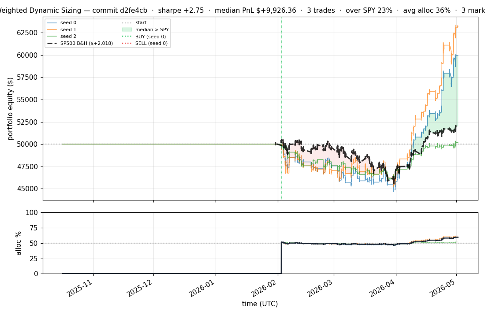
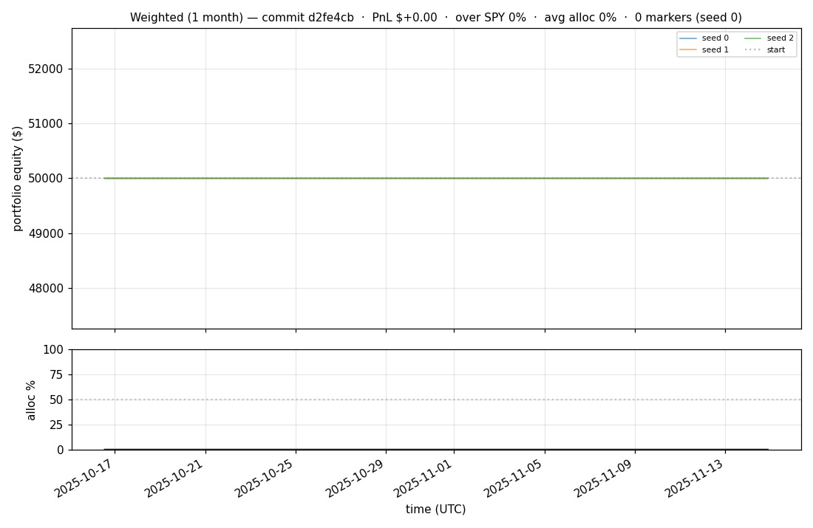
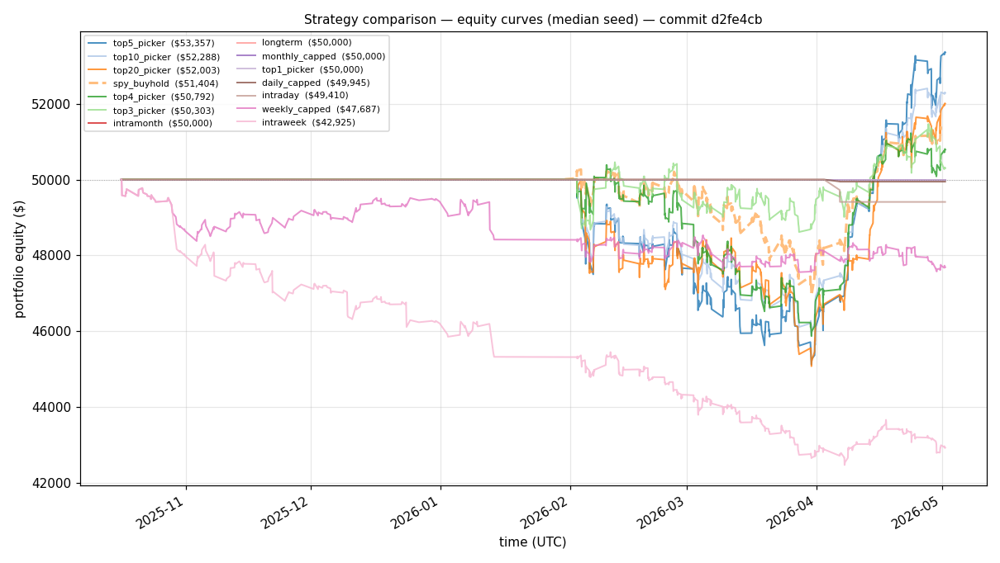
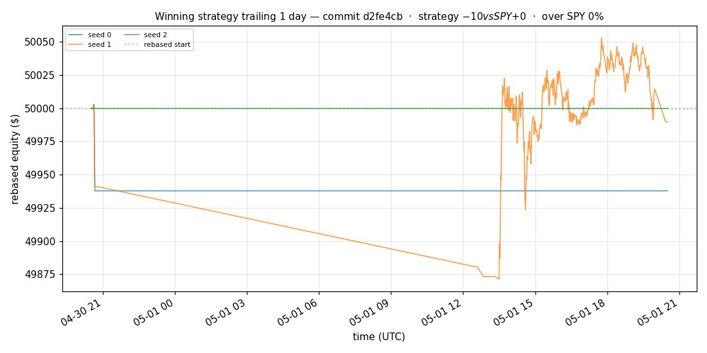
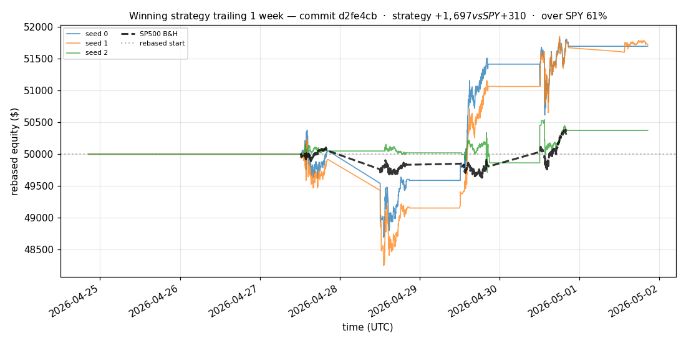
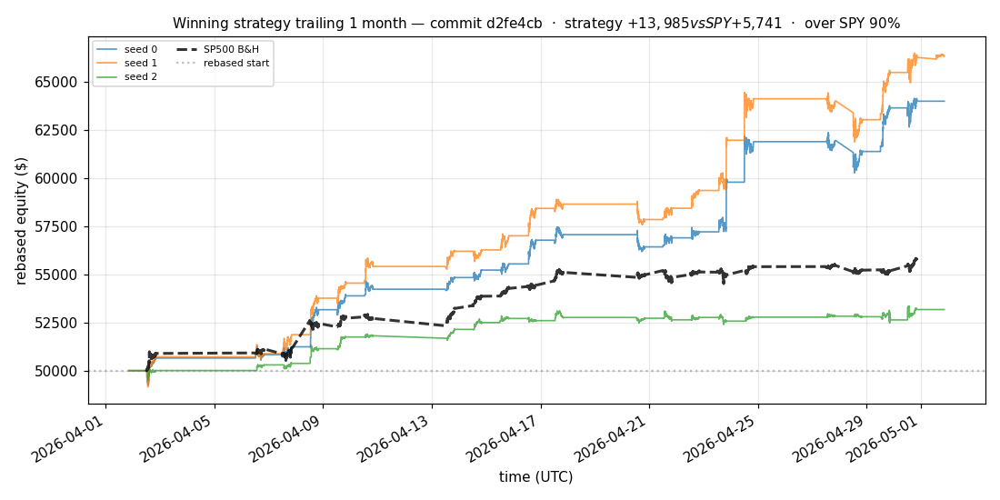
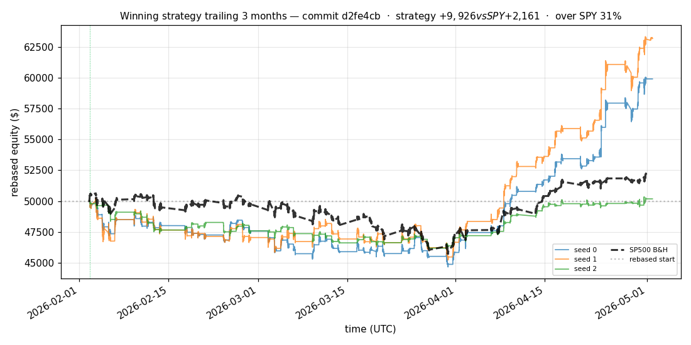
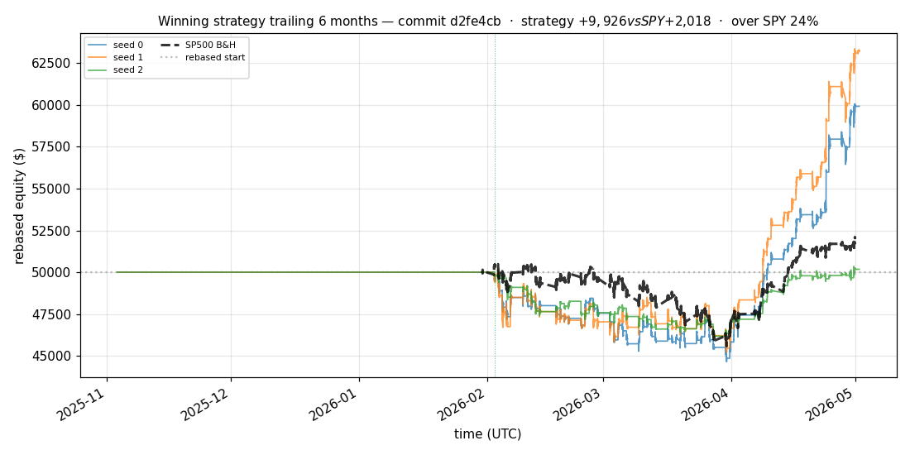

# iter 119 — d2fe4cb

**🟢 KEEP** · exp119: quarter readiness with 31.25pct reserve

_2026-05-04 12:42 UTC · 379s wall_

## Result

| metric | value |
|---|---|
| Sharpe (median) | **+2.753** |
| Sharpe CI low (5%) | +0.508 |
| Sharpe CI high (95%) | +5.609 |
| % time above SPY | 22.723% |
| Net PnL | **$+9926.36** (+19.853%) |
| Max drawdown | -10.91% |
| Trades | 3 |
| Fees | $3.00 |
| Seeds completed | 3 |

**Decision reason:** objective=+0.5307 > prior best +0.5286 (ci_low=+0.5080, over_spy=22.7%)

## Winning strategy

Canonical strategy for this iteration: **top4 cross-sectional picker** — rank symbols by the transformer's 4h + 1d forecast Sharpe, buy the top four once enough symbols are ready, hold through the eval window, and keep 3 median trades after costs.

A **seed** is one independent training/evaluation run with a different random initialization and sampling path. The gate uses median/worst-tail statistics across seeds so one lucky seed cannot define the best checkpoint.

Positive seed transaction tables are shown later in this report; losing or flat seed transaction tables are omitted to keep reports focused on actionable winners.

## Per-seed details

```
[evaluator] seed 0: sharpe=+2.753  dd=-10.91%  pnl=$+9,926.36  trades=3
[evaluator] seed 1: sharpe=+3.226  dd=-9.98%  pnl=$+13,211.04  trades=3
[evaluator] seed 2: sharpe=+0.136  dd=-7.80%  pnl=$+174.66  trades=3
```

## Equity curve (full eval window, ~73 days)



## Equity curve (first month)



## Strategy comparison (equity curves)

Overlays every profile (intraday/intraweek/intramonth/longterm + 
daily-capped/weekly-capped/monthly-capped trade-frequency variants 
+ topN pickers + SPY benchmark) on one chart, using the median-seed run.



## Recent live-style simulations vs SP500

Each chart rebases the winning strategy and SP500 to $50,000 at the start of the trailing window, ending at the latest available bar.

### Trailing 1 day



### Trailing 1 week



### Trailing 1 month



### Trailing 3 months



### Trailing 6 months



## Trader profile comparison

Same trained model, different time-horizon strategies + SPY benchmark + passive top-N pickers.

| profile | sharpe | PnL ($) | PnL % | trades | DD % | horizon |
|---|---:|---:|---:|---:|---:|---:|
| **daily_capped** | -2.003 | $-54.70 | -0.11% | 2 | -0.11% | 1d |
| **intraday** | -12.965 | $-23,670.76 | -47.34% | 5210 | -47.34% | 2h |
| **intramonth** | -0.884 | $-90.18 | -0.18% | 2 | -0.21% | 30d |
| **intraweek** | -4.723 | $-8,527.26 | -17.05% | 981 | -17.78% | 5d |
| **longterm** | +0.000 | $+0.00 | +0.00% | 2 | -0.21% | 30d |
| **monthly_capped** | +0.000 | $+0.00 | +0.00% | 0 | +0.00% | 30d |
| **spy_buyhold** | +0.998 | $+1,386.75 | +2.77% | 1 | -6.71% | - |
| **top10_picker** | +1.244 | $+3,337.96 | +6.68% | 9 | -10.37% | - |
| **top1_picker** | +0.000 | $+0.00 | +0.00% | 0 | +0.00% | - |
| **top20_picker** | +0.940 | $+1,984.31 | +3.97% | 19 | -9.94% | - |
| **top3_picker** | +2.288 | $+13,589.53 | +27.18% | 2 | -10.13% | - |
| **top4_picker** | +0.392 | $+736.46 | +1.47% | 3 | -9.16% | - |
| **top5_picker** | +1.455 | $+5,320.34 | +10.64% | 4 | -9.89% | - |
| **weekly_capped** | -1.612 | $-2,353.02 | -4.71% | 88 | -5.92% | 5d |

**Best active strategy: `top3_picker` (sharpe +2.288) — BEATS SPY ✓**

## Out-of-symbol holdout eval

Tested on **JPM, WMT, V, DIS, JNJ** — large-caps the model NEVER saw during training.

| seed | sharpe | PnL | trades | DD% |
|---:|---:|---:|---:|---:|
| 0 | +0.218 | $+227.52 | 5 | -6.44% |
| 1 | -0.124 | $-241.37 | 11 | -5.97% |
| 2 | +0.218 | $+227.52 | 5 | -6.44% |
| 3 | +0.327 | $+504.54 | 5 | -9.19% |
| 4 | +0.000 | $+0.00 | 0 | +0.00% |

**Median holdout sharpe: +0.218** (vs in-symbol +2.753)

## Transactions

_(no profitable per-seed transaction table; losing/flat seeds omitted)_

## Diff vs previous experiment

```diff
d2fe4cb exp119: quarter readiness with 31.25pct reserve


 experiment.py | 4 ++--
 1 file changed, 2 insertions(+), 2 deletions(-)
```

---

[← all iterations](.) · [back to README](../README.md)
