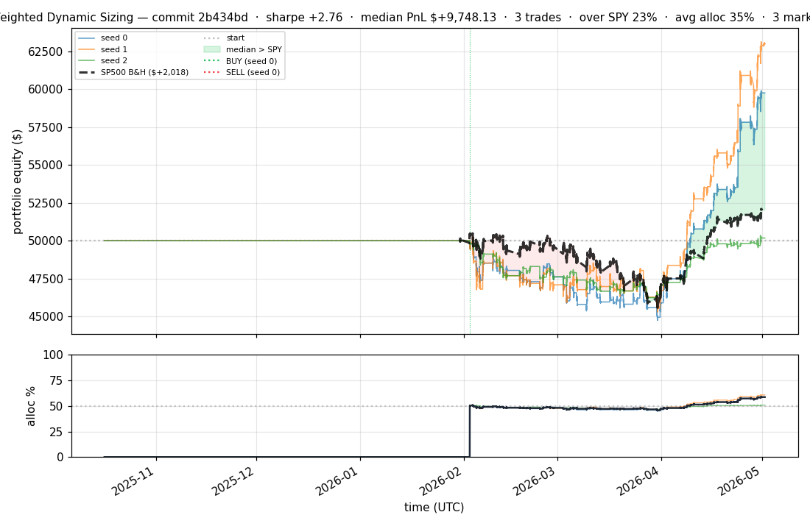
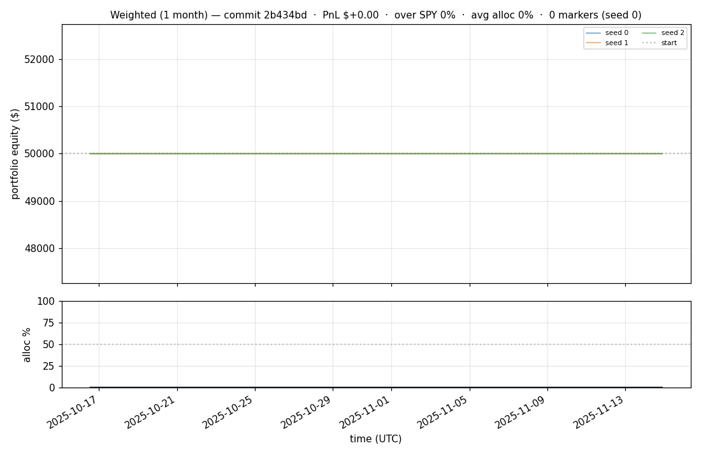
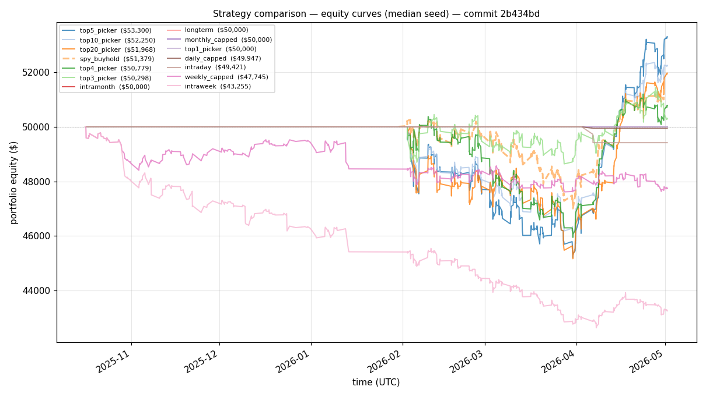
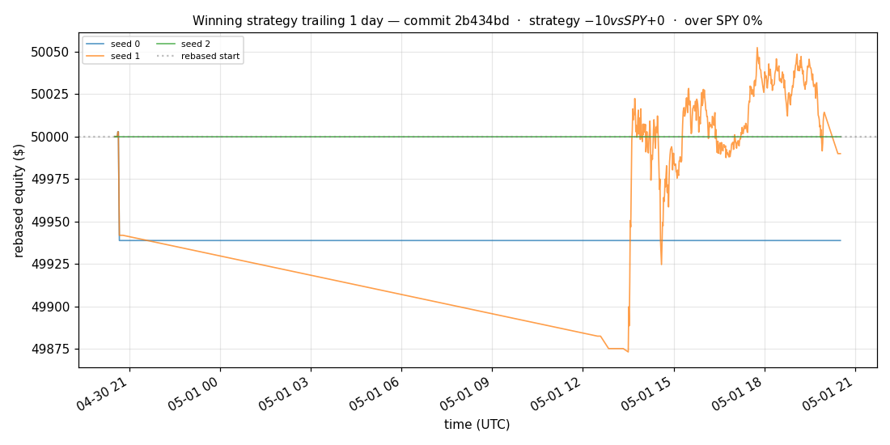
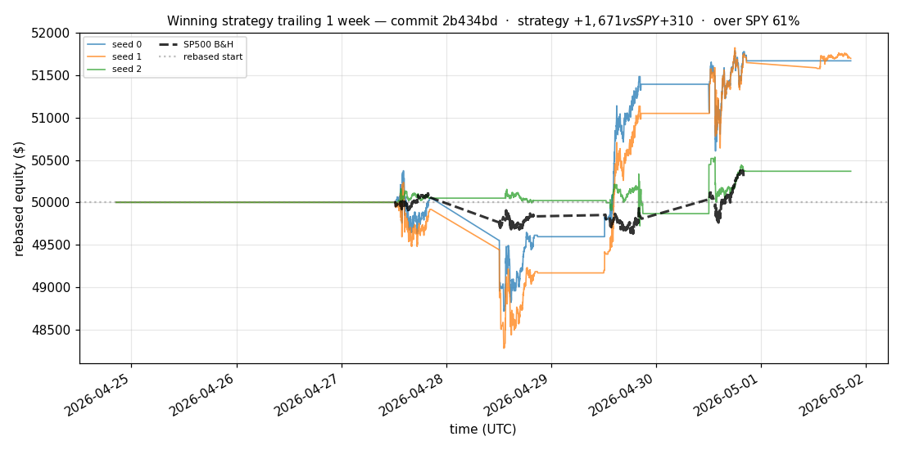
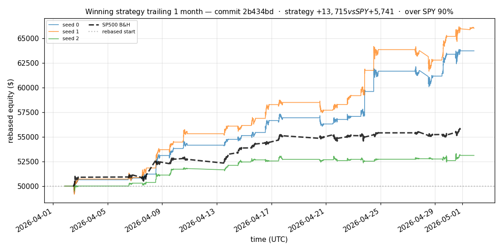
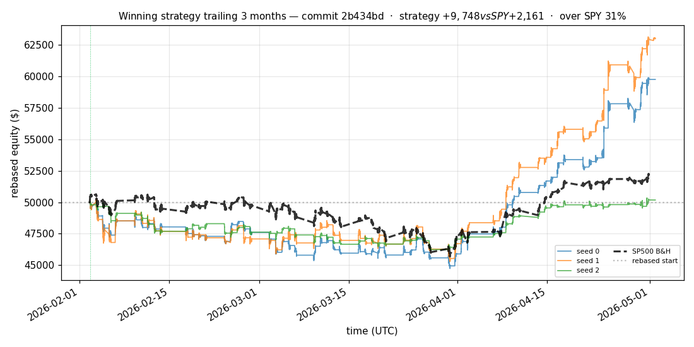
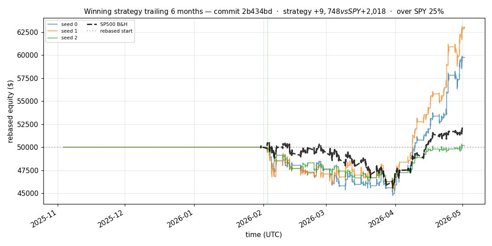

# iter 120 — 2b434bd

**🟢 KEEP** · exp120: quarter readiness with 32.5pct reserve

_2026-05-04 12:49 UTC · 381s wall_

## Result

| metric | value |
|---|---|
| Sharpe (median) | **+2.755** |
| Sharpe CI low (5%) | +0.509 |
| Sharpe CI high (95%) | +5.612 |
| % time above SPY | 23.398% |
| Net PnL | **$+9748.13** (+19.496%) |
| Max drawdown | -10.71% |
| Trades | 3 |
| Fees | $3.00 |
| Seeds completed | 3 |

**Decision reason:** objective=+0.5324 > prior best +0.5304 (ci_low=+0.5090, over_spy=23.4%)

## Winning strategy

Canonical strategy for this iteration: **top4 cross-sectional picker** — rank symbols by the transformer's 4h + 1d forecast Sharpe, buy the top four once enough symbols are ready, hold through the eval window, and keep 3 median trades after costs.

A **seed** is one independent training/evaluation run with a different random initialization and sampling path. The gate uses median/worst-tail statistics across seeds so one lucky seed cannot define the best checkpoint.

Positive seed transaction tables are shown later in this report; losing or flat seed transaction tables are omitted to keep reports focused on actionable winners.

## Per-seed details

```
[evaluator] seed 0: sharpe=+2.755  dd=-10.71%  pnl=$+9,748.13  trades=3
[evaluator] seed 1: sharpe=+3.230  dd=-9.80%  pnl=$+12,973.09  trades=3
[evaluator] seed 2: sharpe=+0.137  dd=-7.66%  pnl=$+175.51  trades=3
```

## Equity curve (full eval window, ~73 days)



## Equity curve (first month)



## Strategy comparison (equity curves)

Overlays every profile (intraday/intraweek/intramonth/longterm + 
daily-capped/weekly-capped/monthly-capped trade-frequency variants 
+ topN pickers + SPY benchmark) on one chart, using the median-seed run.



## Recent live-style simulations vs SP500

Each chart rebases the winning strategy and SP500 to $50,000 at the start of the trailing window, ending at the latest available bar.

### Trailing 1 day



### Trailing 1 week



### Trailing 1 month



### Trailing 3 months



### Trailing 6 months



## Trader profile comparison

Same trained model, different time-horizon strategies + SPY benchmark + passive top-N pickers.

| profile | sharpe | PnL ($) | PnL % | trades | DD % | horizon |
|---|---:|---:|---:|---:|---:|---:|
| **daily_capped** | -2.002 | $-52.96 | -0.11% | 2 | -0.11% | 1d |
| **intraday** | -12.965 | $-23,380.93 | -46.76% | 5210 | -46.76% | 2h |
| **intramonth** | -0.865 | $-85.80 | -0.17% | 2 | -0.21% | 30d |
| **intraweek** | -4.723 | $-8,421.34 | -16.84% | 981 | -17.56% | 5d |
| **longterm** | +0.000 | $+0.00 | +0.00% | 2 | -0.21% | 30d |
| **monthly_capped** | +0.000 | $+0.00 | +0.00% | 0 | +0.00% | 30d |
| **spy_buyhold** | +0.998 | $+1,361.53 | +2.72% | 1 | -6.59% | - |
| **top10_picker** | +1.244 | $+3,337.96 | +6.68% | 9 | -10.19% | - |
| **top1_picker** | +0.000 | $+0.00 | +0.00% | 0 | +0.00% | - |
| **top20_picker** | +0.941 | $+1,950.20 | +3.90% | 19 | -9.75% | - |
| **top3_picker** | +2.288 | $+13,589.53 | +27.18% | 2 | -9.94% | - |
| **top4_picker** | +0.392 | $+724.34 | +1.45% | 3 | -9.00% | - |
| **top5_picker** | +1.455 | $+5,320.34 | +10.64% | 4 | -9.70% | - |
| **weekly_capped** | -1.604 | $-2,294.35 | -4.59% | 88 | -5.83% | 5d |

**Best active strategy: `top3_picker` (sharpe +2.288) — BEATS SPY ✓**

## Out-of-symbol holdout eval

Tested on **JPM, WMT, V, DIS, JNJ** — large-caps the model NEVER saw during training.

| seed | sharpe | PnL | trades | DD% |
|---:|---:|---:|---:|---:|
| 0 | +0.222 | $+229.22 | 5 | -6.33% |
| 1 | -0.115 | $-223.02 | 11 | -5.86% |
| 2 | +0.222 | $+229.22 | 5 | -6.33% |
| 3 | +0.327 | $+504.54 | 5 | -9.19% |
| 4 | +0.000 | $+0.00 | 0 | +0.00% |

**Median holdout sharpe: +0.222** (vs in-symbol +2.755)

## Transactions

_(no profitable per-seed transaction table; losing/flat seeds omitted)_

## Diff vs previous experiment

```diff
2b434bd exp120: quarter readiness with 32.5pct reserve


 experiment.py | 4 ++--
 1 file changed, 2 insertions(+), 2 deletions(-)
```

---

[← all iterations](.) · [back to README](../README.md)
