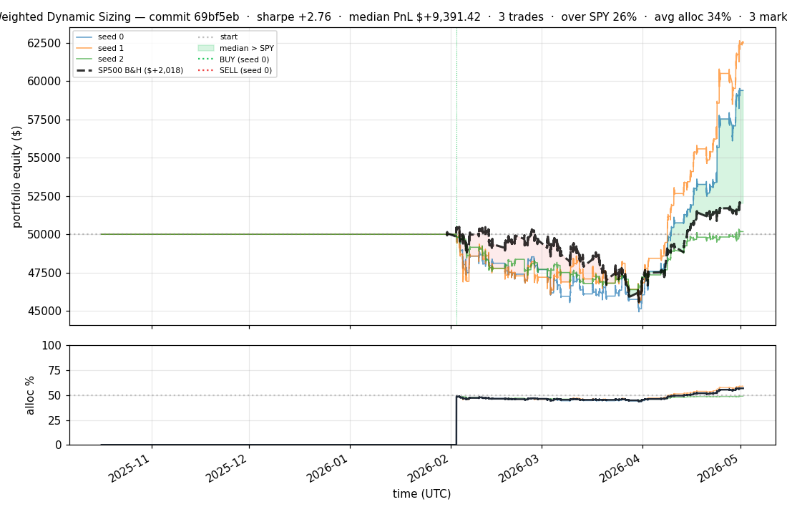
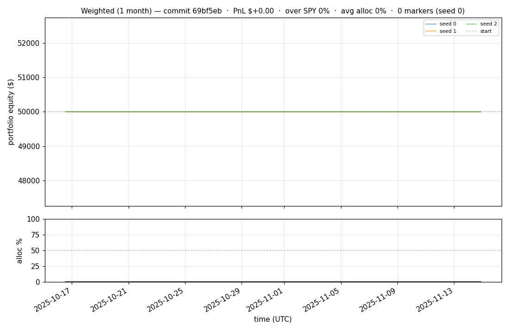
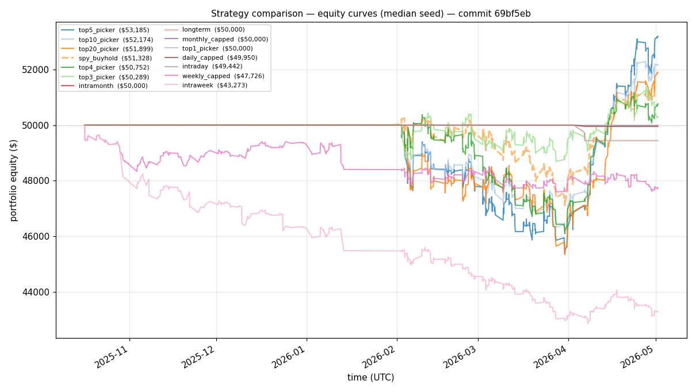
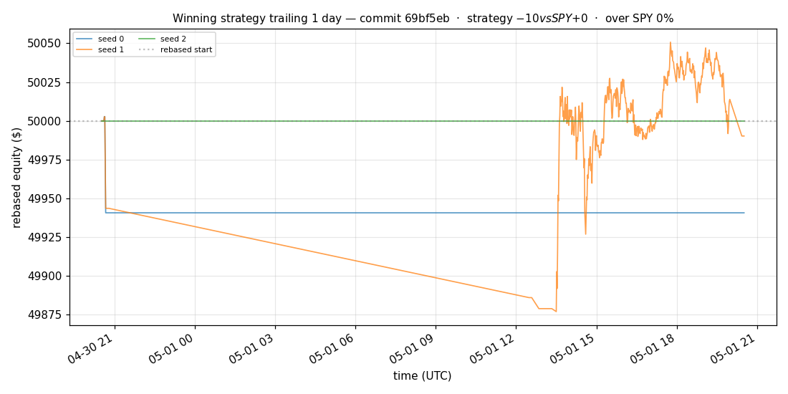
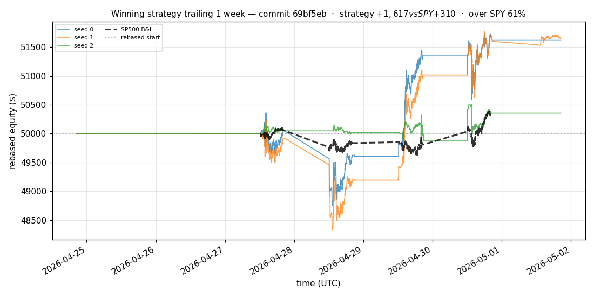
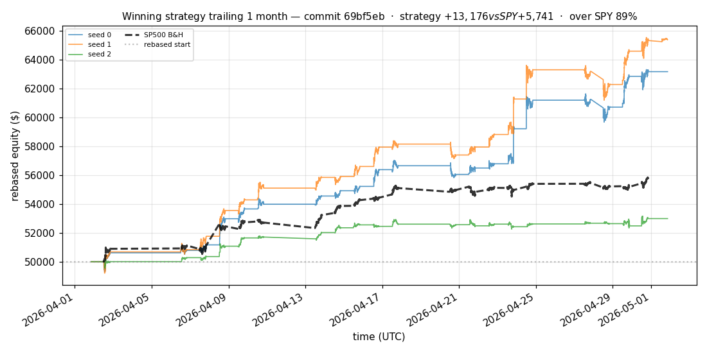
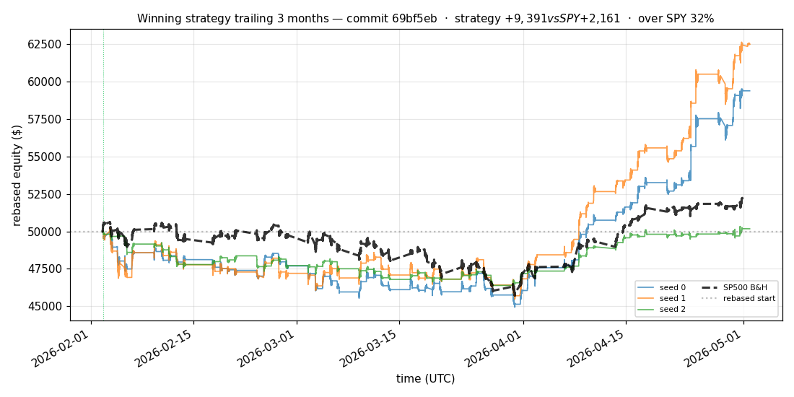
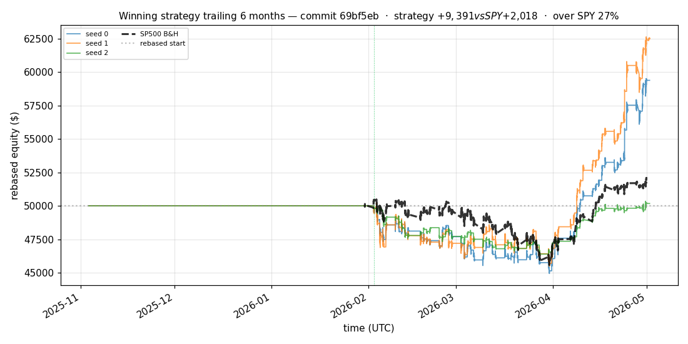

# iter 122 — 69bf5eb

**🟢 KEEP** · exp122: quarter readiness with 35pct reserve

_2026-05-04 21:36 UTC · 391s wall_

## Result

| metric | value |
|---|---|
| Sharpe (median) | **+2.761** |
| Sharpe CI low (5%) | +0.512 |
| Sharpe CI high (95%) | +5.620 |
| % time above SPY | 25.505% |
| Net PnL | **$+9391.42** (+18.783%) |
| Max drawdown | -10.32% |
| Trades | 3 |
| Fees | $3.00 |
| Seeds completed | 3 |

**Decision reason:** objective=+0.5375 > prior best +0.5354 (ci_low=+0.5120, over_spy=25.5%)

## Winning strategy

Canonical strategy for this iteration: **top4 cross-sectional picker** — rank symbols by the transformer's 4h + 1d forecast Sharpe, buy the top four once enough symbols are ready, hold through the eval window, and keep 3 median trades after costs.

A **seed** is one independent training/evaluation run with a different random initialization and sampling path. The gate uses median/worst-tail statistics across seeds so one lucky seed cannot define the best checkpoint.

Positive seed transaction tables are shown later in this report; losing or flat seed transaction tables are omitted to keep reports focused on actionable winners.

## Per-seed details

```
[evaluator] seed 0: sharpe=+2.761  dd=-10.32%  pnl=$+9,391.42  trades=3
[evaluator] seed 1: sharpe=+3.238  dd=-9.44%  pnl=$+12,496.93  trades=3
[evaluator] seed 2: sharpe=+0.140  dd=-7.38%  pnl=$+176.74  trades=3
```

## Equity curve (full eval window, ~73 days)



## Equity curve (first month)



## Strategy comparison (equity curves)

Overlays every profile (intraday/intraweek/intramonth/longterm + 
daily-capped/weekly-capped/monthly-capped trade-frequency variants 
+ topN pickers + SPY benchmark) on one chart, using the median-seed run.



## Recent live-style simulations vs SP500

Each chart rebases the winning strategy and SP500 to $50,000 at the start of the trailing window, ending at the latest available bar.

### Trailing 1 day



### Trailing 1 week



### Trailing 1 month



### Trailing 3 months



### Trailing 6 months



## Trader profile comparison

Same trained model, different time-horizon strategies + SPY benchmark + passive top-N pickers.

| profile | sharpe | PnL ($) | PnL % | trades | DD % | horizon |
|---|---:|---:|---:|---:|---:|---:|
| **daily_capped** | -1.999 | $-49.55 | -0.10% | 2 | -0.10% | 1d |
| **intraday** | -12.965 | $-22,305.52 | -44.61% | 5210 | -44.61% | 2h |
| **intramonth** | -0.826 | $-77.36 | -0.15% | 2 | -0.19% | 30d |
| **intraweek** | -4.723 | $-8,098.98 | -16.20% | 981 | -16.88% | 5d |
| **longterm** | +0.000 | $+0.00 | +0.00% | 2 | -0.19% | 30d |
| **monthly_capped** | +0.000 | $+0.00 | +0.00% | 0 | +0.00% | 30d |
| **spy_buyhold** | +0.997 | $+1,311.10 | +2.62% | 1 | -6.34% | - |
| **top10_picker** | +1.244 | $+3,337.96 | +6.68% | 9 | -9.81% | - |
| **top1_picker** | +0.000 | $+0.00 | +0.00% | 0 | +0.00% | - |
| **top20_picker** | +0.943 | $+1,881.74 | +3.76% | 19 | -9.39% | - |
| **top3_picker** | +2.288 | $+13,589.53 | +27.18% | 2 | -9.58% | - |
| **top4_picker** | +0.391 | $+699.93 | +1.40% | 3 | -8.67% | - |
| **top5_picker** | +1.455 | $+5,320.34 | +10.64% | 4 | -9.34% | - |
| **weekly_capped** | -1.681 | $-2,312.51 | -4.63% | 88 | -5.48% | 5d |

**Best active strategy: `top3_picker` (sharpe +2.288) — BEATS SPY ✓**

## Out-of-symbol holdout eval

Tested on **JPM, WMT, V, DIS, JNJ** — large-caps the model NEVER saw during training.

| seed | sharpe | PnL | trades | DD% |
|---:|---:|---:|---:|---:|
| 0 | +0.228 | $+231.95 | 5 | -6.10% |
| 1 | -0.096 | $-187.84 | 11 | -5.65% |
| 2 | +0.228 | $+231.95 | 5 | -6.10% |
| 3 | +0.327 | $+504.54 | 5 | -9.19% |
| 4 | +0.000 | $+0.00 | 0 | +0.00% |

**Median holdout sharpe: +0.228** (vs in-symbol +2.761)

## Transactions

_(no profitable per-seed transaction table; losing/flat seeds omitted)_

## Diff vs previous experiment

```diff
69bf5eb exp122: quarter readiness with 35pct reserve


 experiment.py | 4 ++--
 1 file changed, 2 insertions(+), 2 deletions(-)
```

---

[← all iterations](.) · [back to README](../README.md)
