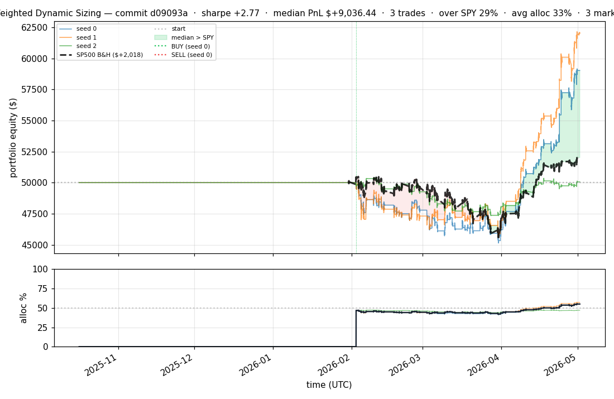
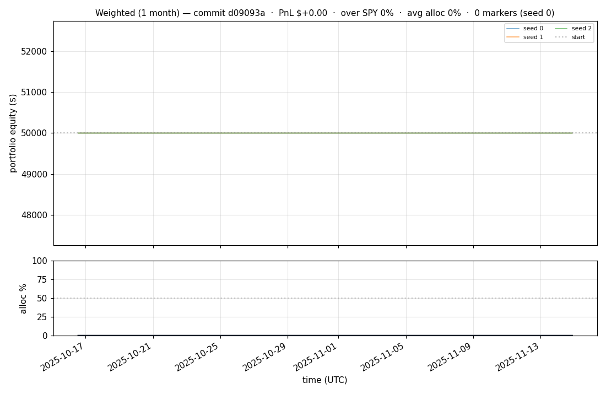
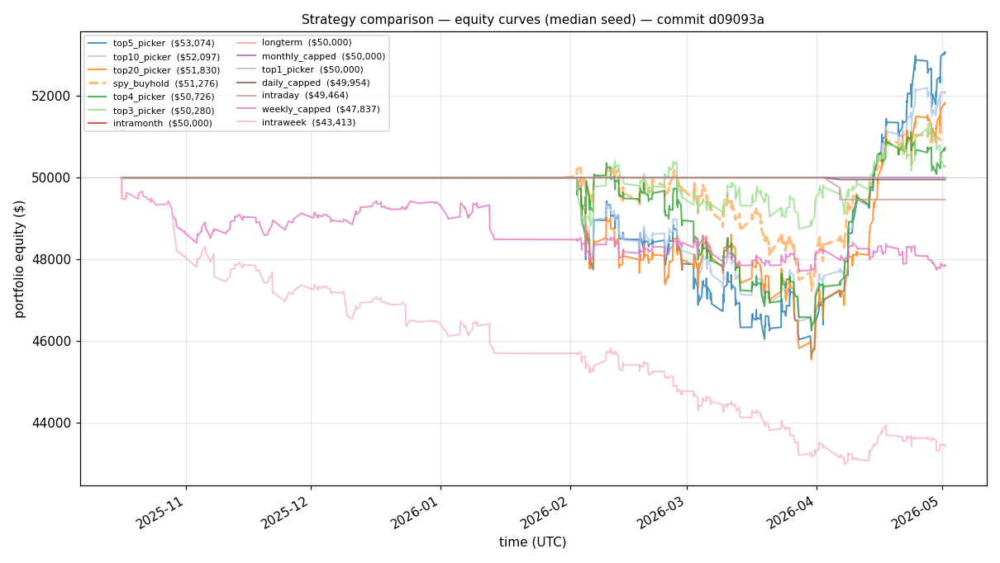
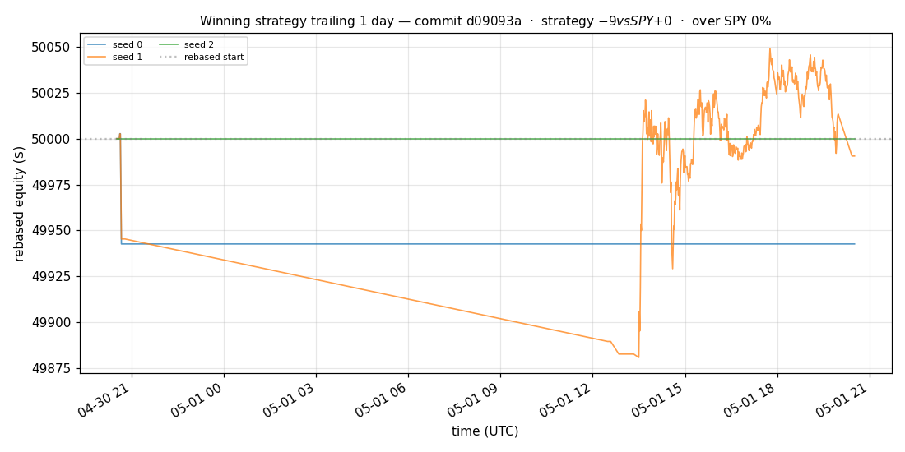
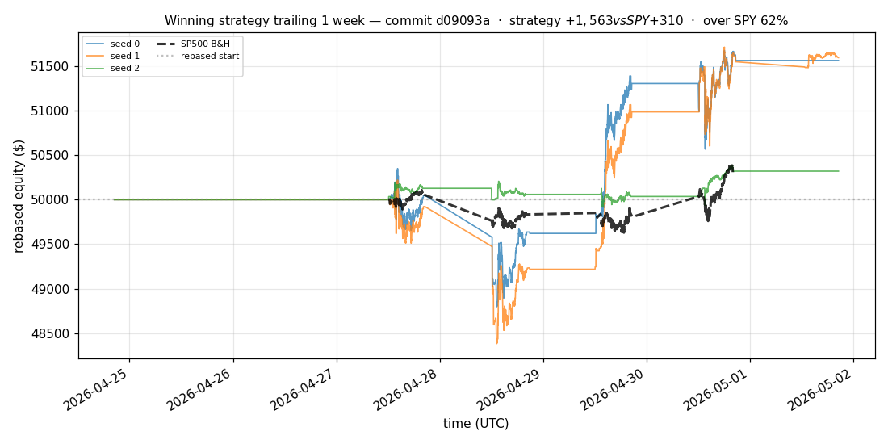
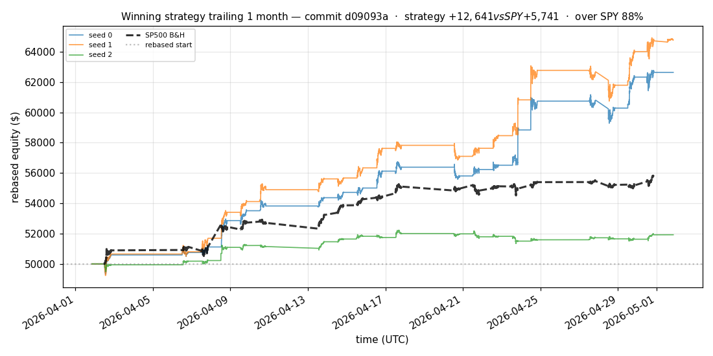
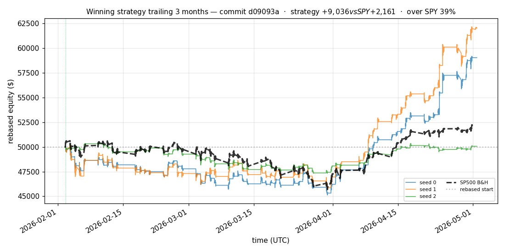
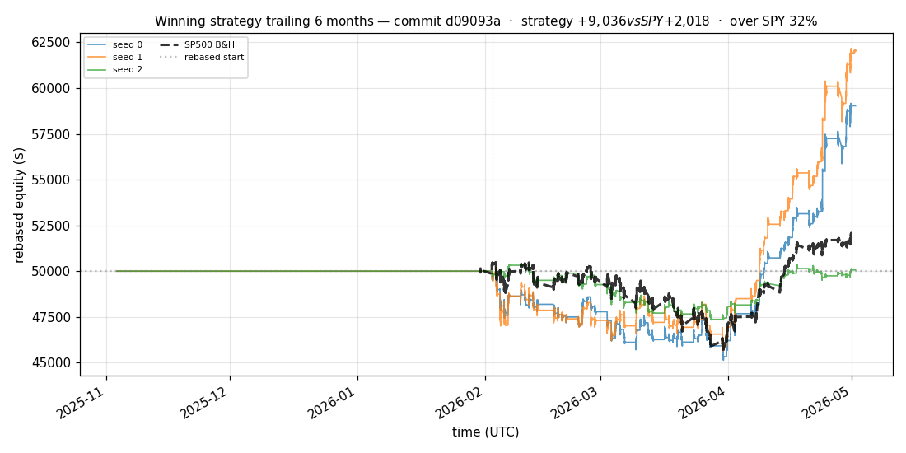

# iter 124 — d09093a

**🟢 KEEP** · exp124: quarter readiness with 37.5pct reserve

_2026-05-04 21:51 UTC · 383s wall_

## Result

| metric | value |
|---|---|
| Sharpe (median) | **+2.767** |
| Sharpe CI low (5%) | +0.515 |
| Sharpe CI high (95%) | +5.628 |
| % time above SPY | 29.387% |
| Net PnL | **$+9036.44** (+18.073%) |
| Max drawdown | -9.92% |
| Trades | 3 |
| Fees | $3.00 |
| Seeds completed | 3 |

**Decision reason:** objective=+0.5444 > prior best +0.5421 (ci_low=+0.5150, over_spy=29.4%)

## Winning strategy

Canonical strategy for this iteration: **top4 cross-sectional picker** — rank symbols by the transformer's 4h + 1d forecast Sharpe, buy the top four once enough symbols are ready, hold through the eval window, and keep 3 median trades after costs.

A **seed** is one independent training/evaluation run with a different random initialization and sampling path. The gate uses median/worst-tail statistics across seeds so one lucky seed cannot define the best checkpoint.

Positive seed transaction tables are shown later in this report; losing or flat seed transaction tables are omitted to keep reports focused on actionable winners.

## Per-seed details

```
[evaluator] seed 0: sharpe=+2.767  dd=-9.92%  pnl=$+9,036.44  trades=3
[evaluator] seed 1: sharpe=+3.246  dd=-9.08%  pnl=$+12,022.51  trades=3
[evaluator] seed 2: sharpe=+0.076  dd=-6.15%  pnl=$+62.61  trades=3
```

## Equity curve (full eval window, ~73 days)



## Equity curve (first month)



## Strategy comparison (equity curves)

Overlays every profile (intraday/intraweek/intramonth/longterm + 
daily-capped/weekly-capped/monthly-capped trade-frequency variants 
+ topN pickers + SPY benchmark) on one chart, using the median-seed run.



## Recent live-style simulations vs SP500

Each chart rebases the winning strategy and SP500 to $50,000 at the start of the trailing window, ending at the latest available bar.

### Trailing 1 day



### Trailing 1 week



### Trailing 1 month



### Trailing 3 months



### Trailing 6 months



## Trader profile comparison

Same trained model, different time-horizon strategies + SPY benchmark + passive top-N pickers.

| profile | sharpe | PnL ($) | PnL % | trades | DD % | horizon |
|---|---:|---:|---:|---:|---:|---:|
| **daily_capped** | -1.996 | $-46.27 | -0.09% | 2 | -0.09% | 1d |
| **intraday** | -12.965 | $-21,895.89 | -43.79% | 5210 | -43.79% | 2h |
| **intramonth** | -0.785 | $-69.31 | -0.14% | 2 | -0.18% | 30d |
| **intraweek** | -4.723 | $-7,267.80 | -14.54% | 981 | -15.24% | 5d |
| **longterm** | +0.000 | $+0.00 | +0.00% | 2 | -0.18% | 30d |
| **monthly_capped** | +0.000 | $+0.00 | +0.00% | 0 | +0.00% | 30d |
| **spy_buyhold** | +0.996 | $+1,260.67 | +2.52% | 1 | -6.10% | - |
| **top10_picker** | +1.244 | $+3,337.96 | +6.68% | 9 | -9.43% | - |
| **top1_picker** | +0.000 | $+0.00 | +0.00% | 0 | +0.00% | - |
| **top20_picker** | +0.945 | $+1,812.94 | +3.63% | 19 | -9.02% | - |
| **top3_picker** | +2.288 | $+13,476.54 | +26.95% | 2 | -9.21% | - |
| **top4_picker** | +0.391 | $+675.34 | +1.35% | 3 | -8.34% | - |
| **top5_picker** | +1.455 | $+5,320.34 | +10.64% | 4 | -8.96% | - |
| **weekly_capped** | -1.668 | $-2,199.37 | -4.40% | 88 | -5.28% | 5d |

**Best active strategy: `top3_picker` (sharpe +2.288) — BEATS SPY ✓**

## Out-of-symbol holdout eval

Tested on **JPM, WMT, V, DIS, JNJ** — large-caps the model NEVER saw during training.

| seed | sharpe | PnL | trades | DD% |
|---:|---:|---:|---:|---:|
| 0 | +0.235 | $+233.83 | 5 | -5.87% |
| 1 | -0.077 | $-154.70 | 11 | -5.43% |
| 2 | +0.235 | $+233.83 | 5 | -5.87% |
| 3 | +0.327 | $+504.54 | 5 | -9.19% |
| 4 | +0.000 | $+0.00 | 0 | +0.00% |

**Median holdout sharpe: +0.235** (vs in-symbol +2.767)

## Transactions

_(no profitable per-seed transaction table; losing/flat seeds omitted)_

## Diff vs previous experiment

```diff
d09093a exp124: quarter readiness with 37.5pct reserve


 experiment.py | 4 ++--
 1 file changed, 2 insertions(+), 2 deletions(-)
```

---

[← all iterations](.) · [back to README](../README.md)
