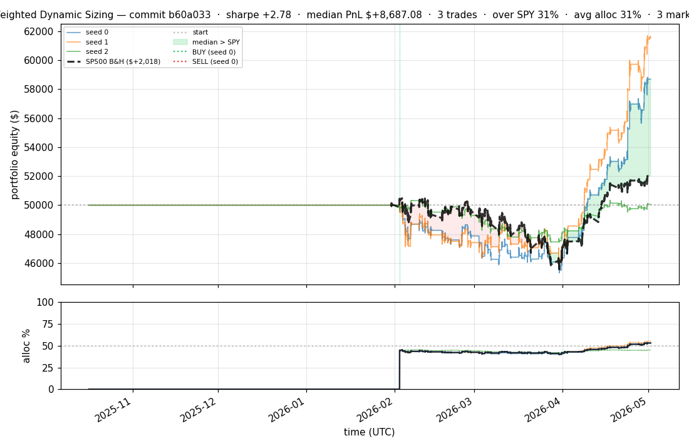
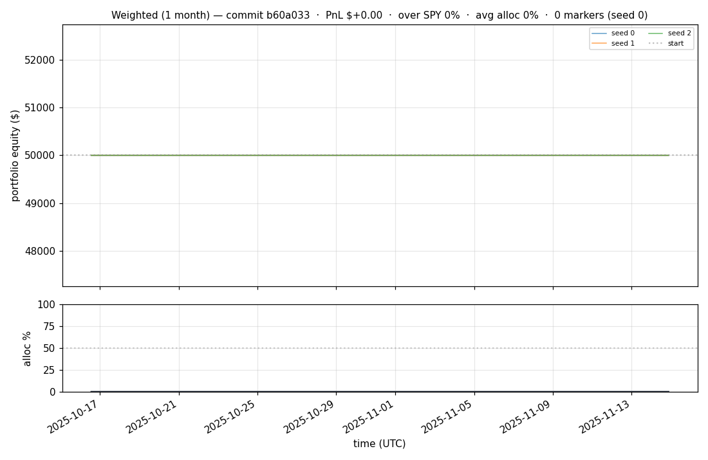
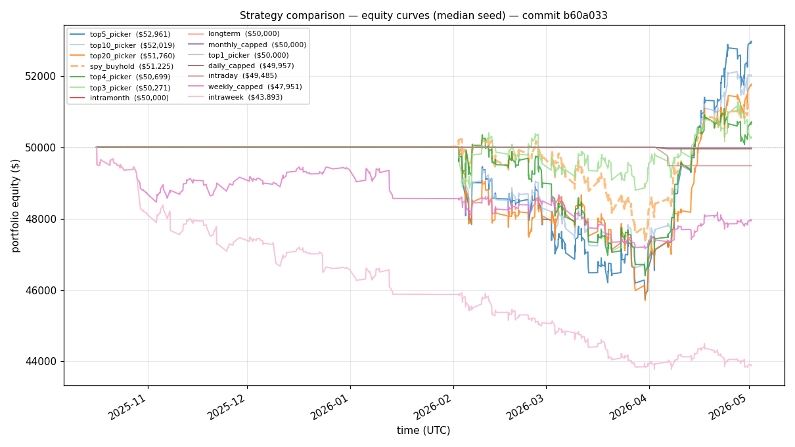
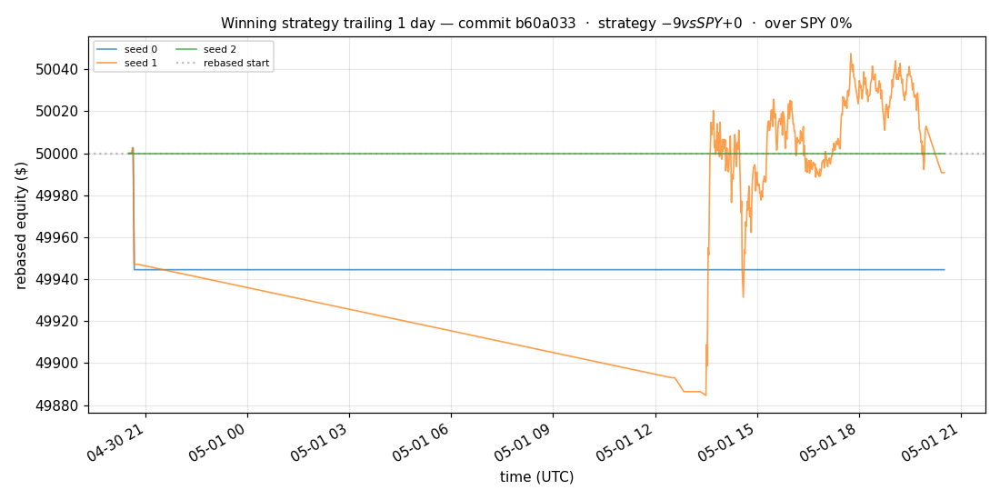
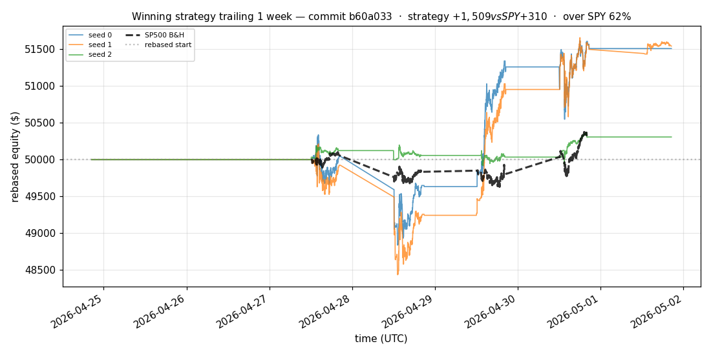
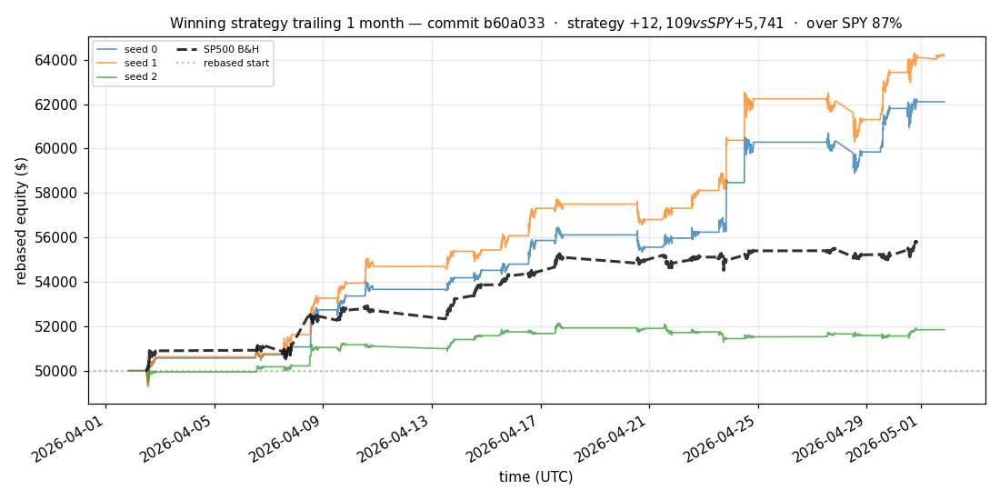
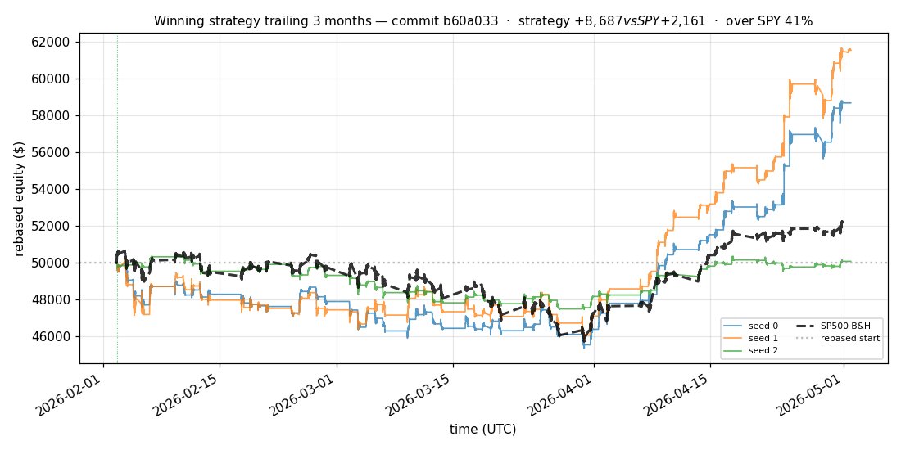
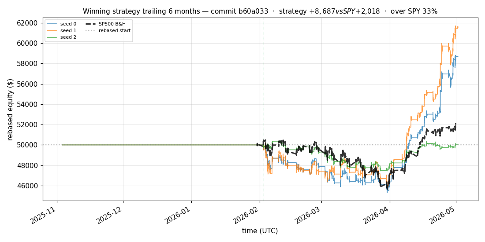

# iter 125 — b60a033

**🟢 KEEP** · exp125: quarter readiness with 40pct reserve

_2026-05-04 21:58 UTC · 384s wall_

## Result

| metric | value |
|---|---|
| Sharpe (median) | **+2.775** |
| Sharpe CI low (5%) | +0.519 |
| Sharpe CI high (95%) | +5.638 |
| % time above SPY | 31.194% |
| Net PnL | **$+8687.08** (+17.374%) |
| Max drawdown | -9.53% |
| Trades | 3 |
| Fees | $3.00 |
| Seeds completed | 3 |

**Decision reason:** objective=+0.5502 > prior best +0.5446 (ci_low=+0.5190, over_spy=31.2%)

## Winning strategy

Canonical strategy for this iteration: **top4 cross-sectional picker** — rank symbols by the transformer's 4h + 1d forecast Sharpe, buy the top four once enough symbols are ready, hold through the eval window, and keep 3 median trades after costs.

A **seed** is one independent training/evaluation run with a different random initialization and sampling path. The gate uses median/worst-tail statistics across seeds so one lucky seed cannot define the best checkpoint.

Positive seed transaction tables are shown later in this report; losing or flat seed transaction tables are omitted to keep reports focused on actionable winners.

## Per-seed details

```
[evaluator] seed 0: sharpe=+2.775  dd=-9.53%  pnl=$+8,687.08  trades=3
[evaluator] seed 1: sharpe=+3.256  dd=-8.72%  pnl=$+11,553.70  trades=3
[evaluator] seed 2: sharpe=+0.078  dd=-5.90%  pnl=$+64.23  trades=3
```

## Equity curve (full eval window, ~73 days)



## Equity curve (first month)



## Strategy comparison (equity curves)

Overlays every profile (intraday/intraweek/intramonth/longterm + 
daily-capped/weekly-capped/monthly-capped trade-frequency variants 
+ topN pickers + SPY benchmark) on one chart, using the median-seed run.



## Recent live-style simulations vs SP500

Each chart rebases the winning strategy and SP500 to $50,000 at the start of the trailing window, ending at the latest available bar.

### Trailing 1 day



### Trailing 1 week



### Trailing 1 month



### Trailing 3 months



### Trailing 6 months



## Trader profile comparison

Same trained model, different time-horizon strategies + SPY benchmark + passive top-N pickers.

| profile | sharpe | PnL ($) | PnL % | trades | DD % | horizon |
|---|---:|---:|---:|---:|---:|---:|
| **daily_capped** | -1.992 | $-43.11 | -0.09% | 2 | -0.09% | 1d |
| **intraday** | -12.965 | $-21,201.30 | -42.40% | 5210 | -42.40% | 2h |
| **intramonth** | -0.742 | $-61.68 | -0.12% | 2 | -0.16% | 30d |
| **intraweek** | -4.723 | $-6,897.95 | -13.80% | 981 | -14.52% | 5d |
| **longterm** | +0.000 | $+0.00 | +0.00% | 2 | -0.16% | 30d |
| **monthly_capped** | +0.000 | $+0.00 | +0.00% | 0 | +0.00% | 30d |
| **spy_buyhold** | +0.995 | $+1,210.24 | +2.42% | 1 | -5.86% | - |
| **top10_picker** | +1.244 | $+3,337.96 | +6.68% | 9 | -9.06% | - |
| **top1_picker** | +0.000 | $+0.00 | +0.00% | 0 | +0.00% | - |
| **top20_picker** | +0.946 | $+1,744.07 | +3.49% | 19 | -8.66% | - |
| **top3_picker** | +2.288 | $+12,944.65 | +25.89% | 2 | -8.85% | - |
| **top4_picker** | +0.391 | $+650.55 | +1.30% | 3 | -8.01% | - |
| **top5_picker** | +1.455 | $+5,320.34 | +10.64% | 4 | -8.59% | - |
| **weekly_capped** | -1.666 | $-2,058.78 | -4.12% | 85 | -5.05% | 5d |

**Best active strategy: `top3_picker` (sharpe +2.288) — BEATS SPY ✓**

## Out-of-symbol holdout eval

Tested on **JPM, WMT, V, DIS, JNJ** — large-caps the model NEVER saw during training.

| seed | sharpe | PnL | trades | DD% |
|---:|---:|---:|---:|---:|
| 0 | +0.242 | $+234.84 | 5 | -5.63% |
| 1 | -0.058 | $-123.59 | 11 | -5.22% |
| 2 | +0.242 | $+234.84 | 5 | -5.63% |
| 3 | +0.327 | $+504.54 | 5 | -9.19% |
| 4 | +0.000 | $+0.00 | 0 | +0.00% |

**Median holdout sharpe: +0.242** (vs in-symbol +2.775)

## Transactions

_(no profitable per-seed transaction table; losing/flat seeds omitted)_

## Diff vs previous experiment

```diff
b60a033 exp125: quarter readiness with 40pct reserve


 experiment.py | 4 ++--
 1 file changed, 2 insertions(+), 2 deletions(-)
```

---

[← all iterations](.) · [back to README](../README.md)
