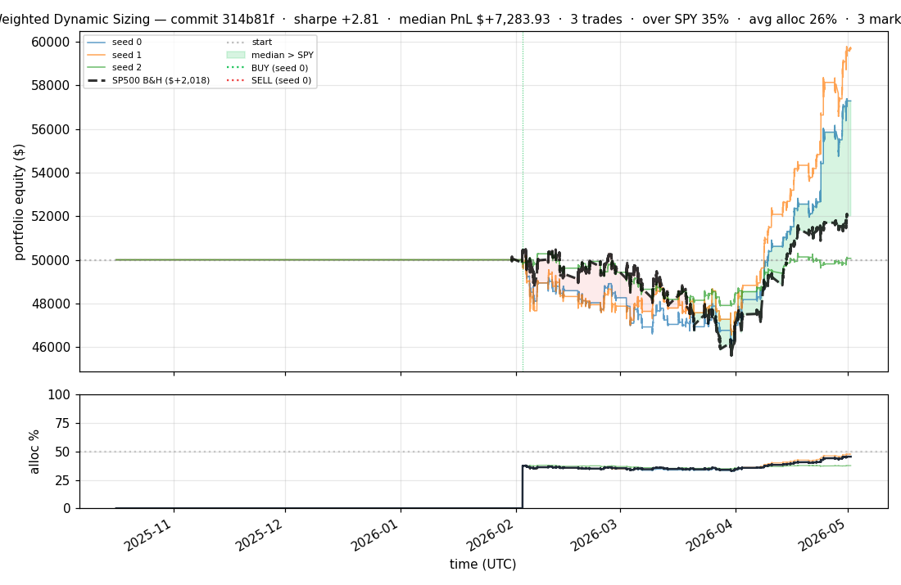
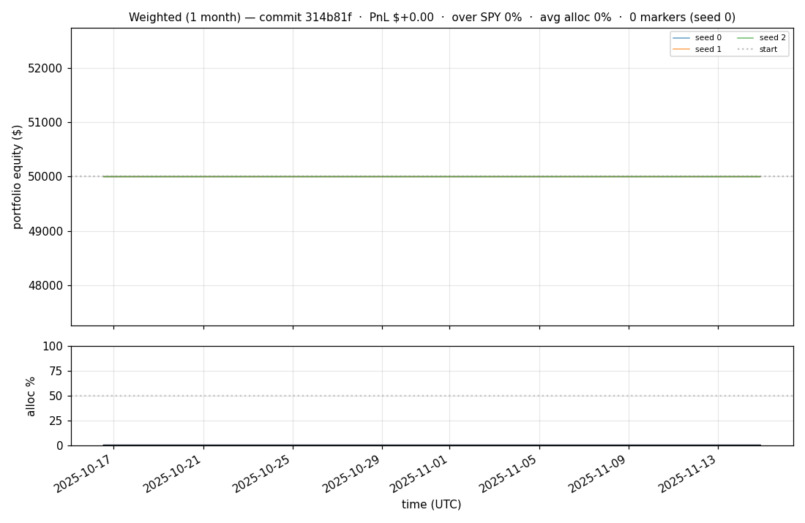
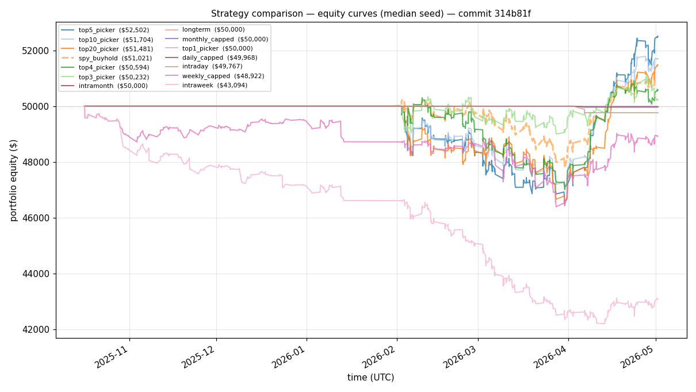
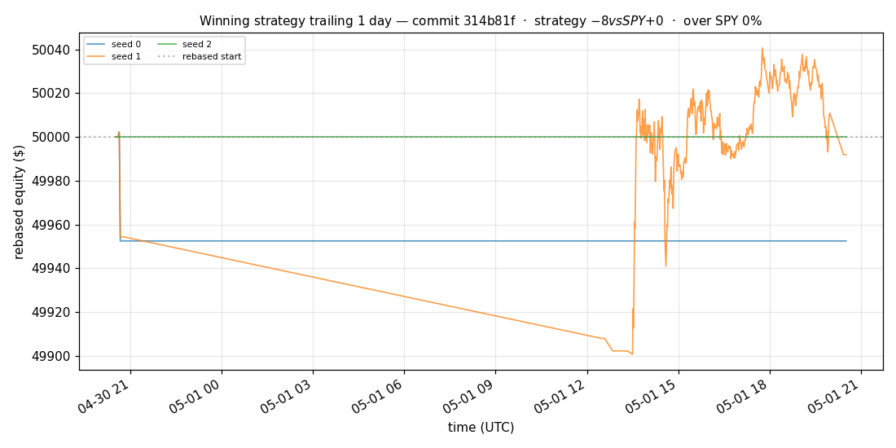
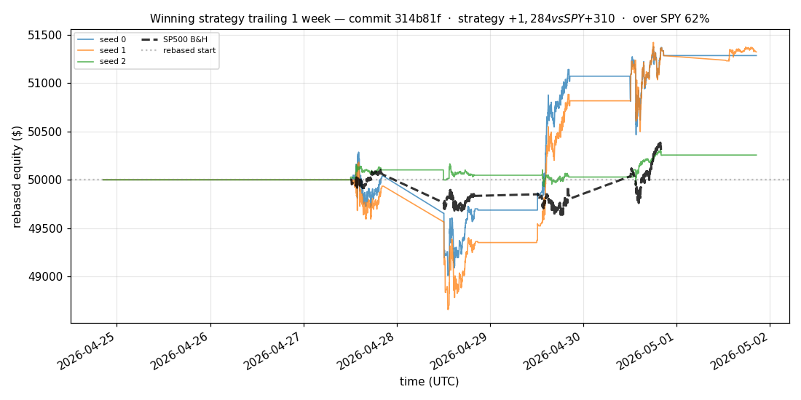
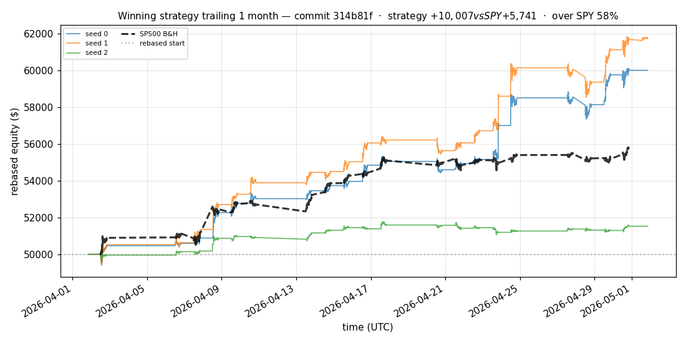
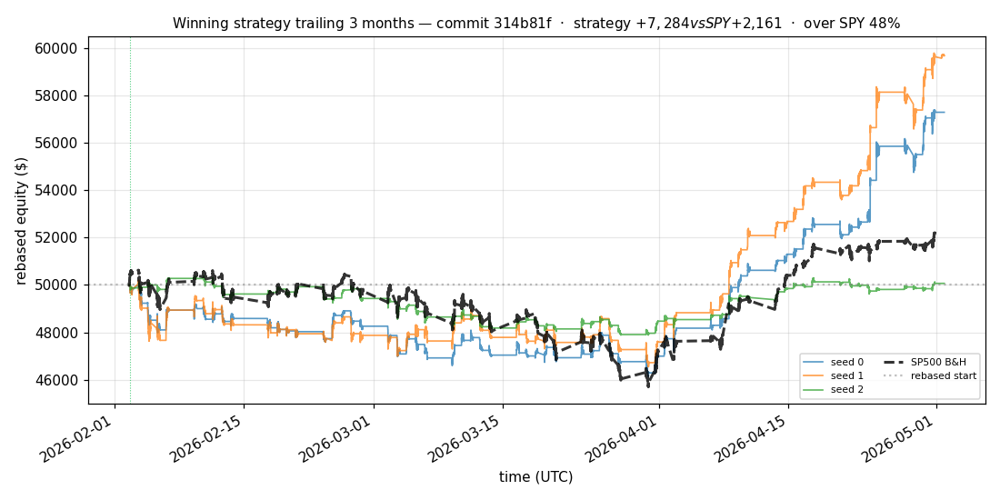
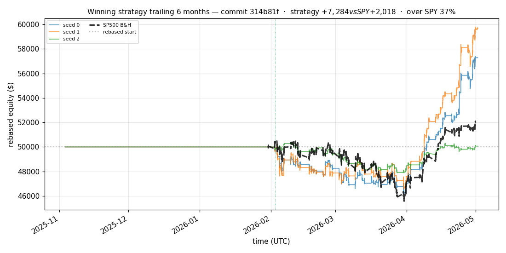

# iter 129 — 314b81f

**🟢 KEEP** · exp129: quarter readiness with 50pct reserve

_2026-05-04 22:33 UTC · 604s wall_

## Result

| metric | value |
|---|---|
| Sharpe (median) | **+2.808** |
| Sharpe CI low (5%) | +0.531 |
| Sharpe CI high (95%) | +5.678 |
| % time above SPY | 34.929% |
| Net PnL | **$+7283.93** (+14.568%) |
| Max drawdown | -7.95% |
| Trades | 3 |
| Fees | $3.00 |
| Seeds completed | 3 |

**Decision reason:** objective=+0.5659 > prior best +0.5635 (ci_low=+0.5310, over_spy=34.9%)

## Winning strategy

Canonical strategy for this iteration: **top4 cross-sectional picker** — rank symbols by the transformer's 4h + 1d forecast Sharpe, buy the top four once enough symbols are ready, hold through the eval window, and keep 3 median trades after costs.

A **seed** is one independent training/evaluation run with a different random initialization and sampling path. The gate uses median/worst-tail statistics across seeds so one lucky seed cannot define the best checkpoint.

Positive seed transaction tables are shown later in this report; losing or flat seed transaction tables are omitted to keep reports focused on actionable winners.

## Per-seed details

```
[evaluator] seed 0: sharpe=+2.808  dd=-7.95%  pnl=$+7,283.93  trades=3
[evaluator] seed 1: sharpe=+3.295  dd=-7.28%  pnl=$+9,668.43  trades=3
[evaluator] seed 2: sharpe=+0.084  dd=-4.93%  pnl=$+67.20  trades=3
```

## Equity curve (full eval window, ~73 days)



## Equity curve (first month)



## Strategy comparison (equity curves)

Overlays every profile (intraday/intraweek/intramonth/longterm + 
daily-capped/weekly-capped/monthly-capped trade-frequency variants 
+ topN pickers + SPY benchmark) on one chart, using the median-seed run.



## Recent live-style simulations vs SP500

Each chart rebases the winning strategy and SP500 to $50,000 at the start of the trailing window, ending at the latest available bar.

### Trailing 1 day



### Trailing 1 week



### Trailing 1 month



### Trailing 3 months



### Trailing 6 months



## Trader profile comparison

Same trained model, different time-horizon strategies + SPY benchmark + passive top-N pickers.

| profile | sharpe | PnL ($) | PnL % | trades | DD % | horizon |
|---|---:|---:|---:|---:|---:|---:|
| **daily_capped** | -1.946 | $-31.67 | -0.06% | 2 | -0.06% | 1d |
| **intraday** | -12.965 | $-18,095.42 | -36.19% | 5210 | -36.19% | 2h |
| **intramonth** | -0.549 | $-35.21 | -0.07% | 2 | -0.12% | 30d |
| **intraweek** | -5.160 | $-7,498.02 | -15.00% | 1332 | -15.68% | 5d |
| **longterm** | +0.000 | $+0.00 | +0.00% | 2 | -0.12% | 30d |
| **monthly_capped** | +0.000 | $+0.00 | +0.00% | 0 | +0.00% | 30d |
| **spy_buyhold** | +0.991 | $+1,008.52 | +2.02% | 1 | -4.89% | - |
| **top10_picker** | +1.244 | $+3,337.96 | +6.68% | 9 | -7.55% | - |
| **top1_picker** | +0.000 | $+0.00 | +0.00% | 0 | +0.00% | - |
| **top20_picker** | +0.955 | $+1,467.96 | +2.94% | 19 | -7.22% | - |
| **top3_picker** | +2.288 | $+10,811.13 | +21.62% | 2 | -7.38% | - |
| **top4_picker** | +0.393 | $+553.81 | +1.11% | 3 | -6.69% | - |
| **top5_picker** | +1.455 | $+5,320.34 | +10.64% | 4 | -7.10% | - |
| **weekly_capped** | -0.701 | $-1,117.86 | -2.24% | 96 | -5.21% | 5d |

**Best active strategy: `top3_picker` (sharpe +2.288) — BEATS SPY ✓**

## Out-of-symbol holdout eval

Tested on **JPM, WMT, V, DIS, JNJ** — large-caps the model NEVER saw during training.

| seed | sharpe | PnL | trades | DD% |
|---:|---:|---:|---:|---:|
| 0 | +0.270 | $+231.40 | 5 | -4.71% |
| 1 | +0.038 | $-0.77 | 11 | -4.36% |
| 2 | +0.270 | $+231.40 | 5 | -4.71% |
| 3 | +0.327 | $+504.54 | 5 | -9.19% |
| 4 | +0.000 | $+0.00 | 0 | +0.00% |

**Median holdout sharpe: +0.270** (vs in-symbol +2.808)

## Transactions

_(no profitable per-seed transaction table; losing/flat seeds omitted)_

## Diff vs previous experiment

```diff
314b81f exp129: quarter readiness with 50pct reserve


 experiment.py | 4 ++--
 1 file changed, 2 insertions(+), 2 deletions(-)
```

---

[← all iterations](.) · [back to README](../README.md)
