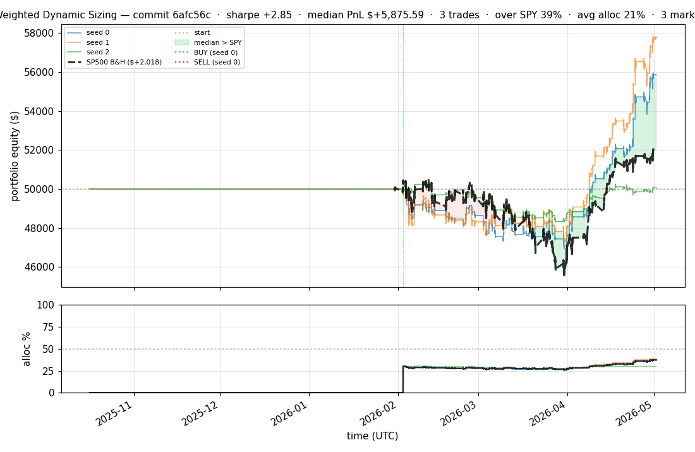
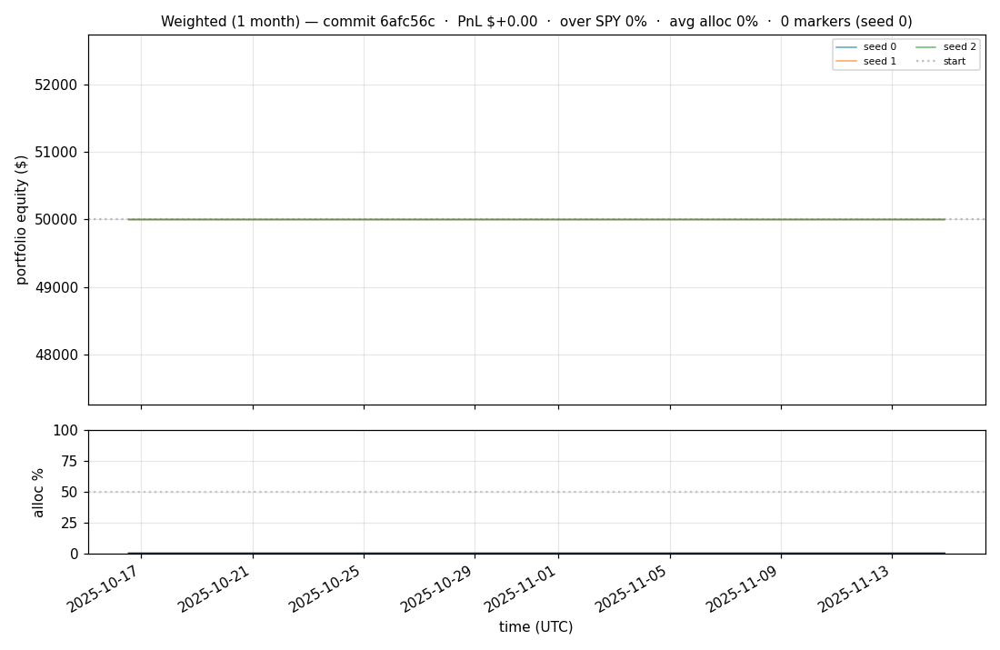
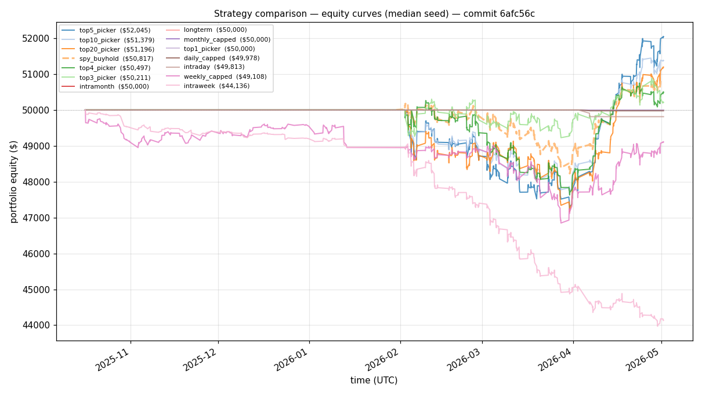
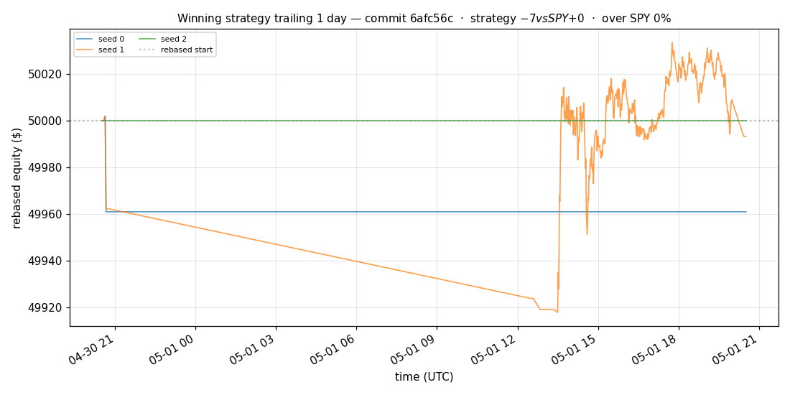
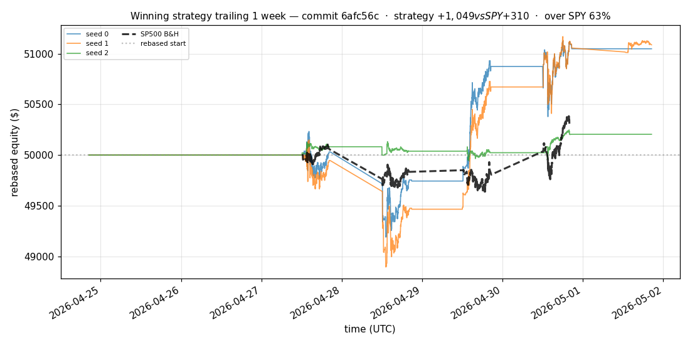
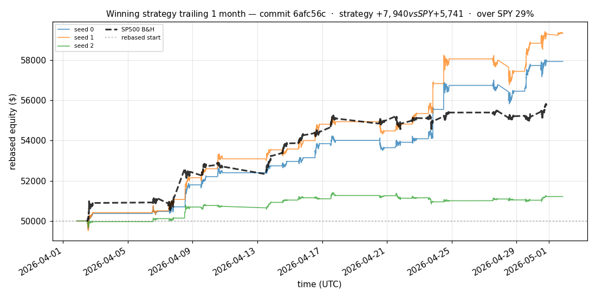
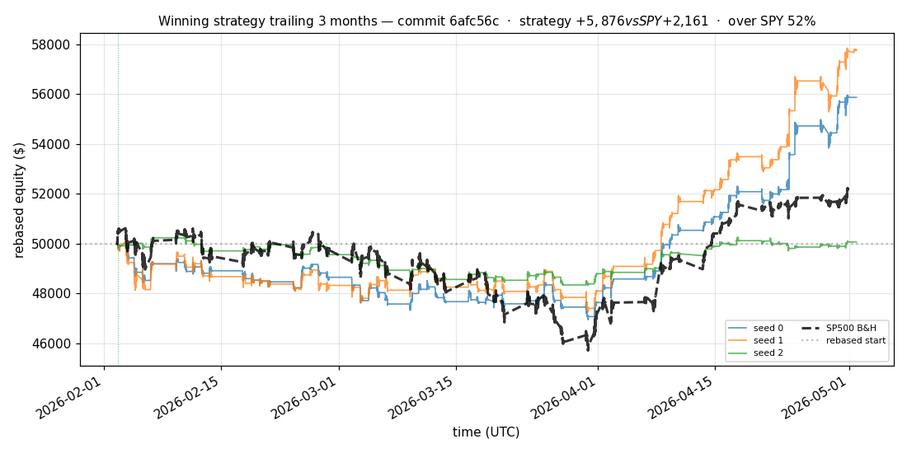
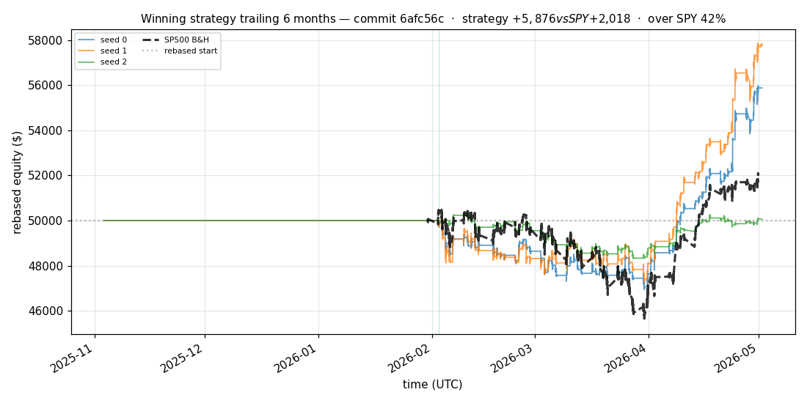

# iter 131 — 6afc56c

**🟢 KEEP** · exp131: quarter readiness with 60pct reserve

_2026-05-04 22:47 UTC · 388s wall_

## Result

| metric | value |
|---|---|
| Sharpe (median) | **+2.847** |
| Sharpe CI low (5%) | +0.542 |
| Sharpe CI high (95%) | +5.723 |
| % time above SPY | 39.496% |
| Net PnL | **$+5875.59** (+11.751%) |
| Max drawdown | -6.38% |
| Trades | 3 |
| Fees | $3.00 |
| Seeds completed | 3 |

**Decision reason:** objective=+0.5815 > prior best +0.5729 (ci_low=+0.5420, over_spy=39.5%)

## Winning strategy

Canonical strategy for this iteration: **top4 cross-sectional picker** — rank symbols by the transformer's 4h + 1d forecast Sharpe, buy the top four once enough symbols are ready, hold through the eval window, and keep 3 median trades after costs.

A **seed** is one independent training/evaluation run with a different random initialization and sampling path. The gate uses median/worst-tail statistics across seeds so one lucky seed cannot define the best checkpoint.

Positive seed transaction tables are shown later in this report; losing or flat seed transaction tables are omitted to keep reports focused on actionable winners.

## Per-seed details

```
[evaluator] seed 0: sharpe=+2.847  dd=-6.38%  pnl=$+5,875.59  trades=3
[evaluator] seed 1: sharpe=+3.334  dd=-5.84%  pnl=$+7,766.97  trades=3
[evaluator] seed 2: sharpe=+0.089  dd=-3.95%  pnl=$+64.53  trades=3
```

## Equity curve (full eval window, ~73 days)



## Equity curve (first month)



## Strategy comparison (equity curves)

Overlays every profile (intraday/intraweek/intramonth/longterm + 
daily-capped/weekly-capped/monthly-capped trade-frequency variants 
+ topN pickers + SPY benchmark) on one chart, using the median-seed run.



## Recent live-style simulations vs SP500

Each chart rebases the winning strategy and SP500 to $50,000 at the start of the trailing window, ending at the latest available bar.

### Trailing 1 day



### Trailing 1 week



### Trailing 1 month



### Trailing 3 months



### Trailing 6 months



## Trader profile comparison

Same trained model, different time-horizon strategies + SPY benchmark + passive top-N pickers.

| profile | sharpe | PnL ($) | PnL % | trades | DD % | horizon |
|---|---:|---:|---:|---:|---:|---:|
| **daily_capped** | -1.947 | $-22.17 | -0.04% | 2 | -0.04% | 1d |
| **intraday** | -12.965 | $-14,782.32 | -29.56% | 5210 | -29.56% | 2h |
| **intramonth** | -0.321 | $-15.30 | -0.03% | 2 | -0.10% | 30d |
| **intraweek** | -5.211 | $-6,232.33 | -12.46% | 1130 | -13.12% | 5d |
| **longterm** | +0.000 | $+0.00 | +0.00% | 2 | -0.10% | 30d |
| **monthly_capped** | +0.000 | $+0.00 | +0.00% | 0 | +0.00% | 30d |
| **spy_buyhold** | +0.988 | $+806.80 | +1.61% | 1 | -3.91% | - |
| **top10_picker** | +1.256 | $+2,955.89 | +5.91% | 9 | -6.05% | - |
| **top1_picker** | +0.000 | $+0.00 | +0.00% | 0 | +0.00% | - |
| **top20_picker** | +0.963 | $+1,184.80 | +2.37% | 19 | -5.78% | - |
| **top3_picker** | +2.288 | $+8,696.22 | +17.39% | 2 | -5.92% | - |
| **top4_picker** | +0.406 | $+464.94 | +0.93% | 3 | -5.36% | - |
| **top5_picker** | +1.455 | $+5,320.34 | +10.64% | 4 | -5.65% | - |
| **weekly_capped** | -0.725 | $-915.12 | -1.83% | 92 | -3.78% | 5d |

**Best active strategy: `top3_picker` (sharpe +2.288) — BEATS SPY ✓**

## Out-of-symbol holdout eval

Tested on **JPM, WMT, V, DIS, JNJ** — large-caps the model NEVER saw during training.

| seed | sharpe | PnL | trades | DD% |
|---:|---:|---:|---:|---:|
| 0 | +0.313 | $+226.44 | 5 | -3.78% |
| 1 | +0.320 | $+232.26 | 9 | -3.74% |
| 2 | +0.313 | $+226.44 | 5 | -3.78% |
| 3 | +0.327 | $+504.54 | 5 | -9.19% |
| 4 | +0.000 | $+0.00 | 0 | +0.00% |

**Median holdout sharpe: +0.313** (vs in-symbol +2.847)

## Transactions

_(no profitable per-seed transaction table; losing/flat seeds omitted)_

## Diff vs previous experiment

```diff
6afc56c exp131: quarter readiness with 60pct reserve


 experiment.py | 4 ++--
 1 file changed, 2 insertions(+), 2 deletions(-)
```

---

[← all iterations](.) · [back to README](../README.md)
