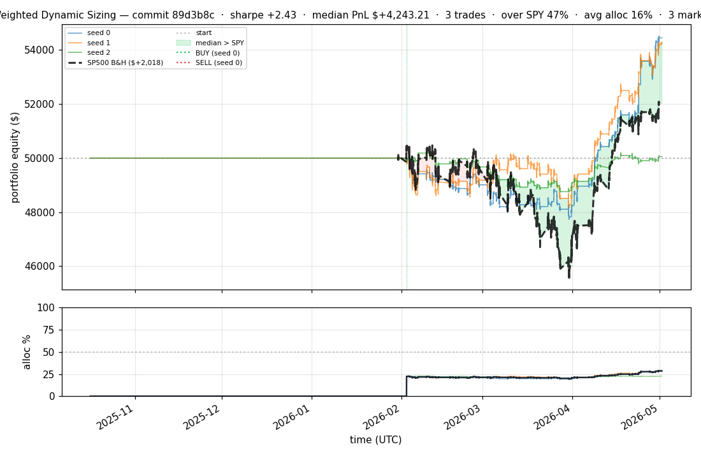
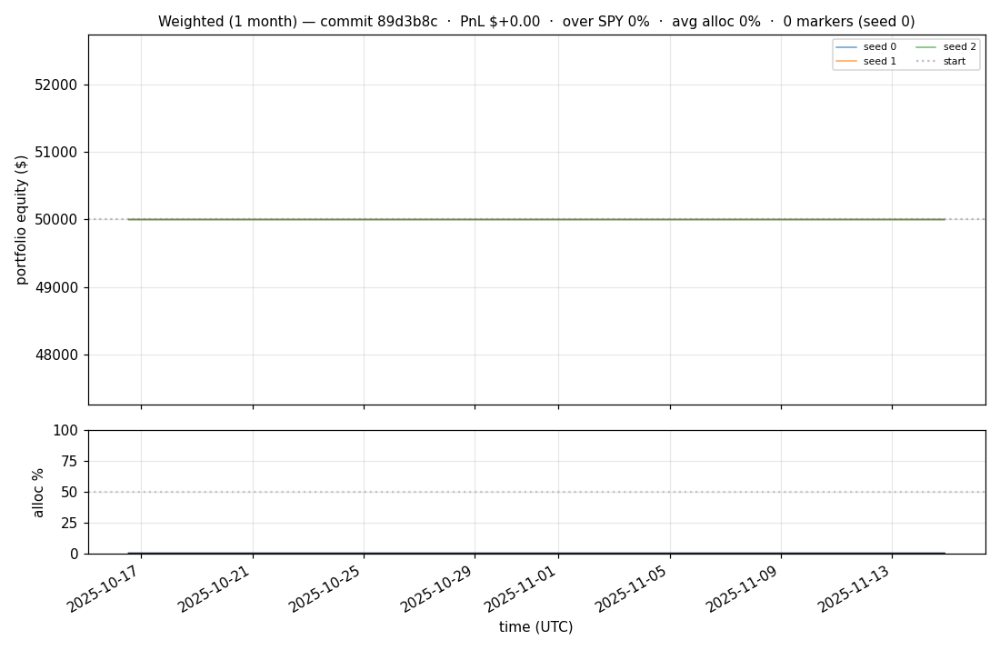
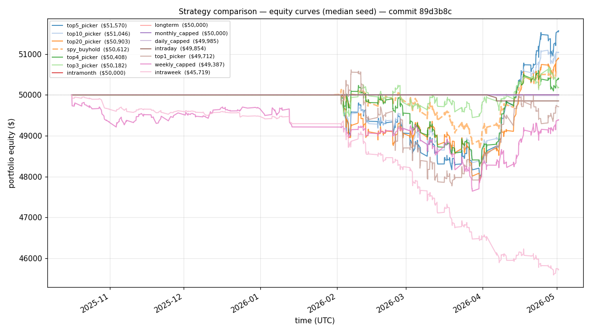
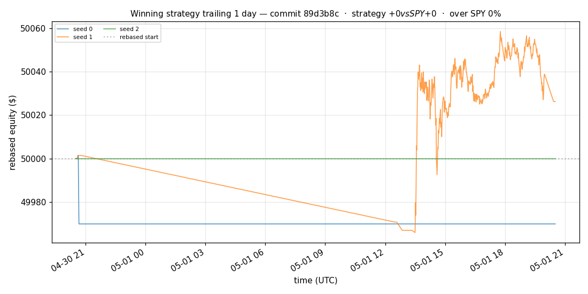
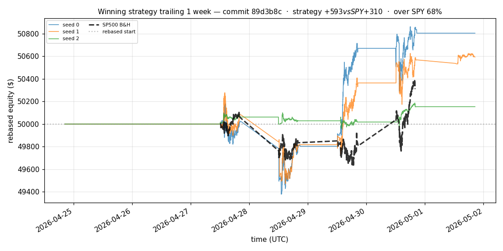
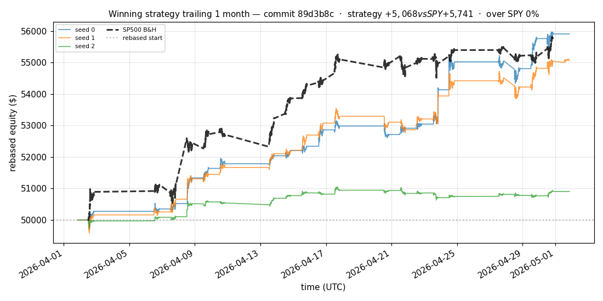
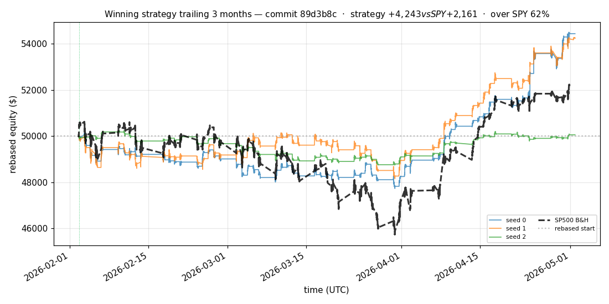
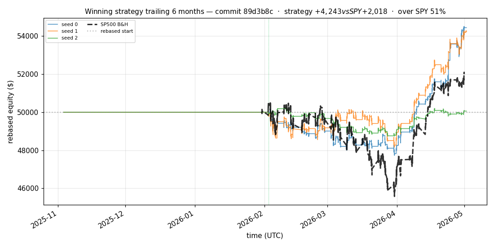

# iter 133 — 89d3b8c

**🔴 DISCARD** · exp133: quarter readiness with 70pct reserve

_2026-05-04 23:02 UTC · 384s wall_

## Result

| metric | value |
|---|---|
| Sharpe (median) | **+2.427** |
| Sharpe CI low (5%) | -0.179 |
| Sharpe CI high (95%) | +4.977 |
| % time above SPY | 47.088% |
| Net PnL | **$+4243.21** (+8.486%) |
| Max drawdown | -4.80% |
| Trades | 3 |
| Fees | $3.00 |
| Seeds completed | 3 |

**Decision reason:** objective=-0.1319 ≤ prior best +0.5885 (ci_low=-0.1790, over_spy=47.1%)

## Winning strategy

Canonical strategy for this iteration: **top4 cross-sectional picker** — rank symbols by the transformer's 4h + 1d forecast Sharpe, buy the top four once enough symbols are ready, hold through the eval window, and keep 3 median trades after costs.

A **seed** is one independent training/evaluation run with a different random initialization and sampling path. The gate uses median/worst-tail statistics across seeds so one lucky seed cannot define the best checkpoint.

Positive seed transaction tables are shown later in this report; losing or flat seed transaction tables are omitted to keep reports focused on actionable winners.

## Per-seed details

```
[evaluator] seed 0: sharpe=+2.885  dd=-4.80%  pnl=$+4,442.95  trades=3
[evaluator] seed 1: sharpe=+2.427  dd=-3.95%  pnl=$+4,243.21  trades=3
[evaluator] seed 2: sharpe=+0.095  dd=-2.97%  pnl=$+56.20  trades=3
```

## Equity curve (full eval window, ~73 days)



## Equity curve (first month)



## Strategy comparison (equity curves)

Overlays every profile (intraday/intraweek/intramonth/longterm + 
daily-capped/weekly-capped/monthly-capped trade-frequency variants 
+ topN pickers + SPY benchmark) on one chart, using the median-seed run.



## Recent live-style simulations vs SP500

Each chart rebases the winning strategy and SP500 to $50,000 at the start of the trailing window, ending at the latest available bar.

### Trailing 1 day



### Trailing 1 week



### Trailing 1 month



### Trailing 3 months



### Trailing 6 months



## Trader profile comparison

Same trained model, different time-horizon strategies + SPY benchmark + passive top-N pickers.

| profile | sharpe | PnL ($) | PnL % | trades | DD % | horizon |
|---|---:|---:|---:|---:|---:|---:|
| **daily_capped** | -1.947 | $-15.14 | -0.03% | 2 | -0.03% | 1d |
| **intraday** | -12.965 | $-11,248.70 | -22.50% | 5210 | -22.50% | 2h |
| **intramonth** | -0.058 | $-1.99 | -0.00% | 2 | -0.07% | 30d |
| **intraweek** | -5.207 | $-4,542.95 | -9.09% | 981 | -9.55% | 5d |
| **longterm** | +0.000 | $+0.00 | +0.00% | 2 | -0.07% | 30d |
| **monthly_capped** | +0.000 | $+0.00 | +0.00% | 0 | +0.00% | 30d |
| **spy_buyhold** | +0.984 | $+605.08 | +1.21% | 1 | -2.94% | - |
| **top10_picker** | +1.271 | $+2,231.25 | +4.46% | 9 | -4.54% | - |
| **top1_picker** | +0.000 | $+0.00 | +0.00% | 1 | -2.73% | - |
| **top20_picker** | +0.969 | $+894.56 | +1.79% | 19 | -4.34% | - |
| **top3_picker** | +2.288 | $+6,565.41 | +13.13% | 2 | -4.46% | - |
| **top4_picker** | +0.438 | $+383.62 | +0.77% | 3 | -4.04% | - |
| **top5_picker** | +1.479 | $+4,633.55 | +9.27% | 4 | -4.40% | - |
| **weekly_capped** | -0.678 | $-631.69 | -1.26% | 86 | -2.77% | 5d |

**Best active strategy: `top3_picker` (sharpe +2.288) — BEATS SPY ✓**

## Out-of-symbol holdout eval

Tested on **JPM, WMT, V, DIS, JNJ** — large-caps the model NEVER saw during training.

| seed | sharpe | PnL | trades | DD% |
|---:|---:|---:|---:|---:|
| 0 | +0.361 | $+202.64 | 5 | -2.85% |
| 1 | +0.389 | $+220.07 | 9 | -2.82% |
| 2 | +0.361 | $+202.64 | 5 | -2.85% |
| 3 | +0.327 | $+504.54 | 5 | -9.19% |
| 4 | +0.000 | $+0.00 | 0 | +0.00% |

**Median holdout sharpe: +0.361** (vs in-symbol +2.427)

## Transactions

_(no profitable per-seed transaction table; losing/flat seeds omitted)_

## Diff vs previous experiment

```diff
89d3b8c exp133: quarter readiness with 70pct reserve


 experiment.py | 4 ++--
 1 file changed, 2 insertions(+), 2 deletions(-)
```

---

[← all iterations](.) · [back to README](../README.md)
