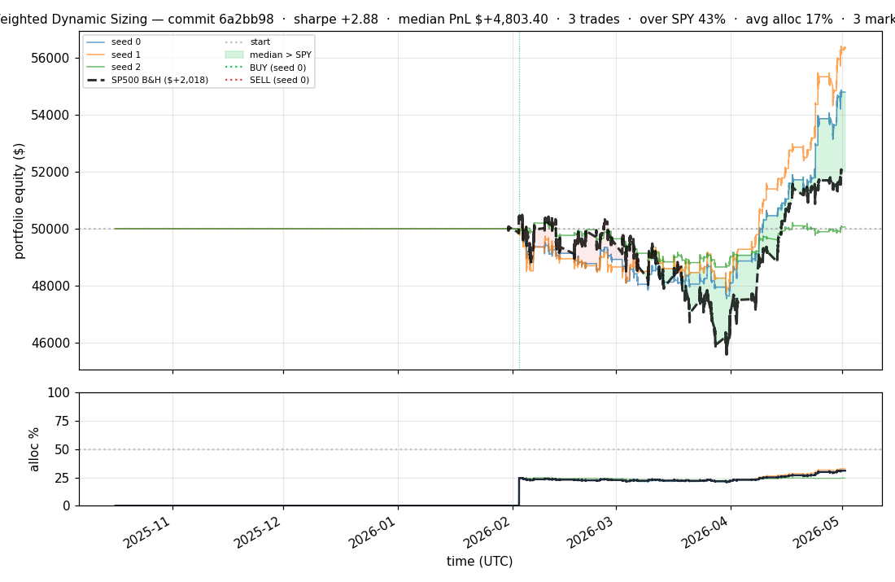
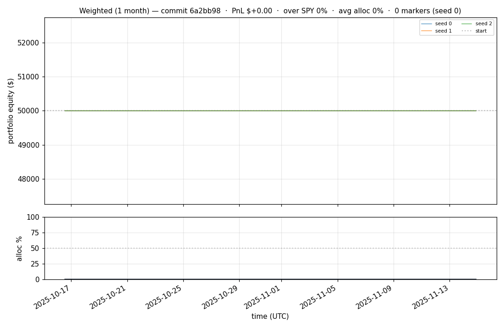
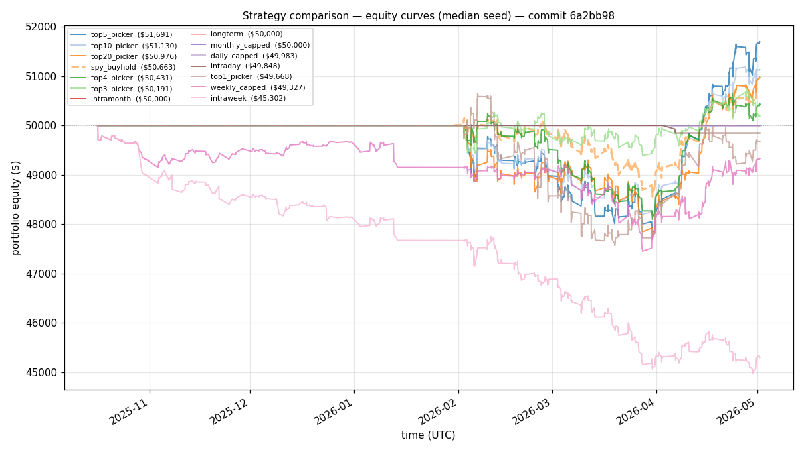
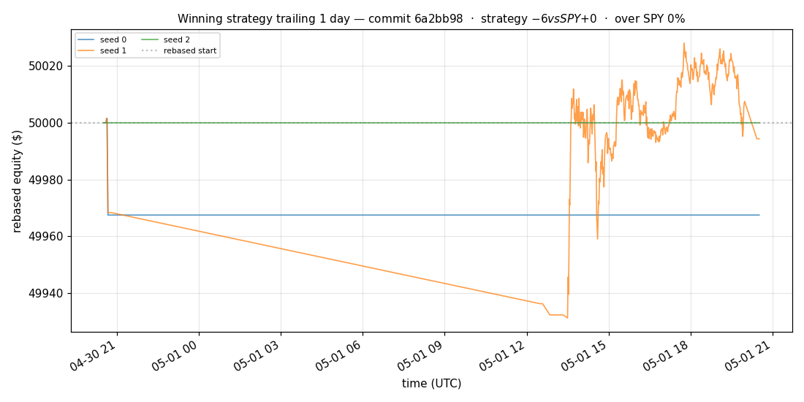
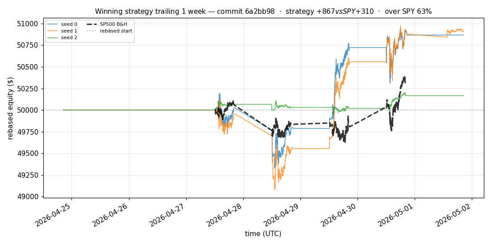
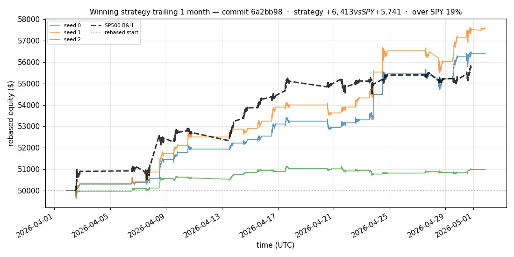
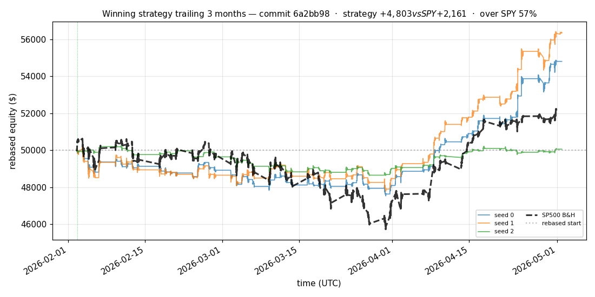
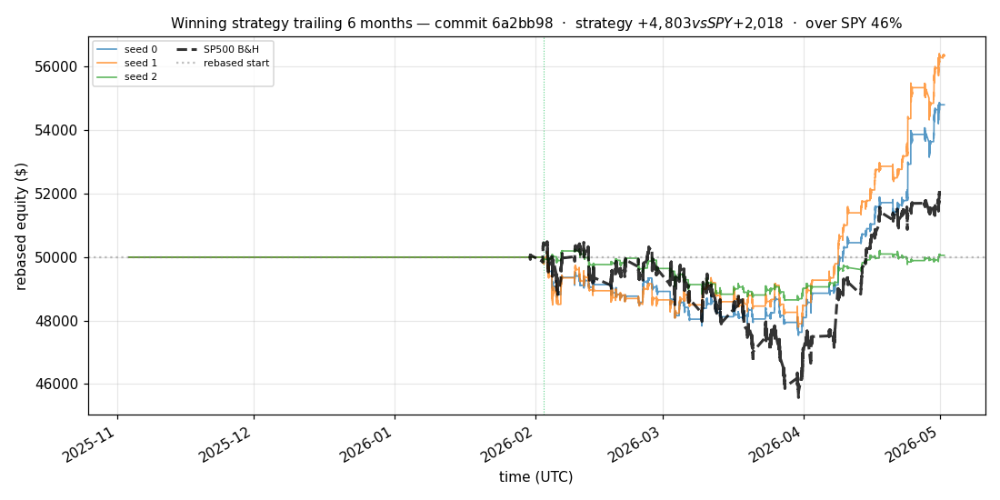

# iter 134 — 6a2bb98

**🟢 KEEP** · exp134: quarter readiness with 67.5pct reserve

_2026-05-04 23:09 UTC · 379s wall_

## Result

| metric | value |
|---|---|
| Sharpe (median) | **+2.876** |
| Sharpe CI low (5%) | +0.549 |
| Sharpe CI high (95%) | +5.756 |
| % time above SPY | 42.895% |
| Net PnL | **$+4803.40** (+9.607%) |
| Max drawdown | -5.19% |
| Trades | 3 |
| Fees | $3.00 |
| Seeds completed | 3 |

**Decision reason:** objective=+0.5919 > prior best +0.5885 (ci_low=+0.5490, over_spy=42.9%)

## Winning strategy

Canonical strategy for this iteration: **top4 cross-sectional picker** — rank symbols by the transformer's 4h + 1d forecast Sharpe, buy the top four once enough symbols are ready, hold through the eval window, and keep 3 median trades after costs.

A **seed** is one independent training/evaluation run with a different random initialization and sampling path. The gate uses median/worst-tail statistics across seeds so one lucky seed cannot define the best checkpoint.

Positive seed transaction tables are shown later in this report; losing or flat seed transaction tables are omitted to keep reports focused on actionable winners.

## Per-seed details

```
[evaluator] seed 0: sharpe=+2.876  dd=-5.19%  pnl=$+4,803.40  trades=3
[evaluator] seed 1: sharpe=+3.369  dd=-4.75%  pnl=$+6,343.86  trades=3
[evaluator] seed 2: sharpe=+0.094  dd=-3.22%  pnl=$+58.81  trades=3
```

## Equity curve (full eval window, ~73 days)



## Equity curve (first month)



## Strategy comparison (equity curves)

Overlays every profile (intraday/intraweek/intramonth/longterm + 
daily-capped/weekly-capped/monthly-capped trade-frequency variants 
+ topN pickers + SPY benchmark) on one chart, using the median-seed run.



## Recent live-style simulations vs SP500

Each chart rebases the winning strategy and SP500 to $50,000 at the start of the trailing window, ending at the latest available bar.

### Trailing 1 day



### Trailing 1 week



### Trailing 1 month



### Trailing 3 months



### Trailing 6 months



## Trader profile comparison

Same trained model, different time-horizon strategies + SPY benchmark + passive top-N pickers.

| profile | sharpe | PnL ($) | PnL % | trades | DD % | horizon |
|---|---:|---:|---:|---:|---:|---:|
| **daily_capped** | -1.947 | $-16.90 | -0.03% | 2 | -0.03% | 1d |
| **intraday** | -12.965 | $-12,295.56 | -24.59% | 5210 | -24.59% | 2h |
| **intramonth** | -0.127 | $-4.69 | -0.01% | 2 | -0.08% | 30d |
| **intraweek** | -4.962 | $-4,721.35 | -9.44% | 981 | -10.09% | 5d |
| **longterm** | +0.000 | $+0.00 | +0.00% | 2 | -0.08% | 30d |
| **monthly_capped** | +0.000 | $+0.00 | +0.00% | 0 | +0.00% | 30d |
| **spy_buyhold** | +0.985 | $+655.51 | +1.31% | 1 | -3.18% | - |
| **top10_picker** | +1.268 | $+2,413.22 | +4.83% | 9 | -4.92% | - |
| **top1_picker** | +0.000 | $+0.00 | +0.00% | 1 | -2.96% | - |
| **top20_picker** | +0.968 | $+967.78 | +1.94% | 19 | -4.70% | - |
| **top3_picker** | +2.288 | $+7,100.82 | +14.20% | 2 | -4.83% | - |
| **top4_picker** | +0.428 | $+404.64 | +0.81% | 3 | -4.37% | - |
| **top5_picker** | +1.470 | $+5,011.46 | +10.02% | 4 | -4.77% | - |
| **weekly_capped** | -0.683 | $-692.75 | -1.39% | 89 | -3.02% | 5d |

**Best active strategy: `top3_picker` (sharpe +2.288) — BEATS SPY ✓**

## Out-of-symbol holdout eval

Tested on **JPM, WMT, V, DIS, JNJ** — large-caps the model NEVER saw during training.

| seed | sharpe | PnL | trades | DD% |
|---:|---:|---:|---:|---:|
| 0 | +0.347 | $+209.23 | 5 | -3.08% |
| 1 | +0.369 | $+224.63 | 9 | -3.05% |
| 2 | +0.347 | $+209.23 | 5 | -3.08% |
| 3 | +0.327 | $+504.54 | 5 | -9.19% |
| 4 | +0.000 | $+0.00 | 0 | +0.00% |

**Median holdout sharpe: +0.347** (vs in-symbol +2.876)

## Transactions

_(no profitable per-seed transaction table; losing/flat seeds omitted)_

## Diff vs previous experiment

```diff
6a2bb98 exp134: quarter readiness with 67.5pct reserve


 experiment.py | 4 ++--
 1 file changed, 2 insertions(+), 2 deletions(-)
```

---

[← all iterations](.) · [back to README](../README.md)
