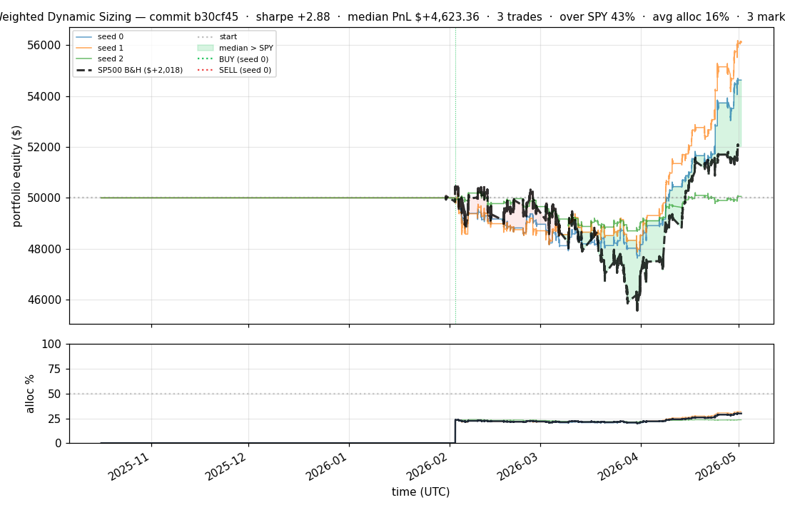
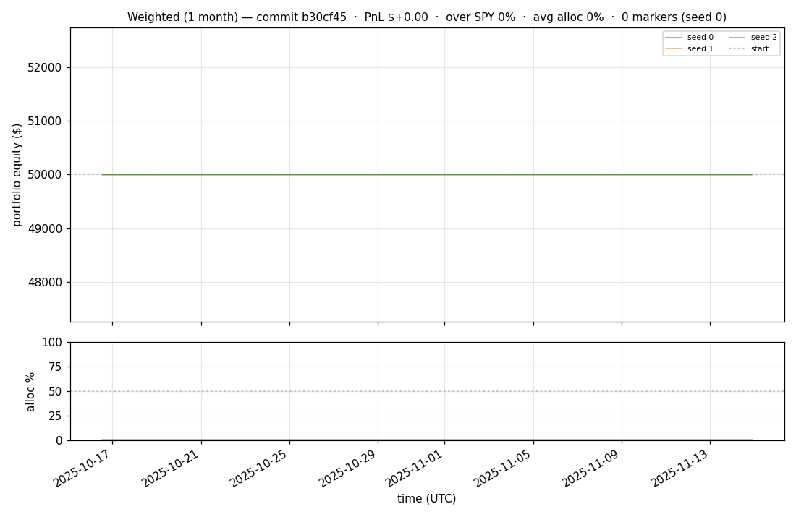
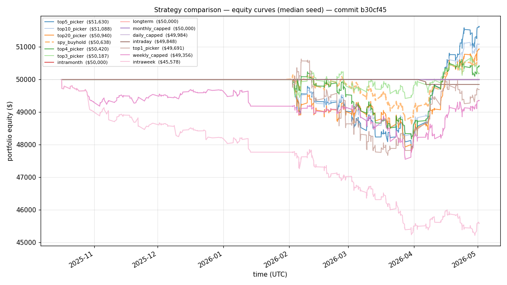
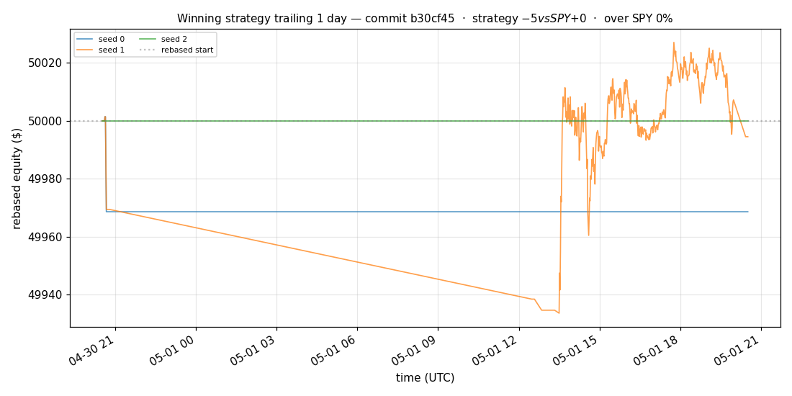
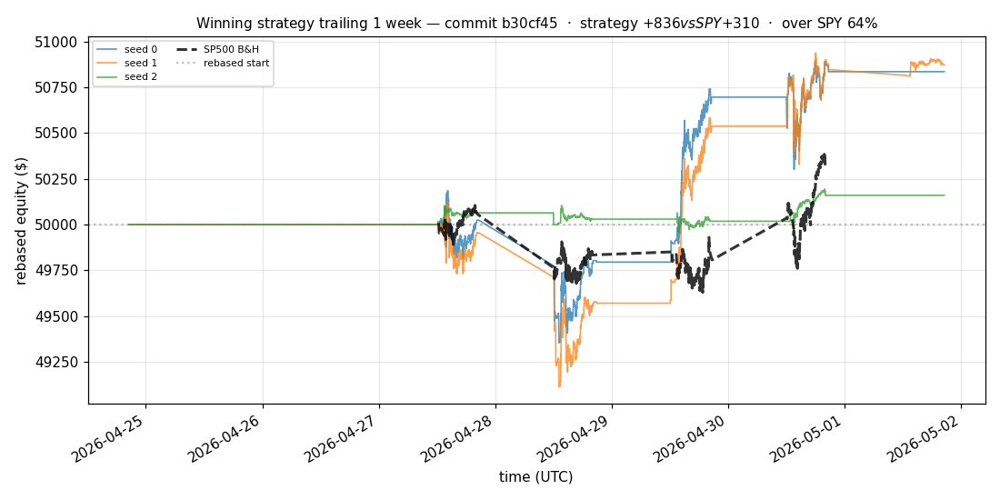
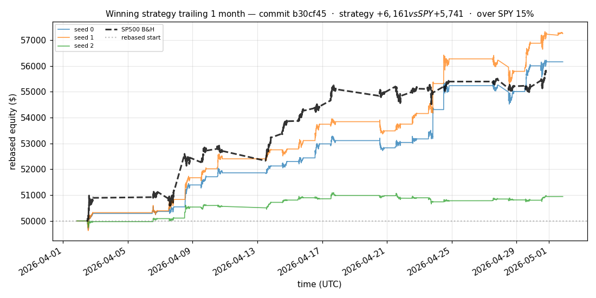
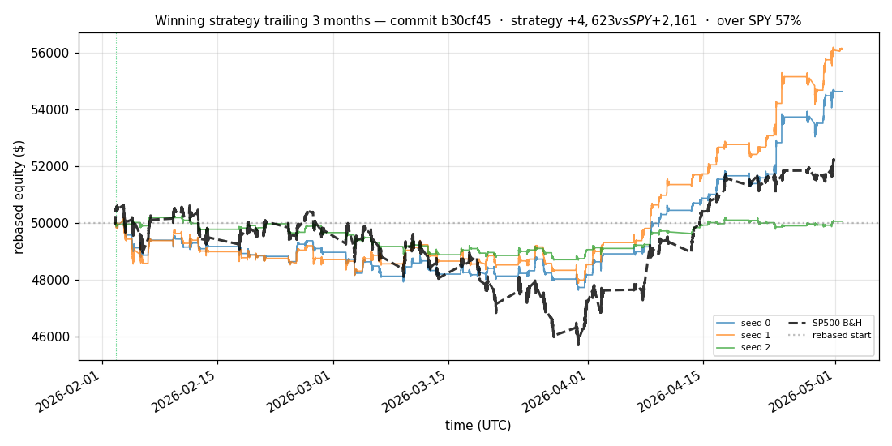
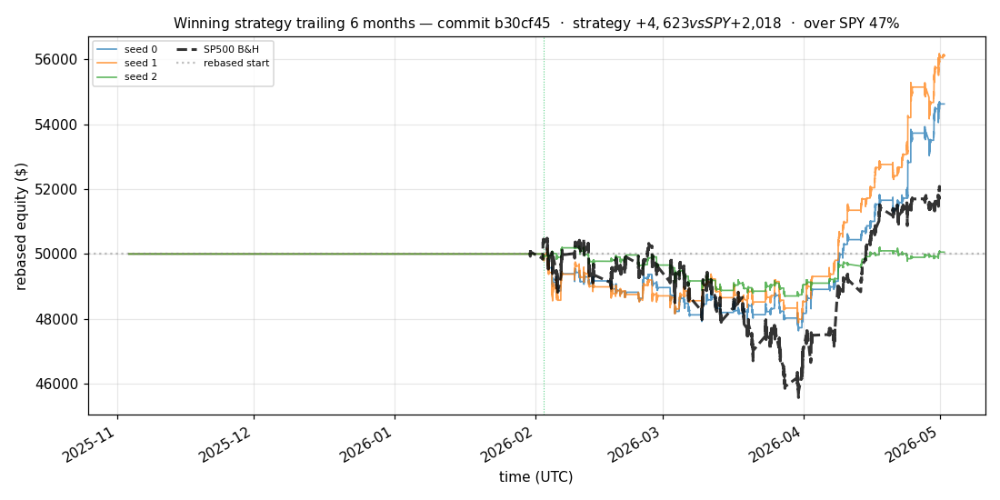

# iter 135 — b30cf45

**🟢 KEEP** · exp135: quarter readiness with 68.75pct reserve

_2026-05-04 23:16 UTC · 377s wall_

## Result

| metric | value |
|---|---|
| Sharpe (median) | **+2.881** |
| Sharpe CI low (5%) | +0.550 |
| Sharpe CI high (95%) | +5.761 |
| % time above SPY | 43.395% |
| Net PnL | **$+4623.36** (+9.247%) |
| Max drawdown | -4.99% |
| Trades | 3 |
| Fees | $3.00 |
| Seeds completed | 3 |

**Decision reason:** objective=+0.5934 > prior best +0.5920 (ci_low=+0.5500, over_spy=43.4%)

## Winning strategy

Canonical strategy for this iteration: **top4 cross-sectional picker** — rank symbols by the transformer's 4h + 1d forecast Sharpe, buy the top four once enough symbols are ready, hold through the eval window, and keep 3 median trades after costs.

A **seed** is one independent training/evaluation run with a different random initialization and sampling path. The gate uses median/worst-tail statistics across seeds so one lucky seed cannot define the best checkpoint.

Positive seed transaction tables are shown later in this report; losing or flat seed transaction tables are omitted to keep reports focused on actionable winners.

## Per-seed details

```
[evaluator] seed 0: sharpe=+2.881  dd=-4.99%  pnl=$+4,623.36  trades=3
[evaluator] seed 1: sharpe=+3.375  dd=-4.57%  pnl=$+6,106.14  trades=3
[evaluator] seed 2: sharpe=+0.094  dd=-3.09%  pnl=$+57.55  trades=3
```

## Equity curve (full eval window, ~73 days)



## Equity curve (first month)



## Strategy comparison (equity curves)

Overlays every profile (intraday/intraweek/intramonth/longterm + 
daily-capped/weekly-capped/monthly-capped trade-frequency variants 
+ topN pickers + SPY benchmark) on one chart, using the median-seed run.



## Recent live-style simulations vs SP500

Each chart rebases the winning strategy and SP500 to $50,000 at the start of the trailing window, ending at the latest available bar.

### Trailing 1 day



### Trailing 1 week



### Trailing 1 month



### Trailing 3 months



### Trailing 6 months



## Trader profile comparison

Same trained model, different time-horizon strategies + SPY benchmark + passive top-N pickers.

| profile | sharpe | PnL ($) | PnL % | trades | DD % | horizon |
|---|---:|---:|---:|---:|---:|---:|
| **daily_capped** | -1.947 | $-16.00 | -0.03% | 2 | -0.03% | 1d |
| **intraday** | -12.965 | $-11,694.72 | -23.39% | 5210 | -23.39% | 2h |
| **intramonth** | -0.093 | $-3.29 | -0.01% | 2 | -0.07% | 30d |
| **intraweek** | -4.825 | $-4,546.14 | -9.09% | 981 | -9.60% | 5d |
| **longterm** | +0.000 | $+0.00 | +0.00% | 2 | -0.07% | 30d |
| **monthly_capped** | +0.000 | $+0.00 | +0.00% | 0 | +0.00% | 30d |
| **spy_buyhold** | +0.985 | $+630.30 | +1.26% | 1 | -3.06% | - |
| **top10_picker** | +1.270 | $+2,322.18 | +4.64% | 9 | -4.73% | - |
| **top1_picker** | +0.000 | $+0.00 | +0.00% | 1 | -2.85% | - |
| **top20_picker** | +0.968 | $+931.22 | +1.86% | 19 | -4.52% | - |
| **top3_picker** | +2.288 | $+6,833.34 | +13.67% | 2 | -4.64% | - |
| **top4_picker** | +0.433 | $+394.34 | +0.79% | 3 | -4.20% | - |
| **top5_picker** | +1.475 | $+4,822.67 | +9.65% | 4 | -4.58% | - |
| **weekly_capped** | -0.681 | $-662.77 | -1.33% | 89 | -2.90% | 5d |

**Best active strategy: `top3_picker` (sharpe +2.288) — BEATS SPY ✓**

## Out-of-symbol holdout eval

Tested on **JPM, WMT, V, DIS, JNJ** — large-caps the model NEVER saw during training.

| seed | sharpe | PnL | trades | DD% |
|---:|---:|---:|---:|---:|
| 0 | +0.352 | $+205.20 | 5 | -2.96% |
| 1 | +0.377 | $+221.68 | 9 | -2.93% |
| 2 | +0.352 | $+205.20 | 5 | -2.96% |
| 3 | +0.327 | $+504.54 | 5 | -9.19% |
| 4 | +0.000 | $+0.00 | 0 | +0.00% |

**Median holdout sharpe: +0.352** (vs in-symbol +2.881)

## Transactions

_(no profitable per-seed transaction table; losing/flat seeds omitted)_

## Diff vs previous experiment

```diff
b30cf45 exp135: quarter readiness with 68.75pct reserve


 experiment.py | 4 ++--
 1 file changed, 2 insertions(+), 2 deletions(-)
```

---

[← all iterations](.) · [back to README](../README.md)
