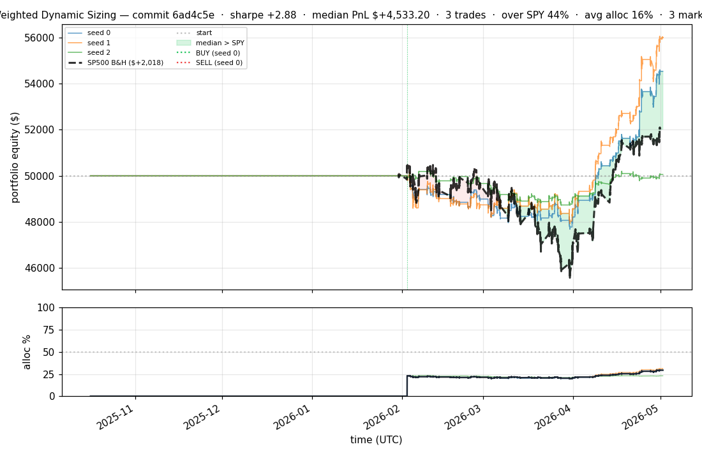
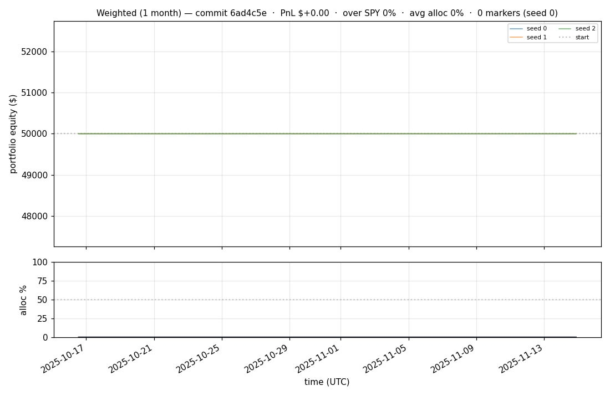
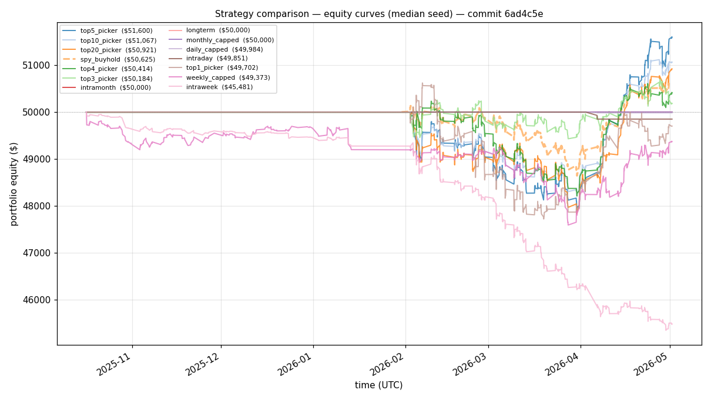
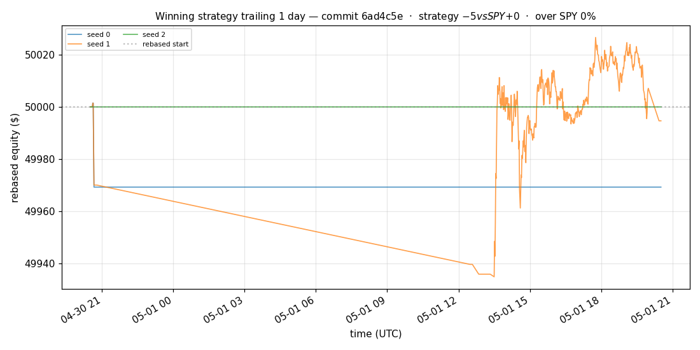
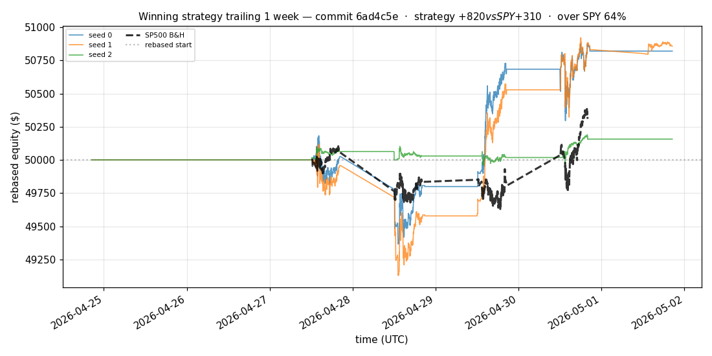
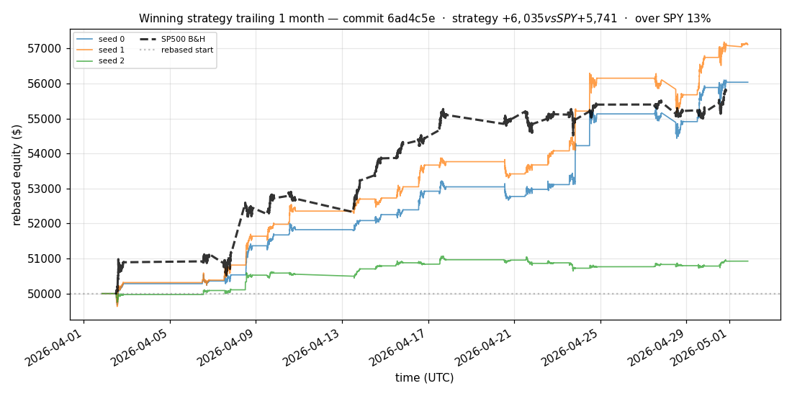
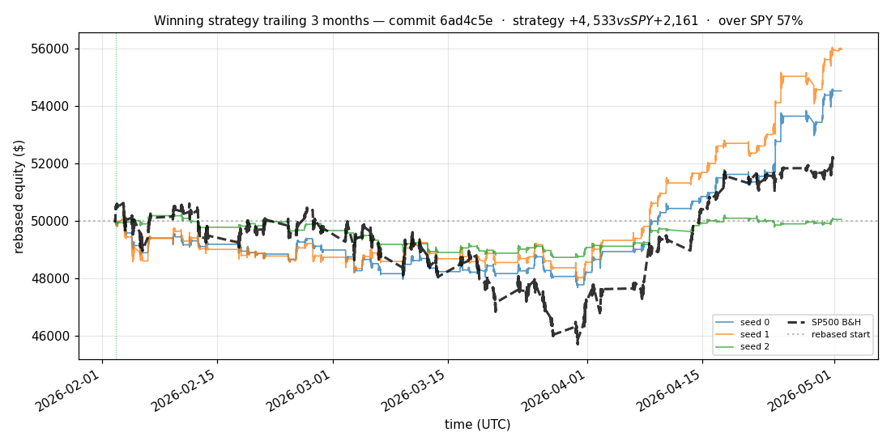
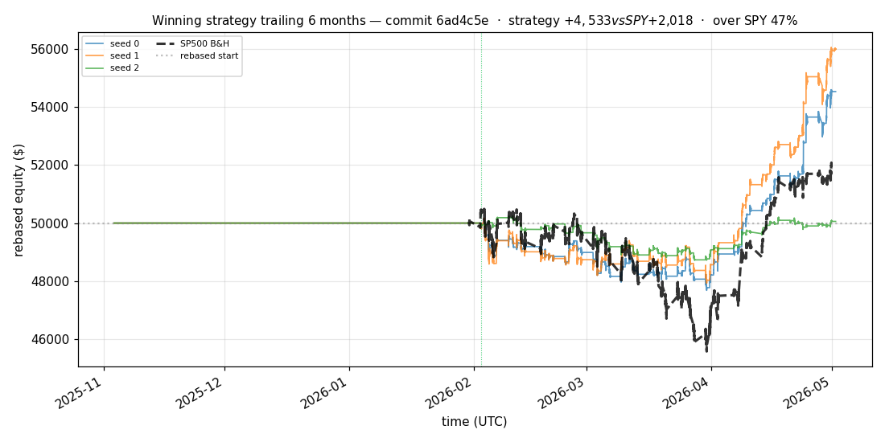

# iter 136 — 6ad4c5e

**🟢 KEEP** · exp136: quarter readiness with 69.375pct reserve

_2026-05-04 23:23 UTC · 380s wall_

## Result

| metric | value |
|---|---|
| Sharpe (median) | **+2.883** |
| Sharpe CI low (5%) | +0.551 |
| Sharpe CI high (95%) | +5.764 |
| % time above SPY | 43.820% |
| Net PnL | **$+4533.20** (+9.066%) |
| Max drawdown | -4.89% |
| Trades | 3 |
| Fees | $3.00 |
| Seeds completed | 3 |

**Decision reason:** objective=+0.5948 > prior best +0.5938 (ci_low=+0.5510, over_spy=43.8%)

## Winning strategy

Canonical strategy for this iteration: **top4 cross-sectional picker** — rank symbols by the transformer's 4h + 1d forecast Sharpe, buy the top four once enough symbols are ready, hold through the eval window, and keep 3 median trades after costs.

A **seed** is one independent training/evaluation run with a different random initialization and sampling path. The gate uses median/worst-tail statistics across seeds so one lucky seed cannot define the best checkpoint.

Positive seed transaction tables are shown later in this report; losing or flat seed transaction tables are omitted to keep reports focused on actionable winners.

## Per-seed details

```
[evaluator] seed 0: sharpe=+2.883  dd=-4.89%  pnl=$+4,533.20  trades=3
[evaluator] seed 1: sharpe=+3.378  dd=-4.48%  pnl=$+5,987.10  trades=3
[evaluator] seed 2: sharpe=+0.095  dd=-3.03%  pnl=$+56.88  trades=3
```

## Equity curve (full eval window, ~73 days)



## Equity curve (first month)



## Strategy comparison (equity curves)

Overlays every profile (intraday/intraweek/intramonth/longterm + 
daily-capped/weekly-capped/monthly-capped trade-frequency variants 
+ topN pickers + SPY benchmark) on one chart, using the median-seed run.



## Recent live-style simulations vs SP500

Each chart rebases the winning strategy and SP500 to $50,000 at the start of the trailing window, ending at the latest available bar.

### Trailing 1 day



### Trailing 1 week



### Trailing 1 month



### Trailing 3 months



### Trailing 6 months



## Trader profile comparison

Same trained model, different time-horizon strategies + SPY benchmark + passive top-N pickers.

| profile | sharpe | PnL ($) | PnL % | trades | DD % | horizon |
|---|---:|---:|---:|---:|---:|---:|
| **daily_capped** | -1.947 | $-15.57 | -0.03% | 2 | -0.03% | 1d |
| **intraday** | -12.965 | $-11,536.44 | -23.07% | 5210 | -23.07% | 2h |
| **intramonth** | -0.076 | $-2.62 | -0.01% | 2 | -0.07% | 30d |
| **intraweek** | -5.311 | $-4,742.22 | -9.48% | 981 | -9.98% | 5d |
| **longterm** | +0.000 | $+0.00 | +0.00% | 2 | -0.07% | 30d |
| **monthly_capped** | +0.000 | $+0.00 | +0.00% | 0 | +0.00% | 30d |
| **spy_buyhold** | +0.984 | $+617.69 | +1.24% | 1 | -3.00% | - |
| **top10_picker** | +1.271 | $+2,276.60 | +4.55% | 9 | -4.64% | - |
| **top1_picker** | +0.000 | $+0.00 | +0.00% | 1 | -2.79% | - |
| **top20_picker** | +0.969 | $+912.90 | +1.83% | 19 | -4.43% | - |
| **top3_picker** | +2.288 | $+6,699.43 | +13.40% | 2 | -4.55% | - |
| **top4_picker** | +0.436 | $+389.04 | +0.78% | 3 | -4.12% | - |
| **top5_picker** | +1.477 | $+4,728.15 | +9.46% | 4 | -4.49% | - |
| **weekly_capped** | -0.679 | $-646.39 | -1.29% | 87 | -2.83% | 5d |

**Best active strategy: `top3_picker` (sharpe +2.288) — BEATS SPY ✓**

## Out-of-symbol holdout eval

Tested on **JPM, WMT, V, DIS, JNJ** — large-caps the model NEVER saw during training.

| seed | sharpe | PnL | trades | DD% |
|---:|---:|---:|---:|---:|
| 0 | +0.356 | $+203.48 | 5 | -2.91% |
| 1 | +0.382 | $+220.46 | 9 | -2.88% |
| 2 | +0.356 | $+203.48 | 5 | -2.91% |
| 3 | +0.327 | $+504.54 | 5 | -9.19% |
| 4 | +0.000 | $+0.00 | 0 | +0.00% |

**Median holdout sharpe: +0.356** (vs in-symbol +2.883)

## Transactions

_(no profitable per-seed transaction table; losing/flat seeds omitted)_

## Diff vs previous experiment

```diff
6ad4c5e exp136: quarter readiness with 69.375pct reserve


 experiment.py | 4 ++--
 1 file changed, 2 insertions(+), 2 deletions(-)
```

---

[← all iterations](.) · [back to README](../README.md)
