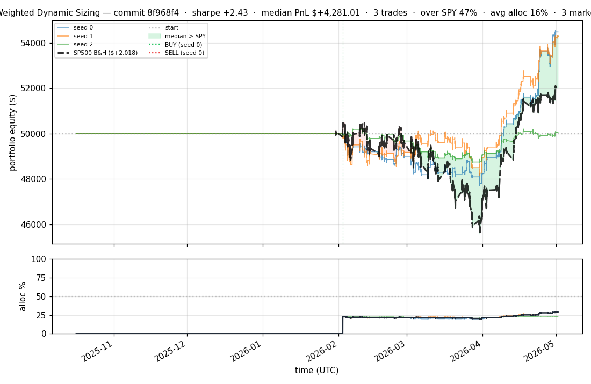
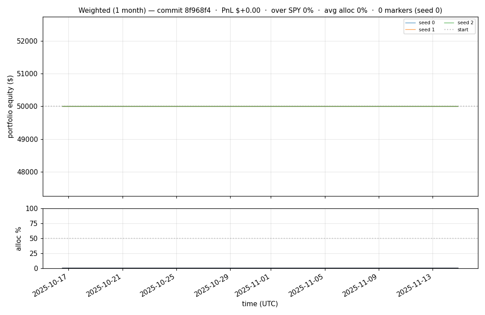
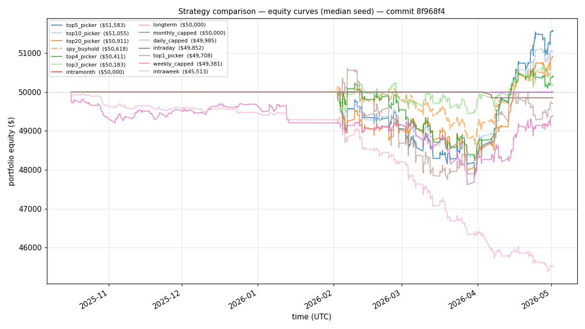
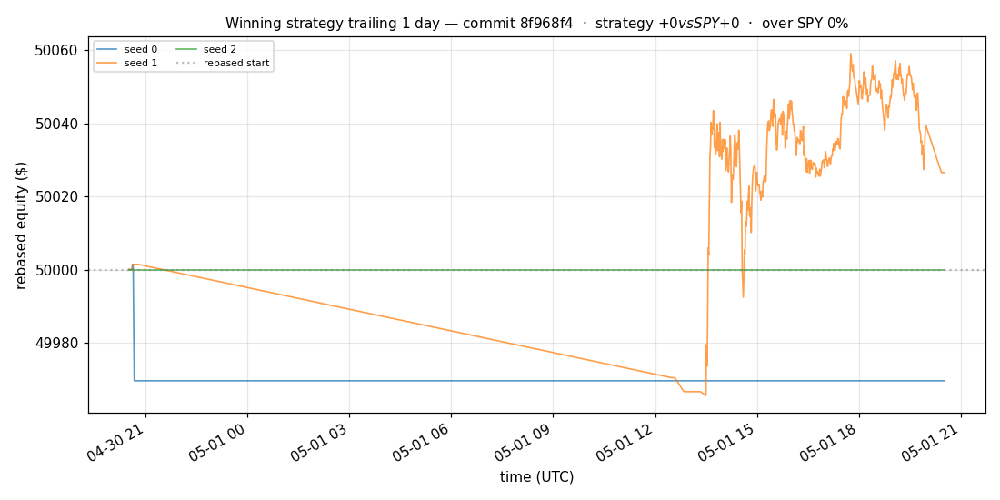
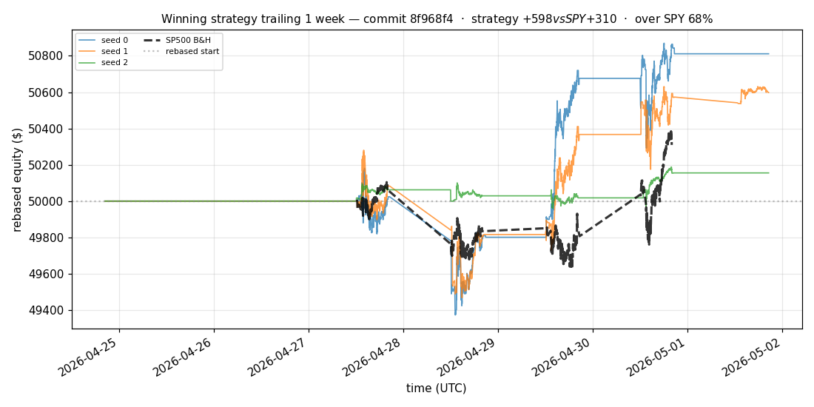
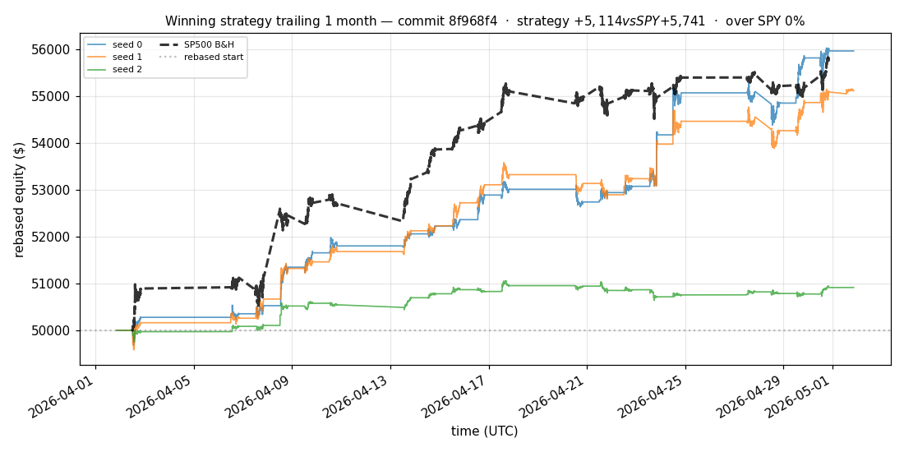
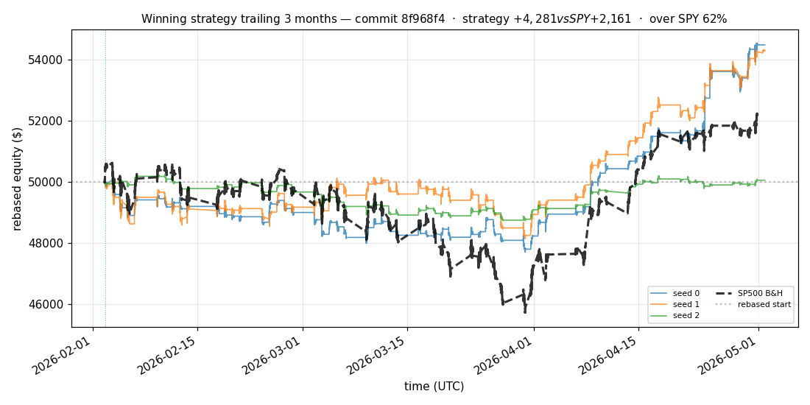
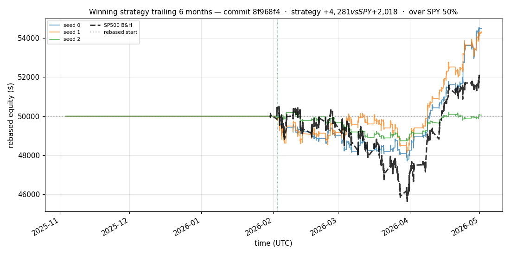

# iter 140 — 8f968f4

**🔴 DISCARD** · exp140: quarter readiness with 69.7265625pct reserve

_2026-05-04 23:51 UTC · 373s wall_

## Result

| metric | value |
|---|---|
| Sharpe (median) | **+2.426** |
| Sharpe CI low (5%) | -0.180 |
| Sharpe CI high (95%) | +4.977 |
| % time above SPY | 47.012% |
| Net PnL | **$+4281.01** (+8.562%) |
| Max drawdown | -4.84% |
| Trades | 3 |
| Fees | $3.00 |
| Seeds completed | 3 |

**Decision reason:** objective=-0.1330 ≤ prior best +0.5954 (ci_low=-0.1800, over_spy=47.0%)

## Winning strategy

Canonical strategy for this iteration: **top4 cross-sectional picker** — rank symbols by the transformer's 4h + 1d forecast Sharpe, buy the top four once enough symbols are ready, hold through the eval window, and keep 3 median trades after costs.

A **seed** is one independent training/evaluation run with a different random initialization and sampling path. The gate uses median/worst-tail statistics across seeds so one lucky seed cannot define the best checkpoint.

Positive seed transaction tables are shown later in this report; losing or flat seed transaction tables are omitted to keep reports focused on actionable winners.

## Per-seed details

```
[evaluator] seed 0: sharpe=+2.884  dd=-4.84%  pnl=$+4,482.45  trades=3
[evaluator] seed 1: sharpe=+2.426  dd=-3.98%  pnl=$+4,281.01  trades=3
[evaluator] seed 2: sharpe=+0.095  dd=-3.00%  pnl=$+56.50  trades=3
```

## Equity curve (full eval window, ~73 days)



## Equity curve (first month)



## Strategy comparison (equity curves)

Overlays every profile (intraday/intraweek/intramonth/longterm + 
daily-capped/weekly-capped/monthly-capped trade-frequency variants 
+ topN pickers + SPY benchmark) on one chart, using the median-seed run.



## Recent live-style simulations vs SP500

Each chart rebases the winning strategy and SP500 to $50,000 at the start of the trailing window, ending at the latest available bar.

### Trailing 1 day



### Trailing 1 week



### Trailing 1 month



### Trailing 3 months



### Trailing 6 months



## Trader profile comparison

Same trained model, different time-horizon strategies + SPY benchmark + passive top-N pickers.

| profile | sharpe | PnL ($) | PnL % | trades | DD % | horizon |
|---|---:|---:|---:|---:|---:|---:|
| **daily_capped** | -1.947 | $-15.33 | -0.03% | 2 | -0.03% | 1d |
| **intraday** | -12.965 | $-11,439.38 | -22.88% | 5210 | -22.88% | 2h |
| **intramonth** | -0.066 | $-2.26 | -0.00% | 2 | -0.07% | 30d |
| **intraweek** | -5.308 | $-4,685.21 | -9.37% | 981 | -9.86% | 5d |
| **longterm** | +0.000 | $+0.00 | +0.00% | 2 | -0.07% | 30d |
| **monthly_capped** | +0.000 | $+0.00 | +0.00% | 0 | +0.00% | 30d |
| **spy_buyhold** | +0.984 | $+610.60 | +1.22% | 1 | -2.96% | - |
| **top10_picker** | +1.271 | $+2,250.96 | +4.50% | 9 | -4.58% | - |
| **top1_picker** | +0.000 | $+0.00 | +0.00% | 1 | -2.76% | - |
| **top20_picker** | +0.969 | $+902.59 | +1.81% | 19 | -4.38% | - |
| **top3_picker** | +2.288 | $+6,624.06 | +13.25% | 2 | -4.50% | - |
| **top4_picker** | +0.437 | $+386.01 | +0.77% | 3 | -4.07% | - |
| **top5_picker** | +1.478 | $+4,674.95 | +9.35% | 4 | -4.44% | - |
| **weekly_capped** | -0.678 | $-638.10 | -1.28% | 87 | -2.80% | 5d |

**Best active strategy: `top3_picker` (sharpe +2.288) — BEATS SPY ✓**

## Out-of-symbol holdout eval

Tested on **JPM, WMT, V, DIS, JNJ** — large-caps the model NEVER saw during training.

| seed | sharpe | PnL | trades | DD% |
|---:|---:|---:|---:|---:|
| 0 | +0.358 | $+203.03 | 5 | -2.87% |
| 1 | +0.386 | $+220.26 | 9 | -2.84% |
| 2 | +0.358 | $+203.03 | 5 | -2.87% |
| 3 | +0.327 | $+504.54 | 5 | -9.19% |
| 4 | +0.000 | $+0.00 | 0 | +0.00% |

**Median holdout sharpe: +0.358** (vs in-symbol +2.426)

## Transactions

_(no profitable per-seed transaction table; losing/flat seeds omitted)_

## Diff vs previous experiment

```diff
8f968f4 exp140: quarter readiness with 69.7265625pct reserve


 experiment.py | 4 ++--
 1 file changed, 2 insertions(+), 2 deletions(-)
```

---

[← all iterations](.) · [back to README](../README.md)
