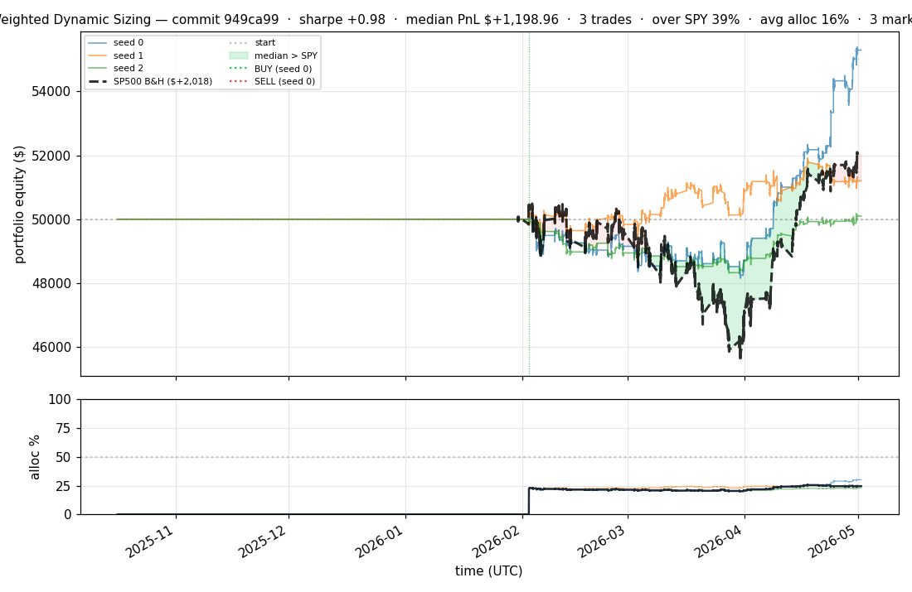
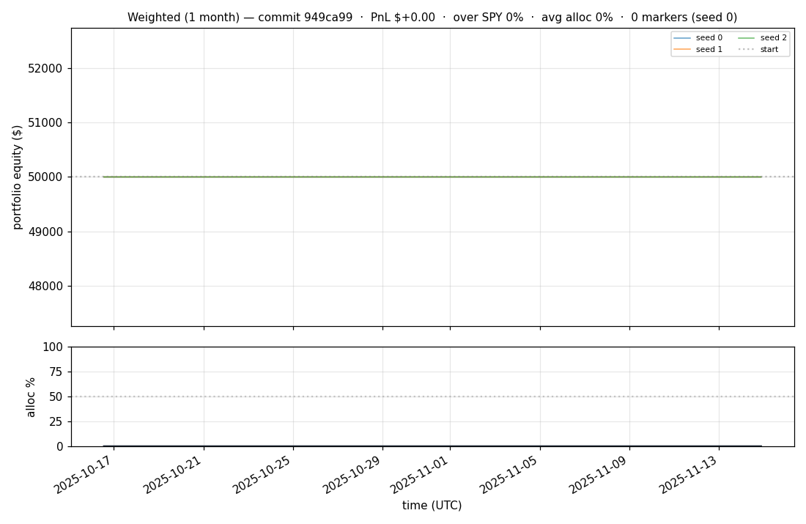
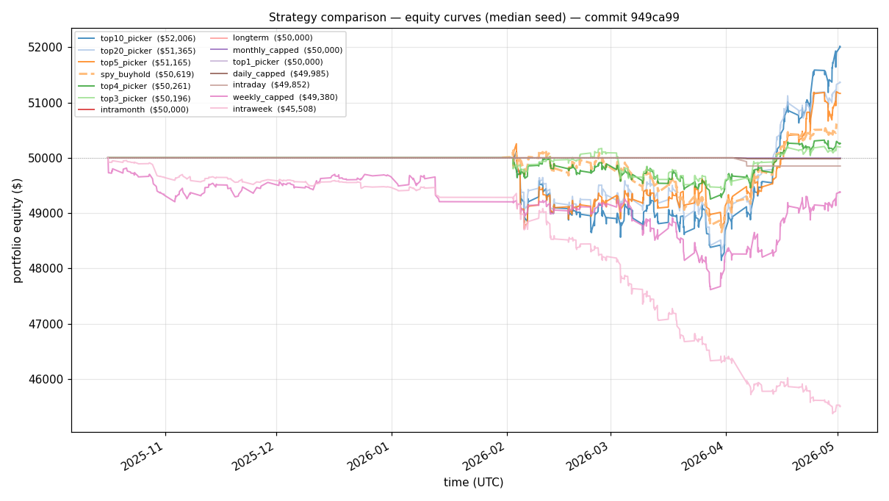
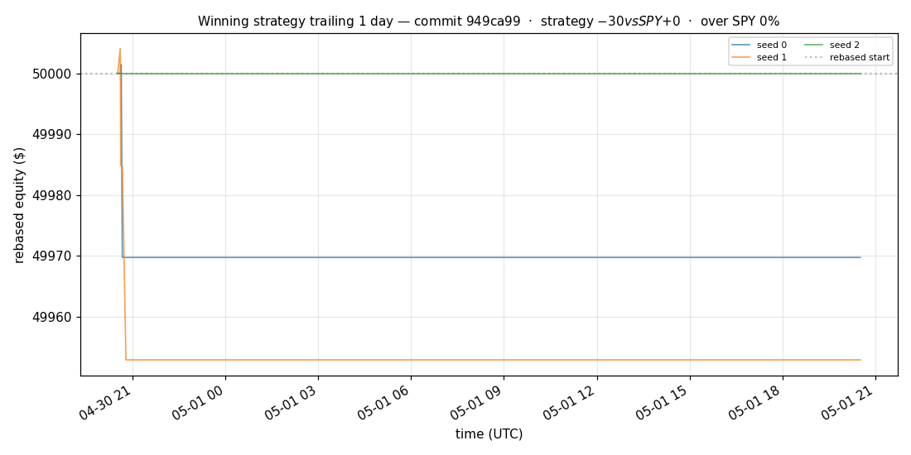
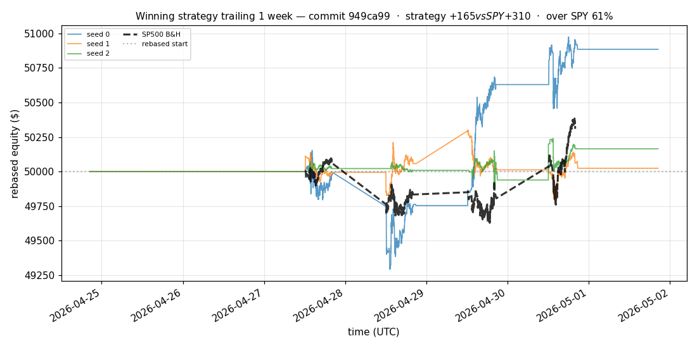
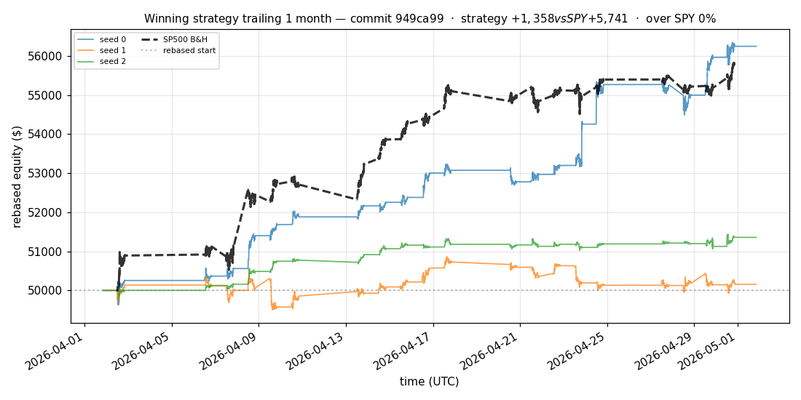
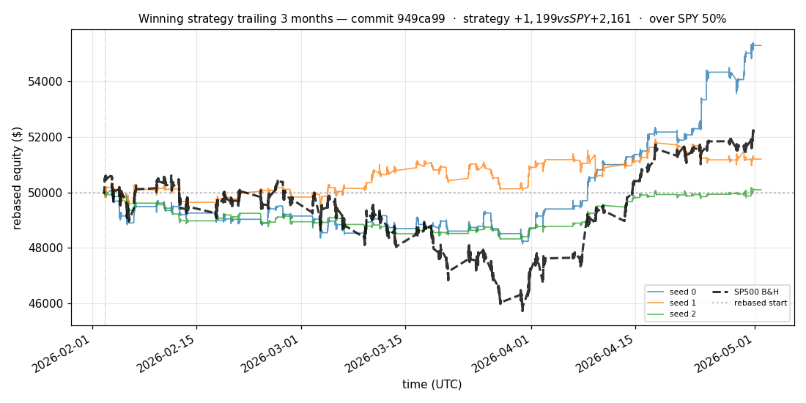
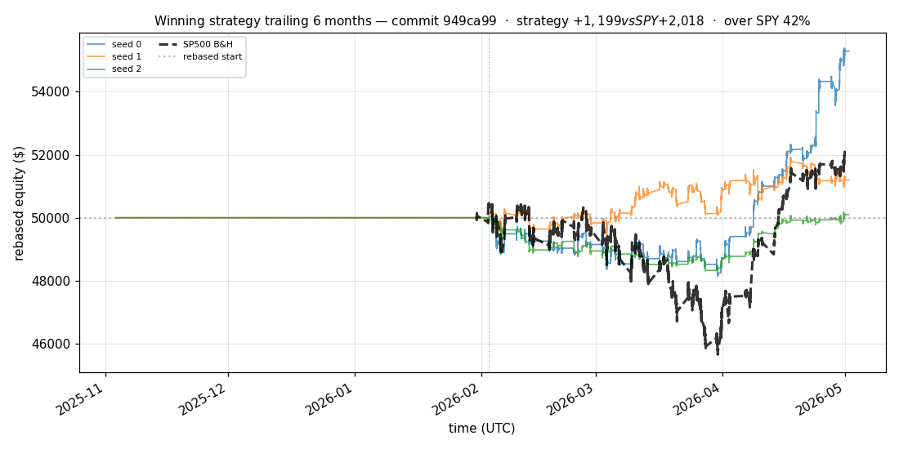

# iter 142 — 949ca99

**🔴 DISCARD** · exp142: as-of top4 universe ranking

_2026-05-05 00:07 UTC · 372s wall_

## Result

| metric | value |
|---|---|
| Sharpe (median) | **+0.980** |
| Sharpe CI low (5%) | -1.633 |
| Sharpe CI high (95%) | +3.414 |
| % time above SPY | 39.161% |
| Net PnL | **$+1198.96** (+2.398%) |
| Max drawdown | -4.09% |
| Trades | 3 |
| Fees | $3.00 |
| Seeds completed | 3 |

**Decision reason:** objective=-1.5938 ≤ prior best +0.5954 (ci_low=-1.6330, over_spy=39.2%)

## Winning strategy

Canonical strategy for this iteration: **top4 cross-sectional picker** — rank symbols by the transformer's 4h + 1d forecast Sharpe, buy the top four once enough symbols are ready, hold through the eval window, and keep 3 median trades after costs.

A **seed** is one independent training/evaluation run with a different random initialization and sampling path. The gate uses median/worst-tail statistics across seeds so one lucky seed cannot define the best checkpoint.

Positive seed transaction tables are shown later in this report; losing or flat seed transaction tables are omitted to keep reports focused on actionable winners.

## Per-seed details

```
[evaluator] seed 0: sharpe=+3.316  dd=-4.09%  pnl=$+5,292.75  trades=3
[evaluator] seed 1: sharpe=+0.980  dd=-2.09%  pnl=$+1,198.96  trades=3
[evaluator] seed 2: sharpe=+0.138  dd=-3.45%  pnl=$+97.35  trades=3
```

## Equity curve (full eval window, ~73 days)



## Equity curve (first month)



## Strategy comparison (equity curves)

Overlays every profile (intraday/intraweek/intramonth/longterm + 
daily-capped/weekly-capped/monthly-capped trade-frequency variants 
+ topN pickers + SPY benchmark) on one chart, using the median-seed run.



## Recent live-style simulations vs SP500

Each chart rebases the winning strategy and SP500 to $50,000 at the start of the trailing window, ending at the latest available bar.

### Trailing 1 day



### Trailing 1 week



### Trailing 1 month



### Trailing 3 months



### Trailing 6 months



## Trader profile comparison

Same trained model, different time-horizon strategies + SPY benchmark + passive top-N pickers.

| profile | sharpe | PnL ($) | PnL % | trades | DD % | horizon |
|---|---:|---:|---:|---:|---:|---:|
| **daily_capped** | -1.947 | $-15.35 | -0.03% | 2 | -0.03% | 1d |
| **intraday** | -12.965 | $-11,427.81 | -22.86% | 5210 | -22.86% | 2h |
| **intramonth** | -0.067 | $-2.30 | -0.00% | 2 | -0.07% | 30d |
| **intraweek** | -5.308 | $-4,691.55 | -9.38% | 981 | -9.88% | 5d |
| **longterm** | +0.000 | $+0.00 | +0.00% | 2 | -0.07% | 30d |
| **monthly_capped** | +0.000 | $+0.00 | +0.00% | 0 | +0.00% | 30d |
| **spy_buyhold** | +0.984 | $+611.38 | +1.22% | 1 | -2.97% | - |
| **top10_picker** | +1.710 | $+2,458.04 | +4.92% | 9 | -4.03% | - |
| **top1_picker** | +0.000 | $+0.00 | +0.00% | 0 | +0.00% | - |
| **top20_picker** | +1.384 | $+1,361.92 | +2.72% | 19 | -3.55% | - |
| **top3_picker** | +1.575 | $+2,045.46 | +4.09% | 2 | -2.41% | - |
| **top4_picker** | +0.462 | $+249.92 | +0.50% | 3 | -2.09% | - |
| **top5_picker** | +1.455 | $+1,397.31 | +2.79% | 4 | -3.25% | - |
| **weekly_capped** | -0.678 | $-639.02 | -1.28% | 87 | -2.80% | 5d |

**Best active strategy: `top10_picker` (sharpe +1.710) — BEATS SPY ✓**

## Out-of-symbol holdout eval

Tested on **JPM, WMT, V, DIS, JNJ** — large-caps the model NEVER saw during training.

| seed | sharpe | PnL | trades | DD% |
|---:|---:|---:|---:|---:|
| 0 | +0.358 | $+203.08 | 5 | -2.88% |
| 1 | +0.385 | $+220.29 | 9 | -2.85% |
| 2 | +0.358 | $+203.08 | 5 | -2.88% |
| 3 | +0.327 | $+504.54 | 5 | -9.19% |
| 4 | +0.000 | $+0.00 | 0 | +0.00% |

**Median holdout sharpe: +0.358** (vs in-symbol +0.980)

## Transactions

_(no profitable per-seed transaction table; losing/flat seeds omitted)_

## Diff vs previous experiment

```diff
949ca99 exp142: as-of top4 universe ranking


 experiment.py | 6 +++---
 1 file changed, 3 insertions(+), 3 deletions(-)
```

---

[← all iterations](.) · [back to README](../README.md)
