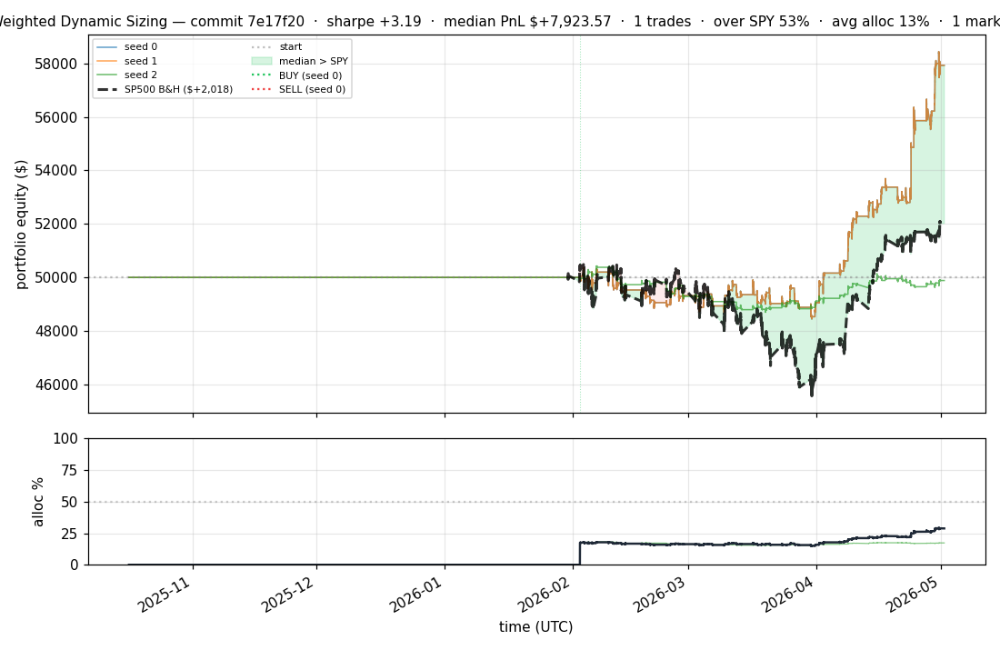
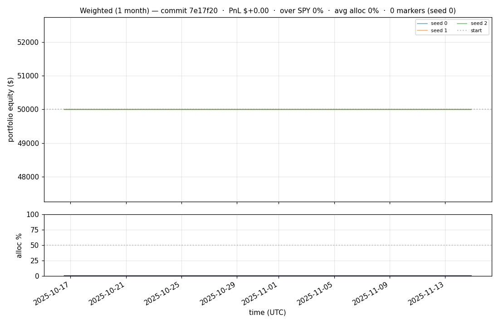
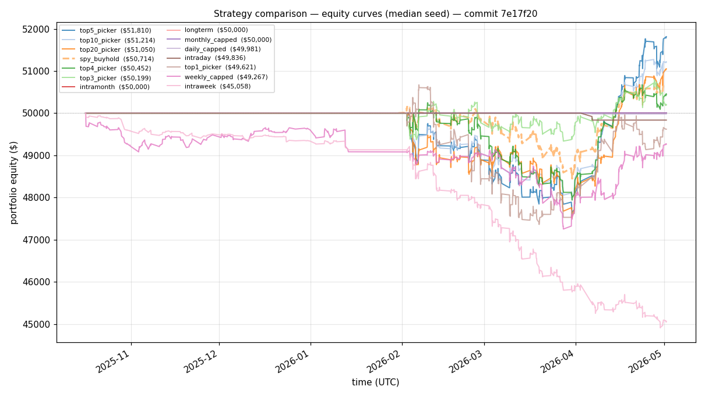
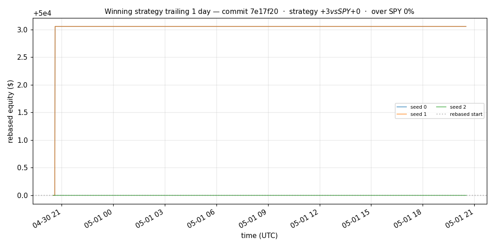
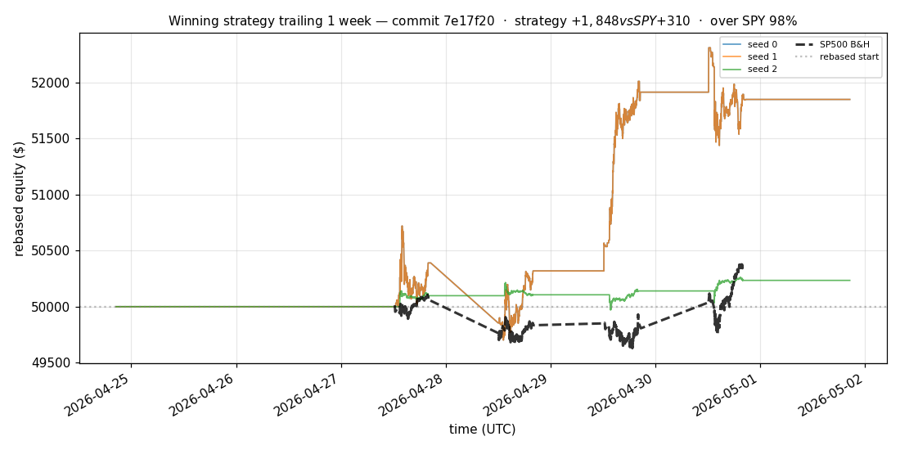
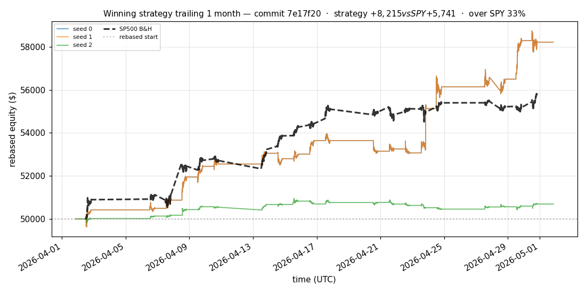
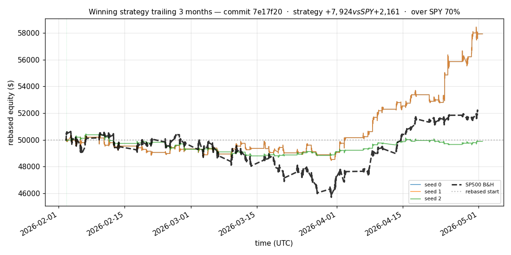
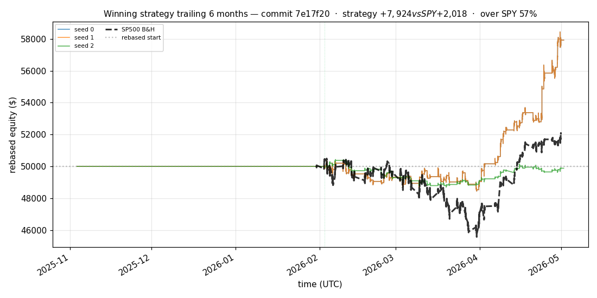

# iter 146 — 7e17f20

**🔴 DISCARD** · exp146: top2 with 65pct reserve

_2026-05-05 00:36 UTC · 374s wall_

## Result

| metric | value |
|---|---|
| Sharpe (median) | **+3.190** |
| Sharpe CI low (5%) | +0.809 |
| Sharpe CI high (95%) | +5.679 |
| % time above SPY | 53.039% |
| Net PnL | **$+7923.57** (+15.847%) |
| Max drawdown | -3.79% |
| Trades | 1 |
| Fees | $1.00 |
| Seeds completed | 3 |

**Decision reason:** objective=+0.8620 ≤ prior best +0.8959 (ci_low=+0.8090, over_spy=53.0%)

## Winning strategy

Canonical strategy for this iteration: **top4 cross-sectional picker** — rank symbols by the transformer's 4h + 1d forecast Sharpe, buy the top four once enough symbols are ready, hold through the eval window, and keep 1 median trades after costs.

A **seed** is one independent training/evaluation run with a different random initialization and sampling path. The gate uses median/worst-tail statistics across seeds so one lucky seed cannot define the best checkpoint.

Positive seed transaction tables are shown later in this report; losing or flat seed transaction tables are omitted to keep reports focused on actionable winners.

## Per-seed details

```
[evaluator] seed 0: sharpe=+3.190  dd=-3.79%  pnl=$+7,923.57  trades=1
[evaluator] seed 1: sharpe=+3.190  dd=-3.79%  pnl=$+7,923.57  trades=1
[evaluator] seed 2: sharpe=-0.122  dd=-3.44%  pnl=$-114.05  trades=1
```

## Equity curve (full eval window, ~73 days)



## Equity curve (first month)



## Strategy comparison (equity curves)

Overlays every profile (intraday/intraweek/intramonth/longterm + 
daily-capped/weekly-capped/monthly-capped trade-frequency variants 
+ topN pickers + SPY benchmark) on one chart, using the median-seed run.



## Recent live-style simulations vs SP500

Each chart rebases the winning strategy and SP500 to $50,000 at the start of the trailing window, ending at the latest available bar.

### Trailing 1 day



### Trailing 1 week



### Trailing 1 month



### Trailing 3 months



### Trailing 6 months



## Trader profile comparison

Same trained model, different time-horizon strategies + SPY benchmark + passive top-N pickers.

| profile | sharpe | PnL ($) | PnL % | trades | DD % | horizon |
|---|---:|---:|---:|---:|---:|---:|
| **daily_capped** | -1.947 | $-18.79 | -0.04% | 2 | -0.04% | 1d |
| **intraday** | -12.965 | $-13,157.34 | -26.31% | 5210 | -26.31% | 2h |
| **intramonth** | -0.193 | $-7.82 | -0.02% | 2 | -0.08% | 30d |
| **intraweek** | -5.504 | $-5,553.77 | -11.11% | 981 | -11.72% | 5d |
| **longterm** | +0.000 | $+0.00 | +0.00% | 2 | -0.08% | 30d |
| **monthly_capped** | +0.000 | $+0.00 | +0.00% | 0 | +0.00% | 30d |
| **spy_buyhold** | +0.986 | $+705.94 | +1.41% | 1 | -3.43% | - |
| **top10_picker** | +1.264 | $+2,594.78 | +5.19% | 9 | -5.30% | - |
| **top1_picker** | +0.000 | $+0.00 | +0.00% | 1 | -3.18% | - |
| **top20_picker** | +0.966 | $+1,040.56 | +2.08% | 19 | -5.06% | - |
| **top3_picker** | +2.288 | $+7,634.42 | +15.27% | 2 | -5.19% | - |
| **top4_picker** | +0.419 | $+423.96 | +0.85% | 3 | -4.70% | - |
| **top5_picker** | +1.461 | $+5,320.34 | +10.64% | 4 | -5.13% | - |
| **weekly_capped** | -0.688 | $-754.38 | -1.51% | 90 | -3.25% | 5d |

**Best active strategy: `top3_picker` (sharpe +2.288) — BEATS SPY ✓**

## Out-of-symbol holdout eval

Tested on **JPM, WMT, V, DIS, JNJ** — large-caps the model NEVER saw during training.

| seed | sharpe | PnL | trades | DD% |
|---:|---:|---:|---:|---:|
| 0 | +0.336 | $+216.29 | 5 | -3.32% |
| 1 | +0.353 | $+229.08 | 9 | -3.28% |
| 2 | +0.336 | $+216.29 | 5 | -3.32% |
| 3 | +0.327 | $+504.54 | 5 | -9.19% |
| 4 | +0.000 | $+0.00 | 0 | +0.00% |

**Median holdout sharpe: +0.336** (vs in-symbol +3.190)

## Transactions

_(no profitable per-seed transaction table; losing/flat seeds omitted)_

## Diff vs previous experiment

```diff
7e17f20 exp146: top2 with 65pct reserve


 experiment.py | 8 ++++----
 1 file changed, 4 insertions(+), 4 deletions(-)
```

---

[← all iterations](.) · [back to README](../README.md)
