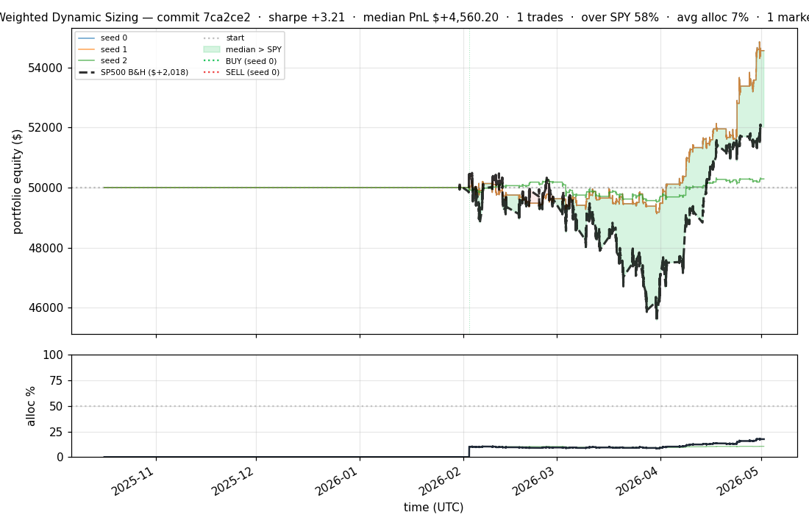
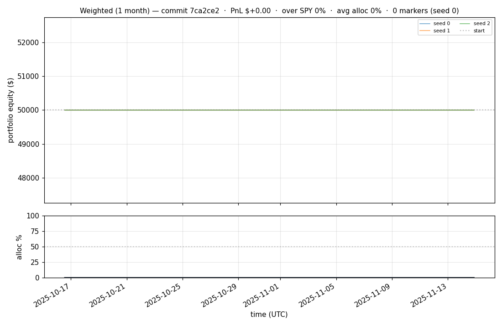
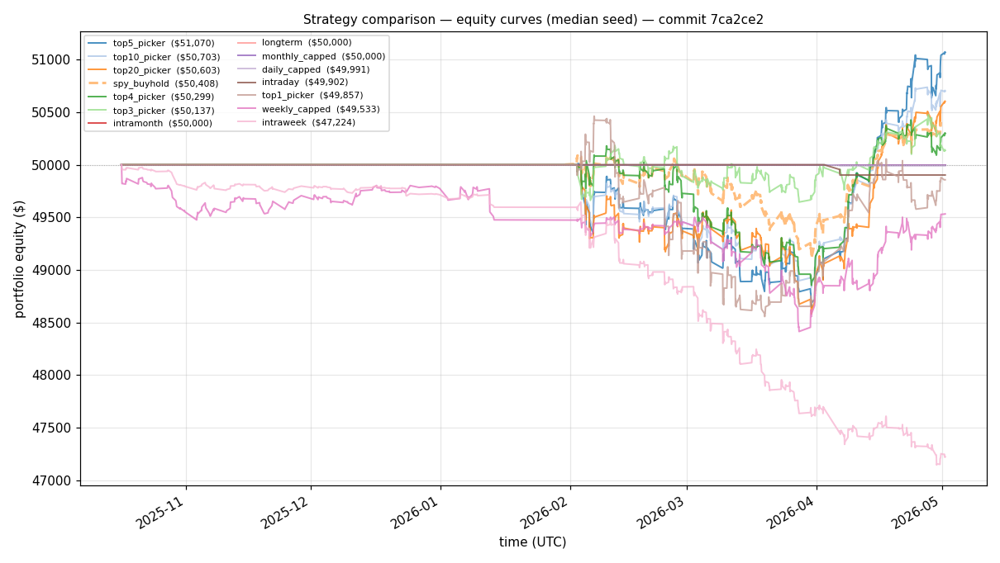
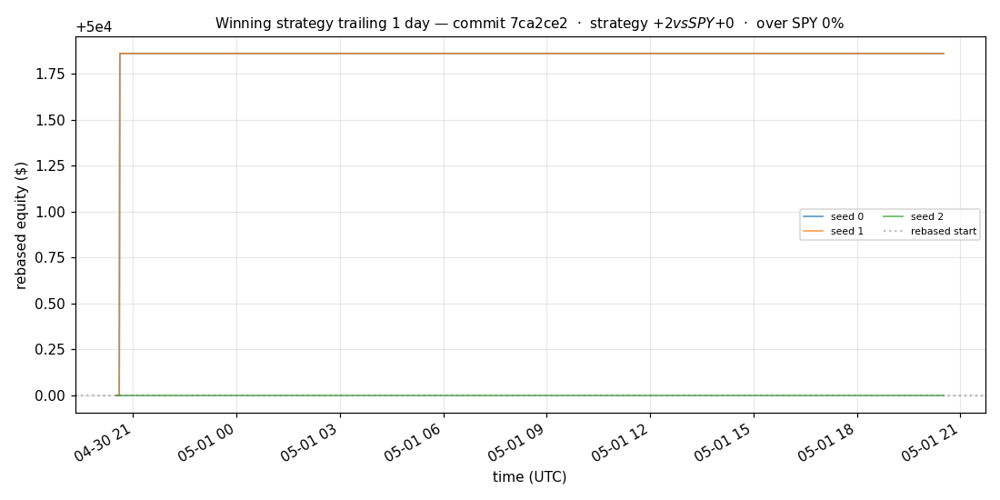
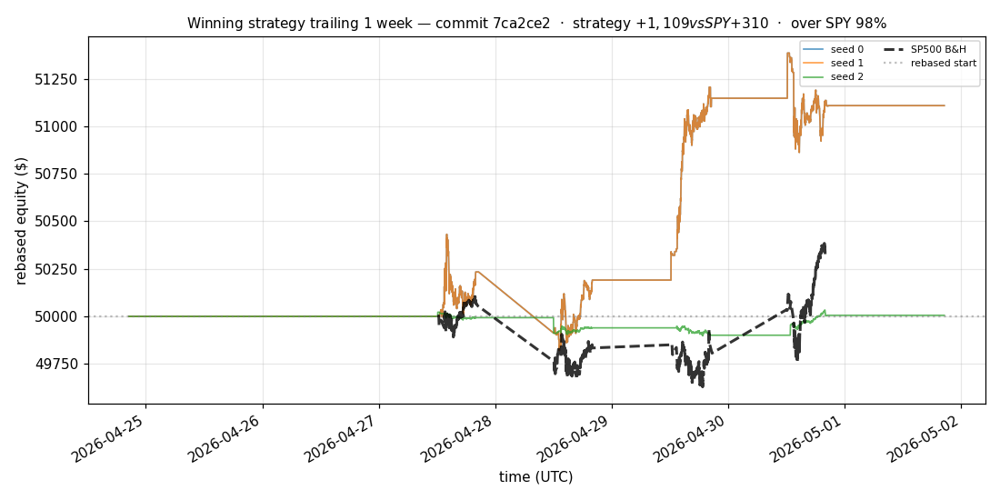
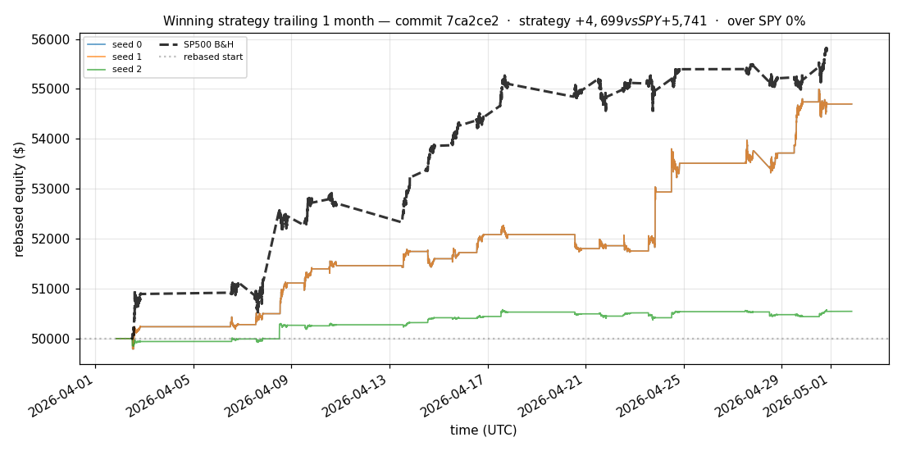
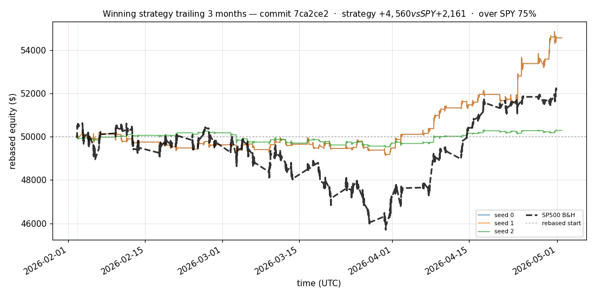
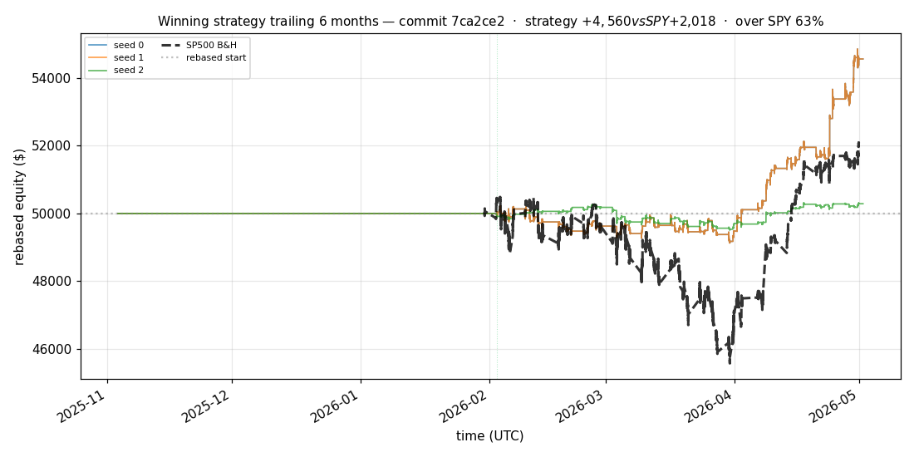

# iter 148 — 7ca2ce2

**🟢 KEEP** · exp148: top2 with 80pct reserve

_2026-05-05 00:49 UTC · 373s wall_

## Result

| metric | value |
|---|---|
| Sharpe (median) | **+3.211** |
| Sharpe CI low (5%) | +0.895 |
| Sharpe CI high (95%) | +5.682 |
| % time above SPY | 58.470% |
| Net PnL | **$+4560.20** (+9.120%) |
| Max drawdown | -2.18% |
| Trades | 1 |
| Fees | $1.00 |
| Seeds completed | 3 |

**Decision reason:** objective=+0.9535 > prior best +0.9326 (ci_low=+0.8950, over_spy=58.5%)

## Winning strategy

Canonical strategy for this iteration: **top4 cross-sectional picker** — rank symbols by the transformer's 4h + 1d forecast Sharpe, buy the top four once enough symbols are ready, hold through the eval window, and keep 1 median trades after costs.

A **seed** is one independent training/evaluation run with a different random initialization and sampling path. The gate uses median/worst-tail statistics across seeds so one lucky seed cannot define the best checkpoint.

Positive seed transaction tables are shown later in this report; losing or flat seed transaction tables are omitted to keep reports focused on actionable winners.

## Per-seed details

```
[evaluator] seed 0: sharpe=+3.211  dd=-2.18%  pnl=$+4,560.20  trades=1
[evaluator] seed 1: sharpe=+3.211  dd=-2.18%  pnl=$+4,560.20  trades=1
[evaluator] seed 2: sharpe=+0.597  dd=-1.49%  pnl=$+286.69  trades=1
```

## Equity curve (full eval window, ~73 days)



## Equity curve (first month)



## Strategy comparison (equity curves)

Overlays every profile (intraday/intraweek/intramonth/longterm + 
daily-capped/weekly-capped/monthly-capped trade-frequency variants 
+ topN pickers + SPY benchmark) on one chart, using the median-seed run.



## Recent live-style simulations vs SP500

Each chart rebases the winning strategy and SP500 to $50,000 at the start of the trailing window, ending at the latest available bar.

### Trailing 1 day



### Trailing 1 week



### Trailing 1 month



### Trailing 3 months



### Trailing 6 months



## Trader profile comparison

Same trained model, different time-horizon strategies + SPY benchmark + passive top-N pickers.

| profile | sharpe | PnL ($) | PnL % | trades | DD % | horizon |
|---|---:|---:|---:|---:|---:|---:|
| **daily_capped** | -2.008 | $-9.37 | -0.02% | 2 | -0.02% | 1d |
| **intraday** | -12.965 | $-7,417.74 | -14.84% | 5210 | -14.84% | 2h |
| **intramonth** | +0.000 | $+0.00 | +0.00% | 2 | -0.05% | 30d |
| **intraweek** | -4.765 | $-2,858.74 | -5.72% | 981 | -6.15% | 5d |
| **longterm** | +0.000 | $+0.00 | +0.00% | 2 | -0.05% | 30d |
| **monthly_capped** | +0.000 | $+0.00 | +0.00% | 0 | +0.00% | 30d |
| **spy_buyhold** | +0.980 | $+403.36 | +0.81% | 1 | -1.96% | - |
| **top10_picker** | +1.284 | $+1,501.75 | +3.00% | 9 | -3.03% | - |
| **top1_picker** | +0.000 | $+0.00 | +0.00% | 1 | -1.83% | - |
| **top20_picker** | +0.970 | $+771.32 | +1.54% | 19 | -2.89% | - |
| **top3_picker** | +2.288 | $+4,405.63 | +8.81% | 2 | -2.98% | - |
| **top4_picker** | +0.476 | $+282.48 | +0.56% | 3 | -2.70% | - |
| **top5_picker** | +1.515 | $+3,108.85 | +6.22% | 4 | -2.94% | - |
| **weekly_capped** | -0.785 | $-478.60 | -0.96% | 68 | -1.82% | 5d |

**Best active strategy: `top3_picker` (sharpe +2.288) — BEATS SPY ✓**

## Out-of-symbol holdout eval

Tested on **JPM, WMT, V, DIS, JNJ** — large-caps the model NEVER saw during training.

| seed | sharpe | PnL | trades | DD% |
|---:|---:|---:|---:|---:|
| 0 | +0.441 | $+170.02 | 5 | -1.91% |
| 1 | +0.318 | $+123.02 | 11 | -1.91% |
| 2 | +0.441 | $+170.02 | 5 | -1.91% |
| 3 | +0.327 | $+504.54 | 5 | -9.19% |
| 4 | +0.000 | $+0.00 | 0 | +0.00% |

**Median holdout sharpe: +0.327** (vs in-symbol +3.211)

## Transactions

_(no profitable per-seed transaction table; losing/flat seeds omitted)_

## Diff vs previous experiment

```diff
7ca2ce2 exp148: top2 with 80pct reserve


 experiment.py | 4 ++--
 1 file changed, 2 insertions(+), 2 deletions(-)
```

---

[← all iterations](.) · [back to README](../README.md)
