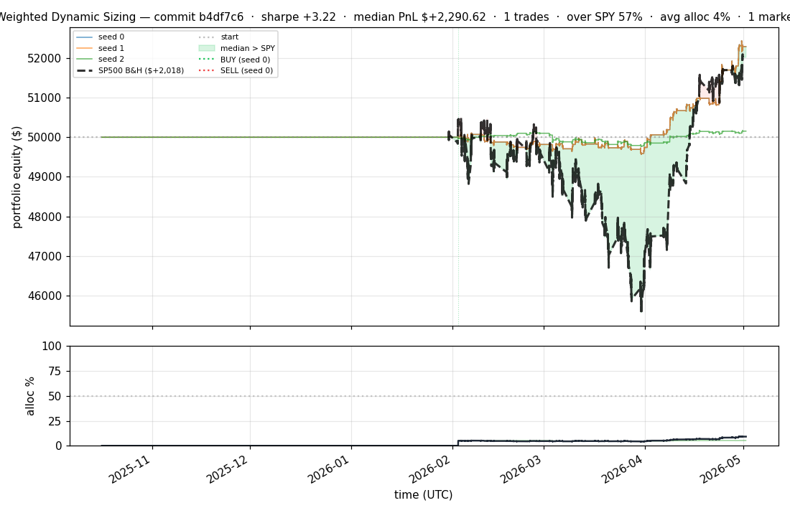
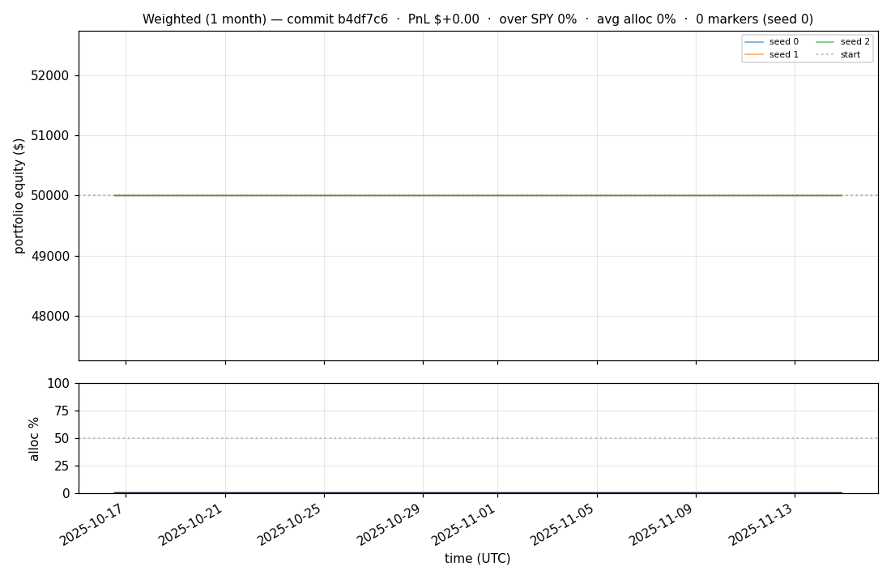
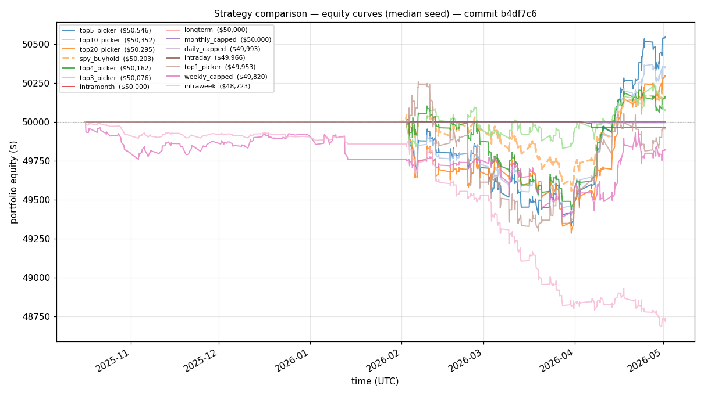
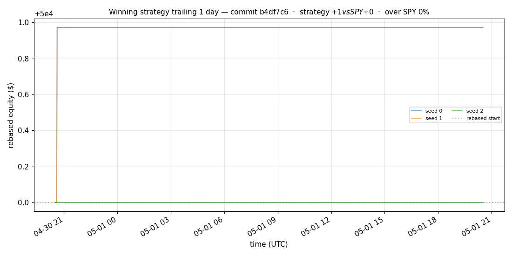
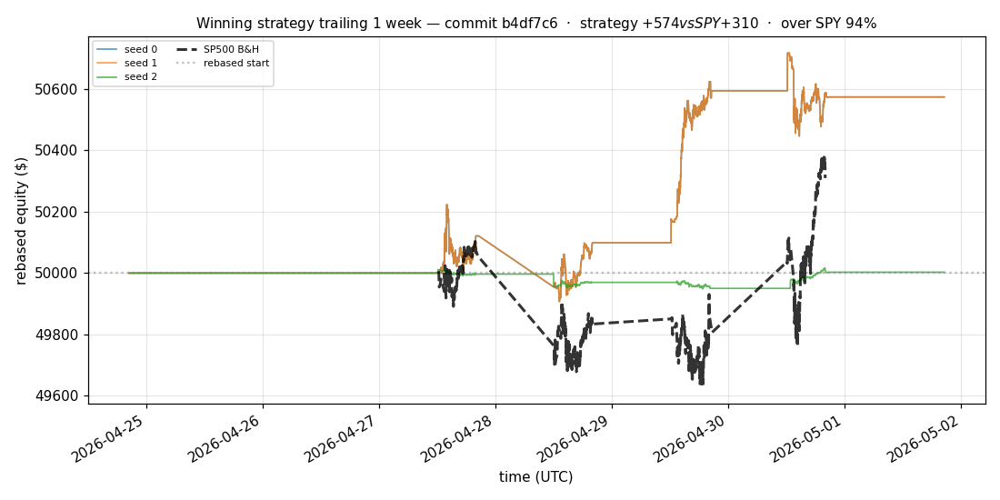
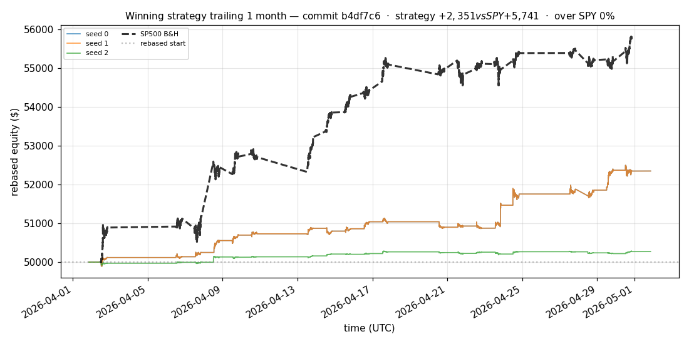
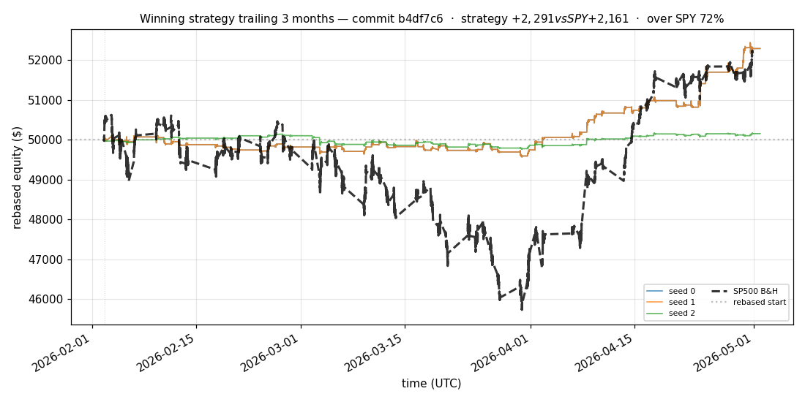
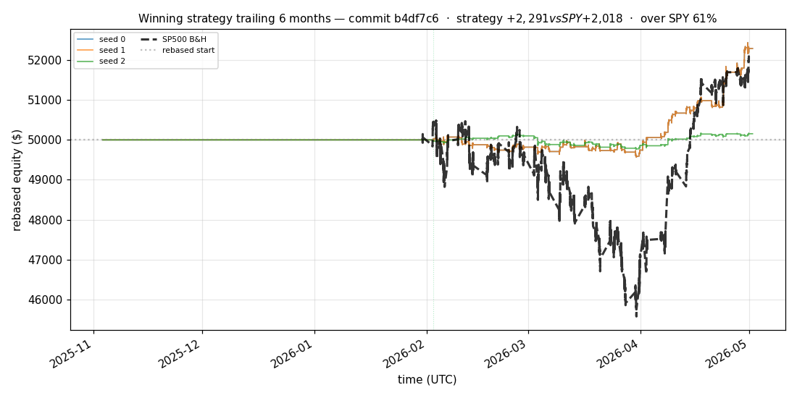

# iter 150 — b4df7c6

**🟢 KEEP** · exp150: top2 with 90pct reserve

_2026-05-05 01:03 UTC · 371s wall_

## Result

| metric | value |
|---|---|
| Sharpe (median) | **+3.223** |
| Sharpe CI low (5%) | +0.932 |
| Sharpe CI high (95%) | +5.689 |
| % time above SPY | 57.114% |
| Net PnL | **$+2290.62** (+4.581%) |
| Max drawdown | -1.10% |
| Trades | 1 |
| Fees | $1.00 |
| Seeds completed | 3 |

**Decision reason:** objective=+0.9891 > prior best +0.9725 (ci_low=+0.9320, over_spy=57.1%)

## Winning strategy

Canonical strategy for this iteration: **top4 cross-sectional picker** — rank symbols by the transformer's 4h + 1d forecast Sharpe, buy the top four once enough symbols are ready, hold through the eval window, and keep 1 median trades after costs.

A **seed** is one independent training/evaluation run with a different random initialization and sampling path. The gate uses median/worst-tail statistics across seeds so one lucky seed cannot define the best checkpoint.

Positive seed transaction tables are shown later in this report; losing or flat seed transaction tables are omitted to keep reports focused on actionable winners.

## Per-seed details

```
[evaluator] seed 0: sharpe=+3.223  dd=-1.10%  pnl=$+2,290.62  trades=1
[evaluator] seed 1: sharpe=+3.223  dd=-1.10%  pnl=$+2,290.62  trades=1
[evaluator] seed 2: sharpe=+0.638  dd=-0.75%  pnl=$+154.50  trades=1
```

## Equity curve (full eval window, ~73 days)



## Equity curve (first month)



## Strategy comparison (equity curves)

Overlays every profile (intraday/intraweek/intramonth/longterm + 
daily-capped/weekly-capped/monthly-capped trade-frequency variants 
+ topN pickers + SPY benchmark) on one chart, using the median-seed run.



## Recent live-style simulations vs SP500

Each chart rebases the winning strategy and SP500 to $50,000 at the start of the trailing window, ending at the latest available bar.

### Trailing 1 day



### Trailing 1 week



### Trailing 1 month



### Trailing 3 months



### Trailing 6 months



## Trader profile comparison

Same trained model, different time-horizon strategies + SPY benchmark + passive top-N pickers.

| profile | sharpe | PnL ($) | PnL % | trades | DD % | horizon |
|---|---:|---:|---:|---:|---:|---:|
| **daily_capped** | -2.101 | $-6.60 | -0.01% | 2 | -0.01% | 1d |
| **intraday** | -12.965 | $-3,631.99 | -7.26% | 2543 | -7.27% | 2h |
| **intramonth** | +0.000 | $+0.00 | +0.00% | 2 | -0.02% | 30d |
| **intraweek** | -4.808 | $-1,363.98 | -2.73% | 741 | -2.79% | 5d |
| **longterm** | +0.000 | $+0.00 | +0.00% | 2 | -0.02% | 30d |
| **monthly_capped** | +0.000 | $+0.00 | +0.00% | 0 | +0.00% | 30d |
| **spy_buyhold** | +0.977 | $+201.64 | +0.40% | 1 | -0.98% | - |
| **top10_picker** | +1.286 | $+755.06 | +1.51% | 9 | -1.52% | - |
| **top1_picker** | +0.000 | $+0.00 | +0.00% | 1 | -0.93% | - |
| **top20_picker** | +0.949 | $+378.62 | +0.76% | 19 | -1.45% | - |
| **top3_picker** | +2.288 | $+2,216.59 | +4.43% | 2 | -1.50% | - |
| **top4_picker** | +0.510 | $+153.73 | +0.31% | 3 | -1.36% | - |
| **top5_picker** | +1.546 | $+1,569.59 | +3.14% | 4 | -1.48% | - |
| **weekly_capped** | -0.651 | $-184.31 | -0.37% | 50 | -1.16% | 5d |

**Best active strategy: `top3_picker` (sharpe +2.288) — BEATS SPY ✓**

## Out-of-symbol holdout eval

Tested on **JPM, WMT, V, DIS, JNJ** — large-caps the model NEVER saw during training.

| seed | sharpe | PnL | trades | DD% |
|---:|---:|---:|---:|---:|
| 0 | +0.548 | $+108.48 | 5 | -0.95% |
| 1 | +0.580 | $+116.24 | 9 | -0.97% |
| 2 | +0.548 | $+108.48 | 5 | -0.95% |
| 3 | +0.327 | $+504.54 | 5 | -9.19% |
| 4 | +0.000 | $+0.00 | 0 | +0.00% |

**Median holdout sharpe: +0.548** (vs in-symbol +3.223)

## Transactions

_(no profitable per-seed transaction table; losing/flat seeds omitted)_

## Diff vs previous experiment

```diff
b4df7c6 exp150: top2 with 90pct reserve


 experiment.py | 4 ++--
 1 file changed, 2 insertions(+), 2 deletions(-)
```

---

[← all iterations](.) · [back to README](../README.md)
