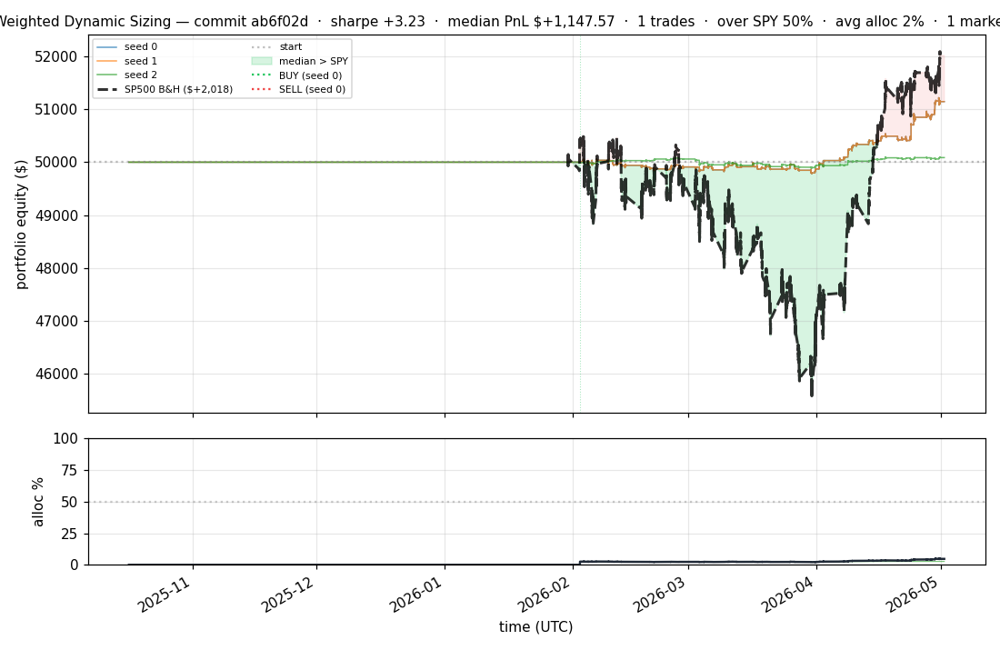
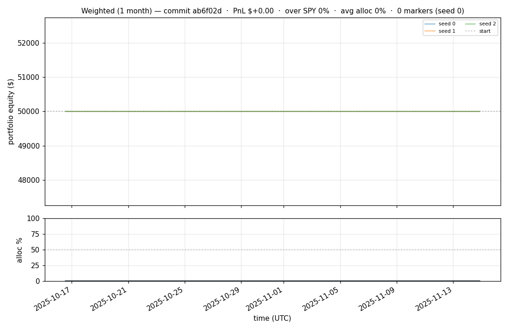
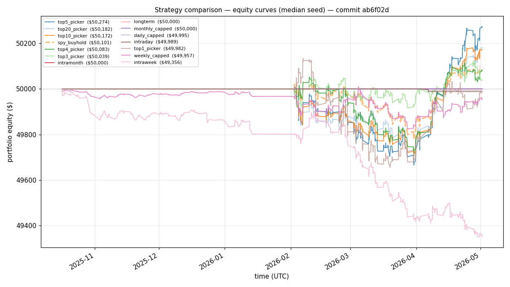
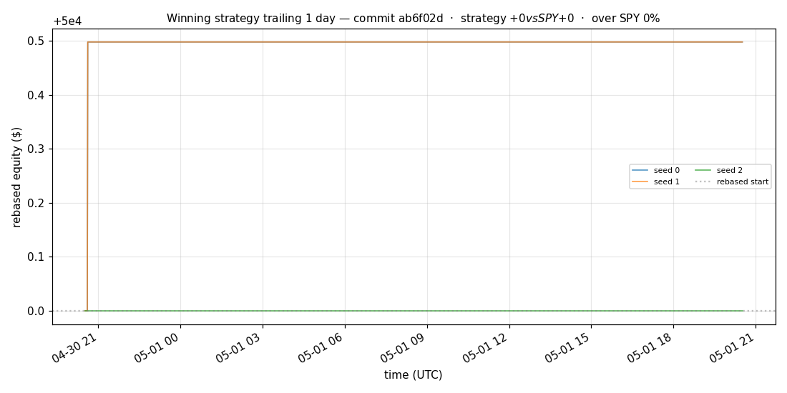
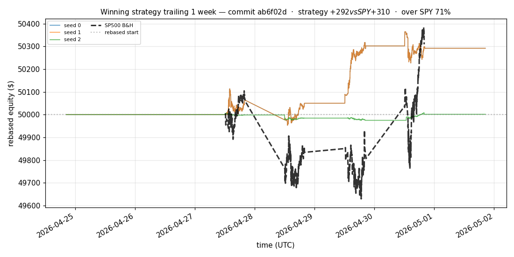
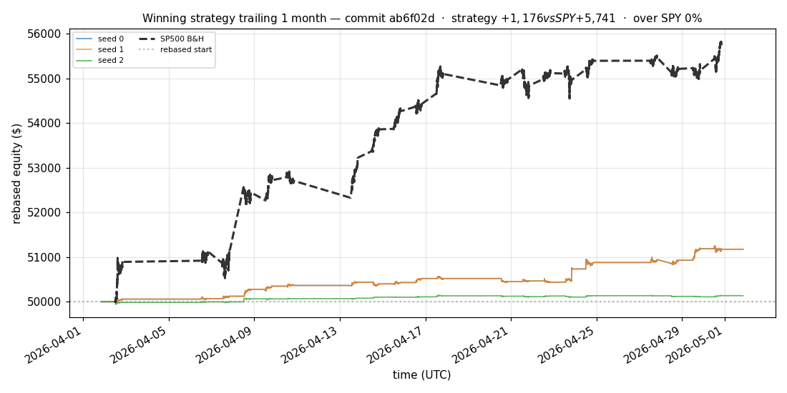
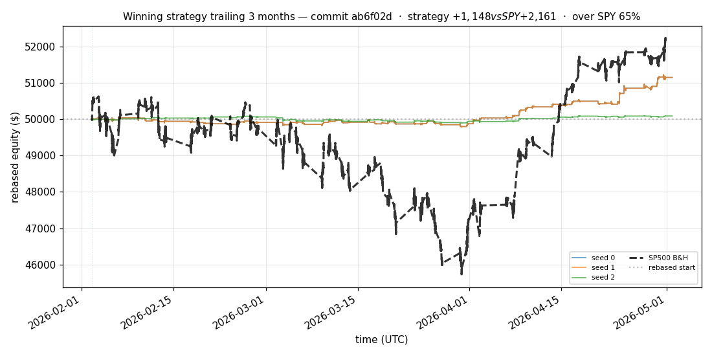
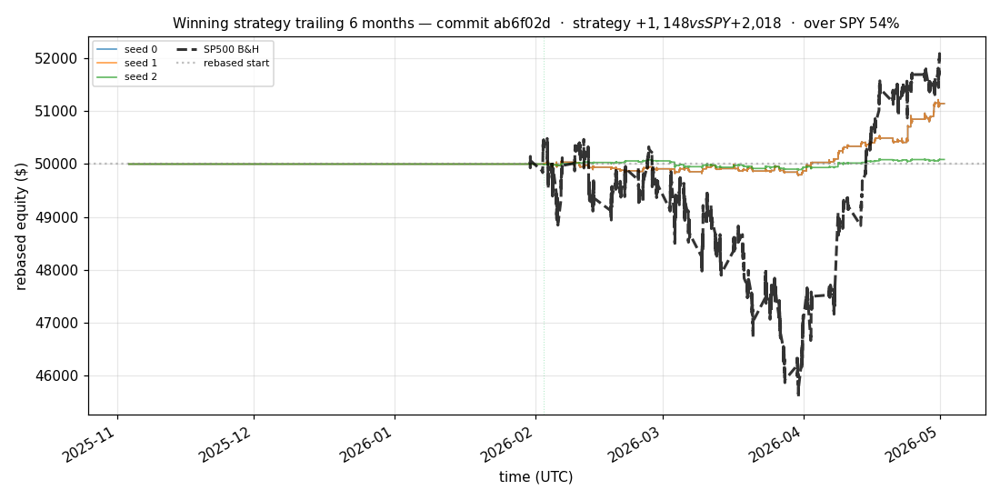

# iter 151 — ab6f02d

**🟢 KEEP** · exp151: top2 with 95pct reserve

_2026-05-05 01:09 UTC · 371s wall_

## Result

| metric | value |
|---|---|
| Sharpe (median) | **+3.227** |
| Sharpe CI low (5%) | +0.951 |
| Sharpe CI high (95%) | +5.690 |
| % time above SPY | 50.280% |
| Net PnL | **$+1147.57** (+2.295%) |
| Max drawdown | -0.55% |
| Trades | 1 |
| Fees | $1.00 |
| Seeds completed | 3 |

**Decision reason:** objective=+1.0013 > prior best +0.9889 (ci_low=+0.9510, over_spy=50.3%)

## Winning strategy

Canonical strategy for this iteration: **top4 cross-sectional picker** — rank symbols by the transformer's 4h + 1d forecast Sharpe, buy the top four once enough symbols are ready, hold through the eval window, and keep 1 median trades after costs.

A **seed** is one independent training/evaluation run with a different random initialization and sampling path. The gate uses median/worst-tail statistics across seeds so one lucky seed cannot define the best checkpoint.

Positive seed transaction tables are shown later in this report; losing or flat seed transaction tables are omitted to keep reports focused on actionable winners.

## Per-seed details

```
[evaluator] seed 0: sharpe=+3.227  dd=-0.55%  pnl=$+1,147.57  trades=1
[evaluator] seed 1: sharpe=+3.227  dd=-0.55%  pnl=$+1,147.57  trades=1
[evaluator] seed 2: sharpe=+0.713  dd=-0.38%  pnl=$+86.97  trades=1
```

## Equity curve (full eval window, ~73 days)



## Equity curve (first month)



## Strategy comparison (equity curves)

Overlays every profile (intraday/intraweek/intramonth/longterm + 
daily-capped/weekly-capped/monthly-capped trade-frequency variants 
+ topN pickers + SPY benchmark) on one chart, using the median-seed run.



## Recent live-style simulations vs SP500

Each chart rebases the winning strategy and SP500 to $50,000 at the start of the trailing window, ending at the latest available bar.

### Trailing 1 day



### Trailing 1 week



### Trailing 1 month



### Trailing 3 months



### Trailing 6 months



## Trader profile comparison

Same trained model, different time-horizon strategies + SPY benchmark + passive top-N pickers.

| profile | sharpe | PnL ($) | PnL % | trades | DD % | horizon |
|---|---:|---:|---:|---:|---:|---:|
| **daily_capped** | -2.023 | $-4.88 | -0.01% | 2 | -0.01% | 1d |
| **intraday** | -12.965 | $-1,633.50 | -3.27% | 1267 | -3.27% | 2h |
| **intramonth** | +0.000 | $+0.00 | +0.00% | 2 | -0.01% | 30d |
| **intraweek** | -4.723 | $-695.91 | -1.39% | 388 | -1.42% | 5d |
| **longterm** | +0.000 | $+0.00 | +0.00% | 2 | -0.01% | 30d |
| **monthly_capped** | +0.000 | $+0.00 | +0.00% | 0 | +0.00% | 30d |
| **spy_buyhold** | +0.975 | $+100.78 | +0.20% | 1 | -0.49% | - |
| **top10_picker** | +1.261 | $+375.21 | +0.75% | 9 | -0.76% | - |
| **top1_picker** | +0.000 | $+0.00 | +0.00% | 1 | -0.47% | - |
| **top20_picker** | +1.150 | $+182.75 | +0.37% | 19 | -0.67% | - |
| **top3_picker** | +2.288 | $+1,111.01 | +2.22% | 2 | -0.75% | - |
| **top4_picker** | +0.520 | $+78.88 | +0.16% | 3 | -0.68% | - |
| **top5_picker** | +1.553 | $+788.68 | +1.58% | 4 | -0.74% | - |
| **weekly_capped** | -0.457 | $-45.65 | -0.09% | 35 | -0.56% | 5d |

**Best active strategy: `top3_picker` (sharpe +2.288) — BEATS SPY ✓**

## Out-of-symbol holdout eval

Tested on **JPM, WMT, V, DIS, JNJ** — large-caps the model NEVER saw during training.

| seed | sharpe | PnL | trades | DD% |
|---:|---:|---:|---:|---:|
| 0 | +0.508 | $+48.04 | 13 | -0.44% |
| 1 | +0.478 | $+45.75 | 23 | -0.44% |
| 2 | +0.560 | $+55.18 | 7 | -0.46% |
| 3 | +0.327 | $+504.54 | 5 | -9.19% |
| 4 | +0.000 | $+0.00 | 0 | +0.00% |

**Median holdout sharpe: +0.478** (vs in-symbol +3.227)

## Transactions

_(no profitable per-seed transaction table; losing/flat seeds omitted)_

## Diff vs previous experiment

```diff
ab6f02d exp151: top2 with 95pct reserve


 experiment.py | 4 ++--
 1 file changed, 2 insertions(+), 2 deletions(-)
```

---

[← all iterations](.) · [back to README](../README.md)
