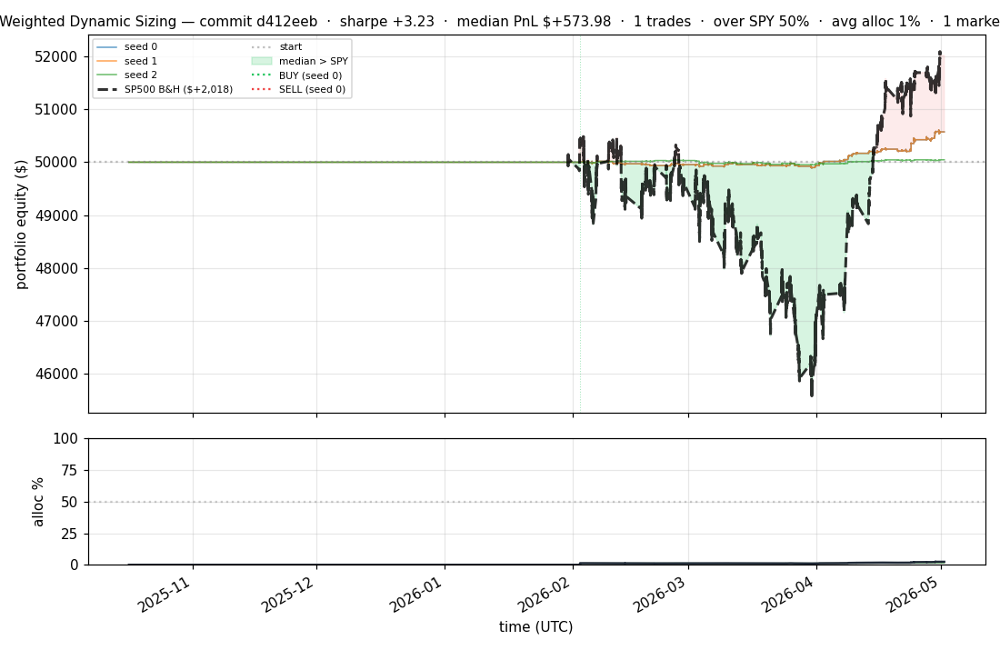
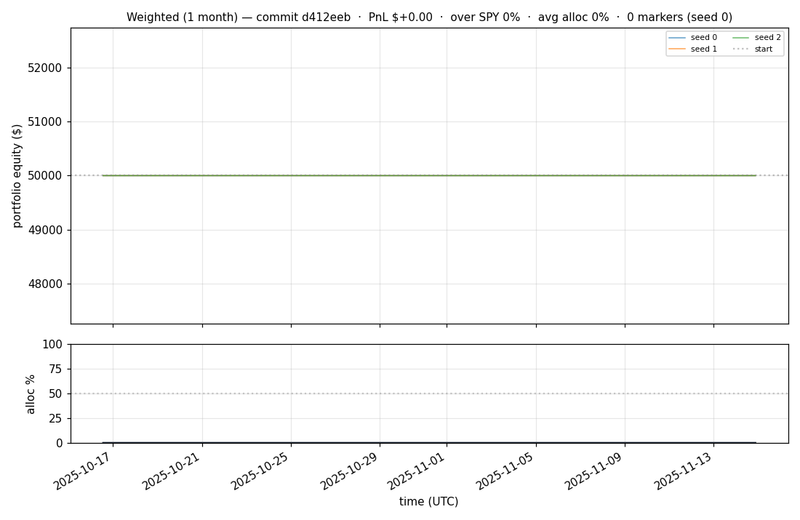
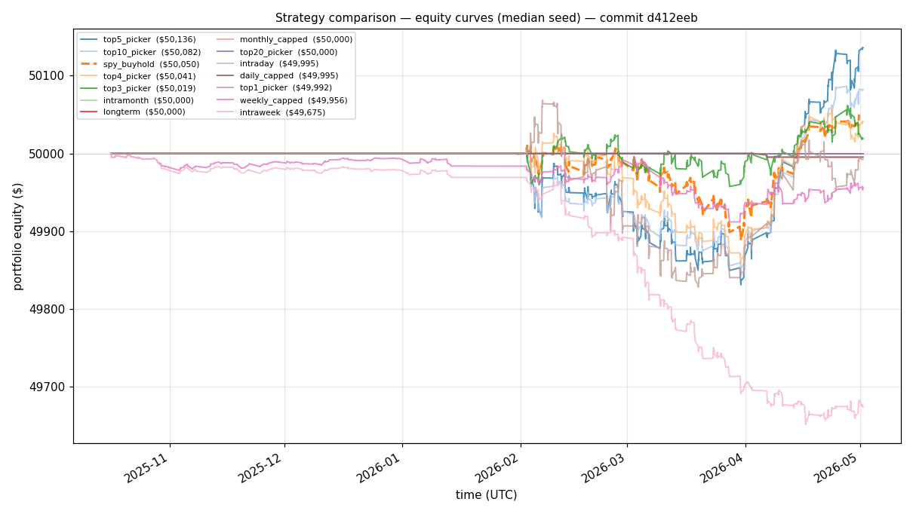
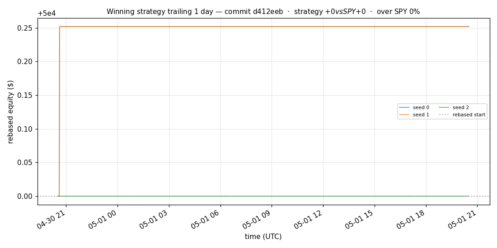
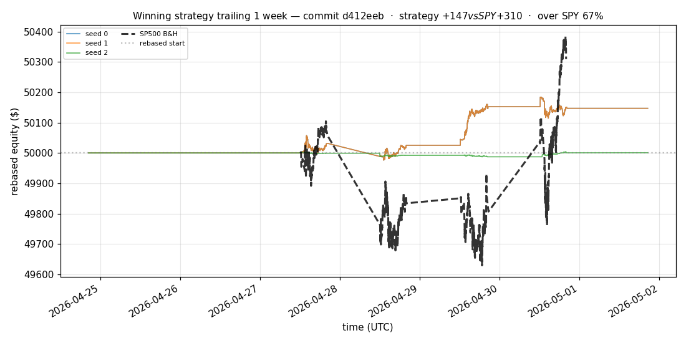
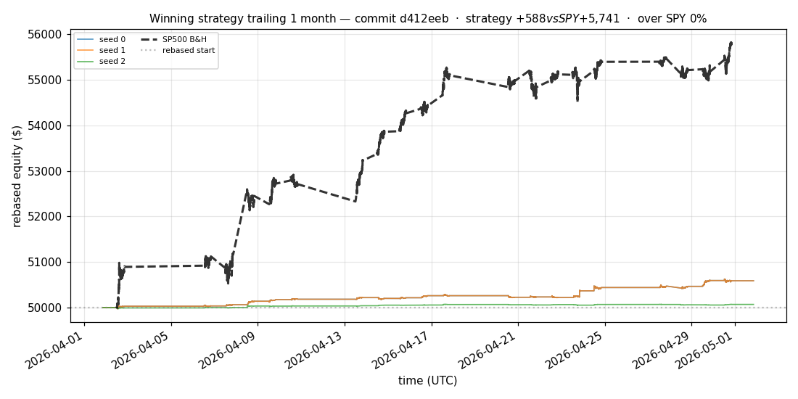
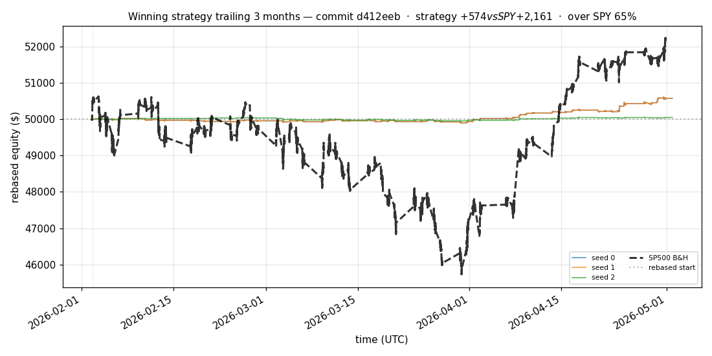
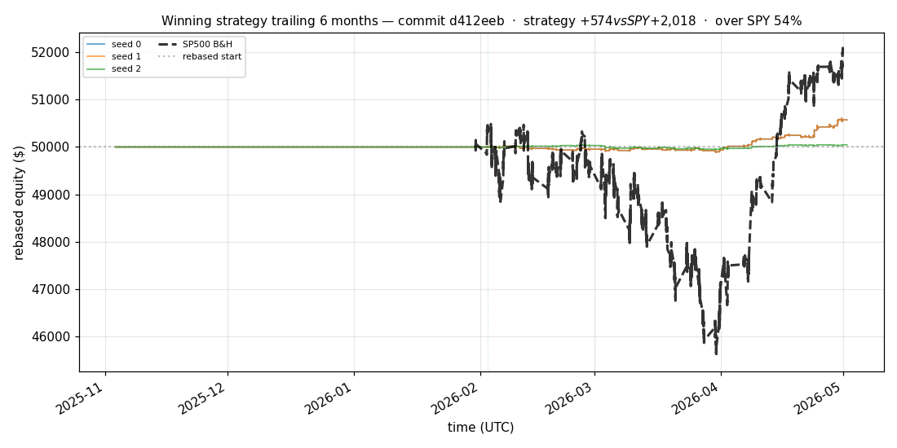

# iter 152 — d412eeb

**🟢 KEEP** · exp152: top2 with 97.5pct reserve

_2026-05-05 01:16 UTC · 372s wall_

## Result

| metric | value |
|---|---|
| Sharpe (median) | **+3.227** |
| Sharpe CI low (5%) | +0.960 |
| Sharpe CI high (95%) | +5.689 |
| % time above SPY | 49.943% |
| Net PnL | **$+573.98** (+1.148%) |
| Max drawdown | -0.27% |
| Trades | 1 |
| Fees | $1.00 |
| Seeds completed | 3 |

**Decision reason:** objective=+1.0099 > prior best +1.0011 (ci_low=+0.9600, over_spy=49.9%)

## Winning strategy

Canonical strategy for this iteration: **top4 cross-sectional picker** — rank symbols by the transformer's 4h + 1d forecast Sharpe, buy the top four once enough symbols are ready, hold through the eval window, and keep 1 median trades after costs.

A **seed** is one independent training/evaluation run with a different random initialization and sampling path. The gate uses median/worst-tail statistics across seeds so one lucky seed cannot define the best checkpoint.

Positive seed transaction tables are shown later in this report; losing or flat seed transaction tables are omitted to keep reports focused on actionable winners.

## Per-seed details

```
[evaluator] seed 0: sharpe=+3.227  dd=-0.27%  pnl=$+573.98  trades=1
[evaluator] seed 1: sharpe=+3.227  dd=-0.27%  pnl=$+573.98  trades=1
[evaluator] seed 2: sharpe=+0.744  dd=-0.19%  pnl=$+45.57  trades=1
```

## Equity curve (full eval window, ~73 days)



## Equity curve (first month)



## Strategy comparison (equity curves)

Overlays every profile (intraday/intraweek/intramonth/longterm + 
daily-capped/weekly-capped/monthly-capped trade-frequency variants 
+ topN pickers + SPY benchmark) on one chart, using the median-seed run.



## Recent live-style simulations vs SP500

Each chart rebases the winning strategy and SP500 to $50,000 at the start of the trailing window, ending at the latest available bar.

### Trailing 1 day



### Trailing 1 week



### Trailing 1 month



### Trailing 3 months



### Trailing 6 months



## Trader profile comparison

Same trained model, different time-horizon strategies + SPY benchmark + passive top-N pickers.

| profile | sharpe | PnL ($) | PnL % | trades | DD % | horizon |
|---|---:|---:|---:|---:|---:|---:|
| **daily_capped** | -1.887 | $-4.79 | -0.01% | 2 | -0.01% | 1d |
| **intraday** | -11.476 | $-565.50 | -1.13% | 446 | -1.13% | 2h |
| **intramonth** | +0.000 | $+0.00 | +0.00% | 2 | -0.01% | 30d |
| **intraweek** | -4.723 | $-332.18 | -0.66% | 196 | -0.70% | 5d |
| **longterm** | +0.000 | $+0.00 | +0.00% | 2 | -0.01% | 30d |
| **monthly_capped** | +0.000 | $+0.00 | +0.00% | 0 | +0.00% | 30d |
| **spy_buyhold** | +0.974 | $+50.35 | +0.10% | 1 | -0.25% | - |
| **top10_picker** | +1.244 | $+249.71 | +0.50% | 9 | -0.31% | - |
| **top1_picker** | +0.000 | $+0.00 | +0.00% | 1 | -0.24% | - |
| **top20_picker** | +0.000 | $+0.00 | +0.00% | 0 | +0.00% | - |
| **top3_picker** | +2.288 | $+555.43 | +1.11% | 2 | -0.38% | - |
| **top4_picker** | +0.511 | $+38.82 | +0.08% | 3 | -0.34% | - |
| **top5_picker** | +1.539 | $+393.82 | +0.79% | 4 | -0.37% | - |
| **weekly_capped** | -1.024 | $-45.27 | -0.09% | 23 | -0.22% | 5d |

**Best active strategy: `top3_picker` (sharpe +2.288) — BEATS SPY ✓**

## Out-of-symbol holdout eval

Tested on **JPM, WMT, V, DIS, JNJ** — large-caps the model NEVER saw during training.

| seed | sharpe | PnL | trades | DD% |
|---:|---:|---:|---:|---:|
| 0 | -0.641 | $-24.41 | 39 | -0.18% |
| 1 | -0.636 | $-24.03 | 39 | -0.18% |
| 2 | +0.217 | $+8.48 | 11 | -0.19% |
| 3 | +0.327 | $+504.54 | 5 | -9.19% |
| 4 | +0.000 | $+0.00 | 0 | +0.00% |

**Median holdout sharpe: +0.000** (vs in-symbol +3.227)

## Transactions

_(no profitable per-seed transaction table; losing/flat seeds omitted)_

## Diff vs previous experiment

```diff
d412eeb exp152: top2 with 97.5pct reserve


 experiment.py | 4 ++--
 1 file changed, 2 insertions(+), 2 deletions(-)
```

---

[← all iterations](.) · [back to README](../README.md)
