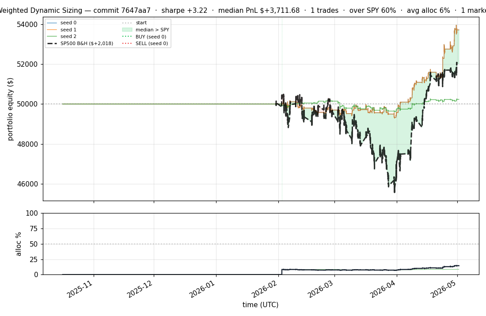
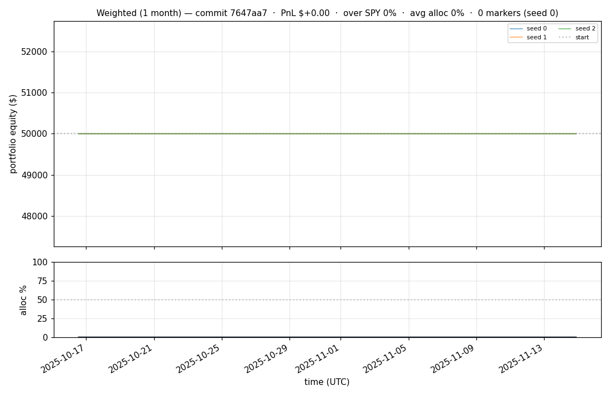
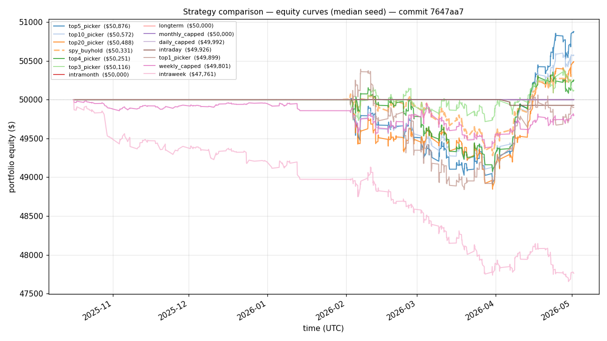
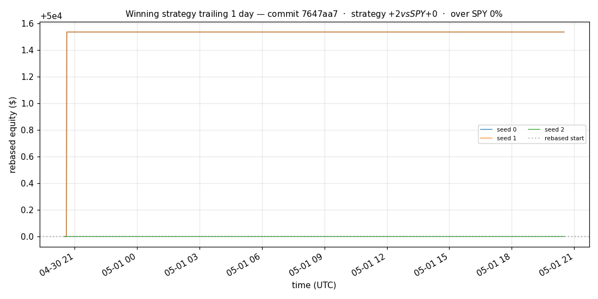
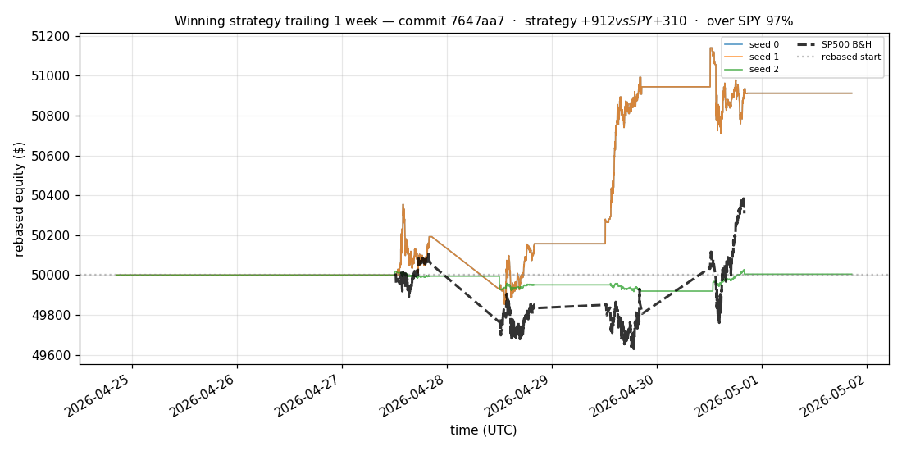
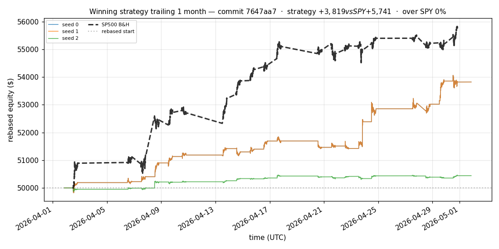
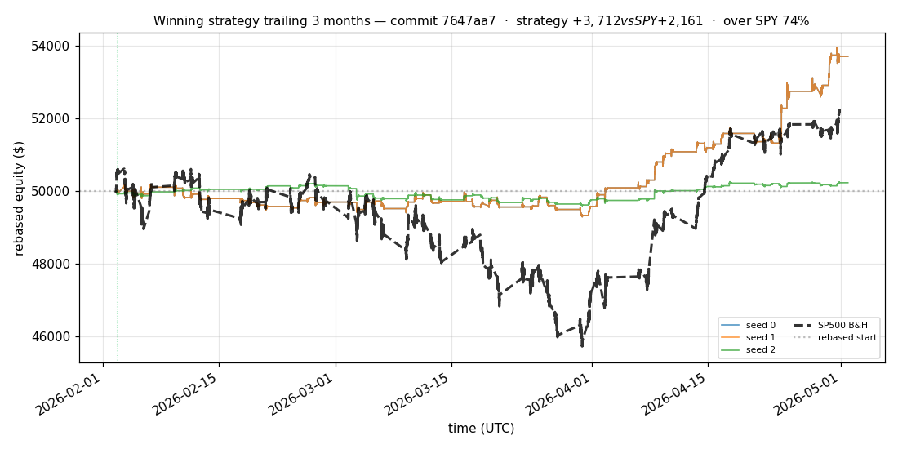
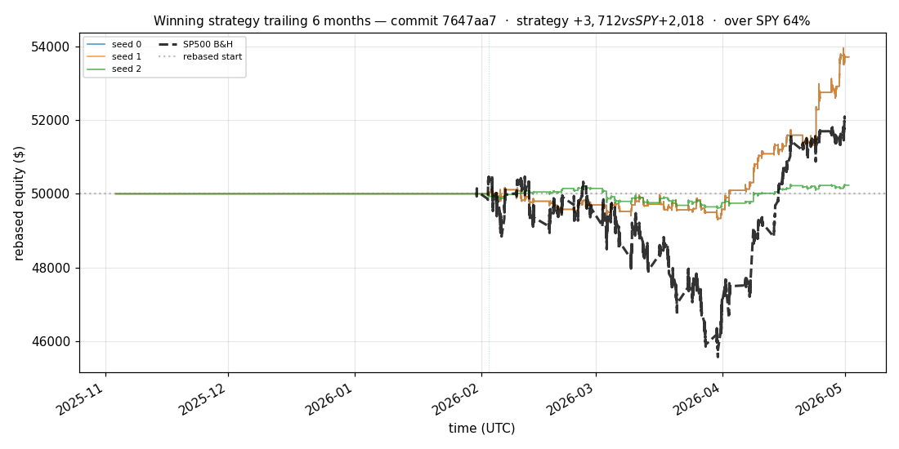

# iter 155 — 7647aa7

**🔴 DISCARD** · exp155: top2 with 83.75pct reserve

_2026-05-05 01:37 UTC · 372s wall_

## Result

| metric | value |
|---|---|
| Sharpe (median) | **+3.216** |
| Sharpe CI low (5%) | +0.909 |
| Sharpe CI high (95%) | +5.685 |
| % time above SPY | 59.960% |
| Net PnL | **$+3711.68** (+7.423%) |
| Max drawdown | -1.78% |
| Trades | 1 |
| Fees | $1.00 |
| Seeds completed | 3 |

**Decision reason:** objective=+1.1631 ≤ prior best +1.1643 (ci_low=+0.9090, over_spy=60.0%, pnl=+7.42%)

## Winning strategy

Canonical strategy for this iteration: **top4 cross-sectional picker** — rank symbols by the transformer's 4h + 1d forecast Sharpe, buy the top four once enough symbols are ready, hold through the eval window, and keep 1 median trades after costs.

A **seed** is one independent training/evaluation run with a different random initialization and sampling path. The gate uses median/worst-tail statistics across seeds so one lucky seed cannot define the best checkpoint.

Positive seed transaction tables are shown later in this report; losing or flat seed transaction tables are omitted to keep reports focused on actionable winners.

## Per-seed details

```
[evaluator] seed 0: sharpe=+3.216  dd=-1.78%  pnl=$+3,711.68  trades=1
[evaluator] seed 1: sharpe=+3.216  dd=-1.78%  pnl=$+3,711.68  trades=1
[evaluator] seed 2: sharpe=+0.595  dd=-1.21%  pnl=$+232.75  trades=1
```

## Equity curve (full eval window, ~73 days)



## Equity curve (first month)



## Strategy comparison (equity curves)

Overlays every profile (intraday/intraweek/intramonth/longterm + 
daily-capped/weekly-capped/monthly-capped trade-frequency variants 
+ topN pickers + SPY benchmark) on one chart, using the median-seed run.



## Recent live-style simulations vs SP500

Each chart rebases the winning strategy and SP500 to $50,000 at the start of the trailing window, ending at the latest available bar.

### Trailing 1 day



### Trailing 1 week



### Trailing 1 month



### Trailing 3 months



### Trailing 6 months



## Trader profile comparison

Same trained model, different time-horizon strategies + SPY benchmark + passive top-N pickers.

| profile | sharpe | PnL ($) | PnL % | trades | DD % | horizon |
|---|---:|---:|---:|---:|---:|---:|
| **daily_capped** | -2.102 | $-7.73 | -0.02% | 2 | -0.02% | 1d |
| **intraday** | -12.965 | $-6,017.46 | -12.03% | 4367 | -12.04% | 2h |
| **intramonth** | +0.000 | $+0.00 | +0.00% | 2 | -0.04% | 30d |
| **intraweek** | -5.256 | $-2,432.22 | -4.86% | 954 | -4.97% | 5d |
| **longterm** | +0.000 | $+0.00 | +0.00% | 2 | -0.04% | 30d |
| **monthly_capped** | +0.000 | $+0.00 | +0.00% | 0 | +0.00% | 30d |
| **spy_buyhold** | +0.979 | $+327.72 | +0.66% | 1 | -1.59% | - |
| **top10_picker** | +1.287 | $+1,223.76 | +2.45% | 9 | -2.47% | - |
| **top1_picker** | +0.000 | $+0.00 | +0.00% | 1 | -1.49% | - |
| **top20_picker** | +0.967 | $+624.63 | +1.25% | 19 | -2.35% | - |
| **top3_picker** | +2.288 | $+3,588.18 | +7.18% | 2 | -2.43% | - |
| **top4_picker** | +0.490 | $+237.45 | +0.47% | 3 | -2.20% | - |
| **top5_picker** | +1.528 | $+2,531.67 | +5.06% | 4 | -2.39% | - |
| **weekly_capped** | -0.605 | $-210.79 | -0.42% | 67 | -2.04% | 5d |

**Best active strategy: `top3_picker` (sharpe +2.288) — BEATS SPY ✓**

## Out-of-symbol holdout eval

Tested on **JPM, WMT, V, DIS, JNJ** — large-caps the model NEVER saw during training.

| seed | sharpe | PnL | trades | DD% |
|---:|---:|---:|---:|---:|
| 0 | +0.529 | $+168.81 | 5 | -1.54% |
| 1 | +0.552 | $+178.15 | 9 | -1.57% |
| 2 | +0.529 | $+168.81 | 5 | -1.54% |
| 3 | +0.327 | $+504.54 | 5 | -9.19% |
| 4 | +0.000 | $+0.00 | 0 | +0.00% |

**Median holdout sharpe: +0.529** (vs in-symbol +3.216)

## Transactions

_(no profitable per-seed transaction table; losing/flat seeds omitted)_

## Diff vs previous experiment

```diff
7647aa7 exp155: top2 with 83.75pct reserve


 experiment.py | 4 ++--
 1 file changed, 2 insertions(+), 2 deletions(-)
```

---

[← all iterations](.) · [back to README](../README.md)
