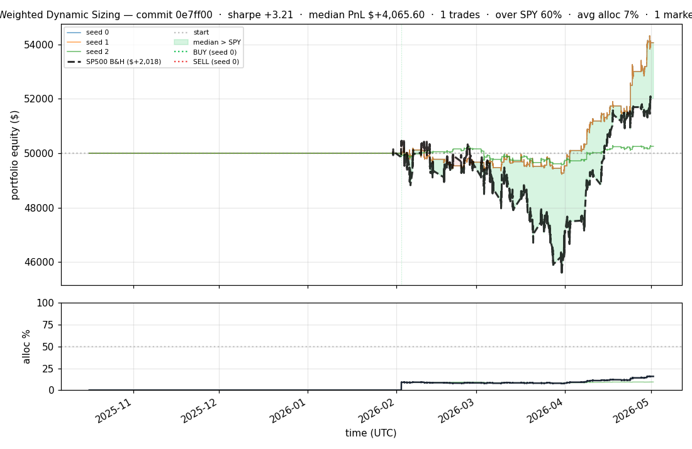
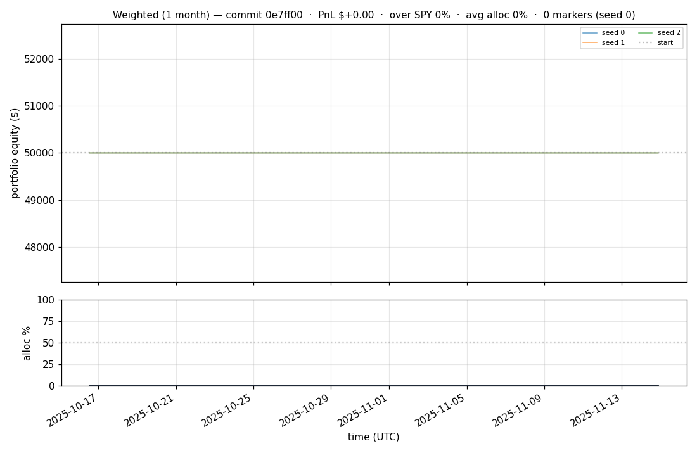
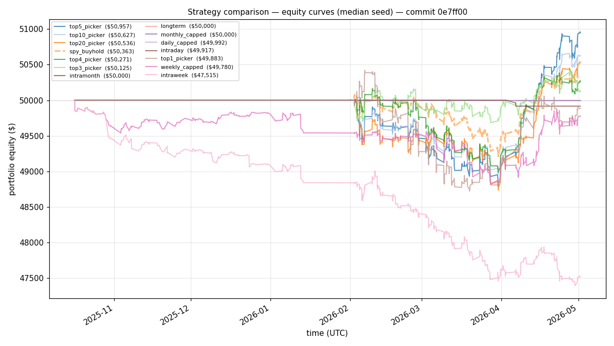
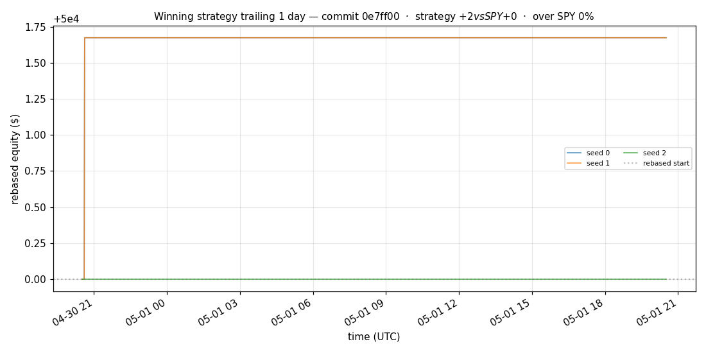
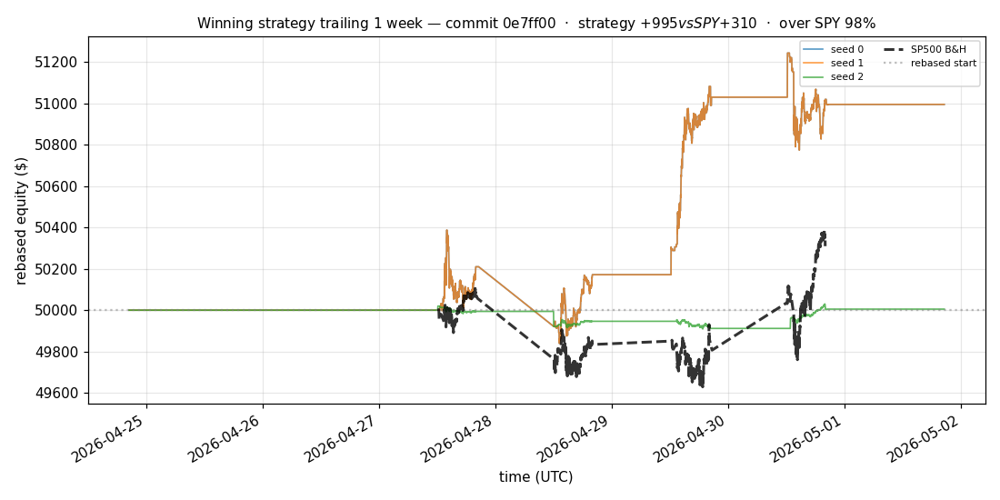
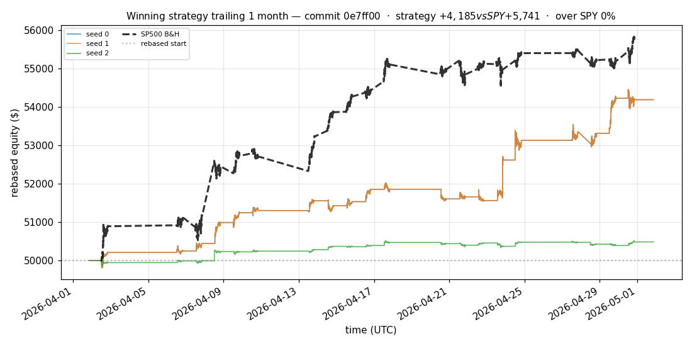
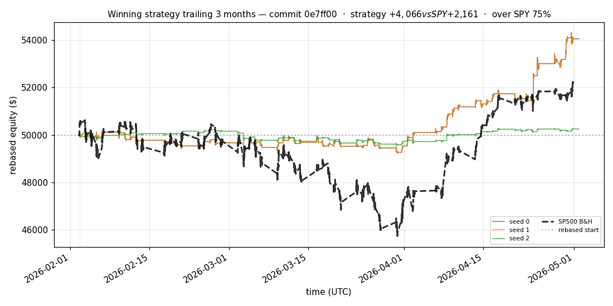
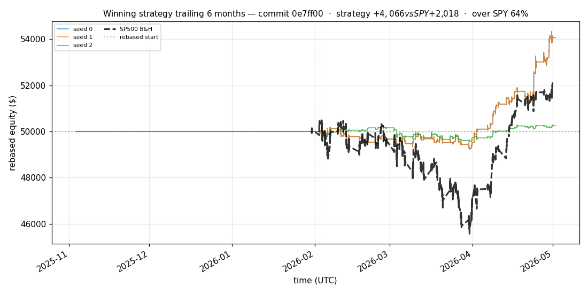

# iter 156 — 0e7ff00

**🟢 KEEP** · exp156: top2 with 82.1875pct reserve

_2026-05-05 01:44 UTC · 372s wall_

## Result

| metric | value |
|---|---|
| Sharpe (median) | **+3.214** |
| Sharpe CI low (5%) | +0.903 |
| Sharpe CI high (95%) | +5.684 |
| % time above SPY | 60.068% |
| Net PnL | **$+4065.60** (+8.131%) |
| Max drawdown | -1.95% |
| Trades | 1 |
| Fees | $1.00 |
| Seeds completed | 3 |

**Decision reason:** objective=+1.1645 > prior best +1.1643 (ci_low=+0.9030, over_spy=60.1%, pnl=+8.13%)

## Winning strategy

Canonical strategy for this iteration: **top4 cross-sectional picker** — rank symbols by the transformer's 4h + 1d forecast Sharpe, buy the top four once enough symbols are ready, hold through the eval window, and keep 1 median trades after costs.

A **seed** is one independent training/evaluation run with a different random initialization and sampling path. The gate uses median/worst-tail statistics across seeds so one lucky seed cannot define the best checkpoint.

Positive seed transaction tables are shown later in this report; losing or flat seed transaction tables are omitted to keep reports focused on actionable winners.

## Per-seed details

```
[evaluator] seed 0: sharpe=+3.214  dd=-1.95%  pnl=$+4,065.60  trades=1
[evaluator] seed 1: sharpe=+3.214  dd=-1.95%  pnl=$+4,065.60  trades=1
[evaluator] seed 2: sharpe=+0.596  dd=-1.33%  pnl=$+255.23  trades=1
```

## Equity curve (full eval window, ~73 days)



## Equity curve (first month)



## Strategy comparison (equity curves)

Overlays every profile (intraday/intraweek/intramonth/longterm + 
daily-capped/weekly-capped/monthly-capped trade-frequency variants 
+ topN pickers + SPY benchmark) on one chart, using the median-seed run.



## Recent live-style simulations vs SP500

Each chart rebases the winning strategy and SP500 to $50,000 at the start of the trailing window, ending at the latest available bar.

### Trailing 1 day



### Trailing 1 week



### Trailing 1 month



### Trailing 3 months



### Trailing 6 months



## Trader profile comparison

Same trained model, different time-horizon strategies + SPY benchmark + passive top-N pickers.

| profile | sharpe | PnL ($) | PnL % | trades | DD % | horizon |
|---|---:|---:|---:|---:|---:|---:|
| **daily_capped** | -2.102 | $-8.38 | -0.02% | 2 | -0.02% | 1d |
| **intraday** | -12.965 | $-6,592.21 | -13.18% | 4787 | -13.19% | 2h |
| **intramonth** | +0.000 | $+0.00 | +0.00% | 2 | -0.04% | 30d |
| **intraweek** | -5.113 | $-2,605.63 | -5.21% | 981 | -5.37% | 5d |
| **longterm** | +0.000 | $+0.00 | +0.00% | 2 | -0.04% | 30d |
| **monthly_capped** | +0.000 | $+0.00 | +0.00% | 0 | +0.00% | 30d |
| **spy_buyhold** | +0.980 | $+359.23 | +0.72% | 1 | -1.75% | - |
| **top10_picker** | +1.286 | $+1,339.88 | +2.68% | 9 | -2.70% | - |
| **top1_picker** | +0.000 | $+0.00 | +0.00% | 1 | -1.64% | - |
| **top20_picker** | +0.968 | $+685.84 | +1.37% | 19 | -2.58% | - |
| **top3_picker** | +2.288 | $+3,929.28 | +7.86% | 2 | -2.66% | - |
| **top4_picker** | +0.484 | $+256.69 | +0.51% | 3 | -2.41% | - |
| **top5_picker** | +1.522 | $+2,772.52 | +5.55% | 4 | -2.62% | - |
| **weekly_capped** | -0.491 | $-227.97 | -0.46% | 67 | -2.26% | 5d |

**Best active strategy: `top3_picker` (sharpe +2.288) — BEATS SPY ✓**

## Out-of-symbol holdout eval

Tested on **JPM, WMT, V, DIS, JNJ** — large-caps the model NEVER saw during training.

| seed | sharpe | PnL | trades | DD% |
|---:|---:|---:|---:|---:|
| 0 | +0.458 | $+158.05 | 5 | -1.71% |
| 1 | +0.351 | $+122.18 | 11 | -1.71% |
| 2 | +0.458 | $+158.05 | 5 | -1.71% |
| 3 | +0.327 | $+504.54 | 5 | -9.19% |
| 4 | +0.000 | $+0.00 | 0 | +0.00% |

**Median holdout sharpe: +0.351** (vs in-symbol +3.214)

## Transactions

_(no profitable per-seed transaction table; losing/flat seeds omitted)_

## Diff vs previous experiment

```diff
0e7ff00 exp156: top2 with 82.1875pct reserve


 experiment.py | 4 ++--
 1 file changed, 2 insertions(+), 2 deletions(-)
```

---

[← all iterations](.) · [back to README](../README.md)
