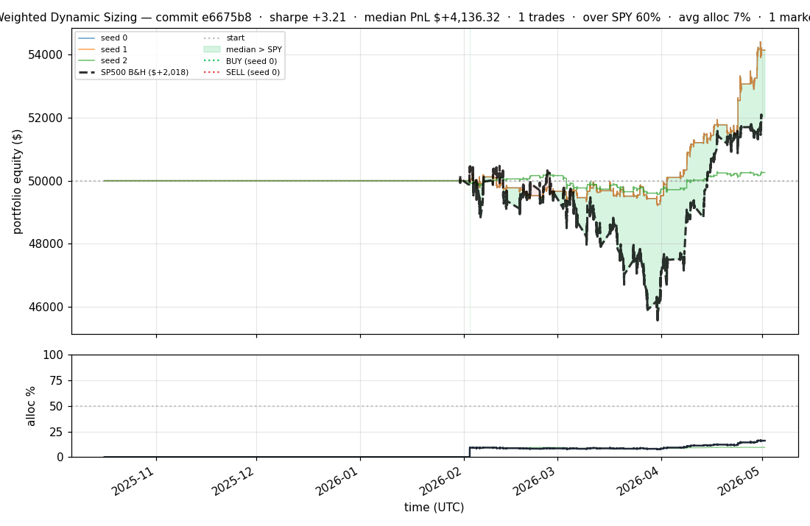
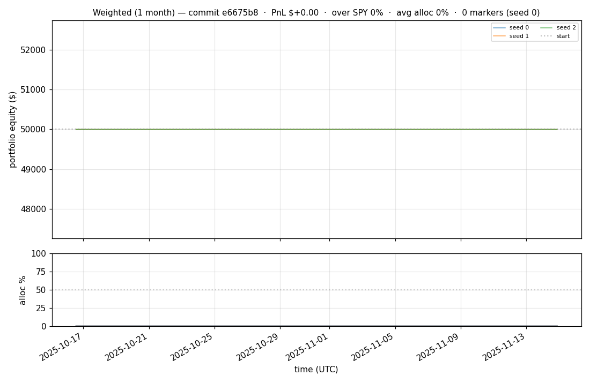
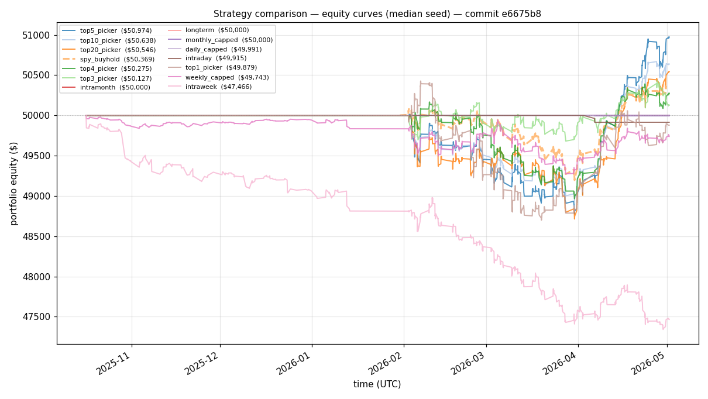
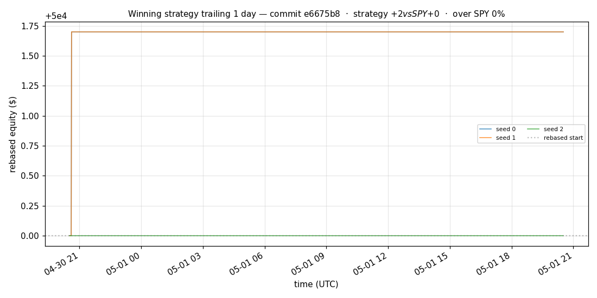
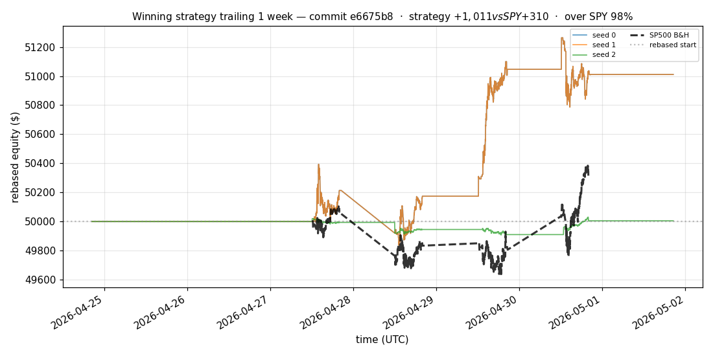
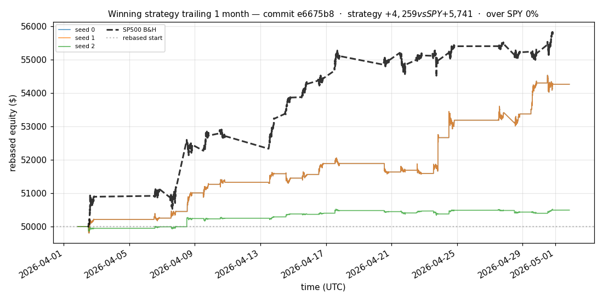
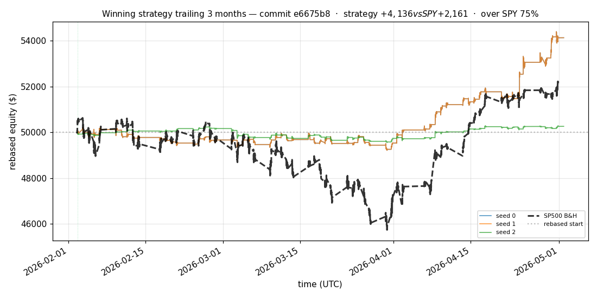
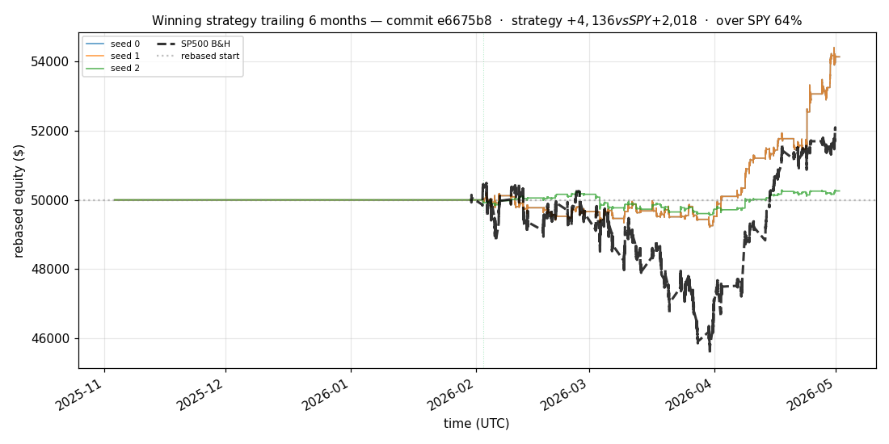

# iter 157 — e6675b8

**🔴 DISCARD** · exp157: top2 with 81.875pct reserve

_2026-05-05 01:51 UTC · 374s wall_

## Result

| metric | value |
|---|---|
| Sharpe (median) | **+3.213** |
| Sharpe CI low (5%) | +0.902 |
| Sharpe CI high (95%) | +5.684 |
| % time above SPY | 59.880% |
| Net PnL | **$+4136.32** (+8.273%) |
| Max drawdown | -1.98% |
| Trades | 1 |
| Fees | $1.00 |
| Seeds completed | 3 |

**Decision reason:** objective=+1.1644 ≤ prior best +1.1645 (ci_low=+0.9020, over_spy=59.9%, pnl=+8.27%)

## Winning strategy

Canonical strategy for this iteration: **top4 cross-sectional picker** — rank symbols by the transformer's 4h + 1d forecast Sharpe, buy the top four once enough symbols are ready, hold through the eval window, and keep 1 median trades after costs.

A **seed** is one independent training/evaluation run with a different random initialization and sampling path. The gate uses median/worst-tail statistics across seeds so one lucky seed cannot define the best checkpoint.

Positive seed transaction tables are shown later in this report; losing or flat seed transaction tables are omitted to keep reports focused on actionable winners.

## Per-seed details

```
[evaluator] seed 0: sharpe=+3.213  dd=-1.98%  pnl=$+4,136.32  trades=1
[evaluator] seed 1: sharpe=+3.213  dd=-1.98%  pnl=$+4,136.32  trades=1
[evaluator] seed 2: sharpe=+0.596  dd=-1.35%  pnl=$+259.72  trades=1
```

## Equity curve (full eval window, ~73 days)



## Equity curve (first month)



## Strategy comparison (equity curves)

Overlays every profile (intraday/intraweek/intramonth/longterm + 
daily-capped/weekly-capped/monthly-capped trade-frequency variants 
+ topN pickers + SPY benchmark) on one chart, using the median-seed run.



## Recent live-style simulations vs SP500

Each chart rebases the winning strategy and SP500 to $50,000 at the start of the trailing window, ending at the latest available bar.

### Trailing 1 day



### Trailing 1 week



### Trailing 1 month



### Trailing 3 months



### Trailing 6 months



## Trader profile comparison

Same trained model, different time-horizon strategies + SPY benchmark + passive top-N pickers.

| profile | sharpe | PnL ($) | PnL % | trades | DD % | horizon |
|---|---:|---:|---:|---:|---:|---:|
| **daily_capped** | -2.008 | $-8.52 | -0.02% | 2 | -0.02% | 1d |
| **intraday** | -12.965 | $-6,764.84 | -13.53% | 4812 | -13.53% | 2h |
| **intramonth** | +0.000 | $+0.00 | +0.00% | 2 | -0.04% | 30d |
| **intraweek** | -5.118 | $-2,656.81 | -5.31% | 981 | -5.47% | 5d |
| **longterm** | +0.000 | $+0.00 | +0.00% | 2 | -0.04% | 30d |
| **monthly_capped** | +0.000 | $+0.00 | +0.00% | 0 | +0.00% | 30d |
| **spy_buyhold** | +0.980 | $+365.54 | +0.73% | 1 | -1.78% | - |
| **top10_picker** | +1.286 | $+1,363.06 | +2.73% | 9 | -2.75% | - |
| **top1_picker** | +0.000 | $+0.00 | +0.00% | 1 | -1.66% | - |
| **top20_picker** | +0.968 | $+698.06 | +1.40% | 19 | -2.62% | - |
| **top3_picker** | +2.288 | $+3,997.42 | +7.99% | 2 | -2.71% | - |
| **top4_picker** | +0.483 | $+260.45 | +0.52% | 3 | -2.45% | - |
| **top5_picker** | +1.521 | $+2,820.63 | +5.64% | 4 | -2.67% | - |
| **weekly_capped** | -0.711 | $-271.44 | -0.54% | 67 | -2.30% | 5d |

**Best active strategy: `top3_picker` (sharpe +2.288) — BEATS SPY ✓**

## Out-of-symbol holdout eval

Tested on **JPM, WMT, V, DIS, JNJ** — large-caps the model NEVER saw during training.

| seed | sharpe | PnL | trades | DD% |
|---:|---:|---:|---:|---:|
| 0 | +0.455 | $+159.86 | 5 | -1.73% |
| 1 | +0.347 | $+122.50 | 11 | -1.74% |
| 2 | +0.455 | $+159.86 | 5 | -1.73% |
| 3 | +0.327 | $+504.54 | 5 | -9.19% |
| 4 | +0.000 | $+0.00 | 0 | +0.00% |

**Median holdout sharpe: +0.347** (vs in-symbol +3.213)

## Transactions

_(no profitable per-seed transaction table; losing/flat seeds omitted)_

## Diff vs previous experiment

```diff
e6675b8 exp157: top2 with 81.875pct reserve


 experiment.py | 4 ++--
 1 file changed, 2 insertions(+), 2 deletions(-)
```

---

[← all iterations](.) · [back to README](../README.md)
