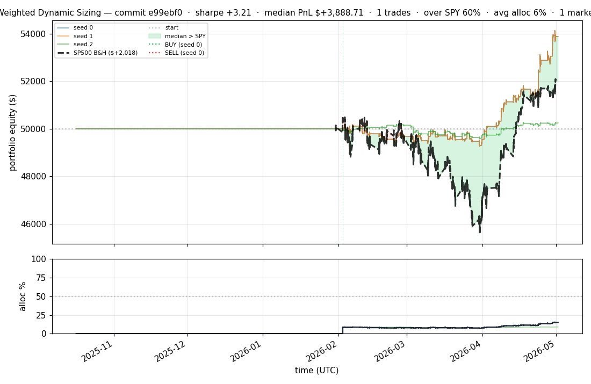
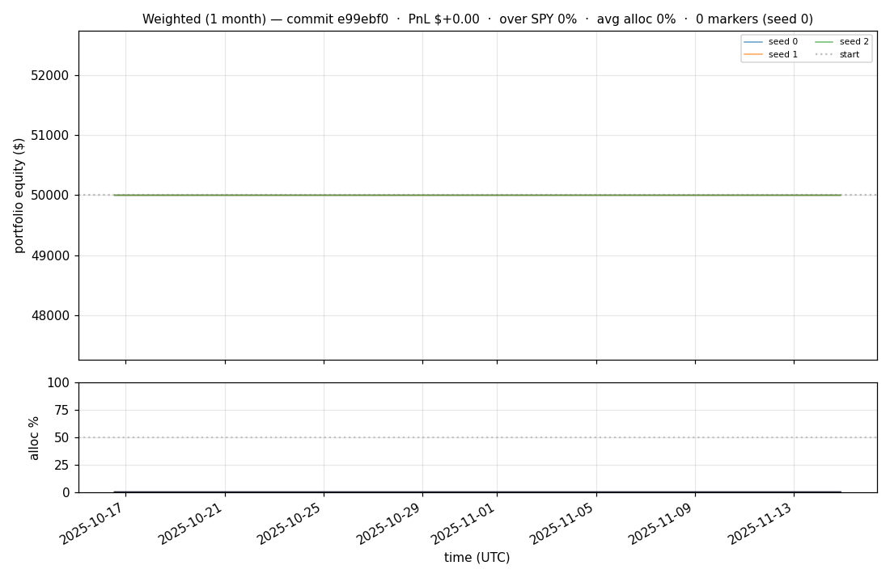
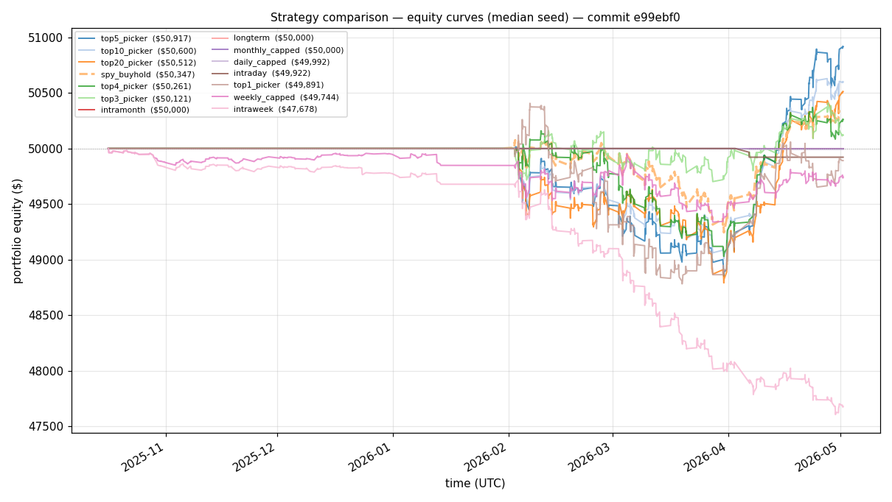
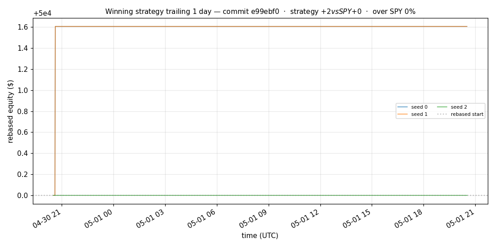
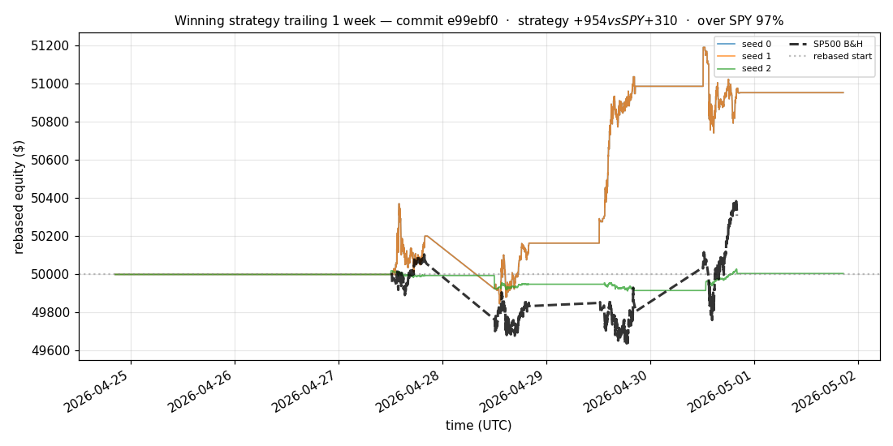
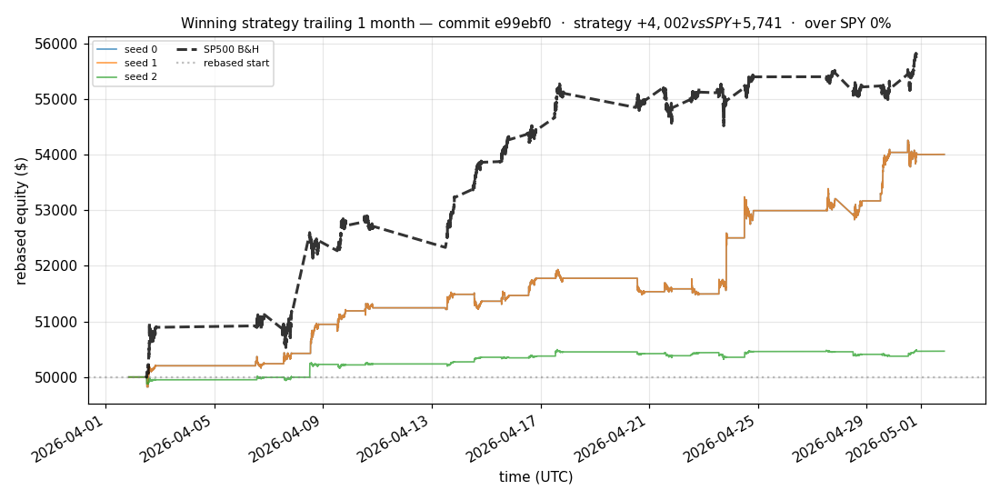
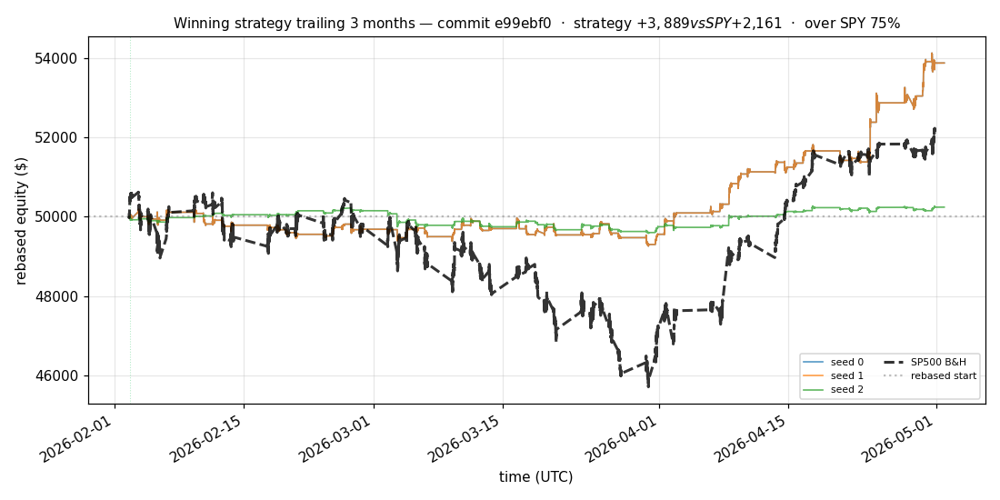
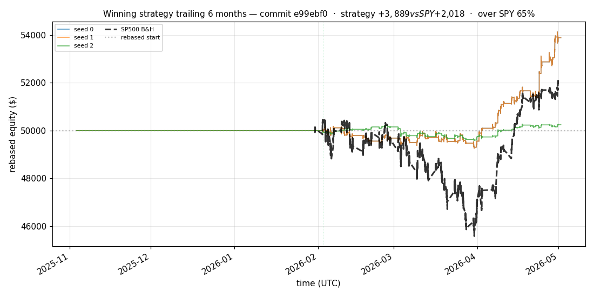

# iter 160 — e99ebf0

**🔴 DISCARD** · exp160: top2 with 82.96875pct reserve

_2026-05-05 02:11 UTC · 372s wall_

## Result

| metric | value |
|---|---|
| Sharpe (median) | **+3.215** |
| Sharpe CI low (5%) | +0.906 |
| Sharpe CI high (95%) | +5.684 |
| % time above SPY | 60.187% |
| Net PnL | **$+3888.71** (+7.777%) |
| Max drawdown | -1.86% |
| Trades | 1 |
| Fees | $1.00 |
| Seeds completed | 3 |

**Decision reason:** objective=+1.1643 ≤ prior best +1.1645 (ci_low=+0.9060, over_spy=60.2%, pnl=+7.78%)

## Winning strategy

Canonical strategy for this iteration: **top4 cross-sectional picker** — rank symbols by the transformer's 4h + 1d forecast Sharpe, buy the top four once enough symbols are ready, hold through the eval window, and keep 1 median trades after costs.

A **seed** is one independent training/evaluation run with a different random initialization and sampling path. The gate uses median/worst-tail statistics across seeds so one lucky seed cannot define the best checkpoint.

Positive seed transaction tables are shown later in this report; losing or flat seed transaction tables are omitted to keep reports focused on actionable winners.

## Per-seed details

```
[evaluator] seed 0: sharpe=+3.215  dd=-1.86%  pnl=$+3,888.71  trades=1
[evaluator] seed 1: sharpe=+3.215  dd=-1.86%  pnl=$+3,888.71  trades=1
[evaluator] seed 2: sharpe=+0.596  dd=-1.27%  pnl=$+243.99  trades=1
```

## Equity curve (full eval window, ~73 days)



## Equity curve (first month)



## Strategy comparison (equity curves)

Overlays every profile (intraday/intraweek/intramonth/longterm + 
daily-capped/weekly-capped/monthly-capped trade-frequency variants 
+ topN pickers + SPY benchmark) on one chart, using the median-seed run.



## Recent live-style simulations vs SP500

Each chart rebases the winning strategy and SP500 to $50,000 at the start of the trailing window, ending at the latest available bar.

### Trailing 1 day



### Trailing 1 week



### Trailing 1 month



### Trailing 3 months



### Trailing 6 months



## Trader profile comparison

Same trained model, different time-horizon strategies + SPY benchmark + passive top-N pickers.

| profile | sharpe | PnL ($) | PnL % | trades | DD % | horizon |
|---|---:|---:|---:|---:|---:|---:|
| **daily_capped** | -2.102 | $-8.05 | -0.02% | 2 | -0.02% | 1d |
| **intraday** | -12.965 | $-6,202.78 | -12.41% | 4401 | -12.41% | 2h |
| **intramonth** | +0.000 | $+0.00 | +0.00% | 2 | -0.04% | 30d |
| **intraweek** | -5.263 | $-2,545.40 | -5.09% | 981 | -5.20% | 5d |
| **longterm** | +0.000 | $+0.00 | +0.00% | 2 | -0.04% | 30d |
| **monthly_capped** | +0.000 | $+0.00 | +0.00% | 0 | +0.00% | 30d |
| **spy_buyhold** | +0.979 | $+343.47 | +0.69% | 1 | -1.67% | - |
| **top10_picker** | +1.287 | $+1,281.88 | +2.56% | 9 | -2.59% | - |
| **top1_picker** | +0.000 | $+0.00 | +0.00% | 1 | -1.57% | - |
| **top20_picker** | +0.967 | $+655.25 | +1.31% | 19 | -2.46% | - |
| **top3_picker** | +2.288 | $+3,758.82 | +7.52% | 2 | -2.54% | - |
| **top4_picker** | +0.487 | $+247.15 | +0.49% | 3 | -2.31% | - |
| **top5_picker** | +1.525 | $+2,652.16 | +5.30% | 4 | -2.51% | - |
| **weekly_capped** | -0.748 | $-269.13 | -0.54% | 67 | -2.15% | 5d |

**Best active strategy: `top3_picker` (sharpe +2.288) — BEATS SPY ✓**

## Out-of-symbol holdout eval

Tested on **JPM, WMT, V, DIS, JNJ** — large-caps the model NEVER saw during training.

| seed | sharpe | PnL | trades | DD% |
|---:|---:|---:|---:|---:|
| 0 | +0.464 | $+153.35 | 5 | -1.63% |
| 1 | +0.363 | $+121.07 | 11 | -1.63% |
| 2 | +0.464 | $+153.35 | 5 | -1.63% |
| 3 | +0.327 | $+504.54 | 5 | -9.19% |
| 4 | +0.000 | $+0.00 | 0 | +0.00% |

**Median holdout sharpe: +0.363** (vs in-symbol +3.215)

## Transactions

_(no profitable per-seed transaction table; losing/flat seeds omitted)_

## Diff vs previous experiment

```diff
e99ebf0 exp160: top2 with 82.96875pct reserve


 experiment.py | 4 ++--
 1 file changed, 2 insertions(+), 2 deletions(-)
```

---

[← all iterations](.) · [back to README](../README.md)
