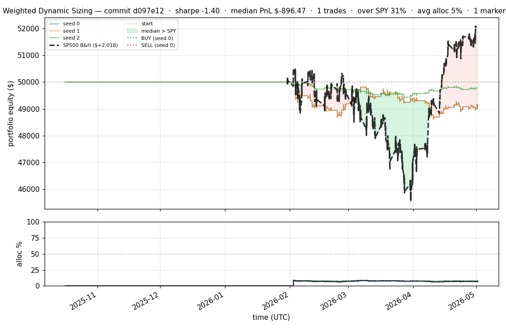
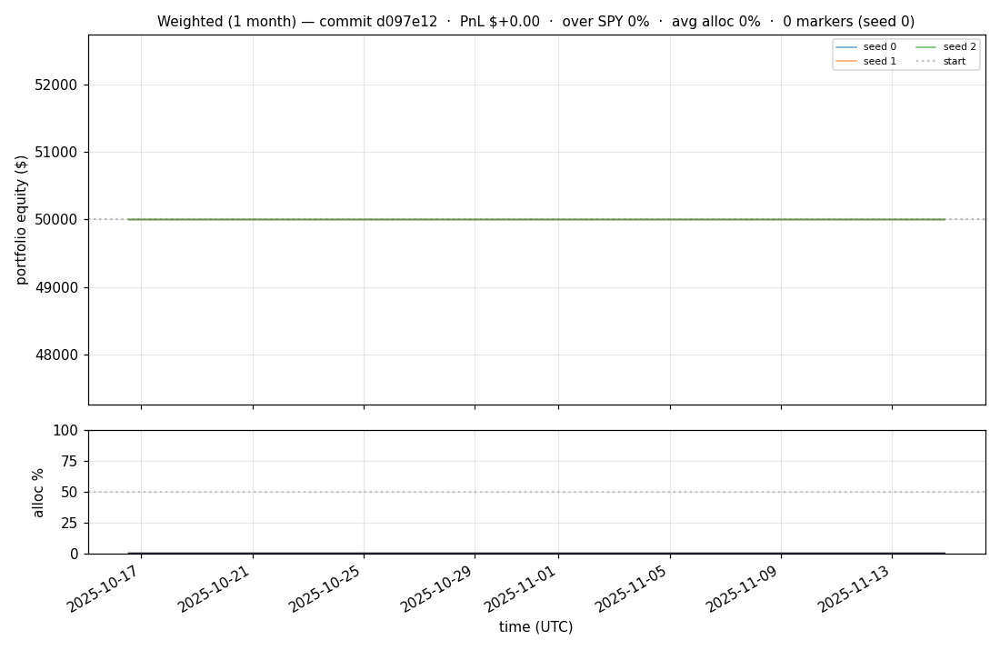
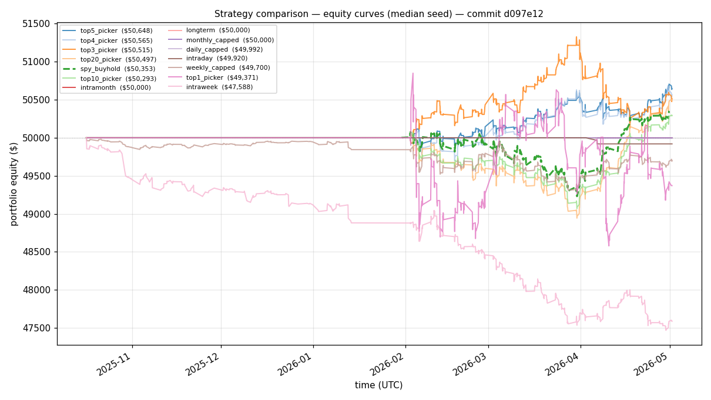
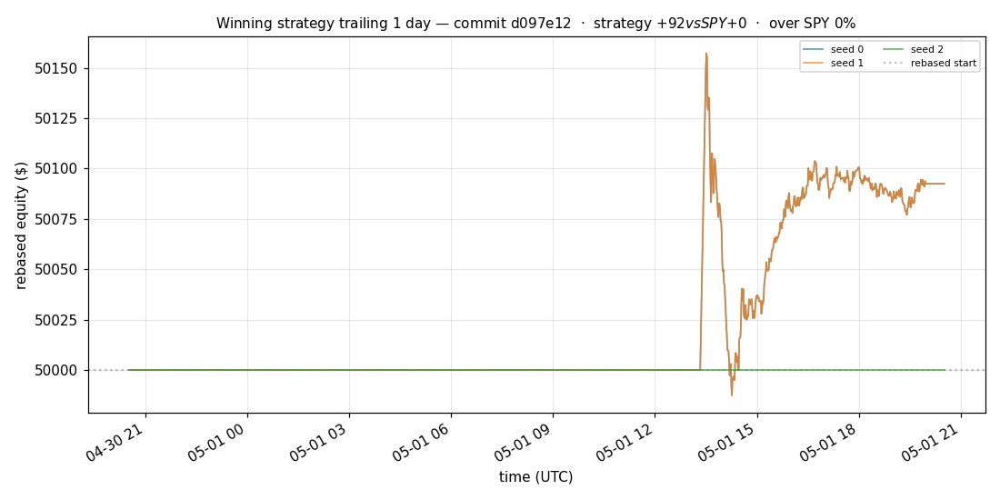
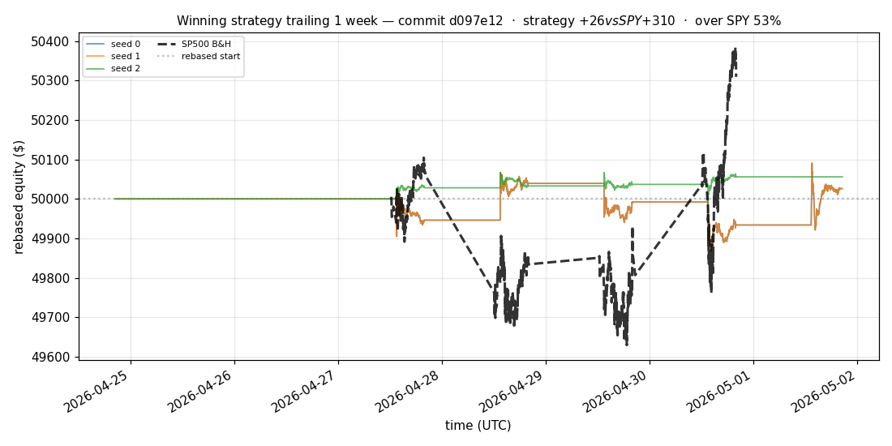
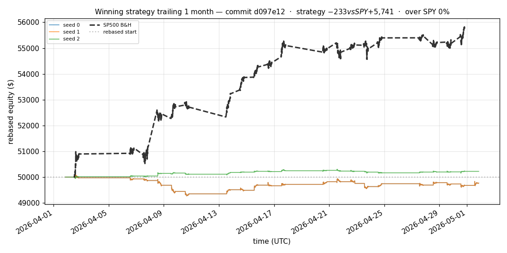
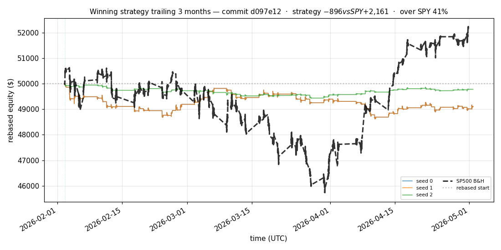
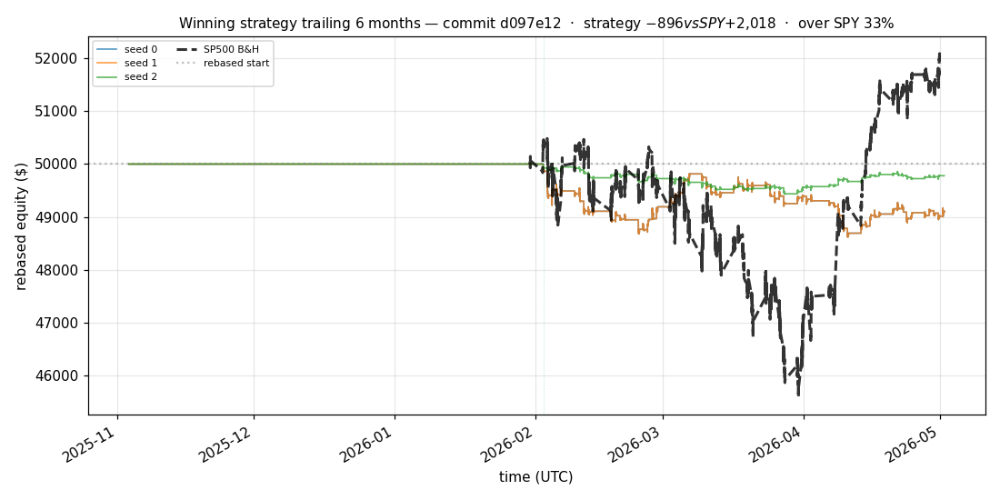

# iter 167 — d097e12

**🔴 DISCARD** · exp167: top2 half-universe readiness

_2026-05-05 03:00 UTC · 372s wall_

## Result

| metric | value |
|---|---|
| Sharpe (median) | **-1.404** |
| Sharpe CI low (5%) | -3.839 |
| Sharpe CI high (95%) | +1.150 |
| % time above SPY | 30.506% |
| Net PnL | **$-896.47** (-1.793%) |
| Max drawdown | -2.77% |
| Trades | 1 |
| Fees | $1.00 |
| Seeds completed | 3 |

**Decision reason:** objective=-3.7654 ≤ prior best +1.1645 (ci_low=-3.8390, over_spy=30.5%, pnl=-1.79%)

## Winning strategy

Canonical strategy for this iteration: **top4 cross-sectional picker** — rank symbols by the transformer's 4h + 1d forecast Sharpe, buy the top four once enough symbols are ready, hold through the eval window, and keep 1 median trades after costs.

A **seed** is one independent training/evaluation run with a different random initialization and sampling path. The gate uses median/worst-tail statistics across seeds so one lucky seed cannot define the best checkpoint.

Positive seed transaction tables are shown later in this report; losing or flat seed transaction tables are omitted to keep reports focused on actionable winners.

## Per-seed details

```
[evaluator] seed 0: sharpe=-1.404  dd=-2.77%  pnl=$-896.47  trades=1
[evaluator] seed 1: sharpe=-1.404  dd=-2.77%  pnl=$-896.47  trades=1
[evaluator] seed 2: sharpe=-0.794  dd=-1.15%  pnl=$-220.64  trades=1
```

## Equity curve (full eval window, ~73 days)



## Equity curve (first month)



## Strategy comparison (equity curves)

Overlays every profile (intraday/intraweek/intramonth/longterm + 
daily-capped/weekly-capped/monthly-capped trade-frequency variants 
+ topN pickers + SPY benchmark) on one chart, using the median-seed run.



## Recent live-style simulations vs SP500

Each chart rebases the winning strategy and SP500 to $50,000 at the start of the trailing window, ending at the latest available bar.

### Trailing 1 day



### Trailing 1 week



### Trailing 1 month



### Trailing 3 months



### Trailing 6 months



## Trader profile comparison

Same trained model, different time-horizon strategies + SPY benchmark + passive top-N pickers.

| profile | sharpe | PnL ($) | PnL % | trades | DD % | horizon |
|---|---:|---:|---:|---:|---:|---:|
| **daily_capped** | -2.102 | $-8.18 | -0.02% | 2 | -0.02% | 1d |
| **intraday** | -12.965 | $-6,206.63 | -12.41% | 4599 | -12.41% | 2h |
| **intramonth** | +0.000 | $+0.00 | +0.00% | 2 | -0.04% | 30d |
| **intraweek** | -5.267 | $-2,596.52 | -5.19% | 981 | -5.30% | 5d |
| **longterm** | +0.000 | $+0.00 | +0.00% | 2 | -0.04% | 30d |
| **monthly_capped** | +0.000 | $+0.00 | +0.00% | 0 | +0.00% | 30d |
| **spy_buyhold** | +0.980 | $+349.78 | +0.70% | 1 | -1.70% | - |
| **top10_picker** | +1.244 | $+1,143.26 | +2.29% | 9 | -2.03% | - |
| **top1_picker** | +0.000 | $+0.00 | +0.00% | 1 | -4.02% | - |
| **top20_picker** | +1.124 | $+636.07 | +1.27% | 19 | -2.23% | - |
| **top3_picker** | +2.214 | $+2,065.31 | +4.13% | 2 | -2.55% | - |
| **top4_picker** | +1.085 | $+555.34 | +1.11% | 3 | -1.64% | - |
| **top5_picker** | +1.455 | $+1,008.72 | +2.02% | 4 | -1.67% | - |
| **weekly_capped** | -0.860 | $-312.75 | -0.63% | 67 | -2.19% | 5d |

**Best active strategy: `top3_picker` (sharpe +2.214) — BEATS SPY ✓**

## Out-of-symbol holdout eval

Tested on **JPM, WMT, V, DIS, JNJ** — large-caps the model NEVER saw during training.

| seed | sharpe | PnL | trades | DD% |
|---:|---:|---:|---:|---:|
| 0 | +0.461 | $+155.25 | 5 | -1.66% |
| 1 | +0.359 | $+121.56 | 11 | -1.66% |
| 2 | +0.461 | $+155.25 | 5 | -1.66% |
| 3 | +0.327 | $+504.54 | 5 | -9.19% |
| 4 | +0.000 | $+0.00 | 0 | +0.00% |

**Median holdout sharpe: +0.359** (vs in-symbol -1.404)

## Transactions

_(no profitable per-seed transaction table; losing/flat seeds omitted)_

## Diff vs previous experiment

```diff
d097e12 exp167: top2 half-universe readiness


 experiment.py | 6 +++---
 1 file changed, 3 insertions(+), 3 deletions(-)
```

---

[← all iterations](.) · [back to README](../README.md)
