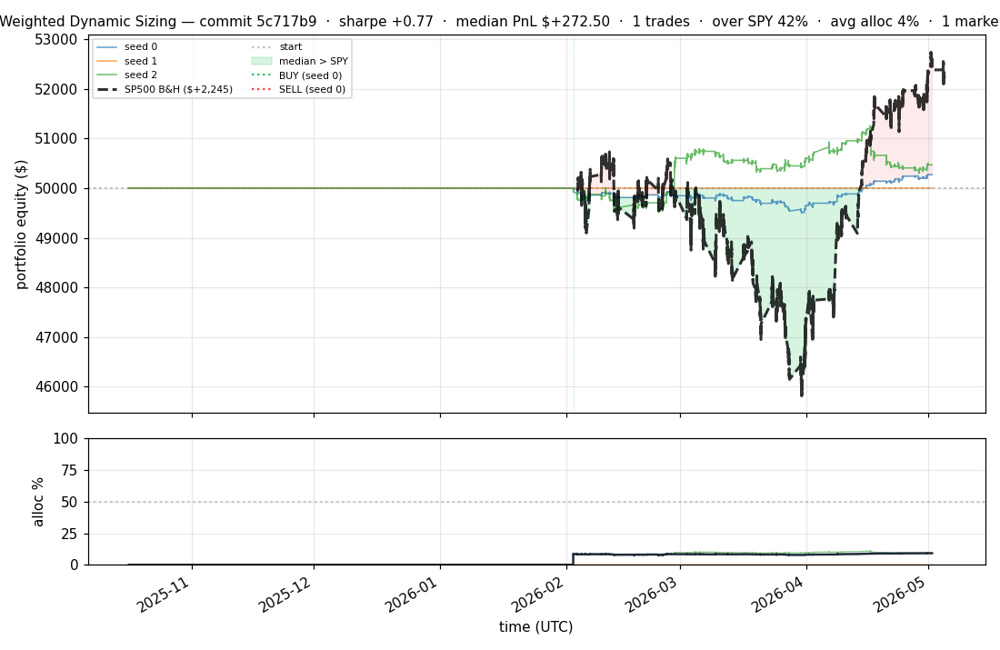
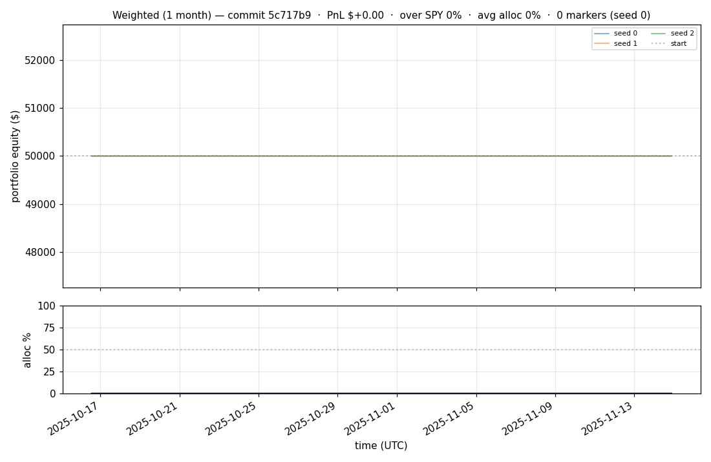
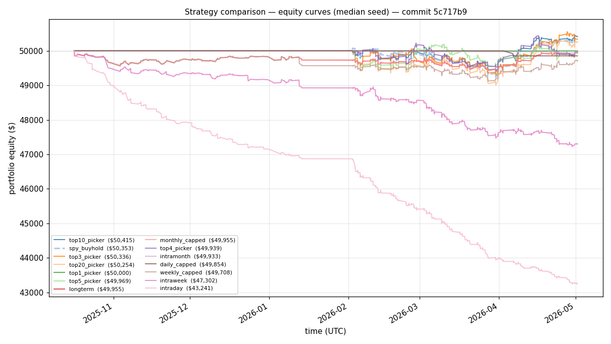
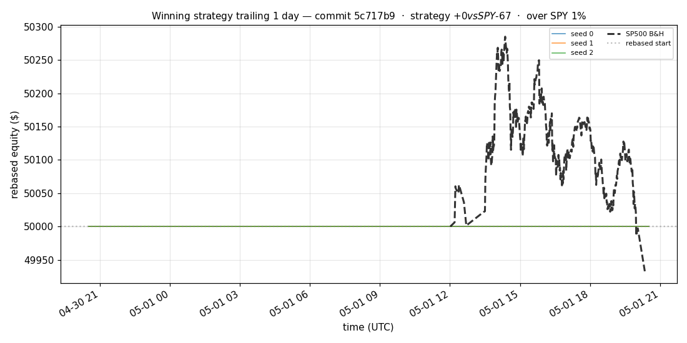
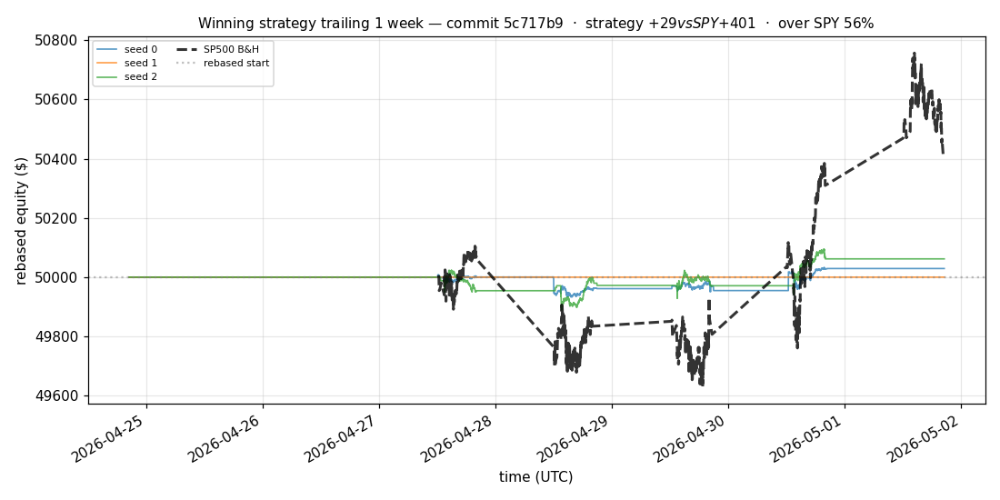
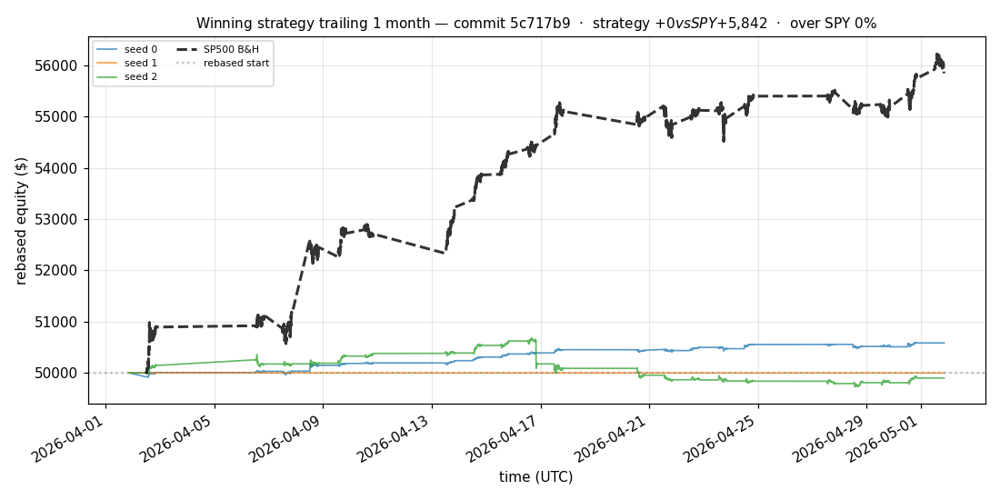
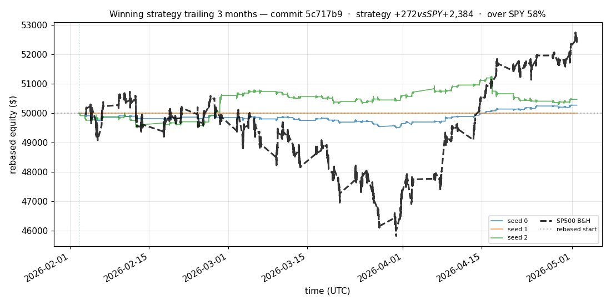
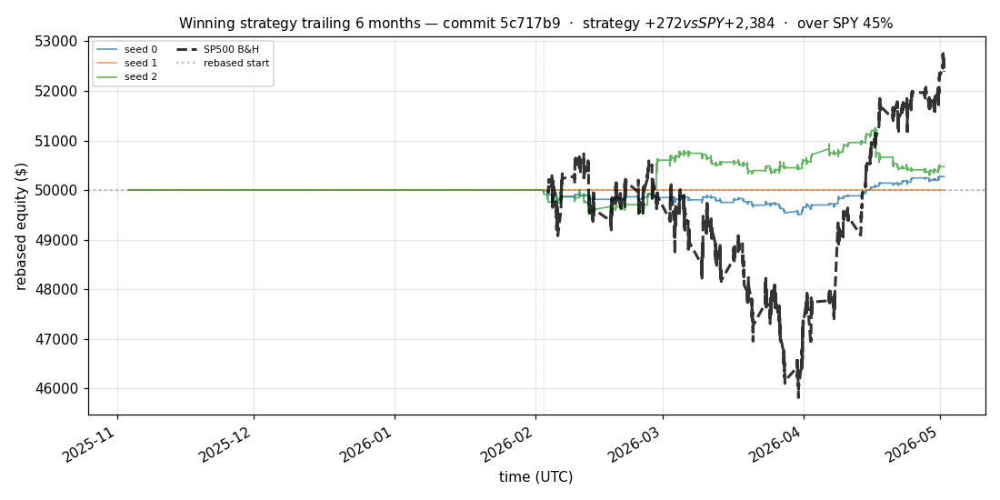

# iter 173 — 5c717b9

**🔴 DISCARD** · exp173: fresh pretrain best top2 strategy

_2026-05-05 05:54 UTC · 8273s wall_

## Result

| metric | value |
|---|---|
| Sharpe (median) | **+0.770** |
| Sharpe CI low (5%) | -1.545 |
| Sharpe CI high (95%) | +3.123 |
| % time above SPY | 41.715% |
| Net PnL | **$+272.50** (+0.545%) |
| Max drawdown | -1.88% |
| Trades | 1 |
| Fees | $1.00 |
| Seeds completed | 3 |

**Decision reason:** objective=-1.4144 ≤ prior best +1.1645 (ci_low=-1.5450, over_spy=41.7%, pnl=+0.55%)

## Winning strategy

Canonical strategy for this iteration: **top4 cross-sectional picker** — rank symbols by the transformer's 4h + 1d forecast Sharpe, buy the top four once enough symbols are ready, hold through the eval window, and keep 1 median trades after costs.

A **seed** is one independent training/evaluation run with a different random initialization and sampling path. The gate uses median/worst-tail statistics across seeds so one lucky seed cannot define the best checkpoint.

Positive seed transaction tables are shown later in this report; losing or flat seed transaction tables are omitted to keep reports focused on actionable winners.

## Per-seed details

```
[evaluator] seed 0: sharpe=+0.915  dd=-1.02%  pnl=$+272.50  trades=1
[evaluator] seed 1: sharpe=+0.000  dd=+0.00%  pnl=$+0.00  trades=0
[evaluator] seed 2: sharpe=+0.770  dd=-1.88%  pnl=$+469.67  trades=1
```

## Equity curve (full eval window, ~73 days)



## Equity curve (first month)



## Strategy comparison (equity curves)

Overlays every profile (intraday/intraweek/intramonth/longterm + 
daily-capped/weekly-capped/monthly-capped trade-frequency variants 
+ topN pickers + SPY benchmark) on one chart, using the median-seed run.



## Recent live-style simulations vs SP500

Each chart rebases the winning strategy and SP500 to $50,000 at the start of the trailing window, ending at the latest available bar.

### Trailing 1 day



### Trailing 1 week



### Trailing 1 month



### Trailing 3 months



### Trailing 6 months



## Trader profile comparison

Same trained model, different time-horizon strategies + SPY benchmark + passive top-N pickers.

| profile | sharpe | PnL ($) | PnL % | trades | DD % | horizon |
|---|---:|---:|---:|---:|---:|---:|
| **daily_capped** | -1.627 | $-145.60 | -0.29% | 6 | -0.29% | 1d |
| **intraday** | -14.249 | $-6,926.23 | -13.85% | 2640 | -13.85% | 2h |
| **intramonth** | -2.101 | $-282.74 | -0.57% | 56 | -0.57% | 30d |
| **intraweek** | -5.869 | $-3,086.48 | -6.17% | 662 | -6.44% | 5d |
| **longterm** | -0.169 | $-44.87 | -0.09% | 6 | -0.57% | 30d |
| **monthly_capped** | -0.169 | $-44.87 | -0.09% | 6 | -0.13% | 30d |
| **spy_buyhold** | +0.980 | $+349.78 | +0.70% | 1 | -1.70% | - |
| **top10_picker** | +1.244 | $+688.61 | +1.38% | 9 | -1.71% | - |
| **top1_picker** | +0.000 | $+0.00 | +0.00% | 0 | +0.00% | - |
| **top20_picker** | +0.539 | $+594.34 | +1.19% | 19 | -2.14% | - |
| **top3_picker** | +0.906 | $+354.64 | +0.71% | 2 | -1.75% | - |
| **top4_picker** | -0.116 | $-60.92 | -0.12% | 3 | -1.58% | - |
| **top5_picker** | +0.861 | $+373.84 | +0.75% | 4 | -1.53% | - |
| **weekly_capped** | -1.549 | $-308.27 | -0.62% | 65 | -1.78% | 5d |

**Best active strategy: `top10_picker` (sharpe +1.244) — BEATS SPY ✓**

## Out-of-symbol holdout eval

Tested on **JPM, WMT, V, DIS, JNJ** — large-caps the model NEVER saw during training.

| seed | sharpe | PnL | trades | DD% |
|---:|---:|---:|---:|---:|
| 0 | +0.344 | $+113.87 | 9 | -1.59% |
| 1 | +0.461 | $+155.25 | 5 | -1.66% |
| 2 | +0.000 | $+0.00 | 0 | +0.00% |
| 3 | +0.327 | $+504.54 | 5 | -9.19% |
| 4 | +0.000 | $+0.00 | 0 | +0.00% |

**Median holdout sharpe: +0.327** (vs in-symbol +0.770)

## Transactions

_(no profitable per-seed transaction table; losing/flat seeds omitted)_

## Diff vs previous experiment

```diff
5c717b9 exp173: fresh pretrain best top2 strategy


 experiment.py | 6 +++---
 1 file changed, 3 insertions(+), 3 deletions(-)
```

---

[← all iterations](.) · [back to README](../README.md)
